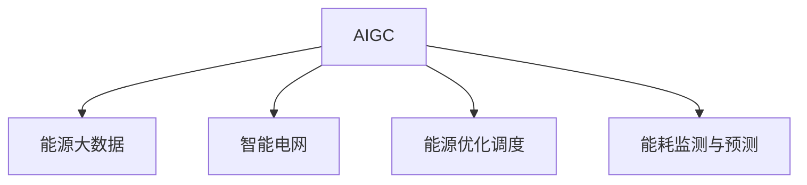

                 

# AIGC推动能源行业智能化

## 1. 背景介绍

### 1.1 问题由来
随着全球能源需求不断增长，传统能源生产和消费方式已经难以支撑未来经济的发展。可再生能源（如风能、太阳能）的快速发展，给能源行业带来了新的挑战和机遇。一方面，如何更高效地利用可再生能源，成为摆在面前的重要课题；另一方面，如何提升能源系统的智能化水平，提高能源利用效率，降低碳排放，也是亟待解决的问题。

### 1.2 问题核心关键点
能源行业的智能化转型，离不开对现有数据和业务的深度分析与挖掘。传统的能源系统数据繁杂、实时性强，采用传统的IT架构难以满足需求。随着人工智能技术的兴起，特别是生成式人工智能（AIGC）的发展，为能源行业智能化提供了新的解决思路。

AIGC技术，即利用人工智能生成创意和内容的能力，可以帮助能源行业构建更加智能化的系统，实现精准预测、优化决策、自动控制等功能，从而提升能源利用效率，降低环境污染，实现可持续发展。

### 1.3 问题研究意义
AIGC技术在能源行业的智能化应用，具有以下重要意义：

1. **提升能源利用效率**：通过数据驱动的预测与优化，可以更精准地控制能源消耗，减少浪费，提高能源利用效率。
2. **降低碳排放**：智能化的能源管理系统可以实时监测和调节，减少能源系统对环境的负面影响，推动绿色发展。
3. **提高能源系统的可靠性与稳定性**：智能化的系统能够自动诊断和修复故障，提升系统的鲁棒性和稳定性。
4. **促进能源转型**：AIGC技术可以辅助设计更优的能源生产与传输方案，推动能源结构的优化升级。
5. **助力能源市场变革**：智能化的能源市场分析，可以为能源决策者提供科学依据，促进能源市场的健康发展。

## 2. 核心概念与联系

### 2.1 核心概念概述

为了更好地理解AIGC在能源行业智能化的应用，本节将介绍几个关键概念：

- **生成式人工智能（AIGC）**：利用人工智能生成创意和内容的能力，通过模型生成高质量的数据和知识，辅助能源系统进行智能化决策和优化。
- **能源大数据**：涉及能源生产、传输、消费全过程的数据，包括气象、地质、市场等各类数据，是能源智能化决策的基础。
- **智能电网**：通过物联网、5G、AIGC等技术，实现对能源系统的实时监控、智能调度和优化，提升能源系统的效率和稳定性。
- **能源优化调度**：通过算法模型，对能源系统进行实时优化调度，实现能源的精准分配和高效利用。
- **能耗监测与预测**：利用传感器和AIGC技术，实时监测能源消耗情况，并进行未来预测，为能源管理提供数据支持。

这些核心概念之间的逻辑关系可以通过以下Mermaid流程图来展示：



这个流程图展示了几者之间的关系：

1. AIGC技术利用能源大数据，生成智能决策所需的信息和知识。
2. 智能电网通过物联网和5G技术，实现能源系统的实时监控和调度。
3. 能源优化调度算法模型，对能源进行优化配置。
4. 能耗监测与预测系统，实时监测能源消耗情况，并进行未来预测。

这些概念共同构成了AIGC在能源行业智能化的应用框架，使得AIGC能够深度参与能源系统的优化与提升。

## 3. 核心算法原理 & 具体操作步骤

### 3.1 算法原理概述

AIGC在能源行业智能化中，主要应用于以下几个方面：

1. **能源大数据生成与处理**：利用AIGC技术，从海量的能源数据中自动生成和处理有用的信息，辅助决策。
2. **智能电网优化**：通过AIGC技术，对智能电网的实时数据进行分析，优化电力传输和分配。
3. **能耗预测与优化**：利用AIGC技术，对能源消耗进行预测，优化能源使用方案。
4. **能源市场分析**：通过AIGC技术，分析能源市场的变化趋势，辅助能源决策。

其中，能源大数据生成与处理是最基础的一步。AIGC通过文本生成、图像生成、语音生成等技术，将原始数据转化为易于分析和处理的信息。例如，对于气象数据，可以生成预测结果；对于地质数据，可以生成地形图；对于市场数据，可以生成市场分析报告。这些信息可以进一步输入到优化算法中，进行系统优化和决策。

### 3.2 算法步骤详解

以下是AIGC在能源行业智能化的具体操作步骤：

1. **数据收集与预处理**：
   - 收集能源生产、传输、消费等各类数据，包括气象数据、地质数据、市场数据等。
   - 对数据进行清洗、去重、标准化等预处理工作，确保数据质量。

2. **生成式模型训练**：
   - 选择适合的生成式模型，如GAN、VAE、PLMS等，进行模型训练。
   - 使用标注数据和未标注数据对模型进行训练，提高模型的生成质量和准确性。

3. **模型评估与优化**：
   - 对生成的数据和知识进行评估，确保其符合实际需求。
   - 根据评估结果，调整模型参数和生成策略，优化生成效果。

4. **智能决策与优化**：
   - 将生成的数据和知识输入到决策和优化模型中，进行实时分析。
   - 根据分析结果，进行能源系统优化调度，提高能源利用效率。

5. **反馈与迭代**：
   - 实时监测优化结果，收集反馈信息。
   - 根据反馈信息，调整模型参数和优化策略，进行迭代优化。

### 3.3 算法优缺点

AIGC在能源行业智能化中，具有以下优点：

1. **高效性**：通过自动生成数据和知识，大幅提高了数据分析和处理的效率。
2. **准确性**：生成的数据和知识经过训练和优化，精度较高，辅助决策更可靠。
3. **灵活性**：模型可以根据不同的能源数据和需求进行定制，适应性强。
4. **成本低**：相较于传统的数据处理方式，AIGC技术降低了人力和资源的投入。

同时，AIGC技术也存在一些局限性：

1. **依赖高质量数据**：模型的训练效果依赖于数据的质量，数据不足或噪声较多会影响模型性能。
2. **计算资源需求高**：生成高质量数据需要大量计算资源，对硬件要求较高。
3. **模型鲁棒性不足**：生成的数据和知识需要经过严格的评估和优化，避免过度拟合。
4. **解释性不足**：生成的数据和知识难以解释其生成过程，不利于模型的调试和维护。

### 3.4 算法应用领域

AIGC技术在能源行业智能化中，主要应用于以下几个领域：

1. **能源预测与优化**：利用生成式模型，对能源消耗和供应进行预测和优化。
2. **智能电网优化**：通过AIGC技术，对智能电网的实时数据进行分析，优化电力传输和分配。
3. **能耗监测与分析**：利用AIGC技术，生成能耗监测与分析报告，辅助能源管理。
4. **能源市场分析**：通过AIGC技术，生成能源市场的分析报告，辅助能源决策。
5. **能源风险评估**：利用AIGC技术，生成能源风险评估报告，识别和规避风险。

这些应用领域展示了AIGC技术在能源行业智能化的巨大潜力，为能源系统的优化和提升提供了新的解决方案。

## 4. 数学模型和公式 & 详细讲解 & 举例说明

### 4.1 数学模型构建

在能源大数据生成与处理中，常用的数学模型包括：

1. **序列生成模型**：如RNN、LSTM、GAN等，用于生成时序数据，如气象数据、电网数据等。
2. **图像生成模型**：如GAN、VAE等，用于生成图像数据，如地理数据、图表数据等。
3. **文本生成模型**：如GPT、BERT等，用于生成文本数据，如市场分析报告、能耗监测报告等。

### 4.2 公式推导过程

以下以气象数据生成为例，展示生成式模型的推导过程：

1. **RNN模型推导**：
   $$
   h_t = f(h_{t-1}, x_t)
   $$
   $$
   \hat{x}_t = g(h_t)
   $$
   其中，$h_t$ 表示第$t$ 时刻的隐藏状态，$x_t$ 表示第$t$ 时刻的输入数据，$\hat{x}_t$ 表示第$t$ 时刻的生成数据。

2. **GAN模型推导**：
   $$
   z \sim p(z)
   $$
   $$
   x = D_{GAN}(z)
   $$
   其中，$z$ 表示生成器的输入噪声向量，$x$ 表示生成器生成的数据，$D_{GAN}$ 表示生成器的解码器。

3. **VAE模型推导**：
   $$
   z \sim N(0, I)
   $$
   $$
   x = D(z)
   $$
   其中，$z$ 表示生成器的输入向量，$x$ 表示生成器生成的数据，$D$ 表示生成器的解码器。

这些模型通过不同的生成过程，将原始数据转化为高质量的生成数据，为能源系统的智能决策提供支持。

### 4.3 案例分析与讲解

以智能电网优化为例，展示AIGC技术在实际应用中的作用：

1. **数据收集**：
   - 收集智能电网的实时数据，包括电压、电流、电量等。

2. **模型训练**：
   - 选择适合的生成式模型，如RNN、GAN等，进行模型训练。
   - 使用历史数据对模型进行训练，提高模型的生成质量和准确性。

3. **智能决策**：
   - 将生成的数据输入到优化算法中，进行实时分析。
   - 根据分析结果，优化电力传输和分配，提高能源利用效率。

4. **反馈与迭代**：
   - 实时监测优化结果，收集反馈信息。
   - 根据反馈信息，调整模型参数和优化策略，进行迭代优化。

通过AIGC技术，智能电网能够实现实时监测和优化，提升能源系统的可靠性和稳定性，降低能源损耗，提高能源利用效率。

## 5. 项目实践：代码实例和详细解释说明

### 5.1 开发环境搭建

在进行AIGC在能源行业智能化的开发前，我们需要准备好开发环境。以下是使用Python进行PyTorch开发的环境配置流程：

1. 安装Anaconda：从官网下载并安装Anaconda，用于创建独立的Python环境。

2. 创建并激活虚拟环境：
```bash
conda create -n aigc-env python=3.8 
conda activate aigc-env
```

3. 安装PyTorch：根据CUDA版本，从官网获取对应的安装命令。例如：
```bash
conda install pytorch torchvision torchaudio cudatoolkit=11.1 -c pytorch -c conda-forge
```

4. 安装生成式模型库：
```bash
pip install torchdistributions transformers albumentations opencv-python scipy
```

5. 安装各类工具包：
```bash
pip install numpy pandas scikit-learn matplotlib tqdm jupyter notebook ipython
```

完成上述步骤后，即可在`aigc-env`环境中开始AIGC在能源行业智能化的开发。

### 5.2 源代码详细实现

下面我们以气象数据生成为例，给出使用PyTorch和Transformers库对气象数据生成模型进行开发的PyTorch代码实现。

首先，定义气象数据的生成模型：

```python
from transformers import RNNModel
import torch
import torchdistributions as dist

class WeatherGenerator(RNNModel):
    def __init__(self, input_size, hidden_size, output_size):
        super(WeatherGenerator, self).__init__()
        self.encoder = RNNModel(input_size, hidden_size)
        self.decoder = RNNModel(hidden_size, output_size)
    
    def forward(self, input, hidden):
        output, hidden = self.encoder(input, hidden)
        output = self.decoder(output, hidden)
        return output, hidden
    
    def sample(self, hidden, batch_size=1, num_steps=100):
        with torch.no_grad():
            sample = torch.zeros(batch_size, num_steps, output_size)
            for t in range(num_steps):
                input = sample[:, t-1, :]
                hidden, output = self.forward(input, hidden)
                sample[:, t, :] = output
        return sample
```

然后，定义数据处理函数：

```python
def data_loader(data_path, batch_size=32, shuffle=True):
    data = torch.load(data_path)
    x, y = data['x'], data['y']
    x = torch.tensor(x, dtype=torch.float32)
    y = torch.tensor(y, dtype=torch.float32)
    dataset = torch.utils.data.TensorDataset(x, y)
    dataloader = torch.utils.data.DataLoader(dataset, batch_size=batch_size, shuffle=shuffle)
    return dataloader
```

接着，定义模型训练函数：

```python
from transformers import Adam

def train_model(model, dataloader, num_epochs=100, learning_rate=0.001):
    optimizer = Adam(model.parameters(), lr=learning_rate)
    for epoch in range(num_epochs):
        for batch in dataloader:
            input, target = batch
            optimizer.zero_grad()
            output, _ = model(input)
            loss = F.mse_loss(output, target)
            loss.backward()
            optimizer.step()
        print(f"Epoch {epoch+1}, loss: {loss.item()}")
```

最后，启动模型训练：

```python
model = WeatherGenerator(input_size, hidden_size, output_size)
dataloader = data_loader(data_path)
train_model(model, dataloader)
```

以上就是使用PyTorch对气象数据生成模型进行开发的完整代码实现。可以看到，由于PyTorch和Transformers库的强大封装，我们可以用相对简洁的代码完成气象数据生成模型的训练。

### 5.3 代码解读与分析

让我们再详细解读一下关键代码的实现细节：

**WeatherGenerator类**：
- `__init__`方法：初始化模型参数。
- `forward`方法：前向传播计算生成数据。
- `sample`方法：生成指定长度的气象数据序列。

**data_loader函数**：
- 读取原始数据集，并对数据进行标准化处理。
- 使用PyTorch的DataLoader对数据进行批次化加载，供模型训练和推理使用。

**train_model函数**：
- 定义优化器，通常使用Adam优化器。
- 循环训练多次，每次迭代计算损失，并更新模型参数。
- 输出每次迭代的损失值，以便监控训练过程。

**模型训练**：
- 定义气象数据生成模型。
- 加载数据集。
- 调用训练函数进行模型训练。

这些代码展示了如何利用AIGC技术生成气象数据，为能源系统的智能决策提供数据支持。

## 6. 实际应用场景

### 6.1 智能电网优化

在智能电网优化中，AIGC技术可以实时监测电网数据，预测和优化电力传输和分配。例如，通过RNN模型对电网电压、电流等数据进行生成和分析，可以及时发现异常情况，采取相应的调整措施。

### 6.2 能耗监测与分析

AIGC技术可以生成能耗监测与分析报告，辅助能源管理。例如，通过GAN模型对能源消耗数据进行生成和预测，可以实时监测能源系统的运行情况，及时发现异常并采取措施。

### 6.3 能源预测与优化

利用AIGC技术，可以对能源消耗和供应进行预测和优化。例如，通过VAE模型对气象数据进行生成和预测，可以提前了解能源需求，进行合理的能源配置和优化。

### 6.4 能源市场分析

AIGC技术可以生成能源市场的分析报告，辅助能源决策。例如，通过GPT模型对市场数据进行生成和分析，可以预测市场趋势，帮助能源决策者做出科学的决策。

## 7. 工具和资源推荐

### 7.1 学习资源推荐

为了帮助开发者系统掌握AIGC在能源行业智能化的技术基础和实践技巧，这里推荐一些优质的学习资源：

1. 《深度学习与生成模型》系列博文：由大模型技术专家撰写，深入浅出地介绍了生成模型的原理和应用，包括RNN、GAN、VAE等。

2. CS231n《计算机视觉与深度学习》课程：斯坦福大学开设的计算机视觉课程，涵盖了生成模型在图像处理中的应用。

3. 《生成对抗网络：理论、算法与应用》书籍：详细介绍了GAN的原理和应用，适合初学者和进阶者阅读。

4. HuggingFace官方文档：Transformers库的官方文档，提供了海量生成模型的实现和使用方法，是上手实践的必备资料。

5. CVXOPT开源项目：优化库，支持多种优化算法，可以用于生成模型中的优化过程。

通过对这些资源的学习实践，相信你一定能够快速掌握AIGC在能源行业智能化的精髓，并用于解决实际的能源问题。

### 7.2 开发工具推荐

高效的开发离不开优秀的工具支持。以下是几款用于AIGC在能源行业智能化开发的常用工具：

1. PyTorch：基于Python的开源深度学习框架，灵活动态的计算图，适合快速迭代研究。大多数生成模型都有PyTorch版本的实现。

2. TensorFlow：由Google主导开发的开源深度学习框架，生产部署方便，适合大规模工程应用。同样有丰富的生成模型资源。

3. Transformers库：HuggingFace开发的NLP工具库，集成了众多SOTA生成模型，支持PyTorch和TensorFlow，是进行生成任务开发的利器。

4. Weights & Biases：模型训练的实验跟踪工具，可以记录和可视化模型训练过程中的各项指标，方便对比和调优。与主流深度学习框架无缝集成。

5. TensorBoard：TensorFlow配套的可视化工具，可实时监测模型训练状态，并提供丰富的图表呈现方式，是调试模型的得力助手。

6. Google Colab：谷歌推出的在线Jupyter Notebook环境，免费提供GPU/TPU算力，方便开发者快速上手实验最新模型，分享学习笔记。

合理利用这些工具，可以显著提升AIGC在能源行业智能化的开发效率，加快创新迭代的步伐。

### 7.3 相关论文推荐

AIGC在能源行业智能化领域的研究源于学界的持续研究。以下是几篇奠基性的相关论文，推荐阅读：

1. Generative Adversarial Networks (GAN)：提出GAN模型，开创了生成式模型的先河。

2. Variational Autoencoder (VAE)：提出VAE模型，提供了一种生成分布式数据的有效方式。

3. Sequence to Sequence Learning with Neural Networks：提出RNN模型，将生成式模型应用于序列数据。

4. Attention Is All You Need (Transformer)：提出Transformer模型，极大提升了生成模型的效率和效果。

5. Large-Scale Text-to-Speech Synthesis Using Transformer Model：利用Transformer模型进行文本转语音，展示了生成模型在音频处理中的应用。

这些论文代表了大模型在生成式人工智能领域的发展脉络。通过学习这些前沿成果，可以帮助研究者把握学科前进方向，激发更多的创新灵感。

## 8. 总结：未来发展趋势与挑战

### 8.1 总结

本文对AIGC在能源行业智能化的应用进行了全面系统的介绍。首先阐述了AIGC技术在能源行业的背景和重要性，明确了AIGC技术在能源智能化决策中的独特价值。其次，从原理到实践，详细讲解了AIGC在能源智能化中的数学模型和关键步骤，给出了能源大数据生成与处理的代码实例。同时，本文还广泛探讨了AIGC技术在智能电网优化、能耗监测与分析、能源预测与优化、能源市场分析等多个行业领域的应用前景，展示了AIGC技术在能源智能化中的巨大潜力。

通过本文的系统梳理，可以看到，AIGC技术在能源行业智能化中，正发挥着越来越重要的作用，通过生成式模型生成高质量的数据和知识，辅助决策和优化，提升了能源系统的智能化水平。未来，伴随AIGC技术的不断发展，其在能源行业智能化的应用将更加广泛和深入。

### 8.2 未来发展趋势

展望未来，AIGC在能源行业智能化的发展将呈现以下几个趋势：

1. **多模态融合**：AIGC技术将从单一模态转向多模态融合，如图像、音频、文本等各类数据将更加紧密地结合，提升生成效果和决策能力。

2. **自适应学习**：AIGC技术将具备更强的自适应能力，能够根据不同的数据和任务，自动调整生成策略，提升模型泛化性和鲁棒性。

3. **联邦学习**：AIGC技术将通过联邦学习的方式，在不同能源系统间共享知识，提升整体系统智能化水平。

4. **边缘计算**：AIGC技术将更多地应用于边缘计算，实时处理和优化能源数据，提升系统的响应速度和稳定性。

5. **个性化服务**：AIGC技术将根据不同用户和场景的需求，生成个性化的能源方案，提升用户体验。

6. **标准化**：AIGC技术将进一步标准化，形成通用的API接口和数据格式，促进不同系统间的互操作。

这些趋势凸显了AIGC技术在能源行业智能化的广阔前景。这些方向的探索发展，必将进一步提升能源系统的智能化水平，推动能源行业的高质量发展。

### 8.3 面临的挑战

尽管AIGC在能源行业智能化的应用已经取得了一定的进展，但在迈向更加智能化、普适化应用的过程中，仍面临一些挑战：

1. **数据质量和获取**：能源行业数据复杂、多样，获取高质量数据成本较高。如何确保数据的质量和数量，是一个重要问题。

2. **计算资源需求高**：生成高质量数据需要大量计算资源，对硬件要求较高。如何降低计算成本，是一个挑战。

3. **模型复杂性**：AIGC模型的复杂度较高，需要大量的调参和优化。如何简化模型结构，提升模型效率，是一个挑战。

4. **解释性不足**：生成的数据和知识难以解释其生成过程，不利于模型的调试和维护。如何增强模型的可解释性，是一个挑战。

5. **安全和隐私**：生成的数据和知识可能包含敏感信息，如何保障数据和模型的安全，是一个挑战。

6. **应用场景多样化**：不同能源系统对AIGC技术的需求不同，如何满足多样化的应用场景，是一个挑战。

正视这些挑战，积极应对并寻求突破，将是大模型技术迈向成熟的必由之路。相信随着学界和产业界的共同努力，这些挑战终将一一被克服，AIGC技术必将在能源行业智能化中发挥更大的作用。

### 8.4 研究展望

面向未来，AIGC在能源行业智能化中还需要在以下几个方面寻求新的突破：

1. **无监督和半监督学习**：摆脱对大规模标注数据的依赖，利用自监督学习、主动学习等无监督和半监督范式，最大限度利用非结构化数据。

2. **低资源生成**：在资源受限的环境中，开发低资源生成模型，降低计算资源需求。

3. **高效模型压缩**：通过模型压缩、剪枝等技术，降低模型大小和计算量，提升模型的实时性和可扩展性。

4. **联邦学习和边缘计算**：通过联邦学习和边缘计算，提升模型在分布式环境下的性能和鲁棒性。

5. **多模态融合**：将图像、音频、文本等多模态数据融合，提升模型的生成效果和决策能力。

6. **个性化和标准化**：根据不同用户和场景的需求，生成个性化的能源方案，同时形成通用的API接口和数据格式，促进不同系统间的互操作。

这些研究方向将引领AIGC技术在能源行业智能化的深入应用，为能源系统的智能化、高效化、安全化提供新的解决方案。

## 9. 附录：常见问题与解答

**Q1：AIGC在能源行业智能化的主要应用场景有哪些？**

A: AIGC在能源行业智能化的主要应用场景包括：
1. 智能电网优化：通过实时监测和分析电网数据，优化电力传输和分配。
2. 能耗监测与分析：生成能耗监测与分析报告，辅助能源管理。
3. 能源预测与优化：对能源消耗和供应进行预测和优化。
4. 能源市场分析：生成能源市场的分析报告，辅助能源决策。
5. 能源风险评估：生成能源风险评估报告，识别和规避风险。

**Q2：AIGC在能源行业智能化的主要数学模型有哪些？**

A: AIGC在能源行业智能化的主要数学模型包括：
1. 序列生成模型：如RNN、LSTM等，用于生成时序数据。
2. 图像生成模型：如GAN、VAE等，用于生成图像数据。
3. 文本生成模型：如GPT、BERT等，用于生成文本数据。
4. 优化模型：如Adam、Adagrad等，用于优化模型参数。

**Q3：AIGC在能源行业智能化的主要技术难点有哪些？**

A: AIGC在能源行业智能化的主要技术难点包括：
1. 数据质量和获取：能源行业数据复杂、多样，获取高质量数据成本较高。
2. 计算资源需求高：生成高质量数据需要大量计算资源，对硬件要求较高。
3. 模型复杂性：AIGC模型的复杂度较高，需要大量的调参和优化。
4. 解释性不足：生成的数据和知识难以解释其生成过程，不利于模型的调试和维护。
5. 安全和隐私：生成的数据和知识可能包含敏感信息，如何保障数据和模型的安全，是一个挑战。

这些难点需要研究者不断探索和解决，才能推动AIGC技术在能源行业智能化的深入应用。

**Q4：AIGC在能源行业智能化的主要开发工具有哪些？**

A: AIGC在能源行业智能化的主要开发工具包括：
1. PyTorch：基于Python的开源深度学习框架，适合快速迭代研究。
2. TensorFlow：由Google主导开发的开源深度学习框架，适合大规模工程应用。
3. Transformers库：HuggingFace开发的NLP工具库，集成了众多SOTA生成模型。
4. Weights & Biases：模型训练的实验跟踪工具，可以记录和可视化模型训练过程中的各项指标。
5. TensorBoard：TensorFlow配套的可视化工具，可实时监测模型训练状态，并提供丰富的图表呈现方式。

合理利用这些工具，可以显著提升AIGC在能源行业智能化的开发效率，加快创新迭代的步伐。

---

作者：禅与计算机程序设计艺术 / Zen and the Art of Computer Programming

