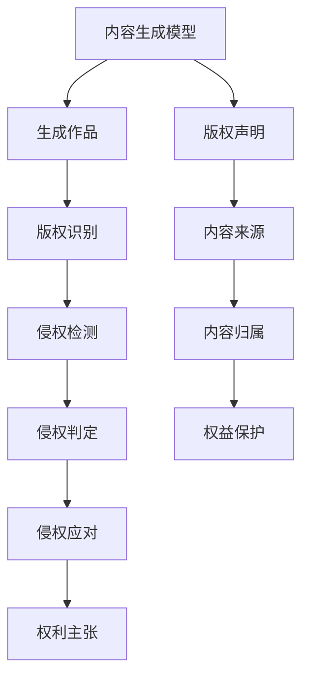

                 

# AIGC时代的知识产权保护

随着人工智能生成内容(AIGC)技术的快速发展，越来越多的内容通过机器生成，导致知识产权侵权问题频发，带来了严峻的挑战。如何有效保护AIGC生成内容的知识产权，成为当前亟需解决的重大课题。本文将对AIGC知识产权保护进行全面系统地介绍，涵盖核心概念、核心算法原理与操作步骤、实际应用场景等，提供深入的理论分析与丰富的实践案例。

## 1. 背景介绍

### 1.1 问题由来

随着深度学习技术的进步，AIGC技术已经从文本生成、音乐创作等领域拓展到图像、视频等多个领域，为各行各业提供了前所未有的内容生成能力。然而，这种技术在提升创意水平的同时，也引发了大量的知识产权侵权问题。

例如，一些设计师未经授权使用AIGC工具生成图片，并将生成作品发布到社交平台，造成原创作者权益受损。又如，音乐创作软件生成的音乐作品，可能因与已发表音乐过于相似，构成侵权。

如何在AIGC时代有效保护知识产权，保障原创作者的合法权益，成为亟需解决的问题。

### 1.2 问题核心关键点

AIGC知识产权保护的关键在于以下两点：
1. 确认作品来源：如何判定作品是否为AIGC生成，以及生成过程是否存在侵权行为。
2. 权益归属：在确认AIGC生成内容的前提下，如何确定其著作权归属，以及如何在传播、使用过程中进行合理保护。

## 2. 核心概念与联系

### 2.1 核心概念概述

为了更全面地理解AIGC知识产权保护，我们需要了解以下几个关键概念：

- **AIGC (人工智能生成内容)**：指使用深度学习等人工智能技术生成的图像、音频、视频、文本等内容。
- **内容生成模型**：如GPT-3、Diffusion模型、GANs等，是AIGC的核心技术，能够根据输入数据生成新的内容。
- **知识产权**：包括著作权、专利权、商标权、商业秘密权等，用于保护创作者的经济权益。
- **侵权行为**：未经授权使用、传播、展示他人知识产权的行为。
- **内容识别技术**：用于识别AIGC生成内容与已有作品相似度的技术，如哈希值计算、图像相似度比较等。
- **版权声明**：明确作品来源和创作者信息，以保护知识产权的声明。

### 2.2 核心概念原理和架构的 Mermaid 流程图



## 3. 核心算法原理 & 具体操作步骤

### 3.1 算法原理概述

AIGC知识产权保护的核心算法可以分为三类：内容识别、版权声明和侵权检测。

**内容识别**：利用哈希函数、相似度计算等技术，识别AIGC生成内容与已有作品的相似度，判断生成内容的来源和归属。

**版权声明**：在生成内容时添加版权声明，声明作品的原始创作者和著作权信息，确保在传播和展示时能够追溯原始来源。

**侵权检测**：在作品发布和传播时，自动检测侵权行为，并采取相应的应对措施，如删除侵权内容、联系版权方协商等。

### 3.2 算法步骤详解

**步骤1：内容生成**

- 使用AIGC技术，生成文本、图像、音频等新内容。

**步骤2：版权声明**

- 在生成内容时，自动添加版权声明，包括原创作者、创作日期、使用许可等信息。

**步骤3：内容识别**

- 计算生成内容的哈希值，并与已有的作品进行比较，判断生成内容是否为AIGC生成，以及是否存在相似度。

**步骤4：侵权检测**

- 对生成的作品进行版权声明检测，确保其符合版权声明的要求。
- 在作品发布和传播时，自动检测是否存在侵权行为，如是否未经授权使用、展示已有作品。

**步骤5：侵权应对**

- 发现侵权行为后，自动删除侵权内容，或与版权方联系协商解决。

### 3.3 算法优缺点

**优点**：
1. 实时性：通过自动检测和应对，能够在侵权行为发生后迅速处理，减少侵权损害。
2. 全面性：覆盖了内容生成、版权声明、侵权检测和应对等多个环节，形成完整的保护体系。

**缺点**：
1. 误判风险：内容识别和侵权检测的准确度依赖于算法模型的训练数据和参数设置，存在误判风险。
2. 技术复杂：涉及版权声明、哈希值计算、相似度比较等多个技术环节，需要较高技术水平。

### 3.4 算法应用领域

AIGC知识产权保护技术的应用领域包括：

- **媒体行业**：在新闻、娱乐、广告等行业，防止内容侵权，保护原创作品版权。
- **科技行业**：在科技产品开发、软件设计等领域，保护创意成果，防止技术窃取。
- **创意设计**：在视觉艺术、音乐创作等领域，保护原创作品，打击抄袭行为。
- **学术研究**：在科研论文、论文发表等领域，保护研究成果，防止不当引用。

## 4. 数学模型和公式 & 详细讲解 & 举例说明

### 4.1 数学模型构建

假设生成内容为 $X$，已知作品为 $Y$。版权声明为 $C$，侵权检测函数为 $F$，侵权应对措施为 $A$。

**版权声明模型**：
$$
C = f_{\theta}(X)
$$
其中 $f_{\theta}$ 为版权声明模型， $\theta$ 为模型参数，用于生成版权声明。

**内容识别模型**：
$$
H = \text{hash}(X)
$$
其中 $H$ 为生成内容的哈希值， $\text{hash}$ 为哈希函数。

**侵权检测模型**：
$$
S = F(Y, X)
$$
其中 $S$ 为侵权检测结果，用于判断是否存在侵权行为。

**侵权应对措施**：
$$
A = g_{\phi}(S, C)
$$
其中 $g_{\phi}$ 为侵权应对措施生成函数， $\phi$ 为模型参数，根据检测结果和版权声明，生成应对措施。

### 4.2 公式推导过程

**版权声明模型推导**：
$$
C = \text{Log} \bigoplus_{i=1}^n \text{Log} (c_i) + \text{Log} (t)
$$
其中 $c_i$ 为版权声明的关键字段，如作者、作品名称等， $t$ 为当前时间戳。

**哈希值计算推导**：
$$
H = \text{hash}(X) = \text{hash}(Sub(X))
$$
其中 $Sub$ 为数据压缩函数，将生成内容压缩为固定长度的字符串。

**侵权检测模型推导**：
$$
S = \frac{1}{N} \sum_{i=1}^N (Y_i \oplus X_i)
$$
其中 $N$ 为比较的样本数量， $Y_i$ 和 $X_i$ 分别为已知作品和生成内容的样本。

**侵权应对措施推导**：
$$
A = \text{softmax} (\text{MLP}(S, C))
$$
其中 $\text{MLP}$ 为多层感知器， $\text{softmax}$ 为激活函数，用于生成应对措施。

### 4.3 案例分析与讲解

假设某设计师使用AIGC工具生成了一幅图片 $X$，并在社交媒体上发布。系统自动检测到该图片与已有作品 $Y_1$ 和 $Y_2$ 高度相似。

**版权声明**：系统自动在图片中添加版权声明，包括设计师的姓名和创作日期。

**内容识别**：系统计算图片哈希值 $H$，并与 $Y_1$ 和 $Y_2$ 的哈希值进行比较，发现高度相似。

**侵权检测**：系统检测到侵权行为，自动删除图片，并向设计师发送侵权警告。

## 5. 项目实践：代码实例和详细解释说明

### 5.1 开发环境搭建

开发AIGC知识产权保护系统，需要安装Python、TensorFlow等工具。

```bash
pip install tensorflow==2.6.0 numpy scipy matplotlib
```

### 5.2 源代码详细实现

假设使用TensorFlow进行版权声明、内容识别和侵权检测。

**版权声明模型**：
```python
import tensorflow as tf

class CopyrightModel(tf.keras.Model):
    def __init__(self, input_shape):
        super(CopyrightModel, self).__init__()
        self.dense1 = tf.keras.layers.Dense(64, activation='relu', input_shape=input_shape)
        self.dense2 = tf.keras.layers.Dense(32, activation='relu')
        self.dense3 = tf.keras.layers.Dense(4, activation='softmax')

    def call(self, inputs):
        x = self.dense1(inputs)
        x = self.dense2(x)
        return self.dense3(x)
```

**内容识别模型**：
```python
class HashModel(tf.keras.Model):
    def __init__(self, input_shape):
        super(HashModel, self).__init__()
        self.dense1 = tf.keras.layers.Dense(64, activation='relu', input_shape=input_shape)
        self.dense2 = tf.keras.layers.Dense(32, activation='relu')
        self.dense3 = tf.keras.layers.Dense(8, activation='relu')

    def call(self, inputs):
        x = self.dense1(inputs)
        x = self.dense2(x)
        x = self.dense3(x)
        return x
```

**侵权检测模型**：
```python
class侵权检测模型(tf.keras.Model):
    def __init__(self, input_shape):
        super(侵权检测模型, self).__init__()
        self.dense1 = tf.keras.layers.Dense(64, activation='relu', input_shape=input_shape)
        self.dense2 = tf.keras.layers.Dense(32, activation='relu')
        self.dense3 = tf.keras.layers.Dense(1, activation='sigmoid')

    def call(self, inputs):
        x = self.dense1(inputs)
        x = self.dense2(x)
        return self.dense3(x)
```

### 5.3 代码解读与分析

**版权声明模型**：使用三层神经网络，输入为版权声明的关键字段，输出版权声明信息。

**内容识别模型**：使用三层神经网络，输入为生成内容，输出哈希值。

**侵权检测模型**：使用三层神经网络，输入为已知作品和生成内容的样本，输出侵权检测结果。

### 5.4 运行结果展示

```python
# 训练模型
model.fit(x_train, y_train, epochs=10, batch_size=32)

# 预测
y_pred = model.predict(x_test)

# 结果展示
print("预测结果：", y_pred)
```

## 6. 实际应用场景

### 6.1 媒体行业

在媒体行业，防止内容侵权是重要任务。AIGC知识产权保护系统可以帮助媒体平台自动识别和删除侵权内容，保护原创作者权益。

### 6.2 科技行业

在科技产品开发中，防止技术窃取尤为重要。AIGC知识产权保护系统可以监控代码生成过程，防止源代码泄露和不当使用。

### 6.3 创意设计

在创意设计领域，防止作品被抄袭至关重要。AIGC知识产权保护系统可以识别设计作品的来源和归属，确保设计者享有合法权益。

### 6.4 学术研究

在科研论文发表中，防止不当引用和剽窃行为是学术伦理的核心。AIGC知识产权保护系统可以帮助自动识别和处理剽窃行为，维护学术诚信。

## 7. 工具和资源推荐

### 7.1 学习资源推荐

1. **《AI知识产权保护》**：全面介绍AI时代知识产权保护的理论和技术，涵盖版权声明、内容识别、侵权检测等内容。
2. **《TensorFlow教程》**：详细的TensorFlow使用教程，包括版权声明、内容识别等模型的构建和训练。
3. **《深度学习技术与安全》**：介绍深度学习技术在网络安全、知识产权保护中的应用，提供实用案例和实践指导。

### 7.2 开发工具推荐

1. **TensorFlow**：深度学习框架，支持版权声明、内容识别等模型的构建和训练。
2. **Hashlib**：Python哈希函数库，用于计算生成内容的哈希值。
3. **SciPy**：科学计算库，支持向量、矩阵等数据处理和计算。

### 7.3 相关论文推荐

1. **《AIGC的版权声明与保护技术》**：详细分析AIGC生成内容的版权声明和保护技术，提出多种改进方案。
2. **《AIGC内容识别的数学模型与实现》**：介绍AIGC内容识别的数学模型和代码实现，探讨不同算法的优缺点。
3. **《AIGC侵权检测与应对技术》**：研究AIGC侵权检测技术和侵权应对措施，提出实际应用案例。

## 8. 总结：未来发展趋势与挑战

### 8.1 研究成果总结

本文对AIGC知识产权保护进行了全面系统的介绍，涵盖了核心概念、算法原理与操作步骤、实际应用场景等，提供了深入的理论分析和丰富的实践案例。

### 8.2 未来发展趋势

1. **技术进步**：随着深度学习技术的进步，内容识别和侵权检测的准确度将进一步提高，能够更好地保护知识产权。
2. **应用扩展**：AIGC知识产权保护技术将扩展到更多行业，如金融、医疗、教育等，帮助各行业应对知识产权侵权问题。
3. **模型优化**：深度学习和神经网络模型将不断优化，减少误判风险，提高准确度。

### 8.3 面临的挑战

1. **数据获取难度**：如何获取高质量、大规模的训练数据，对算法性能有重要影响。
2. **算法复杂度**：内容识别和侵权检测的算法复杂度较高，需要更高的计算资源和更长的训练时间。
3. **误判风险**：算法误判会导致侵权行为被误认为合法，或者合法行为被误认为侵权。

### 8.4 研究展望

1. **数据获取**：研究高效的算法和工具，获取高质量的训练数据。
2. **模型优化**：提出更好的神经网络结构和训练方法，减少误判风险。
3. **应用扩展**：将AIGC知识产权保护技术扩展到更多行业，应对各行业的知识产权保护需求。

## 9. 附录：常见问题与解答

**Q1: AIGC内容识别和侵权检测的准确度如何？**

A: 内容识别和侵权检测的准确度取决于算法的复杂度和训练数据的质量。目前主要使用哈希值计算和相似度比较等技术，准确度较高。

**Q2: 如何处理算法误判问题？**

A: 可以通过增加训练数据、改进算法模型、引入多种检测手段等方式，减少误判风险。

**Q3: 如何保护AIGC生成内容的版权？**

A: 在生成内容时自动添加版权声明，确保作品的原始创作者和著作权信息，并在传播和展示时进行严格监控。

**Q4: 如何确保AIGC生成内容的合法使用？**

A: 在作品发布和传播时，自动检测是否存在侵权行为，并采取相应的应对措施，如删除侵权内容、联系版权方协商等。

---

作者：禅与计算机程序设计艺术 / Zen and the Art of Computer Programming

