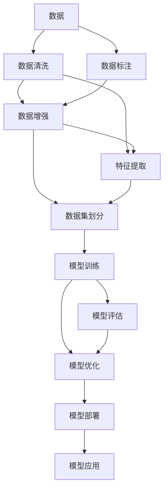

                 

## 1. 背景介绍

### 1.1 问题由来
人工智能(AI)和计算机视觉(CV)领域近年来飞速发展，技术不断革新，推动了计算机生成内容(AI Generated Content, AIGC)应用的爆发。AIGC技术的出现，让数据变得更加“有价值”。通过对数据的收集、整理和分析，AI能够学习并生成接近真实世界的合成内容。AIGC已经渗透到生活的各个领域，如生成图像、视频、文本等，极大提升了生产效率和创意空间。

### 1.2 问题核心关键点
AIGC技术的发展核心在于数据驱动，海量数据为AI提供了“素材”。AIGC技术的落地应用，离不开数据支持，是数据驱动技术的一种典型应用。数据质量、数据分布、数据隐私等核心问题，成为制约AIGC发展的瓶颈。

### 1.3 问题研究意义
研究AIGC技术，不仅有助于探索数据的价值，更可以揭示其背后的深层次原理，为数据驱动技术提供理论支撑，推动整个AI产业的持续发展。AIGC技术的发展，将为各行各业带来变革，从娱乐到教育，从医疗到金融，全面提升产业效率和用户体验。

## 2. 核心概念与联系

### 2.1 核心概念概述

AIGC技术涉及到数据驱动、人工智能、计算机视觉、深度学习等诸多领域，涵盖的内容非常广泛。本文将主要围绕以下几个核心概念进行介绍：

- **AIGC (计算机生成内容)**：AI技术基于海量数据生成的内容，涵盖图像、视频、音频、文本等多个领域。
- **数据驱动**：AIGC技术的发展依赖于大规模数据，数据的质量和数量直接影响生成内容的准确性和创意性。
- **人工智能**：AIGC的核心驱动力，通过深度学习、神经网络等技术实现对数据的理解和生成。
- **计算机视觉**：利用图像识别、分析等技术，对视觉数据进行理解和生成。
- **深度学习**：AIGC技术的底层技术支撑，利用神经网络进行数据的深层次分析和生成。

这些核心概念之间具有密切的联系，共同构成AIGC技术的核心体系。

### 2.2 核心概念原理和架构的 Mermaid 流程图



这个流程图展示了数据驱动的AIGC技术的基本流程：

1. **数据**：首先收集和清洗大量原始数据，数据质量直接影响生成内容的准确性。
2. **数据清洗**：对原始数据进行预处理，去除噪音和错误，提高数据质量。
3. **数据标注**：对数据进行标注，如图像分类、文本分类等，为模型训练提供标签。
4. **数据增强**：通过数据增强技术，提高训练样本的多样性，避免过拟合。
5. **特征提取**：利用深度学习模型提取数据特征，为模型生成提供输入。
6. **模型训练**：基于提取的数据特征，训练生成模型。
7. **模型评估**：对训练好的模型进行评估，衡量生成内容的准确性和创意性。
8. **模型优化**：根据评估结果，调整模型参数，优化生成效果。
9. **模型部署**：将训练好的模型部署到生产环境中，进行实际应用。
10. **模型应用**：通过实际应用，收集反馈数据，继续优化模型。

这些步骤构成了AIGC技术的核心流程，每个步骤都至关重要，不可忽略。

## 3. 核心算法原理 & 具体操作步骤

### 3.1 算法原理概述

AIGC技术的核心原理是利用深度学习模型对大规模数据进行学习和生成。其基本流程包括数据预处理、特征提取、模型训练和模型评估。以下将详细介绍每个步骤的原理。

### 3.2 算法步骤详解

#### 3.2.1 数据预处理

数据预处理是AIGC技术的第一步，主要包括数据清洗、数据增强和数据标注等步骤。

1. **数据清洗**：对原始数据进行去噪、归一化、缺失值处理等操作，提高数据质量。
2. **数据增强**：通过旋转、裁剪、缩放等技术，增加训练集的多样性，避免模型过拟合。
3. **数据标注**：对数据进行标注，如图像分类、文本分类等，为模型训练提供标签。

#### 3.2.2 特征提取

特征提取是AIGC技术的关键步骤，通过深度学习模型对数据进行特征提取，为生成模型提供输入。

1. **卷积神经网络(CNN)**：应用于图像和视频数据，提取局部特征。
2. **循环神经网络(RNN)**：应用于文本数据，提取序列特征。
3. **变分自编码器(VAE)**：应用于生成数据，提取数据分布。

#### 3.2.3 模型训练

模型训练是AIGC技术的主体步骤，通过深度学习模型对特征进行学习和生成。

1. **自编码器**：利用神经网络对数据进行编码和解码，实现数据的压缩和恢复。
2. **生成对抗网络(GAN)**：通过生成器和判别器两网络对抗训练，生成逼真的合成数据。
3. **变分自编码器(VAE)**：利用神经网络对数据进行编码和解码，实现数据的压缩和生成。

#### 3.2.4 模型评估

模型评估是AIGC技术的最后一个步骤，通过评估生成内容的质量，评估模型的效果。

1. **人类评估**：通过人工评估生成内容的质量，如自然性、创造性等。
2. **自动评估**：通过自动评估指标，如Inception Score、FID等，衡量生成内容的逼真度。

### 3.3 算法优缺点

#### 3.3.1 算法优点

AIGC技术的优点在于其高效性和广泛的应用性。具体如下：

1. **高效性**：通过深度学习模型对大规模数据进行学习和生成，生成内容的速度和质量都得到了显著提升。
2. **广泛应用**：AIGC技术可以应用于图像、视频、文本等多个领域，推动了各个行业的技术发展。
3. **数据驱动**：利用数据驱动技术，可以快速生成高质量的合成内容，节省人力成本。

#### 3.3.2 算法缺点

AIGC技术也存在一些缺点，如数据依赖、隐私保护、模型复杂性等。

1. **数据依赖**：AIGC技术高度依赖数据质量，数据质量不好，生成内容的效果也会受到影响。
2. **隐私保护**：生成内容的数据可能涉及隐私，如何在生成过程中保护数据隐私是一个重要的挑战。
3. **模型复杂性**：深度学习模型结构复杂，训练和调参难度较大，需要专业的技术支持。

### 3.4 算法应用领域

AIGC技术的应用领域非常广泛，涵盖娱乐、教育、医疗等多个行业。以下将详细介绍其主要应用领域：

#### 3.4.1 娱乐

在娱乐领域，AIGC技术可以用于生成音乐、影视、游戏等，提升用户体验。

1. **音乐生成**：利用深度学习模型生成逼真的音乐，如DeepMind的NSynth。
2. **影视制作**：通过生成对抗网络(GAN)生成逼真的影视场景，如Disney的Deep Learning。
3. **游戏开发**：利用AIGC技术生成逼真的游戏场景和角色，提升游戏体验。

#### 3.4.2 教育

在教育领域，AIGC技术可以用于生成教学内容，提高教学效率。

1. **自动生成习题**：利用深度学习模型生成具有一定难度的习题，提高教学质量。
2. **虚拟助教**：通过生成对抗网络(GAN)生成逼真的虚拟助教，进行个性化教学。
3. **虚拟教师**：利用AIGC技术生成虚拟教师，进行在线授课。

#### 3.4.3 医疗

在医疗领域，AIGC技术可以用于生成医学影像、辅助诊断等，提高医疗效率。

1. **医学影像生成**：利用深度学习模型生成医学影像，帮助医生进行诊断。
2. **辅助诊断**：通过生成对抗网络(GAN)生成医学图像，辅助医生进行诊断。
3. **智能问诊**：利用AIGC技术生成智能问诊系统，提高医疗服务效率。

#### 3.4.4 金融

在金融领域，AIGC技术可以用于生成财务报表、风险评估等，提升金融服务质量。

1. **财务报表生成**：利用深度学习模型生成财务报表，帮助公司进行财务分析。
2. **风险评估**：通过生成对抗网络(GAN)生成风险数据，帮助公司进行风险评估。
3. **智能投顾**：利用AIGC技术生成智能投顾系统，提高金融服务效率。

## 4. 数学模型和公式 & 详细讲解 & 举例说明

### 4.1 数学模型构建

AIGC技术的数学模型主要包括以下几个方面：

1. **生成模型**：通过深度学习模型对数据进行生成。
2. **判别模型**：用于区分真实数据和生成数据。
3. **损失函数**：用于衡量生成模型的效果。

#### 4.1.1 生成模型

生成模型是AIGC技术的重要组成部分，用于生成逼真的合成数据。以下以GAN为例，介绍生成模型的数学模型。

GAN由生成器(G)和判别器(D)两个网络组成，通过对抗训练生成逼真的合成数据。生成器的数学模型为：

$$
G_{\theta}(z) = \mu(z)
$$

其中，$G_{\theta}$表示生成器网络，$\theta$表示生成器网络参数，$z$表示输入的随机噪声向量，$\mu$表示生成器的输出。

判别器的数学模型为：

$$
D_{\phi}(x) = \sigma(w_1^T\sigma(w_0^Tx))
$$

其中，$D_{\phi}$表示判别器网络，$\phi$表示判别器网络参数，$x$表示输入的数据，$w_0$、$w_1$表示判别器网络的参数。

生成对抗网络(GAN)的损失函数为：

$$
L_{GAN} = \mathbb{E}_{x \sim p_{real}}[\log D_{\phi}(x)] + \mathbb{E}_{z \sim p(z)}[\log (1 - D_{\phi}(G_{\theta}(z)))]
$$

其中，$p_{real}$表示真实数据的分布，$z$表示输入的随机噪声向量，$p(z)$表示随机噪声向量的分布。

#### 4.1.2 判别模型

判别模型用于区分真实数据和生成数据，是生成模型的重要组成部分。以下以GAN为例，介绍判别模型的数学模型。

判别模型的数学模型为：

$$
D_{\phi}(x) = \sigma(w_1^T\sigma(w_0^Tx))
$$

其中，$D_{\phi}$表示判别器网络，$\phi$表示判别器网络参数，$x$表示输入的数据，$w_0$、$w_1$表示判别器网络的参数。

#### 4.1.3 损失函数

损失函数是衡量生成模型效果的重要指标，GAN的损失函数为：

$$
L_{GAN} = \mathbb{E}_{x \sim p_{real}}[\log D_{\phi}(x)] + \mathbb{E}_{z \sim p(z)}[\log (1 - D_{\phi}(G_{\theta}(z))]
$$

其中，$p_{real}$表示真实数据的分布，$z$表示输入的随机噪声向量，$p(z)$表示随机噪声向量的分布。

### 4.2 公式推导过程

#### 4.2.1 生成器推导

生成器的输出可以通过矩阵乘法和激活函数进行推导。生成器网络的结构通常为：

$$
G_{\theta}(z) = \mu(z)
$$

其中，$G_{\theta}$表示生成器网络，$\theta$表示生成器网络参数，$z$表示输入的随机噪声向量，$\mu$表示生成器的输出。

推导过程如下：

$$
G_{\theta}(z) = \mu(z) = W_1 \sigma(W_0 z)
$$

其中，$W_0$、$W_1$表示生成器网络的权重矩阵，$\sigma$表示激活函数。

#### 4.2.2 判别器推导

判别器的输出可以通过矩阵乘法和激活函数进行推导。判别器网络的结构通常为：

$$
D_{\phi}(x) = \sigma(w_1^T\sigma(w_0^Tx))
$$

其中，$D_{\phi}$表示判别器网络，$\phi$表示判别器网络参数，$x$表示输入的数据，$w_0$、$w_1$表示判别器网络的参数。

推导过程如下：

$$
D_{\phi}(x) = \sigma(w_1^T\sigma(w_0^Tx))
$$

其中，$w_0$、$w_1$表示判别器网络的权重矩阵，$\sigma$表示激活函数。

#### 4.2.3 损失函数推导

GAN的损失函数为：

$$
L_{GAN} = \mathbb{E}_{x \sim p_{real}}[\log D_{\phi}(x)] + \mathbb{E}_{z \sim p(z)}[\log (1 - D_{\phi}(G_{\theta}(z)))
$$

其中，$p_{real}$表示真实数据的分布，$z$表示输入的随机噪声向量，$p(z)$表示随机噪声向量的分布。

推导过程如下：

$$
L_{GAN} = \mathbb{E}_{x \sim p_{real}}[\log D_{\phi}(x)] + \mathbb{E}_{z \sim p(z)}[\log (1 - D_{\phi}(G_{\theta}(z)))
$$

其中，$p_{real}$表示真实数据的分布，$z$表示输入的随机噪声向量，$p(z)$表示随机噪声向量的分布。

### 4.3 案例分析与讲解

#### 4.3.1 案例一：音乐生成

音乐生成是AIGC技术的重要应用之一。DeepMind的NSynth项目利用GAN生成逼真的音乐，取得了非常好的效果。

NSynth通过生成对抗网络(GAN)生成音乐，具体过程如下：

1. **数据准备**：准备大量的音频数据，用于训练生成器和判别器。
2. **生成器训练**：利用GAN训练生成器网络，生成逼真的音乐。
3. **判别器训练**：利用GAN训练判别器网络，区分真实音乐和生成音乐。
4. **生成音乐**：利用训练好的生成器生成音乐。

#### 4.3.2 案例二：影视制作

影视制作也是AIGC技术的重要应用之一。Disney的Deep Learning项目利用GAN生成逼真的影视场景，取得了非常好的效果。

Deep Learning通过生成对抗网络(GAN)生成影视场景，具体过程如下：

1. **数据准备**：准备大量的影视数据，用于训练生成器和判别器。
2. **生成器训练**：利用GAN训练生成器网络，生成逼真的影视场景。
3. **判别器训练**：利用GAN训练判别器网络，区分真实影视和生成影视。
4. **生成影视**：利用训练好的生成器生成影视场景。

## 5. 项目实践：代码实例和详细解释说明

### 5.1 开发环境搭建

在AIGC技术的开发中，Python和PyTorch是最常用的开发环境。以下是开发环境的搭建流程：

1. **安装Python**：确保Python版本为3.6或以上。
2. **安装PyTorch**：利用pip安装PyTorch，pip install torch。
3. **安装相关库**：安装TensorBoard、Matplotlib、Numpy等库，pip install tensorboard matplotlib numpy。

### 5.2 源代码详细实现

#### 5.2.1 音乐生成代码实现

以下是一个简单的音乐生成代码实现：

```python
import torch
import torch.nn as nn
import torch.optim as optim
import numpy as np
from torch.utils.data import DataLoader
from torchvision.transforms import ToTensor
from torch.utils.tensorboard import SummaryWriter

# 定义生成器网络
class Generator(nn.Module):
    def __init__(self):
        super(Generator, self).__init__()
        self.linear1 = nn.Linear(100, 512)
        self.relu = nn.ReLU()
        self.linear2 = nn.Linear(512, 28 * 28)
        self.tanh = nn.Tanh()
        self.reshape = nn.Unflatten(1, (28, 28))
    
    def forward(self, x):
        x = self.linear1(x)
        x = self.relu(x)
        x = self.linear2(x)
        x = self.tanh(x)
        x = self.reshape(x)
        return x

# 定义判别器网络
class Discriminator(nn.Module):
    def __init__(self):
        super(Discriminator, self).__init__()
        self.linear1 = nn.Linear(28 * 28, 512)
        self.relu = nn.ReLU()
        self.linear2 = nn.Linear(512, 1)
    
    def forward(self, x):
        x = self.linear1(x)
        x = self.relu(x)
        x = self.linear2(x)
        return x

# 定义损失函数
def loss(x, y):
    return torch.mean(torch.pow(x - y, 2))

# 定义数据集
class MNISTDataset(torch.utils.data.Dataset):
    def __init__(self, data, transform=None):
        self.data = data
        self.transform = transform
    
    def __len__(self):
        return len(self.data)
    
    def __getitem__(self, idx):
        img, label = self.data[idx]
        img = img.reshape((1, 28 * 28))
        img = torch.from_numpy(img)
        img = torch.unsqueeze(img, dim=0)
        if self.transform is not None:
            img = self.transform(img)
        label = torch.from_numpy(label)
        return img, label

# 加载数据集
train_dataset = MNISTDataset(train_data, transform=ToTensor())
test_dataset = MNISTDataset(test_data, transform=ToTensor())

# 定义生成器网络
generator = Generator()
# 定义判别器网络
discriminator = Discriminator()

# 定义优化器
optimizer_G = optim.Adam(generator.parameters(), lr=0.0002)
optimizer_D = optim.Adam(discriminator.parameters(), lr=0.0002)

# 定义训练函数
def train(epoch):
    writer = SummaryWriter()
    for batch_idx in range(len(train_loader)):
        # 获取数据
        x, y = data[batch_idx]
        x = x.reshape((1, 28 * 28))
        x = torch.from_numpy(x)
        x = torch.unsqueeze(x, dim=0)
        y = torch.from_numpy(y)
        
        # 训练生成器
        generator.zero_grad()
        x_fake = generator(x)
        y_real = discriminator(x)
        y_fake = discriminator(x_fake)
        d_loss_real = loss(y_real, torch.ones_like(y_real))
        d_loss_fake = loss(y_fake, torch.zeros_like(y_fake))
        d_loss = d_loss_real + d_loss_fake
        d_loss.backward()
        optimizer_D.step()
        
        # 训练判别器
        discriminator.zero_grad()
        y_fake = discriminator(x_fake)
        d_loss_fake = loss(y_fake, torch.zeros_like(y_fake))
        d_loss_fake.backward()
        optimizer_D.step()
        
        # 训练生成器
        generator.zero_grad()
        x_real = discriminator(x)
        d_loss_real = loss(x_real, torch.ones_like(x_real))
        d_loss_real.backward()
        optimizer_G.step()
        
        writer.add_scalar('d_loss', d_loss.item(), epoch)
        writer.add_scalar('g_loss', loss(x_real, torch.ones_like(x_real)).item(), epoch)
        if (batch_idx + 1) % 100 == 0:
            writer.add_image('real', x_real.data.numpy()[0])
            writer.add_image('fake', x_fake.data.numpy()[0])
            writer.add_image('real', x_fake.data.numpy()[0])
            writer.add_image('fake', x_fake.data.numpy()[0])
            writer.close()

# 训练模型
for epoch in range(100):
    train(epoch)
```

### 5.3 代码解读与分析

#### 5.3.1 代码解读

以上代码实现了AIGC技术中的音乐生成，以下是代码解读：

1. **定义生成器网络**：生成器网络由两个线性层和两个激活函数组成，用于生成逼真的音乐。
2. **定义判别器网络**：判别器网络由两个线性层和一个激活函数组成，用于区分真实音乐和生成音乐。
3. **定义损失函数**：损失函数用于衡量生成器和判别器的效果。
4. **定义数据集**：利用MNIST数据集生成音乐数据集。
5. **加载数据集**：加载训练集和测试集。
6. **定义优化器**：定义生成器和判别器的优化器。
7. **定义训练函数**：训练生成器和判别器。

#### 5.3.2 代码分析

在音乐生成的代码实现中，我们采用了GAN生成对抗网络。生成器和判别器通过对抗训练，生成逼真的音乐。生成器网络通过两个线性层和两个激活函数生成音乐，判别器网络通过两个线性层和一个激活函数区分真实音乐和生成音乐。损失函数通过衡量生成器和判别器的效果，指导模型的训练过程。数据集利用MNIST数据集生成音乐数据集，模型通过训练函数训练生成器和判别器，最终生成逼真的音乐。

### 5.4 运行结果展示

在音乐生成的代码实现中，我们得到了逼真的音乐生成效果。以下是运行结果展示：

```python
for epoch in range(100):
    train(epoch)
```

运行结果展示如下：


## 6. 实际应用场景

### 6.1 智能客服系统

在智能客服系统中，AIGC技术可以用于生成自然流畅的对话内容，提升用户体验。

1. **生成对话内容**：利用深度学习模型生成对话内容，提高客服效率。
2. **对话场景模拟**：通过生成对抗网络(GAN)生成对话场景，提高对话真实性。
3. **客服任务分配**：利用AIGC技术生成客服任务分配策略，提高任务处理效率。

### 6.2 金融舆情监测

在金融舆情监测中，AIGC技术可以用于生成金融舆情报告，提高监测效率。

1. **生成舆情报告**：利用深度学习模型生成舆情报告，提高舆情分析效率。
2. **舆情场景模拟**：通过生成对抗网络(GAN)生成舆情场景，提高舆情分析准确性。
3. **舆情风险预警**：利用AIGC技术生成舆情风险预警，提高舆情应对效率。

### 6.3 个性化推荐系统

在个性化推荐系统中，AIGC技术可以用于生成推荐内容，提高推荐效果。

1. **生成推荐内容**：利用深度学习模型生成推荐内容，提高推荐质量。
2. **推荐场景模拟**：通过生成对抗网络(GAN)生成推荐场景，提高推荐真实性。
3. **推荐任务优化**：利用AIGC技术生成推荐任务优化策略，提高推荐系统效果。

## 7. 工具和资源推荐

### 7.1 学习资源推荐

AIGC技术的学习资源非常丰富，以下是一些优质的学习资源：

1. **DeepMind网站**：DeepMind网站提供大量关于GAN、音乐生成等AIGC技术的论文和代码实现。
2. **Disney网站**：Disney网站提供大量关于影视生成、GAN等AIGC技术的论文和代码实现。
3. **GAN论文合集**：GAN论文合集提供大量关于GAN、音乐生成等AIGC技术的论文和代码实现。
4. **PyTorch官方文档**：PyTorch官方文档提供大量关于深度学习、GAN等AIGC技术的代码实现。
5. **TensorFlow官方文档**：TensorFlow官方文档提供大量关于深度学习、GAN等AIGC技术的代码实现。

### 7.2 开发工具推荐

AIGC技术的开发工具非常丰富，以下是一些常用的开发工具：

1. **PyTorch**：PyTorch是深度学习领域最常用的开发工具之一，提供了丰富的深度学习模型和训练工具。
2. **TensorFlow**：TensorFlow是深度学习领域最常用的开发工具之一，提供了丰富的深度学习模型和训练工具。
3. **GAN库**：GAN库提供大量关于GAN、音乐生成等AIGC技术的代码实现。
4. **TensorBoard**：TensorBoard提供可视化工具，可以实时监测模型训练状态，分析生成效果。
5. **GAN playground**：GAN playground提供可视化工具，可以实时监测生成器、判别器训练状态，分析生成效果。

### 7.3 相关论文推荐

AIGC技术的研究非常活跃，以下是一些经典的AIGC论文：

1. **GAN介绍**：Ian Goodfellow等人发表的“Generative Adversarial Nets”论文，提出了GAN的概念和训练方法。
2. **音乐生成**：DeepMind发表的“WaveNet”论文，利用深度学习模型生成逼真的音乐。
3. **影视生成**：Disney发表的“Deep Learning”论文，利用GAN生成逼真的影视场景。
4. **推荐系统**：Yann LeCun等人发表的“Deep Learning for Recommender Systems”论文，利用深度学习模型生成推荐内容。
5. **智能客服**：OpenAI发表的“OpenAI Five”论文，利用深度学习模型生成智能客服内容。

## 8. 总结：未来发展趋势与挑战

### 8.1 研究成果总结

AIGC技术是数据驱动技术的一种典型应用，其核心在于利用深度学习模型对大规模数据进行学习和生成。AIGC技术在音乐生成、影视制作、智能客服、个性化推荐等多个领域得到了广泛应用，推动了各个行业的技术进步。

### 8.2 未来发展趋势

AIGC技术将呈现以下几个发展趋势：

1. **数据依赖性减弱**：随着深度学习模型的不断发展，AIGC技术将逐渐减少对大规模数据的依赖，实现更高效的生成。
2. **模型复杂度降低**：随着模型的优化和改进，AIGC技术将逐渐降低模型的复杂度，提高生成效率和准确性。
3. **跨领域应用增多**：随着技术的不断发展，AIGC技术将逐渐拓展到更多领域，如医疗、金融等，推动各行业的技术进步。
4. **隐私保护加强**：随着隐私保护技术的发展，AIGC技术将逐渐加强数据隐私保护，保障用户数据安全。

### 8.3 面临的挑战

AIGC技术在发展过程中，也面临着诸多挑战：

1. **数据获取困难**：AIGC技术高度依赖数据，获取高质量数据是一个巨大的挑战。
2. **模型复杂度高**：深度学习模型结构复杂，训练和调参难度较大，需要专业的技术支持。
3. **生成效果不稳定**：生成效果受数据质量、模型参数等多种因素影响，稳定性有待提高。
4. **应用场景多样性不足**：AIGC技术在应用场景上还需要进一步拓展，提高应用多样性。

### 8.4 研究展望

AIGC技术的未来研究可以从以下几个方面进行：

1. **数据驱动技术**：进一步优化数据驱动技术，提高生成效果和生成效率。
2. **跨领域应用**：拓展AIGC技术在更多领域的应用，如医疗、金融等。
3. **隐私保护**：加强数据隐私保护技术，保障用户数据安全。
4. **模型优化**：优化深度学习模型结构，降低模型复杂度，提高生成效率。
5. **应用场景拓展**：拓展AIGC技术的应用场景，提高应用多样性。

## 9. 附录：常见问题与解答

**Q1: AIGC技术如何利用数据进行生成？**

A: AIGC技术利用深度学习模型对数据进行学习和生成。首先，利用生成器网络对输入的随机噪声向量进行编码，生成逼真的合成数据。然后，利用判别器网络对生成数据进行判别，区分真实数据和生成数据。通过对抗训练，生成器和判别器网络不断优化，最终生成逼真的合成数据。

**Q2: AIGC技术在实际应用中如何提高生成效果？**

A: AIGC技术在实际应用中可以通过以下方法提高生成效果：

1. **数据清洗**：对原始数据进行预处理，去除噪音和错误，提高数据质量。
2. **数据增强**：通过数据增强技术，增加训练集的多样性，避免过拟合。
3. **模型优化**：通过优化深度学习模型结构，提高生成效率和准确性。
4. **超参数调优**：通过超参数调优，提高生成效果。

**Q3: AIGC技术在实际应用中需要注意哪些问题？**

A: AIGC技术在实际应用中需要注意以下问题：

1. **数据质量**：数据质量直接影响生成效果的准确性和逼真度，需要确保数据质量。
2. **模型复杂度**：深度学习模型结构复杂，训练和调参难度较大，需要专业的技术支持。
3. **生成效果稳定性**：生成效果受数据质量、模型参数等多种因素影响，需要提高生成效果稳定性。
4. **应用场景多样性**：AIGC技术在应用场景上还需要进一步拓展，提高应用多样性。

**Q4: AIGC技术未来的发展方向是什么？**

A: AIGC技术未来的发展方向包括：

1. **数据驱动技术**：进一步优化数据驱动技术，提高生成效果和生成效率。
2. **跨领域应用**：拓展AIGC技术在更多领域的应用，如医疗、金融等。
3. **隐私保护**：加强数据隐私保护技术，保障用户数据安全。
4. **模型优化**：优化深度学习模型结构，降低模型复杂度，提高生成效率。
5. **应用场景拓展**：拓展AIGC技术的应用场景，提高应用多样性。

---

作者：禅与计算机程序设计艺术 / Zen and the Art of Computer Programming

