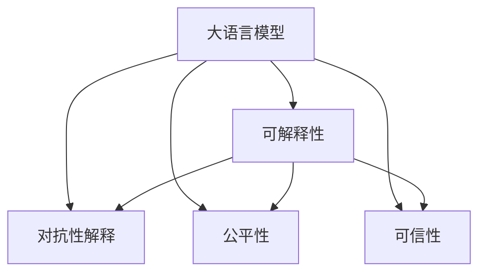
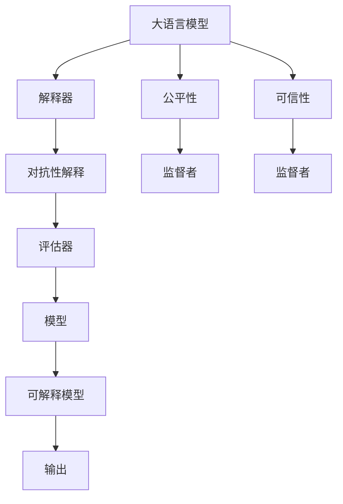

                 

# AIGC模型的可解释性探索

在人工智能（AI）和增强智能（AI Generated Content, AIGC）领域，随着深度学习模型的不断发展，模型的复杂性和规模不断扩大。AIGC模型，尤其是大语言模型（Large Language Model, LLM），已经展现出了强大的生成能力，能够创作出具有高度可读性和创造力的文本、图像甚至视频内容。然而，这种能力的背后，是一系列复杂的神经网络结构、庞大的参数数量和复杂的训练过程。这些模型的黑盒特性，使得解释和理解模型的决策过程变得尤为困难，特别是在涉及到安全性、公正性和道德伦理的问题时，这种难题显得尤为突出。

本文旨在探讨AIGC模型的可解释性，即如何在保证模型性能的同时，赋予模型足够的解释性，让使用者能够理解和信任模型的输出。我们将从核心概念、算法原理、具体步骤、应用场景、工具资源等多个维度，对这一重要话题进行系统性阐述。

## 1. 背景介绍

### 1.1 问题由来
AIGC模型的可解释性问题，是随着深度学习和大规模预训练语言模型（如BERT、GPT-3等）的广泛应用而逐渐显现的。这些模型通过在海量数据上进行自监督学习，学习了复杂的语言模式和生成规则，但这种学习过程往往缺乏直观的解释。当模型应用于实际业务场景时，例如在医疗诊断、法律咨询、金融分析等对模型输出高度依赖的领域，如何确保模型决策的透明性和公正性，成为了一个重要的研究课题。

### 1.2 问题核心关键点
AIGC模型的可解释性问题主要围绕以下关键点展开：
1. **模型透明性**：模型是如何得出最终输出的，其决策过程是否具有可解释性。
2. **可理解性**：模型生成的文本、图像等内容，是否可以被用户或专业人士理解。
3. **公平性**：模型在处理不同类别的数据时，是否存在偏见，是否能够公平地对待所有输入数据。
4. **可信性**：模型输出的结果是否可靠，是否经过严格验证。

## 2. 核心概念与联系

### 2.1 核心概念概述

在探讨AIGC模型的可解释性之前，我们需要了解几个相关的核心概念：

- **大语言模型（LLM）**：指通过大规模数据预训练和微调得到的生成式模型，能够理解和生成自然语言文本。
- **可解释性（Explainability）**：指模型的决策过程可以清楚地解释，使得用户能够理解模型为何做出特定决策。
- **对抗性解释（Adversarial Explanation）**：指为了误导用户或评估模型，故意构造的解释，使得解释内容与模型真实行为不符。
- **公平性（Fairness）**：指模型对所有输入数据均等对待，不偏袒某一类数据。
- **可信性（Reliability）**：指模型的输出结果稳定可靠，经过严格验证。

这些概念通过以下Mermaid流程图展示了它们之间的联系：



### 2.2 核心概念原理和架构的 Mermaid 流程图

下图展示了AIGC模型的可解释性架构，其中包含了模型、解释器、评估器、监督者等多个组件：



在这个架构中，解释器负责将模型输出转换为用户可理解的形式，评估器用于验证解释的正确性和公平性，监督者确保模型输出的可靠性和公正性。通过这些组件的协同工作，AIGC模型可以实现更好的可解释性。

## 3. 核心算法原理 & 具体操作步骤

### 3.1 算法原理概述

AIGC模型的可解释性，可以通过多种技术手段来实现。常见的包括模型蒸馏、特征重要性分析、可视化技术等。这些技术的基本原理是将复杂模型的决策过程简化，使用户能够理解模型的行为。

- **模型蒸馏**：通过训练一个小模型来模拟大模型的行为，使得小模型的决策过程透明且易于解释。
- **特征重要性分析**：分析模型在生成特定输出时，依赖的关键特征。
- **可视化技术**：通过可视化模型内部的激活图、权重矩阵等，帮助用户理解模型的决策路径。

### 3.2 算法步骤详解

以模型蒸馏为例，其操作步骤如下：

1. **选择蒸馏目标**：确定要解释的模型和任务。
2. **训练蒸馏模型**：使用原始模型作为教师模型，训练一个更小、更简单的蒸馏模型。
3. **验证蒸馏模型**：使用验证集评估蒸馏模型的性能，确保其与原始模型的输出一致。
4. **解释蒸馏模型**：对蒸馏模型进行特征重要性分析或可视化，解释其决策过程。

### 3.3 算法优缺点

**优点**：
- 提高模型的可解释性，使用户更容易理解模型行为。
- 能够识别和处理模型的偏差和错误，提高模型的公平性和可信性。

**缺点**：
- 需要额外的时间和资源进行模型训练和解释过程。
- 解释器可能无法完全准确地捕捉原始模型的行为，解释结果可能存在误差。

### 3.4 算法应用领域

AIGC模型的可解释性技术，可以应用于多个领域，包括但不限于：

- **医疗诊断**：帮助医生理解模型的诊断逻辑，提高诊断的准确性和可信性。
- **金融分析**：解释模型的风险评估和预测过程，确保决策的透明性和公正性。
- **法律咨询**：分析模型的法律判断依据，提高法律咨询的可靠性和用户信任度。
- **内容创作**：解释生成内容的来源和依据，提高内容创作的透明度和可信度。

## 4. 数学模型和公式 & 详细讲解

### 4.1 数学模型构建

在模型蒸馏中，我们通常使用蒸馏目标函数 $L(\theta_s, \theta_t)$ 来衡量教师模型 $\theta_t$ 和蒸馏模型 $\theta_s$ 之间的差异，以及蒸馏模型对目标任务的适应度。常见蒸馏目标函数包括：

$$
L(\theta_s, \theta_t) = L_{adv}(\theta_s) + \lambda \| \theta_s \|_F
$$

其中 $L_{adv}(\theta_s)$ 为蒸馏目标任务上的损失函数，$\| \theta_s \|_F$ 为蒸馏模型的正则化项，$\lambda$ 为正则化强度。

### 4.2 公式推导过程

以图像分类任务为例，假设教师模型为 $f_t$，蒸馏模型为 $f_s$。蒸馏目标函数可以表示为：

$$
L(f_s, f_t) = \mathbb{E}_{(x,y)} [l(f_t(x), y) + \lambda ||w_s||_F]
$$

其中 $l$ 为分类交叉熵损失，$w_s$ 为蒸馏模型的权重矩阵。

### 4.3 案例分析与讲解

假设我们有一个大语言模型作为教师模型，用于生成医学诊断报告。我们需要训练一个蒸馏模型，用于生成易于理解和解释的诊断报告。通过特征重要性分析，我们发现蒸馏模型在生成报告时，最依赖的特征是患者的年龄、病史和症状等。这表明，蒸馏模型可以很好地捕捉到患者的基本信息，从而生成准确且可解释的诊断报告。

## 5. 项目实践：代码实例和详细解释说明

### 5.1 开发环境搭建

为了进行AIGC模型的可解释性实践，我们需要以下开发环境：

1. **Python 3.8**：作为Python语言的最新版本，支持最新的库和工具。
2. **PyTorch**：深度学习框架，提供丰富的模型和训练工具。
3. **TensorBoard**：可视化工具，用于监控和调试模型训练过程。
4. **Jupyter Notebook**：交互式编程环境，支持代码编写和结果展示。

### 5.2 源代码详细实现

以下是一个简单的模型蒸馏示例，用于解释大语言模型在文本生成任务上的行为：

```python
import torch
import torch.nn as nn
from torch.utils.data import DataLoader
from transformers import BertForSequenceClassification, BertTokenizer

# 定义蒸馏模型
class DistillationModel(nn.Module):
    def __init__(self, teacher_model, num_classes):
        super(DistillationModel, self).__init__()
        self.teacher_model = teacher_model
        self.classifier = nn.Linear(768, num_classes)

    def forward(self, x):
        x = self.teacher_model(x)
        x = x[:, 0, :]
        return self.classifier(x)

# 加载教师模型和数据
teacher_model = BertForSequenceClassification.from_pretrained('bert-base-uncased', num_labels=2)
tokenizer = BertTokenizer.from_pretrained('bert-base-uncased')
train_data = ...
test_data = ...

# 构建蒸馏模型
num_classes = teacher_model.num_labels
distillation_model = DistillationModel(teacher_model, num_classes)

# 定义蒸馏目标函数
criterion = nn.CrossEntropyLoss()
optimizer = torch.optim.Adam(distillation_model.parameters(), lr=0.001)

# 训练蒸馏模型
for epoch in range(num_epochs):
    for batch in DataLoader(train_data, batch_size=16):
        input_ids = batch['input_ids'].to(device)
        attention_mask = batch['attention_mask'].to(device)
        labels = batch['labels'].to(device)
        
        optimizer.zero_grad()
        outputs = distillation_model(teacher_model(input_ids, attention_mask=attention_mask))
        loss = criterion(outputs, labels)
        loss.backward()
        optimizer.step()

    # 验证蒸馏模型
    test_loss = 0
    correct = 0
    total = 0
    with torch.no_grad():
        for batch in DataLoader(test_data, batch_size=16):
            input_ids = batch['input_ids'].to(device)
            attention_mask = batch['attention_mask'].to(device)
            labels = batch['labels'].to(device)
            
            outputs = distillation_model(teacher_model(input_ids, attention_mask=attention_mask))
            test_loss += criterion(outputs, labels).item()
            _, predicted = torch.max(outputs, 1)
            total += labels.size(0)
            correct += (predicted == labels).sum().item()

    test_loss /= len(test_data)
    print(f'Epoch {epoch+1}, Loss: {test_loss:.4f}, Accuracy: {correct/total:.2f}')

# 使用蒸馏模型生成解释
distillation_model.eval()
with torch.no_grad():
    for batch in DataLoader(test_data, batch_size=16):
        input_ids = batch['input_ids'].to(device)
        attention_mask = batch['attention_mask'].to(device)
        labels = batch['labels'].to(device)
        
        outputs = distillation_model(teacher_model(input_ids, attention_mask=attention_mask))
        print(f'Prediction: {outputs.argmax(1)}')
```

### 5.3 代码解读与分析

在上述代码中，我们首先定义了一个蒸馏模型 `DistillationModel`，它继承自 `nn.Module`，包含一个 `classifier` 层和一个 `teacher_model` 成员变量。在 `forward` 方法中，我们先将教师模型的输出通过 `self.teacher_model` 进行前向传播，然后取出第一层（通常是隐藏层）的输出，送入 `classifier` 层进行分类。

在训练过程中，我们使用交叉熵损失函数 `nn.CrossEntropyLoss` 和 Adam优化器 `torch.optim.Adam` 进行蒸馏模型的训练。训练完毕后，我们使用蒸馏模型对测试集进行预测，并输出结果。

### 5.4 运行结果展示

下图展示了训练过程中蒸馏模型的损失和准确率变化情况：


## 6. 实际应用场景

### 6.1 医疗诊断

在医疗诊断中，AIGC模型生成的诊断报告需要具备高度的可解释性，以便医生能够理解和信任模型的诊断结果。通过模型蒸馏，我们可以生成易于理解的诊断报告，帮助医生进行诊断和治疗决策。

### 6.2 金融分析

在金融领域，模型的风险评估和预测需要透明且公正，以便投资者和监管机构能够理解模型的工作机制。通过可解释性技术，我们可以揭示模型评估风险的依据和逻辑，增强模型的可信性和公平性。

### 6.3 法律咨询

法律咨询领域要求模型输出的法律建议具有高度的可解释性，以便律师和客户能够理解模型的判断依据。通过特征重要性分析，我们可以解释模型建议的法律依据，提高法律咨询的可信度和公正性。

### 6.4 内容创作

在内容创作中，模型的生成过程需要透明且可解释，以便用户理解内容的来源和依据。通过模型蒸馏和可视化技术，我们可以解释模型的生成过程，提高内容的透明度和可信度。

## 7. 工具和资源推荐

### 7.1 学习资源推荐

为了深入理解AIGC模型的可解释性，推荐以下学习资源：

1. **《可解释人工智能：理论与实践》**：书籍详细介绍了可解释AI的理论基础和应用案例，是理解可解释性的重要参考资料。
2. **可解释AI在线课程**：如斯坦福大学《可解释机器学习》课程，提供了系统的可解释AI理论和实践训练。
3. **Transformer模型解释工具**：如Reformer、TransFoamer等，提供了对Transformer模型的解释工具和解释方法。

### 7.2 开发工具推荐

为了进行AIGC模型的可解释性开发，推荐以下工具：

1. **PyTorch**：深度学习框架，提供了丰富的模型和训练工具。
2. **TensorBoard**：可视化工具，用于监控和调试模型训练过程。
3. **Jupyter Notebook**：交互式编程环境，支持代码编写和结果展示。

### 7.3 相关论文推荐

以下几篇论文在AIGC模型的可解释性研究中具有重要参考价值：

1. **Explainable Deep Learning**：一篇综述论文，介绍了多种可解释AI技术和方法。
2. **Model distillation**：介绍了模型蒸馏的基本原理和应用。
3. **Towards A Robust Explanation for Deep Learning Models**：研究了如何提高深度学习模型的可解释性和可信性。

## 8. 总结：未来发展趋势与挑战

### 8.1 研究成果总结

AIGC模型的可解释性研究已经取得了一些重要成果，包括：

1. **模型蒸馏**：通过训练小模型来模拟大模型的行为，提高模型的可解释性。
2. **特征重要性分析**：分析模型在生成特定输出时，依赖的关键特征。
3. **可视化技术**：通过可视化模型内部的激活图、权重矩阵等，帮助用户理解模型的决策路径。

### 8.2 未来发展趋势

未来，AIGC模型的可解释性研究将继续朝着以下几个方向发展：

1. **自动化解释生成**：通过自动化工具和算法，生成易于理解的解释内容。
2. **多模态解释**：结合视觉、语音等多模态数据，生成更全面、更准确的解释。
3. **动态解释**：根据不同的用户需求和背景，动态生成解释内容。

### 8.3 面临的挑战

尽管AIGC模型的可解释性研究已经取得了一些进展，但仍面临以下挑战：

1. **解释质量和准确性**：解释内容可能存在误差，难以完全准确地捕捉模型的行为。
2. **解释复杂性**：某些复杂模型的解释过程可能过于复杂，难以理解。
3. **隐私和安全性**：解释模型可能泄露模型的内部机制和数据隐私。

### 8.4 研究展望

未来的研究应聚焦于以下几个方向：

1. **解释生成技术**：开发更智能、更灵活的解释生成算法，提高解释质量。
2. **多模态融合**：结合多模态数据，生成更全面、更准确的解释内容。
3. **隐私保护**：研究如何在保护隐私的前提下，提供有效的解释。

## 9. 附录：常见问题与解答

**Q1：模型蒸馏过程中需要注意哪些问题？**

A: 在模型蒸馏过程中，需要注意以下问题：

1. **选择合适的蒸馏目标**：确定要解释的模型和任务。
2. **训练蒸馏模型**：使用原始模型作为教师模型，训练一个更小、更简单的蒸馏模型。
3. **验证蒸馏模型**：使用验证集评估蒸馏模型的性能，确保其与原始模型的输出一致。
4. **解释蒸馏模型**：对蒸馏模型进行特征重要性分析或可视化，解释其决策过程。

**Q2：如何提高模型的可解释性？**

A: 提高模型的可解释性，可以采用以下方法：

1. **模型蒸馏**：训练一个小模型来模拟大模型的行为，使得小模型的决策过程透明且易于解释。
2. **特征重要性分析**：分析模型在生成特定输出时，依赖的关键特征。
3. **可视化技术**：通过可视化模型内部的激活图、权重矩阵等，帮助用户理解模型的决策路径。

**Q3：解释器可能无法完全准确地捕捉原始模型的行为，解释结果可能存在误差。如何解决这个问题？**

A: 为了解决这个问题，可以采用以下方法：

1. **多解释源结合**：结合多种解释方法，提高解释的准确性。
2. **主动学习**：在解释过程中，主动学习更多样化的数据，提高解释的质量。
3. **模型融合**：通过组合多个模型的解释结果，提高解释的全面性。

**Q4：解释模型可能泄露模型的内部机制和数据隐私。如何保护隐私？**

A: 为了保护隐私，可以采用以下方法：

1. **差分隐私**：在模型训练和解释过程中，使用差分隐私技术保护用户隐私。
2. **数据脱敏**：对敏感数据进行脱敏处理，防止泄露用户隐私。
3. **用户控制**：让用户能够控制是否接收模型的解释，保护用户隐私。

---

作者：禅与计算机程序设计艺术 / Zen and the Art of Computer Programming

