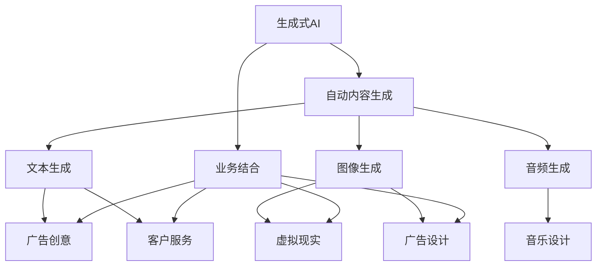

                 

# AIGC：如何利用生成式AI实现商业创新？

> 关键词：生成式AI, 自动生成内容, 商业创新, AI驱动决策, 智能客服, 个性化推荐, 广告生成, 媒体创意, 技术解决方案

## 1. 背景介绍

### 1.1 问题由来

生成式人工智能（AIGC, AI Generated Content）作为人工智能领域的重要分支，通过深度学习等先进技术手段，可以从海量数据中自动生成高质量的文本、图像、音频等各类内容，极大地提升了内容生产的效率和质量。在商业领域，AIGC技术的应用已经展现出巨大的潜力，它不仅可以加速内容生成，还能提供精准的商业分析和决策支持，驱动创新业务的开展。

近年来，AIGC技术在媒体、广告、电商、客服等行业中得到了广泛的应用，显著提升了内容创造的效率和质量，同时也为商业模式的创新提供了新的思路和工具。但随之而来的，是如何在保障内容生成质量的同时，更好地融入实际业务，形成闭环、可持续发展的商业模式，成为了行业关注的焦点。

### 1.2 问题核心关键点

1. **自动生成内容的质量和多样性**：高质量的内容生成是AIGC技术发挥作用的基础，如何保证生成的内容在语义、风格等方面满足实际应用需求，是技术实现的关键。
2. **内容生成与商业策略的协同**：如何将AIGC技术有效融入商业决策和运营流程，使其真正成为商业创新和效率提升的驱动力，是商业应用的核心。
3. **模型训练和部署的效率**：在处理海量数据、复杂任务时，如何优化模型训练和部署流程，保障技术的高效可用，是技术落地的重要环节。
4. **用户隐私和数据安全的保障**：AIGC技术依赖大量数据，如何确保数据使用的合法性、保护用户隐私，是技术应用中的伦理和安全问题。

### 1.3 问题研究意义

AIGC技术的商业应用，能够为行业带来显著的创新和效率提升。它不仅能够显著降低内容生产的成本和周期，还能够在广告投放、客户服务、个性化推荐等场景中提供精准的商业决策支持，驱动业务模式变革。在媒体、广告、电商等行业中，AIGC技术已经展现出了巨大的潜力和广阔的应用前景。

通过对AIGC技术的深入研究，我们可以更好地理解其工作原理和应用方法，明确其在商业创新中的价值和局限性。这将有助于我们设计更高效、更安全的商业应用方案，促进AIGC技术的落地和产业发展。

## 2. 核心概念与联系

### 2.1 核心概念概述

为更好地理解AIGC技术的商业应用，本节将介绍几个核心概念及其相互关系：

- **生成式AI（AIGC）**：通过深度学习等技术手段，自动生成高质量文本、图像、音频等多模态内容，广泛应用于内容生成、广告创意、客户服务等场景。
- **自动内容生成（Content Generation）**：利用深度学习模型自动生成文本、图片等内容的流程，是AIGC技术的主要应用方向。
- **文本生成（Text Generation）**：通过语言模型，自动生成连贯、合法的文本内容，是AIGC技术的重要分支。
- **图像生成（Image Generation）**：利用生成对抗网络（GAN）等技术，生成具有高度逼真度和多样性的图像内容，广泛应用于广告设计、虚拟现实等场景。
- **音频生成（Audio Generation）**：通过声音合成技术，自动生成语音、音乐等内容，是AIGC技术的重要组成部分。
- **AIGC与业务结合**：将AIGC技术融入实际商业流程中，如广告投放、客户服务、个性化推荐等，以提升业务效率和用户体验。

这些核心概念之间的逻辑关系可以通过以下Mermaid流程图来展示：



这个流程图展示了生成式AI与自动内容生成之间的关系，以及各生成技术在广告创意、客户服务、虚拟现实、音乐设计等具体业务场景中的应用。

## 3. 核心算法原理 & 具体操作步骤

### 3.1 算法原理概述

AIGC技术的核心在于自动生成高质量的内容。其核心算法原理包括：

1. **深度学习模型**：利用神经网络模型对输入数据进行学习和生成，是AIGC技术实现的基础。
2. **语言模型**：通过统计语言学和深度学习的结合，构建能够自动生成连贯、合法的文本的模型，是文本生成的核心。
3. **生成对抗网络（GAN）**：利用两个对抗神经网络，生成具有高度逼真度和多样性的图像内容，是图像生成的主要技术。
4. **声音合成技术**：通过声学模型和深度学习，自动生成语音和音乐内容，是音频生成的核心。
5. **多模态生成**：结合文本、图像、音频等多模态数据，生成具有综合性和沉浸性的内容，是未来发展的方向。

### 3.2 算法步骤详解

基于深度学习的AIGC技术主要包括以下几个关键步骤：

**Step 1: 数据收集与预处理**
- 收集与业务相关的数据，如新闻、广告、客户反馈等。
- 对数据进行清洗、标注、归一化等预处理，确保数据质量。

**Step 2: 模型训练**
- 选择合适的深度学习模型，如语言模型、GAN等。
- 在大量标注数据上训练模型，调整模型参数。
- 使用验证集对模型进行评估，防止过拟合。

**Step 3: 内容生成**
- 使用训练好的模型自动生成文本、图像、音频等内容。
- 根据实际需求对生成的内容进行后处理，如分词、编辑、格式化等。

**Step 4: 质量评估与反馈**
- 通过人工或自动评估方法，评估生成内容的语义准确性、风格一致性等。
- 收集用户反馈，进一步优化模型。

**Step 5: 业务集成**
- 将生成的内容集成到业务流程中，如广告投放、客户服务、个性化推荐等。
- 实时监控系统性能，及时优化。

### 3.3 算法优缺点

AIGC技术具有以下优点：
1. **高效**：自动生成内容大大降低了人工成本，提升了内容生产的效率。
2. **多样化**：生成的内容风格多样，可以适应不同的业务需求。
3. **精准**：基于大量数据训练，生成的内容能够更好地满足实际需求。

但同时，AIGC技术也存在一些局限性：
1. **生成质量不稳定**：模型训练质量、数据质量等因素都会影响生成内容的连贯性和准确性。
2. **依赖数据**：生成的内容质量高度依赖于数据质量和模型训练的充分程度。
3. **伦理问题**：生成的内容可能包含误导性、歧视性等不良信息。

### 3.4 算法应用领域

AIGC技术在多个领域中得到了广泛应用，具体包括：

1. **广告创意**：利用文本生成、图像生成等技术，自动生成广告文案、设计广告图片，提升广告创作效率。
2. **客户服务**：通过聊天机器人等应用，自动生成客户回复，提升客户服务效率和质量。
3. **个性化推荐**：利用生成式模型生成个性化商品描述、推荐理由等，提升推荐系统的准确性和用户体验。
4. **媒体内容创作**：自动生成新闻、文章、视频等内容，提升内容创作效率和质量。
5. **游戏设计**：自动生成游戏角色、背景、任务等内容，加速游戏设计流程。

## 4. 数学模型和公式 & 详细讲解 & 举例说明

### 4.1 数学模型构建

AIGC技术的核心算法可以抽象为如下数学模型：

- **文本生成模型**：基于语言模型，定义自动生成文本的公式，如LSTM、Transformer等。
- **图像生成模型**：基于生成对抗网络（GAN），定义自动生成图像的公式，如DCGAN、CycleGAN等。
- **声音合成模型**：基于声学模型，定义自动生成语音的公式，如WaveNet、VQ-VAE等。

### 4.2 公式推导过程

以文本生成模型为例，假设输入为 $x$，输出为 $y$，则文本生成模型可以表示为：

$$
P(y|x) = \frac{e^{E(x;y)}}{Z(x)}
$$

其中 $E(x;y)$ 为能量函数，$Z(x)$ 为归一化因子。能量函数 $E(x;y)$ 表示输入 $x$ 与输出 $y$ 的关联程度，归一化因子 $Z(x)$ 用于保证概率分布的总和为1。

在实际应用中，常用的生成模型如LSTM、Transformer等，通过训练大量的文本数据，学习到文本序列的概率分布，进而生成新的文本。这些模型通过最小化损失函数 $L$ 来优化参数，如：

$$
L = -\sum_{y} P(y|x) \log Q(y|x)
$$

其中 $P(y|x)$ 为模型的预测概率分布，$Q(y|x)$ 为目标分布，目标分布通常为真实的文本序列。通过优化损失函数，模型可以生成与真实文本接近的文本。

### 4.3 案例分析与讲解

以Adobe公司利用生成式AI技术提升广告创意效率为例。Adobe通过训练基于LSTM的文本生成模型，自动生成广告文案。具体步骤如下：

1. 数据收集：收集历史广告文案及其对应的点击率、转化率等指标。
2. 数据预处理：对文本进行清洗、分词、归一化等处理。
3. 模型训练：使用大规模标注数据训练LSTM模型，调整模型参数。
4. 内容生成：在广告投放前，自动生成多个广告文案，并进行A/B测试。
5. 效果评估：根据点击率、转化率等指标评估生成文案的效果，优化模型。

通过这种方式，Adobe大大提升了广告创意的速度和质量，同时节省了大量的创意设计人员，实现了业务效率的显著提升。

## 5. 项目实践：代码实例和详细解释说明

### 5.1 开发环境搭建

在进行AIGC技术的应用开发前，需要搭建相应的开发环境。以下是使用Python和PyTorch进行开发的环境配置流程：

1. 安装Anaconda：从官网下载并安装Anaconda，用于创建独立的Python环境。
2. 创建并激活虚拟环境：
```bash
conda create -n aigc-env python=3.8 
conda activate aigc-env
```
3. 安装PyTorch：根据CUDA版本，从官网获取对应的安装命令。例如：
```bash
conda install pytorch torchvision torchaudio cudatoolkit=11.1 -c pytorch -c conda-forge
```
4. 安装其他依赖库：
```bash
pip install transformers
pip install scipy
```

完成上述步骤后，即可在`aigc-env`环境中开始开发实践。

### 5.2 源代码详细实现

下面以图像生成模型（GAN）为例，给出使用PyTorch进行图像生成的代码实现。

首先，定义图像生成模型和优化器：

```python
import torch
import torch.nn as nn
import torch.optim as optim

class Generator(nn.Module):
    def __init__(self, input_size, output_size):
        super(Generator, self).__init__()
        self.fc = nn.Linear(input_size, 256)
        self.fc2 = nn.Linear(256, 256)
        self.fc3 = nn.Linear(256, output_size)

    def forward(self, x):
        x = torch.relu(self.fc(x))
        x = torch.relu(self.fc2(x))
        x = torch.tanh(self.fc3(x))
        return x

class Discriminator(nn.Module):
    def __init__(self, input_size, output_size):
        super(Discriminator, self).__init__()
        self.fc = nn.Linear(input_size, 256)
        self.fc2 = nn.Linear(256, 256)
        self.fc3 = nn.Linear(256, output_size)

    def forward(self, x):
        x = torch.relu(self.fc(x))
        x = torch.relu(self.fc2(x))
        x = torch.sigmoid(self.fc3(x))
        return x

def train(model, data_loader, optimizer, device):
    model.to(device)
    for epoch in range(num_epochs):
        for batch_idx, (real_images, _) in enumerate(data_loader):
            real_images = real_images.to(device)

            # Train GAN

            # Generate fake images
            z = torch.randn(batch_size, z_dim).to(device)
            fake_images = model_G(z)
            loss_G = criterion_G(fake_images, real_images)
            optimizer_G.zero_grad()
            loss_G.backward()
            optimizer_G.step()

            # Train Discriminator

            real_images = real_images.to(device)
            fake_images = fake_images.to(device)

            real_outputs = model_D(real_images)
            fake_outputs = model_D(fake_images)

            # Loss and Backward
            loss_D_real = criterion_D(real_outputs, real_labels)
            loss_D_fake = criterion_D(fake_outputs, fake_labels)
            loss_D = loss_D_real + loss_D_fake
            optimizer_D.zero_grad()
            loss_D.backward()
            optimizer_D.step()

# 训练参数
input_size = 784
output_size = 784
z_dim = 100
num_epochs = 100
batch_size = 64
lr_G = 0.0002
lr_D = 0.0002

# 加载数据
data_loader = ...

# 定义模型
model_G = Generator(input_size, output_size)
model_D = Discriminator(input_size, output_size)
criterion_G = nn.BCELoss()
criterion_D = nn.BCELoss()
optimizer_G = optim.Adam(model_G.parameters(), lr=lr_G)
optimizer_D = optim.Adam(model_D.parameters(), lr=lr_D)

# 训练过程
train(model_G, model_D, data_loader, optimizer_G, optimizer_D, device)
```

然后，定义测试和评估函数：

```python
import matplotlib.pyplot as plt

def generate_and_save_images(model, num_images, device, output_dir):
    z = torch.randn(num_images, z_dim).to(device)
    images = model_G(z)
    images = (images + 1) / 2
    for i in range(num_images):
        plt.imshow(images[i].cpu().detach().numpy(), cmap='gray')
        plt.savefig(output_dir + '/image_' + str(i) + '.png')
        plt.close()

# 测试和评估
num_images = 16
generate_and_save_images(model_G, num_images, device, output_dir)
```

以上代码实现了基于GAN的图像生成过程，并生成了一些测试图像。通过这种方式，可以直观地展示AIGC技术在图像生成中的应用。

### 5.3 代码解读与分析

下面是关键代码的解读：

**Generator类**：
- `__init__`方法：定义模型的层结构，包括全连接层。
- `forward`方法：实现模型的前向传播，生成图像。

**Discriminator类**：
- `__init__`方法：定义模型的层结构，包括全连接层。
- `forward`方法：实现模型的前向传播，判断图像是真实图像还是生成的图像。

**train函数**：
- 加载数据，将数据加载到GPU上。
- 生成和训练生成器和判别器。
- 计算损失函数，并反向传播更新模型参数。

**生成和保存图像**：
- 生成随机噪声向量，通过生成器生成图像。
- 将图像标准化，并进行保存。

通过以上代码，可以看出AIGC技术在图像生成中的应用过程。在实际应用中，还需要进一步优化模型、调整参数等，以提升生成图像的质量和多样性。

## 6. 实际应用场景

### 6.1 智能客服系统

基于AIGC技术的智能客服系统，可以大大提升客户服务的效率和质量。传统客服依赖人力，成本高、效率低，且服务质量难以保障。AIGC技术可以通过训练模型，自动生成客户回复，提升客服服务效率，并提高服务质量。

在技术实现上，可以收集历史客服对话记录，将问题和最佳答复构建成监督数据，训练生成式模型。微调后的模型能够自动理解用户意图，生成合适的回复，减少对人工客服的依赖，提升客户满意度。

### 6.2 媒体内容创作

AIGC技术在媒体内容创作中展现了巨大的潜力。通过训练生成式模型，自动生成新闻、文章、视频等内容，大幅提升内容创作效率，降低成本。

在实际应用中，可以将AIGC技术与传统媒体内容创作流程相结合，实现自动生成内容的辅助和优化。例如，通过自动生成文案、设计广告图片，媒体公司可以节省大量人工成本，提升内容质量。

### 6.3 广告创意

AIGC技术在广告创意中也得到了广泛应用。通过训练文本生成模型，自动生成广告文案，提升广告创意的速度和质量，降低广告制作成本。

在实际应用中，可以将AIGC技术与广告创意流程相结合，实现自动生成广告文案的辅助和优化。例如，通过自动生成多个广告文案，并进行A/B测试，广告公司可以快速找到最优的广告创意方案，提升广告效果。

## 7. 工具和资源推荐

### 7.1 学习资源推荐

为了帮助开发者系统掌握AIGC技术的理论基础和实践技巧，这里推荐一些优质的学习资源：

1. **《生成式深度学习》（Generative Deep Learning）**：由Ian Goodfellow等编写的生成式深度学习的经典教材，涵盖生成模型、GAN等前沿技术。
2. **《深度学习与Python》（Deep Learning with Python）**：由Francois Chollet撰写的深度学习入门书籍，深入浅出地介绍了深度学习基础和实际应用。
3. **《Python深度学习》（Deep Learning with Python）**：由Tom Hopek、Gideon Lenkey等编写的深度学习实践书籍，涵盖深度学习模型的构建和优化。
4. **Hugging Face官方文档**：Hugging Face的生成式AI技术文档，提供丰富的预训练模型和代码样例，是学习AIGC技术的必备资源。
5. **CS231n《深度学习计算机视觉》课程**：斯坦福大学开设的计算机视觉课程，涵盖生成对抗网络（GAN）等生成式技术，适合学习图像生成等具体应用。

通过这些资源的学习实践，相信你一定能够快速掌握AIGC技术的精髓，并用于解决实际的业务问题。

### 7.2 开发工具推荐

高效的开发离不开优秀的工具支持。以下是几款用于AIGC技术开发的常用工具：

1. **PyTorch**：基于Python的开源深度学习框架，灵活动态的计算图，适合快速迭代研究。大部分预训练生成模型都有PyTorch版本的实现。
2. **TensorFlow**：由Google主导开发的开源深度学习框架，生产部署方便，适合大规模工程应用。同样有丰富的预训练生成模型资源。
3. **Hugging Face Transformers库**：提供大量的预训练生成模型，支持PyTorch和TensorFlow，是进行生成内容开发的利器。
4. **Weights & Biases**：模型训练的实验跟踪工具，可以记录和可视化模型训练过程中的各项指标，方便对比和调优。
5. **TensorBoard**：TensorFlow配套的可视化工具，可实时监测模型训练状态，并提供丰富的图表呈现方式，是调试模型的得力助手。
6. **Adobe Creative Cloud**：专业的创意工具平台，提供图像生成、视频编辑等多项功能，适合媒体内容创作。

合理利用这些工具，可以显著提升AIGC技术开发的速度和质量，加速创新迭代的步伐。

### 7.3 相关论文推荐

AIGC技术的发展源于学界的持续研究。以下是几篇奠基性的相关论文，推荐阅读：

1. **Generative Adversarial Nets（GAN）**：Ian Goodfellow等提出的生成对抗网络，开创了生成式AI的先河。
2. **Attention Is All You Need（Transformer）**：Ashish Vaswani等提出的Transformer模型，推动了深度学习在自然语言处理领域的发展。
3. **WaveNet**：Dmitri V. Vigneshwarkar等提出的声音合成模型，实现了高质量的语音生成。
4. **BERT: Pre-training of Deep Bidirectional Transformers for Language Understanding**：Devlin等提出的BERT模型，通过掩码语言模型等技术，提升了文本生成的质量。
5. **DALL-E**：OpenAI开发的图像生成模型，能够生成高度逼真和多样性的图像内容。
6. **VQ-VAE**：Jonathan Weiss等提出的生成模型，将向量量化技术与变分自编码器相结合，实现了高质量的图像生成。

这些论文代表了大语言模型微调技术的发展脉络。通过学习这些前沿成果，可以帮助研究者把握学科前进方向，激发更多的创新灵感。

## 8. 总结：未来发展趋势与挑战

### 8.1 总结

本文对AIGC技术的商业应用进行了全面系统的介绍。首先阐述了AIGC技术的背景和意义，明确了其在内容生成、广告创意、客户服务等领域的应用价值。其次，从原理到实践，详细讲解了AIGC技术的核心算法和操作步骤，给出了具体的代码实例。同时，本文还广泛探讨了AIGC技术在多个行业领域的应用前景，展示了其广阔的商业应用潜力。

通过本文的系统梳理，可以看到，AIGC技术正在成为内容生成领域的重要工具，极大地提升了内容创作的效率和质量，为商业模式的创新提供了新的思路和工具。

### 8.2 未来发展趋势

展望未来，AIGC技术的发展趋势将呈现以下几个方向：

1. **多模态生成**：结合文本、图像、音频等多模态数据，生成更加综合、沉浸性的内容。
2. **个性化生成**：通过用户画像和行为数据，生成更加个性化的内容，提升用户体验。
3. **实时生成**：利用流式数据和动态模型，实现实时内容生成，提升内容创作的时效性。
4. **跨领域应用**：拓展到更多领域，如医疗、法律、金融等，推动技术在更多场景中的应用。
5. **伦理和社会责任**：关注AIGC技术的伦理问题，确保生成的内容符合社会公德，尊重用户隐私。

这些趋势凸显了AIGC技术在商业应用中的广阔前景。这些方向的探索发展，必将进一步提升AIGC技术在内容创作、广告创意、客户服务等领域的应用，为行业带来更深远的变革。

### 8.3 面临的挑战

尽管AIGC技术已经取得了显著的进展，但在应用过程中，仍面临着诸多挑战：

1. **生成内容的质量和多样性**：生成的内容质量与模型训练数据、算法优化等因素密切相关，如何提升内容生成质量，保持内容多样性，仍需进一步研究。
2. **技术落地成本**：生成式AI技术的开发和部署需要大量计算资源和人力投入，如何降低技术落地成本，提升技术可扩展性，仍需深入研究。
3. **伦理和社会责任**：生成的内容可能包含误导性、歧视性等不良信息，如何确保内容生成符合社会公德，尊重用户隐私，仍需严格监管和规范。
4. **技术可解释性**：AIGC技术通常是“黑盒”系统，如何提升生成内容的可解释性，确保其决策过程的透明性，仍需进一步探索。
5. **跨领域应用能力**：AIGC技术在不同领域的应用效果仍需进一步验证，如何在不同领域中发挥最大效用，仍需深入研究。

正视这些挑战，积极应对并寻求突破，将是大语言模型微调技术迈向成熟的必由之路。相信随着学界和产业界的共同努力，这些挑战终将一一被克服，AIGC技术必将在构建人机协同的智能时代中扮演越来越重要的角色。

### 8.4 研究展望

面对AIGC技术面临的挑战，未来的研究需要在以下几个方面寻求新的突破：

1. **数据增强和模型优化**：通过数据增强和模型优化，提升内容生成质量，增加内容多样性。
2. **多模态融合**：结合多种模态数据，提升内容生成的综合性和沉浸性。
3. **跨领域应用**：拓展到更多领域，提升技术在不同领域的应用效果。
4. **伦理和社会责任**：关注AIGC技术的伦理问题，确保生成的内容符合社会公德，尊重用户隐私。
5. **可解释性和透明性**：提升生成内容的可解释性，确保其决策过程的透明性。
6. **跨学科合作**：与伦理学、心理学等学科合作，提升AIGC技术的伦理和社会责任意识。

这些研究方向的探索，必将引领AIGC技术迈向更高的台阶，为构建安全、可靠、可解释、可控的智能系统铺平道路。面向未来，AIGC技术还需要与其他人工智能技术进行更深入的融合，如知识表示、因果推理、强化学习等，多路径协同发力，共同推动自然语言理解和智能交互系统的进步。只有勇于创新、敢于突破，才能不断拓展AIGC技术的边界，让智能技术更好地造福人类社会。

## 9. 附录：常见问题与解答

**Q1：AIGC技术是否适用于所有领域？**

A: AIGC技术在许多领域都具有广泛的应用前景，但在某些特定领域，如医疗、法律等，可能还需要结合领域专家知识和特定数据进行优化。此外，对于需要高精准度的任务，AIGC技术可能需要进行进一步的微调和优化。

**Q2：如何评估AIGC生成的内容质量？**

A: 评估AIGC生成的内容质量，通常需要从多个维度进行考虑，如语义连贯性、风格一致性、多样性等。可以通过人工评估、自动化评估等多种方式进行。对于语义连贯性，可以通过BLEU、ROUGE等指标进行评估；对于风格一致性，可以通过BERT等模型进行评估；对于多样性，可以通过GAN等模型进行评估。

**Q3：AIGC技术在落地应用时需要注意哪些问题？**

A: 在AIGC技术落地应用时，需要注意以下问题：
1. 数据质量：确保输入数据的质量，避免噪声和错误对生成效果的影响。
2. 计算资源：AIGC技术需要大量计算资源，需要合理规划硬件配置。
3. 模型训练时间：模型训练时间较长，需要合理设置训练参数和优化策略。
4. 生成内容伦理：生成的内容需要符合社会公德，避免不良信息的传播。
5. 用户隐私保护：确保用户数据的安全性和隐私保护，避免数据泄露风险。

合理规避这些问题，可以有效提升AIGC技术的落地效果，确保其应用安全性和可靠性。

**Q4：AIGC技术在实际应用中如何提升用户体验？**

A: 通过AIGC技术提升用户体验，可以从以下几个方面进行：
1. 内容多样化：生成多种风格和内容形式，满足不同用户需求。
2. 个性化推荐：根据用户画像和行为数据，生成个性化内容。
3. 实时生成：利用流式数据和动态模型，实现实时内容生成。
4. 交互优化：结合自然语言处理技术，提升人机交互体验。
5. 跨领域应用：拓展到更多领域，提升技术在不同领域的应用效果。

通过这些措施，可以有效提升用户对AIGC技术的使用体验，提升用户满意度和忠诚度。

---

作者：禅与计算机程序设计艺术 / Zen and the Art of Computer Programming

