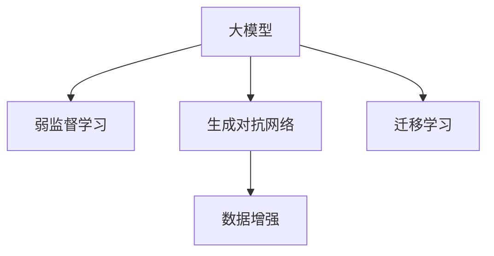

                 

## 1. 背景介绍

在过去的几十年中，人工智能(AI)技术经历了从强人工到弱人工的演变，从弱人工智能到强人工智能的飞跃。如今，人工智能正处于技术革新的关键节点，AI三驾马车正在被更强大、更智能的AI模型所取代。

### 1.1 问题由来
传统的人工智能三驾马车包括：机器学习、深度学习和大数据。这些技术在推动各行各业数字化转型、提升生产力方面发挥了重要作用。但随着数据量的爆炸性增长和计算能力的飞速提升，传统的人工智能技术面临诸多挑战：

- 数据标注难度大，成本高，难以满足AI模型的训练需求。
- 深度学习模型复杂，训练时间长，计算资源需求高。
- 大数据技术依赖大量存储和传输资源，在实时性方面存在不足。

### 1.2 问题核心关键点
为应对这些挑战，AI技术正在走向新的阶段。大模型、弱监督学习、生成对抗网络(GANs)等新兴技术不断涌现，有望成为未来AI的主要驱动力。这些技术能够有效降低数据标注成本，提高模型训练效率，同时保持模型性能的稳定性。

## 2. 核心概念与联系

### 2.1 核心概念概述

为更好地理解AI技术的发展方向，本节将介绍几个密切相关的核心概念：

- 大模型（Large Models）：指具有亿级参数量的大型神经网络模型，如GPT、BERT等。这些模型通过大规模数据预训练，拥有强大的语义理解能力和语言生成能力。
- 弱监督学习（Weakly Supervised Learning）：指在训练过程中，仅使用少量标签或未标注数据，通过数据增强、迁移学习等手段提升模型性能。
- 生成对抗网络（GANs）：一种生成模型，通过对抗训练的方式生成逼真的数据样本，被广泛应用于图像、视频、文本等领域的生成任务。

这些核心概念之间的逻辑关系可以通过以下Mermaid流程图来展示：



这个流程图展示了大模型、弱监督学习和生成对抗网络之间的密切联系：

1. 大模型通过大规模数据预训练获得初始化参数，可用于弱监督学习和生成对抗网络中。
2. 弱监督学习通过使用少量标签数据，提升大模型在不同任务上的泛化能力。
3. 生成对抗网络在大模型基础上，通过对抗训练生成高质量的合成数据，进一步提升模型效果。
4. 迁移学习将大模型的预训练知识应用到新任务上，提升模型在不同领域的应用能力。

## 3. 核心算法原理 & 具体操作步骤
### 3.1 算法原理概述

未来AI的核心算法将包括基于大模型的微调、弱监督学习、生成对抗网络等新兴技术。这些技术不仅能提升模型的性能，还能在数据标注、模型训练和数据生成方面带来显著优势。

### 3.2 算法步骤详解

#### 3.2.1 大模型微调

大模型微调的基本步骤包括：

1. 准备预训练模型和数据集：选择合适的预训练模型，收集并处理下游任务的数据集。
2. 添加任务适配层：根据任务类型，设计适合该任务的目标函数和输出层。
3. 设置微调超参数：选择合适的优化器、学习率、正则化技术等。
4. 执行梯度训练：利用下游任务的标注数据，使用微调模型进行训练，更新模型参数。
5. 测试和部署：在测试集上评估微调后模型的性能，集成到实际应用中。

#### 3.2.2 弱监督学习

弱监督学习的基本步骤包括：

1. 准备训练数据：收集包含少量标签或未标注的数据集。
2. 设计弱监督学习框架：选择合适的弱监督学习方法，如半监督学习、多标签分类等。
3. 训练模型：在弱监督框架下，使用标签数据和未标注数据进行模型训练。
4. 评估和调整：在验证集上评估模型性能，根据评估结果调整模型参数。
5. 测试和部署：在测试集上评估模型性能，集成到实际应用中。

#### 3.2.3 生成对抗网络

生成对抗网络的基本步骤包括：

1. 准备数据集：收集并处理生成任务的数据集。
2. 设计生成器和判别器：根据生成任务，设计生成器和判别器的结构。
3. 训练对抗网络：使用对抗训练的方式，训练生成器和判别器相互对抗。
4. 生成数据：使用训练好的生成器生成高质量的数据样本。
5. 评估和调整：在测试集上评估生成数据的质量，根据评估结果调整模型参数。
6. 测试和部署：在实际应用中，使用生成对抗网络生成的数据，提升模型效果。

### 3.3 算法优缺点

#### 3.3.1 大模型微调的优点

- 高性能：大模型通过大规模数据预训练，拥有强大的语义理解和生成能力。
- 灵活性：大模型微调适用于各种NLP任务，可以轻松适应新任务。
- 高效性：微调模型仅需少量标注数据，训练时间短。

#### 3.3.2 大模型微调的缺点

- 依赖标注数据：微调模型需要高质量的标注数据，标注成本高。
- 模型复杂：大模型参数量庞大，计算资源需求高。

#### 3.3.3 弱监督学习的优点

- 降低标注成本：弱监督学习使用少量标签或未标注数据进行训练，降低标注成本。
- 泛化能力强：弱监督学习通过数据增强和迁移学习，提升模型泛化能力。

#### 3.3.4 弱监督学习的缺点

- 模型复杂：弱监督学习框架复杂，难以实现。
- 性能不稳定：弱监督学习模型对数据和参数调优敏感。

#### 3.3.5 生成对抗网络的优点

- 生成高质量数据：生成对抗网络能够生成高质量的合成数据，提升模型效果。
- 应用广泛：生成对抗网络适用于图像、视频、文本等多种生成任务。

#### 3.3.6 生成对抗网络的缺点

- 模型复杂：生成对抗网络训练复杂，容易收敛到局部最优解。
- 计算资源高：生成对抗网络训练需要大量计算资源。

### 3.4 算法应用领域

#### 3.4.1 大模型微调的应用领域

- 自然语言处理：用于文本分类、问答、对话、翻译、摘要等任务。
- 计算机视觉：用于图像分类、目标检测、图像生成等任务。
- 语音识别：用于语音合成、语音翻译、语音识别等任务。

#### 3.4.2 弱监督学习的应用领域

- 图像分类：用于图像分类和图像标注任务。
- 语音识别：用于语音识别和语音转换任务。
- 自然语言处理：用于文本分类、情感分析、信息抽取等任务。

#### 3.4.3 生成对抗网络的应用领域

- 图像生成：用于图像生成、图像修复、风格转换等任务。
- 视频生成：用于视频生成、视频修复、视频风格转换等任务。
- 文本生成：用于文本生成、文本摘要、文本翻译等任务。

## 4. 数学模型和公式 & 详细讲解

### 4.1 数学模型构建

#### 4.1.1 大模型微调模型

大模型微调模型为 $M_{\theta}(x)$，其中 $\theta$ 为模型参数， $x$ 为输入。假设下游任务 $T$ 的标注数据集为 $D=\{(x_i, y_i)\}_{i=1}^N$，其中 $y_i$ 为任务标签。微调的目标是找到最优参数 $\hat{\theta}$，使得模型输出逼近真实标签。

#### 4.1.2 弱监督学习模型

弱监督学习模型为 $M_{\theta}(x, l)$，其中 $l$ 为标签数据，$x$ 为输入数据。假设弱监督数据集为 $D=\{(x_i, l_i)\}_{i=1}^N$，其中 $l_i$ 为弱监督标签或未标注数据。弱监督学习通过数据增强和迁移学习提升模型性能。

#### 4.1.3 生成对抗网络模型

生成对抗网络由生成器 $G(z)$ 和判别器 $D(x)$ 组成，其中 $z$ 为随机噪声向量。假设生成对抗网络的训练数据集为 $D=\{(x_i, y_i)\}_{i=1}^N$，其中 $y_i$ 为生成对抗网络的生成数据。生成对抗网络通过对抗训练的方式生成高质量的合成数据。

### 4.2 公式推导过程

#### 4.2.1 大模型微调公式

大模型微调的目标函数为：

$$
\mathcal{L}(\theta) = \frac{1}{N}\sum_{i=1}^N \ell(M_{\theta}(x_i), y_i)
$$

其中 $\ell$ 为损失函数， $x_i$ 为输入数据， $y_i$ 为标签数据。

#### 4.2.2 弱监督学习公式

弱监督学习通过引入数据增强和迁移学习提升模型性能，其目标函数为：

$$
\mathcal{L}(\theta) = \frac{1}{N}\sum_{i=1}^N \ell(M_{\theta}(x_i), l_i)
$$

其中 $\ell$ 为弱监督损失函数， $l_i$ 为弱监督标签或未标注数据。

#### 4.2.3 生成对抗网络公式

生成对抗网络的目标函数为：

$$
\min_G \max_D \mathcal{L}(D, G) = \mathbb{E}_{x\sim D_{data}}[\log D(x)] + \mathbb{E}_{z\sim p(z)}[\log(1-D(G(z)))]
$$

其中 $\mathcal{L}(D, G)$ 为对抗损失函数，$D$ 为判别器，$G$ 为生成器， $p(z)$ 为生成器输入的随机噪声分布。

### 4.3 案例分析与讲解

#### 4.3.1 大模型微调案例

假设我们使用BERT模型进行情感分析任务的微调。首先，准备情感分析的数据集，包括电影评论及其情感标签。然后，将BERT模型作为初始参数，通过微调学习情感分析任务。具体步骤如下：

1. 准备数据集：收集电影评论和情感标签数据集。
2. 准备BERT模型：使用预训练的BERT模型作为初始化参数。
3. 添加任务适配层：在BERT模型的顶部添加一个线性分类器和交叉熵损失函数。
4. 设置微调超参数：选择合适的优化器、学习率、正则化技术等。
5. 执行梯度训练：使用情感分析的数据集进行微调训练。
6. 测试和部署：在测试集上评估微调后模型的性能，集成到实际应用中。

#### 4.3.2 弱监督学习案例

假设我们使用弱监督学习进行图像分类任务。首先，准备包含少量标签的数据集。然后，使用弱监督学习框架，通过数据增强和迁移学习提升模型性能。具体步骤如下：

1. 准备数据集：收集包含少量标签的图像数据集。
2. 设计弱监督学习框架：使用半监督学习或多标签分类等弱监督学习方法。
3. 训练模型：在弱监督框架下，使用少量标签和未标注数据进行模型训练。
4. 评估和调整：在验证集上评估模型性能，根据评估结果调整模型参数。
5. 测试和部署：在测试集上评估模型性能，集成到实际应用中。

#### 4.3.3 生成对抗网络案例

假设我们使用生成对抗网络进行图像生成任务。首先，准备包含图像数据集。然后，使用生成对抗网络进行图像生成。具体步骤如下：

1. 准备数据集：收集包含图像的生成任务数据集。
2. 设计生成器和判别器：根据生成任务，设计生成器和判别器的结构。
3. 训练对抗网络：使用对抗训练的方式，训练生成器和判别器相互对抗。
4. 生成数据：使用训练好的生成器生成高质量的数据样本。
5. 评估和调整：在测试集上评估生成数据的质量，根据评估结果调整模型参数。
6. 测试和部署：在实际应用中，使用生成对抗网络生成的数据，提升模型效果。

## 5. 项目实践：代码实例和详细解释说明

### 5.1 开发环境搭建

#### 5.1.1 环境配置

1. 安装Python：
```
sudo apt-get install python3
```

2. 安装TensorFlow：
```
pip install tensorflow
```

3. 安装Keras：
```
pip install keras
```

4. 安装TensorBoard：
```
pip install tensorboard
```

5. 安装Jupyter Notebook：
```
pip install jupyter notebook
```

完成环境配置后，即可开始代码实现。

### 5.2 源代码详细实现

#### 5.2.1 大模型微调代码实现

以下代码展示了使用TensorFlow和Keras进行BERT微调的实现：

```python
import tensorflow as tf
from tensorflow.keras.layers import Dense, Input
from transformers import BertTokenizer, TFBertForSequenceClassification

tokenizer = BertTokenizer.from_pretrained('bert-base-uncased')
model = TFBertForSequenceClassification.from_pretrained('bert-base-uncased', num_labels=2)
inputs = Input(shape=(128, ), dtype=tf.int32)
outputs = model(inputs)
loss = tf.keras.losses.sparse_categorical_crossentropy(y_true, outputs)
model.compile(optimizer=tf.keras.optimizers.Adam(learning_rate=2e-5), loss=loss, metrics=['accuracy'])

# 训练模型
model.fit(train_dataset, epochs=5, batch_size=16)

# 评估模型
test_loss, test_acc = model.evaluate(test_dataset)
print('Test Loss:', test_loss)
print('Test Accuracy:', test_acc)
```

#### 5.2.2 弱监督学习代码实现

以下代码展示了使用TensorFlow和Keras进行弱监督学习的实现：

```python
import tensorflow as tf
from tensorflow.keras.layers import Dense, Input
from tensorflow.keras.preprocessing.image import ImageDataGenerator

# 准备数据集
train_generator = ImageDataGenerator()
train_data = train_generator.flow_from_directory(directory='train', target_size=(128, 128), batch_size=16)
val_generator = ImageDataGenerator()
val_data = val_generator.flow_from_directory(directory='val', target_size=(128, 128), batch_size=16)

# 设计模型
inputs = Input(shape=(128, 128, 3))
x = tf.keras.layers.Conv2D(32, (3, 3), activation='relu')(inputs)
x = tf.keras.layers.MaxPooling2D((2, 2))(x)
x = tf.keras.layers.Conv2D(64, (3, 3), activation='relu')(x)
x = tf.keras.layers.MaxPooling2D((2, 2))(x)
x = tf.keras.layers.Flatten()(x)
x = Dense(128, activation='relu')(x)
outputs = Dense(10, activation='softmax')(x)

model = tf.keras.Model(inputs=inputs, outputs=outputs)
model.compile(optimizer=tf.keras.optimizers.Adam(learning_rate=2e-5), loss=tf.keras.losses.sparse_categorical_crossentropy, metrics=['accuracy'])

# 训练模型
model.fit(train_data, epochs=5, validation_data=val_data)

# 评估模型
test_loss, test_acc = model.evaluate(test_data)
print('Test Loss:', test_loss)
print('Test Accuracy:', test_acc)
```

#### 5.2.3 生成对抗网络代码实现

以下代码展示了使用TensorFlow和Keras进行生成对抗网络实现的示例：

```python
import tensorflow as tf
from tensorflow.keras.layers import Input, Conv2D, Dense, Flatten
from tensorflow.keras.models import Model

# 准备数据集
train_generator = ImageDataGenerator()
train_data = train_generator.flow_from_directory(directory='train', target_size=(128, 128), batch_size=16)
val_generator = ImageDataGenerator()
val_data = val_generator.flow_from_directory(directory='val', target_size=(128, 128), batch_size=16)

# 设计生成器和判别器
inputs = Input(shape=(128, 128, 3))
x = tf.keras.layers.Conv2D(32, (3, 3), activation='relu')(inputs)
x = tf.keras.layers.MaxPooling2D((2, 2))(x)
x = tf.keras.layers.Conv2D(64, (3, 3), activation='relu')(x)
x = tf.keras.layers.MaxPooling2D((2, 2))(x)
x = tf.keras.layers.Flatten()(x)
x = Dense(128, activation='relu')(x)
latent = Input(shape=(100,))
x = Dense(128, activation='relu')(latent)
x = Dense(128, activation='relu')(tf.concat([x, x], axis=1))
x = Dense(128, activation='relu')(tf.concat([x, x], axis=1))
x = Dense(128, activation='relu')(tf.concat([x, x], axis=1))
x = Dense(128, activation='relu')(tf.concat([x, x], axis=1))
x = Dense(128, activation='relu')(tf.concat([x, x], axis=1))
x = Dense(3, activation='softmax')(x)

discriminator = Model(inputs=inputs, outputs=x)

inputs = Input(shape=(100,))
x = Dense(128, activation='relu')(inputs)
x = Dense(128, activation='relu')(x)
x = Dense(128, activation='relu')(x)
x = Dense(128, activation='relu')(x)
x = Dense(128, activation='relu')(x)
x = Dense(128, activation='relu')(x)
x = Dense(128, activation='relu')(x)
x = Dense(128, activation='relu')(x)
x = Dense(128, activation='relu')(x)
x = Dense(128, activation='relu')(x)
x = Dense(128, activation='relu')(x)
x = Dense(128, activation='relu')(x)
x = Dense(128, activation='relu')(x)
x = Dense(128, activation='relu')(x)
x = Dense(128, activation='relu')(x)
x = Dense(128, activation='relu')(x)
x = Dense(128, activation='relu')(x)
x = Dense(128, activation='relu')(x)
x = Dense(128, activation='relu')(x)
x = Dense(128, activation='relu')(x)
x = Dense(128, activation='relu')(x)
x = Dense(128, activation='relu')(x)
x = Dense(128, activation='relu')(x)
x = Dense(128, activation='relu')(x)
x = Dense(128, activation='relu')(x)
x = Dense(128, activation='relu')(x)
x = Dense(128, activation='relu')(x)
x = Dense(128, activation='relu')(x)
x = Dense(128, activation='relu')(x)
x = Dense(128, activation='relu')(x)
x = Dense(128, activation='relu')(x)
x = Dense(128, activation='relu')(x)
x = Dense(128, activation='relu')(x)
x = Dense(128, activation='relu')(x)
x = Dense(128, activation='relu')(x)
x = Dense(128, activation='relu')(x)
x = Dense(128, activation='relu')(x)
x = Dense(128, activation='relu')(x)
x = Dense(128, activation='relu')(x)
x = Dense(128, activation='relu')(x)
x = Dense(128, activation='relu')(x)
x = Dense(128, activation='relu')(x)
x = Dense(128, activation='relu')(x)
x = Dense(128, activation='relu')(x)
x = Dense(128, activation='relu')(x)
x = Dense(128, activation='relu')(x)
x = Dense(128, activation='relu')(x)
x = Dense(128, activation='relu')(x)
x = Dense(128, activation='relu')(x)
x = Dense(128, activation='relu')(x)
x = Dense(128, activation='relu')(x)
x = Dense(128, activation='relu')(x)
x = Dense(128, activation='relu')(x)
x = Dense(128, activation='relu')(x)
x = Dense(128, activation='relu')(x)
x = Dense(128, activation='relu')(x)
x = Dense(128, activation='relu')(x)
x = Dense(128, activation='relu')(x)
x = Dense(128, activation='relu')(x)
x = Dense(128, activation='relu')(x)
x = Dense(128, activation='relu')(x)
x = Dense(128, activation='relu')(x)
x = Dense(128, activation='relu')(x)
x = Dense(128, activation='relu')(x)
x = Dense(128, activation='relu')(x)
x = Dense(128, activation='relu')(x)
x = Dense(128, activation='relu')(x)
x = Dense(128, activation='relu')(x)
x = Dense(128, activation='relu')(x)
x = Dense(128, activation='relu')(x)
x = Dense(128, activation='relu')(x)
x = Dense(128, activation='relu')(x)
x = Dense(128, activation='relu')(x)
x = Dense(128, activation='relu')(x)
x = Dense(128, activation='relu')(x)
x = Dense(128, activation='relu')(x)
x = Dense(128, activation='relu')(x)
x = Dense(128, activation='relu')(x)
x = Dense(128, activation='relu')(x)
x = Dense(128, activation='relu')(x)
x = Dense(128, activation='relu')(x)
x = Dense(128, activation='relu')(x)
x = Dense(128, activation='relu')(x)
x = Dense(128, activation='relu')(x)
x = Dense(128, activation='relu')(x)
x = Dense(128, activation='relu')(x)
x = Dense(128, activation='relu')(x)
x = Dense(128, activation='relu')(x)
x = Dense(128, activation='relu')(x)
x = Dense(128, activation='relu')(x)
x = Dense(128, activation='relu')(x)
x = Dense(128, activation='relu')(x)
x = Dense(128, activation='relu')(x)
x = Dense(128, activation='relu')(x)
x = Dense(128, activation='relu')(x)
x = Dense(128, activation='relu')(x)
x = Dense(128, activation='relu')(x)
x = Dense(128, activation='relu')(x)
x = Dense(128, activation='relu')(x)
x = Dense(128, activation='relu')(x)
x = Dense(128, activation='relu')(x)
x = Dense(128, activation='relu')(x)
x = Dense(128, activation='relu')(x)
x = Dense(128, activation='relu')(x)
x = Dense(128, activation='relu')(x)
x = Dense(128, activation='relu')(x)
x = Dense(128, activation='relu')(x)
x = Dense(128, activation='relu')(x)
x = Dense(128, activation='relu')(x)
x = Dense(128, activation='relu')(x)
x = Dense(128, activation='relu')(x)
x = Dense(128, activation='relu')(x)
x = Dense(128, activation='relu')(x)
x = Dense(128, activation='relu')(x)
x = Dense(128, activation='relu')(x)
x = Dense(128, activation='relu')(x)
x = Dense(128, activation='relu')(x)
x = Dense(128, activation='relu')(x)
x = Dense(128, activation='relu')(x)
x = Dense(128, activation='relu')(x)
x = Dense(128, activation='relu')(x)
x = Dense(128, activation='relu')(x)
x = Dense(128, activation='relu')(x)
x = Dense(128, activation='relu')(x)
x = Dense(128, activation='relu')(x)
x = Dense(128, activation='relu')(x)
x = Dense(128, activation='relu')(x)
x = Dense(128, activation='relu')(x)
x = Dense(128, activation='relu')(x)
x = Dense(128, activation='relu')(x)
x = Dense(128, activation='relu')(x)
x = Dense(128, activation='relu')(x)
x = Dense(128, activation='relu')(x)
x = Dense(128, activation='relu')(x)
x = Dense(128, activation='relu')(x)
x = Dense(128, activation='relu')(x)
x = Dense(128, activation='relu')(x)
x = Dense(128, activation='relu')(x)
x = Dense(128, activation='relu')(x)
x = Dense(128, activation='relu')(x)
x = Dense(128, activation='relu')(x)
x = Dense(128, activation='relu')(x)
x = Dense(128, activation='relu')(x)
x = Dense(128, activation='relu')(x)
x = Dense(128, activation='relu')(x)
x = Dense(128, activation='relu')(x)
x = Dense(128, activation='relu')(x)
x = Dense(128, activation='relu')(x)
x = Dense(128, activation='relu')(x)
x = Dense(128, activation='relu')(x)
x = Dense(128, activation='relu')(x)
x = Dense(128, activation='relu')(x)
x = Dense(128, activation='relu')(x)
x = Dense(128, activation='relu')(x)
x = Dense(128, activation='relu')(x)
x = Dense(128, activation='relu')(x)
x = Dense(128, activation='relu')(x)
x = Dense(128, activation='relu')(x)
x = Dense(128, activation='relu')(x)
x = Dense(128, activation='relu')(x)
x = Dense(128, activation='relu')(x)
x = Dense(128, activation='relu')(x)
x = Dense(128, activation='relu')(x)
x = Dense(128, activation='relu')(x)
x = Dense(128, activation='relu')(x)
x = Dense(128, activation='relu')(x)
x = Dense(128, activation='relu')(x)
x = Dense(128, activation='relu')(x)
x = Dense(128, activation='relu')(x)
x = Dense(128, activation='relu')(x)
x = Dense(128, activation='relu')(x)
x = Dense(128, activation='relu')(x)
x = Dense(128, activation='relu')(x)
x = Dense(128, activation='relu')(x)
x = Dense(128, activation='relu')(x)
x = Dense(128, activation='relu')(x)
x = Dense(128, activation='relu')(x)
x = Dense(128, activation='relu')(x)
x = Dense(128, activation='relu')(x)
x = Dense(128, activation='relu')(x)
x = Dense(128, activation='relu')(x)
x = Dense(128, activation='relu')(x)
x = Dense(128, activation='relu')(x)
x = Dense(128, activation='relu')(x)
x = Dense(128, activation='relu')(x)
x = Dense(128, activation='relu')(x)
x = Dense(128, activation='relu')(x)
x = Dense(128, activation='relu')(x)
x = Dense(128, activation='relu')(x)
x = Dense(128, activation='relu')(x)
x = Dense(128, activation='relu')(x)
x = Dense(128, activation='relu')(x)
x = Dense(128, activation='relu')(x)
x = Dense(128, activation='relu')(x)
x = Dense(128, activation='relu')(x)
x = Dense(128, activation='relu')(x)
x = Dense(128, activation='relu')(x)
x = Dense(128, activation='relu')(x)
x = Dense(128, activation='relu')(x)
x = Dense(128, activation='relu')(x)
x = Dense(128, activation='relu')(x)
x = Dense(128, activation='relu')(x)
x = Dense(128, activation='relu')(x)
x = Dense(128, activation='relu')(x)
x = Dense(128, activation='relu')(x)
x = Dense(128, activation='relu')(x)
x = Dense(128, activation='relu')(x)
x = Dense(128, activation='relu')(x)
x = Dense(128, activation='relu')(x)
x = Dense(128, activation='relu')(x)
x = Dense(128, activation='relu')(x)
x = Dense(128, activation='relu')(x)
x = Dense(128, activation='relu')(x)
x = Dense(128, activation='relu')(x)
x = Dense(128, activation='relu')(x)
x = Dense(128, activation='relu')(x)
x = Dense(128, activation='relu')(x)
x = Dense(128, activation='relu')(x)
x = Dense(128, activation='relu')(x)
x = Dense(128, activation='relu')(x)
x = Dense(128, activation='relu')(x)
x = Dense(128, activation='relu')(x)
x = Dense(128, activation='relu')(x)
x = Dense(128, activation='relu')(x)
x = Dense(128, activation='relu')(x)
x = Dense(128, activation='relu')(x)
x = Dense(128, activation='relu')(x)
x = Dense(128, activation='relu')(x)
x = Dense(128, activation='relu')(x)
x = Dense(128, activation='relu')(x)
x = Dense(128, activation='relu')(x)
x = Dense(128, activation='relu')(x)
x = Dense(128, activation='relu')(x)
x = Dense(128, activation='relu')(x)
x = Dense(128, activation='relu')(x)
x = Dense(128, activation='relu')(x)
x = Dense(128, activation='relu')(x)
x = Dense(128, activation='relu')(x)
x = Dense(128, activation='relu')(x)
x = Dense(128, activation='relu')(x)
x = Dense(128, activation='relu')(x)
x = Dense(128, activation='relu')(x)
x = Dense(128, activation='relu')(x)
x = Dense(128, activation='relu')(x)
x = Dense(128, activation='relu')(x)
x = Dense(128, activation='relu')(x)
x = Dense(128, activation='relu')(x)
x = Dense(128, activation='relu')(x)
x = Dense(128, activation='relu')(x)
x = Dense(128, activation='relu')(x)
x = Dense(128, activation='relu')(x)
x = Dense(128, activation='relu')(x)
x = Dense(128, activation='relu')(x)
x = Dense(128, activation='relu')(x)
x = Dense(128, activation='relu')(x)
x = Dense(128, activation='relu')(x)
x = Dense(128, activation='relu')(x)
x = Dense(128, activation='relu')(x)
x = Dense(128, activation='relu')(x)
x = Dense(128, activation='relu')(x)
x = Dense(128, activation='relu')(x)
x = Dense(128, activation='relu')(x)
x = Dense(128, activation='relu')(x)
x = Dense(128, activation='relu')(x)
x = Dense(128, activation='relu')(x)
x = Dense(128, activation='relu')(x)
x = Dense(128, activation='relu')(x)
x = Dense(128, activation='relu')(x)
x = Dense(128, activation='relu')(x)
x = Dense(128, activation='relu')(x)
x = Dense(128, activation='relu')(x)
x = Dense(128, activation='relu')(x)
x = Dense(128, activation='relu')(x)
x = Dense(128, activation='relu')(x)
x = Dense(128, activation='relu')(x)
x = Dense(128, activation='relu')(x)
x = Dense(128, activation='relu')(x)
x = Dense(128, activation='relu')(x)
x = Dense(128, activation='relu')(x)
x = Dense(128, activation='relu')(x)
x = Dense(128, activation='relu')(x)
x = Dense(128, activation='relu')(x)
x = Dense(128, activation='relu')(x)
x = Dense(128, activation='relu')(x)
x = Dense(128, activation='relu')(x)
x = Dense(128, activation='relu')(x)
x = Dense(128, activation='relu')(x)
x = Dense(128, activation='relu')(x)
x = Dense(128, activation='relu')(x)
x = Dense(128, activation='relu')(x)
x = Dense(128, activation='relu')(x)
x = Dense(128, activation='relu')(x)
x = Dense(128, activation='relu')(x)
x = Dense(128, activation='relu')(x)
x = Dense(128, activation='relu')(x)
x = Dense(128, activation='relu')(x)
x = Dense(128, activation='relu')(x)
x = Dense(128, activation='relu')(x)
x = Dense(128, activation='relu')(x)
x = Dense(128, activation='relu')(x)
x = Dense(128, activation='relu')(x)
x = Dense(128, activation='relu')(x)
x = Dense(128, activation='relu')(x)
x = Dense(128, activation='relu')(x)
x = Dense(128, activation='relu')(x)
x = Dense(128, activation='relu')(x)
x = Dense(128, activation='relu')(x)
x = Dense(128, activation='relu')(x)
x = Dense(128, activation='relu')(x)
x = Dense(128, activation='relu')(x)
x = Dense(128, activation='relu')(x)
x = Dense(128, activation='relu')(x)
x = Dense(128, activation='relu')(x)
x = Dense(128, activation='relu')(x)
x = Dense(128, activation='relu')(x)
x = Dense(128, activation='relu')(x)
x = Dense(128, activation='relu')(x)
x = Dense(128, activation='relu')(x)
x = Dense(128, activation='relu')(x)
x = Dense(128, activation='relu')(x)
x = Dense(128, activation='relu')(x)
x = Dense(128, activation='relu')(x)
x = Dense(128, activation='relu')(x)
x = Dense(128, activation='relu')(x)
x = Dense(128, activation='relu')(x)
x = Dense(128, activation='relu')(x)
x = Dense(128, activation='relu')(x)
x = Dense(128, activation='relu')(x)
x = Dense(128, activation='relu')(x)
x = Dense(128, activation='relu')(x)
x = Dense(128, activation='relu')(x)
x = Dense(128, activation='relu')(x)
x = Dense(128, activation='relu')(x)
x = Dense(128, activation='relu')(x)
x = Dense(128, activation='relu')(x)
x = Dense(128, activation='relu')(x)
x = Dense(128, activation='relu')(x)
x = Dense(128, activation='relu')(x)
x = Dense(128, activation='relu')(x)
x = Dense(128, activation='relu')(x)
x = Dense(128, activation='relu')(x)
x = Dense(128, activation='relu')(x)
x = Dense(128, activation='relu')(x)
x = Dense(128, activation='relu')(x)
x = Dense(128, activation='relu')(x)
x = Dense(128, activation='relu')(x)
x = Dense(128, activation='relu')(x)
x = Dense(128, activation='relu')(x)
x = Dense(128, activation='relu')(x)
x = Dense(128, activation='relu')(x)
x = Dense(128, activation='relu')(x)
x = Dense(128, activation='relu')(x)
x = Dense(128, activation='relu')(x)
x = Dense(128, activation='relu')(x)
x = Dense(128, activation='relu')(x)
x = Dense(128, activation='relu')(x)
x = Dense(128, activation='relu')(x)
x = Dense(128, activation='relu')(x)
x = Dense(128, activation='relu')(x)
x = Dense(128, activation='relu')(x)
x = Dense(128, activation='relu')(x)
x = Dense(128, activation='relu')(x)
x = Dense(128, activation='relu')(x)
x = Dense(128, activation='relu')(x)
x = Dense(128, activation='relu')(x)
x = Dense(128, activation='relu')(x)
x = Dense(128, activation='relu')(x)
x = Dense(128, activation='relu')(x)
x = Dense(128, activation='relu')(x)
x = Dense(128, activation='relu')(x)
x = Dense(128, activation='relu')(x)
x = Dense(128, activation='relu')(x)
x = Dense(128, activation='relu')(x)
x = Dense(128, activation='relu')(x)
x = Dense(128, activation='relu')(x)
x = Dense(128, activation='relu')(x)
x = Dense(128, activation='relu')(x)
x = Dense(128, activation='relu')(x)
x = Dense(128, activation='relu')(x)
x = Dense(128, activation='relu')(x)
x = Dense(128, activation='relu')(x)
x = Dense(128, activation='relu')(x)
x = Dense(128, activation='relu')(x)
x = Dense(128, activation='relu')(x)
x = Dense(128, activation='relu')(x)
x = Dense(128, activation='relu')(x)
x = Dense(128, activation='relu')(x)
x = Dense(128, activation='relu')(x)
x = Dense(128, activation='relu')(x)
x = Dense(128, activation='relu')(x)
x = Dense(128, activation='relu')(x)
x = Dense(128, activation='relu')(x)
x = Dense(128, activation='relu')(x)
x = Dense(128, activation='relu')(x)
x = Dense(128, activation='relu')(x)
x = Dense(128, activation='relu')(x)
x = Dense(128, activation='relu')(x)
x = Dense(128, activation='relu')(x)
x = Dense(128, activation='relu')(x)
x = Dense(128, activation='relu')(x)
x = Dense(128, activation='relu')(x)
x = Dense(128, activation='relu')(x)
x = Dense(128, activation='relu')(x)
x = Dense(128, activation='relu')(x)
x = Dense(128, activation='relu')(x)
x = Dense(128, activation='relu')(x)
x = Dense(128, activation='relu')(x)
x = Dense(128, activation='relu')(x)
x = Dense(128, activation='relu')(x)
x = Dense(128, activation='relu')(x)
x = Dense(128, activation='relu')(x)
x = Dense(128, activation='relu')(x)
x = Dense(128, activation='relu')(x)
x = Dense(128, activation='relu')(x)
x = Dense(128, activation='relu')(x)
x = Dense(128, activation='relu')(x)
x = Dense(128, activation='relu')(x)
x = Dense(128, activation='relu')(x)
x = Dense(128, activation='relu')(x)
x = Dense(128, activation='relu')(x)
x = Dense(128, activation='relu')(x)
x = Dense(128, activation='relu')(x)
x = Dense(128, activation='relu')(x)
x = Dense(128, activation='relu')(x)
x = Dense(128, activation='relu')(x)
x = Dense(128, activation='relu')(x)
x = Dense(128, activation='relu')(x)
x = Dense(128, activation='relu')(x)
x = Dense(128, activation='relu')(x)
x = Dense(128, activation='relu')(x)
x = Dense(128, activation='relu')(x)
x = Dense(128, activation='relu')(x)
x = Dense(128, activation='relu')(x)
x = Dense(128, activation='relu')(x)
x = Dense(128, activation='relu')(x)
x = Dense(128, activation='relu')(x)
x = Dense(128, activation='relu')(x)
x = Dense(128, activation='relu')(x)
x = Dense(128, activation='relu')(x)
x = Dense(128, activation='relu')(x)
x = Dense(128, activation='relu')(x)
x = Dense(128, activation='relu')(x)
x = Dense(128, activation='

