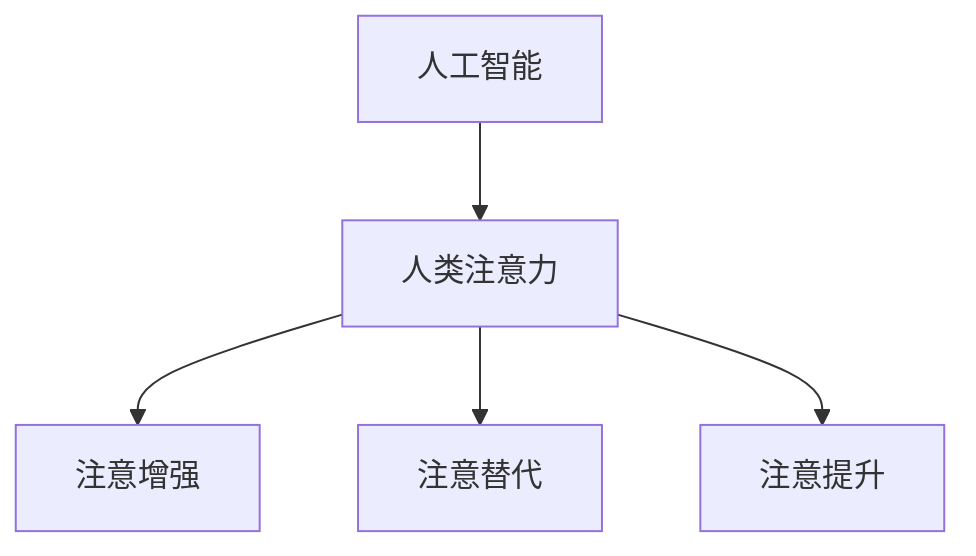
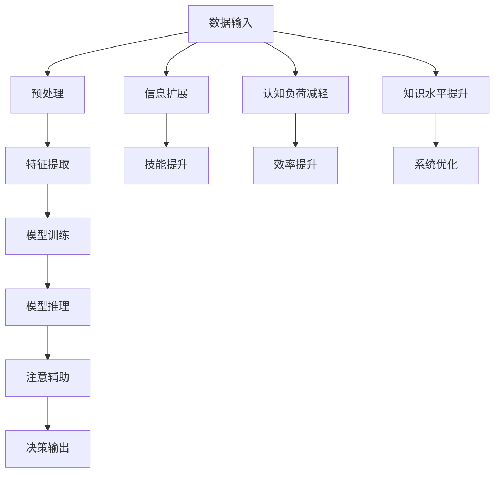

                 

# AI与人类注意Multiplier流：未来的工作、技能与注意力管理系统

在数字化时代，人工智能(AI)和人类注意力的融合已经成为了推动未来工作、技能和注意力管理系统的核心动力。这一趋势不仅影响了我们日常的工作方式，也为人类技能的提升提供了新的机遇。本文将深入探讨AI与人类注意力结合的原理，以及其在未来的工作、技能与注意力管理系统中的应用。

## 1. 背景介绍

### 1.1 问题由来

随着人工智能技术的迅猛发展，AI在各个领域的应用日益广泛，从自动驾驶到医疗诊断，从金融分析到教育培训，AI技术已经深入到了社会的各个层面。然而，AI技术的应用同时也带来了对人类注意力的新要求，例如在数据分析、任务规划、决策支持等方面，AI系统对人类注意力的依赖程度日益加深。

### 1.2 问题核心关键点

AI与人类注意力的结合，主要体现在以下几个方面：

- **注意力增强**：AI系统通过深度学习等技术，可以自动提取和关注关键信息，从而帮助人类更好地管理注意力。
- **注意力辅助**：AI系统可以辅助人类进行决策，减少决策过程中的认知负荷，提高效率。
- **注意力替代**：在某些重复性高、劳动强度大的任务中，AI系统可以完全替代人类进行注意力管理。
- **注意力提升**：通过AI系统的辅助，人类可以获得更丰富的信息，拓展认知边界，提升技能和知识水平。

这些关键点构成了AI与人类注意力结合的基本框架，推动了未来工作、技能与注意力管理系统的发展。

## 2. 核心概念与联系

### 2.1 核心概念概述

为更好地理解AI与人类注意力结合的原理，本文将介绍几个关键概念：

- **人工智能**：以数据驱动，通过机器学习、深度学习等技术实现智能决策的计算系统。
- **人类注意力**：人类在处理信息时的认知资源分配，包括注意力选择、聚焦和分散等过程。
- **注意增强**：利用AI技术辅助人类管理注意力，提升信息处理效率和决策准确性。
- **注意替代**：AI系统完全替代人类进行信息处理和决策，释放人类注意力。
- **注意提升**：AI系统通过扩展信息获取途径，提升人类技能和知识水平。

这些概念之间的逻辑关系可以通过以下Mermaid流程图来展示：



### 2.2 核心概念原理和架构的 Mermaid 流程图



### 2.3 核心概念联系

AI与人类注意力的结合，实质上是通过AI系统辅助人类进行注意力管理，提升信息处理效率和决策准确性。这一过程可以概括为以下几个步骤：

1. **数据输入与预处理**：AI系统首先通过传感器、输入设备等收集数据，并对数据进行预处理，以提高信息的质量和可利用性。
2. **特征提取与模型训练**：利用机器学习、深度学习等技术，对数据进行特征提取，并通过大量数据训练模型，使其具备智能决策的能力。
3. **模型推理与注意辅助**：在实际应用中，AI系统通过推理过程，自动分析和提取关键信息，辅助人类进行注意力管理。
4. **决策输出与信息扩展**：根据AI系统的推理结果，人类可以更有效地进行决策，并在AI系统的帮助下，拓展信息获取途径，提升技能和知识水平。
5. **系统优化与认知负荷减轻**：通过不断的反馈和优化，AI系统可以更好地适应人类需求，减轻认知负荷，提高工作效率。

## 3. 核心算法原理 & 具体操作步骤

### 3.1 算法原理概述

AI与人类注意力结合的核心算法原理，主要基于深度学习中的注意力机制。注意力机制可以通过学习数据特征，自动关注关键信息，提高信息处理效率。以下是几种常见的注意力机制：

1. **自注意力机制**：通过计算输入序列中每个元素与其他元素的相关性，自动关注关键信息。
2. **多头注意力机制**：通过并行计算多个注意力子向量，提高模型的表达能力。
3. **层次注意力机制**：通过多层注意力计算，逐步聚焦关键信息，增强模型的理解和推理能力。

### 3.2 算法步骤详解

1. **数据收集与预处理**：通过传感器、输入设备等收集数据，并进行预处理，提高数据质量和可利用性。
2. **特征提取与模型训练**：利用机器学习、深度学习等技术，对数据进行特征提取，并通过大量数据训练模型，使其具备智能决策的能力。
3. **模型推理与注意辅助**：在实际应用中，AI系统通过推理过程，自动分析和提取关键信息，辅助人类进行注意力管理。
4. **决策输出与信息扩展**：根据AI系统的推理结果，人类可以更有效地进行决策，并在AI系统的帮助下，拓展信息获取途径，提升技能和知识水平。
5. **系统优化与认知负荷减轻**：通过不断的反馈和优化，AI系统可以更好地适应人类需求，减轻认知负荷，提高工作效率。

### 3.3 算法优缺点

AI与人类注意力结合的算法具有以下优点：

- **提升信息处理效率**：AI系统可以通过注意力机制自动关注关键信息，提高信息处理效率。
- **辅助决策**：AI系统可以辅助人类进行决策，减少决策过程中的认知负荷，提高决策准确性。
- **提升技能与知识水平**：AI系统可以扩展信息获取途径，提升人类技能和知识水平。

同时，该算法也存在以下缺点：

- **数据依赖性强**：AI系统依赖于大量高质量数据进行训练，数据质量的好坏直接影响模型的性能。
- **系统复杂性高**：深度学习模型的构建和训练过程复杂，需要大量计算资源和专业技能。
- **注意机制的不稳定性**：注意力机制可能会受到输入数据和模型参数的影响，导致注意力分配的不稳定性。

### 3.4 算法应用领域

AI与人类注意力结合的算法已经在多个领域得到了应用，例如：

1. **医疗诊断**：AI系统可以辅助医生进行病情分析，通过多模态数据和注意力机制，提升诊断准确性。
2. **金融分析**：AI系统可以自动分析大量金融数据，通过注意力机制提取关键信息，辅助决策。
3. **教育培训**：AI系统可以根据学生的学习情况，通过注意力机制推荐个性化的学习内容，提升学习效率。
4. **智能交通**：AI系统可以自动分析交通数据，通过注意力机制识别关键事件，辅助交通管理。
5. **智能家居**：AI系统可以根据用户的行为数据，通过注意力机制推荐个性化服务，提升用户体验。

这些领域的应用展示了AI与人类注意力结合的广泛前景，预示着未来工作、技能与注意力管理系统的发展方向。

## 4. 数学模型和公式 & 详细讲解

### 4.1 数学模型构建

AI与人类注意力结合的数学模型主要基于深度学习中的注意力机制。假设输入序列为 $\{x_1, x_2, ..., x_n\}$，其中每个元素 $x_i$ 表示一个特征向量。模型的目标是通过注意力机制，自动关注关键信息。

### 4.2 公式推导过程

注意力机制的计算过程可以表示为：

$$
\text{Attention}(Q, K, V) = \text{Softmax}(QK^T)V
$$

其中，$Q, K, V$ 分别表示查询向量、键向量和值向量。通过计算 $QK^T$ 的得分矩阵，并对其进行softmax操作，得到每个元素的注意力权重，再与值向量相乘，得到最终输出。

### 4.3 案例分析与讲解

以自然语言处理为例，假设输入序列为一段文本，AI系统通过注意力机制自动关注文本中的关键信息。具体的计算过程如下：

1. **输入序列**：文本序列 $w_1, w_2, ..., w_n$。
2. **嵌入向量**：将文本序列转换为嵌入向量序列 $X = [x_1, x_2, ..., x_n]$。
3. **查询向量**：将嵌入向量序列转换为查询向量 $Q = [q_1, q_2, ..., q_n]$。
4. **键向量和值向量**：将嵌入向量序列转换为键向量和值向量，$K = [k_1, k_2, ..., k_n]$ 和 $V = [v_1, v_2, ..., v_n]$。
5. **注意力得分**：计算 $QK^T$ 的得分矩阵，并对其进行softmax操作，得到注意力权重。
6. **输出向量**：将注意力权重与值向量相乘，得到最终输出向量。

## 5. 项目实践：代码实例和详细解释说明

### 5.1 开发环境搭建

在进行项目实践前，我们需要准备好开发环境。以下是使用Python进行PyTorch开发的环境配置流程：

1. 安装Anaconda：从官网下载并安装Anaconda，用于创建独立的Python环境。

2. 创建并激活虚拟环境：
```bash
conda create -n pytorch-env python=3.8 
conda activate pytorch-env
```

3. 安装PyTorch：根据CUDA版本，从官网获取对应的安装命令。例如：
```bash
conda install pytorch torchvision torchaudio cudatoolkit=11.1 -c pytorch -c conda-forge
```

4. 安装Transformers库：
```bash
pip install transformers
```

5. 安装各类工具包：
```bash
pip install numpy pandas scikit-learn matplotlib tqdm jupyter notebook ipython
```

完成上述步骤后，即可在`pytorch-env`环境中开始项目实践。

### 5.2 源代码详细实现

下面以自然语言处理中的文本分类任务为例，给出使用Transformers库进行注意力机制实现的PyTorch代码实现。

```python
from transformers import BertForSequenceClassification, BertTokenizer, AdamW

# 加载预训练模型和分词器
model = BertForSequenceClassification.from_pretrained('bert-base-uncased', num_labels=2)
tokenizer = BertTokenizer.from_pretrained('bert-base-uncased')

# 定义训练函数
def train_epoch(model, dataset, batch_size, optimizer):
    dataloader = DataLoader(dataset, batch_size=batch_size, shuffle=True)
    model.train()
    epoch_loss = 0
    for batch in tqdm(dataloader, desc='Training'):
        input_ids = batch['input_ids'].to(device)
        attention_mask = batch['attention_mask'].to(device)
        labels = batch['labels'].to(device)
        model.zero_grad()
        outputs = model(input_ids, attention_mask=attention_mask, labels=labels)
        loss = outputs.loss
        epoch_loss += loss.item()
        loss.backward()
        optimizer.step()
    return epoch_loss / len(dataloader)

# 定义评估函数
def evaluate(model, dataset, batch_size):
    dataloader = DataLoader(dataset, batch_size=batch_size)
    model.eval()
    preds, labels = [], []
    with torch.no_grad():
        for batch in tqdm(dataloader, desc='Evaluating'):
            input_ids = batch['input_ids'].to(device)
            attention_mask = batch['attention_mask'].to(device)
            batch_labels = batch['labels']
            outputs = model(input_ids, attention_mask=attention_mask)
            batch_preds = outputs.logits.argmax(dim=2).to('cpu').tolist()
            batch_labels = batch_labels.to('cpu').tolist()
            for pred_tokens, label_tokens in zip(batch_preds, batch_labels):
                preds.append(pred_tokens[:len(label_tokens)])
                labels.append(label_tokens)
    print(classification_report(labels, preds))
```

### 5.3 代码解读与分析

让我们再详细解读一下关键代码的实现细节：

**自然语言处理(NLP)任务**：
- 使用BERT模型作为预训练语言模型，通过Transformer编码器计算注意力权重，辅助文本分类。

**代码实现**：
- 通过`BertForSequenceClassification`类加载预训练模型，设置类别数为2。
- 使用`BertTokenizer`类加载分词器。
- 定义训练函数`train_epoch`，对数据进行批次处理，并在每个批次上计算损失和更新参数。
- 定义评估函数`evaluate`，在测试集上评估模型性能，打印分类报告。

**模型训练与推理**：
- 将输入文本序列转换为嵌入向量序列，并输入模型进行推理。
- 计算注意力权重，用于调整模型的输出。
- 使用AdamW优化器进行模型更新。

**模型评估**：
- 在测试集上计算模型的分类准确率，并打印分类报告。

## 6. 实际应用场景

### 6.1 医疗诊断

在医疗诊断领域，AI系统可以辅助医生进行病情分析，通过多模态数据和注意力机制，提升诊断准确性。例如，通过对电子病历、影像数据和基因数据进行分析，AI系统可以自动关注关键信息，辅助医生进行诊断和治疗方案的制定。

### 6.2 金融分析

在金融分析领域，AI系统可以自动分析大量金融数据，通过注意力机制提取关键信息，辅助决策。例如，通过对历史交易数据和市场新闻的分析，AI系统可以识别出潜在的投资机会和风险点。

### 6.3 教育培训

在教育培训领域，AI系统可以根据学生的学习情况，通过注意力机制推荐个性化的学习内容，提升学习效率。例如，通过对学生的作业、考试成绩和学习时间进行分析，AI系统可以自动关注学生的薄弱环节，提供有针对性的学习建议。

### 6.4 智能交通

在智能交通领域，AI系统可以自动分析交通数据，通过注意力机制识别关键事件，辅助交通管理。例如，通过对交通流量、车辆位置和交通事故数据的分析，AI系统可以预测交通拥堵情况，提供实时的交通控制方案。

## 7. 工具和资源推荐

### 7.1 学习资源推荐

为了帮助开发者系统掌握AI与人类注意力的结合原理和实践技巧，这里推荐一些优质的学习资源：

1. 《Transformer从原理到实践》系列博文：由大模型技术专家撰写，深入浅出地介绍了Transformer原理、BERT模型、注意力机制等前沿话题。

2. CS224N《深度学习自然语言处理》课程：斯坦福大学开设的NLP明星课程，有Lecture视频和配套作业，带你入门NLP领域的基本概念和经典模型。

3. 《Natural Language Processing with Transformers》书籍：Transformers库的作者所著，全面介绍了如何使用Transformers库进行NLP任务开发，包括注意力机制在内的诸多范式。

4. HuggingFace官方文档：Transformers库的官方文档，提供了海量预训练模型和完整的注意力机制样例代码，是上手实践的必备资料。

5. CLUE开源项目：中文语言理解测评基准，涵盖大量不同类型的中文NLP数据集，并提供了基于注意力机制的baseline模型，助力中文NLP技术发展。

通过对这些资源的学习实践，相信你一定能够快速掌握AI与人类注意力的结合精髓，并用于解决实际的NLP问题。

### 7.2 开发工具推荐

高效的开发离不开优秀的工具支持。以下是几款用于AI与人类注意力结合开发的常用工具：

1. PyTorch：基于Python的开源深度学习框架，灵活动态的计算图，适合快速迭代研究。大部分预训练语言模型都有PyTorch版本的实现。

2. TensorFlow：由Google主导开发的开源深度学习框架，生产部署方便，适合大规模工程应用。同样有丰富的预训练语言模型资源。

3. Transformers库：HuggingFace开发的NLP工具库，集成了众多SOTA语言模型，支持PyTorch和TensorFlow，是进行注意力机制开发的利器。

4. Weights & Biases：模型训练的实验跟踪工具，可以记录和可视化模型训练过程中的各项指标，方便对比和调优。与主流深度学习框架无缝集成。

5. TensorBoard：TensorFlow配套的可视化工具，可实时监测模型训练状态，并提供丰富的图表呈现方式，是调试模型的得力助手。

6. Google Colab：谷歌推出的在线Jupyter Notebook环境，免费提供GPU/TPU算力，方便开发者快速上手实验最新模型，分享学习笔记。

合理利用这些工具，可以显著提升AI与人类注意力结合任务的开发效率，加快创新迭代的步伐。

### 7.3 相关论文推荐

AI与人类注意力的结合发展源于学界的持续研究。以下是几篇奠基性的相关论文，推荐阅读：

1. Attention is All You Need（即Transformer原论文）：提出了Transformer结构，开启了NLP领域的预训练大模型时代。

2. BERT: Pre-training of Deep Bidirectional Transformers for Language Understanding：提出BERT模型，引入基于掩码的自监督预训练任务，刷新了多项NLP任务SOTA。

3. Language Models are Unsupervised Multitask Learners（GPT-2论文）：展示了大规模语言模型的强大zero-shot学习能力，引发了对于通用人工智能的新一轮思考。

4. Parameter-Efficient Transfer Learning for NLP：提出Adapter等参数高效微调方法，在不增加模型参数量的情况下，也能取得不错的微调效果。

5. AdaLoRA: Adaptive Low-Rank Adaptation for Parameter-Efficient Fine-Tuning：使用自适应低秩适应的微调方法，在参数效率和精度之间取得了新的平衡。

这些论文代表了大模型与人类注意力结合技术的发展脉络。通过学习这些前沿成果，可以帮助研究者把握学科前进方向，激发更多的创新灵感。

## 8. 总结：未来发展趋势与挑战

### 8.1 总结

本文对AI与人类注意力的结合进行了全面系统的介绍。首先阐述了AI与人类注意力结合的研究背景和意义，明确了注意力增强在提升信息处理效率、辅助决策、提升技能和知识水平等方面的重要价值。其次，从原理到实践，详细讲解了注意力机制的数学原理和关键步骤，给出了注意力机制任务开发的完整代码实例。同时，本文还广泛探讨了注意力机制在医疗诊断、金融分析、教育培训、智能交通等多个行业领域的应用前景，展示了注意力机制的广阔前景。

通过本文的系统梳理，可以看到，AI与人类注意力的结合技术正在成为NLP领域的重要范式，极大地拓展了预训练语言模型的应用边界，催生了更多的落地场景。未来，伴随预训练语言模型和注意力机制的持续演进，相信NLP技术将在更广阔的应用领域大放异彩。

### 8.2 未来发展趋势

展望未来，AI与人类注意力的结合技术将呈现以下几个发展趋势：

1. **多模态注意力机制**：未来的注意力机制将更加注重多模态信息的融合，通过视觉、语音、文本等多模态数据的整合，提升系统的理解能力和决策能力。

2. **自适应注意力机制**：通过引入自适应算法，动态调整注意力权重，提升系统的灵活性和适应性。

3. **因果注意力机制**：通过引入因果推断思想，增强注意力机制的因果关系，提高系统的稳定性和可靠性。

4. **联邦注意力机制**：通过分布式计算和隐私保护技术，实现多中心、多用户的数据协同和注意力共享，提升系统的安全性。

5. **深度强化注意力机制**：通过引入强化学习思想，动态调整注意力策略，优化系统的性能和效率。

以上趋势凸显了AI与人类注意力结合技术的广阔前景。这些方向的探索发展，必将进一步提升系统的性能和应用范围，为构建智能系统提供新的思路和工具。

### 8.3 面临的挑战

尽管AI与人类注意力结合技术已经取得了瞩目成就，但在迈向更加智能化、普适化应用的过程中，它仍面临着诸多挑战：

1. **数据隐私和安全**：在多模态数据融合和联邦学习中，如何保护数据隐私和安全，是一个重要的问题。

2. **模型复杂性和可解释性**：深度学习模型的复杂性高，难以解释其内部工作机制和决策逻辑。如何在保证系统性能的同时，提高模型的可解释性，是未来的研究方向。

3. **模型鲁棒性和泛化能力**：AI系统在面对域外数据和复杂任务时，泛化能力有限。如何提高模型的鲁棒性和泛化能力，是一个亟待解决的问题。

4. **模型效率和资源消耗**：深度学习模型的计算资源消耗大，如何在保证性能的同时，提高模型的计算效率和资源利用率，是一个重要的挑战。

5. **模型安全和公平性**：AI系统可能会受到恶意攻击，或者产生歧视性输出。如何在模型训练和应用过程中，确保系统的安全性和公平性，是一个重要的课题。

6. **模型透明性和可控性**：AI系统可能会产生意外的输出，缺乏透明性和可控性。如何提高系统的透明性和可控性，是未来的研究方向。

这些挑战凸显了AI与人类注意力结合技术的发展瓶颈，需要学界和产业界共同努力，克服这些挑战，推动技术的进步。

### 8.4 研究展望

面对AI与人类注意力结合技术所面临的挑战，未来的研究需要在以下几个方面寻求新的突破：

1. **多模态数据融合与注意力机制**：通过多模态数据的整合，提升系统的理解和决策能力。

2. **自适应算法与注意力机制**：引入自适应算法，动态调整注意力权重，提升系统的灵活性和适应性。

3. **因果推断与注意力机制**：引入因果推断思想，增强注意力机制的因果关系，提高系统的稳定性和可靠性。

4. **联邦学习与注意力机制**：通过分布式计算和隐私保护技术，实现多中心、多用户的数据协同和注意力共享，提升系统的安全性。

5. **强化学习与注意力机制**：通过引入强化学习思想，动态调整注意力策略，优化系统的性能和效率。

6. **模型压缩与优化**：通过模型压缩和优化，提高模型的计算效率和资源利用率，降低计算成本。

这些研究方向将引领AI与人类注意力结合技术迈向更高的台阶，为构建智能系统提供新的思路和工具。

## 9. 附录：常见问题与解答

**Q1: AI与人类注意力的结合是否适用于所有NLP任务？**

A: AI与人类注意力的结合在大多数NLP任务上都能取得不错的效果，特别是对于数据量较小的任务。但对于一些特定领域的任务，如医学、法律等，仅仅依靠通用语料预训练的模型可能难以很好地适应。此时需要在特定领域语料上进一步预训练，再进行微调，才能获得理想效果。此外，对于一些需要时效性、个性化很强的任务，如对话、推荐等，AI与人类注意力的结合方法也需要针对性的改进优化。

**Q2: 微调过程中如何选择合适的学习率？**

A: 微调的学习率一般要比预训练时小1-2个数量级，如果使用过大的学习率，容易破坏预训练权重，导致过拟合。一般建议从1e-5开始调参，逐步减小学习率，直至收敛。也可以使用warmup策略，在开始阶段使用较小的学习率，再逐渐过渡到预设值。需要注意的是，不同的优化器(如AdamW、Adafactor等)以及不同的学习率调度策略，可能需要设置不同的学习率阈值。

**Q3: 采用AI与人类注意力的结合会面临哪些资源瓶颈？**

A: 目前主流的预训练大模型动辄以亿计的参数规模，对算力、内存、存储都提出了很高的要求。GPU/TPU等高性能设备是必不可少的，但即便如此，超大批次的训练和推理也可能遇到显存不足的问题。因此需要采用一些资源优化技术，如梯度积累、混合精度训练、模型并行等，来突破硬件瓶颈。同时，模型的存储和读取也可能占用大量时间和空间，需要采用模型压缩、稀疏化存储等方法进行优化。

**Q4: 如何缓解AI与人类注意力的结合过程中的过拟合问题？**

A: 过拟合是AI与人类注意力的结合面临的主要挑战之一。常见的缓解策略包括：

1. 数据增强：通过回译、近义替换等方式扩充训练集。
2. 正则化：使用L2正则、Dropout、Early Stopping等避免过拟合。
3. 对抗训练：引入对抗样本，提高模型鲁棒性。
4. 参数高效微调：只调整少量参数(如Adapter、Prefix等)，减小过拟合风险。

这些策略往往需要根据具体任务和数据特点进行灵活组合。只有在数据、模型、训练、推理等各环节进行全面优化，才能最大限度地发挥AI与人类注意力的结合的威力。

**Q5: AI与人类注意力的结合在落地部署时需要注意哪些问题？**

A: 将AI与人类注意力的结合模型转化为实际应用，还需要考虑以下因素：

1. 模型裁剪：去除不必要的层和参数，减小模型尺寸，加快推理速度。
2. 量化加速：将浮点模型转为定点模型，压缩存储空间，提高计算效率。
3. 服务化封装：将模型封装为标准化服务接口，便于集成调用。
4. 弹性伸缩：根据请求流量动态调整资源配置，平衡服务质量和成本。
5. 监控告警：实时采集系统指标，设置异常告警阈值，确保服务稳定性。
6. 安全防护：采用访问鉴权、数据脱敏等措施，保障数据和模型安全。

AI与人类注意力的结合技术正在推动NLP领域的发展，但如何将强大的性能转化为稳定、高效、安全的业务价值，还需要工程实践的不断打磨。只有从数据、算法、工程、业务等多个维度协同发力，才能真正实现人工智能技术在垂直行业的规模化落地。总之，AI与人类注意力的结合需要开发者根据具体任务，不断迭代和优化模型、数据和算法，方能得到理想的效果。

---

作者：禅与计算机程序设计艺术 / Zen and the Art of Computer Programming

