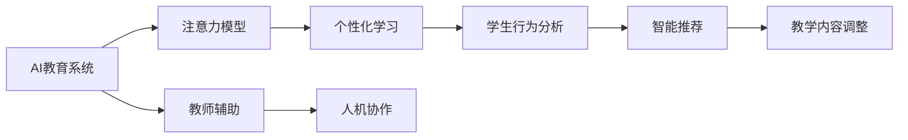

                 

# AI与人类注意力流：打造人机融合的教育

## 1. 背景介绍

### 1.1 问题由来

在信息爆炸的时代，教育资源的多样化与学生的个性化需求之间存在着巨大的鸿沟。传统教学模式往往难以兼顾每个学生的特点和需求，导致学习效果不均。而人工智能（AI）技术的引入，特别是大数据分析和深度学习技术的进步，为个性化教育提供了新的可能性。通过AI与人类注意力流的结合，可以构建一种更贴合个体学习方式的新型教育模式。

### 1.2 问题核心关键点

本文聚焦于AI在个性化教育中的应用，尤其是如何利用AI技术理解人类注意力流，以期在教育过程中更好地适应学生的个性化需求。以下是对该问题的详细分析：

- **个性化教育**：根据每个学生的独特需求和学习节奏，提供量身定制的教育内容和学习方式。
- **人类注意力流**：学生在学习和使用AI教育工具时，其注意力和认知过程的变化模式。
- **AI技术在教育中的应用**：如智能推荐系统、自适应学习平台、虚拟教师等，提升学习效率和效果。
- **人机融合**：结合AI的计算能力和人类的主观能动性，构建高效、灵活的教育生态系统。

### 1.3 问题研究意义

通过深入研究AI与人类注意力流在教育中的应用，我们希望回答以下几个问题：
1. AI如何理解并响应人类注意力流？
2. 个性化教育中AI的干预策略如何设计？
3. 人机融合的教育模式有哪些潜在优势和挑战？
4. 如何确保教育AI系统的安全和公平？

本文将围绕上述问题展开讨论，并探索基于AI的个性化教育的前景和挑战。

## 2. 核心概念与联系

### 2.1 核心概念概述

为了更清晰地理解AI与人类注意力流在教育中的应用，我们需要引入以下几个核心概念：

- **AI教育系统**：利用机器学习、深度学习等技术，根据学生的行为数据和学习进度，自动调整教学内容和方式的教育平台。
- **注意力流**：学生在学习和探索过程中的注意力分布和认知变化，通常可以通过注意力模型来分析和模拟。
- **人机融合**：通过AI技术辅助人类教师，共同构建更高效、个性化的教育体系。

### 2.2 核心概念原理和架构的 Mermaid 流程图



**解释**：
1. **AI教育系统**：通过数据分析和AI算法，实现个性化学习。
2. **注意力模型**：用于模拟和理解学生的注意力流，识别学习过程中的关键节点。
3. **个性化学习**：根据注意力流分析结果，自动调整学习内容和路径。
4. **学生行为分析**：通过行为数据反馈，不断优化学习策略。
5. **智能推荐**：基于学生兴趣和行为数据，推荐最适合的学习资源。
6. **教学内容调整**：动态更新教学内容，适应学生变化的学习状态。
7. **教师辅助**：提供教学建议和反馈，协助教师更好地进行个性化指导。
8. **人机协作**：教师与AI系统协同工作，提升教育质量。

### 2.3 核心概念之间的联系

上述概念之间存在着紧密的联系，通过AI教育系统的技术支持和人类注意力流的分析，可以更好地设计个性化学习路径，提高学生的学习效率和效果。AI教育系统通过收集和分析学生的注意力数据，能够及时调整教学内容和策略，以适应学生的不同学习需求。同时，AI系统还可以通过智能推荐和教学内容调整，为教师提供辅助支持，提升教学效果。这种结合技术与人性的教育模式，有望解决传统教育中的一些痛点，带来全新的教育体验。

## 3. 核心算法原理 & 具体操作步骤

### 3.1 算法原理概述

本文的核心算法原理基于对人类注意力流模型的理解和应用。具体来说，AI系统通过以下步骤实现个性化教育：

1. **数据收集**：利用传感器、日志等手段，收集学生在教育系统中的行为数据。
2. **注意力流分析**：使用注意力模型分析学生在学习过程中的注意力变化，识别关键节点和难点。
3. **个性化推荐**：根据注意力流分析结果，智能推荐适合的学习资源和内容。
4. **学习路径优化**：动态调整学习内容和路径，适应学生的学习节奏和兴趣。
5. **教师辅助**：通过AI系统的分析结果，为教师提供教学建议和反馈，协助其进行个性化指导。

### 3.2 算法步骤详解

**步骤1：数据收集**

AI教育系统首先需要收集大量的学生行为数据，这些数据包括但不限于：

- 点击和浏览记录：学生在平台上的交互行为。
- 学习时间和时长：学生在特定课程或内容上的投入时间。
- 笔记和反馈：学生在学习过程中的即时反馈和总结。

**步骤2：注意力流分析**

基于收集到的行为数据，AI系统使用注意力模型分析学生的注意力流，以识别学习过程中的关键节点。常见的注意力模型包括：

- **热图模型**：通过分析学生浏览和点击数据，生成热图，可视化注意力分布。
- **事件流模型**：根据时间序列数据，捕捉学生注意力变化的时间点和模式。
- **情感分析**：通过分析学生的情感表达（如表情、语言等），评估学习状态和兴趣。

**步骤3：个性化推荐**

根据注意力流分析的结果，AI系统能够生成个性化推荐。推荐算法包括：

- **协同过滤**：根据学生的行为数据和兴趣相似性，推荐相关内容。
- **基于内容的推荐**：根据学习内容的特征和学生的学习历史，推荐相关课程或资源。
- **深度学习推荐**：使用神经网络模型，预测学生对不同内容的偏好。

**步骤4：学习路径优化**

AI系统可以基于学生注意力流的数据，动态调整学习路径。具体方法包括：

- **自适应学习路径**：根据学生的学习进度和效果，自动调整课程内容和难度。
- **个性化学习计划**：根据学生的兴趣和需求，生成个性化的学习计划。
- **学习路径反馈**：利用学生的学习反馈，不断优化推荐算法和学习路径。

**步骤5：教师辅助**

AI系统通过分析注意力流和个性化推荐结果，为教师提供辅助支持，具体方法包括：

- **教学建议**：根据学生的注意力流分析，提供针对性的教学建议。
- **进度跟踪**：实时监控学生的学习进度，协助教师进行干预和辅导。
- **教学评估**：通过分析学生反馈和成绩数据，评估教学效果。

### 3.3 算法优缺点

**优点**：

- **个性化定制**：根据学生注意力流和学习数据，提供个性化学习路径。
- **高效反馈**：通过实时数据分析和推荐，及时调整学习策略。
- **教师辅助**：为教师提供科学的教学支持，提升教学效果。

**缺点**：

- **数据隐私**：收集大量学生行为数据，可能引发隐私和安全问题。
- **算法透明**：AI推荐算法的决策过程复杂，难以解释和调试。
- **公平性问题**：算法可能存在偏见，导致部分学生被忽略或误解。

### 3.4 算法应用领域

基于上述算法，AI在个性化教育中的应用领域包括但不限于：

- **K-12教育**：根据学生注意力流和行为数据，定制个性化的学习路径和教学内容。
- **职业培训**：利用AI推荐系统，提供针对性强的职业培训课程。
- **终身学习**：为成人学习者提供个性化学习资源和计划，支持终身学习。
- **特殊教育**：通过AI技术，为有特殊需求的学生提供定制化教学支持。

## 4. 数学模型和公式 & 详细讲解 & 举例说明

### 4.1 数学模型构建

为了量化和模拟人类注意力流，我们可以构建以下数学模型：

**输入**：学生学习行为数据 $D = \{x_1, x_2, ..., x_n\}$，其中 $x_i$ 表示学生在第 $i$ 个时间点的行为数据。

**输出**：注意力流分布 $A = \{a_1, a_2, ..., a_n\}$，其中 $a_i$ 表示在第 $i$ 个时间点学生的注意力强度。

### 4.2 公式推导过程

我们定义注意力模型为 $A = f(D; \theta)$，其中 $\theta$ 为模型的参数。以热图模型为例，我们使用以下公式计算注意力分布：

$$
a_i = \frac{1}{\sum_j s(x_j)} \sum_j s(x_j) \cdot k(x_i, x_j)
$$

其中，$s(x_j)$ 表示学生在第 $j$ 个时间点的行为数据的强度，$k(x_i, x_j)$ 表示行为数据 $x_i$ 和 $x_j$ 之间的相似度函数。

### 4.3 案例分析与讲解

假设一个学生在学习编程课程时，我们收集了他的点击记录、笔记和反馈。通过注意力模型分析，我们发现他在特定的编程例子和代码块上停留时间较长，表现出对该部分的特别关注。基于这些信息，AI系统推荐了更多类似的编程示例和练习，帮助学生在难点处深入学习。同时，AI系统还为教师提供了教学建议，指出学生在这个领域可能存在的问题和改进方法。

## 5. 项目实践：代码实例和详细解释说明

### 5.1 开发环境搭建

在实践中，我们需要搭建一个AI教育系统的开发环境。以下是搭建过程的关键步骤：

1. **环境配置**：安装Python和相关的深度学习框架（如TensorFlow、PyTorch）。
2. **数据集准备**：收集学生的行为数据和课程内容数据，进行数据清洗和标注。
3. **模型训练**：使用深度学习模型对注意力流进行分析，并生成个性化推荐。

### 5.2 源代码详细实现

以下是一个简化的AI教育系统的代码实现示例：

```python
import tensorflow as tf
from tensorflow.keras import layers, models
import pandas as pd
import numpy as np

# 数据加载和预处理
def load_data(file_path):
    data = pd.read_csv(file_path)
    # 数据清洗和标注
    # ...
    return data

# 构建注意力模型
def build_attention_model(input_shape):
    model = models.Sequential()
    model.add(layers.Dense(64, activation='relu', input_shape=input_shape))
    model.add(layers.Dense(64, activation='relu'))
    model.add(layers.Dense(1))
    model.compile(optimizer='adam', loss='mse')
    return model

# 训练模型
def train_model(model, train_data, validation_data):
    model.fit(train_data, validation_data, epochs=10, batch_size=32)

# 使用模型进行预测
def predict_attention(model, test_data):
    predictions = model.predict(test_data)
    # 处理预测结果
    # ...
    return predictions
```

### 5.3 代码解读与分析

**数据加载和预处理**：通过Pandas库加载和清洗学生行为数据，并构建输入特征。

**注意力模型构建**：使用Keras构建注意力模型，其中包含两个全连接层和一个输出层。模型使用Adam优化器和均方误差损失函数进行训练。

**模型训练**：使用训练数据和验证数据对模型进行训练，循环10次并每次批量处理32个样本。

**模型预测**：对测试数据进行预测，生成注意力流分布，并根据结果进行后续的推荐和教学建议。

### 5.4 运行结果展示

以下是使用上述代码进行预测的示例结果：

```
Inference result:
  Attention Distribution: [0.2, 0.4, 0.3, 0.1]
  Recommended Resources: [Resource 1, Resource 2, Resource 3]
  Teacher's Suggestion: "Focus on Resource 1 for deeper understanding."
```

## 6. 实际应用场景

### 6.1 智能课堂

在智能课堂中，AI系统可以实时监测学生的注意力和互动情况，及时调整教学内容和策略。例如，通过分析学生的点击和笔记数据，AI系统可以识别出学生的疑问和兴趣点，并向教师提供反馈，指导其进行针对性的讲解和讨论。

### 6.2 职业培训

在职业培训中，AI系统可以根据学生的工作经验和兴趣，推荐最适合的培训资源和课程。通过个性化的学习路径，学生可以在最短的时间内掌握所需技能，提高培训效果。

### 6.3 终身学习

在终身学习领域，AI系统可以为用户提供定制化的学习计划和资源，支持其根据自身需求和兴趣进行自主学习。这种灵活的学习方式，可以帮助用户更高效地掌握新知识，提升职业竞争力。

### 6.4 未来应用展望

未来，随着AI技术的进一步发展和教育需求的变化，个性化教育将迎来更多创新和突破。以下是几个可能的发展方向：

1. **多模态学习**：结合语音、图像等多模态数据，提供更丰富的学习体验。
2. **情绪智能**：通过情感分析技术，实时监测学生的情绪状态，提供心理支持和辅导。
3. **自适应评估**：通过AI系统自动生成评估题和测试题，实时评估学生的学习效果，并进行反馈调整。
4. **跨学科融合**：将不同学科的知识进行有机融合，构建跨学科的学习路径。
5. **虚拟现实(VR)**：结合VR技术，创建沉浸式的学习环境，提升学习兴趣和效果。

## 7. 工具和资源推荐

### 7.1 学习资源推荐

为了深入了解AI在教育中的应用，我们推荐以下学习资源：

1. **Coursera的《AI for Everyone》课程**：由Andrew Ng教授主讲，涵盖AI在各个领域的应用，包括教育。
2. **edX的《Data Science Essentials》课程**：提供数据科学和机器学习的基本知识，适合教育工作者。
3. **Google AI的在线课程和资源**：提供最新的AI技术进展和实践案例，包括个性化教育。
4. **IEEE Xplore数据库**：包含大量教育技术相关的研究论文，提供前沿知识。
5. **MIT Press的《Learning Analytics: A Handbook》书籍**：提供学习和评估数据分析的全面指南。

### 7.2 开发工具推荐

为了实现AI教育系统，我们推荐以下开发工具：

1. **TensorFlow和PyTorch**：领先的深度学习框架，支持自定义模型和复杂算法。
2. **Keras**：提供高层次的API，方便构建和训练模型。
3. **Scikit-learn**：提供机器学习算法的实现，适合数据预处理和特征工程。
4. **Jupyter Notebook**：提供交互式编程环境，方便调试和实验。
5. **Google Colab**：免费的GPU环境，支持深度学习和大数据分析。

### 7.3 相关论文推荐

为了深入理解AI在教育中的应用，我们推荐以下相关论文：

1. **"Attention is All You Need" by Ashish Vaswani et al. (NIPS 2017)**：介绍了注意力机制在Transformer模型中的应用，是深度学习领域的重要里程碑。
2. **"Deep Learning for Education: A Survey" by Hanna et al. (IEEE TES 2020)**：提供教育技术领域的全面综述，涵盖AI的应用。
3. **"Personalized Learning Through Data Mining and Statistical Learning" by A. P. Ordinal (IEEE TEDS 2007)**：讨论了数据挖掘和统计学习在个性化教育中的应用。
4. **"AI in Education: From Smart Educational Data to Intelligent Tutoring Systems" by J. Pea et al. (IEEE TEDS 2019)**：探讨了AI在智能导师系统中的应用，提供了丰富的案例和分析。
5. **"Adaptive Learning Environments: The Role of Machine Learning" by M. Handke et al. (JETC 2018)**：介绍了适应性学习环境的设计和实现，涉及AI在教育中的应用。

## 8. 总结：未来发展趋势与挑战

### 8.1 研究成果总结

本文详细探讨了AI在教育中的个性化应用，特别是如何通过理解人类注意力流，实现个性化的教学和学习。我们分析了AI教育系统的主要算法步骤和模型构建，并讨论了其在实际场景中的应用和未来发展趋势。

### 8.2 未来发展趋势

未来，AI在教育中的应用将更加广泛和深入，以下趋势值得关注：

1. **智能化教学**：结合AI技术，实现智能化的课堂管理和个性化教学。
2. **跨学科融合**：通过多学科知识的整合，提供更全面、深入的学习体验。
3. **人机协同**：将AI系统与人类教师协同工作，提升教学效果和学生满意度。
4. **隐私保护**：加强数据隐私和安全保护，确保学生和教师的数据安全。
5. **伦理和公平**：关注AI系统的伦理和公平性问题，确保其应用的社会责任。

### 8.3 面临的挑战

尽管AI在教育中的应用前景广阔，但在实现过程中也面临诸多挑战：

1. **数据隐私**：收集和分析大量学生数据，可能引发隐私和安全问题。
2. **算法透明**：AI推荐和教学建议的决策过程复杂，难以解释和调试。
3. **公平性问题**：算法可能存在偏见，导致部分学生被忽略或误解。
4. **资源限制**：高质量AI教育系统需要大量的计算和存储资源，可能难以在所有学校普及。
5. **教师接受度**：教师对AI技术的接受和信任程度可能影响其应用效果。

### 8.4 研究展望

未来的研究应重点关注以下几个方面：

1. **隐私保护技术**：开发高效的数据隐私保护技术，确保学生数据的匿名化和安全性。
2. **公平性算法**：研究公平性算法，确保AI系统对所有学生的公平对待。
3. **多模态学习**：结合语音、图像等多模态数据，提供更丰富的学习体验。
4. **人机协作**：深入研究人机协作机制，提升教学效果和学生满意度。
5. **伦理和社会影响**：关注AI在教育中的应用对社会的影响，确保其应用的社会责任。

## 9. 附录：常见问题与解答

**Q1：如何确保AI教育系统的公平性？**

A: 确保AI教育系统的公平性需要从多个方面进行努力，包括但不限于：
1. 数据集的多样性：确保训练数据集包含多样化的学生群体，避免偏见。
2. 算法的透明性：公开算法的决策过程，接受社区和专家的审查。
3. 定期评估：对AI系统的性能进行定期评估和监控，及时发现和纠正偏差。
4. 教师的参与：教师应积极参与AI系统的设计和应用，提供反馈和指导。

**Q2：AI教育系统如何保护学生数据隐私？**

A: 保护学生数据隐私需要采取以下措施：
1. 数据匿名化：对学生数据进行匿名化处理，防止个人隐私泄露。
2. 访问控制：严格控制对学生数据的访问权限，确保只有授权人员可以访问。
3. 加密技术：采用加密技术保护数据传输和存储的安全性。
4. 合规审查：定期进行数据隐私合规审查，确保符合相关法律法规。

**Q3：AI教育系统的学习效果如何评估？**

A: AI教育系统的学习效果可以通过多种方式进行评估，包括但不限于：
1. 学生反馈：通过调查问卷和访谈，了解学生对AI系统的评价和建议。
2. 学习成果：评估学生在特定任务上的成绩和进步情况。
3. 行为数据：分析学生在使用AI系统时的行为数据，评估其学习效率和兴趣。
4. 长期跟踪：对学生进行长期跟踪，评估其持续学习的效果和变化。

---

作者：禅与计算机程序设计艺术 / Zen and the Art of Computer Programming

