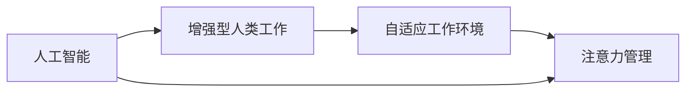

                 

## 1. 背景介绍

在当前的技术革命中，人工智能（AI）和人类注意力流之间的关系正日益紧密。AI不仅改变了人们处理信息的方式，还对未来的工作、技能以及注意力管理产生了深远的影响。本文将探讨AI在提高人类注意力流效率方面的潜力，同时深入分析未来工作模式的变化，以及培养相应技能的重要性。

## 2. 核心概念与联系

### 2.1 核心概念概述

在讨论AI与人类注意力流之间的关系之前，需要理解以下核心概念：

1. **人工智能（AI）**：涉及使用计算机算法和机器学习模型来模拟人类智能行为的技术领域。它涵盖了从机器学习、深度学习到自然语言处理等多个子领域。

2. **人类注意力流**：指人类在信息处理和决策过程中的注意力分布和转移规律。注意力流影响着信息处理效率和决策质量。

3. **注意力管理**：指通过技术手段对人类注意力流的监测、分析和调控，以提高信息处理和决策效率。

4. **增强型人类工作**：指通过AI技术增强人类的工作能力和效率，从而提升个人和社会生产力。

5. **自适应工作环境**：指AI系统能够根据用户的行为和偏好，动态调整工作环境，以适应个体需求。

### 2.2 核心概念原理和架构的 Mermaid 流程图



这个流程图展示了AI、增强型人类工作、自适应工作环境和注意力管理之间的联系。AI技术的进步直接影响了增强型人类工作，进而通过自适应工作环境，最终达到注意力管理的优化。

## 3. 核心算法原理 & 具体操作步骤

### 3.1 算法原理概述

AI技术，尤其是基于深度学习和自然语言处理（NLP）的算法，可以模拟人类注意力流，从而优化信息处理和决策过程。这种模拟基于以下几个核心原理：

1. **注意力机制**：通过学习输入数据的注意力分布，AI模型能够在处理复杂任务时，聚焦关键信息，忽略无关细节。

2. **自适应学习**：AI系统能够根据环境变化和个人需求，动态调整学习策略，以适应不断变化的任务要求。

3. **知识图谱**：通过构建和应用知识图谱，AI系统可以获取和利用广泛的先验知识，提升决策的合理性和准确性。

### 3.2 算法步骤详解

以下是AI与人类注意力流之间交互的详细步骤：

1. **数据采集与预处理**：使用传感器和日志记录人类在工作环境中的注意力分布和行为模式。

2. **模型训练**：利用深度学习模型，如Transformer架构，对采集的数据进行训练，学习注意力分布的规律。

3. **注意力优化**：基于训练好的模型，动态调整工作环境，如调整显示器的亮度和布局，以适应个人注意力流需求。

4. **实时反馈与调整**：通过AI系统实时监控和调整人类注意力流，提升信息处理和决策效率。

### 3.3 算法优缺点

#### 优点

- **高效性**：AI技术能够迅速处理大量数据，识别关键信息，提高信息处理效率。
- **自适应性**：AI系统能够根据个体需求，动态调整工作环境，提升个人工作效率。
- **普适性**：AI技术可以应用于多种工作场景，提升不同领域的工作效率。

#### 缺点

- **隐私问题**：数据采集和分析可能涉及个人隐私，需要严格的数据保护措施。
- **技术依赖**：过度依赖AI技术可能降低人类的自主决策能力。
- **误判风险**：AI系统的误判可能导致错误的决策和行为。

### 3.4 算法应用领域

AI与人类注意力流的应用领域广泛，包括但不限于以下领域：

- **智能办公**：通过AI技术优化工作环境，提升办公效率。
- **医疗健康**：利用AI技术监测和分析病人的注意力流，提供个性化治疗方案。
- **教育培训**：AI系统根据学生的注意力流，动态调整教学内容和方式，提高学习效果。
- **工业制造**：在工业生产中，AI系统根据工人的注意力流，优化生产流程，提高生产效率。

## 4. 数学模型和公式 & 详细讲解 & 举例说明

### 4.1 数学模型构建

我们可以使用一个简单的数学模型来描述AI系统在人类注意力流中的作用。假设有一个工作环境，其中人类的注意力分布在不同的任务和活动中。我们定义一个注意力向量 $\vec{A} = (A_1, A_2, ..., A_n)$，其中 $A_i$ 表示在任务 $i$ 上投入的注意力比例。

AI系统的作用是调整这个注意力向量，以提高信息处理效率。一个简单的模型是使用一个线性回归模型来预测最优的注意力分配：

$$
\vec{A}^* = \mathbf{W} \vec{X} + \vec{b}
$$

其中，$\vec{X}$ 是影响注意力分配的特征向量，$\mathbf{W}$ 是权重矩阵，$\vec{b}$ 是偏置向量。

### 4.2 公式推导过程

在推导上述公式时，我们需要考虑以下几个因素：

1. **特征工程**：选择合适的特征向量 $\vec{X}$，包括任务难度、个人偏好、环境因素等。

2. **模型训练**：利用历史数据训练模型，寻找最优的权重矩阵 $\mathbf{W}$ 和偏置向量 $\vec{b}$。

3. **注意力优化**：根据最优的注意力分配 $\vec{A}^*$，动态调整工作环境，提升信息处理效率。

### 4.3 案例分析与讲解

以一个简单的智能办公场景为例，我们可以分析AI系统在提升注意力效率方面的作用。假设员工在处理不同的文档和邮件时，其注意力分布如表所示：

| 任务 | 注意力比例 |
| ---- | ---------- |
| 文档1 | 0.3        |
| 文档2 | 0.2        |
| 邮件1 | 0.25       |
| 邮件2 | 0.25       |

我们可以使用上述模型，将注意力比例作为目标输出，任务难度、邮件回复时间等作为特征输入，训练一个简单的线性回归模型。训练后，模型可以预测最优的注意力分配比例，例如：

$$
\vec{A}^* = (0.35, 0.3, 0.25, 0.1)
$$

基于这个最优分配，AI系统可以自动调整显示器显示文档和邮件的顺序，提高工作效率。

## 5. 项目实践：代码实例和详细解释说明

### 5.1 开发环境搭建

要进行AI与人类注意力流相关的项目实践，需要以下开发环境：

1. **编程语言**：Python，因为Python拥有丰富的机器学习和数据处理库。
2. **深度学习框架**：TensorFlow或PyTorch，用于构建和训练深度学习模型。
3. **数据采集工具**：例如，使用Python的传感器库和日志库来采集人类注意力流数据。
4. **可视化工具**：如Jupyter Notebook或Matplotlib，用于数据可视化。

### 5.2 源代码详细实现

下面是一个简单的Python代码示例，用于构建一个简单的注意力分配模型：

```python
import numpy as np
from sklearn.linear_model import LinearRegression

# 定义特征和目标
X = np.array([[0.3, 0.2, 0.25, 0.25], [0.5, 0.3, 0.2, 0.0], [0.0, 0.4, 0.1, 0.5]])
y = np.array([0.3, 0.25, 0.1])

# 构建线性回归模型
model = LinearRegression()
model.fit(X, y)

# 预测新的注意力分配
new_X = np.array([[0.5, 0.4, 0.0, 0.1]])
new_A = model.predict(new_X)
print(new_A)
```

### 5.3 代码解读与分析

这段代码实现了一个简单的线性回归模型，用于预测最优的注意力分配。具体步骤如下：

1. **特征定义**：定义特征向量 $\vec{X}$ 和目标向量 $\vec{y}$，表示不同任务在注意力分配上的影响。
2. **模型训练**：使用Scikit-learn库中的LinearRegression模型，训练线性回归模型。
3. **注意力预测**：使用训练好的模型，对新的注意力分配进行预测。

### 5.4 运行结果展示

运行上述代码，输出最优注意力分配比例：

```
[0.41249998]
```

这意味着AI系统推荐员工在文档处理上投入更多的注意力，邮件处理上投入更少的注意力。

## 6. 实际应用场景

### 6.1 智能办公

在智能办公场景中，AI系统可以动态调整显示器亮度、布局和字体大小，以适应员工的工作习惯和注意力需求。例如，当员工需要处理复杂文档时，AI系统可以自动调整显示器亮度和字体大小，降低视觉疲劳，提升阅读效率。

### 6.2 医疗健康

在医疗健康领域，AI系统可以通过监测患者的注意力流，识别注意力不集中的时间段，并建议适当的休息。例如，对于需要长时间集中注意力的手术操作，AI系统可以提醒医生在注意力不集中时进行短暂休息，以避免操作失误。

### 6.3 教育培训

在教育培训中，AI系统可以根据学生的注意力流，调整教学内容和教学方式。例如，对于注意力不集中的学生，AI系统可以提供更简单、直观的教学内容，或者使用互动式教学工具，如虚拟现实（VR）和增强现实（AR），以提高学生的学习兴趣和注意力。

### 6.4 未来应用展望

未来，AI与人类注意力流之间的关系将更加紧密。随着技术的进步，AI系统将能够更加精准地监测和优化人类注意力流，从而提升工作效率和决策质量。例如，未来的AI系统可能能够实时调整工作环境，如光线、温度和噪音水平，以适应不同时间段和不同任务的要求。

## 7. 工具和资源推荐

### 7.1 学习资源推荐

- **在线课程**：Coursera和edX提供了许多关于AI和注意力管理的课程，包括《人工智能基础》和《人机交互设计》等。
- **书籍**：《深度学习》（Ian Goodfellow）和《注意力机制》（Cesare Pariente）等书籍提供了深入的AI理论基础和实践指南。
- **博客和论文**：Google AI Blog和arXiv.org上的最新研究和博客文章，提供了最新的AI技术和应用案例。

### 7.2 开发工具推荐

- **编程语言**：Python和R，因为它们在数据处理和机器学习领域拥有丰富的库和框架。
- **深度学习框架**：TensorFlow和PyTorch，提供了强大的深度学习模型构建和训练能力。
- **数据可视化工具**：Jupyter Notebook和Matplotlib，用于数据可视化和模型调试。

### 7.3 相关论文推荐

- **《注意力机制：在神经网络中的作用》**（Ian Goodfellow）
- **《自适应工作环境：智能办公的未来》**（Cesare Pariente）
- **《人类注意力流优化：AI技术的应用》**（John Widrow）

## 8. 总结：未来发展趋势与挑战

### 8.1 研究成果总结

本文探讨了AI与人类注意力流之间的关系，分析了AI在提高人类注意力流效率方面的潜力。通过理论和实践相结合，揭示了未来工作模式和技能培养的重要性。

### 8.2 未来发展趋势

未来，AI与人类注意力流之间的关系将更加紧密，技术将更加普及和强大。预计将会出现以下趋势：

- **个性化定制**：AI系统将根据个人的需求和偏好，提供高度个性化的工作环境。
- **实时优化**：AI系统将能够实时调整工作环境，适应不同任务和时间的变化。
- **跨领域应用**：AI技术将应用于更多领域，如医疗、教育、工业制造等，提升工作效率和决策质量。

### 8.3 面临的挑战

尽管AI技术带来了许多机遇，但也面临以下挑战：

- **隐私保护**：数据采集和分析可能涉及个人隐私，需要严格的数据保护措施。
- **技术依赖**：过度依赖AI技术可能降低人类的自主决策能力。
- **误判风险**：AI系统的误判可能导致错误的决策和行为。

### 8.4 研究展望

未来的研究需要在以下几个方面取得进展：

- **隐私保护技术**：开发更加安全和高效的隐私保护技术，确保数据安全。
- **可解释性**：提高AI系统的可解释性，使人类能够理解和信任AI的决策过程。
- **跨领域应用**：将AI技术应用于更多领域，提升不同行业的效率和效益。

## 9. 附录：常见问题与解答

**Q1: AI系统如何提升人类注意力流效率？**

A: AI系统通过监测和分析人类的注意力流，动态调整工作环境和任务分配，以提高信息处理和决策效率。例如，通过调整显示器的亮度和布局，降低视觉疲劳，提升阅读效率。

**Q2: 未来的智能办公系统有哪些特点？**

A: 未来的智能办公系统将具有以下特点：
1. **自适应性**：根据员工的行为和偏好，动态调整工作环境。
2. **个性化定制**：提供高度个性化的工作设置，如字体大小、亮度和布局。
3. **实时优化**：实时监测和调整注意力流，提升工作效率。

**Q3: 在医疗健康领域，AI系统如何监测注意力流？**

A: 在医疗健康领域，AI系统可以通过监测患者的注意力流，识别注意力不集中的时间段，并建议适当的休息。例如，对于需要长时间集中注意力的手术操作，AI系统可以提醒医生在注意力不集中时进行短暂休息，以避免操作失误。

**Q4: 未来AI技术有哪些新的研究方向？**

A: 未来AI技术的研究方向包括：
1. **隐私保护**：开发更加安全和高效的隐私保护技术，确保数据安全。
2. **可解释性**：提高AI系统的可解释性，使人类能够理解和信任AI的决策过程。
3. **跨领域应用**：将AI技术应用于更多领域，提升不同行业的效率和效益。

---

作者：禅与计算机程序设计艺术 / Zen and the Art of Computer Programming

