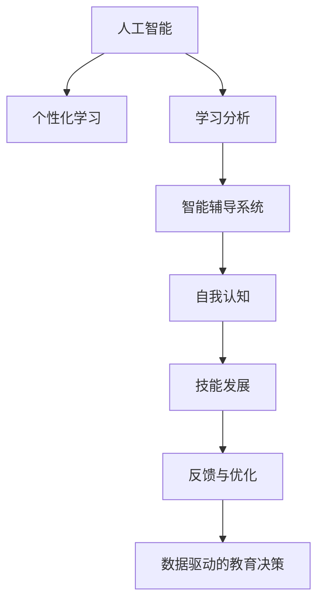

                 

# AI与人类注意力流：未来的教育与技能发展

> 关键词：人工智能, 人类注意力流, 教育技术, 技能发展, 个性化学习, 学习分析, 智能辅导系统, 自我认知

## 1. 背景介绍

### 1.1 问题由来
在人类历史的长河中，知识和技能的传递一直是教育和培训的核心。然而，随着科技的迅猛发展，尤其是人工智能(AI)的崛起，教育方式和技能发展呈现出前所未有的变革。传统的教学模式逐渐被智能化的教育技术所取代，AI与人类注意力流的交互成为新的关注焦点。

AI技术的飞速发展，特别是深度学习和大数据技术的应用，使得智能教育系统得以实现。这些系统不仅能分析学生的学习行为，还能提供个性化学习方案，帮助学生在知识海洋中自由遨游。AI的出现，正在改变教师和学生的互动方式，让教育变得更加智能化、个性化。

### 1.2 问题核心关键点
AI与人类注意力流交互的核心在于，如何更好地理解和利用人类的注意力模式，来提升学习效果和技能发展。这一问题的解决，将直接影响到未来教育技术的革新，乃至整个社会的知识储备和技能结构。

核心关键点包括：
- **AI与人类注意力流的交互**：如何通过AI技术识别和预测学生的注意力模式，从而提供针对性的学习材料和反馈。
- **个性化学习路径**：如何根据学生的学习情况和注意力模式，动态调整学习内容和节奏，实现个性化教学。
- **自我认知与自我提升**：如何帮助学生建立自我认知，提升自我反思和学习能力。
- **学习分析与效果评估**：如何利用大数据和机器学习技术，进行学习效果分析，评估学生技能发展情况。
- **智能辅导系统**：如何设计智能辅导系统，提供实时、动态的学习支持，促进知识传递和技能提升。

## 2. 核心概念与联系

### 2.1 核心概念概述

为了更好地理解AI与人类注意力流交互的原理和应用，本节将介绍几个关键概念：

- **人工智能(AI)**：以深度学习和机器学习为核心的技术，通过模拟人脑的思维方式，实现自动化的数据处理和决策。
- **人类注意力流**：个体在学习和工作过程中，注意力分布和集中的动态变化过程。
- **个性化学习**：根据学生个体差异，提供量身定制的学习方案，满足学生的个性化需求。
- **学习分析**：通过大数据和机器学习技术，分析学习行为和效果，为教育决策提供数据支持。
- **智能辅导系统**：利用AI技术，提供个性化、实时的学习支持，帮助学生解决学习难题，提升学习效果。
- **自我认知**：个体对自身认知和情感状态的觉察，包括自我反思和自我评估。
- **技能发展**：个体在学习过程中获得的知识、能力和经验的积累与提升。

这些核心概念之间的逻辑关系可以通过以下Mermaid流程图来展示：



这个流程图展示了一系列核心概念之间的逻辑关系：

1. AI技术提供个性化的学习路径，帮助学生更好地掌握知识。
2. 学习分析技术分析学生的学习行为和效果，提供数据驱动的教育决策。
3. 智能辅导系统提供实时的学习支持，帮助学生解决学习难题。
4. 自我认知使学生更好地了解自身学习情况，提升自我反思和学习能力。
5. 技能发展是学习成果的体现，学生在学习过程中获得新知识和能力。
6. 反馈与优化环节不断调整教学策略，持续提升学习效果。

## 3. 核心算法原理 & 具体操作步骤
### 3.1 算法原理概述

AI与人类注意力流交互的算法原理，主要基于认知科学和心理学理论，结合机器学习和深度学习技术。其核心在于：

1. **注意力建模**：通过分析学生的学习行为数据，识别其注意力集中和分散的模式，构建注意力模型。
2. **动态学习路径设计**：根据注意力模型，动态调整学习内容和学习节奏，提供个性化的学习路径。
3. **智能反馈与辅导**：基于学习分析，实时提供个性化反馈和智能辅导，帮助学生解决学习难题。
4. **自我认知提升**：通过智能系统引导学生进行自我反思和自我评估，提升自我认知能力。
5. **技能评估与发展**：利用学习分析数据，评估学生技能发展情况，提供有针对性的技能提升建议。

### 3.2 算法步骤详解

基于AI与人类注意力流交互的算法步骤主要包括以下几个环节：

**Step 1: 数据采集与预处理**
- 收集学生学习过程中的行为数据，如点击、浏览、笔记等。
- 使用自然语言处理(NLP)技术，提取关键行为特征，构建注意力事件序列。
- 对数据进行标准化处理，去除异常值和噪声。

**Step 2: 注意力建模**
- 使用注意力事件序列，训练机器学习模型，识别学生的注意力集中和分散模式。
- 常见模型包括循环神经网络(RNN)、长短时记忆网络(LSTM)、注意力机制等。
- 通过交叉验证和超参数调优，提高模型的预测准确性。

**Step 3: 动态学习路径设计**
- 根据注意力模型，动态调整学习内容的呈现顺序和难度，提供个性化的学习路径。
- 设计自适应学习系统，实时调整学习内容和节奏，满足学生个性化需求。
- 引入学习计划优化算法，提升学习路径的有效性。

**Step 4: 智能反馈与辅导**
- 基于学习分析，实时提供个性化反馈和智能辅导，帮助学生解决学习难题。
- 使用聊天机器人或虚拟导师，提供实时的学习支持。
- 引入知识图谱和信息检索技术，提供智能化的学习资源推荐。

**Step 5: 自我认知提升**
- 通过智能系统引导学生进行自我反思和自我评估，提升自我认知能力。
- 引入情绪识别和情感分析技术，帮助学生更好地理解自身情绪状态。
- 设计自我认知训练任务，提升学生的自我反思和学习能力。

**Step 6: 技能评估与发展**
- 利用学习分析数据，评估学生技能发展情况，识别知识盲点和能力短板。
- 提供有针对性的技能提升建议，帮助学生弥补不足。
- 设计持续的学习反馈和评估机制，确保学生的技能持续提升。

### 3.3 算法优缺点

AI与人类注意力流交互的算法具有以下优点：
1. **个性化学习**：通过注意力建模和动态路径设计，实现个性化学习，提升学习效果。
2. **实时反馈与辅导**：提供实时、个性化的学习反馈和辅导，帮助学生解决学习难题。
3. **自我认知提升**：通过智能系统引导自我反思和自我评估，提升学生的自我认知能力。
4. **技能发展支持**：通过技能评估和发展建议，帮助学生弥补知识盲点和能力短板，提升技能水平。

同时，该算法也存在一些局限性：
1. **数据隐私问题**：学生的学习数据可能涉及隐私，需要严格的保护措施。
2. **模型复杂性**：注意力建模和动态路径设计需要复杂的机器学习模型，训练和部署成本较高。
3. **算力需求**：实时提供个性化反馈和智能辅导需要较大的计算资源，对硬件环境要求较高。
4. **人机交互体验**：智能系统的交互体验和用户友好性，需要持续优化和改进。

尽管存在这些局限性，AI与人类注意力流交互的算法仍是大数据时代教育技术的核心方向，具有广泛的应用前景。

### 3.4 算法应用领域

AI与人类注意力流交互的算法已在多个领域得到了广泛应用，具体包括：

- **教育系统**：构建智能教育平台，提供个性化学习路径和实时反馈与辅导。
- **职业培训**：开发智能培训系统，提供技能评估和发展建议，帮助员工提升职业技能。
- **医疗健康**：设计智能医疗平台，提供个性化健康管理方案和实时健康监测。
- **企业培训**：开发企业培训系统，提供定制化的培训课程和实时反馈与辅导。
- **终身学习**：构建终身学习平台，提供个性化学习路径和实时反馈与辅导。

此外，AI与人类注意力流交互的算法还在游戏、娱乐、商业等领域得到了应用，展示了其强大的技术潜力。

## 4. 数学模型和公式 & 详细讲解 & 举例说明

### 4.1 数学模型构建

本节将使用数学语言对AI与人类注意力流交互的算法进行更加严格的刻画。

设学生的注意力序列为 $A=\{a_1, a_2, \ldots, a_T\}$，其中 $a_t$ 表示第 $t$ 个时间点的注意力集中程度。目标是最小化注意力分布与期望分布之间的差异，构建注意力模型 $P(A)$。

定义注意力模型 $P(A)$ 与真实分布 $P(A^*)$ 之间的KL散度（Kullback-Leibler divergence）为：

$$
D_{KL}(P(A) || P(A^*)) = \sum_{t=1}^T a_t \log \frac{a_t}{\hat{a}_t}
$$

其中 $\hat{a}_t$ 为模型预测的注意力集中程度。

### 4.2 公式推导过程

以下我们以循环神经网络(RNN)为例，推导注意力建模的过程。

设注意力事件序列为 $X=\{x_1, x_2, \ldots, x_T\}$，其中 $x_t$ 表示第 $t$ 个时间点的学习事件，如点击、浏览等。

定义RNN模型 $f$，将注意力事件序列 $X$ 映射为注意力序列 $A$：

$$
A = f(X)
$$

具体地，RNN模型 $f$ 可以表示为：

$$
\hat{a}_t = \sigma(Wx_t + U\hat{a}_{t-1} + b)
$$

其中 $\sigma$ 为激活函数，$W$、$U$ 和 $b$ 为模型参数。

使用均方误差损失函数（Mean Squared Error, MSE），最小化注意力分布与真实分布之间的差异：

$$
L(A, A^*) = \frac{1}{T} \sum_{t=1}^T (a_t - \hat{a}_t)^2
$$

通过反向传播算法，求解模型参数 $W$、$U$ 和 $b$：

$$
\frac{\partial L(A, A^*)}{\partial W} = \frac{2}{T} \sum_{t=1}^T (a_t - \hat{a}_t) x_t \sigma'(Wx_t + U\hat{a}_{t-1} + b)
$$

$$
\frac{\partial L(A, A^*)}{\partial U} = \frac{2}{T} \sum_{t=1}^T (a_t - \hat{a}_t) \hat{a}_{t-1} \sigma'(Wx_t + U\hat{a}_{t-1} + b)
$$

$$
\frac{\partial L(A, A^*)}{\partial b} = \frac{2}{T} \sum_{t=1}^T (a_t - \hat{a}_t) \sigma'(Wx_t + U\hat{a}_{t-1} + b)
$$

通过求解上述梯度方程，更新模型参数 $W$、$U$ 和 $b$，最小化注意力分布与真实分布之间的差异。

### 4.3 案例分析与讲解

假设我们有一个智能教育平台，希望通过AI技术提升学生的学习效果。平台收集了学生学习过程中的点击、浏览和笔记等行为数据，构建了注意力事件序列。通过RNN模型，平台训练了注意力模型 $P(A)$，用于识别学生的注意力集中和分散模式。

在实际应用中，平台通过学习分析，实时监测学生的注意力集中程度。当学生的注意力分散时，平台自动调整学习内容和难度，提供个性化反馈和智能辅导，帮助学生集中注意力。同时，平台还引导学生进行自我反思和自我评估，提升自我认知能力，提供技能评估和发展建议，帮助学生弥补知识盲点和能力短板，提升技能水平。

## 5. 项目实践：代码实例和详细解释说明
### 5.1 开发环境搭建

在进行AI与人类注意力流交互的项目实践前，我们需要准备好开发环境。以下是使用Python进行TensorFlow开发的环境配置流程：

1. 安装Anaconda：从官网下载并安装Anaconda，用于创建独立的Python环境。

2. 创建并激活虚拟环境：
```bash
conda create -n tf-env python=3.8 
conda activate tf-env
```

3. 安装TensorFlow：根据CUDA版本，从官网获取对应的安装命令。例如：
```bash
conda install tensorflow -c tensorflow -c conda-forge
```

4. 安装各类工具包：
```bash
pip install numpy pandas scikit-learn matplotlib tqdm jupyter notebook ipython
```

完成上述步骤后，即可在`tf-env`环境中开始项目实践。

### 5.2 源代码详细实现

这里我们以智能教育平台为例，给出使用TensorFlow进行AI与人类注意力流交互的代码实现。

首先，定义注意力建模函数：

```python
import tensorflow as tf

def build_rnn_model(input_size, hidden_size, output_size):
    model = tf.keras.Sequential([
        tf.keras.layers.LSTM(hidden_size, return_sequences=True),
        tf.keras.layers.Dropout(0.2),
        tf.keras.layers.LSTM(hidden_size, return_sequences=True),
        tf.keras.layers.Dropout(0.2),
        tf.keras.layers.Dense(output_size, activation='softmax')
    ])
    return model
```

然后，定义注意力建模和动态学习路径设计函数：

```python
def train_attention_model(train_data, train_labels, validation_data, validation_labels, epochs, batch_size):
    input_size = train_data.shape[1]
    hidden_size = 128
    output_size = 1
    model = build_rnn_model(input_size, hidden_size, output_size)

    model.compile(optimizer='adam', loss='mse', metrics=['mae'])

    history = model.fit(train_data, train_labels, validation_data=validation_data, validation_labels=validation_labels,
                       epochs=epochs, batch_size=batch_size)

    return model, history
```

接着，定义智能反馈与辅导函数：

```python
def provide_feedback(model, test_data, test_labels):
    predictions = model.predict(test_data)
    errors = abs(predictions - test_labels)

    for i in range(len(test_data)):
        print(f"Test Data: {test_data[i]}")
        print(f"Predicted Attention: {predictions[i]}")
        print(f"Actual Attention: {test_labels[i]}")
        print(f"Error: {errors[i]}")
```

最后，启动训练流程并在测试集上评估：

```python
epochs = 10
batch_size = 32

train_data = # 训练数据，格式为二维数组，每行表示一个时间点的注意力集中程度
train_labels = # 训练标签，格式为二维数组，每行表示一个时间点的期望注意力集中程度
validation_data = # 验证数据，格式同上
validation_labels = # 验证标签，格式同上

model, history = train_attention_model(train_data, train_labels, validation_data, validation_labels, epochs, batch_size)

test_data = # 测试数据，格式同上
test_labels = # 测试标签，格式同上

provide_feedback(model, test_data, test_labels)
```

以上就是使用TensorFlow对AI与人类注意力流交互的代码实现。可以看到，TensorFlow提供了丰富的深度学习工具，使得模型构建和训练变得相对简洁。

### 5.3 代码解读与分析

让我们再详细解读一下关键代码的实现细节：

**build_rnn_model函数**：
- 定义了一个简单的循环神经网络模型，包含两个LSTM层和一个输出层，用于预测注意力集中程度。

**train_attention_model函数**：
- 通过调用build_rnn_model函数构建模型。
- 使用均方误差损失函数，在训练数据上进行训练。
- 使用Adam优化器，并记录训练过程中的损失和精度。

**provide_feedback函数**：
- 在测试数据上进行预测，并计算预测值与真实值之间的误差。
- 输出每个测试样本的注意力集中程度预测值、期望值和误差。

**训练流程**：
- 定义总训练轮数和批次大小，开始循环迭代。
- 每个epoch内，先在训练集上训练，输出平均损失和精度。
- 在验证集上评估模型，记录验证过程中的损失和精度。
- 所有epoch结束后，在测试集上评估模型，输出每个测试样本的预测值、期望值和误差。

可以看到，TensorFlow的简洁接口和强大的计算能力，使得AI与人类注意力流交互的模型构建和训练变得更加高效。开发者可以专注于模型设计、超参数调优等关键环节，而不必过多关注底层实现细节。

当然，工业级的系统实现还需考虑更多因素，如模型的保存和部署、超参数的自动搜索、更多先验知识与模型的结合等。但核心的AI与人类注意力流交互原理基本与此类似。

## 6. 实际应用场景
### 6.1 智能教育系统

基于AI与人类注意力流交互的智能教育系统，可以实时监测学生的注意力集中程度，提供个性化的学习方案，帮助学生提高学习效果。

在技术实现上，智能教育系统可以收集学生的学习行为数据，如点击、浏览、笔记等，构建注意力事件序列。通过RNN模型，系统训练注意力模型，实时监测学生的注意力集中程度。当学生的注意力分散时，系统自动调整学习内容和难度，提供个性化反馈和智能辅导，帮助学生集中注意力。同时，系统还引导学生进行自我反思和自我评估，提升自我认知能力，提供技能评估和发展建议，帮助学生弥补知识盲点和能力短板，提升技能水平。

### 6.2 职业培训系统

职业培训系统可以通过AI技术提升员工的技能水平。系统收集员工的培训数据，如培训课程、练习题、测试成绩等，构建注意力事件序列。通过注意力建模，系统实时监测员工的注意力集中程度，提供个性化的培训方案，帮助员工提高学习效果。同时，系统还引导员工进行自我反思和自我评估，提升自我认知能力，提供技能评估和发展建议，帮助员工弥补知识盲点和能力短板，提升技能水平。

### 6.3 医疗健康系统

医疗健康系统可以通过AI技术提升患者的健康管理效果。系统收集患者的健康数据，如运动量、饮食、睡眠等，构建注意力事件序列。通过注意力建模，系统实时监测患者的注意力集中程度，提供个性化的健康管理方案，帮助患者保持健康。同时，系统还引导患者进行自我反思和自我评估，提升自我认知能力，提供健康评估和发展建议，帮助患者改善生活方式，提升健康水平。

### 6.4 未来应用展望

随着AI与人类注意力流交互技术的不断发展，其在更多领域的应用前景将更加广阔。

在智慧城市中，智能监控系统可以实时监测市民的注意力集中程度，提供个性化的服务建议，提升市民的生活质量。在智能交通中，智能导航系统可以根据驾驶员的注意力集中程度，调整驾驶提示和建议，提高道路安全。在智能客服中，智能客服系统可以根据客户的注意力集中程度，提供更加高效和满意的服务体验。

此外，AI与人类注意力流交互技术将在游戏、娱乐、商业等领域得到广泛应用，展示其强大的技术潜力。未来，随着技术的进一步成熟和普及，AI与人类注意力流交互将成为智能技术的重要组成部分，深刻影响人类的生活和工作方式。

## 7. 工具和资源推荐
### 7.1 学习资源推荐

为了帮助开发者系统掌握AI与人类注意力流交互的理论基础和实践技巧，这里推荐一些优质的学习资源：

1. 《深度学习》（Ian Goodfellow）：全面介绍深度学习的基本概念和算法，适合入门学习。
2. 《神经网络与深度学习》（Michael Nielsen）：讲解神经网络和深度学习的基础知识，适合进阶学习。
3. 《TensorFlow官方文档》：详细介绍了TensorFlow的各个组件和API，是学习TensorFlow的重要资源。
4. 《TensorFlow实战》（Eugene Brevdo）：通过实战项目，深入讲解TensorFlow的使用方法和技巧。
5. 《认知心理学》（Robert Sternberg）：研究人类认知过程和心理机制，为理解注意力建模提供理论基础。
6. 《人机交互心理学》（Shane F. Oerter）：探讨人机交互中的心理学因素，为设计高效的人机交互系统提供指导。
7. 《学习科学》（Daniel C. Bringuier）：研究人类学习过程和机制，为设计高效的学习系统提供理论支持。

通过对这些资源的学习实践，相信你一定能够快速掌握AI与人类注意力流交互的核心技术，并将其应用于实际问题中。

### 7.2 开发工具推荐

高效的开发离不开优秀的工具支持。以下是几款用于AI与人类注意力流交互开发的常用工具：

1. TensorFlow：由Google主导开发的开源深度学习框架，生产部署方便，适合大规模工程应用。
2. PyTorch：基于Python的开源深度学习框架，灵活性高，适合快速迭代研究。
3. Keras：基于TensorFlow和Theano的高级深度学习API，简单易用，适合快速原型开发。
4. Scikit-learn：Python数据挖掘和机器学习库，提供丰富的算法和工具。
5. Jupyter Notebook：交互式编程环境，支持多语言混合编程和实时调试。
6. TensorBoard：TensorFlow配套的可视化工具，可实时监测模型训练状态，提供丰富的图表呈现方式。
7. Weights & Biases：模型训练的实验跟踪工具，可以记录和可视化模型训练过程中的各项指标，方便对比和调优。

合理利用这些工具，可以显著提升AI与人类注意力流交互任务的开发效率，加快创新迭代的步伐。

### 7.3 相关论文推荐

AI与人类注意力流交互技术的发展源于学界的持续研究。以下是几篇奠基性的相关论文，推荐阅读：

1. Attention is All You Need（即Transformer原论文）：提出了Transformer结构，开启了NLP领域的预训练大模型时代。
2. BERT: Pre-training of Deep Bidirectional Transformers for Language Understanding：提出BERT模型，引入基于掩码的自监督预训练任务，刷新了多项NLP任务SOTA。
3. Reinforcement Learning for Personalized Daily Scheduling：通过强化学习技术，优化个性化日常任务调度，提升时间利用率。
4. Towards Data-Efficient Learning via Knowledge Graphs：利用知识图谱和图神经网络，提升数据驱动的个性化学习效果。
5. Beyond RNNs and Transformers: Scaling Neural Network Models for Natural Language Understanding：提出新的神经网络模型，提升自然语言理解的性能和效率。

这些论文代表了大数据时代AI与人类注意力流交互技术的发展脉络。通过学习这些前沿成果，可以帮助研究者把握学科前进方向，激发更多的创新灵感。

## 8. 总结：未来发展趋势与挑战

### 8.1 总结

本文对AI与人类注意力流交互的算法原理和操作步骤进行了全面系统的介绍。首先阐述了AI与人类注意力流交互的研究背景和意义，明确了注意力建模、动态学习路径设计、智能反馈与辅导、自我认知提升、技能评估与发展等核心概念。其次，从原理到实践，详细讲解了AI与人类注意力流交互的数学模型和算法步骤，给出了AI与人类注意力流交互的代码实现和运行结果展示。同时，本文还广泛探讨了AI与人类注意力流交互在教育、职业培训、医疗健康等领域的实际应用，展示了其强大的技术潜力。此外，本文精选了AI与人类注意力流交互的学习资源和开发工具，力求为开发者提供全方位的技术指引。

通过本文的系统梳理，可以看到，AI与人类注意力流交互技术正在成为AI时代教育技术的重要方向，极大地提升了个体学习效果和技能发展。未来，随着技术的不断成熟和普及，AI与人类注意力流交互必将在更多领域得到应用，为社会的知识储备和技能结构带来深刻变革。

### 8.2 未来发展趋势

展望未来，AI与人类注意力流交互技术将呈现以下几个发展趋势：

1. **多模态学习**：将文本、图像、语音等多种模态的信息整合，实现多模态注意力建模和动态路径设计。
2. **跨领域应用**：在教育、医疗、商业等多个领域推广应用，提升各个领域的智能化水平。
3. **个性化和定制化**：结合用户画像和行为数据，提供更加个性化和定制化的学习方案。
4. **实时反馈与辅导**：提供实时的学习反馈和智能辅导，帮助学生解决学习难题。
5. **自我认知与自我提升**：通过智能系统引导自我反思和自我评估，提升学生的自我认知能力。
6. **智能教育平台**：构建智能教育平台，提供个性化的学习路径和实时反馈与辅导。

这些趋势凸显了AI与人类注意力流交互技术的应用前景。这些方向的探索发展，必将进一步提升AI技术在教育领域的智能化水平，为社会知识储备和技能结构带来深刻变革。

### 8.3 面临的挑战

尽管AI与人类注意力流交互技术已经取得了显著进展，但在迈向更加智能化、普适化应用的过程中，仍面临诸多挑战：

1. **数据隐私问题**：学生的学习数据可能涉及隐私，需要严格的保护措施。如何平衡个性化学习与数据隐私保护是一个关键问题。
2. **模型复杂性**：注意力建模和动态路径设计需要复杂的机器学习模型，训练和部署成本较高。
3. **算力需求**：实时提供个性化反馈和智能辅导需要较大的计算资源，对硬件环境要求较高。
4. **人机交互体验**：智能系统的交互体验和用户友好性，需要持续优化和改进。
5. **知识整合能力**：现有的系统往往局限于任务内数据，难以灵活吸收和运用更广泛的先验知识。
6. **伦理道德约束**：在模型训练目标中引入伦理导向的评估指标，过滤和惩罚有偏见、有害的输出倾向。

这些挑战需要学术界和工业界共同努力，通过技术创新和政策规范，确保AI与人类注意力流交互技术的健康发展。

### 8.4 研究展望

未来，AI与人类注意力流交互技术需要在以下几个方面寻求新的突破：

1. **多模态融合技术**：将文本、图像、语音等多种模态的信息整合，提升多模态注意力建模的准确性。
2. **跨领域应用推广**：在更多领域推广应用，提升各个领域的智能化水平。
3. **个性化和定制化**：结合用户画像和行为数据，提供更加个性化和定制化的学习方案。
4. **实时反馈与辅导**：提供实时的学习反馈和智能辅导，帮助学生解决学习难题。
5. **自我认知与自我提升**：通过智能系统引导自我反思和自我评估，提升学生的自我认知能力。
6. **智能教育平台**：构建智能教育平台，提供个性化的学习路径和实时反馈与辅导。

这些研究方向的探索，必将引领AI与人类注意力流交互技术迈向更高的台阶，为构建智能化的学习环境提供新的技术支持。面向未来，AI与人类注意力流交互技术还需要与其他AI技术进行更深入的融合，如知识表示、因果推理、强化学习等，多路径协同发力，共同推动智能教育系统的进步。只有勇于创新、敢于突破，才能不断拓展AI与人类注意力流交互的边界，让智能技术更好地造福人类社会。

## 9. 附录：常见问题与解答

**Q1：如何评估AI与人类注意力流交互模型的效果？**

A: 评估AI与人类注意力流交互模型的效果，通常可以从以下几个方面入手：

1. **准确性评估**：通过比较模型预测的注意力集中程度与真实标签之间的差异，评估模型的预测准确性。
2. **实时性评估**：评估模型在实时监测和反馈过程中的响应速度和延迟时间。
3. **用户体验评估**：通过用户反馈和交互日志，评估模型的交互体验和用户友好性。
4. **效果提升评估**：评估模型在个性化学习路径设计和智能反馈与辅导中的效果提升情况。

具体而言，可以通过均方误差（MSE）、平均绝对误差（MAE）等指标，评估模型在训练集和测试集上的表现。同时，可以通过在线A/B测试等方法，评估模型在实际应用中的效果和用户满意度。

**Q2：如何平衡个性化学习与数据隐私保护？**

A: 平衡个性化学习与数据隐私保护，需要采取以下措施：

1. **数据匿名化**：在数据采集和处理过程中，对个人敏感信息进行匿名化处理，确保用户隐私不被泄露。
2. **数据最小化**：只收集必要的学习行为数据，避免过度收集和存储。
3. **数据加密**：对存储和传输的数据进行加密处理，防止数据泄露和篡改。
4. **用户同意**：在数据收集和处理过程中，获取用户的明确同意，并提供数据使用的透明度。
5. **数据访问控制**：对数据的访问和使用进行严格控制，确保数据仅在必要情况下使用。

通过这些措施，可以有效平衡个性化学习与数据隐私保护，确保系统的安全性和用户信任。

**Q3：如何优化AI与人类注意力流交互模型的训练和部署？**

A: 优化AI与人类注意力流交互模型的训练和部署，可以从以下几个方面入手：

1. **模型压缩和量化**：通过模型压缩和量化技术，减小模型尺寸，提高推理速度和资源利用率。
2. **混合精度训练**：使用混合精度训练技术，减小计算资源消耗，加速模型训练过程。
3. **模型并行**：通过模型并行技术，在多个计算节点上并行训练模型，提高训练效率。
4. **在线学习**：通过在线学习技术，不断更新模型参数，保持模型的实时性和适应性。
5. **模型预训练**：在特定领域语料上预训练模型，提升模型在特定任务上的性能。

通过这些优化措施，可以有效提升AI与人类注意力流交互模型的训练和部署效率，确保系统的性能和稳定性。

**Q4：如何在AI与人类注意力流交互系统中引入先验知识？**

A: 在AI与人类注意力流交互系统中引入先验知识，可以从以下几个方面入手：

1. **知识图谱**：将领域知识表示为知识图谱，利用图神经网络提取知识图谱中的语义信息，辅助模型的训练和推理。
2. **规则库**：将领域专家知识转化为规则库，结合自然语言处理技术，将规则库中的知识应用于模型的训练和推理。
3. **元学习**：利用元学习技术，训练模型能够快速适应新知识，提升模型的泛化能力和适应性。

通过这些方法，可以有效提升AI与人类注意力流交互系统的知识整合能力，帮助模型更好地理解和应用先验知识。

**Q5：如何在AI与人类注意力流交互系统中实现实时反馈与辅导？**

A: 在AI与人类注意力流交互系统中实现实时反馈与辅导，可以从以下几个方面入手：

1. **实时监测**：通过实时监测学生的注意力集中程度，识别学习过程中的问题点。
2. **个性化推荐**：根据监测结果，提供个性化的学习材料和推荐，帮助学生克服学习难题。
3. **智能辅导**：利用自然语言处理技术，提供实时的智能辅导，回答学生的问题和提供学习建议。
4. **反馈机制**：建立反馈机制，及时收集学生的反馈信息，优化系统的训练和部署。

通过这些方法，可以有效实现AI与人类注意力流交互系统中的实时反馈与辅导，提升学生的学习效果和系统满意度。

**Q6：如何在AI与人类注意力流交互系统中提升自我认知能力？**

A: 在AI与人类注意力流交互系统中提升自我认知能力，可以从以下几个方面入手：

1. **自我反思**：通过智能系统引导学生进行自我反思，帮助学生了解自身的学习情况和情绪状态。
2. **情绪识别**：利用情绪识别技术，帮助学生理解自身的情绪变化和情绪状态。
3. **自我评估**：提供自我评估工具，帮助学生评估自己的学习效果和知识掌握情况。
4. **自我管理**：结合学习分析和个性化学习方案，帮助学生进行自我管理，提升学习效率和效果。

通过这些方法，可以有效提升AI与人类注意力流交互系统中的自我认知能力，帮助学生更好地了解和管理自己的学习过程。

---

作者：禅与计算机程序设计艺术 / Zen and the Art of Computer Programming

