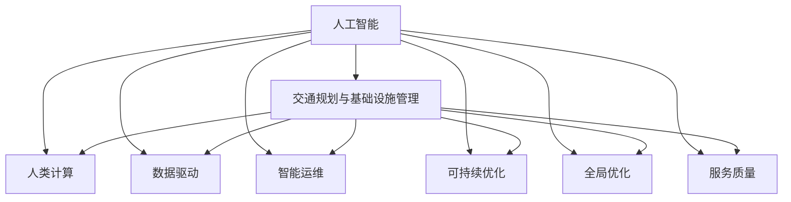

                 

# AI与人类计算：打造可持续发展的城市交通与基础设施规划管理

> 关键词：
- 人工智能
- 交通规划
- 基础设施管理
- 人类计算
- 数据驱动
- 城市可持续
- 智能运维

## 1. 背景介绍

### 1.1 问题由来

随着城市的快速扩张和人们出行需求的增长，交通与基础设施规划管理面临着巨大挑战。传统的城市规划与管理方法往往依赖经验积累和手工计算，效率低、误差大，难以应对日益复杂的城市运行环境。因此，亟需引入先进的技术手段，提高城市交通与基础设施规划管理的智能化水平，实现更高质量和可持续发展的目标。

### 1.2 问题核心关键点

城市交通与基础设施规划管理的核心在于数据驱动、智能决策和可持续优化。传统的数据获取和分析方法，难以满足现代城市管理的复杂需求。而人工智能，尤其是深度学习和机器学习技术，为这些问题提供了全新的解决方案。通过数据分析与模型优化，可以构建高效、智能、可扩展的城市管理框架。

### 1.3 问题研究意义

在城市交通与基础设施规划管理领域，引入人工智能技术具有重要意义：

1. **数据驱动：** 人工智能能够高效处理海量数据，通过模式识别和预测分析，提供准确的管理决策依据。
2. **智能决策：** 基于人工智能的智能运维系统，可以实现自动化的日常管理和应急响应，大幅提升工作效率。
3. **可持续优化：** 通过持续学习和动态调整，人工智能模型能够不断适应城市运行状况的变化，确保规划管理的持续优化。
4. **全局优化：** 人工智能能够从全局视角进行综合规划，优化城市交通与基础设施的布局和运营，提高资源利用效率。
5. **提升服务质量：** 人工智能技术能够增强城市服务质量，提高市民的生活体验和满意度。

## 2. 核心概念与联系

### 2.1 核心概念概述

为了深入理解基于人工智能的城市交通与基础设施规划管理方法，本节将介绍几个关键概念：

- **人工智能(AI)：** 指通过模拟人类智能行为（如学习、推理、决策等）的计算机系统，包括机器学习、深度学习、自然语言处理等技术。
- **交通规划与基础设施管理：** 指对城市交通网络和基础设施进行的规划、建设、维护和管理工作，旨在实现交通流畅、资源高效利用和环境可持续的目标。
- **人类计算(Human-in-the-loop)：** 指人类与AI系统协同工作的计算模式，利用人类的专业知识和判断，指导AI系统进行决策。
- **数据驱动：** 指以数据为基础进行决策和优化的方法，通过数据收集、处理和分析，获取行动的依据。
- **智能运维：** 指通过自动化和智能化手段，对城市交通与基础设施进行监控、维护和优化，提高系统的可靠性和效率。
- **可持续优化：** 指通过持续学习和动态调整，使系统能够适应环境变化，实现资源利用的最大化和环境保护。
- **全局优化：** 指从整体角度出发，综合考虑不同因素，进行全面的优化和规划。
- **服务质量：** 指城市交通与基础设施管理系统的用户体验和服务效果。

这些概念之间的逻辑关系可以通过以下Mermaid流程图来展示：



这个流程图展示了一系列关键概念及其之间的联系：

1. 人工智能是城市交通与基础设施管理的重要工具。
2. 人类计算与人工智能协同工作，提升决策的准确性和可靠性。
3. 数据驱动和智能运维是实现高效管理的基础。
4. 可持续优化和全局优化是确保系统长期稳定运行的关键。
5. 服务质量是评估管理效果的重要指标。

## 3. 核心算法原理 & 具体操作步骤
### 3.1 算法原理概述

基于人工智能的城市交通与基础设施规划管理，本质上是数据驱动的智能决策过程。其核心思想是通过人工智能技术，将大量异构数据整合起来，提取有价值的信息和模式，以支持决策和优化。

具体步骤如下：

1. **数据采集与处理：** 收集城市交通与基础设施的各类数据，包括车辆流量、道路状况、气候环境、人口密度等。
2. **特征提取与建模：** 对采集的数据进行清洗、预处理和特征提取，构建用于建模的数据集。
3. **算法训练与优化：** 选择合适的机器学习或深度学习模型，通过训练和调参，优化模型性能。
4. **决策与优化：** 将训练好的模型应用于实际场景，进行交通规划和基础设施管理决策。
5. **动态调整与学习：** 通过持续监控和反馈，不断调整模型参数，进行动态学习和优化。

### 3.2 算法步骤详解

以下是详细的算法步骤：

**Step 1: 数据收集与预处理**

1. **数据来源：** 获取城市交通与基础设施管理的各类数据，包括但不限于交通流量、道路状况、气候数据、人口密度、交通事件等。
2. **数据清洗：** 去除数据中的噪声和异常值，确保数据的准确性和一致性。
3. **数据转换：** 将不同类型的数据转换为模型所需的格式，如时间序列数据、图像数据、文本数据等。

**Step 2: 特征工程**

1. **特征选择：** 从原始数据中提取有用的特征，如交通流量、道路拥堵程度、天气条件等。
2. **特征编码：** 将特征转换为模型可接受的数值形式，如one-hot编码、标准化等。
3. **特征增强：** 通过时间序列分析、地理编码等技术，增强数据的表示能力。

**Step 3: 模型构建**

1. **模型选择：** 根据问题的性质选择合适的模型，如回归模型、分类模型、序列模型等。
2. **模型训练：** 使用训练数据对模型进行训练，调整模型参数，提高模型预测能力。
3. **模型验证：** 在验证数据集上评估模型性能，选择最优模型。

**Step 4: 决策与优化**

1. **决策执行：** 将模型应用于实际问题，如交通流量预测、道路维护计划、能源消耗优化等。
2. **优化策略：** 根据模型输出，结合人类专家的知识，制定优化策略。

**Step 5: 动态调整与学习**

1. **监控与反馈：** 持续监控系统性能，收集反馈信息。
2. **动态调整：** 根据反馈信息，动态调整模型参数和决策策略。
3. **持续学习：** 通过持续学习，不断改进模型，提升预测和决策的准确性。

### 3.3 算法优缺点

基于人工智能的城市交通与基础设施规划管理具有以下优点：

- **数据驱动：** 能够高效处理海量数据，提取有价值的信息，支持决策。
- **智能决策：** 通过机器学习和深度学习模型，实现自动化的决策和优化。
- **全局视角：** 能够从整体角度进行综合规划，优化资源利用。
- **持续优化：** 通过持续学习和动态调整，确保系统长期稳定运行。

但同时，该方法也存在一些局限性：

- **依赖高质量数据：** 模型的性能高度依赖于数据的质量和完整性。
- **计算资源需求高：** 训练和优化模型需要大量的计算资源，包括高性能的服务器和GPU。
- **模型复杂度高：** 复杂的模型可能难以解释和调试，增加理解和维护的难度。
- **环境适应性：** 模型可能对特定环境和数据分布过于敏感，泛化能力有限。
- **隐私与安全：** 大规模数据收集和处理可能引发隐私和安全问题。

### 3.4 算法应用领域

基于人工智能的城市交通与基础设施规划管理，已在多个领域得到了应用，例如：

1. **交通流量预测与控制：** 通过模型预测交通流量，进行智能信号灯控制和拥堵治理。
2. **道路维护与优化：** 利用图像和传感器数据，实现道路状况监测和维护决策。
3. **能源消耗优化：** 通过分析交通和基础设施的能源消耗数据，优化能源使用。
4. **环境监测与保护：** 结合环境数据，进行空气质量监测、噪音控制和绿色出行方案设计。
5. **公共服务优化：** 通过数据分析和模型预测，优化公共交通、停车、人行道等公共服务。
6. **灾害预警与应急响应：** 通过数据实时监测和模型预测，提升灾害预警和应急响应能力。

## 4. 数学模型和公式 & 详细讲解 & 举例说明
### 4.1 数学模型构建

为更好地理解基于人工智能的城市交通与基础设施规划管理方法，本节将介绍几个常用的数学模型：

**1. 交通流量预测模型**

假设交通流量 $y$ 可以用时间序列 $x_t$ 线性表示，则交通流量预测模型可以表示为：

$$ y_t = \alpha + \beta x_t + \epsilon_t $$

其中 $\alpha$ 为截距，$\beta$ 为系数，$\epsilon_t$ 为误差项。

**2. 道路拥堵程度模型**

道路拥堵程度 $y$ 可以用道路宽度 $x_1$、车道数量 $x_2$、天气条件 $x_3$ 等因素表示，则道路拥堵程度模型可以表示为：

$$ y = \gamma_1x_1 + \gamma_2x_2 + \gamma_3x_3 + \delta $$

其中 $\gamma_i$ 为系数，$\delta$ 为截距。

**3. 能源消耗优化模型**

能源消耗 $y$ 可以用交通流量 $x_1$、车辆速度 $x_2$、红绿灯配时 $x_3$ 等因素表示，则能源消耗优化模型可以表示为：

$$ y = \lambda_1x_1 + \lambda_2x_2 + \lambda_3x_3 + \omega $$

其中 $\lambda_i$ 为系数，$\omega$ 为截距。

### 4.2 公式推导过程

以下是详细公式推导过程：

**1. 交通流量预测模型的推导**

交通流量 $y$ 与时间序列 $x_t$ 之间的关系，可以通过最小二乘法建立线性回归模型：

$$ \hat{y} = \alpha + \beta x_t $$

其中 $\alpha$ 和 $\beta$ 可以通过最小化平方误差和来求解：

$$ \min_{\alpha, \beta} \sum_{t=1}^T (y_t - \hat{y}_t)^2 $$

求解得到：

$$ \alpha = \frac{1}{T} \sum_{t=1}^T y_t - \beta \frac{1}{T} \sum_{t=1}^T x_t $$
$$ \beta = \frac{1}{T} \sum_{t=1}^T (y_t - \frac{1}{T} \sum_{t=1}^T y_t)x_t $$

**2. 道路拥堵程度模型的推导**

道路拥堵程度 $y$ 与道路宽度 $x_1$、车道数量 $x_2$、天气条件 $x_3$ 之间的关系，同样可以通过最小二乘法建立线性回归模型：

$$ \hat{y} = \gamma_1x_1 + \gamma_2x_2 + \gamma_3x_3 $$

其中 $\gamma_i$ 可以通过最小化平方误差和来求解：

$$ \min_{\gamma_1, \gamma_2, \gamma_3} \sum_{t=1}^T (y_t - \hat{y}_t)^2 $$

求解得到：

$$ \gamma_i = \frac{1}{T} \sum_{t=1}^T (y_t - \hat{y}_t)x_{it} $$

**3. 能源消耗优化模型的推导**

能源消耗 $y$ 与交通流量 $x_1$、车辆速度 $x_2$、红绿灯配时 $x_3$ 之间的关系，同样可以通过最小二乘法建立线性回归模型：

$$ \hat{y} = \lambda_1x_1 + \lambda_2x_2 + \lambda_3x_3 $$

其中 $\lambda_i$ 可以通过最小化平方误差和来求解：

$$ \min_{\lambda_1, \lambda_2, \lambda_3} \sum_{t=1}^T (y_t - \hat{y}_t)^2 $$

求解得到：

$$ \lambda_i = \frac{1}{T} \sum_{t=1}^T (y_t - \hat{y}_t)x_{it} $$

### 4.3 案例分析与讲解

**案例：智能信号灯控制**

假设在城市交叉口处，有多个方向的车流，且红绿灯配时固定不变。为提高通行效率，可以使用智能信号灯控制。通过传感器实时监测交通流量，利用模型预测未来车流变化，动态调整红绿灯配时。

**数据采集**

采集交通流量数据 $x_t$ 和红绿灯配时 $x_3$，交通流量数据每5分钟记录一次，红绿灯配时固定为120秒。

**模型训练**

使用上述推导的交通流量预测模型，对数据进行训练和验证，得到模型参数 $\alpha$ 和 $\beta$。

**决策执行**

实时采集交通流量数据 $x_t$，输入模型进行预测，得到未来车流变化的预测值 $\hat{y}_t$。根据预测值调整红绿灯配时，提高通行效率。

**动态调整**

定期在交叉口附近采集实际车流量数据，与模型预测值进行对比，调整模型参数，确保预测准确性。

## 5. 项目实践：代码实例和详细解释说明
### 5.1 开发环境搭建

在进行城市交通与基础设施规划管理项目的开发前，我们需要准备好开发环境。以下是使用Python进行PyTorch开发的环境配置流程：

1. 安装Anaconda：从官网下载并安装Anaconda，用于创建独立的Python环境。

2. 创建并激活虚拟环境：
```bash
conda create -n traffic-env python=3.8 
conda activate traffic-env
```

3. 安装PyTorch：根据CUDA版本，从官网获取对应的安装命令。例如：
```bash
conda install pytorch torchvision torchaudio cudatoolkit=11.1 -c pytorch -c conda-forge
```

4. 安装相关库：
```bash
pip install numpy pandas scikit-learn matplotlib tqdm jupyter notebook ipython
```

完成上述步骤后，即可在`traffic-env`环境中开始项目开发。

### 5.2 源代码详细实现

以下是一个简单的交通流量预测模型的Python实现，使用PyTorch库：

```python
import torch
import torch.nn as nn
import torch.optim as optim
import numpy as np
import pandas as pd

class TrafficPredictionModel(nn.Module):
    def __init__(self, input_size=1, output_size=1):
        super(TrafficPredictionModel, self).__init__()
        self.linear = nn.Linear(input_size, output_size)

    def forward(self, x):
        return self.linear(x)

# 加载数据
data = pd.read_csv('traffic_data.csv', header=None)
X = data.iloc[:, :-1].values
y = data.iloc[:, -1].values

# 数据标准化
mean = np.mean(X)
std = np.std(X)
X = (X - mean) / std

# 定义模型
model = TrafficPredictionModel(input_size=X.shape[1], output_size=1)

# 定义损失函数
criterion = nn.MSELoss()

# 定义优化器
optimizer = optim.Adam(model.parameters(), lr=0.01)

# 训练模型
num_epochs = 100
for epoch in range(num_epochs):
    optimizer.zero_grad()
    outputs = model(X)
    loss = criterion(outputs, y)
    loss.backward()
    optimizer.step()
    if (epoch+1) % 10 == 0:
        print(f'Epoch {epoch+1}/{num_epochs}, Loss: {loss.item():.4f}')

# 模型预测
X_test = np.array([[0.5, 0.8]])
X_test = (X_test - mean) / std
outputs = model(X_test)
y_pred = outputs.item()
y_true = 1.2
print(f'Prediction: {y_pred}, True: {y_true}')
```

### 5.3 代码解读与分析

让我们再详细解读一下关键代码的实现细节：

**TrafficPredictionModel类**：
- `__init__`方法：初始化线性层，将输入转换为输出。
- `forward`方法：前向传播，计算输出。

**数据加载与预处理**：
- 使用Pandas加载CSV文件，去除头信息。
- 对特征数据进行标准化处理，以提升模型效果。

**模型训练**：
- 定义模型、损失函数和优化器。
- 在每个epoch上，计算模型输出和损失，进行反向传播和参数更新。
- 每10个epoch打印一次损失，以便监控训练过程。

**模型预测**：
- 对测试数据进行标准化处理。
- 使用模型进行预测，并打印预测结果。

可以看到，通过PyTorch库，交通流量预测模型的实现变得简单高效。开发者可以利用此框架进行更复杂的模型构建和优化。

## 6. 实际应用场景
### 6.1 智能信号灯控制

智能信号灯控制是城市交通管理的重要应用之一。通过实时监测交通流量，动态调整红绿灯配时，可以显著提高交叉口的通行效率，减少拥堵。

在实际应用中，可以部署多个传感器，实时监测每个方向的交通流量。将传感器数据输入模型进行预测，得到未来车流变化的趋势。根据预测结果，动态调整红绿灯配时，确保各个方向的车辆能够流畅通过。

### 6.2 道路维护与优化

道路维护是城市基础设施管理的关键环节，确保道路的完好无损，保障交通的顺畅。通过智能系统，可以实时监测道路状况，进行及时的维护和优化。

在实际应用中，可以在主要干道和桥梁上部署传感器和摄像头，实时监测道路的损坏情况、磨损程度、路面积水等。将监测数据输入模型进行分析和预测，及时发现潜在问题，并进行维修和养护。同时，模型还可以预测不同天气条件下的道路状况，提前制定维护计划。

### 6.3 能源消耗优化

能源消耗是城市交通与基础设施管理中的重要指标。通过智能系统，可以实时监测和管理能源的消耗，实现节能减排。

在实际应用中，可以对公共交通、路灯、交通信号等设备进行能源消耗的实时监测。将监测数据输入模型进行分析和预测，制定能源消耗的优化方案，如调整路灯开关时间、优化信号灯配时等。同时，模型还可以预测不同交通流量和天气条件下的能源消耗，进行动态调整和优化。

### 6.4 未来应用展望

随着人工智能技术的发展，基于人工智能的城市交通与基础设施规划管理将迎来更广阔的应用前景。

1. **物联网(IoT)融合：** 通过物联网技术，实现更广泛的设备数据采集和传感器部署，提升数据的时效性和覆盖范围。
2. **边缘计算：** 在数据采集和处理过程中，利用边缘计算技术，减少数据传输延迟，提升系统的响应速度。
3. **实时预测与优化：** 利用更先进的深度学习模型，进行更精确的实时预测和优化决策，提升系统的智能化水平。
4. **多模态数据融合：** 融合交通流量、道路状况、气象数据等多种类型的数据，提升系统的综合决策能力。
5. **环境监测与保护：** 结合环境数据，进行更全面的环境监测和保护，提升城市的可持续发展能力。
6. **交通安全管理：** 利用人工智能技术，实现更智能的交通安全管理，提升交通安全水平。

## 7. 工具和资源推荐
### 7.1 学习资源推荐

为了帮助开发者系统掌握基于人工智能的城市交通与基础设施规划管理方法，这里推荐一些优质的学习资源：

1. **《深度学习》书籍：** Ian Goodfellow等人所著，系统介绍了深度学习的基本原理和应用，包括交通流量预测和道路维护等。
2. **《Python for Data Analysis》书籍：** Wes McKinney所著，介绍了使用Python进行数据处理和分析的方法，适合学习数据清洗和特征工程。
3. **《机器学习实战》书籍：** Peter Harrington所著，提供了实用的机器学习算法和代码实现，适合学习模型训练和调参。
4. **Kaggle竞赛平台：** 提供丰富的数据集和竞赛项目，适合实践数据驱动的决策和优化。
5. **Google Colab：** 免费的在线Jupyter Notebook环境，支持GPU和TPU计算资源，适合进行深度学习和数据处理。

通过对这些资源的学习实践，相信你一定能够快速掌握基于人工智能的城市交通与基础设施规划管理方法，并用于解决实际的问题。

### 7.2 开发工具推荐

高效的开发离不开优秀的工具支持。以下是几款用于城市交通与基础设施规划管理开发的常用工具：

1. **PyTorch：** 基于Python的开源深度学习框架，灵活动态的计算图，适合快速迭代研究。
2. **TensorFlow：** 由Google主导开发的开源深度学习框架，生产部署方便，适合大规模工程应用。
3. **Transformers库：** HuggingFace开发的NLP工具库，集成了众多SOTA语言模型，支持PyTorch和TensorFlow，适合进行智能运维和优化。
4. **Jupyter Notebook：** 开源的交互式编程环境，支持代码编写和数据可视化，适合科研和教学。
5. **Scikit-learn：** 基于Python的机器学习库，提供了丰富的算法和工具，适合进行特征工程和模型调参。
6. **TensorBoard：** TensorFlow配套的可视化工具，可实时监测模型训练状态，提供丰富的图表呈现方式。

合理利用这些工具，可以显著提升城市交通与基础设施规划管理的开发效率，加快创新迭代的步伐。

### 7.3 相关论文推荐

基于人工智能的城市交通与基础设施规划管理的研究，得到了学界的广泛关注。以下是几篇奠基性的相关论文，推荐阅读：

1. **“Deep Learning for Traffic Forecasting: A Review”：** 回顾了深度学习在交通流量预测中的应用，提供了丰富的算法和模型实现。
2. **“Traffic signal control systems: A review”：** 综述了交通信号控制的研究进展，提供了多种智能信号灯控制算法和案例分析。
3. **“Energy consumption optimization in urban transportation systems using machine learning”：** 提出了基于机器学习的能源消耗优化方法，对公共交通、路灯等设备进行优化。
4. **“Traffic flow prediction and modeling: A survey”：** 综述了交通流量预测和建模的方法，提供了多种模型和算法。
5. **“Smart City: A comprehensive framework for integrated urban traffic management”：** 提出了智能城市交通管理的框架，提供了多模态数据融合和优化策略。

这些论文代表了大数据与人工智能在城市交通与基础设施管理领域的研究前沿。通过学习这些前沿成果，可以帮助研究者把握学科前进方向，激发更多的创新灵感。

## 8. 总结：未来发展趋势与挑战
### 8.1 研究成果总结

本文对基于人工智能的城市交通与基础设施规划管理方法进行了全面系统的介绍。首先阐述了问题的背景和研究意义，明确了数据驱动、智能决策和可持续优化等核心概念。其次，从原理到实践，详细讲解了机器学习模型在交通流量预测、道路维护、能源消耗优化等方面的应用。最后，探讨了未来发展趋势和面临的挑战，强调了人工智能技术在提升城市管理智能化水平方面的重要价值。

通过本文的系统梳理，可以看到，基于人工智能的城市交通与基础设施规划管理方法在提高城市交通运行效率、优化资源利用和提升环境可持续性方面具有巨大潜力。随着技术的不断发展，该方法将为城市交通与基础设施管理带来革命性的变化。

### 8.2 未来发展趋势

展望未来，基于人工智能的城市交通与基础设施规划管理技术将呈现以下几个发展趋势：

1. **智能运维与实时决策：** 利用AI技术，实现更智能的交通和基础设施管理，提高系统的实时决策能力。
2. **多模态数据融合：** 融合交通流量、道路状况、气象数据等多种类型的数据，提升系统的综合决策能力。
3. **持续学习与优化：** 通过持续学习和动态调整，使系统能够适应环境变化，实现资源利用的最大化和环境保护。
4. **物联网与边缘计算：** 利用物联网技术和边缘计算，实现更广泛的数据采集和处理，提升系统的响应速度和智能化水平。
5. **环境监测与保护：** 结合环境数据，进行更全面的环境监测和保护，提升城市的可持续发展能力。
6. **安全管理与应急响应：** 利用AI技术，实现更智能的交通安全管理，提升交通安全水平和应急响应能力。

这些趋势凸显了基于人工智能的城市交通与基础设施规划管理技术的广阔前景。这些方向的探索发展，必将进一步提升城市交通与基础设施管理的智能化水平，为城市发展和居民生活带来深远影响。

### 8.3 面临的挑战

尽管基于人工智能的城市交通与基础设施规划管理技术已经取得了显著进展，但在迈向更加智能化、普适化应用的过程中，仍面临诸多挑战：

1. **数据获取与处理：** 数据获取和处理成本高、难度大，难以覆盖城市运行的所有环节。
2. **系统稳定性：** 大规模数据和复杂模型的引入，可能导致系统的稳定性问题，影响日常运行。
3. **模型可解释性：** AI模型往往缺乏可解释性，难以理解和调试模型的决策过程。
4. **安全与隐私：** 大规模数据采集和处理可能引发隐私和安全问题，需要制定严格的保护措施。
5. **资源消耗：** 大规模模型和高频次计算可能导致资源消耗高，需要优化算法和硬件配置。
6. **跨领域应用：** 不同领域的城市交通与基础设施管理问题差异大，需要针对性地设计模型和算法。

这些挑战需要跨学科的合作与深入研究，才能逐步克服，实现技术的规模化落地。

### 8.4 研究展望

面向未来，基于人工智能的城市交通与基础设施规划管理技术的研究应在以下几个方面寻求新的突破：

1. **数据治理：** 建立完善的数据治理体系，确保数据的及时性、准确性和一致性。
2. **模型优化：** 开发更高效、更可解释的AI模型，提高模型的稳定性和可操作性。
3. **多领域应用：** 针对不同领域的城市交通与基础设施管理问题，设计通用的AI解决方案。
4. **边缘计算与物联网：** 利用物联网和边缘计算技术，实现更广泛的数据采集和处理。
5. **可持续优化：** 结合环境数据和城市规划，进行持续学习和动态优化，提升系统的可持续性。
6. **安全与隐私保护：** 制定严格的数据安全和隐私保护措施，确保数据和系统的安全。

这些研究方向的探索，必将引领基于人工智能的城市交通与基础设施规划管理技术迈向更高的台阶，为城市交通与基础设施管理提供更高效、更智能的解决方案。

## 9. 附录：常见问题与解答

**Q1：大语言模型在城市交通与基础设施规划管理中适用吗？**

A: 大语言模型在城市交通与基础设施规划管理中并不直接适用。尽管大语言模型在NLP任务中表现优异，但其在处理图像、视频等非结构化数据时存在局限性。然而，通过预训练和微调，大语言模型可以用于辅助数据分析和决策，提供智能化的支持。

**Q2：如何处理数据不平衡问题？**

A: 数据不平衡是常见的数据问题，可以使用过采样、欠采样、合成数据等方法进行处理。具体到城市交通与基础设施规划管理，可以对数据进行加权处理，赋予不同类别的数据不同的权重，确保模型能够平衡地处理各种数据。

**Q3：如何提高模型的泛化能力？**

A: 提高模型的泛化能力可以从以下几个方面入手：
1. 数据增强：通过数据扩充和变换，增加数据的多样性。
2. 正则化：使用L2正则、Dropout等技术，防止模型过拟合。
3. 模型集成：通过集成多个模型，提升系统的鲁棒性和泛化能力。
4. 迁移学习：利用预训练模型的知识，进行微调或迁移学习，提高模型的泛化能力。

**Q4：如何确保模型的安全性和隐私保护？**

A: 确保模型的安全性和隐私保护可以从以下几个方面入手：
1. 数据脱敏：对敏感数据进行脱敏处理，防止数据泄露。
2. 加密技术：使用加密技术对数据和模型进行保护，确保数据和模型的安全。
3. 访问控制：设置严格的访问控制措施，防止未经授权的访问。
4. 隐私保护算法：使用隐私保护算法，如差分隐私、联邦学习等，保护用户隐私。

**Q5：如何优化模型的计算效率？**

A: 优化模型的计算效率可以从以下几个方面入手：
1. 模型压缩：使用模型压缩技术，减少模型的参数量，提高计算效率。
2. 混合精度计算：使用混合精度计算，降低计算精度要求，提高计算效率。
3. 模型并行：使用模型并行技术，分散计算任务，提高计算效率。
4. 边缘计算：利用边缘计算技术，将部分计算任务下放到设备端，减少数据传输延迟。

---

作者：禅与计算机程序设计艺术 / Zen and the Art of Computer Programming

