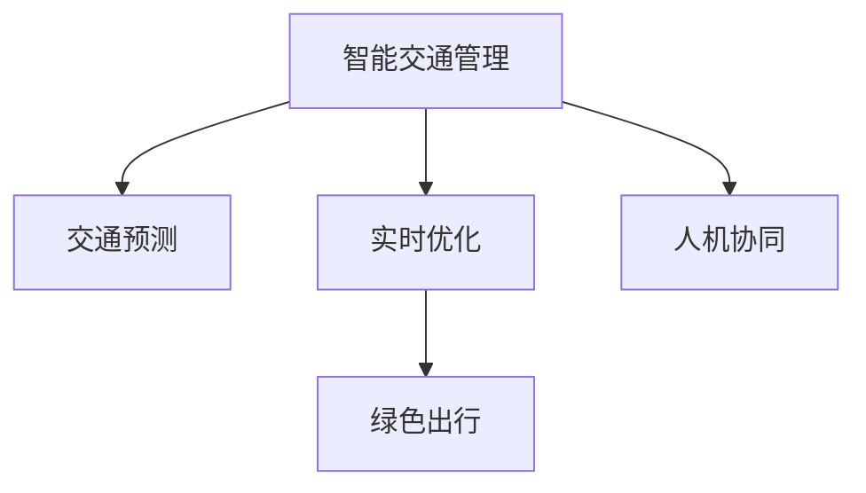

                 

# AI与人类计算：打造可持续发展的城市交通管理系统与规划

> 关键词：智能交通管理,城市规划,交通预测,实时优化,人工智能,绿色出行

## 1. 背景介绍

### 1.1 问题由来
随着城市化进程的不断加快，交通拥堵问题日益突出，成为制约城市发展的重要瓶颈。传统交通管理方式主要依靠人工经验和固定规则，难以有效应对动态复杂的城市交通需求。智能化和可持续化的交通管理系统，将成为未来交通管理的重要方向。

智能交通管理旨在通过集成先进的信息和通信技术，提升交通流的管理效率，减少环境污染和能源消耗，实现交通系统的可持续发展和城市交通资源的合理配置。AI技术的应用，尤其是基于深度学习的预测和优化方法，为智能交通管理提供了新的可能性。

### 1.2 问题核心关键点
智能交通管理系统的核心在于：
- 实时动态监控：通过部署各种传感器和摄像头，实时采集交通数据，实时监测交通状况。
- 数据融合与处理：将交通数据进行融合和处理，形成准确的城市交通态势图。
- 智能决策与优化：利用AI算法进行交通预测和实时优化，动态调整交通信号灯、路线规划等。
- 融合人机交互：结合人类经验进行人工干预，优化AI决策，提升交通管理系统的智能性。
- 可持续发展：推动绿色出行方式，减少交通拥堵和环境污染，提高能源效率。

这些问题关键点构成了智能交通管理系统的主要框架，并成为未来智能交通发展的重要研究方向。

## 2. 核心概念与联系

### 2.1 核心概念概述

为更好地理解基于AI的智能交通管理系统，本节将介绍几个密切相关的核心概念：

- **智能交通管理**：利用信息通信技术，实时动态监测和优化交通流，提升交通管理效率，实现绿色出行和资源配置优化。
- **交通预测**：利用机器学习和深度学习模型，对交通流量进行预测，以指导实时交通优化。
- **实时优化**：基于实时交通数据，利用AI算法进行动态调整和优化，如实时调整交通信号灯、动态规划路线等。
- **绿色出行**：推动公共交通、共享出行等方式，减少个人车辆使用，降低交通拥堵和环境污染。
- **人机协同**：结合人类经验和AI算法，实现人机协同的智能决策。

这些核心概念之间的逻辑关系可以通过以下Mermaid流程图来展示：



这个流程图展示出智能交通管理的核心概念及其之间的关系：

1. 智能交通管理通过实时动态监控获取交通数据，并将数据融合形成城市交通态势图。
2. 交通预测利用深度学习模型对未来交通流量进行预测。
3. 实时优化基于预测结果和实时交通数据，动态调整交通信号和路线。
4. 绿色出行通过推广公共交通、共享出行等手段，提升交通系统的可持续性。
5. 人机协同结合人类经验和AI算法，实现智能决策，提升系统智能性。

## 3. 核心算法原理 & 具体操作步骤
### 3.1 算法原理概述

基于AI的智能交通管理系统的核心算法原理可以归纳为以下几个方面：

- **交通预测**：利用历史交通数据和外部环境数据（如天气、节假日等），通过深度学习模型（如RNN、LSTM、Transformer等）对交通流量进行预测。
- **实时优化**：通过实时动态监测数据，结合预测结果，利用优化算法（如强化学习、动态规划等）进行交通信号灯调整和路线规划。
- **绿色出行**：通过数据分析和AI模型预测，推荐绿色出行方式，如优化公共交通路线、推广共享出行等。

这些算法共同构成了一个完整的智能交通管理系统，旨在实现实时动态监控、数据融合、智能决策和绿色出行。

### 3.2 算法步骤详解

智能交通管理系统的算法步骤主要包括以下几个方面：

**Step 1: 数据采集与处理**
- 部署各种传感器和摄像头，实时采集交通数据，包括车流量、速度、位置等信息。
- 对采集的数据进行清洗和处理，去除噪声和异常值，形成结构化数据。

**Step 2: 交通态势图构建**
- 将处理后的数据通过数据融合技术（如多源数据融合、卡尔曼滤波等），构建城市交通态势图。
- 态势图包括交通流分布、事故和故障点位置等信息，为后续预测和优化提供基础。

**Step 3: 交通预测**
- 利用深度学习模型（如LSTM、Transformer等）对历史和实时数据进行训练，预测未来交通流量。
- 根据预测结果生成交通流量热力图，指导实时交通优化。

**Step 4: 实时优化**
- 根据实时交通数据和预测结果，利用优化算法（如强化学习、动态规划等），动态调整交通信号灯和路线规划。
- 采用分布式计算框架（如Spark、Flink等）进行并行计算，提高优化效率。

**Step 5: 绿色出行推荐**
- 通过数据分析和AI模型预测，推荐绿色出行方式，如公共交通、共享单车等。
- 结合用户偏好和实时交通数据，动态调整推荐方案。

**Step 6: 系统集成与评估**
- 将上述各模块集成到统一的平台，进行实时监控和优化。
- 设置评估指标（如交通拥堵程度、能源效率等），评估系统性能，不断优化系统。

以上是智能交通管理系统的一般步骤，实际操作中还需针对具体场景进行优化设计，如改进数据采集和处理技术、优化预测模型、增强算法鲁棒性等。

### 3.3 算法优缺点

基于AI的智能交通管理系统具有以下优点：
1. 实时动态：通过实时数据监测和处理，实时调整交通流，提高交通效率。
2. 数据驱动：以数据为基础进行决策，避免了传统交通管理中的人为偏见和主观性。
3. 资源优化：通过智能优化算法，实现资源配置优化，减少能源消耗和环境污染。
4. 可扩展性：基于模块化的系统设计，可扩展性和灵活性较强。
5. 人机协同：结合人类经验和AI算法，提升决策的智能性和可行性。

同时，该系统也存在一些局限性：
1. 数据质量：系统依赖高精度的数据，数据采集和处理的误差可能影响系统性能。
2. 算法复杂度：深度学习和优化算法的复杂度较高，计算成本较大。
3. 技术门槛：需要跨领域专业知识，技术实现和维护难度较大。
4. 隐私安全：系统涉及大量个人隐私数据，需加强数据保护和隐私保护。
5. 法规制约：需符合相关法律法规，避免过度干预交通管理。

尽管存在这些局限性，但就目前而言，基于AI的智能交通管理系统仍是大规模城市交通管理的重要方向。未来相关研究的重点在于如何进一步降低系统对数据的依赖，提高算法的计算效率，同时兼顾数据隐私和安全问题，确保系统的可持续性和可靠性。

### 3.4 算法应用领域

基于AI的智能交通管理系统已经在多个领域得到了广泛的应用，例如：

- **城市交通流量优化**：通过实时动态监控和优化，缓解城市交通拥堵，提升交通效率。
- **公共交通优化**：利用AI模型优化公交线路、班次和站点，提升公共交通服务质量。
- **共享出行推荐**：推荐共享单车、电动汽车等出行方式，减少个人车辆使用，提升绿色出行比例。
- **应急管理**：在突发事件如交通事故、自然灾害等情况下，动态调整交通流，保障城市安全。
- **环境监测**：通过数据分析和AI模型，监测环境污染和能源消耗，推动绿色交通发展。

除了上述这些经典应用外，基于AI的智能交通管理系统还被创新性地应用到更多场景中，如智慧停车、智能物流等，为城市交通的智能化和绿色化提供了新的解决方案。

## 4. 数学模型和公式 & 详细讲解  
### 4.1 数学模型构建

本节将使用数学语言对基于AI的智能交通管理系统进行更加严格的刻画。

记交通流量的预测模型为 $F(t|D_{\text{hist}})$，其中 $D_{\text{hist}}$ 为历史交通数据。模型的目标是最小化预测误差 $\epsilon$，即：

$$
\min_{F} \sum_{t} \epsilon(F(t|D_{\text{hist}}),y(t))
$$

其中 $y(t)$ 为实际观测到的交通流量。

### 4.2 公式推导过程

以LSTM模型为例，推导交通流量预测的数学模型。

假设 $x(t)$ 为历史交通数据，$F(t)$ 为LSTM模型在时间 $t$ 的输出。则LSTM模型的预测公式为：

$$
F(t) = LSTM(x(t),W_h) + b_h
$$

其中 $W_h$ 为模型参数，$b_h$ 为偏置向量。假设 $F(t)$ 与 $y(t)$ 的误差为 $\epsilon(t)$，则预测误差公式为：

$$
\epsilon(t) = y(t) - F(t)
$$

则预测模型的目标函数为：

$$
\min_{F} \sum_{t} \epsilon(t)^2
$$

通过对LSTM模型的训练，最小化预测误差，即可得到准确的交通流量预测模型。

## 5. 项目实践：代码实例和详细解释说明
### 5.1 开发环境搭建

在进行智能交通管理系统的开发前，我们需要准备好开发环境。以下是使用Python进行TensorFlow开发的环境配置流程：

1. 安装Anaconda：从官网下载并安装Anaconda，用于创建独立的Python环境。

2. 创建并激活虚拟环境：
```bash
conda create -n tf-env python=3.8 
conda activate tf-env
```

3. 安装TensorFlow：根据CUDA版本，从官网获取对应的安装命令。例如：
```bash
conda install tensorflow==2.6
```

4. 安装相关工具包：
```bash
pip install numpy pandas scikit-learn tensorflow==2.6 matplotlib tqdm jupyter notebook ipython
```

完成上述步骤后，即可在`tf-env`环境中开始智能交通管理系统的开发。

### 5.2 源代码详细实现

下面以智能交通管理系统中的交通预测模块为例，给出使用TensorFlow进行LSTM模型预测的代码实现。

首先，定义LSTM模型类：

```python
import tensorflow as tf
from tensorflow.keras.layers import LSTM, Dense

class TrafficPredictionModel(tf.keras.Model):
    def __init__(self, input_size, output_size):
        super(TrafficPredictionModel, self).__init__()
        self.lstm = LSTM(128, return_sequences=True, input_shape=(input_size, 1))
        self.dense1 = Dense(64, activation='relu')
        self.dense2 = Dense(output_size, activation='sigmoid')
    
    def call(self, inputs):
        x = self.lstm(inputs)
        x = self.dense1(x)
        x = self.dense2(x)
        return x
```

然后，定义模型训练和评估函数：

```python
from tensorflow.keras.optimizers import Adam
from tensorflow.keras.losses import MeanSquaredError
from tensorflow.keras.metrics import MeanAbsoluteError
import numpy as np

def train_model(model, train_data, epochs=10, batch_size=32):
    optimizer = Adam(lr=0.001)
    loss_fn = MeanSquaredError()
    mae = MeanAbsoluteError()
    
    for epoch in range(epochs):
        for i in range(0, len(train_data), batch_size):
            x_train, y_train = train_data[i:i+batch_size]
            with tf.GradientTape() as tape:
                y_pred = model(x_train)
                loss = loss_fn(y_pred, y_train)
            grads = tape.gradient(loss, model.trainable_variables)
            optimizer.apply_gradients(zip(grads, model.trainable_variables))
            mae.update_state(y_train, y_pred)
        
        print(f"Epoch {epoch+1}, Loss: {loss.numpy()}, MAE: {mae.result().numpy()}")
    
    return model

def evaluate_model(model, test_data):
    test_loss = model.test_loss(test_data)
    test_mae = model.test_mae(test_data)
    print(f"Test Loss: {test_loss.numpy()}, Test MAE: {test_mae.numpy()}")
```

接着，加载数据并训练模型：

```python
import numpy as np

# 示例数据生成
np.random.seed(42)
x_train = np.random.rand(100, 5)
y_train = np.random.rand(100, 1)
x_test = np.random.rand(10, 5)
y_test = np.random.rand(10, 1)

# 模型实例化
model = TrafficPredictionModel(input_size=5, output_size=1)

# 训练模型
model = train_model(model, (x_train, y_train))

# 模型评估
evaluate_model(model, (x_test, y_test))
```

以上就是使用TensorFlow对LSTM模型进行交通预测的完整代码实现。可以看到，TensorFlow的高级API使得模型构建和训练过程变得非常简洁高效。

### 5.3 代码解读与分析

让我们再详细解读一下关键代码的实现细节：

**TrafficPredictionModel类**：
- `__init__`方法：初始化LSTM模型的参数。
- `call`方法：定义模型前向传播过程，先通过LSTM层，再通过两个全连接层输出预测结果。

**train_model函数**：
- 定义优化器和损失函数。
- 遍历训练集数据，使用梯度下降法训练模型，并记录损失和MAE指标。

**evaluate_model函数**：
- 在测试集上评估模型性能，输出模型损失和MAE指标。

**数据生成**：
- 使用NumPy生成随机数据，模拟历史和预测交通流量。

通过以上代码，我们可以快速构建和训练一个基于LSTM的智能交通预测模型。

## 6. 实际应用场景
### 6.1 智能交通流量优化

智能交通流量优化是智能交通管理系统的核心应用之一。传统的交通流量优化依赖于人工经验和固定规则，难以应对实时变化的交通需求。基于AI的智能交通管理系统可以通过实时监测和预测，动态调整交通信号灯，优化交通流，缓解城市交通拥堵。

具体而言，系统通过部署传感器和摄像头，实时采集车流量、速度等数据，并通过数据融合技术构建交通态势图。基于LSTM等深度学习模型，对历史和实时数据进行训练，预测未来交通流量。根据预测结果，结合实时交通数据，动态调整交通信号灯，优化交通流，缓解拥堵。

### 6.2 公共交通优化

公共交通是城市交通的重要组成部分，其服务质量和效率直接关系到市民出行体验。智能交通管理系统可以通过AI技术优化公共交通线路、班次和站点，提升公共交通服务质量。

具体而言，系统利用交通流量预测模型，预测不同时间段的公交需求，优化公交线路和班次安排。通过实时监控和数据分析，推荐最佳公交站点和线路，提升公共交通运行效率。

### 6.3 共享出行推荐

共享出行如共享单车、电动汽车等，是绿色出行的重要方式。智能交通管理系统可以通过AI技术推荐共享出行方式，减少个人车辆使用，提升绿色出行比例。

具体而言，系统结合历史出行数据和实时交通流量，预测不同出行方式的时效性和成本，推荐最佳出行方案。通过智能推荐和推荐结果的动态调整，提升共享出行的便利性和吸引力。

### 6.4 应急管理

在突发事件如交通事故、自然灾害等情况下，智能交通管理系统可以动态调整交通流，保障城市安全。

具体而言，系统通过实时监控和数据分析，识别出紧急情况，动态调整交通信号灯和路线规划，优化交通流，保障救援车辆和人员迅速到达现场，降低事故影响和灾害损失。

### 6.5 环境监测

智能交通管理系统还可以通过数据分析和AI模型，监测环境污染和能源消耗，推动绿色交通发展。

具体而言，系统利用交通流量预测模型，结合气象数据和环保数据，预测未来环境污染和能源消耗趋势。通过实时监测和数据融合，识别出环境污染热点，采取相应措施，减少环境污染和能源消耗。

## 7. 工具和资源推荐
### 7.1 学习资源推荐

为了帮助开发者系统掌握智能交通管理系统的理论基础和实践技巧，这里推荐一些优质的学习资源：

1. **《智能交通系统原理与技术》**：系统介绍了智能交通系统的基本原理、技术和应用，适合初学者入门。
2. **《深度学习在交通领域的应用》**：介绍了深度学习在交通流量预测、路径规划等方面的应用，适合深入学习。
3. **Kaggle智能交通比赛**：参与Kaggle智能交通比赛，实战练习智能交通管理系统的开发和优化。
4. **交通预测与优化课程**：斯坦福大学提供的交通预测与优化课程，深入讲解交通预测和优化算法，适合进一步提高技术水平。

通过对这些资源的学习实践，相信你一定能够快速掌握智能交通管理系统的精髓，并用于解决实际的交通问题。

### 7.2 开发工具推荐

高效的开发离不开优秀的工具支持。以下是几款用于智能交通管理系统开发的常用工具：

1. **TensorFlow**：开源深度学习框架，支持分布式计算和GPU加速，适合大规模模型训练。
2. **TensorBoard**：TensorFlow配套的可视化工具，可实时监测模型训练状态，可视化模型结构和参数变化。
3. **Jupyter Notebook**：开源的交互式笔记本环境，支持Python代码运行和数据可视化，适合数据驱动的模型开发。
4. **PyCharm**：专业的Python开发工具，支持Python、TensorFlow等，提供丰富的开发和调试功能。
5. **GitHub**：全球最大的开源社区，可分享代码、协作开发，适合团队项目管理和版本控制。

合理利用这些工具，可以显著提升智能交通管理系统的开发效率，加快创新迭代的步伐。

### 7.3 相关论文推荐

智能交通管理系统的发展源于学界的持续研究。以下是几篇奠基性的相关论文，推荐阅读：

1. **《深度学习在交通流量预测中的应用》**：探讨了深度学习在交通流量预测中的各种模型和算法，为智能交通管理系统的开发提供了理论基础。
2. **《基于强化学习的交通信号优化》**：提出了基于强化学习的交通信号优化算法，通过动态调整信号灯，提升交通效率。
3. **《智能交通系统的数据融合技术》**：介绍了多源数据融合技术在智能交通管理系统中的应用，为数据融合提供了解决方案。
4. **《智能交通管理系统的可持续发展》**：讨论了智能交通管理系统在绿色出行、环境监测等方面的应用，提出了智能交通系统的可持续发展路径。

这些论文代表了大规模智能交通管理系统的研究脉络。通过学习这些前沿成果，可以帮助研究者把握学科前进方向，激发更多的创新灵感。

## 8. 总结：未来发展趋势与挑战

### 8.1 总结

本文对基于AI的智能交通管理系统进行了全面系统的介绍。首先阐述了智能交通管理系统和AI技术在交通管理中的重要意义，明确了交通预测、实时优化和绿色出行等核心组件的实际应用价值。其次，从原理到实践，详细讲解了智能交通管理系统的数学模型和算法步骤，给出了系统开发的具体代码实例。同时，本文还探讨了智能交通管理系统在多个领域的应用前景，展示了AI技术在交通管理中的巨大潜力。

通过本文的系统梳理，可以看到，基于AI的智能交通管理系统正在成为城市交通管理的重要方向，极大地提升交通管理的智能化水平，推动绿色出行和资源优化，为交通系统的可持续性发展提供新的解决方案。

### 8.2 未来发展趋势

展望未来，智能交通管理系统将呈现以下几个发展趋势：

1. **多模态融合**：未来系统将融合视觉、听觉等多模态数据，提升对交通态势的感知能力。
2. **深度学习增强**：利用深度学习技术进一步提升交通预测和优化的精度和效率。
3. **边缘计算优化**：在边缘设备上进行实时计算，提升系统响应速度和处理能力。
4. **联邦学习应用**：利用联邦学习技术，在保护隐私的前提下，提升系统数据的利用效率。
5. **车联网结合**：结合车联网技术，实现车路协同，提升交通管理系统的智能性。

以上趋势凸显了智能交通管理系统的发展方向，这些方向的探索发展，必将进一步提升交通管理系统的性能和智能化水平，为城市交通的智能化和绿色化提供新的解决方案。

### 8.3 面临的挑战

尽管智能交通管理系统已经取得了显著进展，但在迈向更加智能化、普适化应用的过程中，仍面临诸多挑战：

1. **数据质量问题**：系统依赖高精度的数据，数据采集和处理的误差可能影响系统性能。
2. **算法复杂度**：深度学习和优化算法的复杂度较高，计算成本较大，难以在大规模数据上实时运行。
3. **技术门槛高**：需要跨领域专业知识，技术实现和维护难度较大，需要多方协同。
4. **隐私安全问题**：系统涉及大量个人隐私数据，需加强数据保护和隐私保护，防止数据滥用。
5. **法规制约**：需符合相关法律法规，避免过度干预交通管理，确保数据隐私和安全。

尽管存在这些挑战，但就目前而言，基于AI的智能交通管理系统仍是大规模城市交通管理的重要方向。未来相关研究的重点在于如何进一步降低系统对数据的依赖，提高算法的计算效率，同时兼顾数据隐私和安全问题，确保系统的可持续性和可靠性。

### 8.4 研究展望

未来，智能交通管理系统需要在以下几个方面寻求新的突破：

1. **提高数据采集精度**：开发高精度传感器和摄像头，提升数据采集质量，为系统提供可靠的输入数据。
2. **优化算法性能**：探索高效深度学习和优化算法，提高系统性能，降低计算成本。
3. **增强系统鲁棒性**：引入抗干扰和鲁棒性优化技术，提高系统在不同环境下的稳定性和可靠性。
4. **加强隐私保护**：采用隐私保护和数据匿名化技术，确保数据隐私安全，防止数据滥用。
5. **推动法规建设**：制定相关法律法规，规范系统应用，保护市民权益。

这些研究方向的探索，必将引领智能交通管理系统迈向更高的台阶，为交通系统的可持续性和智能化提供新的解决方案。

## 9. 附录：常见问题与解答

**Q1: 智能交通管理系统如何提高数据采集精度？**

A: 提高数据采集精度是智能交通管理系统的重要基础。以下是一些常用的方法：
1. **高精度传感器**：采用高精度GPS、LiDAR、雷达等传感器，提升车辆和行人定位的准确性。
2. **多源数据融合**：结合摄像头、雷达、GPS等多种数据源，通过数据融合技术提高数据的综合性和准确性。
3. **实时数据处理**：引入实时数据处理技术，如卡尔曼滤波、粒子滤波等，对数据进行实时校正和优化。
4. **环境感知技术**：引入环境感知技术，如摄像头图像处理、语音识别等，提升数据的多样性和准确性。

通过这些方法，可以显著提升智能交通管理系统的数据采集精度，为后续的交通预测和优化提供可靠的输入数据。

**Q2: 智能交通管理系统如何优化算法性能？**

A: 优化算法性能是智能交通管理系统的核心。以下是一些常用的方法：
1. **深度学习优化**：引入深度学习技术，如卷积神经网络、LSTM等，提高交通预测和优化的精度和效率。
2. **算法并行化**：采用分布式计算框架，如Spark、Flink等，提高算法的并行计算能力。
3. **模型压缩与加速**：通过模型裁剪、量化等技术，优化模型结构和参数，提升计算效率。
4. **优化器改进**：采用高效的优化器，如AdamW、Adafactor等，提高算法的收敛速度和性能。
5. **特征工程**：引入特征工程技术，如特征选择、特征变换等，提升数据特征的质量，提高算法性能。

通过这些方法，可以显著优化智能交通管理系统的算法性能，提升系统的实时响应能力和决策质量。

**Q3: 智能交通管理系统如何增强系统鲁棒性？**

A: 增强系统鲁棒性是智能交通管理系统的关键。以下是一些常用的方法：
1. **数据清洗与预处理**：对数据进行清洗和预处理，去除噪声和异常值，提高数据的质量和可靠性。
2. **模型鲁棒性训练**：在模型训练中引入鲁棒性优化技术，如对抗训练、噪声注入等，提高模型的抗干扰能力。
3. **多模态数据融合**：引入多模态数据融合技术，提高系统对复杂交通环境的适应能力。
4. **异常检测与处理**：引入异常检测技术，及时发现和处理系统异常情况，提高系统的稳定性和可靠性。
5. **系统冗余设计**：设计系统冗余机制，通过多路备份和数据冗余，确保系统在高负载下的稳定运行。

通过这些方法，可以显著增强智能交通管理系统的鲁棒性，提升系统在复杂交通环境下的稳定性和可靠性。

**Q4: 智能交通管理系统如何加强隐私保护？**

A: 加强隐私保护是智能交通管理系统的重要要求。以下是一些常用的方法：
1. **数据匿名化**：对个人隐私数据进行匿名化处理，防止数据泄露。
2. **访问控制**：设置严格的访问控制机制，确保只有授权用户才能访问敏感数据。
3. **加密传输**：对数据进行加密传输，防止数据在传输过程中被窃取或篡改。
4. **区块链技术**：引入区块链技术，确保数据交易的透明性和安全性，防止数据滥用。
5. **隐私保护算法**：引入隐私保护算法，如差分隐私、联邦学习等，保护数据隐私和安全。

通过这些方法，可以显著加强智能交通管理系统的隐私保护，确保数据安全和用户隐私。

**Q5: 智能交通管理系统如何推动法规建设？**

A: 推动法规建设是智能交通管理系统的重要保障。以下是一些常用的方法：
1. **法规制定**：制定相关法律法规，规范智能交通管理系统的开发和应用。
2. **标准制定**：制定相关技术标准，确保系统的数据格式、接口等规范化。
3. **安全评估**：对智能交通管理系统进行安全评估，确保系统符合法律法规和安全标准。
4. **公众参与**：通过公众咨询和参与，了解市民需求和反馈，制定符合公众利益的法规。
5. **透明化管理**：实现系统的透明化管理，确保数据的公开透明，增强公众信任。

通过这些方法，可以推动智能交通管理系统的法规建设，规范系统的开发和应用，保护市民权益。

---

作者：禅与计算机程序设计艺术 / Zen and the Art of Computer Programming

