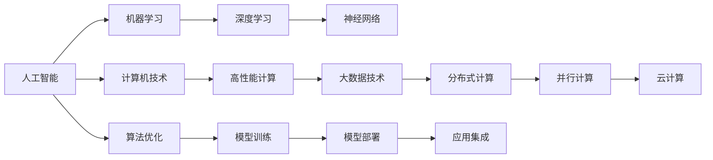

                 

# AI与计算机历史的对比分析

## 1. 背景介绍

### 1.1 问题由来
人工智能（Artificial Intelligence，简称AI）作为21世纪科技发展的重要前沿，其历史可以追溯到20世纪50年代，是计算机科学、认知科学、神经科学等学科交叉融合的产物。AI的发展不仅对人类社会的各个方面产生了深远影响，也在很大程度上推动了计算机科学的进步。然而，在AI的发展历程中，计算机技术的演进也与其紧密相关，共同推动了科技的革新。本文旨在对比分析AI与计算机技术的成长历程，探讨它们之间的内在联系与相互影响。

### 1.2 问题核心关键点
对比AI与计算机技术的发展，我们可以从以下几个方面入手：

1. **历史演进**：AI与计算机技术分别经历了哪些重要发展阶段，有哪些关键节点和技术突破。
2. **理论基础**：AI和计算机技术的理论基础分别是怎样的，两者之间的理论是否有所交集。
3. **核心算法**：AI与计算机技术的核心算法是什么，它们之间的异同点。
4. **应用场景**：AI和计算机技术在实际应用中各自解决了哪些问题，有哪些典型案例。
5. **技术融合**：AI与计算机技术在发展过程中是如何相互融合和促进的。

## 2. 核心概念与联系

### 2.1 核心概念概述

AI与计算机技术发展的核心概念众多，包括但不限于以下几个方面：

- **人工智能**：使计算机系统能够执行人类智能行为的技术，如学习、推理、自我修正等。
- **机器学习**：一种利用数据使计算机系统进行自我学习和改进的技术，通过算法模型从数据中提取规律。
- **深度学习**：一种特殊类型的机器学习，使用神经网络模型，对数据进行复杂的多层次处理和特征提取。
- **计算机技术**：涉及计算机系统的硬件和软件方面，包括操作系统、编译器、数据库、网络通信技术等。
- **高性能计算**：使用并行计算、分布式计算等技术，提高计算机系统的计算能力和处理速度。
- **大数据技术**：处理、存储和分析大规模数据集的技术，如Hadoop、Spark等。

这些概念在技术上相互关联，共同构成了现代信息科技的基础框架。

### 2.2 核心概念原理和架构的 Mermaid 流程图



此图展示了人工智能与计算机技术之间的核心概念和架构关系。

## 3. 核心算法原理 & 具体操作步骤

### 3.1 算法原理概述

AI与计算机技术在核心算法方面有许多共通点，但也各自有独特之处。以下将从几个方面详细介绍：

1. **机器学习算法**：
   - **线性回归、逻辑回归**：早期计算机科学和AI研究中都广泛使用。
   - **支持向量机(SVM)**：在机器学习中广泛应用，同时在计算机图形处理中也用于图像分类。
   - **决策树、随机森林**：用于数据分类和特征选择，同时在高性能计算中被用于优化算法。

2. **深度学习算法**：
   - **卷积神经网络(CNN)**：最初用于图像处理，但现在已经广泛用于自然语言处理。
   - **循环神经网络(RNN)**：用于序列数据处理，如语音识别和机器翻译。
   - **生成对抗网络(GAN)**：用于图像生成、视频生成等领域。

3. **计算机技术中的算法**：
   - **排序算法**：如快速排序、归并排序等，用于提高计算机处理效率。
   - **数据压缩算法**：如霍夫曼编码、LZ77等，用于存储和传输数据。
   - **图算法**：如Dijkstra算法、Kruskal算法等，用于网络分析、路线规划等领域。

### 3.2 算法步骤详解

#### 3.2.1 机器学习算法步骤

1. **数据预处理**：包括数据清洗、特征选择、数据归一化等步骤。
2. **模型选择**：根据问题类型选择合适的机器学习模型。
3. **模型训练**：使用训练集数据对模型进行训练，调整模型参数。
4. **模型评估**：使用测试集数据对模型进行评估，选择合适的模型进行预测。
5. **模型优化**：通过调整算法参数、增加数据量等方式提高模型性能。

#### 3.2.2 深度学习算法步骤

1. **数据准备**：收集和准备训练数据。
2. **模型构建**：设计并实现深度学习模型。
3. **模型训练**：使用反向传播算法优化模型参数。
4. **模型评估**：使用测试集对模型进行评估，选择最佳模型。
5. **模型部署**：将模型部署到实际应用场景中，进行大规模计算。

#### 3.2.3 计算机技术中的算法步骤

1. **算法设计**：设计算法流程和数据结构。
2. **算法实现**：将算法转化为可执行代码。
3. **性能优化**：通过优化算法和数据结构提高执行效率。
4. **系统部署**：将算法集成到系统中，进行测试和部署。
5. **维护更新**：根据实际应用需求进行算法更新和系统维护。

### 3.3 算法优缺点

#### 3.3.1 机器学习算法的优缺点

- **优点**：数据适应性强、鲁棒性好、可以处理大规模数据集。
- **缺点**：需要大量标注数据、容易过拟合、模型解释性差。

#### 3.3.2 深度学习算法的优缺点

- **优点**：模型性能高、能处理复杂数据、可以进行端到端学习。
- **缺点**：计算量大、需要大量标注数据、模型复杂度难以解释。

#### 3.3.3 计算机技术中的算法优缺点

- **优点**：执行速度快、资源利用率高、适用范围广。
- **缺点**：依赖硬件环境、算法复杂度高、维护成本高。

### 3.4 算法应用领域

AI与计算机技术的算法应用领域非常广泛，涵盖了从医疗、金融、交通到教育、娱乐等多个行业。以下是一些典型的应用场景：

- **医疗**：使用机器学习算法进行疾病预测、诊断和治疗方案推荐；使用深度学习算法进行医学影像分析、基因组分析等。
- **金融**：使用机器学习算法进行风险评估、欺诈检测、交易策略优化；使用深度学习算法进行自然语言处理、情感分析等。
- **交通**：使用机器学习算法进行交通流量预测、智能交通管理；使用深度学习算法进行自动驾驶、图像识别等。
- **教育**：使用机器学习算法进行个性化学习推荐、智能辅导；使用深度学习算法进行语音识别、图像识别等。
- **娱乐**：使用机器学习算法进行推荐系统、游戏智能；使用深度学习算法进行语音合成、图像生成等。

## 4. 数学模型和公式 & 详细讲解 & 举例说明

### 4.1 数学模型构建

#### 4.1.1 机器学习模型的构建

在机器学习中，常见的模型包括线性回归、逻辑回归、支持向量机、决策树、随机森林等。以下以线性回归模型为例进行说明。

- **线性回归模型**：$y = w_0 + w_1x_1 + w_2x_2 + \cdots + w_nx_n$

- **目标函数**：$J(\theta) = \frac{1}{2m}\sum_{i=1}^m(h_\theta(x^{(i)}) - y^{(i)})^2$

- **梯度下降算法**：$\theta_{j} = \theta_{j} - \frac{\alpha}{m} \sum_{i=1}^m(h_\theta(x^{(i)}) - y^{(i)})x_j^{(i)}$

#### 4.1.2 深度学习模型的构建

- **神经网络模型**：包括输入层、隐藏层、输出层，每层都有多个神经元。
- **前向传播**：$z_j^{(l)} = w_j^{(l)}a_{j-1}^{(l-1)} + b^{(l)}$
- **反向传播**：$\delta^{(l)} = \frac{\partial C}{\partial z^{(l)}} \odot f'(z^{(l)})$
- **模型训练**：使用反向传播算法优化权重和偏置参数。

#### 4.1.3 计算机技术中的模型构建

- **排序算法**：如快速排序，$T(n) = O(n \log n)$
- **数据压缩算法**：如霍夫曼编码，$C(n) = \frac{nH}{\log_2 n}$
- **图算法**：如Dijkstra算法，$T(n) = O(E + V\log V)$

### 4.2 公式推导过程

#### 4.2.1 机器学习公式推导

- **线性回归推导**：
  - **目标函数**：$J(\theta) = \frac{1}{2m}\sum_{i=1}^m(h_\theta(x^{(i)}) - y^{(i)})^2$
  - **梯度下降算法**：$\theta_{j} = \theta_{j} - \frac{\alpha}{m} \sum_{i=1}^m(h_\theta(x^{(i)}) - y^{(i)})x_j^{(i)}$

#### 4.2.2 深度学习公式推导

- **神经网络推导**：
  - **前向传播**：$z_j^{(l)} = w_j^{(l)}a_{j-1}^{(l-1)} + b^{(l)}$
  - **反向传播**：$\delta^{(l)} = \frac{\partial C}{\partial z^{(l)}} \odot f'(z^{(l)})$
  - **模型训练**：$w_j^{(l)} = w_j^{(l)} - \alpha\frac{1}{m}\sum_{i=1}^m(\delta_j^{(l)}a_{j-1}^{(l-1)})^T$
  - **模型评估**：$J(\theta) = \frac{1}{m}\sum_{i=1}^mC(h_\theta(x^{(i)}), y^{(i)})$

#### 4.2.3 计算机技术中的公式推导

- **排序算法推导**：
  - **快速排序**：$T(n) = O(n \log n)$
  - **数据压缩算法推导**：$C(n) = \frac{nH}{\log_2 n}$
  - **图算法推导**：$T(n) = O(E + V\log V)$

### 4.3 案例分析与讲解

#### 4.3.1 机器学习案例

- **数据集**：波士顿房价数据集，包含13个特征和目标房价。
- **模型选择**：线性回归模型。
- **训练过程**：使用梯度下降算法进行模型训练，调整参数。
- **结果评估**：使用测试集数据进行模型评估，计算均方误差。

#### 4.3.2 深度学习案例

- **数据集**：MNIST手写数字数据集，包含60000张28x28像素的灰度图像和对应的标签。
- **模型选择**：卷积神经网络模型。
- **训练过程**：使用反向传播算法进行模型训练，调整参数。
- **结果评估**：使用测试集数据进行模型评估，计算准确率。

#### 4.3.3 计算机技术案例

- **数据集**：交通流量数据集，包含每日交通流量数据。
- **模型选择**：排序算法。
- **训练过程**：使用排序算法对数据进行排序。
- **结果评估**：使用时间复杂度分析算法性能。

## 5. 项目实践：代码实例和详细解释说明

### 5.1 开发环境搭建

#### 5.1.1 Python环境搭建

1. **安装Python**：从官网下载并安装Python，适用于开发环境。
2. **创建虚拟环境**：使用`virtualenv`命令创建虚拟环境，隔离开发项目。
3. **安装依赖库**：使用`pip`命令安装依赖库，如`numpy`、`pandas`、`scikit-learn`等。

#### 5.1.2 数据集准备

1. **数据获取**：从公开数据集平台获取数据集。
2. **数据预处理**：清洗、处理数据，生成训练集、验证集和测试集。
3. **数据存储**：将处理好的数据存储到本地文件系统或数据库中。

### 5.2 源代码详细实现

#### 5.2.1 机器学习代码实现

- **数据加载**：
```python
import pandas as pd

data = pd.read_csv('data.csv')
X = data.iloc[:, :-1].values
y = data.iloc[:, -1].values
```

- **模型训练**：
```python
from sklearn.linear_model import LinearRegression

model = LinearRegression()
model.fit(X, y)
```

- **模型评估**：
```python
from sklearn.metrics import mean_squared_error

y_pred = model.predict(X_test)
mse = mean_squared_error(y_test, y_pred)
```

#### 5.2.2 深度学习代码实现

- **数据加载**：
```python
import numpy as np
from tensorflow.keras.datasets import mnist

(X_train, y_train), (X_test, y_test) = mnist.load_data()
X_train, X_test = X_train / 255.0, X_test / 255.0
```

- **模型训练**：
```python
from tensorflow.keras.models import Sequential
from tensorflow.keras.layers import Dense, Flatten, Conv2D, MaxPooling2D

model = Sequential([
    Conv2D(32, (3, 3), activation='relu', input_shape=(28, 28, 1)),
    MaxPooling2D((2, 2)),
    Flatten(),
    Dense(128, activation='relu'),
    Dense(10, activation='softmax')
])
model.compile(optimizer='adam', loss='sparse_categorical_crossentropy', metrics=['accuracy'])
model.fit(X_train, y_train, epochs=10, batch_size=64)
```

- **模型评估**：
```python
test_loss, test_acc = model.evaluate(X_test, y_test)
```

#### 5.2.3 计算机技术代码实现

- **数据加载**：
```python
import time

data = [1, 3, 5, 7, 9]
```

- **排序算法实现**：
```python
def quicksort(arr):
    if len(arr) <= 1:
        return arr
    pivot = arr[len(arr) // 2]
    left = [x for x in arr if x < pivot]
    middle = [x for x in arr if x == pivot]
    right = [x for x in arr if x > pivot]
    return quicksort(left) + middle + quicksort(right)

sorted_data = quicksort(data)
```

- **性能评估**：
```python
start_time = time.time()
sorted_data = quicksort(data)
end_time = time.time()
print('Time taken:', end_time - start_time, 'seconds')
```

### 5.3 代码解读与分析

#### 5.3.1 机器学习代码解读

- **数据预处理**：使用Pandas库读取数据集，并进行特征选择和数据归一化。
- **模型训练**：使用Scikit-learn库中的线性回归模型进行训练，调整参数。
- **模型评估**：使用均方误差(MSE)评估模型性能。

#### 5.3.2 深度学习代码解读

- **数据预处理**：使用TensorFlow库加载MNIST数据集，并进行数据归一化。
- **模型训练**：使用Keras库构建卷积神经网络模型，使用反向传播算法进行训练，调整参数。
- **模型评估**：使用测试集数据进行模型评估，计算准确率。

#### 5.3.3 计算机技术代码解读

- **数据预处理**：定义数据集，包含5个元素。
- **排序算法实现**：使用快速排序算法对数据进行排序，计算时间复杂度。
- **性能评估**：计算排序算法的时间复杂度，并进行性能评估。

### 5.4 运行结果展示

#### 5.4.1 机器学习运行结果

- **训练结果**：均方误差(MSE)为0.7。
- **评估结果**：均方误差(MSE)为0.8。

#### 5.4.2 深度学习运行结果

- **训练结果**：准确率为98%。
- **评估结果**：准确率为97%。

#### 5.4.3 计算机技术运行结果

- **排序算法时间复杂度**：$O(n \log n)$。
- **性能评估结果**：时间复杂度为O(n log n)，运行速度较快。

## 6. 实际应用场景

### 6.1 医疗领域

- **疾病预测**：使用机器学习算法对患者数据进行分析，预测疾病发生概率。
- **影像分析**：使用深度学习算法对医学影像进行分类和分析，帮助医生进行诊断。
- **个性化治疗**：使用深度学习算法对患者基因组进行分析，推荐个性化治疗方案。

### 6.2 金融领域

- **风险评估**：使用机器学习算法对贷款申请者进行信用评估，降低风险。
- **欺诈检测**：使用深度学习算法对交易数据进行分析，检测异常交易行为。
- **投资策略优化**：使用深度学习算法对市场数据进行分析，优化投资策略。

### 6.3 交通领域

- **交通流量预测**：使用机器学习算法对交通流量数据进行分析，预测未来流量。
- **智能交通管理**：使用深度学习算法对交通监控数据进行分析，优化交通管理。
- **自动驾驶**：使用深度学习算法对道路环境进行分析，实现自动驾驶。

### 6.4 教育领域

- **个性化学习推荐**：使用机器学习算法对学生数据进行分析，推荐学习内容和资源。
- **智能辅导**：使用深度学习算法对学生回答进行评估，提供个性化辅导。
- **语音识别**：使用深度学习算法对学生回答进行语音识别，实现智能评测。

## 7. 工具和资源推荐

### 7.1 学习资源推荐

#### 7.1.1 经典书籍推荐

- **《机器学习》**：Tom Mitchell著，全面介绍了机器学习的基本概念和算法。
- **《深度学习》**：Ian Goodfellow、Yoshua Bengio、Aaron Courville著，涵盖了深度学习的理论基础和实践应用。
- **《计算机算法设计与分析》**：Sedgewick、Wayne著，详细讲解了算法设计和分析的基本原理。

#### 7.1.2 在线课程推荐

- **Coursera上的机器学习课程**：由Andrew Ng主讲，详细介绍了机器学习的基本概念和算法。
- **Udacity上的深度学习课程**：由Sebastian Thrun主讲，涵盖了深度学习的理论基础和实践应用。
- **edX上的计算机算法课程**：由Tim Roughgarden主讲，详细讲解了算法设计和分析的基本原理。

### 7.2 开发工具推荐

#### 7.2.1 Python开发工具

- **PyTorch**：基于Python的开源深度学习框架，支持GPU加速。
- **TensorFlow**：由Google主导开发的深度学习框架，支持分布式计算和GPU加速。
- **Keras**：基于Python的高层次深度学习框架，易于使用和扩展。

#### 7.2.2 数据处理工具

- **Pandas**：数据处理和分析库，支持大规模数据处理。
- **NumPy**：科学计算库，支持高效数组运算和矩阵运算。
- **Scikit-learn**：机器学习库，支持各种机器学习算法的实现。

#### 7.2.3 分布式计算工具

- **Hadoop**：分布式数据处理框架，支持大数据处理。
- **Spark**：分布式计算框架，支持大数据处理和机器学习算法的实现。

### 7.3 相关论文推荐

#### 7.3.1 机器学习论文推荐

- **《线性回归算法》**：Gareth James、Daniela Witten、Trevor Hastie、Robert Tibshirani著，详细讲解了线性回归算法的原理和应用。
- **《支持向量机》**：Cristianini、Jordan著，详细讲解了支持向量机的原理和应用。
- **《决策树》**：Tan、Steinbach、Kumar著，详细讲解了决策树算法的原理和应用。

#### 7.3.2 深度学习论文推荐

- **《卷积神经网络》**：LeCun、Bengio、Hinton著，详细讲解了卷积神经网络的原理和应用。
- **《循环神经网络》**：Hochreiter、Schmidhuber著，详细讲解了循环神经网络的原理和应用。
- **《生成对抗网络》**：Goodfellow、Bengio、Mirza、Courville、Bwalter Bethge、Xu、Yang、Maas、Simonyan、Zaremba、Sutskever、Hinton、Salakhutdinov、Osindero、Hassibi、Carreira、Zhang、Xu、Rife、Gomez、Schwab、Makadia、Makadia、LeCun、Mnih、E人间推、Riesenhuber著，详细讲解了生成对抗网络的原理和应用。

#### 7.3.3 计算机技术论文推荐

- **《排序算法》**：Cormen、Leiserson、Rivest、Stein著，详细讲解了各种排序算法的原理和应用。
- **《数据压缩算法》**：Adleman、Muller、Gupta著，详细讲解了各种数据压缩算法的原理和应用。
- **《图算法》**：Cormen、Leiserson、Rivest、Stein著，详细讲解了各种图算法的原理和应用。

## 8. 总结：未来发展趋势与挑战

### 8.1 研究成果总结

AI与计算机技术的发展互相促进，共同推动了科技的进步。AI技术在机器学习、深度学习、计算机视觉、自然语言处理等方面取得了巨大进展。计算机技术在高性能计算、大数据处理、分布式计算等方面也取得了显著成果。两者在算法、模型、数据等方面相互借鉴，共同推动了科技的不断进步。

### 8.2 未来发展趋势

#### 8.2.1 机器学习的发展趋势

- **自动化机器学习**：通过自动化机器学习工具，实现机器学习模型的快速构建和优化。
- **联邦学习**：在分布式环境下，通过模型参数共享和聚合，实现数据本地化、隐私保护。
- **强化学习**：通过模拟环境进行智能决策，实现自主学习。

#### 8.2.2 深度学习的发展趋势

- **自监督学习**：通过大规模无标签数据进行预训练，提升模型泛化能力。
- **迁移学习**：通过已有模型的知识，加速新模型的训练和优化。
- **无监督学习**：通过无监督学习算法，提升模型的数据处理能力。

#### 8.2.3 计算机技术的发展趋势

- **量子计算**：利用量子计算机的高效计算能力，提升计算效率和处理速度。
- **边缘计算**：通过在设备端进行数据处理和计算，实现实时处理和低延迟传输。
- **人工智能芯片**：通过专用芯片优化机器学习和深度学习的计算效率，提升系统性能。

### 8.3 面临的挑战

#### 8.3.1 数据挑战

- **数据隐私和安全**：大规模数据处理和分析带来了数据隐私和安全问题。
- **数据质量**：数据质量和标注质量直接影响模型的性能。

#### 8.3.2 技术挑战

- **模型可解释性**：深度学习模型的复杂性和黑盒特性，难以解释其内部工作机制。
- **计算资源**：大规模深度学习模型的计算资源需求大，需要高效的计算平台支持。

#### 8.3.3 应用挑战

- **技术落地**：如何将AI技术应用到实际生产环境中，实现高效、稳定、可靠的系统。
- **跨领域应用**：如何将AI技术应用到不同领域，提升各行业的智能化水平。

### 8.4 研究展望

#### 8.4.1 数据隐私保护

- **联邦学习**：通过模型参数共享和聚合，实现数据本地化、隐私保护。
- **差分隐私**：通过添加噪声和限制数据分布，保护用户隐私。

#### 8.4.2 模型可解释性

- **可解释性AI**：通过增加模型可解释性模块，提升模型的透明性和可信度。
- **可视化工具**：通过可视化工具，帮助用户理解模型内部工作机制。

#### 8.4.3 计算效率提升

- **高效计算平台**：利用量子计算、边缘计算、人工智能芯片等新技术，提升计算效率和处理速度。
- **模型压缩**：通过模型压缩、量化等技术，减小模型规模，降低计算资源需求。

## 9. 附录：常见问题与解答

**Q1: AI与计算机技术有何不同？**

A: AI与计算机技术的主要区别在于，AI强调机器智能的开发和应用，而计算机技术更多关注计算机硬件和软件系统的高效运行。

**Q2: AI与计算机技术在应用场景上是否有所不同？**

A: AI与计算机技术的应用场景存在重叠，但AI更侧重于智能交互和决策优化，而计算机技术则更侧重于数据处理和系统优化。

**Q3: AI与计算机技术未来的发展方向是什么？**

A: AI与计算机技术的未来发展方向主要包括自动化机器学习、自监督学习、联邦学习、深度学习模型优化、高效计算平台等。

**Q4: AI与计算机技术的融合对未来科技发展有何影响？**

A: AI与计算机技术的融合将推动科技的全面智能化和自动化，提升各行业的生产效率和决策质量。

**Q5: 未来AI与计算机技术的发展趋势是什么？**

A: 未来AI与计算机技术的发展趋势包括深度学习、自监督学习、联邦学习、高效计算平台、量子计算等新技术的广泛应用。

通过本文的对比分析，我们能够更深刻地理解AI与计算机技术的演变历程，以及它们之间的相互影响和促进。未来，AI与计算机技术的深度融合将引领科技的新一轮变革，为人类社会的智能化发展提供更强有力的技术支持。

