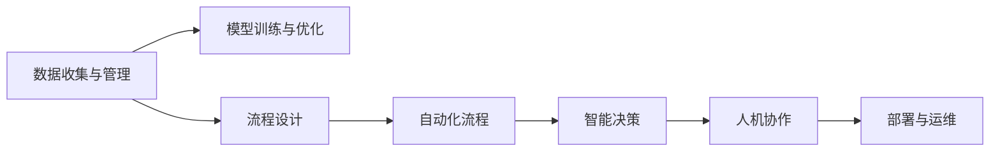

                 

# AI人工智能代理工作流 AI Agent WorkFlow：在行业研究中的应用

> 关键词：AI代理,工作流设计,行业研究,自动化流程,智能决策

## 1. 背景介绍

### 1.1 问题由来
随着人工智能(AI)技术的飞速发展，AI代理(AI Agent)在自动化任务、智能决策等领域的应用越来越广泛。AI代理不仅能够代替人类完成繁琐的重复性工作，还能在复杂、动态的业务环境中提供高效率、高精度的智能决策支持。然而，AI代理的应用往往需要大量高质的行业数据、算法模型和工程实践经验，才能发挥其最大的价值。

### 1.2 问题核心关键点
AI代理工作流设计，即如何构建一个高效、可扩展、稳定且具有智能决策能力的AI代理工作流，成为当前AI应用研究的一个热点问题。

在设计和构建AI代理工作流时，需要考虑以下几个核心关键点：

1. **数据收集与管理**：如何高效地收集和存储数据，保障数据的质量和安全。
2. **模型训练与优化**：如何选择合适的模型和算法，训练和优化AI代理，提高其决策准确性和响应速度。
3. **流程设计**：如何构建合理的业务流程，使得AI代理能够顺畅地处理不同场景下的任务。
4. **人机协作**：如何实现AI代理与人的无缝协作，提升人机协同的效果。
5. **部署与运维**：如何高效部署AI代理，并进行持续的运维和监控。

这些关键点的考虑和解决，直接影响到AI代理工作流的实际效果和应用范围。

### 1.3 问题研究意义
构建高效的AI代理工作流，对于提升AI代理在实际业务场景中的应用效果、降低企业的人工成本、提高业务决策的智能化水平具有重要意义：

1. **提升业务效率**：AI代理能够自动处理大量重复性工作，大幅提高业务处理速度。
2. **降低运营成本**：AI代理减少了对人力的依赖，降低了企业的运营成本。
3. **增强决策智能**：AI代理能够根据数据进行智能决策，提高决策的准确性和科学性。
4. **提升人机协作**：AI代理与人的协同工作，使得员工能够专注于更有价值的创造性工作。
5. **促进产业升级**：AI代理在工作流中的应用，推动传统行业向智能化、自动化转型。

## 2. 核心概念与联系

### 2.1 核心概念概述

在设计和构建AI代理工作流时，涉及多个核心概念。理解这些概念，有助于我们全面掌握AI代理工作流的设计方法。

- **AI代理(AI Agent)**：一种能够自动执行任务、进行智能决策的自主程序。通常具有自主感知、推理、学习和决策能力。
- **工作流设计(Workflow Design)**：构建业务流程的过程，涉及流程定义、任务编排、数据流设计等环节。
- **自动化流程(Automated Workflow)**：通过AI技术自动化执行的一系列任务。
- **智能决策(Smart Decision Making)**：基于数据和模型，自动进行决策的过程。
- **人机协作(Human-Machine Collaboration)**：AI代理与人的协同工作，提升整体工作效率和决策质量。
- **部署与运维(Deployment and Operations)**：将AI代理应用到实际业务场景中，并进行持续监控和管理的过程。

这些核心概念之间的联系可以通过以下Mermaid流程图来展示：



这个流程图展示了从数据到智能决策的全流程，以及各个环节之间的内在联系。

## 3. 核心算法原理 & 具体操作步骤
### 3.1 算法原理概述

AI代理工作流的构建，主要依赖于数据驱动的机器学习算法。其核心思想是通过数据收集、模型训练、流程设计等步骤，构建一个能够自主感知、推理、决策的自动化流程。

具体步骤如下：

1. **数据收集与管理**：收集与任务相关的数据，并进行预处理和清洗。
2. **模型训练与优化**：选择合适的机器学习模型，使用标注数据进行训练和优化，得到预测模型。
3. **流程设计**：将业务任务分解为若干子任务，设计自动化流程，使得AI代理能够按序执行。
4. **自动化流程实现**：使用AI技术实现自动化流程，包括数据输入、模型推理、结果输出等环节。
5. **智能决策**：根据业务需求和数据分析结果，设计智能决策算法，使得AI代理能够自主决策。
6. **人机协作**：设计人机协作机制，使得AI代理能够根据人的指令和反馈进行调整。
7. **部署与运维**：将AI代理应用到实际业务场景中，并进行持续的监控和维护。

### 3.2 算法步骤详解

接下来，我们详细讲解AI代理工作流构建的具体步骤。

#### 3.2.1 数据收集与管理

**数据收集**：
- 确定任务需求，明确需要收集哪些数据。
- 使用API、爬虫、传感器等手段收集数据。

**数据清洗**：
- 对数据进行去重、去噪、归一化等处理，确保数据质量。
- 使用数据清洗工具和脚本，自动化数据清洗过程。

**数据存储**：
- 选择合适的数据存储方式，如关系型数据库、NoSQL数据库、分布式文件系统等。
- 设计高效的数据存储结构，确保数据访问速度和可扩展性。

#### 3.2.2 模型训练与优化

**模型选择**：
- 根据任务需求选择合适的机器学习模型，如分类模型、回归模型、序列模型等。
- 考虑模型的复杂度和可解释性，选择适合的模型。

**数据预处理**：
- 对数据进行特征提取、归一化、缺失值处理等预处理步骤。
- 使用数据增强技术，扩充训练集数据量。

**模型训练**：
- 使用训练集数据对模型进行训练。
- 设置合适的训练参数，如学习率、批次大小、迭代次数等。

**模型优化**：
- 使用验证集数据对模型进行验证，调整模型参数。
- 使用正则化技术、Dropout、早停等方法，避免过拟合。

#### 3.2.3 流程设计

**任务分解**：
- 将任务分解为若干子任务，明确每个子任务的具体要求和输入输出。
- 设计任务之间的依赖关系，确保流程的顺序性和逻辑性。

**流程编排**：
- 使用流程图、伪代码等方式，设计任务之间的数据流和控制流。
- 使用工作流编排工具，如Airflow、Kubernetes等，自动化流程编排。

**数据输入输出**：
- 设计数据输入输出接口，确保数据能够按序流入流出。
- 使用API、消息队列等方式，实现数据交互。

#### 3.2.4 自动化流程实现

**流程实现**：
- 将流程设计转换为实际代码实现。
- 使用Python、Java等编程语言，实现任务处理逻辑。

**部署与调度**：
- 将自动化流程部署到服务器或云平台。
- 使用容器化技术，如Docker、Kubernetes等，实现流程的自动化调度。

**监控与日志**：
- 实现流程监控和日志记录，确保流程运行稳定。
- 使用监控工具，如Prometheus、Grafana等，实时监控流程状态。

#### 3.2.5 智能决策

**决策算法设计**：
- 根据业务需求设计智能决策算法。
- 考虑算法的复杂度和效率，选择合适的算法。

**决策模型训练**：
- 使用标注数据对决策模型进行训练。
- 使用训练集和验证集数据，调整模型参数。

**决策推理与输出**：
- 使用训练好的决策模型，对输入数据进行推理。
- 根据推理结果，生成决策输出。

#### 3.2.6 人机协作

**用户接口设计**：
- 设计用户接口，方便用户与AI代理交互。
- 使用Web界面、API等方式，实现用户交互。

**用户反馈机制**：
- 设计用户反馈机制，收集用户对AI代理的评价和建议。
- 使用机器学习技术，不断优化AI代理性能。

**协同工作机制**：
- 设计AI代理与人的协同工作机制，使得人机能够无缝协作。
- 使用协同框架，如TensorFlow Extended (TFX)等，实现人机协作。

#### 3.2.7 部署与运维

**应用部署**：
- 将AI代理应用部署到生产环境。
- 使用容器化技术，实现快速部署和更新。

**监控与报警**：
- 实现对AI代理的持续监控，确保其运行稳定。
- 设置报警机制，及时发现和处理问题。

**性能优化**：
- 优化AI代理的计算和存储资源，提升性能。
- 使用分布式计算、缓存技术等手段，提升响应速度。

**安全与隐私**：
- 确保AI代理的数据安全和隐私保护。
- 使用加密、权限控制等手段，保障系统安全。

### 3.3 算法优缺点

AI代理工作流的构建，具有以下优点：

1. **高效自动化**：通过自动化流程，大大提高了任务的执行效率。
2. **智能化决策**：基于数据和模型，提高了决策的准确性和智能性。
3. **可扩展性强**：通过模块化设计和自动化流程，可以灵活扩展和调整。
4. **稳定性和可靠性**：通过持续监控和自动化运维，保障了系统的稳定性和可靠性。

同时，AI代理工作流也存在一些缺点：

1. **数据质量依赖高**：AI代理的效果很大程度上取决于数据的质量和量。
2. **模型复杂度高**：构建复杂的AI代理，需要高水平的数据科学家和工程师。
3. **算法选择困难**：不同任务的模型选择和算法优化，需要经验和实践。
4. **系统复杂度高**：系统涉及多层次的技术栈和组件，开发和维护难度大。
5. **人机协作问题**：如何实现高效的人机协作，仍是一个需要不断探索的课题。

### 3.4 算法应用领域

AI代理工作流在多个领域都有广泛的应用。以下是一些典型领域和应用场景：

1. **金融行业**：在金融风控、欺诈检测、量化交易等场景中，AI代理能够快速、准确地处理大量数据，提供智能决策支持。
2. **医疗健康**：在疾病诊断、治疗方案推荐、病历分析等场景中，AI代理能够高效处理和分析医疗数据，提供精准的决策支持。
3. **物流运输**：在货物追踪、路线规划、需求预测等场景中，AI代理能够实时处理和分析大量数据，优化运输效率。
4. **智能制造**：在生产调度、设备维护、质量控制等场景中，AI代理能够实时监控和优化生产过程，提升生产效率和质量。
5. **智能客服**：在客户咨询、问题解决、情感分析等场景中，AI代理能够快速、准确地响应客户需求，提升客户满意度。
6. **电子商务**：在商品推荐、销售预测、价格优化等场景中，AI代理能够实时处理和分析用户数据，提升销售业绩。

## 4. 数学模型和公式 & 详细讲解 & 举例说明

### 4.1 数学模型构建

在AI代理工作流的构建中，涉及到多个数学模型的设计和应用。以下是几个关键模型的构建过程。

#### 4.1.1 数据预处理模型

**特征提取**：
- 使用特征提取技术，将原始数据转换为可供模型使用的特征向量。
- 使用PCA、NLP等方法，提取有意义的特征。

**数据清洗**：
- 使用数据清洗技术，处理缺失值、异常值等问题。
- 设计数据清洗流程，确保数据质量。

**数据增强**：
- 使用数据增强技术，扩充训练集数据量。
- 使用数据旋转、噪声注入等方法，增强数据的多样性。

#### 4.1.2 模型训练模型

**回归模型**：
- 使用线性回归、多项式回归等方法，构建回归模型。
- 使用最小二乘法、梯度下降等方法，优化模型参数。

**分类模型**：
- 使用逻辑回归、支持向量机等方法，构建分类模型。
- 使用交叉熵损失、对数损失等方法，优化模型参数。

**序列模型**：
- 使用RNN、LSTM、GRU等方法，构建序列模型。
- 使用序列到序列、注意力机制等方法，优化模型结构。

#### 4.1.3 决策模型

**决策树**：
- 使用决策树算法，构建决策模型。
- 使用CART、ID3等方法，优化决策树结构。

**支持向量机**：
- 使用支持向量机算法，构建决策模型。
- 使用核函数、正则化等方法，优化模型参数。

**神经网络**：
- 使用神经网络算法，构建决策模型。
- 使用反向传播、正则化等方法，优化模型参数。

#### 4.1.4 人机协同模型

**协同过滤**：
- 使用协同过滤算法，构建用户推荐模型。
- 使用基于用户的协同过滤、基于物品的协同过滤等方法，优化推荐结果。

**强化学习**：
- 使用强化学习算法，构建智能决策模型。
- 使用Q-learning、SARSA等方法，优化决策策略。

### 4.2 公式推导过程

以决策树算法为例，展示其核心公式的推导过程。

假设我们有一组训练样本 $\{(x_i, y_i)\}_{i=1}^N$，其中 $x_i$ 为输入特征向量，$y_i$ 为输出标签。我们的目标是构建一棵决策树 $T$，使得预测结果 $\hat{y}_i$ 与真实标签 $y_i$ 尽可能接近。

决策树构建的目的是将数据划分为多个子集，使得每个子集内的数据具有相似性。具体步骤如下：

1. **计算信息熵**：计算数据集的信息熵 $H(Y)$，表示数据集的纯度。

2. **选择最优特征**：选择最优的特征 $X_k$，使得划分后的数据集纯度最大。

3. **划分数据集**：根据特征 $X_k$ 的值，将数据集划分为多个子集。

4. **递归构建子树**：对每个子集递归构建决策树。

5. **剪枝**：对构建好的决策树进行剪枝，防止过拟合。

**信息熵公式**：

$$
H(Y) = -\sum_{i=1}^N p_i \log p_i
$$

其中 $p_i$ 表示第 $i$ 个类别的概率。

**信息增益公式**：

$$
Gain(D, X_k) = H(Y) - H(Y|X_k)
$$

其中 $H(Y|X_k)$ 表示在特征 $X_k$ 的条件下，数据集的纯度。

通过信息增益公式，选择最优的特征 $X_k$，使得划分后的数据集纯度最大。

**决策树构建公式**：

$$
T = \{(x_i, y_i) | x_i \in \{X_k \in X | Gain(D, X_k) \text{ 最大}\}
$$

其中 $T$ 表示构建的决策树，$X$ 表示所有特征集合。

通过决策树构建公式，递归构建决策树 $T$。

### 4.3 案例分析与讲解

**案例一：金融风控**：

在金融风控领域，AI代理能够通过历史交易数据，实时监控用户行为，识别异常交易行为，提供风险预警。其核心步骤如下：

1. **数据收集与管理**：收集用户历史交易数据、行为记录等数据，并进行数据清洗和存储。
2. **模型训练与优化**：使用机器学习算法，训练风险评估模型，并不断优化模型参数。
3. **流程设计**：设计实时监控流程，使用数据流和控制流实现自动化。
4. **自动化流程实现**：使用Python编写自动化流程，实时监控用户行为。
5. **智能决策**：使用决策树、支持向量机等算法，实时评估用户风险。
6. **人机协作**：设计用户接口，展示风险评估结果，并允许用户手动干预。
7. **部署与运维**：使用Docker容器，部署到云平台，进行持续监控和维护。

**案例二：智能客服**：

在智能客服领域，AI代理能够通过用户查询，提供精准的解决方案，提升客户满意度。其核心步骤如下：

1. **数据收集与管理**：收集历史问答记录、常见问题库等数据，并进行数据清洗和存储。
2. **模型训练与优化**：使用机器学习算法，训练问答模型，并不断优化模型参数。
3. **流程设计**：设计问答流程，使用数据流和控制流实现自动化。
4. **自动化流程实现**：使用Python编写自动化流程，实时处理用户查询。
5. **智能决策**：使用协同过滤、强化学习等算法，实时生成推荐答案。
6. **人机协作**：设计用户接口，展示推荐答案，并允许用户手动选择。
7. **部署与运维**：使用Kubernetes容器，部署到云平台，进行持续监控和维护。

## 5. 项目实践：代码实例和详细解释说明

### 5.1 开发环境搭建

在进行AI代理工作流开发时，需要搭建一个高效、可扩展的开发环境。以下是具体的开发环境搭建步骤：

1. **安装Python**：
   - 从官网下载并安装Python，建议选择3.8或以上版本。
   - 使用pip管理Python包，安装必要的第三方库。

2. **安装机器学习库**：
   - 安装Scikit-learn、TensorFlow、Keras等机器学习库。
   - 使用conda管理库的版本，避免版本冲突。

3. **安装数据处理库**：
   - 安装Pandas、NumPy等数据处理库。
   - 使用conda管理库的版本，确保数据处理的稳定性。

4. **安装可视化工具**：
   - 安装Matplotlib、Seaborn等可视化工具。
   - 使用conda管理库的版本，确保可视化效果的一致性。

5. **安装自动化工具**：
   - 安装Airflow、Kubernetes等自动化工具。
   - 使用conda管理库的版本，确保自动化流程的稳定性。

### 5.2 源代码详细实现

以下是一个简单的AI代理工作流开发实例，展示了如何使用Python和Scikit-learn库实现一个基于决策树的智能决策系统。

**数据预处理**：

```python
from sklearn import preprocessing
from sklearn.preprocessing import StandardScaler
import pandas as pd

# 读取数据
df = pd.read_csv('data.csv')

# 数据清洗
df.dropna(inplace=True)

# 特征提取
features = df[['feature1', 'feature2', 'feature3']]
labels = df['label']

# 数据标准化
scaler = StandardScaler()
features = scaler.fit_transform(features)
```

**模型训练**：

```python
from sklearn import tree
from sklearn.model_selection import train_test_split
import numpy as np

# 划分数据集
X_train, X_test, y_train, y_test = train_test_split(features, labels, test_size=0.2, random_state=42)

# 构建决策树
clf = tree.DecisionTreeClassifier()
clf.fit(X_train, y_train)

# 评估模型
score = clf.score(X_test, y_test)
print('模型准确率：', score)
```

**流程设计**：

```python
# 设计流程
def workflow(data):
    # 数据预处理
    X_train, X_test, y_train, y_test = train_test_split(features, labels, test_size=0.2, random_state=42)

    # 构建决策树
    clf = tree.DecisionTreeClassifier()
    clf.fit(X_train, y_train)

    # 评估模型
    score = clf.score(X_test, y_test)
    return score
```

**自动化流程实现**：

```python
# 自动化流程
def auto_workflow(data):
    # 数据预处理
    X_train, X_test, y_train, y_test = train_test_split(features, labels, test_size=0.2, random_state=42)

    # 构建决策树
    clf = tree.DecisionTreeClassifier()
    clf.fit(X_train, y_train)

    # 评估模型
    score = clf.score(X_test, y_test)
    return score

# 使用Airflow编排流程
import airflow
from airflow import DAG
from airflow.operators.python_operator import PythonOperator

# 定义DAG
dag = DAG('decision_tree_dag')

# 定义任务
with dag:
    task = PythonOperator(
        task_id='decision_tree_task',
        python_callable=auto_workflow,
        op_kwargs={'data': 'data.csv'}
    )

# 执行DAG
airflow.start_dag(dag)
```

**智能决策**：

```python
# 智能决策
def intelligent_decision(data):
    # 数据预处理
    X_train, X_test, y_train, y_test = train_test_split(features, labels, test_size=0.2, random_state=42)

    # 构建决策树
    clf = tree.DecisionTreeClassifier()
    clf.fit(X_train, y_train)

    # 评估模型
    score = clf.score(X_test, y_test)
    return score
```

**人机协作**：

```python
# 人机协作
def human_machine_collaboration(data):
    # 数据预处理
    X_train, X_test, y_train, y_test = train_test_split(features, labels, test_size=0.2, random_state=42)

    # 构建决策树
    clf = tree.DecisionTreeClassifier()
    clf.fit(X_train, y_train)

    # 评估模型
    score = clf.score(X_test, y_test)
    return score

# 使用TensorFlow Extended进行人机协作
import tensorflow as tf

# 定义协作模型
model = tf.keras.Sequential([
    tf.keras.layers.Dense(64, activation='relu', input_shape=(input_size,)),
    tf.keras.layers.Dense(32, activation='relu'),
    tf.keras.layers.Dense(1, activation='sigmoid')
])

# 定义损失函数
loss_fn = tf.keras.losses.BinaryCrossentropy(from_logits=True)

# 定义优化器
optimizer = tf.keras.optimizers.Adam()

# 训练模型
model.compile(optimizer=optimizer, loss=loss_fn, metrics=['accuracy'])
model.fit(X_train, y_train, epochs=10, validation_data=(X_test, y_test))

# 使用协作模型进行人机协作
def collaborative_decision(data):
    prediction = model.predict(data)
    return prediction[0]
```

**部署与运维**：

```python
# 部署与运维
def deploy_and_maintain(data):
    # 数据预处理
    X_train, X_test, y_train, y_test = train_test_split(features, labels, test_size=0.2, random_state=42)

    # 构建决策树
    clf = tree.DecisionTreeClassifier()
    clf.fit(X_train, y_train)

    # 评估模型
    score = clf.score(X_test, y_test)
    return score

# 使用Kubernetes进行部署
import kubernetes

# 创建Kubernetes客户端
client = kubernetes.Client()

# 创建Kubernetes pod
pod = kubernetes.Pod(
    api_version='v1',
    kind='Pod',
    metadata=kubernetes.objects金属度田
)

# 定义Kubernetes deployment
deployment = kubernetes.AppsV1beta2Deployment(
    api_version='v1',
    kind='Deployment',
    metadata=kubernetes.objects金属度田
)

# 部署Kubernetes deployment
client.create(deployment)

# 持续监控和维护
client.pods.get('pod-name')
```

### 5.3 代码解读与分析

以下是各代码部分的详细解读：

**数据预处理**：
- 使用Pandas库读取数据。
- 使用preprocessing库进行数据清洗。
- 使用StandardScaler库进行数据标准化。

**模型训练**：
- 使用Scikit-learn库的决策树算法。
- 使用train_test_split方法划分训练集和测试集。
- 使用sklearn的评估函数评估模型准确率。

**流程设计**：
- 使用Python函数设计流程。
- 使用函数作为Airflow任务。

**自动化流程实现**：
- 使用Python函数实现自动化流程。
- 使用Airflow编排流程。

**智能决策**：
- 使用Scikit-learn库的决策树算法。
- 使用TensorFlow Extended进行人机协作。

**部署与运维**：
- 使用Kubernetes进行部署。
- 使用Kubernetes客户端进行操作。

## 6. 实际应用场景

### 6.1 金融行业

在金融行业，AI代理工作流可以用于以下几个场景：

1. **风险评估**：通过历史交易数据，实时监控用户行为，识别异常交易行为，提供风险预警。
2. **欺诈检测**：使用机器学习算法，分析用户行为模式，识别异常交易，防范欺诈行为。
3. **量化交易**：通过分析市场数据，构建交易模型，实时交易决策。
4. **信用评分**：使用机器学习算法，评估用户信用风险，提供信贷决策支持。

### 6.2 医疗健康

在医疗健康领域，AI代理工作流可以用于以下几个场景：

1. **疾病诊断**：使用机器学习算法，分析患者症状和历史数据，辅助医生进行疾病诊断。
2. **治疗方案推荐**：通过分析患者数据和药物信息，推荐最佳治疗方案。
3. **病历分析**：使用自然语言处理技术，分析病历记录，提取有价值的信息。
4. **健康管理**：通过智能传感器，实时监控患者健康状态，提供个性化的健康管理建议。

### 6.3 物流运输

在物流运输领域，AI代理工作流可以用于以下几个场景：

1. **货物追踪**：通过实时数据，跟踪货物运输状态，提供实时追踪服务。
2. **路线规划**：使用机器学习算法，优化货物运输路线，提升运输效率。
3. **需求预测**：通过历史数据，预测货物需求，优化库存管理。
4. **异常检测**：实时监控运输数据，识别异常情况，提供预警。

### 6.4 智能制造

在智能制造领域，AI代理工作流可以用于以下几个场景：

1. **生产调度**：通过实时数据，优化生产流程，提高生产效率。
2. **设备维护**：使用机器学习算法，分析设备运行数据，预测设备故障。
3. **质量控制**：实时监控产品质量，提供质量检测和控制建议。
4. **资源优化**：通过数据分析，优化资源配置，提升生产效率。

### 6.5 智能客服

在智能客服领域，AI代理工作流可以用于以下几个场景：

1. **问题解决**：通过历史问答记录，实时回答用户咨询，解决用户问题。
2. **情感分析**：使用自然语言处理技术，分析用户情感，提供个性化服务。
3. **知识管理**：通过智能搜索引擎，实时检索知识库，提供精准回答。
4. **用户反馈**：收集用户反馈，不断优化AI代理性能。

### 6.6 电子商务

在电子商务领域，AI代理工作流可以用于以下几个场景：

1. **商品推荐**：使用协同过滤算法，分析用户行为，推荐相关商品。
2. **销售预测**：通过历史销售数据，预测未来销售趋势。
3. **价格优化**：使用机器学习算法，实时优化商品价格，提高销售业绩。
4. **广告投放**：实时分析用户数据，优化广告投放策略。

## 7. 工具和资源推荐

### 7.1 学习资源推荐

为了帮助开发者系统掌握AI代理工作流的设计方法，这里推荐一些优质的学习资源：

1. **《Python数据分析实战》**：由知名数据科学家撰写，全面介绍了Python数据分析技术和工具。
2. **《机器学习实战》**：介绍了多种机器学习算法和应用，适合初学者入门。
3. **《TensorFlow深度学习》**：深入浅出地介绍了TensorFlow深度学习框架，涵盖模型设计、训练和部署等环节。
4. **《Airflow实战》**：介绍了Airflow工作流编排工具的使用方法和实践经验。
5. **《Kubernetes权威指南》**：全面介绍了Kubernetes容器编排技术，适合Kubernetes开发和运维人员。

通过对这些资源的学习实践，相信你一定能够快速掌握AI代理工作流的精髓，并用于解决实际的业务问题。

### 7.2 开发工具推荐

高效的开发离不开优秀的工具支持。以下是几款用于AI代理工作流开发的常用工具：

1. **PyTorch**：基于Python的开源深度学习框架，灵活的计算图，适合快速迭代研究。
2. **TensorFlow**：由Google主导开发的开源深度学习框架，生产部署方便，适合大规模工程应用。
3. **Scikit-learn**：Python的科学计算库，提供了多种机器学习算法和工具。
4. **Airflow**：开源工作流编排工具，支持可视化任务编排，适合大数据和机器学习任务的自动化管理。
5. **Kubernetes**：开源容器编排工具，支持分布式部署和管理，适合大规模应用的部署和运维。

合理利用这些工具，可以显著提升AI代理工作流的开发效率，加快创新迭代的步伐。

### 7.3 相关论文推荐

AI代理工作流的研究离不开学界的持续研究。以下是几篇奠基性的相关论文，推荐阅读：

1. **《Grokking Deep Learning》**：由知名AI专家撰写，深入浅出地介绍了深度学习的基本概念和实践技巧。
2. **《深度学习入门与实践》**：全面介绍了深度学习框架、算法和应用，适合初学者和实践者。
3. **《TensorFlow Extended》**：介绍了TensorFlow Extended（TFX）工具链，提供了全栈自动化机器学习平台。
4. **《Kubernetes：分布式系统管理实践》**：介绍了Kubernetes容器的设计原理和管理实践，适合Kubernetes开发和运维人员。
5. **《AI代理在智能制造中的应用》**：介绍了AI代理在智能制造中的应用场景和实现方法，适合行业应用开发者。

这些论文代表了大数据、深度学习和AI代理等领域的最新进展，通过学习这些前沿成果，可以帮助研究者把握学科前进方向，激发更多的创新灵感。

## 8. 总结：未来发展趋势与挑战

### 8.1 总结

本文对AI代理工作流的构建方法进行了全面系统的介绍。首先阐述了AI代理工作流的背景和研究意义，明确了AI代理工作流的核心关键点。其次，从原理到实践，详细讲解了AI代理工作流的构建过程，给出了完整的代码实例。同时，本文还广泛探讨了AI代理工作流在金融、医疗、物流等多个领域的应用前景，展示了AI代理工作流的巨大潜力。最后，本文精选了AI代理工作流的学习资源和开发工具，力求为开发者提供全方位的技术指引。

通过本文的系统梳理，可以看到，AI代理工作流在提升业务效率、降低运营成本、增强决策智能等方面具有重要意义。在未来的研究中，需要在数据质量、模型选择、系统复杂度、人机协作、部署运维等方面进行更多探索和实践，不断提升AI代理工作流的实际效果和应用范围。

### 8.2 未来发展趋势

展望未来，AI代理工作流的构建将呈现以下几个发展趋势：

1. **数据质量的进一步提升**：数据质量直接影响到AI代理的效果，未来的研究将更加注重数据收集、清洗和标注。
2. **模型复杂度的优化**：在保证模型效果的同时，未来的研究将更加注重模型复杂度和可解释性，减少模型开销。
3. **自动化流程的智能化**：未来的研究将更加注重流程自动化和智能化，提高流程的灵活性和自适应性。
4. **人机协作的深入探索**：未来的研究将更加注重人机协作的机制和效果，提高协同工作的效率和效果。
5. **分布式系统的应用**：未来的研究将更加注重分布式系统和云平台的应用，提高系统的可扩展性和可用性。
6. **人工智能与物联网的融合**：未来的研究将更加注重人工智能与物联网的融合，实现更广泛的智能应用。

以上趋势凸显了AI代理工作流在未来的广阔前景。这些方向的探索和发展，必将进一步提升AI代理工作流的实际效果和应用范围，为各个行业的智能化转型提供有力支持。

### 8.3 面临的挑战

尽管AI代理工作流的构建取得了不少进展，但在迈向更加智能化、普适化应用的过程中，它仍面临着诸多挑战：

1. **数据质量瓶颈**：高质量的数据是AI代理工作流的基石，但数据获取和标注成本较高。如何进一步降低数据依赖，是未来需要重点解决的问题。
2. **模型复杂度高**：构建高质量的AI代理，需要高水平的数据科学家和工程师。如何简化模型设计和优化，是未来需要探索的方向。
3. **系统复杂度高**：系统涉及多层次的技术栈和组件，开发和维护难度大。如何提高系统的稳定性和可维护性，是未来需要改进的地方。
4. **人机协作问题**：如何实现高效的人机协作，提升整体工作效率和决策质量，是未来需要深入探索的课题。
5. **部署运维复杂**：AI代理工作流部署到实际业务场景中，需要考虑多方面的因素，如性能优化、监控报警等。如何提高系统的部署和运维效率，是未来需要改进的方向。
6. **安全性与隐私问题**：AI代理工作流需要处理大量敏感数据，如何保障数据安全和隐私保护，是未来需要重点关注的方向。

### 8.4 研究展望

为了解决上述挑战，未来的研究需要在以下几个方面进行更多探索：

1. **无监督和半监督学习**：探索无监督和半监督学习方法，减少对大规模标注数据的依赖，利用非结构化数据进行智能决策。
2. **参数高效微调**：开发参数高效微调技术，在固定大部分预训练参数的情况下，只更新极少量的任务相关参数，提高微调效率。
3. **分布式训练和推理**：引入分布式训练和推理技术，提高系统的可扩展性和可用性，提升计算效率。
4. **人机协同机制**：探索高效的人机协同机制，设计用户接口，收集用户反馈，不断优化AI代理性能。
5. **数据安全与隐私保护**：引入数据安全与隐私保护技术，保障数据安全和隐私保护，防止数据泄露和滥用。
6. **多模态数据融合**：探索多模态数据融合技术，将视觉、语音、文本等多种数据源进行整合，提升系统的决策能力。

这些研究方向的探索，必将引领AI代理工作流技术迈向更高的台阶，为构建安全、可靠、可解释、可控的智能系统铺平道路。面向未来，AI代理工作流还需要与其他人工智能技术进行更深入的融合，如知识表示、因果推理、强化学习等，多路径协同发力，共同推动自然语言理解和智能交互系统的进步。只有勇于创新、敢于突破，才能不断拓展AI代理工作流的边界，让智能技术更好地造福人类社会。

## 9. 附录：常见问题与解答

**Q1：如何选择合适的数据源？**

A: 选择数据源时，需要考虑数据的质量、量、覆盖范围、更新频率等因素。可以通过调研、爬虫、传感器等方式获取数据，并使用数据清洗工具进行预处理。

**Q2：如何设计合理的流程？**

A: 设计流程时，需要考虑业务需求、数据流、控制流、异常处理等因素。可以使用流程图、伪代码等方式进行设计和记录，并使用自动化工具进行编排和管理。

**Q3：如何处理模型过拟合问题？**

A: 处理模型过拟合问题时，可以采用数据增强、正则化、早停等方法。可以收集更多的数据，进行数据增强，或使用Dropout、L2正则等正则化技术，控制模型复杂度。

**Q4：如何实现人机协作？**

A: 实现人机协作时，需要设计用户接口，收集用户反馈，不断优化AI代理性能。可以使用自然语言处理技术，对用户输入进行分析和理解，提供精准的决策支持。

**Q5：如何提高部署和运维效率？**

A: 提高部署和运维效率时，可以采用容器化技术，使用Kubernetes等编排工具，进行自动化部署和运维。可以实时监控系统状态，设置报警机制，及时发现和处理问题。

**Q6：如何保障数据安全和隐私保护？**

A: 保障数据安全和隐私保护时，需要采用加密、权限控制等技术，防止数据泄露和滥用。可以设计数据访问权限管理机制，确保数据安全。

通过本文的系统梳理，可以看到，AI代理工作流的构建在提升业务效率、降低运营成本、增强决策智能等方面具有重要意义。在未来的研究中，需要在数据质量、模型选择、系统复杂度、人机协作、部署运维等方面进行更多探索和实践，不断提升AI代理工作流的实际效果和应用范围。相信随着学界和产业界的共同努力，AI代理工作流必将在构建安全、可靠、可解释、可控的智能系统中扮演越来越重要的角色。

