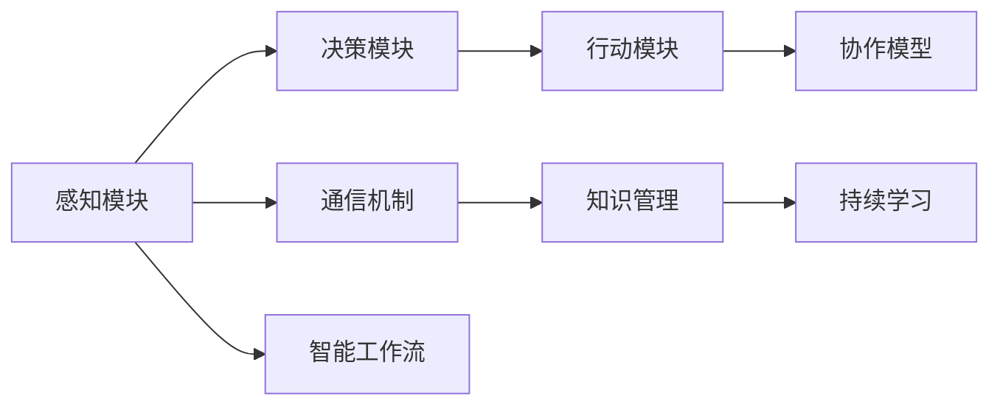

                 

# AI人工智能代理工作流AI Agent WorkFlow：代理通信与协作模型概览

> 关键词：AI代理, 智能工作流, 人工智能, 代理通信, 协作模型

## 1. 背景介绍

### 1.1 问题由来

在现代企业的数字化转型过程中，智能代理系统扮演着越来越重要的角色。智能代理不仅能够自动化处理繁琐的日常工作，还能在复杂的工作环境中提供精确的决策支持。然而，构建一个高效、可靠的智能代理系统并非易事。其涉及到复杂的通信机制、任务协作、知识管理等多个层面，需要精细化的设计和优化。

人工智能（AI）代理工作流（AI Agent Workflow），即通过AI技术驱动的代理系统，能够自主处理复杂任务，自动优化工作流程，提高工作效率和准确性。AI代理工作流在许多领域都有广泛的应用，例如客户服务、项目管理、数据分析等。

### 1.2 问题核心关键点

构建AI代理工作流涉及的关键点包括：

1. **智能代理设计**：确定代理的工作模式、任务类型、知识库等。
2. **通信机制**：定义代理间的通信协议和数据交换格式。
3. **任务协作**：规划任务分配和执行顺序，协调多个代理的工作。
4. **知识管理**：设计知识存储、检索和更新机制，确保代理能够及时获取所需信息。
5. **持续学习**：构建反馈机制，让代理能够通过经验和数据不断优化自己的决策和行为。

理解这些关键点，可以帮助我们全面把握AI代理工作流的设计和实现。

## 2. 核心概念与联系

### 2.1 核心概念概述

为了更好地理解AI代理工作流，我们首先介绍几个核心概念：

- **AI代理（AI Agent）**：是一种智能软件实体，能够执行任务、处理信息、进行决策。AI代理通常由感知模块、决策模块、行动模块组成。
- **智能工作流（Intelligent Workflow）**：一种基于规则和AI技术的自动化工作流程，能够自主执行一系列复杂任务，提高工作效率。
- **代理通信（Agent Communication）**：代理系统内部的通信机制，确保各代理能够有效协作。
- **协作模型（Collaboration Model）**：描述代理间如何协调任务、共享信息、优化决策的模型。
- **知识管理（Knowledge Management）**：知识存储、检索、更新等技术手段，支持代理获取所需信息。
- **持续学习（Continuous Learning）**：通过反馈机制，让代理不断学习新知识，优化行为策略。

这些概念相互交织，构成了AI代理工作流的设计基础。

### 2.2 核心概念原理和架构的 Mermaid 流程图(Mermaid 流程节点中不要有括号、逗号等特殊字符)



此流程图展示了AI代理工作流的主要组件和流程。感知模块负责获取环境信息，决策模块根据信息进行决策，行动模块执行决策结果。通信机制保证代理间的信息传递，协作模型规划任务分配和执行，知识管理支持信息获取，持续学习让代理不断优化。

## 3. 核心算法原理 & 具体操作步骤

### 3.1 算法原理概述

AI代理工作流的核心原理基于任务分解、并行处理、信息共享等技术手段。其算法原理可概括为以下几点：

1. **任务分解**：将复杂任务分解为多个子任务，分配给不同的代理执行。
2. **并行处理**：利用多线程或多进程技术，同时处理多个子任务，提高处理效率。
3. **信息共享**：通过通信机制，实现代理间的信息传递和协作。
4. **协作优化**：通过协作模型，优化任务分配和执行顺序，提高协作效率。
5. **知识管理**：构建知识库，存储、检索和更新知识，支持代理决策。
6. **持续学习**：通过反馈机制，让代理不断学习新知识，优化行为策略。

### 3.2 算法步骤详解

AI代理工作流的构建和优化通常包括以下几个关键步骤：

**Step 1: 需求分析和功能设计**

1. **需求收集**：与业务专家交流，明确代理需要执行的任务和功能。
2. **功能设计**：确定代理的基本构成，如感知模块、决策模块、行动模块等。

**Step 2: 通信机制设计**

1. **协议选择**：选择适合的通信协议，如RESTful API、消息队列等。
2. **数据格式**：定义数据交换格式，如JSON、XML等。

**Step 3: 任务协作规划**

1. **任务分解**：将复杂任务分解为多个子任务。
2. **任务分配**：根据代理的能力和负载，合理分配任务。
3. **执行顺序**：确定各代理任务的执行顺序，避免冲突。

**Step 4: 知识管理策略**

1. **知识存储**：选择合适的知识存储方案，如数据库、搜索引擎等。
2. **知识检索**：实现高效的检索算法，支持代理快速获取所需信息。
3. **知识更新**：设计知识更新机制，确保知识的时效性。

**Step 5: 持续学习模型**

1. **反馈机制**：收集代理的执行结果和用户反馈。
2. **学习算法**：选择合适的学习算法，如强化学习、迁移学习等。
3. **模型优化**：通过不断的反馈和迭代，优化代理的行为策略。

**Step 6: 测试和部署**

1. **单元测试**：对代理的各个模块进行测试。
2. **集成测试**：测试代理系统整体的功能和性能。
3. **部署上线**：将代理系统部署到生产环境，进行监控和优化。

### 3.3 算法优缺点

AI代理工作流的构建和优化有以下优点：

1. **高效性**：通过任务分解和并行处理，提高代理系统的处理效率。
2. **灵活性**：代理可以根据环境和任务动态调整策略，适应不同的工作场景。
3. **可扩展性**：系统可以通过添加新的代理模块，扩展功能和服务范围。

同时，也存在一些局限性：

1. **复杂性**：构建和优化系统需要多学科知识，开发难度较大。
2. **资源消耗**：大规模的代理系统可能消耗大量的计算资源和存储资源。
3. **安全风险**：代理间通信和数据共享可能带来安全风险，需要严格的安全措施。

### 3.4 算法应用领域

AI代理工作流在多个领域都有广泛的应用，例如：

- **客户服务**：智能客服代理能够自动回答客户问题，提供24/7的服务。
- **项目管理**：项目经理代理可以自动分配任务，监控进度，协调团队工作。
- **数据分析**：数据分析代理可以自动化数据处理和分析，提供精确的决策支持。
- **供应链管理**：供应链管理代理可以自动跟踪物流信息，优化库存管理。
- **智能制造**：智能制造代理可以自动化生产调度，提高生产效率和质量。

## 4. 数学模型和公式 & 详细讲解 & 举例说明（备注：数学公式请使用latex格式，latex嵌入文中独立段落使用 $$，段落内使用 $)
### 4.1 数学模型构建

为了更好地理解AI代理工作流，我们引入几个数学模型：

- **任务分解模型**：将复杂任务 $T$ 分解为 $n$ 个子任务 $T_i$，每个子任务由 $p_i$ 个代理执行。
- **任务执行时间模型**：每个子任务 $T_i$ 的执行时间为 $t_i$，所有代理并行执行。
- **信息共享模型**：代理间通过通信机制共享信息 $I$，信息共享的速度为 $v$。

### 4.2 公式推导过程

以任务执行时间为例，假设所有代理的能力相同，每个代理的执行速率为 $r$，则任务 $T$ 的执行时间为：

$$
T_{\text{total}} = \frac{T}{n} \times \frac{1}{r} + \frac{I}{v}
$$

其中，第一项表示并行处理的时间成本，第二项表示信息共享的时间成本。

### 4.3 案例分析与讲解

假设某客户服务系统有 $m=10$ 个代理，每个代理的执行速率为 $r=2$（任务/秒），任务 $T$ 分解为 $n=5$ 个子任务，信息共享的速度为 $v=1$（任务/秒）。每个子任务的大小相同，记为 $t_i=1$（任务）。则总执行时间为：

$$
T_{\text{total}} = \frac{1}{2} \times 5 + \frac{1}{1} = 2.5 + 1 = 3.5
$$

该系统总执行时间为 $3.5$ 秒，比单个代理独立执行快得多。

## 5. 项目实践：代码实例和详细解释说明

### 5.1 开发环境搭建

在进行AI代理工作流的开发和测试时，我们需要以下开发环境：

1. **编程语言**：Python、Java、C++ 等。
2. **框架**：Flask、Spring Boot、Apache Kafka 等。
3. **数据库**：MySQL、MongoDB、Elasticsearch 等。
4. **开发工具**：Jupyter Notebook、PyCharm、Visual Studio 等。

### 5.2 源代码详细实现

以下是一个基于Python和Flask框架的简单智能客服代理示例：

```python
from flask import Flask, request
import json

app = Flask(__name__)

@app.route('/api/customer_service', methods=['POST'])
def handle_customer_service():
    data = json.loads(request.data)
    question = data['question']
    # 处理客户问题，并返回答案
    answer = handle_question(question)
    return jsonify({'answer': answer})

def handle_question(question):
    # 将问题输入到模型中进行处理，返回答案
    # 具体实现请参考相关模型库和API
    return answer

if __name__ == '__main__':
    app.run(debug=True)
```

### 5.3 代码解读与分析

该示例使用了Flask框架来搭建一个简单的API接口，用于处理客户提出的问题。当客户通过POST请求发送问题时，API接收问题并调用 `handle_question` 函数进行处理。该函数内部可以调用模型库或API，根据问题生成答案并返回。

### 5.4 运行结果展示

在启动API后，可以通过curl命令或其他工具向API发送请求，例如：

```
curl -X POST -H "Content-Type: application/json" -d '{"question": "请问如何查询订单状态？"}' http://localhost:5000/api/customer_service
```

API返回结果为：

```json
{"answer": "您可以在订单页面上查询订单状态。"}
```

## 6. 实际应用场景

### 6.1 智能客服系统

AI代理工作流在智能客服系统中有着广泛的应用。智能客服代理能够自动回答客户问题，提供24/7的服务。通过与客户交互，代理可以积累大量客户行为数据，不断优化回答策略，提升客户满意度。

### 6.2 项目管理

在项目管理中，AI代理工作流可以自动分配任务、监控进度、协调团队工作。通过智能分析任务依赖关系，代理可以优化任务执行顺序，提高项目交付效率。

### 6.3 数据分析

数据分析代理可以自动化数据处理和分析，提供精确的决策支持。通过预定义的分析流程，代理能够自动获取、清洗、分析数据，生成报告和建议。

### 6.4 供应链管理

在供应链管理中，AI代理工作流可以自动跟踪物流信息，优化库存管理。通过实时监控供应链各环节，代理可以及时调整库存和运输计划，减少成本和延误。

### 6.5 智能制造

智能制造代理可以自动化生产调度，提高生产效率和质量。通过优化生产流程和资源配置，代理可以最大化利用生产设备和人力资源，降低生产成本。

## 7. 工具和资源推荐

### 7.1 学习资源推荐

为了帮助开发者系统掌握AI代理工作流的理论和实践，我们推荐以下学习资源：

1. **《智能代理系统设计与实现》**：介绍智能代理系统设计原理和实现方法。
2. **《Python网络编程》**：讲解网络编程基础和Flask框架的使用。
3. **《Kafka入门与实战》**：介绍消息队列系统Kafka的基本概念和应用。
4. **《数据科学导论》**：涵盖数据科学基本知识和常用算法。
5. **《机器学习实战》**：提供大量机器学习案例和代码示例。

### 7.2 开发工具推荐

以下是几个常用的AI代理工作流开发工具：

1. **Flask**：轻量级Web框架，支持Python和Flask中间件。
2. **Spring Boot**：Java开发框架，支持RESTful API和微服务架构。
3. **Apache Kafka**：分布式消息队列，支持实时数据处理和分布式通信。
4. **Apache Spark**：大数据处理框架，支持分布式数据处理和机器学习。
5. **TensorFlow**：深度学习框架，支持神经网络模型训练和部署。

### 7.3 相关论文推荐

以下是几篇与AI代理工作流相关的经典论文：

1. **《多智能体系统中的协作机制》**：介绍多智能体系统中的协作机制和优化算法。
2. **《智能代理系统：设计与实现》**：介绍智能代理系统的一般框架和设计原则。
3. **《基于人工智能的智能客服系统》**：介绍智能客服系统的设计思路和实现方法。
4. **《基于消息队列的分布式数据处理》**：介绍消息队列系统在数据处理中的应用。
5. **《持续学习与优化》**：介绍持续学习算法和优化技术。

## 8. 总结：未来发展趋势与挑战

### 8.1 研究成果总结

AI代理工作流技术在多个领域都有广泛的应用，通过任务分解、并行处理、信息共享等技术手段，提高了代理系统的效率和灵活性。AI代理工作流通过持续学习不断优化行为策略，适应复杂多变的工作环境。

### 8.2 未来发展趋势

未来，AI代理工作流的发展趋势包括：

1. **智能化提升**：通过引入更先进的AI技术，如深度学习、强化学习等，提高代理系统的智能水平。
2. **自动化优化**：通过智能算法优化任务分配和执行顺序，提高系统效率。
3. **跨领域应用**：拓展AI代理工作流的应用领域，如医疗、金融等。
4. **云化部署**：通过云计算技术，实现代理系统的灵活部署和扩展。
5. **边缘计算**：将AI代理工作流部署在边缘设备上，提高实时性。

### 8.3 面临的挑战

尽管AI代理工作流技术取得了一定的进展，但仍面临一些挑战：

1. **复杂性增加**：系统设计复杂度不断增加，需要跨学科知识。
2. **资源消耗高**：大规模系统需要大量计算和存储资源。
3. **安全风险高**：代理间通信和数据共享可能带来安全风险。
4. **持续学习困难**：代理需要不断学习和优化，才能适应复杂环境。

### 8.4 研究展望

未来的研究重点包括：

1. **简化设计**：通过优化设计方法，降低系统复杂性。
2. **资源优化**：通过分布式计算和边缘计算技术，优化资源消耗。
3. **安全防护**：设计更高效、可靠的安全机制，保障数据和系统安全。
4. **持续学习**：研究更高效、自适应的持续学习算法，提升代理智能水平。
5. **多领域应用**：拓展AI代理工作流的应用场景，提升系统适用性。

## 9. 附录：常见问题与解答

**Q1：AI代理工作流与传统代理系统的区别是什么？**

A: AI代理工作流通过引入AI技术，使得代理系统具备自主学习、自主决策、自主执行的能力。与传统代理系统相比，AI代理工作流能够更好地适应复杂环境，提供更精确的决策支持。

**Q2：AI代理工作流在开发过程中需要注意哪些问题？**

A: 在开发过程中，需要注意以下问题：

1. **系统设计**：确保系统设计合理，考虑任务分解、通信机制、协作模型等方面。
2. **性能优化**：通过并行处理、分布式计算等技术手段，提高系统性能。
3. **安全防护**：设计严格的安全措施，保障系统安全。
4. **持续学习**：通过持续学习算法，不断优化代理行为。

**Q3：AI代理工作流在实际应用中需要注意哪些问题？**

A: 在实际应用中，需要注意以下问题：

1. **数据质量**：确保数据质量，避免代理决策失误。
2. **系统维护**：及时维护和更新代理系统，保持系统稳定。
3. **用户反馈**：收集用户反馈，不断优化代理行为。

**Q4：AI代理工作流的未来发展方向是什么？**

A: AI代理工作流的未来发展方向包括：

1. **智能化提升**：引入更先进的AI技术，提升代理系统的智能水平。
2. **自动化优化**：通过智能算法优化任务分配和执行顺序，提高系统效率。
3. **跨领域应用**：拓展应用领域，提升系统适用性。
4. **云化部署**：通过云计算技术，实现灵活部署和扩展。
5. **边缘计算**：将系统部署在边缘设备上，提高实时性。

**Q5：如何提高AI代理工作流的安全性？**

A: 提高AI代理工作流安全性的方法包括：

1. **数据加密**：对敏感数据进行加密，防止数据泄露。
2. **访问控制**：通过身份认证、权限控制等手段，保障系统安全。
3. **异常检测**：实时监控系统行为，及时发现和应对异常情况。

**Q6：如何优化AI代理工作流的性能？**

A: 优化AI代理工作流性能的方法包括：

1. **并行处理**：利用多线程或多进程技术，提高处理效率。
2. **分布式计算**：通过分布式计算技术，提高系统吞吐量。
3. **资源优化**：通过资源优化技术，降低资源消耗。

---

作者：禅与计算机程序设计艺术 / Zen and the Art of Computer Programming

