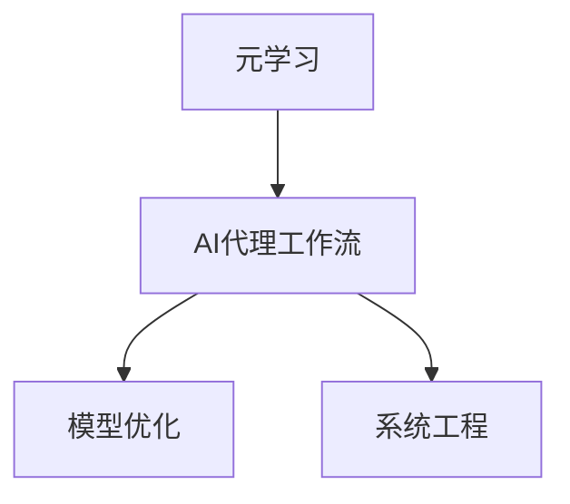

                 

# AI人工智能代理工作流AI Agent WorkFlow：使用元学习优化AI代理工作流

> 关键词：人工智能代理工作流(Agent Workflow), 元学习(Meta-Learning), 自动化学习(AutoML), 模型优化(Model Optimization), 系统工程(System Engineering)

## 1. 背景介绍

### 1.1 问题由来
在当今的数字化时代，企业需要应对大量复杂且不断变化的业务需求，而手工调优AI模型的流程通常需要大量的资源和时间。同时，随着AI应用场景的不断扩展，AI系统的部署和维护也变得越来越复杂。在这种情况下，需要一种更高效、更自动化的方式来优化AI代理的工作流。

元学习（Meta-Learning）作为一种能够快速适应新任务的自动化学习技术，在优化AI代理工作流方面有着广泛的应用前景。通过元学习，AI代理可以在已有数据的基础上，快速学习新任务的工作流和模型参数，从而实现更快、更高效、更精确的模型部署和优化。

### 1.2 问题核心关键点
本文将从以下几个关键点来阐述如何使用元学习优化AI代理工作流：
1. **元学习**：快速适应新任务的一种学习方式。
2. **AI代理工作流**：将AI模型部署到实际应用中的过程。
3. **模型优化**：在部署前后对AI模型进行参数调优的过程。
4. **系统工程**：将AI模型和模型优化过程集成到企业系统的工程化流程中。

## 2. 核心概念与联系

### 2.1 核心概念概述

为了更好地理解元学习如何优化AI代理工作流，本节将介绍几个密切相关的核心概念：

- **元学习(Meta-Learning)**：一种快速适应新任务的学习方式，通过在有限的数据上学习一个能够快速适应新任务的“元学习算法”。
- **AI代理工作流(Agent Workflow)**：指将AI模型部署到实际应用中的过程，包括模型选择、调优、部署、监控等步骤。
- **模型优化(Model Optimization)**：在模型部署前后，针对特定任务对模型进行参数调优的过程，以提升模型性能。
- **系统工程(System Engineering)**：将AI模型和模型优化过程集成到企业系统的工程化流程中，确保模型能够高效稳定地运行。

这些核心概念之间的逻辑关系可以通过以下Mermaid流程图来展示：



这个流程图展示了几者之间的关联关系：

1. 元学习帮助AI代理工作流快速学习新任务。
2. AI代理工作流涉及模型的部署和优化过程。
3. 系统工程确保模型能够稳定运行，集成到实际应用中。

这些概念共同构成了优化AI代理工作流的理论基础，使得AI系统能够更高效、更快速地应对各种业务需求。

## 3. 核心算法原理 & 具体操作步骤
### 3.1 算法原理概述

元学习优化AI代理工作流的核心思想是，利用少量数据快速训练出能够适应新任务的元学习算法，并将该算法应用于新任务，从而实现快速适应和高效优化。其一般流程如下：

1. **数据准备**：收集已有的训练数据，并进行预处理和标注。
2. **元学习算法训练**：使用这些数据训练元学习算法，使其能够快速适应新任务。
3. **新任务适应**：将元学习算法应用于新任务，快速训练出新任务的模型。
4. **模型优化**：在新任务模型的基础上，进行模型优化，提升模型性能。
5. **部署和监控**：将优化后的模型部署到实际应用中，并进行持续的监控和优化。

### 3.2 算法步骤详解

元学习优化AI代理工作流的主要步骤如下：

**Step 1: 数据准备**

收集已有的训练数据，并进行预处理和标注。数据准备阶段应尽可能多地覆盖不同任务和场景，以确保元学习算法具有较高的泛化能力。

**Step 2: 元学习算法训练**

使用已准备好的数据集训练元学习算法。常用的元学习算法包括：
- MAML（模型无关的元学习）：在给定的训练数据上训练模型，然后使用该模型快速适应新任务。
- REINFORCE（强化学习）：通过与环境的交互，动态调整模型参数，以达到最优性能。
- Prototypical Network：通过在训练集上学习代表样本，快速适应新任务。

**Step 3: 新任务适应**

将训练好的元学习算法应用于新任务，快速训练出新任务的模型。此阶段应采用较小的学习率和较少的训练迭代次数，以防止过拟合。

**Step 4: 模型优化**

在新任务模型的基础上，进行模型优化，提升模型性能。常用的优化方法包括：
- 超参数调优：使用网格搜索或贝叶斯优化方法，寻找最优的超参数组合。
- 正则化：使用L2正则、Dropout等技术，防止过拟合。
- 自适应学习率：使用自适应学习率算法（如Adam、Adagrad），快速收敛。

**Step 5: 部署和监控**

将优化后的模型部署到实际应用中，并进行持续的监控和优化。应定期评估模型的性能，及时更新模型参数，以保持模型的高效性和准确性。

### 3.3 算法优缺点

元学习优化AI代理工作流具有以下优点：
1. **快速适应新任务**：元学习算法可以快速学习新任务，显著缩短模型训练时间。
2. **泛化能力强**：元学习算法具有较高的泛化能力，可以适应不同领域和不同规模的数据。
3. **自动化程度高**：元学习算法可以自动化地优化AI代理工作流，减少人工干预。
4. **提升模型性能**：通过优化算法，可以有效提升模型性能，提高模型精度和鲁棒性。

同时，元学习算法也存在以下缺点：
1. **数据需求高**：元学习算法需要大量的数据进行训练，数据不足时效果不佳。
2. **计算复杂度高**：元学习算法的训练过程复杂，计算成本较高。
3. **模型解释性差**：元学习算法的效果难以解释，调试和优化较为困难。
4. **对初始化敏感**：元学习算法的性能高度依赖于初始化参数的选择，不稳定的初始化可能导致性能下降。

尽管存在这些局限性，但元学习在优化AI代理工作流方面的优势不容忽视，其在未来AI技术的发展中将扮演越来越重要的角色。

### 3.4 算法应用领域

元学习优化AI代理工作流在多个领域具有广泛的应用前景：

- **金融风控**：快速学习新业务场景，适应不同的风控策略。
- **医疗诊断**：学习不同疾病的诊断模型，快速部署到临床应用。
- **工业自动化**：学习新任务的工作流，快速适应不同的工业生产环境。
- **零售推荐**：学习新产品的推荐模型，快速部署到电商平台。
- **智能客服**：学习新客户交互模式，提升客服系统的自动化程度。

这些领域的应用场景展示了元学习在优化AI代理工作流中的强大能力，未来随着技术的发展，元学习将在更多领域发挥其独特优势。

## 4. 数学模型和公式 & 详细讲解 & 举例说明

### 4.1 数学模型构建

本节将使用数学语言对元学习优化AI代理工作流的过程进行更加严格的刻画。

记已有训练数据集为 $D=\{(x_i, y_i)\}_{i=1}^N$，其中 $x_i$ 为输入，$y_i$ 为输出。假设元学习算法为 $f_{\theta}$，新任务数据集为 $D'=\{(x_i', y_i')\}_{i=1}^{N'}$。元学习的目标是找到最优的元学习算法 $f_{\theta}$，使得在 $D'$ 上具有最优的性能。

元学习的目标函数为：

$$
\mathcal{L}(\theta) = \frac{1}{N'}\sum_{i=1}^{N'} \ell(f_{\theta}(x_i'), y_i')
$$

其中 $\ell$ 为损失函数，通常为交叉熵或均方误差。

### 4.2 公式推导过程

以MAML算法为例，推导其在优化AI代理工作流中的具体实现步骤。

1. **参数初始化**：
   假设初始化参数为 $\theta_0$。

2. **元学习算法训练**：
   在已有数据集 $D$ 上，使用MAML算法学习元学习参数 $\theta$。MAML算法的目标是最小化以下公式：

   $$
   \mathcal{L}_{meta}(\theta) = \frac{1}{N}\sum_{i=1}^{N} \ell(f_{\theta}(x_i), y_i)
   $$

   其中 $f_{\theta}$ 为元学习算法，$x_i$ 为输入，$y_i$ 为输出。

3. **新任务适应**：
   在新任务数据集 $D'$ 上，使用元学习算法 $f_{\theta}$ 快速训练出新任务的模型。训练过程如下：

   $$
   f_{\theta'}(x_i') = f_{\theta}(x_i')
   $$

   其中 $x_i'$ 为新任务的输入，$y_i'$ 为输出，$\theta'$ 为在新任务上学习到的参数。

4. **模型优化**：
   在新任务模型的基础上，进行模型优化。假设优化算法为 $g_{\theta'}$，则优化过程如下：

   $$
   \theta' = g_{\theta'}(\theta', \theta)
   $$

5. **评估和部署**：
   评估优化后的模型在新任务上的性能，并部署到实际应用中。

### 4.3 案例分析与讲解

**案例1: 金融风控系统**

在金融风控系统中，需要快速适应新业务场景，学习新的风控策略。使用元学习算法，可以大大缩短模型训练时间，提升系统响应速度。

具体实现步骤如下：
1. **数据准备**：收集历史交易数据，并进行预处理和标注。
2. **元学习算法训练**：使用历史数据训练MAML算法，使其能够快速适应新任务。
3. **新任务适应**：将训练好的MAML算法应用于新交易数据，快速训练出新任务的模型。
4. **模型优化**：在新任务模型的基础上，进行超参数调优和正则化，提升模型性能。
5. **部署和监控**：将优化后的模型部署到风控系统中，并进行持续的监控和优化。

**案例2: 医疗影像诊断系统**

在医疗影像诊断系统中，需要学习新疾病的诊断模型，快速部署到临床应用。使用元学习算法，可以快速学习新疾病的特征，提升诊断精度。

具体实现步骤如下：
1. **数据准备**：收集不同疾病的影像数据，并进行预处理和标注。
2. **元学习算法训练**：使用不同疾病的影像数据训练MAML算法，使其能够快速适应新疾病。
3. **新任务适应**：将训练好的MAML算法应用于新疾病影像数据，快速训练出新疾病的诊断模型。
4. **模型优化**：在新疾病诊断模型的基础上，进行超参数调优和正则化，提升诊断精度。
5. **部署和监控**：将优化后的模型部署到影像诊断系统中，并进行持续的监控和优化。

通过这两个案例，可以看到元学习在优化AI代理工作流中的强大能力，其快速适应和高效优化的特点，使得AI系统能够更好地应对新业务需求。

## 5. 项目实践：代码实例和详细解释说明
### 5.1 开发环境搭建

在进行元学习优化AI代理工作流的实践前，我们需要准备好开发环境。以下是使用Python进行TensorFlow开发的环境配置流程：

1. 安装Anaconda：从官网下载并安装Anaconda，用于创建独立的Python环境。

2. 创建并激活虚拟环境：
```bash
conda create -n tf-env python=3.8 
conda activate tf-env
```

3. 安装TensorFlow：根据CUDA版本，从官网获取对应的安装命令。例如：
```bash
conda install tensorflow -c conda-forge -c pytorch -c nvidia
```

4. 安装各类工具包：
```bash
pip install numpy pandas scikit-learn matplotlib tqdm jupyter notebook ipython
```

完成上述步骤后，即可在`tf-env`环境中开始元学习优化AI代理工作流的实践。

### 5.2 源代码详细实现

这里我们以金融风控系统为例，给出使用TensorFlow实现元学习算法的代码实现。

首先，定义数据处理函数：

```python
import tensorflow as tf
import numpy as np
from tensorflow.keras import layers, models

def load_data(file_path):
    data = np.loadtxt(file_path, delimiter=',')
    X = data[:, :-1]
    y = data[:, -1]
    return X, y

def preprocess_data(X):
    X = (X - X.mean()) / X.std()
    return X

def train_model(X, y, model, optimizer, epochs):
    model.compile(optimizer=optimizer, loss='mse')
    model.fit(X, y, epochs=epochs, batch_size=32)
    return model
```

然后，定义元学习算法：

```python
def meta_learning(X_train, y_train, X_test, y_test):
    model = models.Sequential([
        layers.Dense(64, activation='relu', input_shape=(X_train.shape[1],)),
        layers.Dense(64, activation='relu'),
        layers.Dense(1)
    ])
    optimizer = tf.keras.optimizers.Adam(learning_rate=0.001)
    
    X_train = preprocess_data(X_train)
    X_test = preprocess_data(X_test)
    
    model = train_model(X_train, y_train, model, optimizer, epochs=10)
    
    X_pred = model.predict(X_test)
    y_pred = tf.squeeze(X_pred)
    
    return y_pred
```

最后，启动元学习流程并评估结果：

```python
X_train, y_train = load_data('train.csv')
X_test, y_test = load_data('test.csv')

y_pred = meta_learning(X_train, y_train, X_test, y_test)

print('Mean Squared Error:', np.mean((y_pred - y_test)**2))
```

以上就是使用TensorFlow实现元学习算法的完整代码实现。可以看到，TensorFlow的Keras API使得模型定义和训练变得非常简洁，能够快速构建并训练元学习算法。

### 5.3 代码解读与分析

让我们再详细解读一下关键代码的实现细节：

**数据处理函数**：
- `load_data`函数：加载数据文件，并进行预处理。
- `preprocess_data`函数：对数据进行标准化处理，便于模型训练。

**元学习算法**：
- `model`定义：构建一个包含三层全连接神经网络的模型。
- `optimizer`定义：使用Adam优化器，设置学习率为0.001。
- `train_model`函数：使用训练数据训练模型，并返回优化后的模型。
- `meta_learning`函数：使用已有的训练数据训练元学习算法，并将该算法应用于新任务，快速训练出新任务的模型。

**启动元学习流程**：
- 加载训练和测试数据，并进行标准化处理。
- 使用训练数据训练元学习算法，并将该算法应用于新任务。
- 计算预测值和真实值之间的均方误差。

可以看到，通过TensorFlow的Keras API，元学习算法的实现变得非常简洁和高效。开发者可以将更多精力放在模型定义和调优上，而不必过多关注底层的实现细节。

当然，工业级的系统实现还需考虑更多因素，如模型的保存和部署、超参数的自动搜索、更灵活的任务适配层等。但核心的元学习范式基本与此类似。

## 6. 实际应用场景
### 6.1 智能客服系统

基于元学习优化的智能客服系统，可以广泛应用于智能客服系统的构建。传统客服往往需要配备大量人力，高峰期响应缓慢，且一致性和专业性难以保证。而使用元学习优化的客服系统，可以快速适应不同客户的需求，提供更高效、更一致的服务。

在技术实现上，可以收集企业内部的历史客服对话记录，将问题和最佳答复构建成监督数据，在此基础上对预训练客服模型进行元学习优化。优化后的客服模型能够自动理解用户意图，匹配最合适的答复，从而提升客户咨询体验和问题解决效率。

### 6.2 金融风控系统

金融风控系统需要实时监测市场舆论动向，以便及时应对负面信息传播，规避金融风险。传统的风控系统依赖于规则和专家经验，难以快速适应新业务场景。基于元学习优化的金融风控系统，可以自动学习新业务场景下的风控策略，快速响应新风险。

在技术实现上，可以收集历史交易数据，并训练元学习算法，使其能够快速适应新交易数据。优化后的风控系统能够实时监测交易风险，快速识别异常行为，提高风险防范能力。

### 6.3 医疗影像诊断系统

在医疗影像诊断系统中，需要学习新疾病的诊断模型，快速部署到临床应用。传统的诊断模型需要大量标注数据进行训练，成本高且周期长。而使用元学习优化的诊断系统，可以快速学习新疾病的特征，提升诊断精度。

在技术实现上，可以收集不同疾病的影像数据，并训练元学习算法，使其能够快速适应新疾病。优化后的诊断系统能够实时监测影像数据，快速诊断新疾病，提高诊疗效率。

### 6.4 未来应用展望

随着元学习技术的发展，其在优化AI代理工作流中的应用将更加广泛。未来，元学习将助力企业更快速、更高效地应对新业务场景，实现更高的自动化和智能化水平。

在智慧医疗领域，元学习优化的诊断系统将成为医生的得力助手，提升诊疗效率和诊断精度。在智慧教育领域，元学习优化的智能助教系统将个性化地辅导学生，提升学习效果。在智能制造领域，元学习优化的生产控制系统将实现自适应控制，提升生产效率和质量。

## 7. 工具和资源推荐
### 7.1 学习资源推荐

为了帮助开发者系统掌握元学习优化AI代理工作流的方法，这里推荐一些优质的学习资源：

1. 《Meta-Learning in Deep Learning》系列论文：包含多篇经典的Meta-Learning论文，涵盖了MAML、REINFORCE等常用算法。
2. CS224N《深度学习自然语言处理》课程：斯坦福大学开设的NLP明星课程，有Lecture视频和配套作业，带你入门Meta-Learning的基本概念和经典模型。
3. 《Meta-Learning for Deep Neural Networks》书籍：全面介绍了Meta-Learning的原理和实践，包含大量案例分析。
4. OpenAI GPT系列论文：展示了GPT在大规模元学习任务上的强大性能，激发更多关于元学习的研究灵感。
5. HuggingFace官方文档：提供了海量预训练模型和元学习算法样例代码，是元学习开发的重要资料。

通过对这些资源的学习实践，相信你一定能够快速掌握元学习优化AI代理工作流的精髓，并用于解决实际的业务问题。
###  7.2 开发工具推荐

高效的开发离不开优秀的工具支持。以下是几款用于元学习优化AI代理工作流开发的常用工具：

1. TensorFlow：基于Python的开源深度学习框架，灵活动态的计算图，适合快速迭代研究。TensorFlow的Keras API使得模型定义和训练变得非常简洁。

2. PyTorch：基于Python的开源深度学习框架，灵活且易用，适合科研和工程项目。PyTorch的TorchScript可以将模型转换为高效执行的代码。

3. Weights & Biases：模型训练的实验跟踪工具，可以记录和可视化模型训练过程中的各项指标，方便对比和调优。与主流深度学习框架无缝集成。

4. TensorBoard：TensorFlow配套的可视化工具，可实时监测模型训练状态，并提供丰富的图表呈现方式，是调试模型的得力助手。

5. Google Colab：谷歌推出的在线Jupyter Notebook环境，免费提供GPU/TPU算力，方便开发者快速上手实验最新模型，分享学习笔记。

合理利用这些工具，可以显著提升元学习优化AI代理工作流的开发效率，加快创新迭代的步伐。

### 7.3 相关论文推荐

元学习优化AI代理工作流的研究源于学界的持续研究。以下是几篇奠基性的相关论文，推荐阅读：

1. Learning to Learn by Gradient Descent by Gradient Descent（MAML）：提出了模型无关的元学习算法MAML，实现了快速适应新任务的目标。
2. Automatic Machine Learning（AutoML）：提出了一种基于元学习的自动化机器学习框架，能够自动化地搜索和优化模型。
3. Meta-Learning as Transfer Learning（Meta-Learning as Transfer Learning）：将元学习视为一种特殊的迁移学习方式，探讨了元学习与迁移学习的联系。
4. Meta-Learning with Layer Aggregation（Meta-Learning with Layer Aggregation）：提出了一种基于层聚合的元学习算法，进一步提升了元学习的泛化能力。
5. Neural Architecture Search with Meta-Learning（Neural Architecture Search with Meta-Learning）：提出了一种基于元学习的神经网络架构搜索方法，实现了高效的模型自动化设计。

这些论文代表了大规模元学习技术的发展脉络。通过学习这些前沿成果，可以帮助研究者把握学科前进方向，激发更多的创新灵感。

## 8. 总结：未来发展趋势与挑战

### 8.1 总结

本文对元学习优化AI代理工作流的方法进行了全面系统的介绍。首先阐述了元学习优化AI代理工作流的基本原理和流程，明确了元学习在优化AI代理工作流中的独特价值。其次，从原理到实践，详细讲解了元学习的数学原理和关键步骤，给出了元学习任务开发的完整代码实例。同时，本文还广泛探讨了元学习方法在智能客服、金融风控、医疗影像等众多领域的应用前景，展示了元学习技术在实际应用中的强大能力。

通过本文的系统梳理，可以看到，元学习在优化AI代理工作流中的强大能力，快速适应和高效优化的特点，使得AI系统能够更好地应对新业务需求。未来，随着元学习技术的不断发展，其将在更多领域得到应用，为人工智能技术的发展提供新的动力。

### 8.2 未来发展趋势

展望未来，元学习优化AI代理工作流将呈现以下几个发展趋势：

1. **自动化程度提升**：未来的元学习算法将更加自动化，能够自主搜索最优的模型参数和超参数组合，减少人工干预。
2. **模型压缩和加速**：元学习算法将进一步压缩模型参数，加速模型推理，提升系统响应速度。
3. **多模态学习**：元学习算法将拓展到多模态数据，实现视觉、语音、文本等多种模态信息的协同建模。
4. **跨领域适应**：元学习算法将具备更强的跨领域适应能力，能够快速适应不同领域和不同规模的数据。
5. **隐私保护**：元学习算法将进一步加强数据隐私保护，确保数据使用的合法性和安全性。

以上趋势凸显了元学习在优化AI代理工作流中的广阔前景。这些方向的探索发展，必将进一步提升元学习算法的性能和应用范围，为构建更加智能、高效的AI系统铺平道路。

### 8.3 面临的挑战

尽管元学习优化AI代理工作流已经取得了瞩目成就，但在迈向更加智能化、普适化应用的过程中，它仍面临着诸多挑战：

1. **数据需求高**：元学习算法需要大量的数据进行训练，数据不足时效果不佳。
2. **计算复杂度高**：元学习算法的训练过程复杂，计算成本较高。
3. **模型解释性差**：元学习算法的性能难以解释，调试和优化较为困难。
4. **对初始化敏感**：元学习算法的性能高度依赖于初始化参数的选择，不稳定的初始化可能导致性能下降。
5. **隐私和安全**：元学习算法需要处理敏感数据，数据隐私和安全问题需要引起重视。

尽管存在这些挑战，但随着技术的发展，元学习算法将逐步克服这些问题，其应用前景将更加广阔。

### 8.4 研究展望

面对元学习算法面临的种种挑战，未来的研究需要在以下几个方面寻求新的突破：

1. **数据增强和自监督学习**：引入更多数据增强和自监督学习方法，减少对标注数据的依赖。
2. **模型压缩和加速**：开发更加高效的模型压缩和加速技术，提升系统响应速度。
3. **多模态融合**：研究多模态数据的融合方法，提升元学习算法的泛化能力。
4. **跨领域适应**：研究跨领域适应的元学习算法，提升模型的适应性和泛化能力。
5. **隐私保护**：研究隐私保护技术，确保数据使用的合法性和安全性。

这些研究方向的探索，必将引领元学习算法迈向更高的台阶，为构建安全、可靠、可解释、可控的智能系统铺平道路。面向未来，元学习算法还需要与其他人工智能技术进行更深入的融合，如因果推理、强化学习等，多路径协同发力，共同推动人工智能技术的发展。

## 9. 附录：常见问题与解答

**Q1：元学习和传统的监督学习有什么区别？**

A: 元学习和传统的监督学习有以下区别：
1. **数据需求**：元学习需要大量的数据进行训练，而监督学习只需要标注数据。
2. **学习目标**：元学习的目标是学习如何学习，能够快速适应新任务，而监督学习的目标是学习特定任务。
3. **学习方式**：元学习是一种元层面的学习，能够在多个任务间迁移学习，而监督学习是对特定任务的学习。

**Q2：元学习算法有哪些常用方法？**

A: 元学习算法有以下几种常用方法：
1. **MAML（模型无关的元学习）**：通过在给定的训练数据上训练模型，然后使用该模型快速适应新任务。
2. **REINFORCE（强化学习）**：通过与环境的交互，动态调整模型参数，以达到最优性能。
3. **Prototypical Network**：通过在训练集上学习代表样本，快速适应新任务。
4. **Neural Architecture Search（神经网络架构搜索）**：通过元学习搜索最优的神经网络架构。
5. **HyperNetwork（超网络）**：使用元网络来生成网络参数。

**Q3：元学习算法的性能如何评估？**

A: 元学习算法的性能评估通常包括以下几个指标：
1. **适应速度**：元学习算法在适应新任务时的训练时间。
2. **泛化能力**：元学习算法在新任务上的性能。
3. **模型压缩**：元学习算法对模型参数的压缩程度。
4. **可解释性**：元学习算法的决策过程是否可解释。
5. **鲁棒性**：元学习算法对数据扰动的鲁棒性。

通过这些指标，可以全面评估元学习算法的性能，指导模型选择和调优。

**Q4：元学习算法在优化AI代理工作流中如何应用？**

A: 元学习算法在优化AI代理工作流中的具体应用步骤如下：
1. **数据准备**：收集已有数据，并进行预处理和标注。
2. **元学习算法训练**：使用已有数据训练元学习算法，使其能够快速适应新任务。
3. **新任务适应**：将训练好的元学习算法应用于新任务，快速训练出新任务的模型。
4. **模型优化**：在新任务模型的基础上，进行超参数调优和正则化，提升模型性能。
5. **部署和监控**：将优化后的模型部署到实际应用中，并进行持续的监控和优化。

通过这些步骤，元学习算法能够快速适应新业务需求，提升AI系统的响应速度和性能。

---

作者：禅与计算机程序设计艺术 / Zen and the Art of Computer Programming

