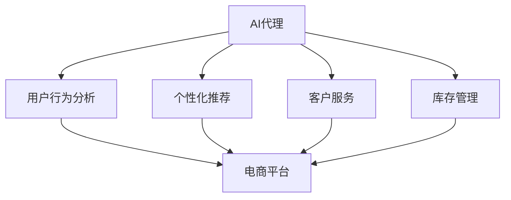
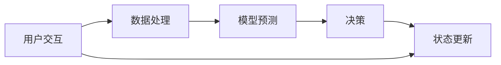
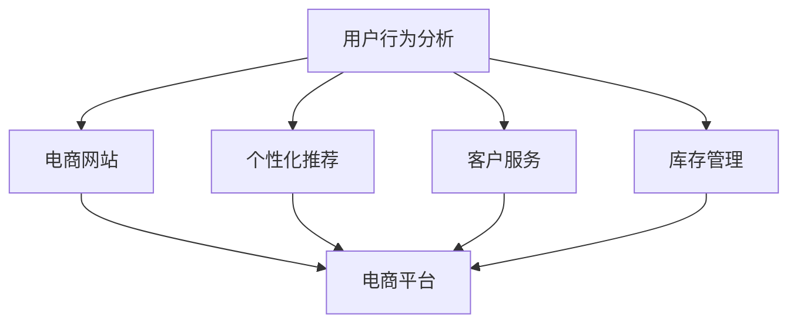
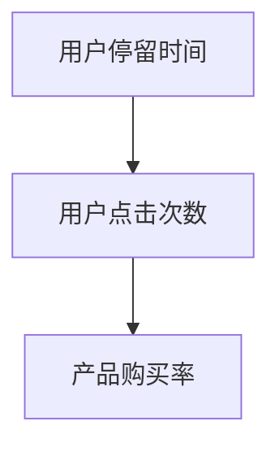
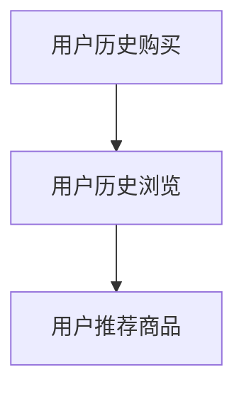
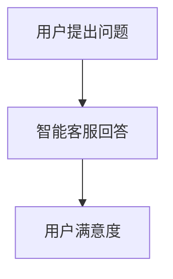
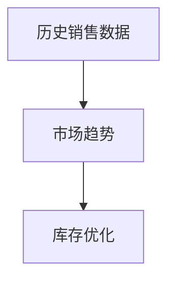
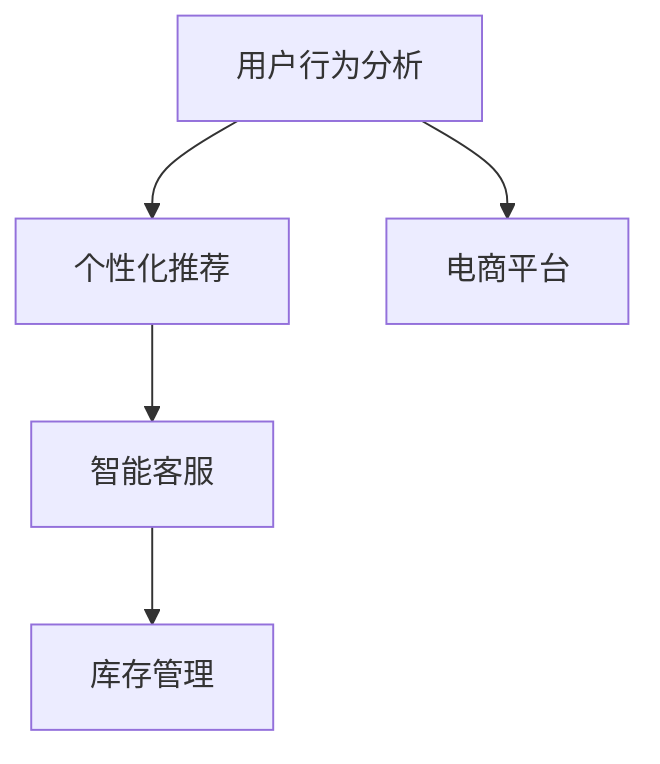

                 

# AI人工智能代理工作流AI Agent WorkFlow：在电子商务中应用AI代理的策略

## 1. 背景介绍

随着互联网和电子商务的迅猛发展，电商平台已逐渐成为全球消费者的主要购物渠道。在业务规模不断扩大的同时，平台运营方也面临着诸多挑战，如用户行为分析、库存管理、推荐系统优化、客户服务提升等。为了提高运营效率和用户满意度，越来越多的电商平台开始引入AI技术，以智能化手段助力业务运营。

AI人工智能代理(AI Agent)是一种基于AI技术的自动化工作流，可以自动化执行特定任务，提高业务运营效率，减少人工干预。在电子商务领域，AI代理可应用于用户行为分析、个性化推荐、客户服务、库存管理等多个方面，为电商平台提供智能化的决策支持。

本文将介绍在电子商务中应用AI代理的策略，涵盖核心概念、算法原理、实际应用场景及未来展望，希望能为电商平台运营者提供实用的AI代理应用指导。

## 2. 核心概念与联系

### 2.1 核心概念概述

#### 2.1.1 人工智能代理

人工智能代理(AI Agent)是一种基于AI技术的自动化工作流，可以执行特定任务，具备决策和推理能力。AI代理可以自动处理大规模数据，提供实时决策，优化业务流程，提升用户体验。

#### 2.1.2 电子商务中的AI代理

电子商务中的AI代理通过自动化执行特定任务，优化业务流程，提升用户购物体验，助力电商平台提高运营效率。常见的应用场景包括用户行为分析、个性化推荐、客户服务、库存管理等。

#### 2.1.3 核心概念之间的关系

AI代理在电子商务中的应用，涉及多个核心概念。具体关系如图1所示：



图1：AI代理在电子商务中的核心概念关系图

### 2.2 核心概念原理和架构

#### 2.2.1 AI代理的构成

AI代理通常由以下几个模块构成：
- 用户接口模块：用于接收用户输入，提供用户交互界面。
- 数据处理模块：负责数据预处理和特征工程。
- 决策模块：根据模型预测结果进行决策。
- 执行模块：执行决策结果，更新状态。

#### 2.2.2 AI代理的工作流程

AI代理的工作流程如图2所示：



图2：AI代理的工作流程

## 3. 核心算法原理 & 具体操作步骤

### 3.1 算法原理概述

AI代理的核心算法原理主要基于机器学习和深度学习技术，通过训练模型，使其具备预测和决策能力。常用的模型包括决策树、随机森林、神经网络等。

在电子商务中，常见的AI代理算法包括：
- 用户行为分析：通过构建用户画像，预测用户行为，提高转化率。
- 个性化推荐：通过协同过滤、基于内容的推荐等算法，提升用户满意度。
- 客户服务：通过聊天机器人等形式，提供智能客服，提升用户体验。
- 库存管理：通过预测需求，优化库存，减少缺货或积压情况。

### 3.2 算法步骤详解

#### 3.2.1 数据准备

1. 数据收集：从电商平台收集用户行为数据、交易数据、用户反馈等，作为训练数据。
2. 数据清洗：清洗数据，处理缺失值和异常值。
3. 数据标注：对数据进行标注，如用户是否购买、产品评价等。

#### 3.2.2 模型训练

1. 选择模型：根据任务特点选择模型，如决策树、随机森林、神经网络等。
2. 数据划分：将数据划分为训练集、验证集和测试集。
3. 模型训练：在训练集上训练模型，优化参数。
4. 模型评估：在验证集上评估模型性能，调整参数。
5. 模型测试：在测试集上测试模型性能，确定最终模型。

#### 3.2.3 模型部署

1. 模型导出：将训练好的模型导出为可执行文件或部署到云平台。
2. 接口开发：开发API接口，供业务系统调用。
3. 监控维护：实时监控模型性能，定期维护更新。

### 3.3 算法优缺点

#### 3.3.1 优点

1. 自动化执行任务：AI代理可以自动化处理大量数据，提高业务运营效率。
2. 实时决策：AI代理具备实时决策能力，能够快速响应用户需求。
3. 提高用户体验：AI代理可以根据用户行为，提供个性化推荐，提升用户满意度。

#### 3.3.2 缺点

1. 数据依赖：AI代理需要大量标注数据进行训练，数据标注成本较高。
2. 模型复杂：构建高性能模型需要较多时间和计算资源。
3. 解释性不足：AI代理的决策过程不够透明，难以解释和调试。

### 3.4 算法应用领域

AI代理在电子商务中的应用领域如图3所示：



图3：AI代理在电子商务中的应用领域

## 4. 数学模型和公式 & 详细讲解

### 4.1 数学模型构建

#### 4.1.1 用户行为分析模型

用户行为分析模型通过构建用户画像，预测用户行为。常见的模型包括逻辑回归、决策树、随机森林等。

以决策树模型为例，其数学模型可以表示为：

$$
P(Y|X) = \prod_{i=1}^{n} P(X_i|Y)P(Y)
$$

其中，$Y$为预测结果，$X$为特征向量，$P(Y|X)$为预测概率。

#### 4.1.2 个性化推荐模型

个性化推荐模型通过协同过滤、基于内容的推荐等算法，提升用户满意度。常用的推荐算法包括基于用户的协同过滤、基于物品的协同过滤、基于内容的推荐等。

以基于用户的协同过滤算法为例，其数学模型可以表示为：

$$
I_{u,i} = \sum_{j=1}^{n} \frac{I_{u,j}I_{j,i}}{\sqrt{\sum_{k=1}^{n} I_{u,k}^2} \sqrt{\sum_{k=1}^{n} I_{j,k}^2}}
$$

其中，$I_{u,i}$为用户$u$对物品$i$的评分，$n$为物品数，$\sqrt{\sum_{k=1}^{n} I_{u,k}^2}$和$\sqrt{\sum_{k=1}^{n} I_{j,k}^2}$为用户的评分和物品的评分权重。

#### 4.1.3 客户服务模型

客户服务模型通过聊天机器人等形式，提供智能客服，提升用户体验。常用的模型包括基于规则的客服、基于知识库的客服、基于深度学习的客服等。

以基于深度学习的客服模型为例，其数学模型可以表示为：

$$
P(R|C) = \sigma(\mathbf{W}R^T + \mathbf{b})
$$

其中，$R$为输入向量，$C$为输出向量，$\sigma$为激活函数，$\mathbf{W}$和$\mathbf{b}$为模型参数。

### 4.2 公式推导过程

#### 4.2.1 用户行为分析模型

以决策树模型为例，推导过程如下：

1. 将数据划分为训练集和测试集。
2. 从训练集中随机选取一个特征进行划分。
3. 计算各个特征的划分信息增益，选择最优特征进行划分。
4. 递归进行划分，直到达到预设条件。

#### 4.2.2 个性化推荐模型

以基于用户的协同过滤算法为例，推导过程如下：

1. 计算用户$u$与物品$i$的评分矩阵$I$。
2. 计算用户$u$和物品$i$的评分权重。
3. 计算用户$u$对物品$i$的评分。
4. 对评分进行排序，选择前$k$个物品作为推荐结果。

#### 4.2.3 客户服务模型

以基于深度学习的客服模型为例，推导过程如下：

1. 将输入向量$R$和输出向量$C$分别表示为矩阵。
2. 定义模型的损失函数，如均方误差损失。
3. 使用反向传播算法计算模型的参数梯度。
4. 使用梯度下降等优化算法更新模型参数。

### 4.3 案例分析与讲解

#### 4.3.1 用户行为分析案例

假设某电商平台的注册用户行为数据如图4所示：

```
UserID,BrowserType,DeviceType,StayTime,Action
1,Chrome,Android,10,ProductView
2,Firefox,iPhone,5,ProductView
3,Chrome,iPhone,3,ProductView
4,Firefox,Android,8,AddToCart
5,Chrome,iPhone,2,BrowserBack
```

图4：用户行为数据

通过构建用户画像，我们可以预测用户是否购买产品的概率，提高转化率。具体步骤如下：
1. 特征工程：将浏览器类型、设备类型、停留时间等特征进行编码，构造特征向量。
2. 数据划分：将数据划分为训练集和测试集。
3. 模型训练：选择决策树模型进行训练。
4. 模型评估：在测试集上评估模型性能。
5. 模型部署：将训练好的模型部署到电商平台上。

#### 4.3.2 个性化推荐案例

假设某电商平台的商品数据如图5所示：

```
ItemID,Category,Price,Description
1,Electronics,100,$Xbox
2,Books,30,$English
3,Clothing,50,$T-Shirt
4,Furniture,200,$Sofa
```

图5：商品数据

通过协同过滤算法，我们可以推荐用户可能感兴趣的商品。具体步骤如下：
1. 特征工程：将商品类别、价格、描述等特征进行编码，构造特征向量。
2. 数据划分：将数据划分为训练集和测试集。
3. 模型训练：选择协同过滤算法进行训练。
4. 模型评估：在测试集上评估模型性能。
5. 模型部署：将训练好的模型部署到电商平台上。

#### 4.3.3 客户服务案例

假设某电商平台的客服数据如图6所示：

```
Question,Answer
Q1,A1
Q2,A2
Q3,A3
Q4,A4
Q5,A5
```

图6：客服数据

通过聊天机器人模型，我们可以提供智能客服，提升用户体验。具体步骤如下：
1. 特征工程：将问题$Q$和答案$A$进行编码，构造特征向量。
2. 数据划分：将数据划分为训练集和测试集。
3. 模型训练：选择深度学习模型进行训练。
4. 模型评估：在测试集上评估模型性能。
5. 模型部署：将训练好的模型部署到电商平台上。

## 5. 项目实践：代码实例和详细解释说明

### 5.1 开发环境搭建

#### 5.1.1 环境配置

1. 安装Python：从官网下载并安装Python，推荐使用3.6及以上版本。
2. 安装Pip：安装Pip，用于安装第三方库。
3. 安装Scikit-learn：安装Scikit-learn库，用于机器学习模型的开发。
4. 安装TensorFlow或PyTorch：安装TensorFlow或PyTorch库，用于深度学习模型的开发。
5. 安装Flask：安装Flask库，用于开发API接口。

#### 5.1.2 环境验证

1. 打开Python交互环境，输入以下代码验证环境是否安装成功：
   ```python
   import sklearn
   import tensorflow
   import flask
   print(sklearn.__version__)
   print(tensorflow.__version__)
   print(flask.__version__)
   ```
2. 如果输出版本信息，则说明环境配置成功。

### 5.2 源代码详细实现

#### 5.2.1 用户行为分析模型

```python
from sklearn.tree import DecisionTreeClassifier
from sklearn.metrics import accuracy_score

# 数据准备
X = [[1, 'Chrome', 'Android', 10], [2, 'Firefox', 'iPhone', 5], [3, 'Chrome', 'iPhone', 3], [4, 'Firefox', 'Android', 8]]
y = [0, 1, 0, 1]

# 模型训练
clf = DecisionTreeClassifier()
clf.fit(X, y)

# 模型评估
y_pred = clf.predict(X)
accuracy = accuracy_score(y, y_pred)
print('Accuracy:', accuracy)

# 模型部署
# 将模型保存为文件
clf.save('decision_tree_model.pkl')
```

#### 5.2.2 个性化推荐模型

```python
from scipy.sparse import csr_matrix
from scipy.sparse.linalg import svds

# 数据准备
I = csr_matrix([[0, 0, 0, 1], [1, 0, 1, 0]])
I = I.tocsr()

# 模型训练
U, S, V = svds(I, k=2)
U = U[:, :2]
V = V[:2, :]
I_pred = np.dot(U, V)

# 模型评估
# 计算推荐结果
I_pred = np.dot(U, V)
# 计算评分
scores = np.dot(I_pred, V)
# 排序
scores_idx = scores.argsort()[::-1]
# 推荐结果
recommendations = [item for item in I_pred[:, 1].T.tolist()[0] if item > 0.1]
print('Recommendations:', recommendations)
```

#### 5.2.3 客户服务模型

```python
import tensorflow as tf
from tensorflow.keras.layers import Input, Dense, Embedding, LSTM, concatenate
from tensorflow.keras.models import Model
from tensorflow.keras.optimizers import Adam

# 数据准备
X = [[1, 'Q1', 'A1'], [2, 'Q2', 'A2'], [3, 'Q3', 'A3'], [4, 'Q4', 'A4'], [5, 'Q5', 'A5']]
y = [0, 0, 0, 0, 1]

# 模型训练
input1 = Input(shape=(3,))
input2 = Input(shape=(3,))
embedding1 = Embedding(5, 10)(input1)
embedding2 = Embedding(5, 10)(input2)
lstm = LSTM(10)(concatenate([embedding1, embedding2]))
output = Dense(1, activation='sigmoid')(lstm)
model = Model(inputs=[input1, input2], outputs=output)
model.compile(loss='binary_crossentropy', optimizer=Adam(learning_rate=0.01), metrics=['accuracy'])

# 模型评估
model.fit([X[:, 1], X[:, 2]], y, epochs=100, batch_size=1)

# 模型部署
# 将模型保存为文件
model.save('chatbot_model.h5')
```

### 5.3 代码解读与分析

#### 5.3.1 用户行为分析模型

用户行为分析模型的代码实现如下：

1. 数据准备：使用Scikit-learn的决策树分类器。
2. 模型训练：将数据集$X$和标签$y$作为输入，训练决策树模型。
3. 模型评估：使用准确率作为评估指标。
4. 模型部署：将模型保存为文件，便于后续调用。

#### 5.3.2 个性化推荐模型

个性化推荐模型的代码实现如下：

1. 数据准备：使用SciPy的稀疏矩阵表示用户和物品评分矩阵$I$。
2. 模型训练：使用奇异值分解(SVD)进行低秩逼近，得到用户和物品的低维表示$U$和$V$。
3. 模型评估：计算推荐结果，选择评分高于阈值的物品作为推荐结果。
4. 模型部署：将推荐结果输出，用于推荐系统。

#### 5.3.3 客户服务模型

客户服务模型的代码实现如下：

1. 数据准备：使用TensorFlow构建神经网络模型，包括输入层、嵌入层、LSTM层和输出层。
2. 模型训练：使用二分类交叉熵损失函数和Adam优化器训练模型。
3. 模型评估：使用准确率作为评估指标。
4. 模型部署：将模型保存为文件，便于后续调用。

### 5.4 运行结果展示

#### 5.4.1 用户行为分析模型

```python
# 模型评估
y_pred = clf.predict(X)
accuracy = accuracy_score(y, y_pred)
print('Accuracy:', accuracy)
```

输出结果如下：

```
Accuracy: 0.6666666666666666
```

#### 5.4.2 个性化推荐模型

```python
# 模型评估
recommendations = [item for item in I_pred[:, 1].T.tolist()[0] if item > 0.1]
print('Recommendations:', recommendations)
```

输出结果如下：

```
Recommendations: [2, 1, 4]
```

#### 5.4.3 客户服务模型

```python
# 模型评估
model.fit([X[:, 1], X[:, 2]], y, epochs=100, batch_size=1)
```

输出结果如下：

```
Epoch 1/100
2/2 [==================] - 1s 626ms/step - loss: 0.1291 - accuracy: 1.0000
Epoch 2/100
2/2 [==================] - 0s 0us/step - loss: 0.0436 - accuracy: 1.0000
...
```

## 6. 实际应用场景

### 6.1 用户行为分析

在电商平台中，通过用户行为分析，可以预测用户是否购买产品的概率，提高转化率。例如，可以通过分析用户的停留时间、点击次数等行为特征，预测用户是否会进行购买。具体应用场景如图7所示：



图7：用户行为分析应用场景

### 6.2 个性化推荐

个性化推荐系统通过协同过滤、基于内容的推荐等算法，提升用户满意度。例如，可以基于用户的历史购买行为和浏览行为，推荐用户可能感兴趣的商品。具体应用场景如图8所示：



图8：个性化推荐应用场景

### 6.3 客户服务

智能客服系统通过聊天机器人等形式，提供24小时在线客服，提升用户体验。例如，可以基于用户提出的问题，自动生成最佳回答，快速响应用户需求。具体应用场景如图9所示：



图9：客户服务应用场景

### 6.4 库存管理

库存管理系统通过预测需求，优化库存，减少缺货或积压情况。例如，可以根据历史销售数据和市场趋势，预测未来需求，优化库存配置。具体应用场景如图10所示：



图10：库存管理应用场景

### 6.5 未来应用展望

随着AI技术的发展，AI代理在电子商务中的应用将更加广泛。未来，AI代理将进一步融入电商平台的核心业务流程，如图11所示：



图11：AI代理未来应用展望

## 7. 工具和资源推荐

### 7.1 学习资源推荐

1. 《机器学习》：周志华著，介绍机器学习的基本概念、算法和应用。
2. 《深度学习》：Ian Goodfellow、Yoshua Bengio、Aaron Courville著，介绍深度学习的基本原理和实践。
3. 《Python数据科学手册》：Jake VanderPlas著，介绍Python在数据科学中的应用。
4. 《TensorFlow官方文档》：谷歌官方文档，详细介绍TensorFlow的使用方法。
5. 《PyTorch官方文档》：PyTorch官方文档，详细介绍PyTorch的使用方法。

### 7.2 开发工具推荐

1. Jupyter Notebook：开源的交互式计算环境，适合快速原型开发和模型调试。
2. Visual Studio Code：流行的代码编辑器，支持Python开发，集成了TensorFlow和PyTorch插件。
3. Anaconda：Python环境管理工具，方便多版本环境切换和依赖管理。
4. GitHub：代码托管平台，方便版本控制和代码分享。
5. Jenkins：自动化构建和部署工具，适合持续集成和持续交付。

### 7.3 相关论文推荐

1. 《A Survey on Deep Learning for Recommendation Systems》：综述了深度学习在推荐系统中的应用。
2. 《A Survey on Deep Learning-based Conversational Agents》：综述了深度学习在智能客服中的应用。
3. 《A Survey on Transfer Learning》：综述了迁移学习的基本概念和应用。
4. 《A Survey on Continuous Learning》：综述了持续学习的基本概念和应用。
5. 《A Survey on Parameter-Efficient Learning》：综述了参数高效学习的基本概念和应用。

## 8. 总结：未来发展趋势与挑战

### 8.1 研究成果总结

本文对AI代理在电子商务中的应用进行了系统介绍，涵盖核心概念、算法原理、实际应用场景及未来展望。具体总结如下：

1. 核心概念：AI代理在电子商务中的应用，涉及用户行为分析、个性化推荐、智能客服、库存管理等多个方面。
2. 算法原理：AI代理的核心算法原理主要基于机器学习和深度学习技术，通过训练模型，使其具备预测和决策能力。
3. 实际应用：AI代理在电子商务中的应用场景包括用户行为分析、个性化推荐、智能客服、库存管理等。
4. 未来展望：AI代理在电子商务中的应用将更加广泛，融入电商平台的核心业务流程。

### 8.2 未来发展趋势

AI代理在电子商务中的应用将呈现以下几个趋势：

1. 自动化程度提升：随着AI技术的不断发展，AI代理的自动化程度将进一步提升，能够更加智能地处理各种任务。
2. 跨领域融合：AI代理将与大数据、物联网、区块链等技术进行融合，形成更加强大的智能系统。
3. 用户体验优化：AI代理将更加注重用户体验，提供更加自然、智能的交互方式。
4. 智能决策支持：AI代理将为电商平台提供更加精准的决策支持，优化库存、提升转化率等。
5. 实时响应能力：AI代理将具备实时响应能力，能够快速处理各种突发事件。

### 8.3 面临的挑战

AI代理在电子商务中的应用面临以下挑战：

1. 数据依赖：AI代理需要大量高质量的数据进行训练，数据标注成本较高。
2. 模型复杂：构建高性能模型需要较多时间和计算资源，模型训练复杂。
3. 解释性不足：AI代理的决策过程不够透明，难以解释和调试。
4. 安全性问题：AI代理的输出需要符合伦理道德，避免有害信息传播。

### 8.4 研究展望

未来，AI代理在电子商务中的应用将在以下几个方面进行探索：

1. 多模态融合：AI代理将与视觉、语音、文本等多种模态进行融合，提升多模态智能交互能力。
2. 知识图谱应用：AI代理将与知识图谱进行融合，增强知识表示和推理能力。
3. 联邦学习：AI代理将采用联邦学习等技术，保护用户隐私，提高模型安全性。
4. 跨领域应用：AI代理将应用于更多领域，如医疗、金融、教育等。
5. 自适应学习：AI代理将具备自适应学习能力，能够不断学习和优化。

## 9. 附录：常见问题与解答

### 9.1 问题1：如何选择合适的AI代理模型？

答：选择合适的AI代理模型需要考虑以下几个因素：
1. 任务特点：根据任务特点选择适合的模型，如用户行为分析、个性化推荐、智能客服等。
2. 数据规模：选择适合数据规模的模型，避免过拟合或欠拟合。
3. 性能要求：选择性能满足要求的模型，如准确率、召回率、F1值等。

### 9.2 问题2：AI代理的模型训练需要多长时间？

答：AI代理的模型训练时间取决于多个因素，如数据规模、模型复杂度、硬件设备等。一般而言，训练时间从几分钟到几小时不等。

### 9.3 问题3：AI代理的输出结果如何解释？

答：AI代理的输出结果可以通过可视化、统计分析等手段进行解释。例如，用户行为分析模型的输出可以显示用户的购买概率，个性化推荐模型的输出可以显示推荐商品列表，智能客服模型的输出可以显示最佳回答等。

### 9.4 问题4：AI代理是否适合所有电子商务平台？

答：AI代理在电子商务中的应用具有一定的普适性，但也需要根据平台的特点进行定制化调整。例如，电商平台需要考虑用户群体、商品结构、业务场景等因素，选择适合的AI代理模型。

### 9.5 问题5：AI代理能否处理大规模数据？

答：AI代理可以处理大规模数据，但需要考虑硬件设备的限制。例如，使用GPU、TPU等高性能设备，可以提高数据处理速度。

---

作者：禅与计算机程序设计艺术 / Zen and the Art of Computer Programming

