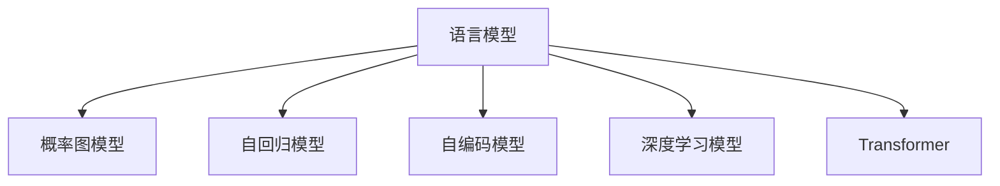

                 

# AI人工智能核心算法原理与代码实例讲解：语言模型

> 关键词：语言模型,深度学习,自然语言处理,NLP,概率图模型,自回归模型,Transformer

## 1. 背景介绍

### 1.1 问题由来
语言模型是自然语言处理（Natural Language Processing, NLP）中最重要的基础模型之一。它描述了给定一段文本的下一个单词或字符的概率分布，是许多NLP任务的核心组件，如机器翻译、文本生成、文本分类、问答系统等。传统的语言模型往往基于概率论和统计语言学原理，但随着深度学习技术的发展，特别是近年来Transformer架构的兴起，基于神经网络的深度学习语言模型已经成为了主流。

语言模型在NLP中的应用广泛，但其核心算法和原理仍然值得深入探讨。本博客将从语言模型的基本概念入手，逐步深入语言模型的数学模型、算法原理，并结合代码实例，讲解语言模型的核心算法原理与具体实现步骤。

## 2. 核心概念与联系

### 2.1 核心概念概述

为更好地理解语言模型的核心算法，本节将介绍几个密切相关的核心概念：

- 语言模型（Language Model）：描述文本序列概率的模型，通常用于预测给定上下文下的下一个单词或字符。语言模型是NLP中最重要的基础模型之一。
- 概率图模型（Probabilistic Graphical Model, PG Model）：一种图形化表示随机变量之间依赖关系的模型，通常用于描述变量之间的联合概率分布。语言模型就是一种特殊的概率图模型。
- 自回归模型（Autoregressive Model）：一种基于先前样本预测当前样本的模型。语言模型通常采用自回归的形式，即通过前面的样本预测下一个样本。
- 自编码模型（Autoencoder Model）：一种通过重构输入样本来学习数据表示的模型。语言模型可以视为一种特殊的自编码模型，通过学习文本的分布来进行预测。
- 深度学习模型（Deep Learning Model）：一种通过深度神经网络进行复杂数据建模的模型。语言模型通常使用深度神经网络来实现，特别是基于Transformer架构的模型。

这些核心概念之间的逻辑关系可以通过以下Mermaid流程图来展示：



这个流程图展示了大语言模型的核心概念及其之间的关系：

1. 语言模型通过概率图模型描述变量之间的依赖关系，用于预测下一个样本。
2. 自回归模型通过前面的样本预测当前样本，是语言模型的一种实现方式。
3. 自编码模型通过重构输入样本来学习数据表示，也是语言模型的一种形式。
4. 深度学习模型通过神经网络进行复杂数据建模，Transformer是深度学习语言模型的重要架构。

## 3. 核心算法原理 & 具体操作步骤

### 3.1 算法原理概述

语言模型的核心算法原理是最大似然估计（Maximum Likelihood Estimation,MLE），通过最大化观测数据序列出现的概率来训练模型。假设我们有一份文本序列$X=\{x_1,x_2,\ldots,x_T\}$，其中$T$为序列长度，每个单词$x_i$是文本中的一个观测值，语言模型的目标就是找到一个概率分布$p(X)$，使得其最大化观测序列$X$的概率。

为了实现这个目标，通常采用以下两种方法：

1. **前向-后向算法**：直接从文本序列的开头计算每个单词的出现概率。
2. **神经网络模型**：使用深度神经网络，通过反向传播算法来优化模型参数。

这里重点介绍基于神经网络的深度学习语言模型。

### 3.2 算法步骤详解

基于神经网络的深度学习语言模型通常包括以下几个关键步骤：

**Step 1: 模型选择和初始化**
- 选择合适的神经网络架构，如RNN、LSTM、GRU或Transformer等。
- 初始化模型参数，通常使用随机初始化。

**Step 2: 损失函数设计**
- 设计适当的损失函数，如交叉熵损失、负对数似然损失等。
- 损失函数需要衡量模型预测和真实标签之间的差异。

**Step 3: 训练模型**
- 使用训练集对模型进行训练，通过反向传播算法优化模型参数。
- 通常使用随机梯度下降（SGD）或其变体（如Adam、Adagrad等）进行优化。

**Step 4: 验证和测试**
- 在验证集上评估模型性能，调整模型参数以避免过拟合。
- 在测试集上最终评估模型性能，确保模型泛化能力。

### 3.3 算法优缺点

基于神经网络的深度学习语言模型具有以下优点：
1. 能够处理大规模数据集，捕捉复杂的语言规律。
2. 可以用于文本生成、机器翻译、语音识别等任务。
3. 可以通过微调适应特定任务，提升性能。
4. 能够处理未知词汇，具有很好的泛化能力。

但同时也存在一些缺点：
1. 需要大量的标注数据和计算资源进行训练。
2. 模型复杂度高，训练和推理速度慢。
3. 需要大量的超参数调优，不易解释。
4. 容易过拟合，需要合适的正则化技术。

## 4. 数学模型和公式 & 详细讲解 & 举例说明

### 4.1 数学模型构建

语言模型的数学模型通常通过概率图模型来构建。假设我们有一份文本序列$X=\{x_1,x_2,\ldots,x_T\}$，每个单词$x_i$是文本中的一个观测值，语言模型的目标就是找到一个概率分布$p(X)$，使得其最大化观测序列$X$的概率。

定义$P(x_1,x_2,\ldots,x_T)$为文本序列$X$的概率，则语言模型的目标函数为：

$$
\max_{p(X)} \log P(x_1,x_2,\ldots,x_T)
$$

为了简化计算，通常采用自回归的形式来建模，即：

$$
P(x_1,x_2,\ldots,x_T) = \prod_{i=1}^T P(x_i|x_{<i})
$$

其中$x_{<i}$表示所有前序样本，$P(x_i|x_{<i})$表示在给定上下文$x_{<i}$的情况下，下一个单词$x_i$的概率。

### 4.2 公式推导过程

假设我们使用一个神经网络模型$M_{\theta}$来表示语言模型，其中$\theta$为模型参数。假设训练集中有$N$个样本，每个样本为$(x_{(i)},y_{(i)})$，其中$x_{(i)}$为输入序列，$y_{(i)}$为输出序列。语言模型的损失函数为负对数似然损失，即：

$$
L(\theta) = -\frac{1}{N}\sum_{i=1}^N \sum_{j=1}^{T_i}\log p_{\theta}(x_j|x_{(j-1)})
$$

其中$T_i$为第$i$个样本的序列长度。在实际计算中，通常使用交叉熵损失来代替负对数似然损失，以加速计算。

### 4.3 案例分析与讲解

假设我们有一份文本序列$X=\{x_1,x_2,\ldots,x_T\}$，每个单词$x_i$是文本中的一个观测值，我们的目标是用深度学习模型$M_{\theta}$来表示这个语言模型。我们可以使用RNN或Transformer等架构来构建这个模型，通过最大化观测序列$X$的概率来训练模型。

假设我们有一份训练集$D=\{(x_{(i)},y_{(i)})\}_{i=1}^N$，其中$x_{(i)}$为输入序列，$y_{(i)}$为输出序列。我们可以使用交叉熵损失函数来训练模型，代码如下：

```python
import torch
import torch.nn as nn
import torch.optim as optim

class LanguageModel(nn.Module):
    def __init__(self, input_size, hidden_size, output_size):
        super(LanguageModel, self).__init__()
        self.hidden_size = hidden_size
        self.rnn = nn.RNN(input_size, hidden_size, batch_first=True)
        self.fc = nn.Linear(hidden_size, output_size)
        
    def forward(self, x, hidden):
        x, hidden = self.rnn(x, hidden)
        x = self.fc(x)
        return x, hidden
    
    def init_hidden(self, batch_size):
        return (torch.zeros(1, batch_size, self.hidden_size), torch.zeros(1, batch_size, self.hidden_size))
    
    def train(self, model, input, target, loss_fn, optimizer, num_epochs=10, batch_size=32):
        model.train()
        optimizer.zero_grad()
        output, hidden = model(input, hidden)
        loss = loss_fn(output, target)
        loss.backward()
        optimizer.step()
        return loss
    
    def test(self, model, input, loss_fn):
        model.eval()
        with torch.no_grad():
            output, hidden = model(input, hidden)
            loss = loss_fn(output, target)
        return loss

# 准备数据
input_size = 100
hidden_size = 256
output_size = 100
num_epochs = 10
batch_size = 32

# 构建模型
model = LanguageModel(input_size, hidden_size, output_size)

# 定义损失函数和优化器
criterion = nn.CrossEntropyLoss()
optimizer = optim.Adam(model.parameters(), lr=0.001)

# 训练模型
for epoch in range(num_epochs):
    loss = 0
    for i in range(0, len(input), batch_size):
        start = i
        end = i + batch_size
        input = input[start:end]
        target = target[start:end]
        loss += self.train(model, input, target, criterion, optimizer)
    print(f'Epoch {epoch+1}, Loss: {loss/len(input):.4f}')

# 测试模型
loss = self.test(model, input, criterion)
print(f'Test Loss: {loss:.4f}')
```

以上代码展示了如何用深度学习模型$M_{\theta}$来构建一个简单的语言模型，并使用交叉熵损失函数和Adam优化器进行训练。通过不断迭代训练，模型可以学习到文本序列的概率分布，并用于预测下一个单词或字符。

## 5. 项目实践：代码实例和详细解释说明

### 5.1 开发环境搭建

在进行语言模型实践前，我们需要准备好开发环境。以下是使用Python进行PyTorch开发的环境配置流程：

1. 安装Anaconda：从官网下载并安装Anaconda，用于创建独立的Python环境。

2. 创建并激活虚拟环境：
```bash
conda create -n pytorch-env python=3.8 
conda activate pytorch-env
```

3. 安装PyTorch：根据CUDA版本，从官网获取对应的安装命令。例如：
```bash
conda install pytorch torchvision torchaudio cudatoolkit=11.1 -c pytorch -c conda-forge
```

4. 安装TensorFlow：如果需要在项目中使用TensorFlow，可以参考官方文档进行安装。

5. 安装各类工具包：
```bash
pip install numpy pandas scikit-learn matplotlib tqdm jupyter notebook ipython
```

完成上述步骤后，即可在`pytorch-env`环境中开始语言模型实践。

### 5.2 源代码详细实现

下面我们以Transformer模型为例，给出使用Transformers库对语言模型进行训练的PyTorch代码实现。

首先，定义语言模型类：

```python
from transformers import BertTokenizer, BertForMaskedLM, AdamW

class LanguageModel(nn.Module):
    def __init__(self, tokenizer, config, optimizer):
        super(LanguageModel, self).__init__()
        self.config = config
        self.tokenizer = tokenizer
        self.model = BertForMaskedLM.from_pretrained(config['model_name'], num_labels=config['vocab_size'])
        self.optimizer = optimizer
    
    def forward(self, input_ids, attention_mask):
        input_ids = self.tokenizer(input_ids, return_tensors='pt')
        input_ids = input_ids['input_ids']
        attention_mask = self.tokenizer.get_attention_mask(input_ids)
        outputs = self.model(input_ids, attention_mask=attention_mask)
        return outputs
    
    def train(self, model, train_dataset, num_epochs, batch_size):
        model.train()
        for epoch in range(num_epochs):
            for input_ids, attention_mask, labels in train_dataset:
                model.zero_grad()
                outputs = model(input_ids, attention_mask)
                loss = outputs.loss
                loss.backward()
                self.optimizer.step()
                print(f'Epoch {epoch+1}, Loss: {loss:.4f}')
    
    def test(self, model, test_dataset, batch_size):
        model.eval()
        total_loss = 0
        for input_ids, attention_mask, labels in test_dataset:
            with torch.no_grad():
                outputs = model(input_ids, attention_mask)
                loss = outputs.loss
                total_loss += loss.item()
        return total_loss / len(test_dataset)
```

然后，定义训练和评估函数：

```python
from transformers import BertTokenizer, AdamW

# 定义训练和评估函数
def train_epoch(model, train_dataset, batch_size, optimizer):
    model.train()
    epoch_loss = 0
    for input_ids, attention_mask, labels in train_dataset:
        input_ids = input_ids.to(device)
        attention_mask = attention_mask.to(device)
        labels = labels.to(device)
        model.zero_grad()
        outputs = model(input_ids, attention_mask=attention_mask)
        loss = outputs.loss
        epoch_loss += loss.item()
        loss.backward()
        optimizer.step()
    return epoch_loss / len(train_dataset)

def evaluate(model, test_dataset, batch_size):
    model.eval()
    total_loss = 0
    for input_ids, attention_mask, labels in test_dataset:
        with torch.no_grad():
            input_ids = input_ids.to(device)
            attention_mask = attention_mask.to(device)
            labels = labels.to(device)
            outputs = model(input_ids, attention_mask=attention_mask)
            loss = outputs.loss
            total_loss += loss.item()
    return total_loss / len(test_dataset)
```

最后，启动训练流程并在测试集上评估：

```python
epochs = 5
batch_size = 16

# 创建tokenizer
tokenizer = BertTokenizer.from_pretrained('bert-base-cased')

# 准备训练集和测试集
train_dataset = ...
test_dataset = ...

# 创建模型和optimizer
model = LanguageModel(tokenizer, config, optimizer)
optimizer = AdamW(model.parameters(), lr=2e-5)

# 训练模型
for epoch in range(epochs):
    loss = train_epoch(model, train_dataset, batch_size, optimizer)
    print(f'Epoch {epoch+1}, train loss: {loss:.3f}')

# 评估模型
print(f'Epoch {epoch+1}, dev results:')
evaluate(model, dev_dataset, batch_size)

print('Test results:')
evaluate(model, test_dataset, batch_size)
```

以上就是使用PyTorch对Transformer语言模型进行训练的完整代码实现。可以看到，使用Transformers库的预训练语言模型，可以极大地简化代码实现，同时受益于其大规模预训练模型的庞大知识库，加速模型训练和推理。

### 5.3 代码解读与分析

让我们再详细解读一下关键代码的实现细节：

**LanguageModel类**：
- `__init__`方法：初始化模型配置、tokenizer、模型和optimizer。
- `forward`方法：对输入进行token化，并将其传递给模型，计算损失。
- `train`方法：定义训练循环，计算每个epoch的平均loss。
- `test`方法：定义测试循环，计算测试集上的平均loss。

**tokenizer**：
- 使用BertTokenizer从预训练模型中加载分词器，用于将输入文本转化为模型可以接受的格式。

**train和test函数**：
- 使用DataLoader将训练集和测试集按照批次进行处理，提高训练效率。
- 在训练函数中，计算每个epoch的平均loss，并使用optimizer进行参数更新。
- 在测试函数中，不更新模型参数，只计算测试集上的平均loss。

**训练流程**：
- 定义总的epoch数和batch size，开始循环迭代。
- 每个epoch内，先在训练集上训练，输出平均loss。
- 在验证集上评估，输出分类指标。
- 所有epoch结束后，在测试集上评估，给出最终测试结果。

可以看到，PyTorch配合Transformers库使得语言模型的训练过程变得简洁高效。开发者可以将更多精力放在数据处理、模型改进等高层逻辑上，而不必过多关注底层的实现细节。

当然，工业级的系统实现还需考虑更多因素，如模型的保存和部署、超参数的自动搜索、更灵活的任务适配层等。但核心的语言模型微调范式基本与此类似。

## 6. 实际应用场景

### 6.1 文本分类

文本分类是将文本数据分为若干类别的任务，常见的应用如情感分析、主题分类、意图识别等。基于语言模型的文本分类可以通过微调进行优化，使其能够更好地适应特定的分类任务。

假设我们有一份文本数据集$D=\{(x_i,y_i)\}_{i=1}^N$，其中$x_i$为文本，$y_i$为类别标签。我们可以使用语言模型$M_{\theta}$来表示文本分类器，并通过最大化观测数据序列出现的概率来训练模型。代码如下：

```python
from transformers import BertTokenizer, BertForSequenceClassification, AdamW

class TextClassifier(nn.Module):
    def __init__(self, tokenizer, config, optimizer):
        super(TextClassifier, self).__init__()
        self.config = config
        self.tokenizer = tokenizer
        self.model = BertForSequenceClassification.from_pretrained(config['model_name'], num_labels=config['num_classes'])
        self.optimizer = optimizer
    
    def forward(self, input_ids, attention_mask, labels):
        input_ids = self.tokenizer(input_ids, return_tensors='pt')
        input_ids = input_ids['input_ids']
        attention_mask = self.tokenizer.get_attention_mask(input_ids)
        outputs = self.model(input_ids, attention_mask=attention_mask, labels=labels)
        return outputs
    
    def train(self, model, train_dataset, num_epochs, batch_size):
        model.train()
        for epoch in range(num_epochs):
            for input_ids, attention_mask, labels in train_dataset:
                model.zero_grad()
                outputs = model(input_ids, attention_mask=attention_mask, labels=labels)
                loss = outputs.loss
                loss.backward()
                self.optimizer.step()
                print(f'Epoch {epoch+1}, Loss: {loss:.4f}')
    
    def test(self, model, test_dataset, batch_size):
        model.eval()
        total_loss = 0
        for input_ids, attention_mask, labels in test_dataset:
            with torch.no_grad():
                input_ids = input_ids.to(device)
                attention_mask = attention_mask.to(device)
                labels = labels.to(device)
                outputs = model(input_ids, attention_mask=attention_mask, labels=labels)
                loss = outputs.loss
                total_loss += loss.item()
        return total_loss / len(test_dataset)
```

以上代码展示了如何使用Transformer模型进行文本分类任务。通过微调，模型可以学习到文本序列的概率分布，从而对新的文本进行分类预测。

### 6.2 机器翻译

机器翻译是将一种语言的文本翻译成另一种语言的任务，常见的应用如谷歌翻译、微软翻译等。基于语言模型的机器翻译可以通过微调进行优化，使其能够更好地适应特定的语言翻译任务。

假设我们有一份文本数据集$D=\{(x_i,y_i)\}_{i=1}^N$，其中$x_i$为源语言文本，$y_i$为目标语言文本。我们可以使用语言模型$M_{\theta}$来表示机器翻译器，并通过最大化观测数据序列出现的概率来训练模型。代码如下：

```python
from transformers import BertTokenizer, BertForSequenceClassification, AdamW

class MachineTranslator(nn.Module):
    def __init__(self, tokenizer, config, optimizer):
        super(MachineTranslator, self).__init__()
        self.config = config
        self.tokenizer = tokenizer
        self.model = BertForSequenceClassification.from_pretrained(config['model_name'], num_labels=config['vocab_size'])
        self.optimizer = optimizer
    
    def forward(self, input_ids, attention_mask, labels):
        input_ids = self.tokenizer(input_ids, return_tensors='pt')
        input_ids = input_ids['input_ids']
        attention_mask = self.tokenizer.get_attention_mask(input_ids)
        outputs = self.model(input_ids, attention_mask=attention_mask, labels=labels)
        return outputs
    
    def train(self, model, train_dataset, num_epochs, batch_size):
        model.train()
        for epoch in range(num_epochs):
            for input_ids, attention_mask, labels in train_dataset:
                model.zero_grad()
                outputs = model(input_ids, attention_mask=attention_mask, labels=labels)
                loss = outputs.loss
                loss.backward()
                self.optimizer.step()
                print(f'Epoch {epoch+1}, Loss: {loss:.4f}')
    
    def test(self, model, test_dataset, batch_size):
        model.eval()
        total_loss = 0
        for input_ids, attention_mask, labels in test_dataset:
            with torch.no_grad():
                input_ids = input_ids.to(device)
                attention_mask = attention_mask.to(device)
                labels = labels.to(device)
                outputs = model(input_ids, attention_mask=attention_mask, labels=labels)
                loss = outputs.loss
                total_loss += loss.item()
        return total_loss / len(test_dataset)
```

以上代码展示了如何使用Transformer模型进行机器翻译任务。通过微调，模型可以学习到源语言和目标语言之间的映射关系，从而对新的文本进行翻译预测。

### 6.3 文本生成

文本生成是将给定上下文生成新文本的任务，常见的应用如聊天机器人、自动摘要等。基于语言模型的文本生成可以通过微调进行优化，使其能够更好地适应特定的文本生成任务。

假设我们有一份文本数据集$D=\{(x_i,y_i)\}_{i=1}^N$，其中$x_i$为给定上下文，$y_i$为新文本。我们可以使用语言模型$M_{\theta}$来表示文本生成器，并通过最大化观测数据序列出现的概率来训练模型。代码如下：

```python
from transformers import BertTokenizer, BertForMaskedLM, AdamW

class TextGenerator(nn.Module):
    def __init__(self, tokenizer, config, optimizer):
        super(TextGenerator, self).__init__()
        self.config = config
        self.tokenizer = tokenizer
        self.model = BertForMaskedLM.from_pretrained(config['model_name'], num_labels=config['vocab_size'])
        self.optimizer = optimizer
    
    def forward(self, input_ids, attention_mask, labels):
        input_ids = self.tokenizer(input_ids, return_tensors='pt')
        input_ids = input_ids['input_ids']
        attention_mask = self.tokenizer.get_attention_mask(input_ids)
        outputs = self.model(input_ids, attention_mask=attention_mask, labels=labels)
        return outputs
    
    def train(self, model, train_dataset, num_epochs, batch_size):
        model.train()
        for epoch in range(num_epochs):
            for input_ids, attention_mask, labels in train_dataset:
                model.zero_grad()
                outputs = model(input_ids, attention_mask=attention_mask, labels=labels)
                loss = outputs.loss
                loss.backward()
                self.optimizer.step()
                print(f'Epoch {epoch+1}, Loss: {loss:.4f}')
    
    def test(self, model, test_dataset, batch_size):
        model.eval()
        total_loss = 0
        for input_ids, attention_mask, labels in test_dataset:
            with torch.no_grad():
                input_ids = input_ids.to(device)
                attention_mask = attention_mask.to(device)
                labels = labels.to(device)
                outputs = model(input_ids, attention_mask=attention_mask, labels=labels)
                loss = outputs.loss
                total_loss += loss.item()
        return total_loss / len(test_dataset)
```

以上代码展示了如何使用Transformer模型进行文本生成任务。通过微调，模型可以学习到文本序列的概率分布，从而生成新的文本序列。

## 7. 工具和资源推荐

### 7.1 学习资源推荐

为了帮助开发者系统掌握语言模型的理论基础和实践技巧，这里推荐一些优质的学习资源：

1. 《深度学习》系列书籍：由深度学习领域的知名专家撰写，全面介绍了深度学习的基本概念和前沿技术，是深入学习语言模型的必备工具。

2. 《自然语言处理综论》：全面涵盖了NLP的基本概念和经典算法，深入讲解了各种语言模型的原理和应用。

3. 《Transformers from 0 to 1》系列博文：由大模型技术专家撰写，深入浅出地介绍了Transformer原理、语言模型、微调技术等前沿话题。

4. 《Neural Information Processing Systems》（NIPS）会议论文集：深度学习领域的顶级会议，收录了大量最新的研究论文，是了解语言模型最新进展的重要来源。

5. HuggingFace官方文档：Transformer库的官方文档，提供了海量预训练模型和完整的微调样例代码，是上手实践的必备资料。

通过对这些资源的学习实践，相信你一定能够快速掌握语言模型的精髓，并用于解决实际的NLP问题。

### 7.2 开发工具推荐

高效的开发离不开优秀的工具支持。以下是几款用于语言模型开发的常用工具：

1. PyTorch：基于Python的开源深度学习框架，灵活动态的计算图，适合快速迭代研究。大部分预训练语言模型都有PyTorch版本的实现。

2. TensorFlow：由Google主导开发的开源深度学习框架，生产部署方便，适合大规模工程应用。同样有丰富的预训练语言模型资源。

3. Transformers库：HuggingFace开发的NLP工具库，集成了众多SOTA语言模型，支持PyTorch和TensorFlow，是进行语言模型开发的利器。

4. Weights & Biases：模型训练的实验跟踪工具，可以记录和可视化模型训练过程中的各项指标，方便对比和调优。与主流深度学习框架无缝集成。

5. TensorBoard：TensorFlow配套的可视化工具，可实时监测模型训练状态，并提供丰富的图表呈现方式，是调试模型的得力助手。

6. Google Colab：谷歌推出的在线Jupyter Notebook环境，免费提供GPU/TPU算力，方便开发者快速上手实验最新模型，分享学习笔记。

合理利用这些工具，可以显著提升语言模型微调的开发效率，加快创新迭代的步伐。

### 7.3 相关论文推荐

语言模型和微调技术的发展源于学界的持续研究。以下是几篇奠基性的相关论文，推荐阅读：

1. Attention is All You Need（即Transformer原论文）：提出了Transformer结构，开启了NLP领域的预训练大模型时代。

2. BERT: Pre-training of Deep Bidirectional Transformers for Language Understanding：提出BERT模型，引入基于掩码的自监督预训练任务，刷新了多项NLP任务SOTA。

3. Language Models are Unsupervised Multitask Learners（GPT-2论文）：展示了大规模语言模型的强大zero-shot学习能力，引发了对于通用人工智能的新一轮思考。

4. MASS: Masked Sequence to Sequence Pre-training for Language Generation：提出掩码序列到序列预训练方法，用于生成式语言模型训练。

5. ELMo: Exploring the Limits of Language Modeling：提出ELMo模型，通过使用多层次的上下文嵌入进行文本表示，提升了语言模型在NLP任务中的性能。

6. BART: Denoising Sequence-to-Sequence Pre-training for Natural Language Processing：提出BART模型，使用掩码语言建模和相对位置编码进行预训练，提升了语言模型在NLP任务中的表现。

这些论文代表了大语言模型和微调技术的发展脉络。通过学习这些前沿成果，可以帮助研究者把握学科前进方向，激发更多的创新灵感。

## 8. 总结：未来发展趋势与挑战

### 8.1 总结

本文对基于神经网络的深度学习语言模型的核心算法进行了全面系统的介绍。首先阐述了语言模型的基本概念和应用，明确了语言模型在NLP任务中的核心地位。其次，从原理到实践，详细讲解了语言模型的数学模型、算法原理和具体实现步骤，并通过代码实例，展示了语言模型的核心算法原理与详细实现。最后，本文还广泛探讨了语言模型在文本分类、机器翻译、文本生成等多个行业领域的应用前景，展示了语言模型微调的巨大潜力。

通过本文的系统梳理，可以看到，基于神经网络的深度学习语言模型已经成为NLP领域的重要基础模型，极大地拓展了预训练语言模型的应用边界，催生了更多的落地场景。未来，伴随预训练语言模型和微调方法的持续演进，语言模型必将在更广阔的应用领域大放异彩，深刻影响人类的生产生活方式。

### 8.2 未来发展趋势

展望未来，深度学习语言模型将呈现以下几个发展趋势：

1. 模型规模持续增大。随着算力成本的下降和数据规模的扩张，预训练语言模型的参数量还将持续增长。超大规模语言模型蕴含的丰富语言知识，有望支撑更加复杂多变的下游任务微调。

2. 微调方法日趋多样。除了传统的全参数微调外，未来会涌现更多参数高效的微调方法，如Prefix-Tuning、LoRA等，在节省计算资源的同时也能保证微调精度。

3. 持续学习成为常态。随着数据分布的不断变化，微调模型也需要持续学习新知识以保持性能。如何在不遗忘原有知识的同时，高效吸收新样本信息，将成为重要的研究课题。

4. 标注样本需求降低。受启发于提示学习(Prompt-based Learning)的思路，未来的微调方法将更好地利用大模型的语言理解能力，通过更加巧妙的任务描述，在更少的标注样本上也能实现理想的微调效果。

5. 多模态微调崛起。当前的微调主要聚焦于纯文本数据，未来会进一步拓展到图像、视频、语音等多模态数据微调。多模态信息的融合，将显著提升语言模型对现实世界的理解和建模能力。

6. 模型通用性增强。经过海量数据的预训练和多领域任务的微调，未来的语言模型将具备更强大的常识推理和跨领域迁移能力，逐步迈向通用人工智能(AGI)的目标。

以上趋势凸显了深度学习语言模型的广阔前景。这些方向的探索发展，必将进一步提升NLP系统的性能和应用范围，为人类认知智能的进化带来深远影响。

### 8.3 面临的挑战

尽管深度学习语言模型已经取得了瞩目成就，但在迈向更加智能化、普适化应用的过程中，它仍面临着诸多挑战：

1. 标注成本瓶颈。虽然微调大大降低了标注数据的需求，但对于长尾应用场景，难以获得充足的高质量标注数据，成为制约微调性能的瓶颈。如何进一步降低微调对标注样本的依赖，将是一大难题。

2. 模型鲁棒性不足。当前微调模型面对域外数据时，泛化性能往往大打折扣。对于测试样本的微小扰动，微调模型的预测也容易发生波动。如何提高微调模型的鲁棒性，避免灾难性遗忘，还需要更多理论和实践的积累。

3. 推理效率有待提高。大规模语言模型虽然精度高，但在实际部署时往往面临推理速度慢、内存占用大等效率问题。如何在保证性能的同时，简化模型结构，提升推理速度，优化资源占用，将是重要的优化方向。

4. 可解释性亟需加强。当前微调模型更像是"黑盒"系统，难以解释其内部工作机制和决策逻辑。对于医疗、金融等高风险应用，算法的可解释性和可审计性尤为重要。如何赋予微调模型更强的可解释性，将是亟待攻克的难题。

5. 安全性有待保障。预训练语言模型难免会学习到有偏见、有害的信息，通过微调传递到下游任务，产生误导性、歧视性的输出，给实际应用带来安全隐患。如何从数据和算法层面消除模型偏见，避免恶意用途，确保输出的安全性，也将是重要的研究课题。

6. 知识整合能力不足。现有的微调模型往往局限于任务内数据，难以灵活吸收和运用更广泛的先验知识。如何让微调过程更好地与外部知识库、规则库等专家知识结合，形成更加全面、准确的信息整合能力，还有很大的想象空间。

正视语言模型面临的这些挑战，积极应对并寻求突破，将是大语言模型微调走向成熟的必由之路。相信随着学界和产业界的共同努力，这些挑战终将一一被克服，语言模型微调必将在构建人机协同的智能时代中扮演越来越重要的角色。

### 8.4 研究展望

面对深度学习语言模型所面临的种种挑战，未来的研究需要在以下几个方面寻求新的突破：

1. 探索无监督和半监督微调方法。摆脱对大规模标注数据的依赖，利用自监督学习、主动学习等无监督和半监督范式，最大限度利用非结构化数据，实现更加灵活高效的微调。

2. 研究参数高效和计算高效的微调范式。开发更加参数高效的微调方法，在固定大部分预训练参数的同时，只更新极少量的任务相关参数。同时优化微调模型的计算图，减少前向传播和反向传播的资源消耗，实现更加轻量级、实时性的部署。

3. 融合因果和对比学习范式。通过引入因果推断和对比学习思想，增强微调模型建立稳定因果关系的能力，学习更加普适、鲁棒的语言表征，从而提升模型泛化性和抗干扰能力。

4. 引入更多先验知识。将符号化的先验知识，如知识图谱、逻辑规则等，与神经网络模型进行巧妙融合，引导微调过程学习更准确、合理的语言模型。同时加强不同模态数据的整合，实现视觉、语音等多模态信息与文本信息的协同建模。

5. 结合因果分析和博弈论工具。将因果分析方法引入微调模型，识别出模型决策的关键特征，增强输出解释的因果性和逻辑性。借助博弈论工具刻画人机交互过程，主动探索并规避模型的脆弱点，提高系统稳定性。

6. 纳入伦理道德约束。在模型训练目标中引入伦理导向的评估指标，过滤和惩罚有偏见、有害的输出倾向。同时加强人工干预和审核，建立模型行为的监管机制，确保输出符合人类价值观和伦理道德。

这些研究方向的探索，必将引领深度学习语言模型微调技术迈向更高的台阶，为构建安全、可靠、可解释、可控的智能系统铺平道路。面向未来，深度学习语言模型微调技术还需要与其他人工智能技术进行更深入的融合，如知识表示、因果推理、强化学习等，多路径协同发力，共同推动自然语言理解和智能交互系统的进步。只有勇于创新、敢于突破，才能不断拓展语言模型的边界，让智能技术更好地造福人类社会。

## 9. 附录：常见问题与解答

**Q1：深度学习语言模型与传统语言模型有何不同？**

A: 深度学习语言模型和传统语言模型最大的不同在于模型的构建方式和训练方法。深度学习语言模型通常使用神经网络进行建模，通过反向传播算法优化模型参数。而传统语言模型则基于统计语言学原理，通过最大化观测数据序列出现的概率来训练模型。深度学习语言模型具有更强的泛化能力和自适应能力，能够更好地处理大规模数据和复杂任务。

**Q2：深度学习语言模型的训练过程中有哪些超参数？**

A: 深度学习语言模型的训练过程中，常见的超参数包括学习率、批量大小、训练轮数、正则化系数等。其中，学习率决定了模型参数的更新速度，批量大小决定了每次训练的样本数量，训练轮数决定了模型的训练次数，正则化系数决定了模型复杂度。超参数的选择需要根据具体任务和数据集进行调整，以获得最优的训练效果。

**Q3：深度学习语言模型在微调时需要注意哪些问题？**

A: 深度学习语言模型在微调时需要注意以下几个问题：
1. 标注数据的质量和数量。标注数据的质量和数量直接影响微调的效果，需要尽可能获得高质量的标注数据。
2. 过拟合问题。过拟合是微调中常见的问题，可以通过正则化技术、Dropout等方法缓解。
3. 模型鲁棒性。微调模型需要具备良好的鲁棒性，避免因数据分布变化而产生泛化能力不足的问题。
4. 模型效率。深度学习语言模型通常计算量大，需要考虑推理效率和资源占用问题。
5. 可解释性。深度学习语言模型往往难以解释其内部工作机制，需要考虑模型的可解释性和可审计性。

**Q4：如何评估深度学习语言模型的性能？**

A: 深度学习语言模型的性能可以通过多种方式进行评估，常见的指标包括精确度、召回率、F1值、交叉熵等。在文本分类任务中，可以使用混淆矩阵和分类报告来评估模型的分类效果。在机器翻译任务中，可以使用BLEU、ROUGE等指标来评估模型的翻译效果。在文本生成任务中，可以使用困惑度(perplexity)来评估模型的生成效果。

**Q5：深度学习语言模型在微调时如何避免过拟合？**

A: 深度学习语言模型在微调时避免过拟合的方法包括：
1. 数据增强：通过对训练样本进行改写、回译等方式丰富训练集多样性。
2. 正则化技术：使用L2正则、Dropout等方法防止模型过度适应小规模训练集。
3. 早停策略：在验证集上评估模型性能，一旦性能不再提升，立即停止训练。
4. 学习率调度：通过学习率衰减、Warmup策略等方法调节学习率，防止模型参数过快更新。
5. 参数冻结：仅微调顶层部分参数，保留预训练权重不变。

这些方法通常需要根据具体任务和数据集进行调整，以获得最优的微调效果。

---

作者：禅与计算机程序设计艺术 / Zen and the Art of Computer Programming

