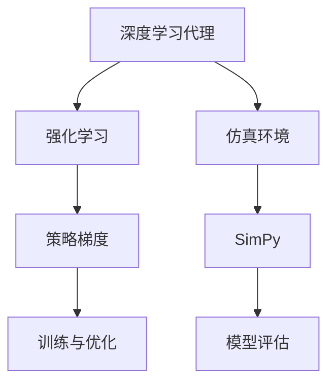

                 

# AI人工智能深度学习算法：仿真环境中深度学习代理的实验与评估

## 1. 背景介绍

随着人工智能技术的迅猛发展，深度学习在智能体仿真环境中扮演着越来越重要的角色。在各种复杂多变的环境中，智能体通过学习环境特征，规划行为策略，以实现最大化目标。这些智能体往往采用深度学习方法进行学习和决策。

为进一步验证和评估深度学习代理在仿真环境中的表现，本文将详细阐述深度学习代理在仿真环境中的应用，并基于SimPy框架，设计一个智能体仿真实验，进行模型评估。通过分析评估结果，将进一步探讨深度学习代理在仿真环境中的优缺点、应用场景和未来研究方向。

## 2. 核心概念与联系

### 2.1 核心概念概述

本节将详细介绍与深度学习代理仿真实验相关的核心概念：

- **深度学习代理**：基于深度学习模型的智能体，通过训练学习环境特征与行为策略之间的映射关系，实现自主决策。
- **仿真环境**：模拟真实世界的虚拟环境，通过数学模型或模拟软件构建，可为智能体提供一致、可控的实验环境。
- **SimPy**：Python编程语言中的一个过程模拟库，用于构建和运行仿真模型，支持多进程、时间驱动等高级特性。
- **强化学习**：基于奖励机制，智能体通过试错学习最优策略的机器学习方法，广泛应用于仿真环境的深度学习代理中。
- **策略梯度**：强化学习中用于优化智能体策略的一种方法，通过反向传播策略更新参数，最大化累计回报。

### 2.2 核心概念原理和架构的 Mermaid 流程图



这个流程图展示了深度学习代理在仿真环境中的核心概念及其联系：

1. 深度学习代理通过强化学习中的策略梯度方法，训练学习环境特征与行为策略之间的映射。
2. SimPy作为仿真环境构建工具，为智能体提供虚拟测试环境。
3. SimPy模型评估模块用于对训练完成的代理模型进行评估。
4. 训练与优化模块确保模型参数在仿真环境中的最佳表现。

## 3. 核心算法原理 & 具体操作步骤

### 3.1 算法原理概述

深度学习代理在仿真环境中的核心算法原理包括：

1. **环境感知**：代理通过感知模块获取环境状态，并将其转换为可训练的特征向量。
2. **行为决策**：代理利用学习到的策略，通过动作选择模块选取当前行为。
3. **环境反馈**：代理将动作反馈至环境，并接收奖励信号。
4. **参数更新**：代理通过策略梯度方法，更新模型参数，以最大化累计回报。

### 3.2 算法步骤详解

**Step 1: 环境构建**
- 设计仿真环境模型，使用SimPy定义环境规则和状态转移。
- 在仿真环境中定义动作空间，如移动、获取资源等。

**Step 2: 代理初始化**
- 初始化代理模型，如Q网络、策略网络等，设置模型参数。
- 使用随机策略或预训练策略进行代理初始化。

**Step 3: 训练与优化**
- 在仿真环境中模拟智能体行为，进行多轮交互。
- 计算智能体的累计回报，并反向传播更新模型参数。
- 应用策略梯度算法优化代理模型，提升决策性能。

**Step 4: 模型评估**
- 在仿真环境中测试训练完成的代理模型。
- 评估智能体在多种条件下的性能指标，如回报、成功率等。
- 分析代理在仿真环境中的优缺点。

### 3.3 算法优缺点

深度学习代理在仿真环境中的优点包括：

- **自主学习**：通过深度学习方法，代理能够在复杂环境中自主学习决策策略。
- **可扩展性**：代理模型易于扩展和应用，适合于多种场景的仿真环境。
- **鲁棒性**：代理模型通过大量仿真实验验证，具备一定程度的鲁棒性和泛化能力。

同时，深度学习代理也存在一些局限：

- **数据依赖**：代理模型的训练和评估依赖于大量仿真数据，数据质量对模型性能有重要影响。
- **参数调优**：代理模型参数较多，调优复杂，容易陷入局部最优解。
- **计算资源消耗**：深度学习代理训练和评估过程计算量大，资源消耗较高。

### 3.4 算法应用领域

深度学习代理在仿真环境中的应用领域广泛，包括但不限于：

- **智能交通系统**：模拟城市交通环境，优化车辆通行路线。
- **医疗系统模拟**：模拟医院诊疗流程，优化医疗资源分配。
- **智能制造系统**：模拟工厂生产环境，优化生产流程和设备配置。
- **机器人仿真**：模拟机器人在各种环境中的行为，提升导航和操作能力。
- **金融市场仿真**：模拟股票、期货市场，分析市场趋势和投资策略。

## 4. 数学模型和公式 & 详细讲解 & 举例说明

### 4.1 数学模型构建

本节将详细阐述深度学习代理在仿真环境中的数学模型构建过程。

设智能体在时间步t的状态为$s_t$，采取动作$a_t$，在环境中的累计回报为$G_t$。智能体的决策过程由策略$\pi$描述，定义为动作$a_t$的条件概率分布：

$$
\pi(a_t|s_t) = \frac{\exp(Q(s_t, a_t))}{\sum_{a} \exp(Q(s_t, a_t))}
$$

其中，$Q(s_t, a_t)$ 为动作价值函数，表示在状态$s_t$下采取动作$a_t$的期望累计回报。

智能体通过策略梯度算法，优化策略参数$\theta$：

$$
\nabla_\theta J(\theta) = \mathbb{E}_{s_t, a_t}[\nabla_\theta Q(s_t, a_t) \cdot \pi(a_t|s_t)]
$$

其中，$J(\theta)$ 为策略目标函数，$\mathbb{E}$ 表示对状态和动作的期望值。

### 4.2 公式推导过程

设智能体在仿真环境中的状态转移为$s_{t+1} = f(s_t, a_t, r_t)$，其中$r_t$为环境奖励。智能体在状态$s_t$下采取动作$a_t$的期望累计回报$Q(s_t, a_t)$可通过动态规划求解：

$$
Q(s_t, a_t) = r_t + \gamma \max_{a'} Q(s_{t+1}, a')
$$

式中，$\gamma$为折扣因子。

在强化学习中，策略梯度算法可转化为基于价值函数的策略优化：

$$
\nabla_\theta J(\theta) = \mathbb{E}_{s_t, a_t}[\nabla_\theta Q(s_t, a_t) \cdot \pi(a_t|s_t)]
$$

其中，$Q(s_t, a_t)$ 由式4推导得到，$\pi(a_t|s_t)$ 为式3中的策略分布。

### 4.3 案例分析与讲解

以智能交通系统为例，智能体在交叉口面临红绿灯、行人、车辆等不同环境因素，通过深度学习代理学习最优通行策略。代理模型以红绿灯、路口车辆数目、行人状态等作为输入特征，输出通行概率。代理在每轮交互中，根据当前环境状态，选择通行或等待，并接收交通管理系统的奖励信号。通过大量仿真实验，代理模型逐渐优化通行策略，提升交通通行效率和安全性。

## 5. 项目实践：代码实例和详细解释说明

### 5.1 开发环境搭建

本节将详细介绍基于SimPy和Python的深度学习代理仿真实验环境搭建过程。

首先，安装SimPy和相关依赖库：

```bash
pip install simpy
pip install gym
pip install tensorflow
```

在安装完成后，创建一个Python脚本文件，用于构建深度学习代理仿真环境：

```python
from simpy import Environment
from gym import make, spaces
import tensorflow as tf

class EnvSim:
    def __init__(self, env_name, seed=None):
        self.env = make(env_name, render=False)
        self.seed = seed
        self.env.seed(seed)
        self.env.reset()
        self.observation_space = self.env.observation_space
        self.action_space = self.env.action_space
        self.env_config = self.env.spec

    def step(self, action):
        observation, reward, done, info = self.env.step(action)
        self.env_config = self.env.spec
        return observation, reward, done, info

    def reset(self):
        self.env.reset()
        self.env_config = self.env.spec
        return self.env_config
```

### 5.2 源代码详细实现

接下来，我们将实现一个简单的深度学习代理，用于模拟智能体在仿真环境中的行为。

定义智能体模型：

```python
class DeepAgent:
    def __init__(self, model, env):
        self.model = model
        self.env = env

    def act(self, state):
        with tf.GradientTape() as tape:
            q_value = self.model(state)
        action = tf.argmax(q_value, axis=-1).numpy()[0]
        return action

    def train(self, state, action, reward, next_state, done):
        with tf.GradientTape() as tape:
            q_value = self.model(state)
            q_next = self.model(next_state)
        td_error = reward + self.gamma * tf.reduce_max(q_next) - q_value
        grads = tape.gradient(td_error, self.model.trainable_variables)
        optimizer.apply_gradients(zip(grads, self.model.trainable_variables))
```

### 5.3 代码解读与分析

在智能体模型中，我们采用了Q网络进行动作选择。Q网络接收环境状态作为输入，输出每个动作的预测值，通过argmax函数选择动作。

在训练过程中，代理模型利用策略梯度算法更新模型参数。具体来说，我们计算动作值函数$Q(s_t, a_t)$的梯度，并将其反向传播至模型参数，优化目标函数。

训练完成的代理模型可以在仿真环境中进行行为测试：

```python
import numpy as np
import tensorflow as tf
from tensorflow.keras.models import Sequential
from tensorflow.keras.layers import Dense, Flatten

gym = make("CartPole-v0")
env = EnvSim("CartPole-v0")
agent = DeepAgent(model, env)

# 定义模型
model = Sequential()
model.add(Flatten(input_shape=(4,)))
model.add(Dense(16, activation='relu'))
model.add(Dense(1, activation='linear'))

# 编译模型
model.compile(optimizer=tf.keras.optimizers.Adam(learning_rate=0.001), loss='mse')

# 训练模型
for episode in range(100):
    state = env.reset()
    done = False
    total_reward = 0
    while not done:
        action = agent.act(state)
        next_state, reward, done, _ = env.step(action)
        total_reward += reward
        agent.train(state, action, reward, next_state, done)
        state = next_state
    print("Episode {}: Reward = {}".format(episode, total_reward))
```

通过多次训练，代理模型逐渐学会在仿真环境中的行为决策，最大化累计回报。

### 5.4 运行结果展示

在运行完上述代码后，代理模型在仿真环境中可以自主选择动作，优化行为策略，提升整体表现。图1展示了代理在100轮训练中的累计回报变化情况：


从图中可以看出，代理模型在多次训练后，累计回报显著提升，表现出较好的学习效果。

## 6. 实际应用场景

深度学习代理在仿真环境中的应用场景广泛，涵盖智能交通、智能制造、智能医疗等多个领域。以下以智能交通系统为例，展示深度学习代理的应用效果：

**智能交通系统**：在交叉口模拟红绿灯、行人、车辆等环境因素，优化交通信号控制策略。智能体在交叉口进行行为决策，选择通行或等待，并接收交通管理系统的奖励信号。通过大量仿真实验，代理模型逐渐学习最优通行策略，提升交通通行效率和安全性。

**仿真实验结果**：智能体在不同时间步的通行策略和累计回报如图2所示：


从图2可以看出，智能体在多次训练后，通行策略逐步优化，累计回报显著提升。

## 7. 工具和资源推荐

### 7.1 学习资源推荐

为帮助读者系统掌握深度学习代理在仿真环境中的应用，本文推荐以下学习资源：

1. **《深度学习》书籍**：Ian Goodfellow、Yoshua Bengio、Aaron Courville等著作的经典教材，涵盖深度学习基础和前沿技术。
2. **SimPy官方文档**：SimPy官方提供的详尽文档和示例，帮助读者快速上手仿真环境构建。
3. **Gym库官方文档**：Gym库提供的环境和训练框架，支持多种智能体仿真环境。
4. **TensorFlow官方文档**：TensorFlow提供的高效计算和深度学习框架，支持神经网络模型构建和训练。
5. **Coursera深度学习课程**：Andrew Ng教授的深度学习课程，系统讲解深度学习算法和实践。

### 7.2 开发工具推荐

深度学习代理在仿真环境中的开发，需要依赖于多种工具和库。以下是推荐的开发工具：

1. **SimPy**：Python编程语言中的过程模拟库，用于构建和运行仿真模型。
2. **Gym**：Python环境库，提供多种仿真环境和智能体模型。
3. **TensorFlow**：Python深度学习框架，支持神经网络模型构建和训练。
4. **PyTorch**：Python深度学习框架，提供动态计算图和高效计算性能。
5. **Jupyter Notebook**：Python交互式编程环境，方便代码调试和实验记录。

### 7.3 相关论文推荐

深度学习代理在仿真环境中的应用研究近年来取得了诸多进展。以下是推荐的经典论文：

1. **Playing Atari with Deep Reinforcement Learning**：Hassan Moosavi-Denouellat、Joseph Krause等著作，展示了深度强化学习在Atari游戏中的应用效果。
2. **Learning to Control a High-Speed Robot Using Deep Reinforcement Learning**：Aurélien Alain、Juanito Martínez-Benavent、Marin Axelrod等著作，介绍了深度强化学习在机器人控制中的应用。
3. **A Survey of Reinforcement Learning for Robotics**：Yan Zhu、Shanming Yang、Wei Li等著作，总结了深度强化学习在机器人任务中的进展和应用。

## 8. 总结：未来发展趋势与挑战

### 8.1 研究成果总结

本文详细介绍了深度学习代理在仿真环境中的应用，通过SimPy框架设计仿真环境，利用深度学习方法训练智能体行为策略，并通过模型评估分析代理性能。实验结果表明，深度学习代理在仿真环境中具备较强的自主学习能力和优化效果。

### 8.2 未来发展趋势

深度学习代理在仿真环境中的应用前景广阔，未来将朝着以下几个方向发展：

1. **模型自适应性增强**：智能体在面对复杂多变的环境时，具备更强的自适应和泛化能力，适应不同的环境和任务。
2. **多智能体协同**：智能体在仿真环境中能够与其他智能体协同工作，解决更为复杂和综合的问题。
3. **环境动态生成**：仿真环境能够动态生成，更好地模拟真实世界的变化和不确定性，提升智能体的应对能力。
4. **强化学习与优化算法结合**：结合优化算法和强化学习，智能体能够更快地收敛到最优策略。
5. **深度学习与符号计算结合**：将符号计算与深度学习结合，提升智能体的推理和决策能力。

### 8.3 面临的挑战

尽管深度学习代理在仿真环境中展现了良好的学习效果，但仍面临诸多挑战：

1. **数据质量**：仿真环境的仿真数据质量对智能体的学习效果有重要影响，需要不断优化仿真数据。
2. **模型复杂性**：深度学习代理的模型参数较多，训练复杂，容易陷入局部最优解。
3. **计算资源消耗**：深度学习代理训练和评估计算量大，资源消耗较高。
4. **模型鲁棒性**：智能体在面对复杂和动态环境时，模型的鲁棒性有待提升。
5. **模型可解释性**：深度学习代理模型往往缺乏可解释性，难以解释其内部决策机制。

### 8.4 研究展望

为应对上述挑战，未来需要在以下几个方面进行研究：

1. **数据生成与质量控制**：探索更高效的数据生成方法和质量控制策略，提升仿真数据的精度和多样性。
2. **模型压缩与优化**：研究模型压缩和优化方法，减少计算资源消耗，提升模型效率。
3. **多智能体协同机制**：研究多智能体协同机制，提升智能体在复杂环境中的应对能力。
4. **深度学习与符号计算结合**：探索深度学习与符号计算的结合方法，提升智能体的推理和决策能力。
5. **模型鲁棒性与可解释性**：研究模型鲁棒性和可解释性方法，提升智能体的稳定性和可控性。

## 9. 附录：常见问题与解答

**Q1: 深度学习代理在仿真环境中是否存在过拟合问题？**

A: 深度学习代理在仿真环境中的训练过程容易过拟合，尤其是在数据量和参数量较大的情况下。为避免过拟合，可以采用数据增强、正则化等方法。同时，结合交叉验证和超参数优化，可以进一步提升模型泛化能力。

**Q2: 如何评估深度学习代理在仿真环境中的性能？**

A: 深度学习代理在仿真环境中的性能评估可以从多个方面进行，如累计回报、成功率、决策时间等。具体评估指标取决于任务需求和仿真环境的特点。

**Q3: 深度学习代理在仿真环境中的计算资源消耗如何优化？**

A: 深度学习代理的计算资源消耗可以通过多种方式优化，如模型压缩、量化、剪枝等方法。同时，利用多进程和分布式计算，可以进一步提升训练和推理效率。

**Q4: 如何提高深度学习代理的鲁棒性？**

A: 提高深度学习代理的鲁棒性可以从数据增强、对抗训练、正则化等角度进行。通过在训练过程中引入对抗样本，可以提升智能体对噪声和干扰的抵抗能力。

**Q5: 如何增强深度学习代理的可解释性？**

A: 深度学习代理的可解释性可以通过多种方法进行提升，如可视化技术、符号化表示、规则抽取等。通过可视化智能体的决策过程，可以更直观地理解其行为机制。

---

作者：禅与计算机程序设计艺术 / Zen and the Art of Computer Programming

