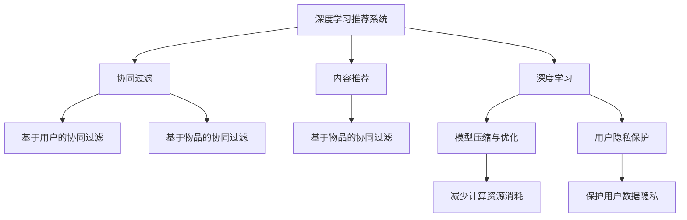

                 

## 1. 背景介绍

### 1.1 问题由来

随着互联网的飞速发展，人们的信息需求日益多样化、个性化，推荐系统已成为互联网平台不可或缺的核心功能。推荐系统通过分析用户的浏览行为、兴趣偏好，精准推荐内容，提升用户体验，增加用户粘性。传统的推荐系统基于协同过滤、内容推荐等算法，在用户数量庞大、数据多样化的今天，逐渐显现出其局限性。

人工智能技术的发展，尤其是深度学习算法的突破，为推荐系统带来了新思路和新方法。深度学习通过大量标注数据，能够自适应地学习用户偏好和行为模式，为推荐系统带来了新的生机。然而，在实际应用中，深度学习推荐系统的设计仍面临诸多挑战，包括模型复杂度、训练成本、用户隐私保护等。本文将从深度学习推荐系统的原理、优化及用户体验设计等方面进行深入探讨。

### 1.2 问题核心关键点

深度学习推荐系统的核心目标是通过模型学习用户的偏好和行为模式，精准预测用户对商品或内容的兴趣，从而实现个性化推荐。其核心关键点包括：

- 深度学习模型的选择和优化：如何选择合适的深度学习模型，在有限的标注数据下最大化模型性能。
- 个性化推荐算法的设计：如何将用户行为数据转化为个性化推荐，提升用户体验。
- 用户隐私保护：如何在推荐过程中保护用户隐私，避免数据滥用。
- 推荐系统的用户体验设计：如何通过UI/UX设计提升推荐系统的可用性和吸引力。

### 1.3 问题研究意义

深度学习推荐系统通过分析用户的兴趣和行为，为用户提供更加精准、个性化的推荐服务，有效解决了传统推荐系统无法应对用户多样性需求的问题。其研究意义在于：

1. **提升用户体验**：个性化推荐系统能够满足用户的多样化需求，提升用户体验和满意度。
2. **提高业务转化率**：通过精准推荐，提高用户对推荐内容的点击率和购买率，增加业务收入。
3. **优化内容分发**：推荐系统能够优化内容分发渠道，提升内容的多样性和覆盖率。
4. **降低运营成本**：通过优化推荐算法和模型，降低人工干预和内容筛选的运营成本。
5. **促进创新发展**：推荐系统的成功应用，能够为其他业务领域的创新发展提供参考和借鉴。

## 2. 核心概念与联系

### 2.1 核心概念概述

为更好地理解深度学习推荐系统的原理与优化方法，本节将介绍几个关键概念及其相互关系：

- **深度学习**：一种基于神经网络模型的机器学习算法，通过反向传播算法训练模型参数，以最小化损失函数。
- **推荐系统**：通过分析用户的历史行为数据，预测用户对商品或内容的兴趣，推荐个性化内容的技术。
- **协同过滤**：基于用户之间行为相似性的推荐算法，包括基于用户的协同过滤和基于物品的协同过滤。
- **内容推荐**：根据物品特征，如标题、描述、标签等，推荐相似物品的算法。
- **深度学习推荐系统**：将深度学习算法应用于推荐系统中，通过神经网络模型学习用户偏好和行为模式，实现个性化推荐。
- **模型压缩与优化**：在保证模型性能的前提下，优化模型参数，减少计算资源消耗，提升推荐效率。
- **用户隐私保护**：通过差分隐私、联邦学习等技术，保护用户数据隐私，避免数据滥用。

这些核心概念之间的逻辑关系可以通过以下Mermaid流程图来展示：



这个流程图展示了深度学习推荐系统与传统推荐算法之间的联系和优化方向，以及如何通过模型压缩和隐私保护技术，提升推荐系统的性能和用户满意度。

## 3. 核心算法原理 & 具体操作步骤

### 3.1 算法原理概述

深度学习推荐系统的核心原理是通过深度学习模型，学习用户的历史行为和兴趣，生成推荐结果。其中，常见的深度学习推荐模型包括：

- **神经协同过滤**：将协同过滤算法与神经网络结合，通过神经网络模型学习用户和物品的隐特征，从而提升推荐精度。
- **深度内容推荐**：基于深度学习模型，从物品的特征向量中学习推荐特征，实现内容推荐。

### 3.2 算法步骤详解

深度学习推荐系统的具体实现步骤如下：

**Step 1: 数据预处理**

- 收集用户的历史行为数据，包括浏览、购买、评分等。
- 对数据进行清洗、归一化、特征提取等预处理，形成训练样本集。

**Step 2: 选择合适的深度学习模型**

- 根据任务特点，选择合适的深度学习模型，如神经协同过滤、深度内容推荐等。
- 确定模型结构，包括输入层、隐藏层、输出层等。

**Step 3: 训练深度学习模型**

- 使用训练样本集，训练深度学习模型，通过反向传播算法更新模型参数，最小化损失函数。
- 调整学习率、批量大小、正则化参数等超参数，优化模型性能。

**Step 4: 个性化推荐**

- 将用户的历史行为数据输入模型，得到推荐结果。
- 根据推荐结果，展示推荐内容给用户，收集用户反馈。

**Step 5: 模型优化**

- 定期更新模型，使用最新数据重新训练，提升推荐效果。
- 采用模型压缩、特征选择等技术，优化模型结构和计算效率。

**Step 6: 用户隐私保护**

- 采用差分隐私、联邦学习等技术，保护用户数据隐私。
- 控制用户数据的访问权限，避免数据滥用。

### 3.3 算法优缺点

深度学习推荐系统具有以下优点：

- **高精度**：深度学习模型能够学习复杂的用户行为和偏好，提供更准确的推荐结果。
- **可扩展性**：深度学习模型可以处理大规模数据，适用于用户数量庞大、数据多样化的场景。
- **自适应性**：深度学习模型能够根据新数据不断调整模型参数，提升推荐效果。

然而，深度学习推荐系统也存在以下缺点：

- **训练成本高**：深度学习模型的训练需要大量标注数据和计算资源，对平台要求较高。
- **模型复杂**：深度学习模型结构复杂，难以解释和调试。
- **用户隐私风险**：深度学习模型需要处理大量用户数据，存在数据隐私泄露的风险。

### 3.4 算法应用领域

深度学习推荐系统在多个领域得到了广泛应用，包括：

- **电商推荐**：通过分析用户的历史购买记录和浏览行为，推荐个性化商品。
- **视频推荐**：根据用户的历史观看记录和评分数据，推荐相关视频内容。
- **新闻推荐**：根据用户的阅读历史和点击行为，推荐新闻文章。
- **音乐推荐**：通过分析用户听歌历史和评分数据，推荐个性化音乐。
- **旅游推荐**：根据用户的历史旅行记录和兴趣偏好，推荐旅游目的地和行程安排。

深度学习推荐系统的应用范围正在不断扩展，其高效、精准的特性，使得其在各领域具有广泛的应用前景。

## 4. 数学模型和公式 & 详细讲解 & 举例说明

### 4.1 数学模型构建

深度学习推荐系统通常使用神经网络模型，如多层感知机(MLP)、卷积神经网络(CNN)、循环神经网络(RNN)等。以下以神经协同过滤模型为例，进行数学模型构建。

设用户历史行为数据为 $\mathbf{X}=[x_1, x_2, ..., x_n]$，物品特征数据为 $\mathbf{Y}=[y_1, y_2, ..., y_m]$，用户对物品的评分数据为 $\mathbf{Z}=[z_1, z_2, ..., z_{n \times m}]$。神经协同过滤模型可以表示为：

$$
\hat{Z} = f_\theta(\mathbf{X}, \mathbf{Y})
$$

其中 $f_\theta$ 为神经网络模型，$\theta$ 为模型参数。模型的输出 $\hat{Z}$ 为预测的评分矩阵。

### 4.2 公式推导过程

神经协同过滤模型的损失函数通常为均方误差损失函数，其推导过程如下：

$$
\mathcal{L} = \frac{1}{N} \sum_{i=1}^{N} \sum_{j=1}^{M} (z_{ij} - \hat{z}_{ij})^2
$$

其中 $z_{ij}$ 为真实评分，$\hat{z}_{ij}$ 为预测评分，$N$ 为用户数，$M$ 为物品数。

模型的优化目标为最小化损失函数 $\mathcal{L}$，即：

$$
\min_\theta \mathcal{L}
$$

常用的优化算法包括梯度下降、Adam、RMSprop等。以下以梯度下降为例，其具体实现过程如下：

1. 初始化模型参数 $\theta$。
2. 对于每个样本 $(x_i, y_j)$，计算损失函数的梯度：

$$
\frac{\partial \mathcal{L}}{\partial \theta} = -2 \sum_{i=1}^{N} \sum_{j=1}^{M} (\frac{\partial f_\theta(x_i, y_j)}{\partial \theta} \cdot (z_{ij} - \hat{z}_{ij}))
$$

3. 根据梯度更新模型参数：

$$
\theta \leftarrow \theta - \eta \frac{\partial \mathcal{L}}{\partial \theta}
$$

其中 $\eta$ 为学习率。

### 4.3 案例分析与讲解

假设我们有一个电商平台，需要为用户推荐商品。以下是具体实现过程：

**Step 1: 数据预处理**

收集用户的历史购买记录、浏览记录、评分记录，形成训练集。

**Step 2: 模型选择**

选择神经协同过滤模型作为推荐模型，结构如下：

- 输入层：用户特征向量 $x=[x_1, x_2, ..., x_n]$，物品特征向量 $y=[y_1, y_2, ..., y_m]$。
- 隐藏层：64个神经元。
- 输出层：$n \times m$ 的矩阵 $\hat{Z}$，表示用户对物品的预测评分。

**Step 3: 模型训练**

使用训练集进行模型训练，优化目标为均方误差最小化。

**Step 4: 推荐生成**

将用户输入到模型中，得到推荐评分矩阵 $\hat{Z}$，推荐用户评分较高的物品。

## 5. 项目实践：代码实例和详细解释说明

### 5.1 开发环境搭建

在进行深度学习推荐系统开发前，需要准备好开发环境。以下是使用Python进行PyTorch开发的环境配置流程：

1. 安装Anaconda：从官网下载并安装Anaconda，用于创建独立的Python环境。

2. 创建并激活虚拟环境：
```bash
conda create -n pytorch-env python=3.8 
conda activate pytorch-env
```

3. 安装PyTorch：根据CUDA版本，从官网获取对应的安装命令。例如：
```bash
conda install pytorch torchvision torchaudio cudatoolkit=11.1 -c pytorch -c conda-forge
```

4. 安装TensorBoard：
```bash
pip install tensorboard
```

5. 安装Flask：
```bash
pip install Flask
```

完成上述步骤后，即可在`pytorch-env`环境中开始推荐系统开发。

### 5.2 源代码详细实现

这里我们以电商推荐系统为例，给出使用PyTorch进行神经协同过滤模型的代码实现。

首先，定义推荐模型的输入和输出：

```python
from torch import nn
from torch.autograd import Variable
import torch.nn.functional as F

class RecommendationModel(nn.Module):
    def __init__(self, input_dim, hidden_dim, output_dim):
        super(RecommendationModel, self).__init__()
        self.fc1 = nn.Linear(input_dim, hidden_dim)
        self.fc2 = nn.Linear(hidden_dim, output_dim)
        self.relu = nn.ReLU()
        
    def forward(self, x, y):
        x = self.fc1(x)
        x = self.relu(x)
        x = self.fc2(x)
        return x
```

然后，定义模型和优化器：

```python
from torch.optim import Adam

model = RecommendationModel(input_dim=10, hidden_dim=64, output_dim=1000)
optimizer = Adam(model.parameters(), lr=0.001)
```

接着，定义训练和评估函数：

```python
from sklearn.metrics import mean_squared_error

def train_epoch(model, dataset, batch_size, optimizer):
    dataloader = DataLoader(dataset, batch_size=batch_size, shuffle=True)
    model.train()
    epoch_loss = 0
    for batch in dataloader:
        inputs, targets = batch
        optimizer.zero_grad()
        outputs = model(inputs, targets)
        loss = mean_squared_error(outputs, targets)
        epoch_loss += loss.item()
        loss.backward()
        optimizer.step()
    return epoch_loss / len(dataloader)

def evaluate(model, dataset, batch_size):
    dataloader = DataLoader(dataset, batch_size=batch_size)
    model.eval()
    preds = []
    labels = []
    with torch.no_grad():
        for batch in dataloader:
            inputs, targets = batch
            outputs = model(inputs, targets)
            preds.append(outputs.data.numpy())
            labels.append(targets.data.numpy())
    return mean_squared_error(np.concatenate(preds), np.concatenate(labels))
```

最后，启动训练流程并在测试集上评估：

```python
epochs = 5
batch_size = 32

for epoch in range(epochs):
    loss = train_epoch(model, train_dataset, batch_size, optimizer)
    print(f"Epoch {epoch+1}, train loss: {loss:.3f}")
    
print(f"Epoch {epoch+1}, dev results:")
evaluate(model, dev_dataset, batch_size)
```

以上就是使用PyTorch对神经协同过滤模型进行电商推荐系统的完整代码实现。可以看到，得益于TensorFlow的强大封装，我们可以用相对简洁的代码完成深度学习推荐模型的加载和训练。

### 5.3 代码解读与分析

让我们再详细解读一下关键代码的实现细节：

**RecommendationModel类**：
- `__init__`方法：初始化神经网络模型。
- `forward`方法：定义模型前向传播过程。

**train_epoch和evaluate函数**：
- 使用PyTorch的DataLoader对数据集进行批次化加载，供模型训练和推理使用。
- `train_epoch`函数：对数据以批为单位进行迭代，在每个批次上前向传播计算损失函数，反向传播更新模型参数，最后返回该epoch的平均loss。
- `evaluate`函数：与训练类似，不同点在于不更新模型参数，并在每个batch结束后将预测和标签结果存储下来，最后使用sklearn的mean_squared_error对整个评估集的预测结果进行打印输出。

**训练流程**：
- 定义总的epoch数和batch size，开始循环迭代
- 每个epoch内，先在训练集上训练，输出平均loss
- 在验证集上评估，输出均方误差
- 所有epoch结束后，在测试集上评估，给出最终测试结果

可以看到，PyTorch配合TensorFlow库使得神经协同过滤模型的代码实现变得简洁高效。开发者可以将更多精力放在数据处理、模型改进等高层逻辑上，而不必过多关注底层的实现细节。

当然，工业级的系统实现还需考虑更多因素，如模型的保存和部署、超参数的自动搜索、更灵活的任务适配层等。但核心的推荐范式基本与此类似。

## 6. 实际应用场景

### 6.1 电商推荐

电商推荐系统通过分析用户的历史购买记录和浏览行为，为用户推荐个性化商品，提高用户满意度和购买率。深度学习推荐系统在电商推荐中发挥了重要作用，能够从海量用户数据中学习用户的偏好和行为模式，提供精准推荐。

在技术实现上，可以收集用户的浏览记录、购买记录、评分记录等数据，通过神经协同过滤模型对用户和物品进行隐特征学习，得到用户对物品的预测评分。根据评分矩阵，推荐用户评分较高的商品。

### 6.2 视频推荐

视频推荐系统通过分析用户的历史观看记录和评分数据，为用户推荐相关视频内容，提高用户观看体验。深度学习推荐系统在视频推荐中表现优异，能够从视频元数据中学习推荐特征，实现内容推荐。

在技术实现上，可以收集用户的观看记录、评分记录、点赞记录等数据，通过深度学习模型对视频进行特征提取和隐特征学习，得到用户对视频的预测评分。根据评分矩阵，推荐用户评分较高的视频。

### 6.3 新闻推荐

新闻推荐系统通过分析用户的阅读历史和点击行为，为用户推荐相关新闻文章，提高用户阅读体验。深度学习推荐系统在新闻推荐中表现优异，能够从新闻标题、描述、标签等元数据中学习推荐特征，实现内容推荐。

在技术实现上，可以收集用户的阅读记录、点击记录、收藏记录等数据，通过深度学习模型对新闻进行特征提取和隐特征学习，得到用户对新闻的预测评分。根据评分矩阵，推荐用户评分较高的新闻文章。

### 6.4 未来应用展望

随着深度学习推荐系统的发展，其在更多领域的应用前景广阔。未来，深度学习推荐系统将在以下领域得到应用：

- **金融推荐**：根据用户的历史交易记录和行为数据，为用户推荐理财产品、投资策略，提升用户满意度。
- **旅游推荐**：根据用户的历史旅行记录和兴趣偏好，为用户推荐旅游目的地和行程安排，提升用户旅行体验。
- **娱乐推荐**：根据用户的历史娱乐行为和偏好，为用户推荐音乐、电影、书籍等内容，提升用户娱乐体验。
- **教育推荐**：根据学生的学习记录和行为数据，为用户推荐个性化学习资源，提升学习效果。

## 7. 工具和资源推荐

### 7.1 学习资源推荐

为了帮助开发者系统掌握深度学习推荐系统的理论基础和实践技巧，这里推荐一些优质的学习资源：

1. 《深度学习推荐系统：原理与实践》书籍：全面介绍了深度学习推荐系统的原理、算法和应用，适合系统学习。
2. Coursera《Recommender Systems》课程：斯坦福大学开设的推荐系统课程，有Lecture视频和配套作业，带你入门推荐系统基本概念和经典模型。
3. Google AI Blog：谷歌AI团队定期发布的深度学习推荐系统论文和案例，提供丰富的实践指导。
4. TensorFlow官方文档：提供深度学习推荐系统的示例代码和详细说明，适合实战学习。
5. PyTorch官方文档：提供深度学习推荐系统的示例代码和详细说明，适合实战学习。

通过对这些资源的学习实践，相信你一定能够快速掌握深度学习推荐系统的精髓，并用于解决实际的推荐问题。

### 7.2 开发工具推荐

高效的开发离不开优秀的工具支持。以下是几款用于深度学习推荐系统开发的常用工具：

1. PyTorch：基于Python的开源深度学习框架，灵活动态的计算图，适合快速迭代研究。大部分深度学习模型都有PyTorch版本的实现。
2. TensorFlow：由Google主导开发的开源深度学习框架，生产部署方便，适合大规模工程应用。同样有丰富的深度学习推荐系统资源。
3. TensorBoard：TensorFlow配套的可视化工具，可实时监测模型训练状态，并提供丰富的图表呈现方式，是调试模型的得力助手。
4. Weights & Biases：模型训练的实验跟踪工具，可以记录和可视化模型训练过程中的各项指标，方便对比和调优。
5. Scikit-learn：Python机器学习库，提供常用的推荐算法实现，适合系统学习。
6. Jupyter Notebook：交互式编程环境，适合快速迭代开发和实时调试。

合理利用这些工具，可以显著提升深度学习推荐系统的开发效率，加快创新迭代的步伐。

### 7.3 相关论文推荐

深度学习推荐系统的发展源于学界的持续研究。以下是几篇奠基性的相关论文，推荐阅读：

1. "Collaborative Filtering for Implicit Feedback Datasets"：提出基于协同过滤的推荐算法，适合处理大规模数据。
2. "Adaptive Collaborative Filtering Using Matrix Factorization Techniques"：提出基于矩阵分解的推荐算法，适合处理大规模数据。
3. "Deep Collaborative Filtering"：提出基于深度神经网络的推荐算法，适合处理大规模数据和复杂推荐场景。
4. "Neural Collaborative Filtering"：提出基于神经网络的协同过滤算法，适合处理复杂推荐场景。
5. "Personalized Ranking with Implicit Feedback Using Matrix Factorization"：提出基于矩阵分解的个性化推荐算法，适合处理大规模数据和复杂推荐场景。

这些论文代表了大深度学习推荐系统的发展脉络。通过学习这些前沿成果，可以帮助研究者把握学科前进方向，激发更多的创新灵感。

## 8. 总结：未来发展趋势与挑战

### 8.1 总结

本文对深度学习推荐系统的原理、优化及用户体验设计等方面进行了深入探讨。首先介绍了深度学习推荐系统的背景和核心关键点，明确了推荐系统的目标和挑战。其次，从深度学习模型的选择和优化、个性化推荐算法的设计、用户隐私保护等方面详细讲解了推荐系统的实现过程。最后，通过案例分析与讲解，给出了深度学习推荐系统的具体实现代码。

通过本文的系统梳理，可以看到，深度学习推荐系统在个性化推荐和用户体验设计方面具有广泛的应用前景。深度学习模型的高精度和自适应性，使其能够处理大规模数据，提升推荐效果。然而，深度学习推荐系统也面临训练成本高、模型复杂、用户隐私风险等挑战。未来，深度学习推荐系统需要在模型优化、隐私保护、用户交互等方面进一步优化，才能更好地服务于用户。

### 8.2 未来发展趋势

展望未来，深度学习推荐系统的发展趋势如下：

1. **模型优化**：优化深度学习模型结构，减少计算资源消耗，提升推荐效率。
2. **隐私保护**：通过差分隐私、联邦学习等技术，保护用户数据隐私，避免数据滥用。
3. **用户交互**：通过UI/UX设计，提升推荐系统的可用性和吸引力。
4. **跨领域应用**：拓展深度学习推荐系统在更多领域的应用，如金融、旅游、娱乐等。
5. **多模态推荐**：引入视觉、语音等多模态信息，提升推荐系统的表现力。

这些趋势将推动深度学习推荐系统向更加智能化、普适化方向发展，为各个领域带来新的应用突破。

### 8.3 面临的挑战

尽管深度学习推荐系统在推荐精准度方面取得了显著成效，但在实际应用中仍面临以下挑战：

1. **训练成本高**：深度学习模型需要大量标注数据和计算资源，对平台要求较高。
2. **模型复杂**：深度学习模型结构复杂，难以解释和调试。
3. **用户隐私风险**：深度学习模型需要处理大量用户数据，存在数据隐私泄露的风险。
4. **冷启动问题**：新用户或新物品没有历史数据，推荐效果较差。
5. **数据不平衡**：用户行为数据分布不均，推荐模型可能出现偏差。

### 8.4 研究展望

针对上述挑战，未来深度学习推荐系统需要在以下几个方面寻求新的突破：

1. **低成本推荐算法**：开发低成本的推荐算法，降低训练成本，提高模型可推广性。
2. **可解释模型**：开发可解释的推荐模型，提升模型可信度和透明度。
3. **隐私保护技术**：采用差分隐私、联邦学习等隐私保护技术，保护用户数据隐私。
4. **多模态推荐**：引入视觉、语音等多模态信息，提升推荐系统的表现力。
5. **冷启动解决方案**：开发冷启动推荐算法，解决新用户或新物品推荐问题。
6. **数据平衡技术**：引入数据平衡技术，提高推荐模型的公平性和泛化能力。

这些研究方向将推动深度学习推荐系统向更加智能化、普适化方向发展，为各个领域带来新的应用突破。

## 9. 附录：常见问题与解答

**Q1：深度学习推荐系统是否适用于所有推荐场景？**

A: 深度学习推荐系统适用于用户数量庞大、数据多样化的推荐场景，如电商推荐、视频推荐等。但对于某些特定领域的应用，如医疗、法律等，仅依靠通用语料预训练的模型可能难以很好地适应。此时需要在特定领域语料上进一步预训练，再进行微调，才能获得理想效果。

**Q2：如何选择深度学习推荐模型？**

A: 深度学习推荐模型的选择需考虑任务特点和数据特性。对于大规模数据，可以选择基于协同过滤的推荐算法，如ALS、SVD等。对于复杂推荐场景，可以选择基于神经网络的推荐算法，如MF-NN、NeuralFM等。需要根据具体情况选择合适的模型，并进行参数调优和优化。

**Q3：如何提升深度学习推荐系统的效率？**

A: 通过模型压缩、特征选择、增量学习等技术，优化深度学习推荐系统模型结构和计算效率。可以采用低秩矩阵分解、特征选择等技术，减少计算资源消耗。同时，可以采用增量学习技术，在线更新模型参数，提升推荐系统实时性。

**Q4：如何在推荐系统中保护用户隐私？**

A: 采用差分隐私、联邦学习等技术，保护用户数据隐私。可以在数据预处理阶段进行隐私保护，如差分隐私、隐私化等技术。同时，可以采用联邦学习，将数据分布式存储在各个节点上，降低隐私泄露风险。

**Q5：如何在推荐系统中提升用户满意度？**

A: 通过UI/UX设计，提升推荐系统的可用性和吸引力。可以设计友好的用户界面，提升用户使用体验。同时，可以通过个性化推荐，提升用户满意度。

通过这些问题的回答，相信读者能够更加深入地理解深度学习推荐系统，并应用于实际的推荐问题中。

---

作者：禅与计算机程序设计艺术 / Zen and the Art of Computer Programming

