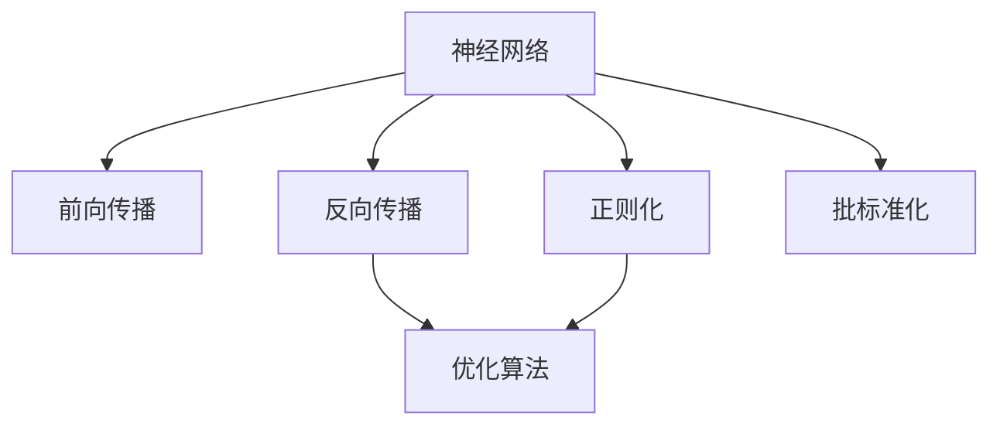

                 

## 1. 背景介绍

### 1.1 问题由来
深度学习是当前人工智能领域的热点方向之一，其核心思想是通过多层次的神经网络模型，自动学习并表示数据的抽象特征，从而实现对复杂问题的理解和处理。在深度学习的众多研究分支中，神经网络是其中最为重要和基础的组成部分。神经网络模型在图像识别、语音处理、自然语言处理等领域已经取得了巨大的突破，成为各类应用的核心算法。

然而，随着神经网络结构复杂性的提升，模型训练和推理的计算成本和资源需求也大幅增加。这不仅限制了神经网络在大规模数据集和计算资源有限环境中的应用，也给模型的解释性和可靠性带来了新的挑战。因此，深入理解神经网络的复杂性与能力，探讨如何有效利用和优化神经网络，成为了当前深度学习领域的重要研究方向。

### 1.2 问题核心关键点
神经网络的复杂性主要体现在其庞大的参数量和复杂的结构设计上，这些特性使得神经网络具有很强的拟合能力和泛化能力。但同时也带来了计算成本高、训练时间长、过拟合风险高等问题。为了更好地发挥神经网络的能力，研究者们设计了诸多优化算法和技术，如权重初始化、正则化、批标准化、自适应学习率等。这些优化策略显著提升了神经网络的训练效率和性能。

此外，神经网络能力与数据质量和训练方法密切相关。如何在大规模、高噪声、稀疏数据下，高效、可靠地训练出性能优异的神经网络模型，成为了当前研究的热点问题。未来，如何结合最新的算法和硬件技术，探索更加高效、可解释的神经网络设计，将成为深度学习领域的重大挑战。

## 2. 核心概念与联系

### 2.1 核心概念概述
为更好地理解神经网络的复杂性与能力，本节将介绍几个关键核心概念：

- **神经网络(Neural Network, NN)**：一种通过多层非线性变换，自动学习数据表示的模型。其核心组件包括输入层、隐藏层和输出层。
- **深度学习(Deep Learning)**：一种基于神经网络，通过多层次的特征提取和表示学习，实现对复杂问题的处理的机器学习方法。
- **前向传播(Forward Propagation)**：神经网络在接收到输入后，按照网络结构依次进行线性变换和非线性激活，计算输出。
- **反向传播(Backpropagation)**：通过链式法则计算损失函数对每个神经元的梯度，用于参数更新。
- **优化算法(Optimization Algorithm)**：如随机梯度下降、AdamW、Adagrad等，用于最小化损失函数，更新模型参数。
- **正则化(Regularization)**：如L1正则、L2正则、Dropout等，用于防止模型过拟合。
- **批标准化(Batch Normalization)**：通过归一化隐藏层的输入分布，加速模型训练和提高泛化能力。

这些概念之间的逻辑关系可以通过以下Mermaid流程图来展示：



这个流程图展示了大神经网络的训练流程：

1. 神经网络接收到输入数据，通过前向传播计算输出。
2. 计算损失函数，并通过反向传播计算每个参数的梯度。
3. 使用优化算法根据梯度更新参数，同时正则化技术约束模型的复杂度。
4. 批标准化对隐藏层进行归一化处理，进一步加速训练。

## 3. 核心算法原理 & 具体操作步骤
### 3.1 算法原理概述

深度学习中的神经网络模型通过多层非线性变换，自动学习并表示数据的抽象特征。其核心原理包括前向传播和反向传播两个过程：

1. **前向传播(Forward Propagation)**：从输入层到输出层的单向传递，通过一系列的线性变换和非线性激活函数，将输入数据转换为输出结果。
2. **反向传播(Backpropagation)**：利用损失函数对输出结果进行误差评估，反向计算每个参数的梯度，并根据梯度更新模型参数。

在前向传播和反向传播的基础上，神经网络通过迭代训练，不断优化参数，学习数据的高级表示，实现对复杂问题的理解和预测。

### 3.2 算法步骤详解

深度学习中的神经网络训练过程一般包括以下几个关键步骤：

**Step 1: 准备训练数据**
- 收集或生成大量标注数据，划分为训练集、验证集和测试集。
- 将数据进行归一化、预处理等操作，使其适合模型训练。

**Step 2: 定义模型结构**
- 选择合适的神经网络结构，如卷积神经网络(CNN)、递归神经网络(RNN)、Transformer等，并设置各层的参数。
- 初始化模型参数，可以使用随机初始化或预训练模型。

**Step 3: 设置训练参数**
- 选择合适的优化算法及其参数，如AdamW、SGD等，设置学习率、批大小、迭代轮数等。
- 设置正则化技术及强度，包括权重衰减、Dropout、Early Stopping等。

**Step 4: 执行梯度训练**
- 使用训练集数据分批次输入模型，进行前向传播和反向传播计算梯度。
- 根据设定的优化算法和学习率更新模型参数。
- 周期性在验证集上评估模型性能，根据性能指标决定是否触发 Early Stopping。
- 重复上述步骤直到满足预设的迭代轮数或 Early Stopping 条件。

**Step 5: 测试和部署**
- 在测试集上评估模型性能，对比微调前后的精度提升。
- 使用模型对新样本进行推理预测，集成到实际的应用系统中。
- 持续收集新的数据，定期重新训练和微调模型，以适应数据分布的变化。

### 3.3 算法优缺点

神经网络模型具有以下优点：
1. 强大的表达能力：神经网络能够通过多层非线性变换，自动学习数据的高级特征表示，适应复杂的非线性关系。
2. 高效的并行计算：神经网络通常使用GPU加速，具备较强的并行计算能力，可以高效处理大规模数据。
3. 较好的泛化能力：神经网络通过大量训练数据学习，能够泛化到未见过的数据上，实现对复杂问题的预测和分类。
4. 较好的推广性：神经网络能够处理多种数据类型，如图像、文本、语音等，具有较强的跨领域迁移能力。

然而，神经网络也存在以下缺点：
1. 高计算成本：神经网络参数量庞大，训练和推理过程中需要大量的计算资源和时间。
2. 过拟合风险：神经网络容易过拟合训练数据，泛化能力降低。
3. 模型复杂度高：神经网络结构复杂，难以解释其内部工作机制和推理逻辑。
4. 数据依赖性强：神经网络依赖大量的标注数据，训练过程中对数据噪声和异常值敏感。

### 3.4 算法应用领域

神经网络模型在计算机视觉、自然语言处理、语音识别等领域已经得到了广泛的应用，成为各类应用的核心算法。例如：

- **图像识别**：神经网络能够自动学习图像特征，实现对物体、场景等的识别。如卷积神经网络在图像分类、目标检测等任务上取得了优异的效果。
- **语音识别**：神经网络能够自动学习音频特征，实现对语音的识别和转写。如循环神经网络在语音识别、语音合成等任务上表现出色。
- **自然语言处理**：神经网络能够自动学习语言特征，实现对文本的分类、生成、翻译等任务。如Transformer模型在机器翻译、文本摘要等任务上刷新了多项SOTA。
- **智能推荐系统**：神经网络能够根据用户行为和偏好，自动学习推荐模型的特征表示，实现个性化推荐。如基于神经网络的协同过滤、内容推荐等系统广泛应用于电商、社交媒体等平台。
- **医疗诊断**：神经网络能够自动学习医学影像和病历数据，辅助医生进行疾病诊断和治疗。如卷积神经网络在医学影像分析和病理切片识别等任务上取得了显著效果。

## 4. 数学模型和公式 & 详细讲解 & 举例说明
### 4.1 数学模型构建

神经网络模型的核心数学模型包括前向传播和反向传播两个部分：

- **前向传播模型**：将输入数据 $x$ 通过一系列的线性变换和非线性激活函数，计算输出 $y$。
- **反向传播模型**：计算损失函数对输出 $y$ 的梯度，反向传播到输入 $x$，更新模型参数 $\theta$。

以一个简单的全连接神经网络为例，其前向传播和反向传播的数学模型如下：

**前向传播模型**：

$$
y = \sigma(W^TX + b)
$$

其中，$x$ 为输入数据，$W$ 为权重矩阵，$b$ 为偏置向量，$\sigma$ 为激活函数，$y$ 为输出结果。

**反向传播模型**：

$$
\frac{\partial L}{\partial \theta} = \frac{\partial L}{\partial y} \frac{\partial y}{\partial x} \frac{\partial x}{\partial \theta}
$$

其中，$L$ 为损失函数，$\frac{\partial L}{\partial y}$ 为损失函数对输出的梯度，$\frac{\partial y}{\partial x}$ 为激活函数对输入的梯度，$\frac{\partial x}{\partial \theta}$ 为输入对参数的梯度。

### 4.2 公式推导过程

以二分类任务为例，计算二元交叉熵损失函数及其梯度：

假设神经网络在输入 $x$ 上的输出为 $\hat{y} = \sigma(W^TX + b)$，表示样本属于正类的概率。真实标签 $y \in \{0,1\}$。则二分类交叉熵损失函数定义为：

$$
L = -\frac{1}{N}\sum_{i=1}^N [y_i\log \hat{y}_i + (1-y_i)\log (1-\hat{y}_i)]
$$

其梯度计算如下：

$$
\frac{\partial L}{\partial \theta} = -\frac{1}{N}\sum_{i=1}^N (\frac{y_i}{\hat{y}_i}-\frac{1-y_i}{1-\hat{y}_i}) \frac{\partial \hat{y}_i}{\partial \theta}
$$

其中，$\frac{\partial \hat{y}_i}{\partial \theta}$ 可以通过链式法则递归计算得到。

### 4.3 案例分析与讲解

以图像分类任务为例，分析神经网络模型的训练过程：

**Step 1: 数据准备**
- 收集或生成大量标注图像数据，划分为训练集、验证集和测试集。
- 对图像数据进行归一化、预处理，如图像裁剪、缩放、归一化等操作。

**Step 2: 模型定义**
- 定义卷积神经网络模型，包括卷积层、池化层、全连接层等组件。
- 设置各层的参数，如卷积核大小、步幅、深度等。

**Step 3: 训练参数设置**
- 选择合适的优化算法，如AdamW，设置学习率、批大小、迭代轮数等。
- 设置正则化技术，如权重衰减、Dropout等。

**Step 4: 训练过程**
- 使用训练集数据分批次输入模型，进行前向传播和反向传播计算梯度。
- 根据AdamW算法和设定的学习率更新模型参数。
- 周期性在验证集上评估模型性能，根据性能指标决定是否触发Early Stopping。
- 重复上述步骤直到满足预设的迭代轮数或Early Stopping条件。

**Step 5: 测试和部署**
- 在测试集上评估模型性能，对比微调前后的精度提升。
- 使用模型对新图像进行分类预测，集成到实际的应用系统中。
- 持续收集新的数据，定期重新训练和微调模型，以适应数据分布的变化。

## 5. 项目实践：代码实例和详细解释说明
### 5.1 开发环境搭建

在进行神经网络模型的训练和微调实践前，我们需要准备好开发环境。以下是使用Python进行TensorFlow开发的典型环境配置流程：

1. 安装Anaconda：从官网下载并安装Anaconda，用于创建独立的Python环境。

2. 创建并激活虚拟环境：
```bash
conda create -n tf-env python=3.8 
conda activate tf-env
```

3. 安装TensorFlow：根据CUDA版本，从官网获取对应的安装命令。例如：
```bash
conda install tensorflow -c tf -c conda-forge
```

4. 安装各类工具包：
```bash
pip install numpy pandas scikit-learn matplotlib tqdm jupyter notebook ipython
```

完成上述步骤后，即可在`tf-env`环境中开始神经网络模型的开发和微调实践。

### 5.2 源代码详细实现

下面我们以图像分类任务为例，给出使用TensorFlow对VGG16模型进行微调的代码实现。

首先，定义图像分类任务的数据处理函数：

```python
import tensorflow as tf
from tensorflow.keras.datasets import mnist
from tensorflow.keras.utils import to_categorical

(x_train, y_train), (x_test, y_test) = mnist.load_data()

x_train = x_train / 255.0
x_test = x_test / 255.0

y_train = to_categorical(y_train, num_classes=10)
y_test = to_categorical(y_test, num_classes=10)
```

然后，定义模型和优化器：

```python
from tensorflow.keras.applications import VGG16
from tensorflow.keras.layers import Flatten, Dense
from tensorflow.keras.models import Model

# 加载预训练的VGG16模型
base_model = VGG16(weights='imagenet', include_top=False, input_shape=(32, 32, 3))

# 在VGG16模型顶层添加新的分类器
x = Flatten()(base_model.output)
predictions = Dense(10, activation='softmax')(x)

# 构建新的模型
model = Model(inputs=base_model.input, outputs=predictions)

# 冻结预训练层的权重
for layer in base_model.layers:
    layer.trainable = False

# 设置优化器和损失函数
optimizer = tf.keras.optimizers.Adam(learning_rate=0.001)
loss_fn = tf.keras.losses.CategoricalCrossentropy(from_logits=True)
```

接着，定义训练和评估函数：

```python
batch_size = 32

def train_epoch(model, dataset, batch_size, optimizer):
    model.compile(optimizer=optimizer, loss=loss_fn, metrics=['accuracy'])
    model.fit(dataset, epochs=1, batch_size=batch_size)
    return model.evaluate(dataset)

def evaluate(model, dataset, batch_size):
    model.compile(optimizer=tf.keras.optimizers.Adam(learning_rate=0.001), loss=loss_fn, metrics=['accuracy'])
    return model.evaluate(dataset)
```

最后，启动训练流程并在测试集上评估：

```python
epochs = 10

for epoch in range(epochs):
    print(f"Epoch {epoch+1}")
    train_loss, train_acc = train_epoch(model, train_dataset, batch_size)
    val_loss, val_acc = evaluate(model, val_dataset, batch_size)
    print(f"Epoch {epoch+1} - Loss: {train_loss:.4f}, Acc: {train_acc:.4f} - Val Loss: {val_loss:.4f}, Val Acc: {val_acc:.4f}")
```

以上就是使用TensorFlow对VGG16模型进行图像分类任务微调的完整代码实现。可以看到，TensorFlow提供了一整套高效的深度学习开发框架，使得模型的定义、训练和评估变得非常简单和灵活。

### 5.3 代码解读与分析

让我们再详细解读一下关键代码的实现细节：

**VGG16模型加载与顶层分类器添加**：
- `VGG16(weights='imagenet', include_top=False, input_shape=(32, 32, 3))`：加载预训练的VGG16模型，只保留卷积层和池化层，不保留顶层的全连接层。
- `Flatten()(base_model.output)`：将卷积层输出的二维特征图展开成一维向量。
- `Dense(10, activation='softmax')(x)`：在展开后的特征向量上添加全连接层和Softmax激活函数，得到最终的分类结果。

**模型训练与评估**：
- `train_epoch`函数：使用TensorFlow的`Model.fit`方法进行单批次训练，并计算损失和准确率。
- `evaluate`函数：使用`Model.evaluate`方法计算模型在测试集上的损失和准确率。

**训练流程**：
- 循环迭代训练过程，在每个epoch内分别训练和评估模型。
- 在训练集上训练模型，输出每个epoch的损失和准确率。
- 在验证集上评估模型，输出每个epoch的验证损失和准确率。
- 所有epoch结束后，在测试集上评估，给出最终测试结果。

可以看到，TensorFlow框架的强大封装使得神经网络模型的训练和微调变得非常直观和高效。开发者可以将更多精力放在模型结构的设计和参数调优上，而不必过多关注底层的实现细节。

当然，工业级的系统实现还需考虑更多因素，如模型的保存和部署、超参数的自动搜索、更灵活的任务适配层等。但核心的微调范式基本与此类似。

## 6. 实际应用场景
### 6.1 智能推荐系统

基于神经网络的智能推荐系统已经成为电商、社交媒体等平台的重要功能。神经网络能够自动学习用户的兴趣偏好和行为特征，推荐系统可以实时根据用户历史行为和实时兴趣，生成个性化的推荐内容。

在技术实现上，推荐系统通常包括两个主要部分：用户行为建模和物品特征表示。用户行为建模部分使用神经网络自动学习用户的历史行为特征，如点击、浏览、收藏等。物品特征表示部分则使用神经网络学习物品的特征表示，如文本描述、标签等。通过将用户行为特征和物品特征表示进行融合，推荐系统能够生成个性化的推荐结果，提高用户的满意度。

### 6.2 医疗影像分析

神经网络在医疗影像分析中有着广泛的应用，如医学影像分类、病理切片识别、疾病诊断等。神经网络能够自动学习医学影像中的高层次特征，辅助医生进行疾病诊断和治疗。

在实际应用中，医疗影像数据往往具有高噪声、高复杂度的特点。为了提升神经网络的鲁棒性和泛化能力，研究者们设计了多种优化策略，如数据增强、正则化、对抗训练等。同时，利用神经网络能够处理多模态数据的特性，结合图像、文本等多种数据源，提升医疗影像分析的准确性和可靠性。

### 6.3 自动驾驶

自动驾驶是神经网络在实际应用中的典型场景之一。神经网络能够处理来自传感器的多模态数据，如激光雷达、摄像头、雷达等，实现对环境的感知和理解。通过多层次的特征提取和融合，神经网络能够自动学习复杂的驾驶规则，辅助自动驾驶系统进行路径规划、决策制定等任务。

自动驾驶系统需要实时处理高并发、高复杂度的数据，神经网络通过GPU加速，具备强大的并行计算能力，可以高效处理大规模数据。同时，通过参数高效的微调方法，如Adapter、Prefix等，神经网络能够在固定大部分预训练参数的情况下，只更新极少量的任务相关参数，显著提高训练效率和模型性能。

## 7. 工具和资源推荐
### 7.1 学习资源推荐

为了帮助开发者系统掌握神经网络的基本原理和应用方法，这里推荐一些优质的学习资源：

1. **《深度学习》**：由Ian Goodfellow、Yoshua Bengio、Aaron Courville合著的经典教材，系统介绍了深度学习的基本原理和经典模型，适合入门和进阶学习。
2. **《神经网络与深度学习》**：由Michael Nielsen编写的在线教程，通过代码实现详细讲解了神经网络的工作原理和训练过程。
3. **Coursera《深度学习专项课程》**：由深度学习领域的知名专家Andrew Ng开设，涵盖深度学习的基本概念和应用实践，适合系统学习。
4. **Kaggle竞赛和教程**：Kaggle是一个数据科学和机器学习竞赛平台，提供大量的数据集和代码实现，适合实践和竞赛学习。
5. **GitHub开源项目**：如TensorFlow、PyTorch、Keras等深度学习框架的官方仓库，提供了丰富的模型和工具，适合学习和应用。

通过对这些资源的学习实践，相信你一定能够快速掌握神经网络的工作原理和优化方法，并用于解决实际的机器学习问题。

### 7.2 开发工具推荐

高效的开发离不开优秀的工具支持。以下是几款用于神经网络开发和微调开发的常用工具：

1. **TensorFlow**：由Google主导开发的开源深度学习框架，生产部署方便，适合大规模工程应用。
2. **PyTorch**：由Facebook开发的开源深度学习框架，灵活动态，适合研究和实验。
3. **Keras**：基于TensorFlow和Theano的高层API，简单易用，适合快速开发和模型验证。
4. **MXNet**：由Apache开发的开源深度学习框架，支持多种编程语言和分布式训练，适合工业应用。
5. **JAX**：由Google开发的张量计算库，具备自动微分和高效的GPU加速能力，适合研究和实验。

合理利用这些工具，可以显著提升神经网络模型的开发效率，加快创新迭代的步伐。

### 7.3 相关论文推荐

神经网络的发展源于学界的持续研究。以下是几篇奠基性的相关论文，推荐阅读：

1. **《ImageNet Classification with Deep Convolutional Neural Networks》**：AlexNet模型在ImageNet图像分类任务上刷新了多项记录，开启了深度学习在计算机视觉领域的应用。
2. **《Deep Residual Learning for Image Recognition》**：ResNet模型通过残差连接解决了深度神经网络训练中的梯度消失问题，提升了深度网络的训练深度和性能。
3. **《Attention is All You Need》**：Transformer模型通过自注意力机制，实现了对长距离依赖的捕捉，提升了神经网络的表达能力和泛化能力。
4. **《Visual Geometry Group for Neural Machine Translation》**：VGG16模型在机器翻译任务上取得了优异的性能，奠定了神经网络在自然语言处理领域的应用基础。
5. **《BERT: Pre-training of Deep Bidirectional Transformers for Language Understanding》**：BERT模型通过预训练和微调，在自然语言处理领域取得了多项SOTA，推动了预训练语言模型技术的发展。

这些论文代表了大神经网络的发展脉络。通过学习这些前沿成果，可以帮助研究者把握学科前进方向，激发更多的创新灵感。

## 8. 总结：未来发展趋势与挑战
### 8.1 研究成果总结

本文对神经网络的复杂性与能力进行了全面系统的介绍。首先阐述了神经网络的基本原理和训练过程，明确了其在大规模数据集和计算资源有限环境中的应用前景。其次，从理论到实践，详细讲解了神经网络模型的训练和优化方法，给出了神经网络模型的完整代码实例。同时，本文还探讨了神经网络模型在图像识别、智能推荐、医疗影像分析等多个领域的应用，展示了神经网络模型的广泛应用价值。

通过本文的系统梳理，可以看到，神经网络模型在计算机视觉、自然语言处理、智能推荐等领域已经取得了巨大的突破，成为各类应用的核心算法。其强大的表达能力和泛化能力，使其在面对复杂问题时表现出色。

### 8.2 未来发展趋势

展望未来，神经网络技术将呈现以下几个发展趋势：

1. **模型规模持续增大**：随着算力成本的下降和数据规模的扩张，神经网络模型的参数量还将持续增长。超大规模神经网络蕴含的丰富特征表示，有望支撑更加复杂多变的下游任务。
2. **参数高效微调兴起**：未来将涌现更多参数高效的微调方法，如Adapter、Prefix等，在固定大部分预训练参数的同时，只更新极少量的任务相关参数。
3. **知识图谱与神经网络结合**：通过结合知识图谱和神经网络，构建更加全面、准确的特征表示，提升神经网络的推理能力和泛化能力。
4. **多模态数据融合**：神经网络能够处理图像、文本、语音等多种模态的数据，未来将进一步拓展到多模态数据融合，提升对复杂场景的理解能力。
5. **因果推断与神经网络结合**：通过引入因果推断思想，增强神经网络建立稳定因果关系的能力，学习更加普适、鲁棒的语言表征。
6. **模型压缩与优化**：针对计算资源有限的场景，如何高效压缩神经网络模型，降低计算和存储成本，是未来研究的重要方向。

这些趋势凸显了神经网络技术的广阔前景。这些方向的探索发展，必将进一步提升神经网络模型的性能和应用范围，为人类认知智能的进化带来深远影响。

### 8.3 面临的挑战

尽管神经网络技术已经取得了瞩目成就，但在迈向更加智能化、普适化应用的过程中，它仍面临诸多挑战：

1. **计算成本高**：神经网络模型参数量庞大，训练和推理过程中需要大量的计算资源和时间。如何在有限的计算资源下高效训练和推理神经网络，是未来研究的重要方向。
2. **模型复杂度高**：神经网络结构复杂，难以解释其内部工作机制和推理逻辑。如何在保持高精度的同时，提高模型的可解释性和透明性，将是未来研究的重要课题。
3. **数据依赖性强**：神经网络依赖大量的标注数据，训练过程中对数据噪声和异常值敏感。如何在数据有限的情况下高效训练神经网络，是未来研究的重要方向。
4. **知识整合能力不足**：现有的神经网络模型往往局限于数据内部，难以灵活吸收和运用更广泛的先验知识。如何将知识图谱、逻辑规则等与神经网络模型进行巧妙的融合，形成更加全面、准确的信息整合能力，还有很大的想象空间。
5. **安全性和鲁棒性**：神经网络模型在面对对抗样本和异常数据时，容易产生误判和过拟合。如何提升模型的鲁棒性和安全性，将是未来研究的重要方向。

### 8.4 研究展望

面对神经网络面临的挑战，未来的研究需要在以下几个方面寻求新的突破：

1. **探索无监督和半监督学习方法**：摆脱对大规模标注数据的依赖，利用自监督学习、主动学习等无监督和半监督范式，最大限度利用非结构化数据，实现更加灵活高效的神经网络训练。
2. **研究参数高效和计算高效的微调方法**：开发更加参数高效的微调方法，在固定大部分预训练参数的情况下，只更新极少量的任务相关参数，提升训练效率和模型性能。
3. **融合因果推断和对比学习范式**：通过引入因果推断和对比学习思想，增强神经网络建立稳定因果关系的能力，学习更加普适、鲁棒的语言表征，从而提升模型泛化性和抗干扰能力。
4. **结合知识表示和神经网络**：将符号化的先验知识，如知识图谱、逻辑规则等，与神经网络模型进行巧妙融合，引导神经网络学习更准确、合理的语言模型。
5. **结合博弈论和神经网络**：将博弈论工具引入神经网络模型，识别出模型决策的关键特征，增强输出解释的因果性和逻辑性，提高系统稳定性。
6. **纳入伦理道德约束**：在模型训练目标中引入伦理导向的评估指标，过滤和惩罚有偏见、有害的输出倾向，加强人工干预和审核，建立模型行为的监管机制。

这些研究方向的探索，必将引领神经网络技术迈向更高的台阶，为构建安全、可靠、可解释、可控的智能系统铺平道路。面向未来，神经网络技术还需要与其他人工智能技术进行更深入的融合，如知识表示、因果推理、强化学习等，多路径协同发力，共同推动人工智能技术的进步。只有勇于创新、敢于突破，才能不断拓展神经网络模型的边界，让智能技术更好地造福人类社会。

## 9. 附录：常见问题与解答

**Q1：神经网络中的权重初始化方法有哪些？**

A: 神经网络中的权重初始化方法包括随机初始化、Xavier初始化、He初始化等。不同的初始化方法对模型的训练效果和收敛速度影响较大。随机初始化可能会导致梯度消失或爆炸，Xavier初始化和He初始化则能够更好地控制梯度范围，提升训练效果。

**Q2：神经网络中的正则化技术有哪些？**

A: 神经网络中的正则化技术包括L1正则化、L2正则化、Dropout等。L1正则化和L2正则化通过添加正则项，限制模型参数的大小，防止过拟合。Dropout通过随机丢弃神经元，减少神经网络的复杂度，防止过拟合。

**Q3：神经网络中的批标准化(Batch Normalization)有何作用？**

A: 批标准化通过归一化隐藏层的输入分布，加速模型训练和提高泛化能力。批标准化能够显著提升神经网络的训练速度和模型泛化能力，减少梯度消失和梯度爆炸等问题。

**Q4：神经网络中的优化算法有哪些？**

A: 神经网络中的优化算法包括随机梯度下降(SGD)、Adam、Adagrad等。Adam算法通过自适应地调整每个参数的学习率，能够更快地收敛到最优解。Adagrad算法通过累加梯度，自动调整每个参数的学习率，适用于稀疏梯度的问题。

**Q5：神经网络中的对抗训练(Adversarial Training)有何作用？**

A: 对抗训练通过引入对抗样本，提高模型的鲁棒性和泛化能力。对抗训练能够使得模型在面对噪声和扰动时，依然能够保持较好的性能和鲁棒性。

这些问题的解答，能够帮助读者更好地理解神经网络的复杂性与能力，进一步提升模型训练和应用的效率和效果。

