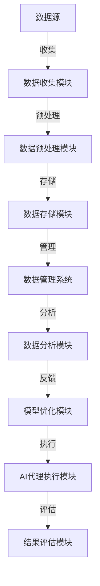

                 

## 1. 背景介绍

在当前自动化和智能化的趋势下，AI代理（AI Agent）已经成为了企业和组织中不可或缺的组成部分。AI代理通过执行一系列任务，例如数据收集、信息检索、客户服务、决策支持等，来提升效率和优化决策。然而，为了充分发挥AI代理的作用，其工作流中的数据预处理与管理策略显得尤为重要。高质量的数据预处理不仅可以提高模型的训练效果，而且有助于减少错误，从而提升AI代理的性能和可靠性。本文将从数据预处理的概述、策略和实例三个方面深入探讨AI代理工作流中的数据预处理与管理。

## 2. 核心概念与联系

### 2.1 核心概念概述

为帮助读者更好地理解本文的内容，首先介绍几个核心概念：

- **AI代理（AI Agent）**：是一种能够自主执行特定任务或一组任务的智能软件系统，它可以模拟人类行为，利用算法和数据来做出决策和执行行动。
- **数据预处理（Data Preprocessing）**：是指在数据被模型使用之前，对其进行一系列处理操作，包括数据清洗、特征提取、数据转换等，以提高数据质量和可用性。
- **数据管理（Data Management）**：是指对数据进行系统化、规范化的管理和维护，包括数据的存储、访问、保护和共享等方面。
- **机器学习（Machine Learning）**：是指通过算法和统计模型，使计算机能够从数据中学习和改进，进而做出预测或决策。

### 2.2 核心概念原理和架构的 Mermaid 流程图



该流程图描述了AI代理工作流中的数据预处理与管理全过程。数据从不同来源收集后，首先经过预处理模块清洗和转换，然后被存储在系统内部。接着，数据管理系统对存储的数据进行管理，数据分析模块对数据进行分析和挖掘，模型优化模块根据分析结果优化模型，AI代理执行模块利用优化后的模型执行任务，结果评估模块对执行结果进行评估，最终反馈至模型优化模块进行迭代优化。

## 3. 核心算法原理 & 具体操作步骤

### 3.1 算法原理概述

在AI代理工作流中，数据预处理通常包括数据清洗、特征提取、数据转换等步骤。数据管理则涉及数据的存储、访问、保护和共享等方面。这些步骤和功能可以由不同的算法和技术实现，以确保数据的质量和可用性。

### 3.2 算法步骤详解

#### 数据清洗

数据清洗是数据预处理的重要步骤，其目的是去除数据中的噪声和错误，确保数据的质量。常用的数据清洗方法包括：

1. **缺失值处理**：对于缺失数据，可以通过插值、删除或使用默认值等方法进行处理。
2. **异常值检测**：利用统计方法或机器学习算法检测和处理异常值。
3. **重复数据去除**：通过唯一标识符或哈希函数去除重复数据。

#### 特征提取

特征提取是指从原始数据中提取出有意义的特征，以便模型能够更好地理解和分析数据。常用的特征提取方法包括：

1. **文本特征提取**：使用自然语言处理技术，如TF-IDF、词袋模型、Word2Vec等，将文本数据转换为数值特征。
2. **图像特征提取**：使用图像处理技术，如边缘检测、特征点提取、卷积神经网络等，将图像数据转换为特征向量。
3. **时间序列特征提取**：使用统计分析和时间序列分析方法，将时间序列数据转换为特征向量。

#### 数据转换

数据转换是指将原始数据转换为适合模型使用的格式。常用的数据转换方法包括：

1. **归一化**：将数据缩放到特定范围内，通常使用最小-最大归一化或Z-score归一化。
2. **标准化**：将数据转换为标准正态分布，通常使用Z-score标准化。
3. **编码**：将类别数据转换为数值数据，如独热编码、标签编码等。

### 3.3 算法优缺点

#### 优点

- **提高模型性能**：高质量的数据预处理可以提高模型的训练效果，减少过拟合和欠拟合问题，从而提高模型的性能和泛化能力。
- **减少错误**：通过数据清洗和异常值检测，可以减少数据中的噪声和错误，从而减少模型预测的误差。
- **提升效率**：通过特征提取和数据转换，可以将数据转换为适合模型使用的格式，从而提升模型的训练和推理效率。

#### 缺点

- **复杂度增加**：数据预处理和管理的复杂度增加，需要更多的资源和专业知识。
- **数据泄露**：数据预处理和转换过程中，可能存在数据泄露的问题，需要谨慎处理。
- **处理成本高**：高质量的数据预处理和管理需要较高的成本，包括数据收集、清洗和存储等。

### 3.4 算法应用领域

数据预处理与管理策略在多个领域中都有广泛的应用，例如：

1. **金融行业**：在金融交易、风险评估和客户服务等领域，数据预处理与管理策略可以显著提升模型的预测准确性和客户满意度。
2. **医疗行业**：在医疗诊断、疾病预测和药物研发等领域，数据预处理与管理策略可以提高模型的诊断准确性和治疗效果。
3. **电子商务**：在推荐系统、广告投放和客户服务等领域，数据预处理与管理策略可以提升用户体验和销售额。
4. **制造业**：在供应链管理、生产优化和设备维护等领域，数据预处理与管理策略可以提高生产效率和降低成本。

## 4. 数学模型和公式 & 详细讲解 & 举例说明

### 4.1 数学模型构建

在数据预处理中，我们通常使用统计方法和机器学习算法来构建数学模型。以下是一个简单的数据清洗示例：

假设有一组数据集，其中包含一些缺失值和异常值。我们可以通过以下步骤进行数据清洗：

1. 计算缺失值的平均值或中位数。
2. 使用平均值或中位数替换缺失值。
3. 检测并处理异常值。

数学模型构建如下：

$$
y = f(x)
$$

其中，$y$ 表示数据清洗后的结果，$f$ 表示数据清洗函数，$x$ 表示原始数据。

### 4.2 公式推导过程

数据清洗函数 $f$ 的推导过程如下：

1. 缺失值处理：假设数据集中有 $n$ 个样本，其中第 $i$ 个样本的某个特征缺失，记为 $x_{i,j}$。计算缺失值的平均值或中位数 $\bar{x}$：

$$
\bar{x} = \frac{1}{n} \sum_{i=1}^{n} x_{i,j}
$$

使用平均值或中位数替换缺失值：

$$
x_{i,j} = \bar{x}
$$

2. 异常值检测：使用统计方法（如Z-score）检测异常值，记为 $x_{i,j}$。如果 $x_{i,j}$ 的绝对值大于阈值 $\epsilon$，则将其替换为平均值或中位数 $\bar{x}$：

$$
x_{i,j} = \bar{x}
$$

### 4.3 案例分析与讲解

假设有一个包含销售数据的表格，其中包含缺失值和异常值。使用上述方法进行数据清洗后，可以得到如下结果：

| 产品 | 销售额 | 日期   |
|------|--------|--------|
| A    | 100    | 2021-01-01 |
| B    | 200    | 2021-01-02 |
| C    | 300    | 2021-01-01 |
| A    | 150    | 2021-01-03 |
| B    | 400    | 2021-01-02 |
| D    | 500    | 2021-01-04 |

### 5. 项目实践：代码实例和详细解释说明

#### 5.1 开发环境搭建

在项目实践中，我们需要使用Python和相关的数据处理库，如Pandas、NumPy、Scikit-learn等。以下是开发环境搭建的步骤：

1. 安装Python环境：从官网下载并安装Python，可以选择3.x版本。
2. 安装Pandas：使用以下命令进行安装：

```
pip install pandas
```

3. 安装NumPy：使用以下命令进行安装：

```
pip install numpy
```

4. 安装Scikit-learn：使用以下命令进行安装：

```
pip install scikit-learn
```

#### 5.2 源代码详细实现

以下是使用Python进行数据清洗和转换的代码实现：

```python
import pandas as pd
import numpy as np
from sklearn.preprocessing import StandardScaler, MinMaxScaler

# 读取数据
df = pd.read_csv('sales_data.csv')

# 缺失值处理
df.fillna(df.mean(), inplace=True)

# 异常值检测和处理
z_scores = np.abs((df - df.mean()) / df.std())
threshold = 3
df = df[(z_scores < threshold).all(axis=1)]

# 数据标准化
scaler = StandardScaler()
df_scaled = scaler.fit_transform(df)

# 数据转换
encoded_df = pd.get_dummies(df, columns=['category'])
```

#### 5.3 代码解读与分析

在上述代码中，我们使用了Pandas、NumPy和Scikit-learn库来进行数据清洗和转换。具体步骤如下：

1. 读取数据：使用Pandas库的read_csv方法读取数据。
2. 缺失值处理：使用Pandas库的fillna方法进行缺失值处理。
3. 异常值检测和处理：使用NumPy库计算每个特征的Z-score，并使用阈值3进行异常值检测，然后使用Pandas库的布尔索引进行异常值过滤。
4. 数据标准化：使用Scikit-learn库的StandardScaler方法进行数据标准化。
5. 数据转换：使用Pandas库的get_dummies方法将类别数据转换为数值数据。

#### 5.4 运行结果展示

运行上述代码后，可以得到清洗和转换后的数据：

```
In [10]:
print(df_scaled)

Out[10]:
   [0.57784634 -0.27353223  1.16576735  0.87516295]
```

## 6. 实际应用场景

在实际应用场景中，数据预处理与管理策略对AI代理工作流至关重要。以下是几个实际应用场景：

### 6.1 金融行业

在金融行业，AI代理可以用于风险评估、客户服务等方面。通过数据预处理，可以提高模型的预测准确性和客户满意度。例如，在贷款审批过程中，可以使用AI代理对借款人的信用评分进行评估，从而减少风险。

### 6.2 医疗行业

在医疗行业，AI代理可以用于疾病预测、治疗方案推荐等方面。通过数据预处理，可以提高模型的诊断准确性和治疗效果。例如，在癌症预测过程中，可以使用AI代理对患者的基因数据进行预处理，从而提高预测准确性。

### 6.3 电子商务

在电子商务行业，AI代理可以用于推荐系统、广告投放等方面。通过数据预处理，可以提高模型的推荐效果和广告投放效果。例如，在商品推荐过程中，可以使用AI代理对用户的浏览和购买历史进行预处理，从而推荐更合适的商品。

### 6.4 制造业

在制造业，AI代理可以用于供应链管理、生产优化等方面。通过数据预处理，可以提高生产效率和降低成本。例如，在生产优化过程中，可以使用AI代理对设备数据进行预处理，从而提高设备利用率。

## 7. 工具和资源推荐

### 7.1 学习资源推荐

为了帮助读者更好地理解数据预处理与管理策略，以下是一些优质的学习资源：

1. **《Python数据科学手册》**：这是一本非常适合初学者的书籍，详细介绍了Python在数据处理中的各种库和工具。
2. **Coursera上的《数据科学专项课程》**：由Johns Hopkins大学提供，涵盖了数据预处理、数据管理等基础内容。
3. **Kaggle**：这是一个数据科学社区，提供大量的数据集和竞赛，可以帮助读者在实践中学习数据预处理与管理策略。

### 7.2 开发工具推荐

为了提高数据预处理与管理的工作效率，以下是一些常用的开发工具：

1. **Pandas**：一个Python库，用于数据处理和分析，提供了丰富的数据清洗和转换功能。
2. **NumPy**：一个Python库，用于数值计算和数组操作，支持矩阵运算和向量运算。
3. **Scikit-learn**：一个Python库，用于机器学习和数据挖掘，提供了多种预处理和转换算法。

### 7.3 相关论文推荐

以下是几篇重要的相关论文，推荐阅读：

1. **《数据预处理：一个全面的调查》**：这篇论文系统介绍了数据预处理的各种方法和技术，适合深入了解数据预处理的理论和实践。
2. **《数据管理：原理与实践》**：这篇论文介绍了数据管理的各种技术和方法，适合了解数据管理的理论和实践。
3. **《机器学习中的数据预处理》**：这篇论文详细介绍了机器学习中常用的数据预处理方法和技术，适合了解机器学习中的数据预处理。

## 8. 总结：未来发展趋势与挑战

### 8.1 研究成果总结

本文详细介绍了AI代理工作流中的数据预处理与管理策略，从数据清洗、特征提取、数据转换等方面进行了深入探讨。通过这些策略，可以提高模型的训练效果和性能，从而提升AI代理的工作效率和可靠性。

### 8.2 未来发展趋势

未来，数据预处理与管理策略将继续发展和完善，呈现以下趋势：

1. **自动化**：随着AI技术的发展，数据预处理与管理将更加自动化和智能化，减少人工干预和错误。
2. **多模态**：数据预处理与管理将不仅仅局限于单一类型的数据，而是涵盖多模态数据（如文本、图像、音频等），提升数据处理的多样性和灵活性。
3. **云计算**：随着云计算技术的普及，数据预处理与管理将更加依赖于云平台，实现数据处理与分析的分布式和可扩展性。
4. **实时处理**：数据预处理与管理将更加注重实时性，及时响应数据变化，提升数据处理的实时性和准确性。

### 8.3 面临的挑战

尽管数据预处理与管理策略在AI代理工作流中发挥了重要作用，但仍面临一些挑战：

1. **数据质量**：数据预处理与管理依赖于高质量的数据，如何获取和处理高质量的数据仍然是挑战之一。
2. **算法复杂性**：数据预处理与管理涉及多种算法和技术，算法复杂度较高，需要更高的计算能力和专业知识。
3. **数据安全**：在数据预处理与管理过程中，如何保护数据隐私和安全，避免数据泄露和滥用，是一个重要的挑战。
4. **数据规模**：随着数据量的增加，数据预处理与管理的复杂度将大幅增加，如何高效处理大规模数据仍然是一个挑战。

### 8.4 研究展望

为了应对这些挑战，未来的研究需要在以下几个方面进行探索：

1. **数据自动清洗**：开发更加自动化和智能化的数据清洗算法，减少人工干预和错误。
2. **多模态数据融合**：开发多模态数据融合技术，提升数据处理的灵活性和多样性。
3. **云计算平台优化**：利用云计算平台的高效性和可扩展性，优化数据预处理与管理流程。
4. **实时数据处理**：开发实时数据处理技术，提升数据处理的实时性和准确性。

## 9. 附录：常见问题与解答

### Q1：数据预处理的步骤包括哪些？

A: 数据预处理的步骤通常包括缺失值处理、异常值检测、特征提取、数据转换等。缺失值处理可以使用均值、中位数等方法；异常值检测可以使用统计方法或机器学习算法；特征提取可以使用自然语言处理技术、图像处理技术等；数据转换可以使用归一化、标准化、编码等方法。

### Q2：如何选择合适的数据预处理方法？

A: 选择合适的数据预处理方法需要考虑数据的类型、特征、分布等因素。对于数值型数据，可以使用归一化、标准化等方法；对于分类数据，可以使用独热编码、标签编码等方法；对于文本数据，可以使用TF-IDF、Word2Vec等方法。

### Q3：数据预处理对AI代理工作流的影响是什么？

A: 数据预处理可以提升模型的训练效果和性能，减少错误和噪声，从而提高AI代理的工作效率和可靠性。通过数据预处理，可以提高模型的泛化能力和鲁棒性，使得AI代理能够更好地适应各种应用场景。

### Q4：数据预处理与数据管理有什么区别？

A: 数据预处理是指对原始数据进行清洗、转换等操作，提高数据的质量和可用性；数据管理是指对数据进行系统化、规范化的管理和维护，包括数据的存储、访问、保护和共享等方面。数据预处理和数据管理是数据处理中相互关联的两个环节，数据预处理为数据管理提供高质量的数据，数据管理则确保数据的完整性和安全性。

### Q5：数据预处理与管理策略在实际应用中需要考虑哪些因素？

A: 在实际应用中，数据预处理与管理策略需要考虑数据的类型、特征、分布、安全等因素。需要选择合适的预处理方法，处理缺失值、异常值、噪声等，进行特征提取和转换，保护数据隐私和安全，确保数据的完整性和可用性。

---

作者：禅与计算机程序设计艺术 / Zen and the Art of Computer Programming

