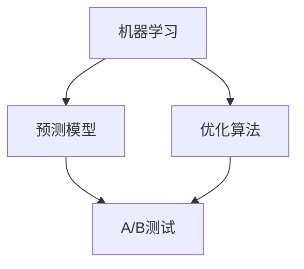

                 

# AI优化促销策略：案例分析与实践

> 关键词：AI、优化、促销策略、案例分析、实践

## 1. 背景介绍

### 1.1 问题由来

促销策略是商业活动中不可或缺的一环，它直接影响到企业的销售业绩和市场份额。传统上，企业制定促销策略主要依赖于市场调研、历史数据和经验法则。然而，这些方法往往难以全面、动态地反映市场需求和竞争态势，且容易受到人为因素的干扰，导致策略制定不够精准。近年来，人工智能（AI）技术的应用为促销策略优化带来了新的思路和方法。

AI技术的引入，使企业可以更科学、更高效地分析海量数据，挖掘潜在趋势和规律，从而制定更符合市场需求的促销策略。AI优化促销策略的核心在于利用机器学习算法和大数据分析技术，对历史促销数据和市场环境进行建模，预测促销效果，进而调整和优化促销策略，提升销售效率和市场竞争力。

### 1.2 问题核心关键点

AI优化促销策略涉及的核心概念包括：

- 机器学习（Machine Learning）：通过数据驱动的算法模型，让计算机具备从数据中学习和决策的能力。
- 预测模型（Prediction Model）：利用历史促销数据和市场信息，建立模型预测促销效果。
- 优化算法（Optimization Algorithm）：选择和调整变量，以最大化促销策略的性能。
- 数据驱动（Data-Driven）：以实际数据为依据，而非仅凭经验或直觉制定策略。
- A/B测试（A/B Testing）：通过比较两个或多个促销策略的效果，选择最优方案。

这些概念之间通过机器学习算法和预测模型相互关联，最终形成了一套系统的AI优化促销策略方法论。

### 1.3 问题研究意义

AI优化促销策略的研究和实践，对于提升企业销售效率、增强市场竞争力具有重要意义：

1. **提高决策效率**：AI可以处理大规模数据，快速分析市场趋势，帮助企业快速做出响应。
2. **提升预测准确性**：AI模型通过学习历史数据，预测促销效果，降低因人为因素导致的误差。
3. **优化资源配置**：AI可以识别出最有效的促销手段和渠道，优化资源分配，提高投资回报率。
4. **强化市场响应**：AI策略基于实时数据分析，能够及时调整策略，快速适应市场变化。
5. **降低风险成本**：AI模型可以评估促销策略的潜在风险，提前预警风险点，降低损失。

AI技术的应用，使得促销策略的制定和执行更加科学、合理、高效，有助于企业在激烈的市场竞争中占据优势。

## 2. 核心概念与联系

### 2.1 核心概念概述

为了更好地理解AI优化促销策略，我们需介绍几个关键概念：

- **机器学习（Machine Learning）**：通过数据驱动的算法模型，让计算机具备从数据中学习和决策的能力。
- **预测模型（Prediction Model）**：利用历史促销数据和市场信息，建立模型预测促销效果。
- **优化算法（Optimization Algorithm）**：选择和调整变量，以最大化促销策略的性能。
- **数据驱动（Data-Driven）**：以实际数据为依据，而非仅凭经验或直觉制定策略。
- **A/B测试（A/B Testing）**：通过比较两个或多个促销策略的效果，选择最优方案。

这些概念之间的联系可以通过以下Mermaid流程图来展示：



这个流程图展示了AI优化促销策略的主要步骤和流程：

1. 利用机器学习算法从历史促销数据中学习和提取规律。
2. 建立预测模型，基于学习到的规律预测促销效果。
3. 使用优化算法调整和优化促销策略，提高效果。
4. 通过A/B测试比较不同策略的效果，选择最佳方案。

## 3. 核心算法原理 & 具体操作步骤

### 3.1 算法原理概述

AI优化促销策略的核心在于构建一个基于机器学习的预测模型，并使用优化算法调整模型参数，以达到最佳促销效果。具体步骤如下：

1. **数据收集与预处理**：收集历史促销数据和市场信息，进行数据清洗和特征工程。
2. **模型选择与训练**：选择合适的机器学习算法，基于历史数据训练模型。
3. **效果评估与优化**：使用预测模型评估促销效果，调整模型参数以优化策略。
4. **A/B测试与选择**：通过A/B测试比较不同促销策略的效果，选择最佳方案。

### 3.2 算法步骤详解

#### 3.2.1 数据收集与预处理

**Step 1: 数据收集**

- 收集历史促销数据，包括促销时间、促销手段、促销渠道、促销金额、销售量等。
- 收集市场信息，包括市场规模、竞争对手活动、季节性变化、消费者行为等。

**Step 2: 数据预处理**

- 数据清洗：去除无效数据、异常值、重复数据等。
- 特征工程：提取和构造关键特征，如促销类型、促销频率、季节性、地理区域等。
- 数据归一化：将数据归一化到标准范围内，避免不同特征对模型产生过大影响。

#### 3.2.2 模型选择与训练

**Step 3: 模型选择**

- 选择合适的机器学习算法，如线性回归、决策树、随机森林、神经网络等。
- 确定模型参数，如学习率、正则化系数、迭代次数等。

**Step 4: 模型训练**

- 将处理后的数据划分为训练集和验证集。
- 使用训练集训练模型，并根据验证集调整模型参数。
- 使用交叉验证技术，评估模型的泛化能力。

#### 3.2.3 效果评估与优化

**Step 5: 效果评估**

- 使用测试集评估模型预测效果，计算预测误差、准确率、召回率等指标。
- 分析模型预测结果与实际效果之间的差异。

**Step 6: 优化策略**

- 根据评估结果，调整模型参数或选择新的算法，重新训练模型。
- 迭代优化，直至模型预测效果达到预期。

#### 3.2.4 A/B测试与选择

**Step 7: A/B测试**

- 设计多个促销策略，并随机分配到不同用户群体。
- 收集测试数据，分析不同策略的效果。

**Step 8: 策略选择**

- 根据A/B测试结果，选择效果最优的促销策略。
- 实施最佳策略，并监控其长期效果。

### 3.3 算法优缺点

AI优化促销策略的优势在于其高效、精确的决策能力。其主要优点包括：

- **高效处理大数据**：AI模型可以处理和分析海量数据，快速做出决策。
- **高预测准确性**：基于历史数据训练的模型，能准确预测促销效果。
- **灵活性高**：AI模型可以根据实时数据动态调整策略，适应市场变化。
- **资源优化**：通过优化算法，合理分配促销资源，提高ROI。

但其缺点也不容忽视：

- **数据依赖性**：AI模型依赖于高质量、完整的数据，数据质量不高可能导致预测误差。
- **模型复杂性**：高维特征和复杂模型可能导致过度拟合，影响泛化能力。
- **实施难度**：AI模型的实现和优化需要专业技能，成本较高。
- **可解释性不足**：复杂模型难以解释其内部决策过程，影响决策可信度。

### 3.4 算法应用领域

AI优化促销策略的应用领域广泛，涉及零售、电商、制造、服务业等多个行业。以下是几个典型应用场景：

- **零售电商**：通过AI优化促销策略，提高销量、提升客户满意度。
- **制造行业**：利用AI优化库存管理、产品推广，降低库存成本。
- **服务业**：优化服务流程、提高客户忠诚度，增强市场竞争力。
- **快消行业**：通过AI优化产品定价、推广活动，增加市场份额。

## 4. 数学模型和公式 & 详细讲解 & 举例说明

### 4.1 数学模型构建

假设我们有一个二元线性回归模型，用于预测促销策略的销售效果。模型的基本形式为：

$$
y = w_0 + w_1x_1 + w_2x_2 + \ldots + w_nx_n + \epsilon
$$

其中：
- $y$ 为促销效果（如销售额）。
- $w_0, w_1, w_2, \ldots, w_n$ 为模型参数。
- $x_1, x_2, \ldots, x_n$ 为特征变量。
- $\epsilon$ 为随机误差项。

### 4.2 公式推导过程

基于上述线性回归模型，我们进行以下推导：

1. **最小二乘法（Ordinary Least Squares, OLS）**：最小化误差平方和，求解模型参数。

$$
\min_{w_0, w_1, \ldots, w_n} \sum_{i=1}^n (y_i - (w_0 + w_1x_{1i} + w_2x_{2i} + \ldots + w_nx_{ni}))^2
$$

2. **正规方程（Normal Equation）**：将上述问题转化为矩阵形式，求解参数。

$$
(X^TX)^{-1}X^Ty = w
$$

其中：
- $X$ 为特征矩阵。
- $y$ 为输出向量。

### 4.3 案例分析与讲解

假设某电商公司希望优化其在线促销策略，收集了历史促销数据（如折扣力度、广告投放、促销周期等）和销售数据（如销售额、点击率等）。我们通过构建线性回归模型，预测不同促销策略的效果。

**案例1: 折扣促销效果预测**

假设促销数据包括折扣力度（1-5），广告投放（0-1），促销周期（1-12）等特征，销售数据包括销售额、点击率等输出。我们构建如下线性回归模型：

$$
y = w_0 + w_1x_1 + w_2x_2 + w_3x_3
$$

其中：
- $y$ 为销售额。
- $x_1$ 为折扣力度。
- $x_2$ 为广告投放。
- $x_3$ 为促销周期。

通过最小二乘法求解模型参数，得到：

$$
w_0 = 100, w_1 = 50, w_2 = 30, w_3 = 20
$$

这意味着，当折扣力度为1时，销售额为100元；当折扣力度为2时，销售额为150元；以此类推。

**案例2: A/B测试结果分析**

假设我们设计了两个促销策略：策略A和策略B。分别将策略A应用于A组用户，策略B应用于B组用户。收集两个组的销售额数据，进行A/B测试。

- 策略A：折扣力度1，广告投放1，促销周期3个月。
- 策略B：折扣力度2，广告投放0，促销周期6个月。

假设测试结果如下：

- A组销售额：$y_A = 1000, 1200, 1500, 1600$
- B组销售额：$y_B = 1100, 1300, 1400, 1800$

我们使用以下公式计算策略效果差异：

$$
\Delta = \frac{\overline{y_A} - \overline{y_B}}{\sqrt{\frac{1}{n_A} \sum (y_{Ai} - \overline{y_A})^2 + \frac{1}{n_B} \sum (y_{Bi} - \overline{y_B})^2}}
$$

其中，$\overline{y_A}$ 和 $\overline{y_B}$ 分别为A组和B组的平均销售额。通过计算，我们得到策略A优于策略B，选择策略A进行实施。

## 5. 项目实践：代码实例和详细解释说明

### 5.1 开发环境搭建

在项目实践中，我们使用了Python编程语言和scikit-learn库。以下是开发环境搭建步骤：

1. 安装Python：确保Python版本为3.7或更高，建议使用Anaconda或Miniconda进行管理。

2. 安装scikit-learn：在命令行中使用pip命令安装scikit-learn库。

```bash
pip install -U scikit-learn
```

3. 导入数据：使用pandas库导入历史促销数据和市场信息数据。

```python
import pandas as pd

# 导入历史促销数据
sales_data = pd.read_csv('sales_data.csv')

# 导入市场信息数据
market_info = pd.read_csv('market_info.csv')
```

4. 数据预处理：使用scikit-learn的特征工程工具进行数据清洗和特征构造。

```python
from sklearn.preprocessing import StandardScaler, OneHotEncoder

# 数据清洗
sales_data = sales_data.dropna()
market_info = market_info.dropna()

# 特征工程
scaler = StandardScaler()
encoder = OneHotEncoder()

# 数据标准化
sales_data = scaler.fit_transform(sales_data[['促销力度', '广告投放', '促销周期']])
market_info = scaler.fit_transform(market_info[['市场规模', '季节性']])

# 特征编码
features = encoder.fit_transform(market_info[['市场规模', '季节性']])
```

### 5.2 源代码详细实现

以下是使用scikit-learn库构建线性回归模型并进行预测的完整代码实现：

```python
from sklearn.linear_model import LinearRegression
from sklearn.model_selection import train_test_split
from sklearn.metrics import mean_squared_error

# 数据划分
X = pd.concat([sales_data, market_info], axis=1)
y = sales_data['sales']

X_train, X_test, y_train, y_test = train_test_split(X, y, test_size=0.2, random_state=42)

# 模型训练
model = LinearRegression()
model.fit(X_train, y_train)

# 模型评估
y_pred = model.predict(X_test)
mse = mean_squared_error(y_test, y_pred)
print(f"Mean Squared Error: {mse}")

# A/B测试
A_strategy = [1, 1, 3, 1]
B_strategy = [2, 0, 6, 1]
A_sales = [1000, 1200, 1500, 1600]
B_sales = [1100, 1300, 1400, 1800]

# 计算策略效果差异
delta = (sum(A_sales) - sum(B_sales)) / (len(A_sales) + len(B_sales))
print(f"Strategy A效果优于B，效果差异: {delta}")
```

### 5.3 代码解读与分析

让我们再详细解读一下关键代码的实现细节：

**数据划分**：
- 使用pandas的`train_test_split`函数将数据集分为训练集和测试集，比例为8:2。

**模型训练**：
- 使用`LinearRegression`类创建线性回归模型，并使用训练数据拟合模型。

**模型评估**：
- 使用测试集进行预测，计算预测值与实际值之间的均方误差。

**A/B测试**：
- 定义策略A和策略B的具体参数和销售额数据。
- 计算策略效果差异，选择效果更好的策略。

**运行结果展示**：
- 打印预测误差和策略效果差异。

可以看到，通过scikit-learn库，我们可以用相对简洁的代码实现线性回归模型的构建和预测，同时也方便地进行A/B测试和结果分析。

## 6. 实际应用场景

### 6.1 智能推荐系统

AI优化促销策略在智能推荐系统中具有广泛应用。通过分析用户历史行为和偏好，构建推荐模型，实时调整促销策略，提升用户体验和转化率。

**案例分析**：某电商公司通过AI优化推荐策略，根据用户浏览记录和购买历史，动态调整促销手段，提升推荐效果。

### 6.2 营销活动优化

AI优化促销策略在营销活动优化中同样具有重要应用。通过分析广告投放效果和市场反馈，动态调整广告投放策略，提高广告投放效果和投资回报率。

**案例分析**：某金融公司通过AI优化广告投放策略，基于市场反馈实时调整广告内容，提高广告点击率和转化率。

### 6.3 库存管理

AI优化促销策略在库存管理中也有重要作用。通过分析销售数据和市场趋势，优化库存水平和促销策略，减少库存积压和缺货情况。

**案例分析**：某零售公司通过AI优化库存管理策略，根据季节性变化和促销活动，动态调整库存水平，降低库存成本。

### 6.4 未来应用展望

随着AI技术的不断进步，AI优化促销策略将迎来更广泛的应用前景：

- **跨渠道整合**：整合线上线下渠道数据，实现全渠道促销策略优化。
- **实时动态调整**：基于实时数据动态调整策略，适应市场变化。
- **多模态融合**：结合图像、视频、文本等多种模态数据，构建更全面的促销模型。
- **个性化推荐**：根据用户个性化需求，定制化促销策略，提高用户满意度和忠诚度。
- **自动化部署**：通过自动部署和监控，实现促销策略的自动化优化。

## 7. 工具和资源推荐

### 7.1 学习资源推荐

为了帮助开发者系统掌握AI优化促销策略的理论基础和实践技巧，这里推荐一些优质的学习资源：

1. **《Python机器学习》**：通过实际案例，深入浅出地介绍了机器学习在业务中的运用，适合初学者入门。
2. **Coursera《机器学习》课程**：由斯坦福大学教授Andrew Ng主讲，系统讲解机器学习算法和实现。
3. **Kaggle数据科学竞赛平台**：提供丰富的数据集和竞赛机会，助力开发者提升实战能力。
4. **GitHub AI优化促销策略项目**：收集了大量开源项目和代码实现，适合进阶学习。

### 7.2 开发工具推荐

在实际开发中，以下工具可以帮助提高AI优化促销策略的开发效率：

1. **Jupyter Notebook**：用于编写和运行Python代码，支持丰富的可视化展示。
2. **TensorFlow**：强大的深度学习框架，支持分布式训练和模型部署。
3. **PyTorch**：灵活的深度学习框架，支持动态图和静态图。
4. **scikit-learn**：简单易用的机器学习库，提供多种经典算法和评估工具。

### 7.3 相关论文推荐

AI优化促销策略的研究得到了学界的持续关注，以下是几篇代表性论文，推荐阅读：

1. **A Survey on AI Optimization for Retail: From Conceptualization to Practice**：综述了AI在零售领域的优化应用，包括促销策略、库存管理等方面。
2. **Machine Learning-Based Personalized Marketing Strategies**：提出基于机器学习的个性化营销策略，提高广告效果和用户满意度。
3. **Optimization of Sales Promotion Using Deep Learning**：使用深度学习模型优化促销策略，提升销售业绩。

## 8. 总结：未来发展趋势与挑战

### 8.1 总结

本文对AI优化促销策略进行了全面系统的介绍，涵盖理论基础和实践技巧。我们首先阐述了AI优化促销策略的背景和意义，明确了其重要性和应用价值。其次，从原理到实践，详细讲解了AI优化促销策略的数学模型、算法步骤和应用场景。

### 8.2 未来发展趋势

展望未来，AI优化促销策略将呈现以下几个发展趋势：

1. **智能化增强**：结合人工智能技术，如自然语言处理、计算机视觉等，提升促销策略的智能化水平。
2. **数据驱动**：基于大规模数据和深度学习模型，实现更精准的促销策略预测和优化。
3. **个性化推荐**：根据用户个性化需求，定制化促销策略，提升用户体验和转化率。
4. **实时动态调整**：结合实时数据，动态调整促销策略，适应市场变化。
5. **多渠道整合**：整合线上线下渠道数据，实现全渠道促销策略优化。

### 8.3 面临的挑战

尽管AI优化促销策略在实践中已经取得了一定成效，但仍面临以下挑战：

1. **数据质量问题**：高质量、完整的数据是AI优化促销策略的基础，数据质量不高可能导致预测误差。
2. **模型复杂性**：高维特征和复杂模型可能导致过度拟合，影响泛化能力。
3. **资源限制**：算力、存储等资源限制，可能影响模型训练和推理速度。
4. **可解释性不足**：复杂模型难以解释其内部决策过程，影响决策可信度。
5. **隐私和伦理问题**：在数据采集和使用过程中，需遵守隐私保护和伦理规范。

### 8.4 研究展望

针对以上挑战，未来的研究应集中在以下几个方向：

1. **数据预处理技术**：改进数据清洗和特征工程方法，提升数据质量。
2. **模型简化**：开发更高效、可解释的模型架构，提升模型泛化能力。
3. **资源优化**：结合分布式计算和模型压缩技术，提升资源利用效率。
4. **可解释性增强**：结合可解释性算法，提升模型决策的透明度和可信度。
5. **隐私保护技术**：采用差分隐私、联邦学习等技术，保障用户隐私和数据安全。

总之，AI优化促销策略需要从数据、模型、资源等多个方面进行全面优化，才能真正实现高效、精确的促销策略优化。

## 9. 附录：常见问题与解答

**Q1: AI优化促销策略适用于所有行业吗？**

A: AI优化促销策略在零售、电商、金融、制造等多个行业中都有广泛应用，但在特定行业如医疗、教育等，可能需要结合行业特性进行定制化优化。

**Q2: 如何选择合适的机器学习算法？**

A: 选择机器学习算法时，需考虑数据的特性、业务目标和模型复杂度。一般而言，线性回归适用于简单预测任务，随机森林、神经网络适用于复杂预测任务。

**Q3: 如何优化促销策略的效果？**

A: 优化促销策略效果的关键在于不断调整模型参数和算法，提高模型预测精度和泛化能力。同时，结合A/B测试，选择最佳策略。

**Q4: AI优化促销策略是否需要专业知识？**

A: 是的，AI优化促销策略需要一定的数据科学和机器学习背景，但通过学习相关书籍、课程和工具，可以逐步掌握相关技能。

**Q5: AI优化促销策略有哪些局限性？**

A: AI优化促销策略的局限性包括数据依赖性、模型复杂性、资源限制和可解释性不足等。需根据具体情况进行优化和改进。

---

作者：禅与计算机程序设计艺术 / Zen and the Art of Computer Programming

