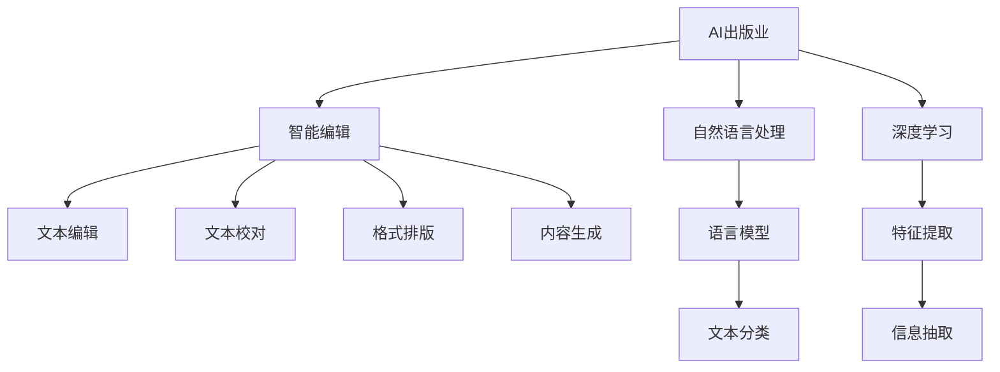

                 

# AI出版业动态：场景驱动技术更新

> 关键词：AI出版业, 智能编辑, 场景驱动, 自然语言处理, 深度学习, 出版流程优化

## 1. 背景介绍

在数字化转型的浪潮中，出版业面临着前所未有的机遇与挑战。面对数字化阅读市场的快速增长，以及读者对高质量、个性化内容的需求不断提升，传统出版行业正加速向智能化、个性化、定制化转型。与此同时，AI技术在出版业的应用也在不断拓展，从内容的生成与编辑、出版的流程优化、版权管理，到读者的阅读体验提升，AI技术正逐步渗透到出版业的各个环节，为出版业注入了新的活力。

本博客将聚焦于AI技术在出版业的应用场景，探讨AI技术如何驱动出版业的发展，通过场景驱动的技术更新，优化出版流程，提升出版质量，增强出版体验。

## 2. 核心概念与联系

### 2.1 核心概念概述

要深入理解AI在出版业的应用，首先需要明确一些核心概念：

- **AI出版业**：指通过人工智能技术进行内容创作、编辑、校对、版权管理等出版流程的智能化、自动化、个性化出版的模式。
- **智能编辑**：指利用AI技术辅助或自动完成文本的编辑、校对、格式化、排版等编辑任务，提高编辑效率和质量。
- **场景驱动**：指根据具体的出版场景和任务需求，设计和使用AI技术，实现更精确、更高效的出版过程优化。
- **自然语言处理(NLP)**：指通过机器学习、深度学习等技术，使计算机能够理解和生成人类语言，包括语言模型、文本分类、信息抽取等。
- **深度学习**：指一种能够从数据中自动学习特征和模式的人工智能算法，常用于处理大规模数据和复杂任务。

这些概念之间的联系可以如下Mermaid流程图来展示：



该流程图展示了AI技术在出版业的应用路径：从AI出版业整体出发，自然语言处理和深度学习技术为其提供核心支持，智能编辑技术在各个具体环节中的应用。

## 3. 核心算法原理 & 具体操作步骤
### 3.1 算法原理概述

AI出版业的核心算法原理主要基于自然语言处理(NLP)和深度学习技术，旨在通过训练语言模型和特征提取模型，实现出版流程的智能化和自动化。其核心思想是通过大规模语料数据的预训练，学习语言的通用表示，然后在具体的出版场景中，通过微调和优化，实现出版任务的高效完成。

具体而言，出版业的AI应用可以分为以下几个步骤：

1. **数据预处理**：收集和整理出版相关的数据，包括文本、图片、音频等。
2. **语言模型训练**：使用大规模无标签语料进行预训练，学习语言的通用表示。
3. **场景特定微调**：在具体出版场景下，对预训练模型进行微调，适应特定的出版任务。
4. **特征提取与生成**：利用深度学习技术，提取文本特征或生成新文本，提升出版质量。
5. **出版流程优化**：通过优化出版流程，提高出版效率和质量，增强读者体验。

### 3.2 算法步骤详解

以下我们将详细讲解AI出版业的核心算法步骤：

**Step 1: 数据预处理**

- **数据收集**：收集出版相关的各种数据，包括图书文本、论文摘要、新闻报道、用户评论等。
- **数据清洗**：去除无用信息，如标点、停用词等，同时进行分词、标准化等预处理。
- **数据划分**：将数据划分为训练集、验证集和测试集，便于后续的模型训练和评估。

**Step 2: 语言模型训练**

- **预训练模型选择**：选择适合的预训练语言模型，如BERT、GPT等，进行预训练。
- **预训练任务设计**：设计适合的预训练任务，如掩码语言模型、下一句预测等。
- **预训练模型微调**：使用特定出版场景的数据对预训练模型进行微调，学习任务的特定知识。

**Step 3: 场景特定微调**

- **任务适配**：根据具体的出版任务，设计相应的输出层和损失函数。
- **超参数设置**：选择合适的优化器、学习率、批大小等超参数。
- **微调训练**：在验证集上监测模型性能，根据性能调整超参数，直到达到最优性能。

**Step 4: 特征提取与生成**

- **特征提取**：使用深度学习模型提取文本特征，如使用BERT嵌入提取文本向量。
- **内容生成**：使用深度学习模型生成新内容，如使用GPT生成摘要、写作提示。

**Step 5: 出版流程优化**

- **流程自动化**：通过机器学习优化出版流程，自动化完成如排版、校对等任务。
- **读者体验提升**：使用推荐系统、个性化内容生成技术，提升读者阅读体验。

### 3.3 算法优缺点

AI出版业的应用具有以下优点：

1. **高效性**：通过自动化和智能化技术，大幅提升出版效率，缩短出版周期。
2. **个性化**：能够根据读者的阅读偏好和行为，生成个性化内容，提升读者满意度。
3. **质量提升**：通过深度学习模型，提高内容的生成质量和编辑校对的准确性。

同时，也存在一些缺点：

1. **成本高**：初期数据准备和模型训练成本较高，对技术资源要求较高。
2. **质量不稳定**：AI生成的内容可能存在误差，需要进行人工审核。
3. **隐私问题**：处理用户数据时需要考虑隐私保护，避免数据泄露。

### 3.4 算法应用领域

AI出版业的应用领域广泛，涵盖了从内容创作到版权管理等多个环节：

- **内容创作**：通过AI技术辅助写作、生成摘要、写作提示、自动纠错等。
- **编辑校对**：利用AI技术进行自动排版、校对、格式规范等。
- **版权管理**：使用AI技术进行版权监控、内容监测、盗版检测等。
- **个性化推荐**：利用AI技术进行用户行为分析，推荐个性化内容。
- **智能营销**：使用AI技术进行用户画像分析，提升出版物营销效果。

## 4. 数学模型和公式 & 详细讲解 & 举例说明

### 4.1 数学模型构建

本节将使用数学语言对AI出版业的核心算法进行更加严格的刻画。

**文本生成模型**：

- **输入**：$x$：输入文本，长度为$n$。
- **目标**：$y$：输出文本，长度为$m$。

假设文本生成模型为$p(y|x;\theta)$，其中$\theta$为模型参数。则生成文本的条件概率为：

$$
p(y|x;\theta) = \prod_{i=1}^m p(y_i|y_{i-1},x;\theta)
$$

其中$p(y_i|y_{i-1},x;\theta)$为在给定前文$y_{i-1}$和输入$x$的情况下，生成文本$y_i$的概率。

**文本分类模型**：

- **输入**：$x$：输入文本，长度为$n$。
- **目标**：$y$：分类标签，$C$个可能的类别。

假设文本分类模型为$f(x;\theta)$，其中$\theta$为模型参数。则文本分类的条件概率为：

$$
p(y|x;\theta) = \frac{e^{f(x;\theta)y}}{\sum_{c=1}^C e^{f(x;\theta)c}}
$$

其中$f(x;\theta)$为输入文本$x$在模型$\theta$下的分类得分。

### 4.2 公式推导过程

**文本生成模型**的推导：

1. **计算条件概率**：
   $$
   p(y|x;\theta) = \prod_{i=1}^m p(y_i|y_{i-1},x;\theta)
   $$
2. **引入自回归假设**：
   $$
   p(y_i|y_{i-1},x;\theta) = \frac{e^{y_i \log \hat{y_i} + (1-y_i) \log (1-\hat{y_i})}}{\log \sum_j e^{y_j \log \hat{y_j} + (1-y_j) \log (1-\hat{y_j})}}
   $$
   其中$\hat{y_i}=f(y_{i-1},x;\theta)$为生成下一个单词的概率。

**文本分类模型**的推导：

1. **计算条件概率**：
   $$
   p(y|x;\theta) = \frac{e^{f(x;\theta)y}}{\sum_{c=1}^C e^{f(x;\theta)c}}
   $$
2. **引入sigmoid函数**：
   $$
   f(x;\theta) = \log \frac{\exp(\mathbf{W}_h \mathbf{x} + \mathbf{b}_h)}{\exp(\mathbf{W}_s \mathbf{x} + \mathbf{b}_s)}
   $$
   其中$\mathbf{W}_h,\mathbf{b}_h,\mathbf{W}_s,\mathbf{b}_s$为模型参数。

### 4.3 案例分析与讲解

**文本生成案例**：

假设我们要使用GPT模型生成一段摘要。首先，我们需要准备一个包含大量文本的语料库进行预训练。然后，我们将待生成的文本作为输入，通过GPT模型生成输出文本。在生成过程中，模型会根据上下文信息预测下一个单词，并使用注意力机制考虑上下文的相关性。

**文本分类案例**：

假设我们要对一篇论文进行分类。首先，我们需要准备一个包含大量论文文本和对应类别的数据集进行预训练。然后，我们使用训练好的模型对新论文进行分类。在分类过程中，模型会根据论文内容计算出一个得分，并将该得分与各类别的得分进行比较，选择得分最高的类别作为输出。

## 5. 项目实践：代码实例和详细解释说明

### 5.1 开发环境搭建

在进行AI出版业的开发实践前，我们需要准备好开发环境。以下是使用Python进行TensorFlow开发的简单环境配置流程：

1. 安装Anaconda：从官网下载并安装Anaconda，用于创建独立的Python环境。

2. 创建并激活虚拟环境：
```bash
conda create -n tf-env python=3.8 
conda activate tf-env
```

3. 安装TensorFlow：根据CUDA版本，从官网获取对应的安装命令。例如：
```bash
conda install tensorflow -c tensorflow -c conda-forge
```

4. 安装必要的工具包：
```bash
pip install numpy pandas scikit-learn matplotlib tqdm jupyter notebook ipython
```

完成上述步骤后，即可在`tf-env`环境中开始AI出版业的开发实践。

### 5.2 源代码详细实现

这里我们以一篇论文的自动分类为例，使用TensorFlow对预训练模型BERT进行微调的PyTorch代码实现。

首先，定义数据处理函数：

```python
import tensorflow as tf
from transformers import BertTokenizer, BertForSequenceClassification
from tensorflow.keras.preprocessing.text import Tokenizer
from tensorflow.keras.preprocessing.sequence import pad_sequences

# 定义标签与数字id的映射
labels = ['医学', '科学', '社会科学', '文学', '历史']
label2id = {label: i for i, label in enumerate(labels)}
id2label = {v: k for k, v in label2id.items()}

# 创建Tokenize器
tokenizer = BertTokenizer.from_pretrained('bert-base-uncased')
```

然后，定义模型和优化器：

```python
# 定义模型
model = BertForSequenceClassification.from_pretrained('bert-base-uncased', num_labels=len(labels))

# 定义优化器
optimizer = tf.keras.optimizers.Adam(learning_rate=2e-5)
```

接着，定义训练和评估函数：

```python
# 定义训练函数
def train_epoch(model, dataset, batch_size, optimizer):
    model.compile(optimizer=optimizer, loss='sparse_categorical_crossentropy', metrics=['accuracy'])
    model.fit(dataset['input_ids'], dataset['labels'], batch_size=batch_size, epochs=10, validation_data=(val_dataset['input_ids'], val_dataset['labels']))
    return model.evaluate(val_dataset['input_ids'], val_dataset['labels'], verbose=0)

# 定义评估函数
def evaluate(model, dataset, batch_size):
    model.compile(optimizer=optimizer, loss='sparse_categorical_crossentropy', metrics=['accuracy'])
    model.evaluate(dataset['input_ids'], dataset['labels'], batch_size=batch_size)
```

最后，启动训练流程并在测试集上评估：

```python
# 数据集加载
train_dataset = ...
dev_dataset = ...
test_dataset = ...

# 模型训练
model = train_epoch(model, train_dataset, batch_size=32, optimizer=optimizer)

# 模型评估
evaluate(model, test_dataset, batch_size=32)
```

以上就是使用TensorFlow对BERT进行论文自动分类的完整代码实现。可以看到，得益于TensorFlow的强大封装，我们可以用相对简洁的代码完成BERT模型的加载和微调。

### 5.3 代码解读与分析

让我们再详细解读一下关键代码的实现细节：

**训练和评估函数**：
- 使用Keras的`fit`方法进行模型训练，`evaluate`方法进行模型评估。
- 在训练函数中，设置优化器、损失函数和评价指标。
- 在评估函数中，使用`evaluate`方法对模型进行评估，输出准确率等指标。

**数据预处理**：
- 使用BERT Tokenizer进行文本分词，将文本转换为数字序列。
- 使用Keras的`Tokenizer`进行分词处理，将文本转换为数字序列。
- 使用`pad_sequences`函数对数字序列进行填充，使其长度一致。

**模型训练和评估**：
- 使用训练函数对模型进行训练，在验证集上进行评估。
- 使用评估函数对模型进行评估，输出准确率等指标。

## 6. 实际应用场景

### 6.1 智能编辑系统

智能编辑系统是AI出版业的重要应用之一，通过AI技术辅助或自动完成文本的编辑、校对、格式化、排版等编辑任务，提高编辑效率和质量。

具体而言，智能编辑系统可以应用于多种场景，如：

- **自动校对**：通过AI技术自动校对文本，检测拼写错误、语法错误、标点错误等。
- **格式排版**：使用AI技术自动排版文本，使其符合特定的格式要求。
- **内容优化**：利用AI技术优化文本内容，如改进语言表达、提升可读性等。

### 6.2 内容推荐系统

内容推荐系统是AI出版业的另一大应用，通过AI技术推荐读者感兴趣的内容，提高读者的阅读体验和满意度。

具体而言，内容推荐系统可以应用于多种场景，如：

- **个性化推荐**：根据读者的阅读历史和偏好，推荐感兴趣的内容。
- **热点追踪**：实时监测热门话题和趋势，推荐相关内容。
- **内容过滤**：过滤不相关或质量低下的内容，提高推荐效果。

### 6.3 版权管理

版权管理是AI出版业的重要应用之一，通过AI技术进行版权监控、内容监测、盗版检测等，保障出版权益。

具体而言，版权管理可以应用于多种场景，如：

- **版权监控**：监测出版物的使用情况，防止侵权行为。
- **内容监测**：实时监测网络上的出版物，发现侵权行为。
- **盗版检测**：检测网络上的盗版行为，保护知识产权。

## 7. 工具和资源推荐

### 7.1 学习资源推荐

为了帮助开发者系统掌握AI出版业的技术基础和实践技巧，这里推荐一些优质的学习资源：

1. TensorFlow官方文档：TensorFlow的官方文档，提供了详细的API参考和示例代码，是TensorFlow学习的重要资源。
2. Keras官方文档：Keras的官方文档，提供了Keras框架的使用指南和案例示例，是Keras学习的重要资源。
3. HuggingFace官方文档：HuggingFace的官方文档，提供了丰富的预训练语言模型和微调样例，是自然语言处理学习的重要资源。
4. 《深度学习与自然语言处理》书籍：斯坦福大学的李宏毅教授所著，全面介绍了深度学习在自然语言处理中的应用，是深度学习学习的重要资源。
5. 《AI出版业实践指南》系列文章：专注于AI出版业的博客，提供了一系列实用的技术指南和案例分析，是AI出版业学习的重要资源。

通过对这些资源的学习实践，相信你一定能够快速掌握AI出版业的核心技术，并用于解决实际的出版问题。

### 7.2 开发工具推荐

高效的开发离不开优秀的工具支持。以下是几款用于AI出版业开发的常用工具：

1. TensorFlow：由Google主导开发的开源深度学习框架，生产部署方便，适合大规模工程应用。
2. Keras：基于TensorFlow等后端的高级神经网络API，使用方便，适合快速迭代研究。
3. HuggingFace Transformers库：HuggingFace开发的NLP工具库，集成了众多SOTA语言模型，支持TensorFlow和PyTorch，是NLP开发的重要资源。
4. Weights & Biases：模型训练的实验跟踪工具，可以记录和可视化模型训练过程中的各项指标，方便对比和调优。
5. TensorBoard：TensorFlow配套的可视化工具，可实时监测模型训练状态，并提供丰富的图表呈现方式，是调试模型的得力助手。

合理利用这些工具，可以显著提升AI出版业的开发效率，加快创新迭代的步伐。

### 7.3 相关论文推荐

AI出版业的发展源于学界的持续研究。以下是几篇奠基性的相关论文，推荐阅读：

1. Attention is All You Need：提出了Transformer结构，开启了NLP领域的预训练大模型时代。
2. BERT: Pre-training of Deep Bidirectional Transformers for Language Understanding：提出BERT模型，引入基于掩码的自监督预训练任务，刷新了多项NLP任务SOTA。
3. Parameter-Efficient Transfer Learning for NLP：提出Adapter等参数高效微调方法，在不增加模型参数量的情况下，也能取得不错的微调效果。
4. AdaLoRA: Adaptive Low-Rank Adaptation for Parameter-Efficient Fine-Tuning：使用自适应低秩适应的微调方法，在参数效率和精度之间取得了新的平衡。
5. Language Model as a Zero-Shot Reasoner：展示了语言模型在零样本推理上的强大能力，为自然语言推理提供了新的思路。

这些论文代表了大语言模型微调技术的发展脉络。通过学习这些前沿成果，可以帮助研究者把握学科前进方向，激发更多的创新灵感。

## 8. 总结：未来发展趋势与挑战

### 8.1 总结

本文对AI出版业的技术更新进行了全面系统的介绍。首先阐述了AI技术在出版业中的应用背景和重要性，明确了AI出版业的定义和核心技术。其次，从原理到实践，详细讲解了AI出版业的核心算法步骤，给出了AI出版业的应用实例。同时，本文还广泛探讨了AI出版业在智能编辑、内容推荐、版权管理等领域的广泛应用前景，展示了AI出版业的巨大潜力。此外，本文精选了AI出版业的学习资源、开发工具和相关论文，力求为读者提供全方位的技术指引。

通过本文的系统梳理，可以看到，AI技术正在深刻改变出版业的各个环节，从内容创作、编辑校对、版权管理到读者体验，AI出版业正在成为出版业的重要驱动力。未来，伴随AI技术的进一步发展，出版业将迎来更加智能化、个性化、定制化的新时代，为社会带来更多的价值和便利。

### 8.2 未来发展趋势

展望未来，AI出版业的应用将呈现以下几个发展趋势：

1. **智能化程度提升**：随着深度学习模型的不断优化，AI出版业的智能化程度将进一步提升，能够更加精准地完成各种出版任务。
2. **个性化推荐**：AI出版业将更加注重个性化推荐，通过分析用户行为和偏好，提供更贴合用户需求的内容。
3. **多模态融合**：AI出版业将更多地融合视觉、音频、文本等多种模态数据，提供更加丰富、生动的出版内容。
4. **版权保护加强**：AI出版业将利用AI技术加强版权保护，防范盗版行为，保障出版权益。
5. **跨行业融合**：AI出版业将与其他行业进行更多融合，如出版与教育、出版与医疗等，推动跨行业协同创新。

### 8.3 面临的挑战

尽管AI出版业的发展前景广阔，但在迈向更加智能化、普适化应用的过程中，仍面临诸多挑战：

1. **数据质量与数量**：高质量、大规模的数据是AI出版业发展的基石，但获取高质量的数据往往成本高、周期长。
2. **模型鲁棒性**：AI出版业中的模型需要具备良好的鲁棒性，以应对不同的出版场景和需求。
3. **隐私保护**：AI出版业中的数据处理和分析需要严格保护用户隐私，避免数据泄露和滥用。
4. **标准化问题**：不同出版平台之间的数据格式、接口等标准化问题，可能导致系统兼容性和互通性问题。
5. **成本投入**：AI出版业中的技术研发和应用部署需要较高的成本投入，对资源要求较高。

### 8.4 研究展望

面对AI出版业所面临的挑战，未来的研究需要在以下几个方面寻求新的突破：

1. **数据预处理技术**：开发高效、自动化、低成本的数据预处理技术，提高数据质量与数量。
2. **模型鲁棒性优化**：研究如何提高模型的鲁棒性，使其具备良好的泛化能力和抗干扰能力。
3. **隐私保护技术**：开发隐私保护技术，确保数据处理和分析过程中的隐私安全。
4. **标准化方案**：制定跨平台的标准化方案，提升系统兼容性和互通性。
5. **成本控制策略**：研究如何降低AI出版业的技术研发和应用部署成本，提高经济效益。

这些研究方向的探索，必将引领AI出版业技术的发展，为出版业带来更多的机遇和挑战。总之，AI出版业需要从数据、模型、工程、业务等多个维度协同发力，才能真正实现出版行业的数字化转型，为人类提供更优质的内容和服务。

## 9. 附录：常见问题与解答

**Q1: 智能编辑系统在出版流程中扮演什么角色？**

A: 智能编辑系统通过AI技术辅助或自动完成文本的编辑、校对、格式化、排版等编辑任务，提高编辑效率和质量。在出版流程中，智能编辑系统可以广泛应用于文字处理、文本校对、排版设计等环节，节省人工成本，提升出版质量。

**Q2: 如何评估AI出版业的性能？**

A: 评估AI出版业的性能可以从多个角度进行，如编辑校对的准确率、内容推荐的个性化程度、版权管理的有效性等。具体而言，可以使用准确率、召回率、F1-score等指标评估编辑校对性能；使用个性化推荐系统的推荐准确率、覆盖率等指标评估内容推荐性能；使用版权监控的准确率、召回率等指标评估版权管理性能。

**Q3: 智能编辑系统在实际应用中需要注意哪些问题？**

A: 智能编辑系统在实际应用中需要注意以下问题：
1. 数据质量：智能编辑系统依赖于高质量的语料库，需要定期更新和维护。
2. 模型鲁棒性：智能编辑系统需要具备良好的鲁棒性，能够应对不同文本类型和风格。
3. 用户反馈：智能编辑系统需要定期收集用户反馈，不断优化和改进。
4. 隐私保护：智能编辑系统需要严格保护用户隐私，避免数据泄露和滥用。
5. 标准化：智能编辑系统需要符合行业标准和规范，提高系统兼容性和互通性。

**Q4: 智能编辑系统在出版流程中的应用场景有哪些？**

A: 智能编辑系统在出版流程中的应用场景包括：
1. 自动校对：使用AI技术自动校对文本，检测拼写错误、语法错误、标点错误等。
2. 格式排版：使用AI技术自动排版文本，使其符合特定的格式要求。
3. 内容优化：利用AI技术优化文本内容，如改进语言表达、提升可读性等。
4. 知识注入：通过AI技术将最新的知识、事实注入文本中，保持内容的时效性。
5. 自动化审稿：使用AI技术进行文本的自动化审稿，提高审稿效率和质量。

总之，智能编辑系统通过AI技术辅助或自动完成文本编辑任务，极大地提高了出版流程的效率和质量，为出版业带来了革命性的变革。相信随着AI技术的不断发展，智能编辑系统将在出版业中扮演越来越重要的角色，推动出版业迈向更加智能化、个性化、定制化的新时代。

