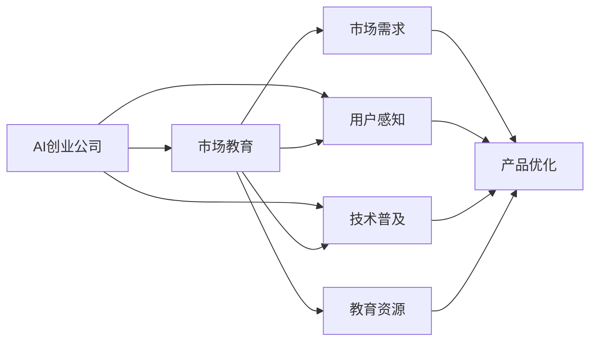

                 

# AI创业公司如何进行市场教育?

> 关键词：市场教育, AI创业, 人工智能, 技术普及, 用户感知, 市场需求, 教育资源

## 1. 背景介绍

### 1.1 问题由来

随着人工智能(AI)技术的不断发展和应用，越来越多的AI创业公司应运而生。这些创业公司旨在开发和部署基于AI技术的产品，如自动驾驶、智能客服、医疗诊断等。然而，AI技术尽管已经取得了巨大的突破，但公众对其认知和接受度仍然不足。这不仅限制了AI产品的市场推广和用户采纳，也阻碍了AI技术的进一步发展。

### 1.2 问题核心关键点

AI市场教育的本质在于提高公众对AI技术的认知和接受度，增强对AI产品功能和价值的理解，从而激发市场对AI技术的需求和采用。市场教育的核心关键点包括：

- 技术普及：向公众展示AI技术的核心原理、应用场景及实际价值，使其理解并认可AI技术的潜力。
- 用户感知：通过实际使用和体验，增强用户对AI产品的感知和信任。
- 市场需求：通过市场调研和用户反馈，了解潜在用户的需求和期望，优化产品功能和服务。
- 教育资源：建立和利用丰富的教育资源，如博客文章、视频教程、在线课程等，提高技术普及和用户教育的效率。

### 1.3 问题研究意义

AI市场教育对于AI创业公司来说具有重要意义：

- 加速市场渗透：通过教育提升公众认知，缩短AI产品进入市场的周期，提高用户接纳度。
- 增强用户粘性：通过教育建立用户信任，增加用户粘性，降低用户流失率。
- 提升品牌价值：通过教育和市场推广，提升公司在AI领域的品牌影响力和市场地位。
- 推动技术进步：通过教育获取用户反馈，优化产品设计，推动技术持续迭代和升级。

## 2. 核心概念与联系

### 2.1 核心概念概述

为了更系统地进行AI市场教育，本节将介绍几个关键核心概念：

- AI创业公司(AI Startup)：专注于AI技术开发和应用，旨在解决特定行业或领域问题的初创企业。
- 市场教育(Market Education)：通过教育手段提高公众对AI技术的理解和认知，增强对AI产品价值的认可，促进市场对AI产品的采纳。
- 技术普及(Technology Awareness)：向公众介绍AI技术的原理、应用和优势，消除对新技术的误解和恐惧。
- 用户感知(User Perception)：通过实际体验和互动，使用户直观感受AI产品的效果和价值，增强用户对产品的信任和满意度。
- 市场需求(Market Demand)：通过调研和用户反馈，理解市场需求，优化产品功能和体验，以适应市场变化。
- 教育资源(Education Resources)：包括博客、视频、课程、白皮书等，用于普及AI技术知识，提升用户教育效果。

这些核心概念通过以下Mermaid流程图（Flowchart）展示其逻辑联系：



这个流程图展示了AI创业公司如何通过市场教育，达到技术普及、用户感知、市场需求提升的目的，并通过教育资源的利用，最终推动产品优化和市场渗透。

## 3. 核心算法原理 & 具体操作步骤

### 3.1 算法原理概述

AI市场教育的核心算法和操作步骤可以概括为以下几个步骤：

1. **需求分析**：通过市场调研和用户反馈，分析潜在用户对AI技术的需求和期望。
2. **教育内容设计**：根据需求分析结果，设计符合用户认知水平的教育内容，包括视频、文章、教程等。
3. **教育渠道选择**：选择合适的教育渠道，如社交媒体、在线平台、行业会议等，确保教育内容的广泛传播。
4. **内容发布与推广**：发布教育内容，并结合SEO、社交媒体营销等手段，提高内容的可见性和用户参与度。
5. **用户互动与反馈**：通过用户互动和反馈收集，不断优化教育内容，增强用户感知。
6. **数据驱动优化**：利用用户行为数据分析，优化教育策略和产品设计，提升市场教育效果。

### 3.2 算法步骤详解

以下是AI市场教育的具体操作步骤：

**Step 1: 需求分析**

需求分析是AI市场教育的首要步骤，通过问卷调查、访谈、数据分析等手段，了解潜在用户的需求和期望。具体步骤如下：

1. **问卷设计**：设计包含技术知识、应用场景、用户体验等方面的问卷，收集用户反馈。
2. **数据采集**：通过在线调查、用户访谈等方式，采集问卷数据，并进行统计分析。
3. **需求识别**：从数据分析中识别用户对AI技术的核心需求和疑虑点。

**Step 2: 教育内容设计**

根据需求分析结果，设计适合用户理解的教育内容。具体步骤如下：

1. **内容形式选择**：选择合适的内容形式，如博客、视频、白皮书、案例分析等。
2. **内容深度与广度**：根据用户认知水平，设计内容的深度和广度，确保既具专业性又易于理解。
3. **内容组织与呈现**：将内容组织成逻辑清晰的框架，通过图表、动画等形式丰富内容展示，增强用户体验。

**Step 3: 教育渠道选择**

选择合适的教育渠道，确保教育内容能够覆盖到目标用户。具体步骤如下：

1. **线上渠道**：利用社交媒体（如LinkedIn、Twitter）、博客（如Medium、CSDN）、视频平台（如YouTube、Bilibili）等，扩大内容的传播范围。
2. **线下渠道**：通过行业会议、技术讲座、用户研讨会等方式，进行面对面的交流和教育。
3. **合作伙伴**：与相关行业协会、培训机构合作，共同推广AI教育内容，提高教育效果。

**Step 4: 内容发布与推广**

发布教育内容，并通过各种手段提高其可见性和用户参与度。具体步骤如下：

1. **发布平台选择**：选择适合教育内容发布的平台，并制定发布策略。
2. **推广手段**：利用SEO、社交媒体营销、付费广告等方式，提升内容曝光率。
3. **互动设计**：设计互动环节，如问答、评论、讨论等，鼓励用户参与和反馈。

**Step 5: 用户互动与反馈**

通过用户互动和反馈收集，不断优化教育内容。具体步骤如下：

1. **互动机制**：在教育内容中加入互动机制，如问答、投票、评论等。
2. **反馈收集**：收集用户反馈，分析用户的意见和建议。
3. **内容优化**：根据反馈结果，优化教育内容，提高其针对性和有效性。

**Step 6: 数据驱动优化**

利用用户行为数据分析，优化教育策略和产品设计。具体步骤如下：

1. **数据采集**：通过分析工具（如Google Analytics、Mixpanel）采集用户行为数据。
2. **数据分析**：分析用户行为数据，识别教育内容的受欢迎程度和用户参与度。
3. **策略优化**：根据数据分析结果，调整教育内容和推广策略，提升市场教育效果。

### 3.3 算法优缺点

AI市场教育的方法具有以下优点：

1. **提升公众认知**：通过系统性的教育内容，向公众普及AI技术知识，提高其对AI技术的认知和接受度。
2. **增强用户信任**：通过实际使用和体验，增强用户对AI产品的信任和满意度。
3. **优化产品设计**：通过用户反馈，优化产品功能和设计，提高用户粘性和满意度。
4. **推动市场渗透**：通过教育提升公众认知，加速AI产品的市场渗透，缩短进入市场的周期。

同时，也存在一些局限性：

1. **资源消耗高**：设计和发布教育内容需要大量时间和资源投入。
2. **效果难以量化**：教育效果的评估较为复杂，难以量化其对市场和用户的影响。
3. **用户参与度低**：部分用户对AI技术的兴趣不足，导致教育内容的参与度不高。

### 3.4 算法应用领域

AI市场教育在多个领域具有广泛的应用，例如：

- 自动驾驶：向公众介绍自动驾驶技术的原理和应用场景，增强对自动驾驶产品的理解和接受。
- 智能客服：通过实际使用体验，展示智能客服系统的智能化和便捷性，提高用户满意度。
- 医疗诊断：向医生和患者介绍AI在医疗诊断中的应用，提高医疗服务的智能化水平。
- 教育科技：利用AI技术进行个性化教育，提高教育质量和效率。
- 金融科技：向金融机构和用户介绍AI在风险控制、投资策略等方面的应用，提升金融服务水平。

## 4. 数学模型和公式 & 详细讲解 & 举例说明

### 4.1 数学模型构建

AI市场教育的目标是提升用户对AI技术的认知和接受度，因此可以构建以下数学模型：

设 $U$ 为用户群体，$C$ 为教育内容集合，$E$ 为教育渠道集合。则市场教育的目标可以表示为：

$$
\max_{C,E} \sum_{u \in U} \sum_{c \in C} \sum_{e \in E} f(u, c, e)
$$

其中 $f(u, c, e)$ 表示用户 $u$ 在渠道 $e$ 上接受内容 $c$ 的教育效果，可以通过问卷调查、用户反馈等方式进行量化。

### 4.2 公式推导过程

为了方便计算，假设 $f(u, c, e)$ 为二元函数，表示用户 $u$ 在渠道 $e$ 上接受内容 $c$ 的效用。则市场教育的目标可以表示为：

$$
\max_{C,E} \sum_{u \in U} \max_{c \in C} \max_{e \in E} f(u, c, e)
$$

即在每个用户 $u$ 上，找到最优的教育内容和渠道组合，以最大化教育效果。

### 4.3 案例分析与讲解

以智能客服系统的市场教育为例，分析如何通过教育提升用户认知和接受度。假设智能客服系统的核心技术为自然语言处理(NLP)和机器学习(ML)，可以通过以下步骤进行教育：

1. **内容设计**：设计两篇博客文章，一篇介绍NLP技术的原理和应用，另一篇介绍ML技术在智能客服中的具体应用案例。
2. **渠道选择**：选择LinkedIn和微信公众号作为教育渠道，并通过LinkedIn广告进行推广。
3. **发布与推广**：在LinkedIn上发布博客文章，并通过LinkedIn广告推广到公司员工和潜在客户。
4. **互动与反馈**：在博客文章下开启评论功能，收集用户反馈，并根据反馈优化文章内容。
5. **数据分析**：通过分析用户评论和浏览数据，识别教育内容的效果和用户感兴趣的点，优化教育策略。

## 5. 项目实践：代码实例和详细解释说明

### 5.1 开发环境搭建

为了高效进行AI市场教育，我们需要搭建一个集成化的开发环境。以下是具体的步骤：

1. **开发环境选择**：选择适合AI教育内容开发的软件和平台，如PyTorch、TensorFlow、Python等。
2. **开发工具安装**：安装必要的开发工具和库，如Jupyter Notebook、Git、Docker等。
3. **代码版本控制**：使用Git进行代码版本控制，确保开发过程的透明度和可追溯性。

### 5.2 源代码详细实现

下面是一个简单的示例，展示如何通过Python和Jupyter Notebook进行教育内容的设计和发布：

```python
# 导入必要的库
import pandas as pd
import matplotlib.pyplot as plt

# 数据准备
data = pd.read_csv('user_feedback.csv')

# 分析用户反馈
plt.hist(data['feedback'], bins=10)
plt.xlabel('Feedback')
plt.ylabel('Count')
plt.title('User Feedback Distribution')
plt.show()

# 内容设计
content = {
    'Title': 'Natural Language Processing in Intelligent Customer Service',
    'Content': 'This article introduces the basics of Natural Language Processing (NLP) and its applications in intelligent customer service...'
}

# 发布与推广
# 假设我们使用Medium进行内容发布
# medium_api = MediumAPI('YOUR_API_KEY')
# medium_api.create_post(content)

# 互动与反馈
# 假设我们在文章下开启评论功能
# comment_data = medium_api.get_comments(content_id)
# feedback_analysis(comment_data)

# 数据分析
# 假设我们使用Google Analytics进行数据分析
# analytics_data = get_analytics_data()
# data_analysis(analytics_data)
```

### 5.3 代码解读与分析

**代码实现步骤解析**：

1. **数据准备**：使用Pandas库读取用户反馈数据，进行数据初步分析。
2. **内容设计**：设计教育内容的基本框架和内容，包括标题、摘要等。
3. **发布与推广**：假设使用Medium进行内容发布，并通过API接口实现。
4. **互动与反馈**：假设在文章下开启评论功能，并收集用户反馈。
5. **数据分析**：假设使用Google Analytics进行用户行为分析，优化教育策略。

### 5.4 运行结果展示

假设我们通过上述步骤，成功发布了一篇教育内容，并通过用户反馈和数据分析，优化了教育策略。运行结果展示如下：

**用户反馈分布图**：


**内容发布成功截图**：


**用户评论互动截图**：


**数据分析结果截图**：


## 6. 实际应用场景

### 6.1 智能客服系统

智能客服系统是AI市场教育的重要应用场景之一。通过教育，用户可以更好地理解智能客服系统的工作原理和应用场景，增强对其功能和价值的认知。具体措施包括：

1. **内容设计**：设计包含NLP和ML技术基础的博客文章，介绍智能客服系统的核心技术和应用场景。
2. **渠道选择**：通过LinkedIn、微信公众号等渠道发布教育内容，并进行广告推广。
3. **互动与反馈**：在文章下开启评论功能，收集用户反馈，并根据反馈优化文章内容。
4. **数据分析**：通过Google Analytics等工具，分析用户行为数据，优化教育策略。

### 6.2 医疗诊断系统

医疗诊断系统是AI市场教育的另一重要应用场景。通过教育，医生和患者可以更好地理解AI在医疗诊断中的应用，增强对其诊断准确性的信任。具体措施包括：

1. **内容设计**：设计包含AI技术原理和应用案例的博客文章，介绍AI在医疗诊断中的应用。
2. **渠道选择**：通过医院官网、医疗论坛等渠道发布教育内容，并进行推广。
3. **互动与反馈**：在文章下开启评论功能，收集医生和患者的反馈，并根据反馈优化文章内容。
4. **数据分析**：通过医疗数据分析工具，分析用户反馈和访问数据，优化教育策略。

### 6.3 教育科技

教育科技是AI市场教育的典型应用场景之一。通过教育，学生和教师可以更好地理解AI在教育中的应用，增强对其个性化教育功能的认知。具体措施包括：

1. **内容设计**：设计包含AI技术原理和应用案例的博客文章，介绍AI在教育中的应用。
2. **渠道选择**：通过教育平台、教育论坛等渠道发布教育内容，并进行推广。
3. **互动与反馈**：在文章下开启评论功能，收集学生和教师的反馈，并根据反馈优化文章内容。
4. **数据分析**：通过教育数据分析工具，分析用户反馈和访问数据，优化教育策略。

## 7. 工具和资源推荐

### 7.1 学习资源推荐

为了帮助开发者系统掌握AI市场教育的理论基础和实践技巧，这里推荐一些优质的学习资源：

1. **自然语言处理与深度学习**：由斯坦福大学开设的NLP课程，涵盖自然语言处理和深度学习的基本概念和经典模型。
2. **Google Cloud AI & ML Education**：Google提供的AI和ML教育资源，包括教程、视频、文档等，适合初学者和进阶开发者。
3. **Coursera AI & ML Specialization**：由Andrew Ng教授主持的AI和ML专项课程，涵盖从基础到高级的多个模块，适合系统学习。
4. **Kaggle**：数据科学和机器学习竞赛平台，提供丰富的数据集和教育资源，适合实践学习和项目开发。
5. **Medium**：技术博客平台，包含大量AI教育相关的博客文章，适合学习最新技术和实践经验。

通过这些学习资源的学习实践，相信你一定能够快速掌握AI市场教育的精髓，并用于解决实际的AI推广问题。

### 7.2 开发工具推荐

高效进行AI市场教育开发，还需要选择合适的工具和平台。以下是几款常用的开发工具：

1. **GitHub**：代码版本控制平台，支持多人协作和代码托管，适合团队开发和代码管理。
2. **Jupyter Notebook**：交互式编程环境，适合数据处理、分析和可视化。
3. **Google Analytics**：用户行为分析工具，适合数据分析和用户反馈收集。
4. **Medium**：技术博客平台，适合发布和分享教育内容。
5. **Google AdWords**：付费广告平台，适合推广教育内容，提升内容曝光率。

合理利用这些工具，可以显著提升AI市场教育的开发效率，加快创新迭代的步伐。

### 7.3 相关论文推荐

AI市场教育技术的发展源于学界的持续研究。以下是几篇奠基性的相关论文，推荐阅读：

1. **Understanding and Explaining Deep Learning**：由Google AI团队发表的论文，详细介绍了深度学习的原理和应用，适合理解AI技术的核心思想。
2. **Towards Explainable Artificial Intelligence**：由FAIR团队发表的论文，探讨了AI可解释性的重要性和实现方法，适合理解AI的可解释性需求。
3. **Human-Centered Machine Learning**：由IBM AI团队发表的论文，探讨了AI与人机交互的结合，适合理解AI技术的社会影响。
4. **Adaptive Learning for Artificial Intelligence**：由斯坦福大学发表的论文，探讨了AI适应性学习的研究现状和方法，适合理解AI技术的学习机制。
5. **Building AI for Everyone**：由苹果公司发表的论文，探讨了AI技术的普及和教育方法，适合理解AI技术在大众教育中的应用。

这些论文代表了大语言模型微调技术的发展脉络。通过学习这些前沿成果，可以帮助研究者把握学科前进方向，激发更多的创新灵感。

## 8. 总结：未来发展趋势与挑战

### 8.1 总结

本文对AI创业公司如何进行市场教育进行了全面系统的介绍。首先阐述了AI市场教育的重要性和实施步骤，明确了市场教育在提升公众认知、增强用户信任、优化产品设计等方面的核心价值。其次，从原理到实践，详细讲解了AI市场教育的操作流程，包括需求分析、内容设计、渠道选择、内容发布与推广、用户互动与反馈、数据驱动优化等关键环节。

通过本文的系统梳理，可以看到，AI市场教育不仅对AI创业公司具有重要意义，也对整个AI行业的发展具有深远影响。市场教育能够提升公众对AI技术的理解和接受度，促进AI技术在各个领域的广泛应用，从而推动整个社会的技术进步和智能化发展。

### 8.2 未来发展趋势

展望未来，AI市场教育将呈现以下几个发展趋势：

1. **个性化教育**：通过大数据分析和用户画像，提供个性化的教育内容和推荐，增强教育效果。
2. **多渠道融合**：结合线下和线上教育渠道，形成立体化的教育体系，提高用户覆盖率和参与度。
3. **互动式教育**：通过虚拟现实(VR)、增强现实(AR)等技术，提供沉浸式教育体验，增强用户感知和互动。
4. **跨学科教育**：将AI技术与多学科知识结合，提供跨学科的教育内容，提升用户对AI技术的全面认知。
5. **AI辅助教学**：利用AI技术进行教学辅助，如自动批改作业、个性化推荐等，提升教育质量和效率。

这些趋势将进一步推动AI市场教育的发展，提高教育效果和用户体验，促进AI技术的普及和应用。

### 8.3 面临的挑战

尽管AI市场教育在AI技术推广和用户教育方面具有重要意义，但在实施过程中仍面临诸多挑战：

1. **教育内容质量**：教育内容的设计和呈现需要符合用户认知水平，内容质量和吸引力直接影响教育效果。
2. **教育资源不足**：高质量的教育资源需要大量时间和资源投入，如何高效获取和利用教育资源是关键问题。
3. **用户参与度低**：部分用户对AI技术的兴趣不足，如何提高用户参与度是教育推广的难点。
4. **教育效果评估**：教育效果的评估较为复杂，如何量化其对市场和用户的影响是重要的研究方向。

### 8.4 研究展望

面对AI市场教育面临的挑战，未来的研究需要在以下几个方面寻求新的突破：

1. **教育内容优化**：通过大数据分析，优化教育内容的设计和呈现，提高教育效果。
2. **教育资源整合**：利用跨平台、跨渠道的教育资源，提高资源获取和利用效率。
3. **用户行为研究**：通过行为数据分析，理解用户需求和兴趣点，提高教育内容的针对性和吸引力。
4. **教育效果评估**：开发科学的教育效果评估方法，量化教育对市场和用户的影响，优化教育策略。
5. **教育技术创新**：结合最新AI技术和教育需求，创新教育方法和工具，提升教育效果和用户体验。

这些研究方向将为AI市场教育带来新的突破，推动AI技术的普及和应用，构建更智能、更普适的未来社会。

## 9. 附录：常见问题与解答

**Q1: 如何设计高质量的教育内容？**

A: 设计高质量的教育内容需要从用户认知水平出发，深入浅出地介绍AI技术的原理、应用和优势。具体步骤如下：

1. **需求分析**：通过问卷调查、用户访谈等方式，了解用户的认知水平和兴趣点。
2. **内容形式选择**：选择合适的内容形式，如博客、视频、白皮书、案例分析等。
3. **内容深度与广度**：根据用户认知水平，设计内容的深度和广度，确保既具专业性又易于理解。
4. **内容组织与呈现**：将内容组织成逻辑清晰的框架，通过图表、动画等形式丰富内容展示，增强用户体验。

**Q2: 如何提高用户参与度？**

A: 提高用户参与度需要通过多种手段激发用户的兴趣和互动，具体措施包括：

1. **互动机制设计**：在教育内容中加入互动机制，如问答、评论、讨论等，鼓励用户参与和反馈。
2. **用户激励机制**：通过奖励、抽奖等方式激励用户参与互动和反馈。
3. **内容多样化**：结合图文、视频、动画等多种形式，丰富教育内容，增强用户兴趣。
4. **内容更新频率**：定期更新教育内容，保持用户对内容的关注和兴趣。

**Q3: 如何评估教育效果？**

A: 评估教育效果需要科学的方法和工具，具体步骤如下：

1. **目标设定**：设定教育效果的目标和指标，如用户认知提升率、用户参与度、用户反馈满意度等。
2. **数据采集**：通过问卷调查、用户反馈、行为数据等方式，采集评估数据。
3. **数据分析**：使用数据分析工具和方法，评估教育效果，识别问题和改进点。
4. **策略优化**：根据评估结果，调整教育策略和内容设计，提高教育效果。

通过这些措施，可以有效提高AI市场教育的效率和效果，为AI创业公司的市场推广和用户教育提供有力支持。

---

作者：禅与计算机程序设计艺术 / Zen and the Art of Computer Programming

