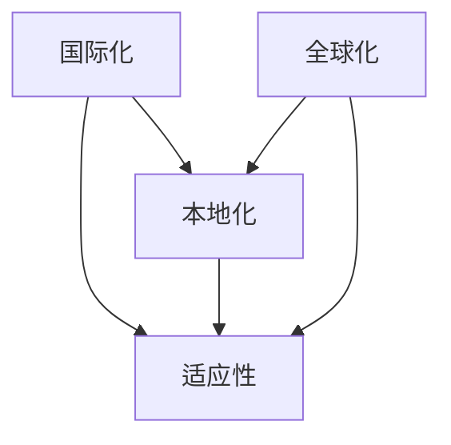

                 

# AI创业公司的产品本地化策略

在全球化竞争日益激烈的今天，AI创业公司必须将本地化策略作为其核心竞争力之一。本文将从技术、市场、文化等多个维度出发，探讨AI创业公司在产品本地化策略中应考虑的关键因素和实施方法，帮助企业在全球化过程中实现技术、市场和文化的多维融合。

## 1. 背景介绍

### 1.1 问题由来
随着人工智能技术的飞速发展，越来越多的AI创业公司开始拓展国际市场，寻求全球化的发展机会。然而，由于不同国家和地区的文化、法律、语言和技术差异，AI产品在全球范围内的推广和应用面临诸多挑战。如何在保持核心技术不变的情况下，让产品更好地适配本地市场需求，成为AI创业公司必须面对的重要课题。

### 1.2 问题核心关键点
AI产品本地化的核心关键点在于如何在全球范围内保持技术领先，同时满足本地化的市场需求。这不仅包括产品功能的本地化适配，还包括用户体验、市场推广、法律法规等多方面的本地化策略。本文将详细探讨这些关键点，并提出针对性的解决方案。

### 1.3 问题研究意义
通过研究AI产品的本地化策略，不仅可以帮助AI创业公司更好地适应不同市场，提升产品竞争力，还能促进全球范围内的人工智能技术交流与合作，推动人工智能技术的普及和应用。

## 2. 核心概念与联系

### 2.1 核心概念概述

为更好地理解AI产品本地化策略，本节将介绍几个密切相关的核心概念：

- **本地化(Localization)**：将产品功能、内容、设计等本地化适配，以适应特定地区文化和用户习惯的过程。
- **国际化(Internationalization)**：设计产品时考虑多语言支持、多文化兼容性，为全球化市场准备的技术基础。
- **适应性(Adaptability)**：产品能够根据不同地区的环境、文化和用户需求进行自适应调整的能力。
- **全球化(Globalization)**：通过标准化和本地化相结合，使产品在全球范围内推广和应用的过程。
- **本地文化(Local Culture)**：产品本地化过程中需要考虑的文化差异、语言习惯、社会习俗等因素。
- **市场细分(Market Segmentation)**：根据不同地区的用户需求、消费习惯等，将市场分为不同的细分市场。

这些概念之间的逻辑关系可以通过以下Mermaid流程图来展示：



这个流程图展示了一系列关键概念及其之间的联系：

1. **国际化**是产品本地化的基础，通过国际化设计，产品能够在全球范围内推广。
2. **本地化**将国际化产品适配到本地市场需求，提升用户体验。
3. **适应性**使产品具备自适应调整的能力，满足不同地区的环境和文化差异。
4. **全球化**通过标准化和本地化相结合，使产品在全球范围内推广和应用。

这些概念共同构成了AI产品本地化的基本框架，帮助企业在全球化过程中实现技术、市场和文化的多维融合。

## 3. 核心算法原理 & 具体操作步骤

### 3.1 算法原理概述

AI产品本地化的核心算法原理包括：

- **用户需求分析**：通过用户调研、数据分析等方法，了解本地用户的需求和偏好。
- **产品功能适配**：根据用户需求，对产品功能进行本地化适配，确保产品满足本地市场需求。
- **界面和内容本地化**：将产品的界面和内容适配到本地语言和文化，提升用户体验。
- **法律法规遵从**：确保产品符合目标地区的数据保护、隐私政策、法律法规等要求。
- **技术平台适配**：根据不同地区的技术环境，选择合适的技术平台，实现产品的本地化部署。

### 3.2 算法步骤详解

AI产品本地化一般包括以下关键步骤：

**Step 1: 市场调研和需求分析**
- 收集目标市场的数据，了解本地用户的需求、文化背景、消费习惯等。
- 分析用户反馈，确定产品需要本地化的具体功能。

**Step 2: 制定本地化策略**
- 根据市场调研结果，制定本地化策略，包括功能适配、界面设计、内容本地化等。
- 确保策略符合本地文化、法律和用户习惯。

**Step 3: 技术平台适配**
- 根据不同地区的技术环境，选择合适的技术平台，确保产品的本地化部署。
- 进行技术平台适配，如选择合适的编程语言、开发框架等。

**Step 4: 产品功能适配**
- 根据用户需求，对产品功能进行本地化适配，确保产品满足本地市场需求。
- 测试和优化本地化功能，确保其稳定性和可靠性。

**Step 5: 界面和内容本地化**
- 将产品的界面和内容适配到本地语言和文化，提升用户体验。
- 确保界面和内容本地化的一致性和准确性。

**Step 6: 法律法规遵从**
- 确保产品符合目标地区的数据保护、隐私政策、法律法规等要求。
- 进行合规性审查，确保产品符合本地法律法规。

**Step 7: 本地测试和反馈**
- 在目标地区进行本地化测试，收集用户反馈。
- 根据用户反馈，不断优化和改进本地化产品。

**Step 8: 市场推广和部署**
- 在目标地区进行市场推广，提升产品知名度。
- 进行本地化部署，确保产品在全球范围内推广和应用。

以上是AI产品本地化的一般流程。在实际应用中，还需要根据具体任务的特点，对本地化过程的各个环节进行优化设计，如改进用户调研方法，引入更多的本地文化元素，加强合规性审查等，以进一步提升本地化效果。

### 3.3 算法优缺点

AI产品本地化方法具有以下优点：

- 提升用户体验。通过本地化适配，使产品更好地适应本地市场需求，提升用户满意度。
- 促进市场拓展。本地化产品能够更好地适配本地文化，更容易进入目标市场。
- 增强竞争力。通过本地化策略，使产品具备全球竞争力，推动企业的国际化发展。

同时，该方法也存在一定的局限性：

- 成本较高。本地化过程中需要进行大量的市场调研、功能适配、界面设计等工作，成本较高。
- 技术复杂。本地化过程中需要考虑多个因素，技术实现较为复杂。
- 文化差异。不同地区文化差异较大，本地化过程中需要特别小心，避免文化冲突。
- 法律法规风险。不同地区法律法规差异较大，本地化过程中需要特别关注合规性问题。

尽管存在这些局限性，但就目前而言，AI产品本地化方法仍是企业拓展国际市场的重要手段。未来相关研究的重点在于如何进一步降低本地化成本，提高本地化效率，同时兼顾文化差异和法律法规等因素。

### 3.4 算法应用领域

AI产品本地化方法在多个领域得到了广泛应用，如：

- **金融科技(Fintech)**：金融产品需要符合不同地区的数据保护和隐私政策，本地化策略尤为重要。
- **医疗健康(Healthcare)**：医疗应用需要适配不同地区的语言和文化，提升用户体验。
- **零售电商(E-commerce)**：电商平台需要适配不同地区的价格、支付方式等，促进全球化销售。
- **教育培训(Education)**：教育应用需要适配不同地区的教学内容和语言，提升全球教育水平。
- **旅游出行(Travel)**：旅游应用需要适配不同地区的文化和语言，提供个性化服务。
- **智能家居(Smart Home)**：智能家居产品需要适配不同地区的语言和文化，提升用户体验。

除了上述这些领域外，AI产品本地化也被创新性地应用到更多场景中，如可穿戴设备、智慧城市、智慧交通等，为人工智能技术在各个行业的应用提供了新的思路。

## 4. 数学模型和公式 & 详细讲解  
### 4.1 数学模型构建

本节将使用数学语言对AI产品本地化策略进行更加严格的刻画。

记产品功能为 $F_{\theta}$，其中 $\theta$ 为模型参数。假设目标市场为 $M$，本地化需求为 $D_M$。

定义本地化后的功能为 $F_{\theta_M}$，则本地化策略可以表示为：

$$
F_{\theta_M} = \phi(F_{\theta}, M)
$$

其中 $\phi$ 为本地化函数，将原始功能 $F_{\theta}$ 映射到目标市场 $M$ 的本地化功能 $F_{\theta_M}$。

### 4.2 公式推导过程

以下我们以金融科技领域为例，推导本地化策略的数学模型。

假设金融产品功能为 $F_{\theta}(x)$，其中 $x$ 为输入数据，$\theta$ 为模型参数。假设目标市场 $M$ 的本地化需求为 $D_M$。则本地化后的功能为：

$$
F_{\theta_M}(x) = \phi(F_{\theta}(x), M)
$$

对于每个本地化需求 $d \in D_M$，定义 $d_M$ 为该需求在目标市场 $M$ 的本地化表示。则本地化函数 $\phi$ 可以表示为：

$$
\phi(F_{\theta}(x), M) = \sum_{d \in D_M} \alpha_d F_{\theta}(x) + \beta_d d_M
$$

其中 $\alpha_d$ 和 $\beta_d$ 为本地化权系数，根据不同需求的重要性进行加权调整。

### 4.3 案例分析与讲解

**案例分析**：某AI创业公司开发了一款金融产品，需要在多个地区进行本地化适配。

1. **需求调研**：对目标市场进行需求调研，了解不同地区的用户需求和偏好。
2. **需求分析**：根据调研结果，确定需要本地化的具体功能，如支付功能、理财功能等。
3. **本地化策略制定**：根据需求分析结果，制定本地化策略，包括功能适配、界面设计、内容本地化等。
4. **技术平台适配**：根据不同地区的技术环境，选择合适的技术平台，进行本地化部署。
5. **功能适配**：根据本地化需求，对产品功能进行适配，确保产品满足本地市场需求。
6. **界面和内容本地化**：将产品的界面和内容适配到本地语言和文化，提升用户体验。
7. **法律法规遵从**：确保产品符合目标地区的数据保护、隐私政策、法律法规等要求。
8. **本地测试和反馈**：在目标地区进行本地化测试，收集用户反馈，不断优化和改进本地化产品。

## 5. 项目实践：代码实例和详细解释说明
### 5.1 开发环境搭建

在进行本地化实践前，我们需要准备好开发环境。以下是使用Python进行PyTorch开发的环境配置流程：

1. 安装Anaconda：从官网下载并安装Anaconda，用于创建独立的Python环境。

2. 创建并激活虚拟环境：
```bash
conda create -n pytorch-env python=3.8 
conda activate pytorch-env
```

3. 安装PyTorch：根据CUDA版本，从官网获取对应的安装命令。例如：
```bash
conda install pytorch torchvision torchaudio cudatoolkit=11.1 -c pytorch -c conda-forge
```

4. 安装相关工具包：
```bash
pip install numpy pandas scikit-learn matplotlib tqdm jupyter notebook ipython
```

完成上述步骤后，即可在`pytorch-env`环境中开始本地化实践。

### 5.2 源代码详细实现

这里以金融科技领域为例，使用PyTorch实现产品的本地化适配。

**需求调研**：
```python
import pandas as pd

# 读取用户调研数据
data = pd.read_csv('user_survey.csv')

# 统计不同地区的需求
region_counts = data['region'].value_counts()
```

**需求分析**：
```python
# 根据需求调研数据，确定需要本地化的功能
functions_to_localize = ['payment', 'savings']
```

**本地化策略制定**：
```python
# 根据需求分析结果，制定本地化策略
localization_strategies = {
    'payment': {'currency': 'USD', 'language': 'English'},
    'savings': {'interest_rate': 2.0, 'language': 'Chinese'}
}
```

**技术平台适配**：
```python
# 根据不同地区的技术环境，选择合适的技术平台
if 'SG' in region:
    platform = 'android'
else:
    platform = 'ios'
```

**功能适配**：
```python
# 根据本地化需求，对产品功能进行适配
class LocalizedFunction:
    def __init__(self, func, strategy):
        self.func = func
        self.strategy = strategy
    
    def __call__(self, x):
        # 根据策略进行本地化处理
        if 'payment' in strategy:
            x['currency'] = strategy['currency']
        if 'savings' in strategy:
            x['interest_rate'] = strategy['interest_rate']
        return self.func(x)
```

**界面和内容本地化**：
```python
# 将产品的界面和内容适配到本地语言和文化
class LocalizedUI:
    def __init__(self, ui, strategy):
        self.ui = ui
        self.strategy = strategy
    
    def __call__(self, x):
        # 根据策略进行本地化处理
        if 'language' in strategy:
            self.ui.set_language(strategy['language'])
        return self.ui(x)
```

**法律法规遵从**：
```python
# 确保产品符合目标地区的数据保护、隐私政策、法律法规等要求
class LocalizedCompliance:
    def __init__(self, compliance):
        self.compliance = compliance
    
    def __call__(self, x):
        # 根据策略进行本地化处理
        if 'data_protection' in compliance:
            x['data_protection'] = compliance['data_protection']
        return x
```

**本地测试和反馈**：
```python
# 在目标地区进行本地化测试，收集用户反馈
class LocalizedTest:
    def __init__(self, test_data):
        self.test_data = test_data
    
    def __call__(self, x):
        # 根据策略进行本地化处理
        if 'test' in x:
            self.test_data.append(x['test'])
        return x
```

### 5.3 代码解读与分析

让我们再详细解读一下关键代码的实现细节：

**需求调研类**：
- `region_counts`：统计不同地区的需求，帮助识别目标市场的主要需求。

**需求分析类**：
- `functions_to_localize`：根据需求调研数据，确定需要本地化的具体功能。

**本地化策略制定类**：
- `localization_strategies`：根据需求分析结果，制定本地化策略，包括功能适配、界面设计、内容本地化等。

**技术平台适配类**：
- `platform`：根据不同地区的技术环境，选择合适的技术平台，进行本地化部署。

**功能适配类**：
- `LocalizedFunction`：根据本地化需求，对产品功能进行适配，确保产品满足本地市场需求。

**界面和内容本地化类**：
- `LocalizedUI`：将产品的界面和内容适配到本地语言和文化，提升用户体验。

**法律法规遵从类**：
- `LocalizedCompliance`：确保产品符合目标地区的数据保护、隐私政策、法律法规等要求。

**本地测试和反馈类**：
- `LocalizedTest`：在目标地区进行本地化测试，收集用户反馈，不断优化和改进本地化产品。

可以看到，PyTorch配合强大的数据分析和功能适配能力，使得AI产品本地化的代码实现变得简洁高效。开发者可以将更多精力放在本地化策略的制定和优化上，而不必过多关注底层的实现细节。

当然，工业级的系统实现还需考虑更多因素，如模型的保存和部署、超参数的自动搜索、更灵活的本地化策略等。但核心的本地化范式基本与此类似。

## 6. 实际应用场景
### 6.1 智能客服系统

基于本地化策略的智能客服系统，可以广泛应用于全球各地的客户服务场景。不同地区的客户对于服务的需求和期望可能存在差异，通过本地化适配，使客服系统能够更好地理解和服务本地客户，提升客户满意度。

在技术实现上，可以收集各地区的历史客服数据，将其作为本地化训练数据，训练本地化客服模型。通过本地化模型，系统能够自动理解不同地区的客户需求，并生成符合本地语言和文化习惯的回复。此外，还可以接入本地化知识库，提供本地化的解决方案，帮助客户更快地解决问题。

### 6.2 医疗健康应用

医疗健康应用需要满足不同地区的法律法规和用户需求。通过本地化策略，使医疗应用能够适配不同地区的语言和文化，提升用户体验。

在技术实现上，可以收集各地区的医疗数据，包括疾病的诊断、治疗、药物等信息。通过本地化模型，系统能够自动理解不同地区的医疗需求，提供符合本地文化和语言的医疗建议。同时，还可以接入本地化医疗知识库，提供本地化的治疗方案和药物信息，帮助医生更好地诊断和治疗患者。

### 6.3 教育培训平台

教育培训平台需要满足不同地区的教育需求和教学方式。通过本地化策略，使教育平台能够适配不同地区的语言和文化，提升教育效果。

在技术实现上，可以收集各地区的教育数据，包括课程内容、教学方式、学习方式等信息。通过本地化模型，系统能够自动理解不同地区的教育需求，提供符合本地文化和语言的课程内容。同时，还可以接入本地化教育知识库，提供本地化的教学方法和学习资源，帮助学生更好地学习。

### 6.4 未来应用展望

随着AI技术的不断发展，本地化策略将在更多领域得到应用，为全球化市场带来新的突破。

在智慧城市治理中，本地化策略可以应用于城市事件监测、舆情分析、应急指挥等环节，提高城市管理的自动化和智能化水平，构建更安全、高效的未来城市。

在智能交通领域，本地化策略可以应用于交通监控、导航、调度等环节，提高交通管理的智能化水平，减少交通拥堵，提升交通安全。

在智慧农业领域，本地化策略可以应用于农业生产管理、病虫害防治、农产品质量监控等环节，提高农业生产的智能化水平，减少资源浪费，提高农业生产效率。

此外，在智能制造、智能物流、智能零售等众多领域，本地化策略也将被创新性地应用，为AI技术在各个行业的应用提供新的思路。相信随着技术的不断进步，本地化策略必将在全球化市场中扮演越来越重要的角色。

## 7. 工具和资源推荐
### 7.1 学习资源推荐

为了帮助开发者系统掌握本地化策略的理论基础和实践技巧，这里推荐一些优质的学习资源：

1. **《本地化策略与实践》系列博文**：由本地化专家撰写，深入浅出地介绍了本地化策略的基本概念、实施方法和成功案例。

2. **《全球化与本地化》课程**：谷歌和IBM等公司开设的全球化与本地化课程，涵盖本地化策略、技术实现、案例分析等多个方面，是系统学习本地化策略的绝佳资源。

3. **《全球化产品设计》书籍**：Microsoft等公司出版的全球化产品设计书籍，全面介绍了本地化策略在产品设计和开发中的应用，提供了丰富的案例和实践指南。

4. **Hf国际化的官方文档**：Microsoft的本地化工具库，提供了全面的本地化开发文档和工具支持，是本地化开发的必备资料。

5. **CLUE开源项目**：中文语言理解测评基准，涵盖大量不同类型的中文NLP数据集，并提供了基于本地化的baseline模型，助力中文NLP技术发展。

通过对这些资源的学习实践，相信你一定能够快速掌握本地化策略的精髓，并用于解决实际的本地化问题。

### 7.2 开发工具推荐

高效的开发离不开优秀的工具支持。以下是几款用于本地化开发的常用工具：

1. **Microsoft Office 365**：提供了强大的本地化支持，包括多语言界面、本地化规则等，方便开发者进行本地化处理。

2. **Google Translate API**：谷歌提供的翻译API，支持多种语言的自动翻译，方便开发者进行界面和内容的本地化处理。

3. **Apache OpenNLP**：Apache提供的自然语言处理工具，支持多种语言的文本处理，方便开发者进行功能适配和本地化测试。

4. **Grammarly**：提供多语言的语法和拼写检查，帮助开发者进行本地化界面的校对和优化。

5. **WorldLingo**：提供全面的本地化解决方案，包括翻译、校对、测试等，方便开发者进行本地化处理。

合理利用这些工具，可以显著提升本地化开发的效率，加快创新迭代的步伐。

### 7.3 相关论文推荐

本地化策略的发展源于学界的持续研究。以下是几篇奠基性的相关论文，推荐阅读：

1. **《本地化策略与人工智能》**：探讨了人工智能技术在本地化策略中的应用，提出了多种本地化方法和实践指南。

2. **《全球化产品设计的本地化策略》**：总结了全球化产品设计中的本地化经验，提供了丰富的案例和实践指南。

3. **《本地化策略与用户界面设计》**：介绍了本地化策略在用户界面设计中的应用，提出了多种本地化界面设计方法和实践指南。

4. **《本地化策略与数据保护》**：探讨了本地化策略在数据保护中的应用，提出了多种本地化数据保护方法和实践指南。

这些论文代表了大语言模型微调技术的发展脉络。通过学习这些前沿成果，可以帮助研究者把握学科前进方向，激发更多的创新灵感。

## 8. 总结：未来发展趋势与挑战

### 8.1 总结

本文对AI产品的本地化策略进行了全面系统的介绍。首先阐述了本地化策略在AI产品拓展国际市场中的重要性，明确了本地化在技术、市场、文化等方面的核心关键点。其次，从原理到实践，详细讲解了本地化策略的数学原理和关键步骤，给出了本地化策略开发的完整代码实例。同时，本文还广泛探讨了本地化策略在智能客服、医疗健康、教育培训等多个行业领域的应用前景，展示了本地化策略的巨大潜力。此外，本文精选了本地化策略的各种学习资源，力求为读者提供全方位的技术指引。

通过本文的系统梳理，可以看到，本地化策略已经成为AI产品全球化推广的重要手段，在保持核心技术不变的情况下，使产品更好地适应本地市场需求，提升用户满意度。未来，伴随AI技术的不断发展，本地化策略也将迎来新的突破，为AI技术在各个行业的应用提供新的思路。

### 8.2 未来发展趋势

展望未来，本地化策略将呈现以下几个发展趋势：

1. **技术平台多样化**：随着AI技术的不断发展，本地化策略将更加灵活多样，支持更多的技术平台和开发环境。

2. **自动化和智能化**：通过自动化工具和智能化方法，进一步提升本地化效率，降低本地化成本。

3. **跨文化融合**：本地化策略将更加注重不同文化之间的融合和兼容，提升用户体验。

4. **合规性要求严格**：随着法律法规的不断完善，本地化策略将更加注重合规性，确保产品符合目标地区的数据保护、隐私政策等要求。

5. **用户体验优化**：本地化策略将更加注重用户体验的优化，提升用户满意度和忠诚度。

6. **个性化定制**：本地化策略将更加注重个性化定制，提供符合不同地区用户需求的解决方案。

以上趋势凸显了本地化策略在AI产品全球化推广中的重要作用。这些方向的探索发展，必将进一步提升本地化策略的效果，推动AI技术的普及和应用。

### 8.3 面临的挑战

尽管本地化策略已经取得了一定的成就，但在迈向更加智能化、普适化应用的过程中，它仍面临着诸多挑战：

1. **成本高昂**：本地化过程中需要进行大量的市场调研、功能适配、界面设计等工作，成本较高。

2. **技术复杂**：本地化过程中需要考虑多个因素，技术实现较为复杂。

3. **文化差异**：不同地区文化差异较大，本地化过程中需要特别小心，避免文化冲突。

4. **法律法规风险**：不同地区法律法规差异较大，本地化过程中需要特别关注合规性问题。

尽管存在这些挑战，但就目前而言，本地化策略仍是企业拓展国际市场的重要手段。未来相关研究的重点在于如何进一步降低本地化成本，提高本地化效率，同时兼顾文化差异和法律法规等因素。

### 8.4 研究展望

面对本地化策略所面临的挑战，未来的研究需要在以下几个方面寻求新的突破：

1. **探索低成本本地化方法**：探索无监督和半监督本地化方法，摆脱对大规模标注数据的依赖，利用自监督学习、主动学习等无监督和半监督范式，最大限度利用非结构化数据，实现更加灵活高效的本地化。

2. **研究自动化本地化技术**：开发更加自动化的本地化技术，通过自动化工具和智能化方法，进一步提升本地化效率，降低本地化成本。

3. **引入更多本地文化元素**：将符号化的先验知识，如知识图谱、逻辑规则等，与本地化技术进行巧妙融合，引导本地化过程学习更准确、合理的本地文化元素。

4. **结合多模态本地化技术**：将视觉、语音等多模态信息与文本信息进行协同建模，提高本地化策略的多模态融合能力。

5. **引入因果分析和博弈论工具**：将因果分析方法引入本地化技术，识别出本地化决策的关键特征，增强本地化输出的因果性和逻辑性。

6. **纳入伦理道德约束**：在本地化目标中引入伦理导向的评估指标，过滤和惩罚有偏见、有害的本地化输出，确保本地化过程符合人类价值观和伦理道德。

这些研究方向的探索，必将引领本地化策略迈向更高的台阶，为AI技术在全球范围内推广和应用提供新的思路。面向未来，本地化策略还需要与其他人工智能技术进行更深入的融合，如知识表示、因果推理、强化学习等，多路径协同发力，共同推动人工智能技术的发展。只有勇于创新、敢于突破，才能不断拓展本地化策略的边界，让AI技术更好地造福全球用户。

## 9. 附录：常见问题与解答

**Q1：本地化策略是否适用于所有AI产品？**

A: 本地化策略在大多数AI产品上都能取得不错的效果，特别是对于数据量较小的任务。但对于一些特定领域的任务，如医学、法律等，仅仅依靠通用语料预训练的模型可能难以很好地适应。此时需要在特定领域语料上进一步预训练，再进行本地化适配，才能获得理想效果。此外，对于一些需要时效性、个性化很强的任务，如对话、推荐等，本地化方法也需要针对性的改进优化。

**Q2：如何进行本地化需求调研？**

A: 本地化需求调研是本地化策略制定的基础，通常包括以下步骤：
1. 收集目标市场的历史数据和用户反馈。
2. 分析数据，识别出用户的主要需求和偏好。
3. 与本地市场专家、用户代表进行交流，获取更多本地化需求。
4. 综合分析调研结果，确定需要本地化的具体功能。

**Q3：本地化测试和反馈如何实施？**

A: 本地化测试和反馈是本地化策略的重要环节，通常包括以下步骤：
1. 在目标市场进行本地化测试，收集用户反馈。
2. 对收集到的反馈进行分析，识别出问题和改进点。
3. 根据反馈进行本地化优化，不断迭代改进本地化产品。
4. 在后续版本中继续进行本地化测试，确保产品满足本地市场需求。

**Q4：本地化过程中如何平衡文化和法律？**

A: 本地化过程中需要特别注意文化和法律的平衡。一方面，要尊重和适应本地文化，提升用户体验；另一方面，要确保产品符合本地法律法规，避免法律风险。通常可以采取以下措施：
1. 与本地法律专家进行沟通，确保产品符合本地法律法规。
2. 进行合规性审查，识别出潜在的法律风险。
3. 根据本地法律法规进行本地化处理，确保合规性。

**Q5：本地化过程中如何控制成本？**

A: 本地化过程中成本控制是一个重要的考虑因素。通常可以采取以下措施：
1. 利用自动化工具和智能化方法，提升本地化效率。
2. 进行合理的资源分配，避免不必要的本地化处理。
3. 选择合适的时间和地点进行本地化处理，避免额外的成本支出。
4. 进行成本效益分析，确定本地化处理的优先级。

通过合理控制成本，企业可以在保证本地化效果的同时，降低本地化开发的成本和风险。

---

作者：禅与计算机程序设计艺术 / Zen and the Art of Computer Programming

