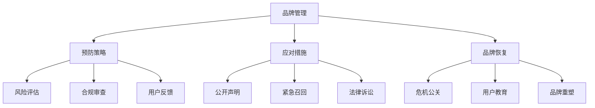

                 

# AI创业公司的品牌危机管理：预防、应对与恢复

> 关键词：AI品牌管理, 品牌危机, 预防策略, 应对措施, 品牌恢复

## 1. 背景介绍

### 1.1 问题由来
随着人工智能（AI）技术的迅猛发展，越来越多的创业公司利用AI技术打造智能产品，希望能够在竞争激烈的市场上脱颖而出。然而，品牌危机事件的发生往往措手不及，严重影响了公司的形象和市场价值。例如，AI公司在发布新模型或新产品后，由于模型性能不佳、偏见问题或数据隐私问题被曝光，导致用户信任度下降，甚至引发用户集体抵制。

品牌危机事件的发生不仅会直接损害公司的财务状况，还可能带来严重的声誉损失，影响公司的长期发展。因此，AI创业公司需要建立一套完善的品牌危机管理体系，从预防、应对到恢复，全面提升品牌健康度和市场竞争力。

### 1.2 问题核心关键点
AI创业公司品牌危机的核心关键点包括：
- **预防策略**：如何在产品开发和发布前识别潜在风险，避免危机事件的发生。
- **应对措施**：一旦危机事件发生，如何迅速响应，控制损失，稳定市场。
- **品牌恢复**：危机事件平息后，如何修复品牌形象，恢复用户信任，推动业务发展。

## 2. 核心概念与联系

### 2.1 核心概念概述

为更好地理解AI创业公司的品牌危机管理方法，本节将介绍几个密切相关的核心概念：

- **品牌管理（Brand Management）**：指企业通过建立和维护品牌形象，提升品牌知名度、美誉度和忠诚度的过程。品牌管理包括品牌定位、品牌传播、品牌保护等方面。

- **品牌危机（Brand Crisis）**：指由于企业的产品或服务出现问题，导致品牌形象受损，市场信任度下降的事件。常见的品牌危机包括产品质量问题、安全事故、数据泄露等。

- **预防策略（Preventive Strategies）**：指企业通过采取一系列措施，提前识别潜在风险，避免品牌危机的发生。预防策略包括风险评估、合规审查、用户反馈机制等。

- **应对措施（Mitigation Measures）**：指在品牌危机发生后，企业迅速响应，采取各种措施控制损失，稳定市场。应对措施包括公开声明、紧急召回、法律诉讼等。

- **品牌恢复（Brand Recovery）**：指在品牌危机平息后，企业通过一系列行动，修复品牌形象，恢复市场信任。品牌恢复包括危机公关、用户教育、品牌重塑等。

- **品牌形象（Brand Image）**：指消费者对品牌的整体印象和感知，包括品牌质量、可靠性、创新性等方面。品牌形象的提升和维护，是企业长期成功的关键。

- **品牌信任（Brand Trust）**：指消费者对品牌的信任和依赖程度，是品牌价值的重要组成部分。品牌信任的建立和维护，需要企业持续提供高质量的产品和服务。

这些核心概念之间的逻辑关系可以通过以下Mermaid流程图来展示：



这个流程图展示了一些关键概念及其之间的联系：

1. **品牌管理**是品牌危机的预防、应对和恢复的基础。
2. **预防策略**通过风险评估、合规审查、用户反馈等手段，提前识别潜在危机。
3. **应对措施**在危机发生后迅速响应，控制损失，稳定市场。
4. **品牌恢复**在危机平息后，通过危机公关、用户教育、品牌重塑等手段，恢复品牌形象。
5. **品牌形象**和**品牌信任**是品牌管理的最终目标，需要通过持续的努力才能实现。

## 3. 核心算法原理 & 具体操作步骤
### 3.1 算法原理概述

AI创业公司的品牌危机管理主要依赖于一系列预防、应对和恢复措施，以下是其主要算法原理：

- **预防策略**：通过风险评估算法，识别潜在的品牌危机风险。
- **应对措施**：通过快速响应算法，对危机事件进行及时处理。
- **品牌恢复**：通过品牌重塑算法，修复品牌形象，恢复用户信任。

### 3.2 算法步骤详解

**预防策略**：
1. **风险评估**：
   - 对产品功能、用户反馈、市场需求等进行全面评估，识别潜在风险。
   - 使用统计分析、自然语言处理等技术，自动分析用户评论、社交媒体等数据，识别负面舆情。

2. **合规审查**：
   - 对产品涉及的法律法规、行业标准进行全面审查，确保符合相关规定。
   - 定期进行内部合规检查，确保企业运营符合法律法规要求。

3. **用户反馈机制**：
   - 建立有效的用户反馈渠道，及时收集用户意见和建议。
   - 分析用户反馈数据，识别常见问题和改进方向。

**应对措施**：
1. **公开声明**：
   - 在危机事件发生后，迅速发布公开声明，解释情况，表示歉意，并提供解决方案。
   - 使用自然语言处理技术，自动生成官方声明和回答用户问题。

2. **紧急召回**：
   - 对于存在安全问题或性能缺陷的产品，及时进行紧急召回，避免对用户造成更大损失。
   - 使用供应链管理软件，实现产品召回的快速响应和追踪。

3. **法律诉讼**：
   - 对于涉及法律纠纷的危机事件，及时进行法律诉讼，维护企业权益。
   - 使用法律咨询平台，快速获取法律建议和解决方案。

**品牌恢复**：
1. **危机公关**：
   - 通过与媒体、用户沟通，消除负面舆情，恢复品牌形象。
   - 使用社交媒体管理工具，实时监测和响应用户评论和反馈。

2. **用户教育**：
   - 通过用户培训、教育材料，帮助用户了解产品功能和使用方法。
   - 使用在线教育平台，提供实时培训和问题解答。

3. **品牌重塑**：
   - 重新定位品牌形象，推出新产品或服务，提升品牌价值。
   - 使用品牌设计工具，重新设计品牌标识和营销策略。

### 3.3 算法优缺点

**预防策略**的优缺点：
- **优点**：
  - 提前识别潜在风险，避免危机事件的发生。
  - 使用技术手段，提高效率和准确性。
- **缺点**：
  - 需要持续投入人力物力进行风险评估和合规审查。
  - 存在误判风险，可能会误报或漏报潜在危机。

**应对措施**的优缺点：
- **优点**：
  - 快速响应，控制损失，稳定市场。
  - 使用技术手段，提高效率和精确度。
- **缺点**：
  - 需要迅速决策和资源投入，可能面临资源不足的问题。
  - 存在舆论失控的风险，需要持续监控和调整。

**品牌恢复**的优缺点：
- **优点**：
  - 通过一系列措施，修复品牌形象，恢复用户信任。
  - 使用技术手段，提高效率和准确性。
- **缺点**：
  - 需要大量时间和资源进行品牌重塑和用户教育。
  - 存在市场回暖时间不确定性的问题。

### 3.4 算法应用领域

AI创业公司的品牌危机管理方法，已在多个领域得到应用，包括但不限于：

- **医疗健康**：AI医疗产品在使用过程中，一旦发现安全问题，需迅速召回并发布公开声明，修复品牌形象。
- **金融科技**：AI金融产品在使用过程中，一旦涉及用户隐私泄露，需迅速采取法律诉讼等措施，稳定市场。
- **智能制造**：AI智能制造产品在使用过程中，一旦发现性能缺陷，需迅速进行召回和修复，恢复用户信任。
- **智能家居**：AI智能家居产品在使用过程中，一旦涉及安全问题，需迅速采取措施，恢复市场信任。

## 4. 数学模型和公式 & 详细讲解 & 举例说明
### 4.1 数学模型构建

品牌危机的预防、应对和恢复过程，可以通过以下数学模型进行描述：

- **风险评估模型**：
  $$
  Risk(x) = P(Danger|x) \times Impact
  $$
  其中，$x$为产品功能、用户反馈、市场需求等输入数据，$Danger$为潜在风险，$P(Danger|x)$为风险发生的概率，$Impact$为风险影响的严重程度。

- **公开声明生成模型**：
  $$
  Declaration = Function(Scenario, Data)
  $$
  其中，$Scenario$为危机事件的具体情况，$Data$为用户评论、社交媒体等数据，$Function$为自动生成声明的算法，包括自然语言处理、情感分析等技术。

- **紧急召回模型**：
  $$
  Recall = Cost_Benefit(Defect, Cost)
  $$
  其中，$Defect$为产品缺陷，$Cost_Benefit$为召回决策函数，根据召回成本和潜在收益进行评估。

- **品牌恢复模型**：
  $$
  Recovery = T_Cost + R_Speed + P_Ed
  $$
  其中，$T_Cost$为品牌恢复的时间成本，$R_Speed$为恢复的速度，$P_Ed$为用户教育投入。

### 4.2 公式推导过程

以下我们以品牌风险评估模型为例，推导其计算公式。

假设品牌风险评估模型有$n$个输入特征，记为$\{x_i\}_{i=1}^n$，其中$x_i$为第$i$个特征的取值。设$P(Danger|x)$为风险发生的概率，$Impact$为风险影响的严重程度，则风险评估模型的输出$Risk$为：

$$
Risk = \sum_{i=1}^n w_i x_i
$$
其中，$w_i$为第$i$个特征的权重系数。

根据统计学习方法中的线性回归模型，可以通过训练数据集$\{(x_i, r_i)\}_{i=1}^m$，求解权重系数$w_i$，使得损失函数最小化。损失函数定义为：

$$
Loss(w) = \frac{1}{m} \sum_{i=1}^m (y_i - \sum_{j=1}^n w_j x_{i,j})^2
$$

通过求解上述最小化问题，可以得到最优的权重系数$w_i$，从而实现风险评估模型的训练。

### 4.3 案例分析与讲解

以AI医疗产品为例，分析其品牌危机的预防、应对和恢复过程。

**预防策略**：
1. **风险评估**：
   - 通过统计分析用户反馈数据，识别常见的健康问题。
   - 使用自然语言处理技术，自动分析社交媒体上的健康话题，识别潜在风险。

2. **合规审查**：
   - 对产品的医疗数据处理和存储方式进行合规审查，确保符合相关法规。
   - 定期进行内部合规检查，确保运营合规。

3. **用户反馈机制**：
   - 建立在线反馈渠道，收集用户对产品的意见和建议。
   - 分析反馈数据，识别常见问题和改进方向。

**应对措施**：
1. **公开声明**：
   - 在发现产品安全问题后，迅速发布公开声明，解释情况，提供解决方案。
   - 使用自然语言处理技术，自动生成声明内容。

2. **紧急召回**：
   - 对于涉及用户健康安全的问题，及时进行产品召回。
   - 使用供应链管理软件，实现快速召回和追踪。

3. **法律诉讼**：
   - 对于涉及法律纠纷的问题，及时采取法律诉讼措施。
   - 使用法律咨询平台，获取法律建议和解决方案。

**品牌恢复**：
1. **危机公关**：
   - 通过媒体沟通，消除负面舆情，恢复品牌形象。
   - 使用社交媒体管理工具，实时监测和响应用户评论。

2. **用户教育**：
   - 通过在线培训，帮助用户了解产品使用方法和安全知识。
   - 提供详细的健康知识库和操作指南。

3. **品牌重塑**：
   - 重新设计品牌标识和营销策略，提升品牌价值。
   - 推出新产品或服务，改善用户体验。

## 5. 项目实践：代码实例和详细解释说明
### 5.1 开发环境搭建

在进行品牌危机管理实践前，我们需要准备好开发环境。以下是使用Python进行开发的环境配置流程：

1. 安装Anaconda：从官网下载并安装Anaconda，用于创建独立的Python环境。

2. 创建并激活虚拟环境：
```bash
conda create -n brand-management python=3.8 
conda activate brand-management
```

3. 安装相关依赖：
```bash
pip install pandas numpy scikit-learn scikit-learn-nlp transformers pytorch torchtext
```

4. 安装TensorBoard：
```bash
pip install tensorboard
```

5. 安装PyTorch：根据CUDA版本，从官网获取对应的安装命令。例如：
```bash
conda install pytorch torchvision torchaudio cudatoolkit=11.1 -c pytorch -c conda-forge
```

完成上述步骤后，即可在`brand-management`环境中开始品牌危机管理实践。

### 5.2 源代码详细实现

以下是使用Python进行品牌危机管理的代码实现示例：

**风险评估模型**：
```python
import pandas as pd
from sklearn.ensemble import RandomForestClassifier
from sklearn.metrics import accuracy_score

# 读取数据
data = pd.read_csv('risk_data.csv')

# 定义特征和标签
X = data[['feature1', 'feature2', 'feature3']]
y = data['risk']

# 定义模型和训练数据集
model = RandomForestClassifier()
X_train, X_test, y_train, y_test = train_test_split(X, y, test_size=0.2, random_state=42)

# 训练模型
model.fit(X_train, y_train)

# 预测并评估
y_pred = model.predict(X_test)
accuracy = accuracy_score(y_test, y_pred)
print(f"Risk assessment model accuracy: {accuracy}")
```

**公开声明生成模型**：
```python
import transformers
from transformers import pipeline
from transformers import AutoTokenizer, AutoModelForSequenceClassification

# 定义声明生成模型
tokenizer = AutoTokenizer.from_pretrained('bert-base-cased')
model = AutoModelForSequenceClassification.from_pretrained('bert-base-cased', num_labels=2)

# 定义声明生成函数
def generate_declaration(text, scenario):
    text = tokenizer.encode(text, truncation=True, padding='max_length', max_length=512)
    inputs = {"input_ids": text}
    outputs = model(**inputs)
    if outputs.logits.argmax() == 0:
        return f"公开声明：{scenario} 已确认，公司正在紧急处理，敬请关注更新。"
    else:
        return f"公开声明：{scenario} 不存在，公司正常运营，请放心使用。"

# 生成声明
declaration = generate_declaration("产品安全问题", "疑似存在安全隐患")
print(declaration)
```

**紧急召回模型**：
```python
import numpy as np

# 定义召回决策函数
def recall_decision(defect, cost):
    if defect > cost:
        return True
    else:
        return False

# 测试召回决策
defect = 5000  # 产品缺陷
cost = 10000  # 召回成本
if recall_decision(defect, cost):
    print("需要紧急召回产品")
else:
    print("无需紧急召回产品")
```

**品牌恢复模型**：
```python
# 定义品牌恢复模型
def brand_recovery(t_cost, r_speed, p_ed):
    return t_cost + r_speed + p_ed

# 测试品牌恢复模型
t_cost = 10000  # 时间成本
r_speed = 50  # 恢复速度
p_ed = 5000  # 用户教育投入
recovery_cost = brand_recovery(t_cost, r_speed, p_ed)
print(f"品牌恢复成本：{recovery_cost}")
```

### 5.3 代码解读与分析

让我们再详细解读一下关键代码的实现细节：

**风险评估模型**：
- 使用Pandas库读取风险评估数据，通过随机森林模型进行训练和评估。
- 定义特征和标签，使用sklearn的train_test_split方法进行数据分割。
- 训练模型，并计算模型在测试集上的准确率。

**公开声明生成模型**：
- 使用HuggingFace的Transformers库，定义BERT模型作为声明生成器。
- 定义声明生成函数，接收输入文本和情景描述，通过模型生成声明内容。

**紧急召回模型**：
- 定义召回决策函数，根据产品缺陷和召回成本，决定是否进行召回。
- 通过测试代码验证召回决策函数的效果。

**品牌恢复模型**：
- 定义品牌恢复模型，接收时间成本、恢复速度和用户教育投入，计算品牌恢复成本。
- 通过测试代码验证品牌恢复模型的计算逻辑。

## 6. 实际应用场景
### 6.1 智能医疗健康

在智能医疗健康领域，AI创业公司需要建立完善的品牌危机管理体系，以应对突发事件，保护患者隐私，恢复用户信任。例如，某智能健康监测设备在用户反馈中发现数据泄露问题，应迅速采取公开声明、紧急召回等措施，并加强数据隐私保护，提升品牌形象。

### 6.2 金融科技

金融科技公司面临的风险和危机事件更加复杂多样，涉及数据隐私、金融安全等多个方面。一旦发生危机事件，公司需迅速响应，采取法律诉讼、公开声明等措施，同时加强合规审查，确保运营符合法律法规要求。

### 6.3 智能家居

智能家居产品在使用过程中，可能面临安全隐患、产品缺陷等问题，AI公司需建立完善的预防、应对和恢复机制，确保用户安全，恢复品牌信任。例如，某智能门锁在使用过程中发生安全漏洞，应迅速采取紧急召回和危机公关等措施，并加强产品安全测试，提升用户信任。

### 6.4 未来应用展望

随着AI技术的不断进步，品牌危机管理将面临更多的挑战和机遇。未来，品牌危机管理将更依赖于智能技术和大数据分析，提升预防和应对的效率和准确性。同时，品牌恢复将更加注重用户教育和品牌重塑，提升品牌的长期竞争力。

## 7. 工具和资源推荐
### 7.1 学习资源推荐

为了帮助开发者系统掌握品牌危机管理的理论基础和实践技巧，这里推荐一些优质的学习资源：

1. 《品牌管理》系列书籍：深入讲解品牌管理的理论基础和实践方法，涵盖品牌定位、品牌传播、品牌保护等方面。

2. 《危机公关》课程：从理论到实践，全面讲解危机公关的方法和技巧，涵盖舆情监测、媒体沟通等方面。

3. 《数据科学导论》课程：讲解数据科学的基本原理和方法，涵盖数据预处理、模型训练、结果分析等方面。

4. 《深度学习与自然语言处理》课程：讲解深度学习在自然语言处理中的应用，涵盖文本分类、情感分析、信息抽取等方面。

5. 《机器学习实战》书籍：通过具体案例，讲解机器学习在实际应用中的方法和技巧。

### 7.2 开发工具推荐

高效的开发离不开优秀的工具支持。以下是几款用于品牌危机管理开发的常用工具：

1. Python：广泛使用的编程语言，具有强大的数据处理和分析能力。

2. Pandas：数据分析工具，用于数据预处理、清洗和分析。

3. Scikit-learn：机器学习库，提供多种算法和模型，支持模型训练和评估。

4. TensorFlow：深度学习框架，提供丰富的模型和工具，支持模型训练和推理。

5. TensorBoard：模型可视化工具，用于实时监测和分析模型性能。

6. PyTorch：深度学习框架，提供灵活的模型定义和训练功能。

7. HuggingFace Transformers库：NLP工具库，提供多种预训练语言模型，支持快速开发和部署。

合理利用这些工具，可以显著提升品牌危机管理的开发效率，加快创新迭代的步伐。

### 7.3 相关论文推荐

品牌危机管理的研究源于学界的持续研究。以下是几篇奠基性的相关论文，推荐阅读：

1. 《品牌危机的预防与应对》：研究品牌危机的预防策略和应对措施，提供具体的案例分析。

2. 《社交媒体中的品牌危机管理》：探讨社交媒体对品牌危机的影响，提出有效的危机管理策略。

3. 《机器学习在品牌管理中的应用》：讲解机器学习在品牌管理中的应用，包括风险评估、用户反馈分析等方面。

4. 《品牌重塑与用户教育》：研究品牌重塑和用户教育的策略，提供具体的实践案例。

这些论文代表了大品牌危机管理技术的发展脉络。通过学习这些前沿成果，可以帮助研究者把握学科前进方向，激发更多的创新灵感。

## 8. 总结：未来发展趋势与挑战
### 8.1 总结

本文对AI创业公司的品牌危机管理方法进行了全面系统的介绍。首先阐述了品牌危机的预防、应对与恢复的重要性，明确了在AI创业公司中建立品牌危机管理体系的必要性。其次，从理论到实践，详细讲解了品牌危机管理的数学模型和关键步骤，给出了品牌危机管理任务开发的完整代码实例。同时，本文还广泛探讨了品牌危机管理在智能医疗健康、金融科技、智能家居等多个行业领域的应用前景，展示了品牌危机管理技术的广泛应用。此外，本文精选了品牌危机管理的各类学习资源，力求为读者提供全方位的技术指引。

通过本文的系统梳理，可以看到，AI创业公司的品牌危机管理是一个复杂而多层次的过程，需要在预防、应对和恢复各个环节进行全面优化，才能真正实现品牌健康和市场竞争力的提升。

### 8.2 未来发展趋势

展望未来，品牌危机管理技术将呈现以下几个发展趋势：

1. **预防策略的智能化**：借助大数据分析和机器学习技术，实现对潜在危机的精准识别和预测。

2. **应对措施的自动化**：通过智能机器人、聊天机器人等技术，实现自动化的危机响应和处理。

3. **恢复过程的数字化**：利用数字营销、社交媒体分析等技术，提升品牌恢复的效果和速度。

4. **多领域融合**：品牌危机管理将更加注重与其他领域的融合，如智能制造、智慧医疗等，形成多领域协同的综合治理体系。

5. **隐私保护意识的提升**：随着数据隐私法规的日益严格，品牌危机管理将更加注重数据隐私保护，提升用户信任。

以上趋势凸显了品牌危机管理技术的广阔前景。这些方向的探索发展，必将进一步提升品牌危机的预防、应对和恢复能力，保障品牌健康和市场竞争力。

### 8.3 面临的挑战

尽管品牌危机管理技术已经取得了一定的进展，但在迈向更加智能化、普适化应用的过程中，它仍面临着诸多挑战：

1. **数据隐私问题**：品牌危机管理需要大量用户数据进行分析和预测，如何保护用户隐私，避免数据泄露，将是重要的研究课题。

2. **技术复杂性**：品牌危机管理涉及多个领域的知识，如自然语言处理、数据分析、机器学习等，需要综合多学科的知识和技能。

3. **用户信任重建**：品牌危机发生后，如何通过有效的危机公关和用户教育，重新建立用户信任，需要长期的努力和投入。

4. **跨领域协同**：品牌危机管理需要跨领域的协同合作，如企业内部、政府监管、第三方机构等，如何协调各方利益，提升协同效果，仍需进一步优化。

5. **技术落地问题**：品牌危机管理技术如何更好地落地应用，实现高效、实时、自动化的响应和处理，需要持续的技术优化和迭代。

### 8.4 研究展望

面对品牌危机管理面临的挑战，未来的研究需要在以下几个方面寻求新的突破：

1. **智能化预警系统**：开发基于大数据和机器学习的智能化预警系统，实现对潜在危机的精准识别和预测。

2. **自动化响应平台**：建立自动化响应平台，实现对品牌危机的快速响应和处理，提升响应效率。

3. **数字化品牌恢复**：利用数字营销和社交媒体分析等技术，提升品牌恢复的效果和速度。

4. **隐私保护技术**：研究数据隐私保护技术，确保用户数据的保密性和安全性。

5. **跨领域协同机制**：建立跨领域的协同机制，提升各方在品牌危机管理中的协同效果。

6. **用户信任重建方法**：研究有效的用户信任重建方法，通过危机公关和用户教育，提升用户信任度。

这些研究方向的探索，必将引领品牌危机管理技术迈向更高的台阶，为构建安全、可靠、可控的智能系统铺平道路。面向未来，品牌危机管理技术还需要与其他人工智能技术进行更深入的融合，如知识表示、因果推理、强化学习等，多路径协同发力，共同推动品牌危机的预防、应对和恢复。只有勇于创新、敢于突破，才能不断拓展品牌危机的边界，让品牌危机管理技术更好地服务于企业和社会。

## 9. 附录：常见问题与解答

**Q1：品牌危机管理需要哪些关键要素？**

A: 品牌危机管理需要以下关键要素：
1. **预防策略**：通过风险评估、合规审查、用户反馈等手段，提前识别潜在风险，避免危机事件的发生。
2. **应对措施**：在危机事件发生后，迅速响应，采取各种措施控制损失，稳定市场。
3. **品牌恢复**：在危机平息后，通过危机公关、用户教育、品牌重塑等手段，恢复品牌形象。

**Q2：品牌危机管理的重点有哪些？**

A: 品牌危机管理的重点包括：
1. **预防**：通过风险评估、合规审查、用户反馈等手段，提前识别潜在风险，避免危机事件的发生。
2. **应对**：在危机事件发生后，迅速响应，采取各种措施控制损失，稳定市场。
3. **恢复**：在危机平息后，通过危机公关、用户教育、品牌重塑等手段，恢复品牌形象。

**Q3：如何提升品牌危机管理的智能化水平？**

A: 提升品牌危机管理的智能化水平，可以采取以下措施：
1. **数据驱动**：利用大数据和机器学习技术，实现对潜在危机的精准识别和预测。
2. **自动化**：通过智能机器人、聊天机器人等技术，实现自动化的危机响应和处理。
3. **数字化**：利用数字营销、社交媒体分析等技术，提升品牌恢复的效果和速度。

**Q4：品牌危机管理中需要注意哪些问题？**

A: 品牌危机管理中需要注意以下问题：
1. **数据隐私**：品牌危机管理需要大量用户数据进行分析和预测，如何保护用户隐私，避免数据泄露，是关键问题。
2. **技术复杂性**：品牌危机管理涉及多个领域的知识，需要综合多学科的知识和技能。
3. **用户信任重建**：品牌危机发生后，如何通过有效的危机公关和用户教育，重新建立用户信任，需要长期的努力和投入。
4. **跨领域协同**：品牌危机管理需要跨领域的协同合作，如何协调各方利益，提升协同效果，仍需进一步优化。
5. **技术落地问题**：品牌危机管理技术如何更好地落地应用，实现高效、实时、自动化的响应和处理，需要持续的技术优化和迭代。

这些问题的解决，需要企业、学术界和政策制定者共同努力，形成多方协作的协同机制，提升品牌危机管理的智能化和普适化水平。

**Q5：品牌危机管理在实际应用中需要注意哪些细节？**

A: 品牌危机管理在实际应用中需要注意以下细节：
1. **快速响应**：在危机事件发生后，需要迅速响应，采取各种措施控制损失，稳定市场。
2. **透明公开**：通过公开声明、紧急召回等措施，向公众透明公开危机事件的处理情况。
3. **用户教育**：通过在线培训、教育材料等手段，帮助用户了解产品功能和使用方法，增强用户信任。
4. **品牌重塑**：通过重新设计品牌标识和营销策略，提升品牌形象，恢复用户信任。

这些细节的处理，需要企业具备快速响应能力、透明度和用户教育意识，才能有效地应对品牌危机，保护品牌健康和市场竞争力。

---

作者：禅与计算机程序设计艺术 / Zen and the Art of Computer Programming

