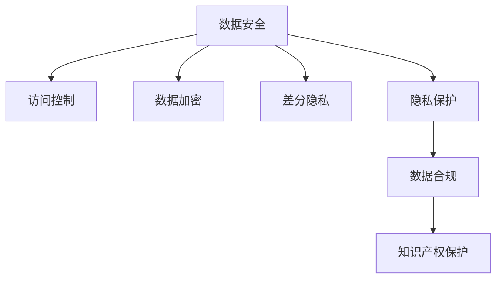

                 

# AI创业公司的商业秘密保护

> 关键词：商业秘密保护, 数据安全, 隐私保护, 人工智能, 机器学习, 数据合规, 知识产权

## 1. 背景介绍

### 1.1 问题由来
在当今激烈的市场竞争中，AI创业公司面临着各种挑战，其中最核心的是如何保护公司商业秘密不被泄露或被竞争对手获取。商业秘密是公司的重要资产，包括技术算法、客户数据、商业模式等。一旦商业秘密被泄露，不仅会导致公司损失巨大的经济利益，还可能削弱公司的竞争优势，甚至引发法律诉讼和声誉损失。

### 1.2 问题核心关键点
AI创业公司商业秘密保护的核心问题包括：
- 数据安全：如何保护公司在AI模型训练和应用中使用的数据不被非法访问和滥用。
- 隐私保护：如何在收集和处理客户数据时，确保个人隐私不被侵犯。
- 知识产权保护：如何确保公司自主研发的技术和算法不被侵犯或非法使用。
- 数据合规：如何在遵守相关法律法规的前提下，合理使用数据进行AI开发。

本文将详细探讨AI创业公司在商业秘密保护方面应采取的策略和措施，包括数据安全、隐私保护、知识产权保护和数据合规等方面，帮助公司构建完善的数据安全和隐私保护机制。

## 2. 核心概念与联系

### 2.1 核心概念概述

为更好地理解AI创业公司在商业秘密保护方面的策略和措施，本节将介绍几个密切相关的核心概念：

- **数据安全(Data Security)**：指保护公司内部和外部的数据不被未经授权的访问、泄露或破坏。
- **隐私保护(Privacy Protection)**：指保护个人信息不被非法收集、存储、使用或共享，保障个人隐私权。
- **知识产权(IPR, Intellectual Property Rights)**：指公司对其技术、算法、专利等创新成果享有的一系列法律保护。
- **数据合规(Data Compliance)**：指公司在其数据收集、处理和使用的各个环节，符合相关法律法规和行业标准。
- **差分隐私(Differential Privacy)**：一种隐私保护技术，通过添加噪声扰动，使得单个数据记录无法被识别，同时保证数据的总体统计特性。
- **访问控制(Access Control)**：通过身份验证和权限管理，限制对数据和系统的访问。
- **数据加密(Data Encryption)**：通过加密算法，保护数据在传输和存储过程中的安全性。

这些核心概念之间的逻辑关系可以通过以下Mermaid流程图来展示：



这个流程图展示了大语言模型的核心概念及其之间的关系：

1. 数据安全是保护数据不被非法访问和滥用的基础。
2. 访问控制和数据加密是数据安全的关键技术手段。
3. 差分隐私是在保护隐私的同时，保证数据可用性的有效方法。
4. 隐私保护是保障个人隐私权益的重要环节。
5. 数据合规是遵守法律法规和行业标准的必要措施。
6. 知识产权保护是维护公司创新成果不被侵犯的法律保障。

## 3. 核心算法原理 & 具体操作步骤

### 3.1 算法原理概述

AI创业公司在商业秘密保护方面，主要通过以下几种算法和策略进行实施：

- **访问控制算法(ACL, Access Control List)**：通过建立和维护一个访问控制列表，限制对数据和系统的访问权限。只有经过授权的用户才能访问特定数据。
- **数据加密算法(Encryption)**：使用对称加密或非对称加密技术，保护数据在传输和存储过程中的安全性。
- **差分隐私算法(DP, Differential Privacy)**：通过在数据处理过程中添加噪声，保证单个数据记录无法被识别，同时不影响整体数据的统计特性。
- **数据匿名化(Anonymization)**：对数据进行去标识化处理，使得数据无法与特定个体关联。
- **安全多方计算(SMC, Secure Multi-Party Computation)**：允许多方在不共享数据的情况下，共同计算一个函数的结果，确保数据隐私的同时实现合作计算。

这些算法和策略在实际应用中，可以相互结合使用，构建更全面的数据安全体系。

### 3.2 算法步骤详解

AI创业公司商业秘密保护的主要步骤包括：

**Step 1: 数据分类与安全策略制定**

- 对公司内部的数据进行分类，根据敏感程度和保密级别制定不同的安全策略。
- 确定数据处理的范围和目标，明确哪些数据需要加密、匿名化或差分隐私保护。

**Step 2: 数据访问控制**

- 建立和维护访问控制列表(ACL)，限制对敏感数据的访问权限。
- 使用多因素身份验证(MFA)等技术，加强对敏感数据访问的管控。

**Step 3: 数据加密**

- 对数据进行加密存储，使用对称加密算法如AES，非对称加密算法如RSA等。
- 对数据传输过程中使用加密协议，如TLS/SSL等，确保数据传输的安全性。

**Step 4: 差分隐私保护**

- 对涉及个人隐私的数据进行差分隐私处理，添加噪声扰动。
- 确定隐私预算(ε, epsilon)，控制数据处理的隐私损失。

**Step 5: 数据匿名化**

- 对数据进行去标识化处理，使用伪匿名化、假名化等技术。
- 确保匿名化后的数据无法被反向识别。

**Step 6: 安全多方计算**

- 在需要多方合作的场景中，使用安全多方计算技术，确保数据隐私的同时实现合作计算。

**Step 7: 定期安全审计与监控**

- 定期进行安全审计和渗透测试，发现并修复潜在的安全漏洞。
- 部署安全监控系统，实时监测数据访问和使用情况。

**Step 8: 应急响应计划**

- 制定应急响应计划，确保在发生数据泄露事件时能够快速响应和处理。

### 3.3 算法优缺点

AI创业公司商业秘密保护算法和策略的优缺点如下：

#### 优点

- 访问控制和数据加密可以防止未经授权的访问和数据泄露，保障数据安全。
- 差分隐私保护可以在保障隐私的同时，保证数据可用性，提高数据分析和应用价值。
- 数据匿名化可以有效保护个人隐私，减少数据泄露的风险。
- 安全多方计算可以在不共享数据的前提下，实现多方合作计算，保障数据隐私。

#### 缺点

- 访问控制和数据加密可能会影响数据处理的效率和性能。
- 差分隐私处理会引入一定的隐私损失，数据精度可能受到影响。
- 数据匿名化处理可能改变数据的分布特性，影响数据分析和应用效果。
- 安全多方计算的计算复杂度较高，可能影响计算效率。

### 3.4 算法应用领域

AI创业公司商业秘密保护算法和策略在多个领域得到广泛应用，包括但不限于：

- 医疗数据保护：对患者数据进行匿名化处理，保护患者隐私。
- 金融数据安全：对客户数据进行加密和差分隐私处理，防止数据泄露。
- 电子商务数据合规：确保客户数据在收集和处理过程中符合法律法规和行业标准。
- 智能制造数据安全：对生产数据进行访问控制和加密，防止数据被非法访问和滥用。
- 智能交通数据保护：对交通数据进行差分隐私处理，保护个人隐私和数据隐私。

## 4. 数学模型和公式 & 详细讲解 & 举例说明（备注：数学公式请使用latex格式，latex嵌入文中独立段落使用 $$，段落内使用 $)
### 4.1 数学模型构建

本节将使用数学语言对AI创业公司商业秘密保护中的几个核心算法进行详细描述。

**访问控制列表(ACL)模型**：

一个基本的访问控制列表可以用以下三元组表示：

- 访问者(A)：访问数据的用户或系统。
- 资源(R)：需要访问的数据或系统。
- 权限(P)：访问者对资源的操作权限，如读、写、执行等。

形式化地，访问控制列表可以表示为：

$$
\text{ACL} = \{(A_i, R_j, P_k)\}_i^j
$$

其中，$A_i$ 表示第 $i$ 个访问者，$R_j$ 表示第 $j$ 个资源，$P_k$ 表示第 $k$ 个权限。

**对称加密算法(如AES)**：

对称加密算法的基本原理是，使用相同的密钥对数据进行加密和解密。

假设明文为 $M$，密钥为 $K$，则对称加密公式为：

$$
C = E_{K}(M)
$$

其中 $E$ 表示加密算法，$C$ 表示密文。

**差分隐私算法**：

差分隐私算法通过在数据处理过程中添加噪声，使得单个数据记录无法被识别，同时保证数据的总体统计特性。

假设原始数据集为 $D$，添加噪声后的数据集为 $D'$，噪声分布为 $\mathcal{N}(0,\sigma^2)$，则差分隐私保护公式为：

$$
D' = D + \mathcal{N}(0,\sigma^2)
$$

其中 $\sigma$ 表示噪声强度，决定了隐私保护的强度。

**数据匿名化算法**：

数据匿名化算法通过对数据进行去标识化处理，使得数据无法与特定个体关联。

假设原始数据集为 $D$，匿名化后的数据集为 $D'$，匿名化算法为 $A$，则数据匿名化公式为：

$$
D' = A(D)
$$

其中 $A$ 表示匿名化算法。

### 4.2 公式推导过程

以下我们将对以上几个核心算法进行详细的公式推导。

**对称加密算法(如AES)**：

对称加密算法的加密和解密公式如下：

$$
C = E_{K}(M)
$$
$$
M = D_{K}(C)
$$

其中 $E$ 表示加密算法，$D$ 表示解密算法，$K$ 表示密钥。

**差分隐私算法**：

差分隐私算法的隐私保护公式如下：

$$
D' = D + \mathcal{N}(0,\sigma^2)
$$

其中 $\mathcal{N}(0,\sigma^2)$ 表示均值为0，方差为 $\sigma^2$ 的正态分布噪声。

**数据匿名化算法**：

数据匿名化算法的匿名化公式如下：

$$
D' = A(D)
$$

其中 $A$ 表示匿名化算法，$D$ 表示原始数据集。

### 4.3 案例分析与讲解

假设某AI创业公司开发了一款智能推荐系统，需要从用户行为数据中提取特征并进行分析，以提升推荐效果。在数据收集和处理过程中，需要对用户数据进行隐私保护和安全性保障。

**案例1：用户数据隐私保护**

- 对用户行为数据进行差分隐私处理，添加噪声扰动，确保单个用户的行为数据无法被识别。
- 定义隐私预算为 ε = 1，表示在隐私保护的前提下，最大允许的隐私损失为 1。
- 在数据分析过程中，应用差分隐私算法，将噪声加入到数据集中，使得单个用户的行为数据无法被识别，同时不影响整体数据的统计特性。

**案例2：数据访问控制**

- 对公司内部数据进行分类，根据敏感程度和保密级别制定不同的访问权限。
- 对敏感数据建立访问控制列表，限制非授权用户访问。
- 使用多因素身份验证(MFA)技术，加强对敏感数据访问的管控。

## 5. 项目实践：代码实例和详细解释说明

### 5.1 开发环境搭建

在进行AI创业公司商业秘密保护的技术实践前，我们需要准备好开发环境。以下是使用Python进行PyTorch开发的环境配置流程：

1. 安装Anaconda：从官网下载并安装Anaconda，用于创建独立的Python环境。

2. 创建并激活虚拟环境：
```bash
conda create -n ai-dev python=3.8 
conda activate ai-dev
```

3. 安装PyTorch：根据CUDA版本，从官网获取对应的安装命令。例如：
```bash
conda install pytorch torchvision torchaudio cudatoolkit=11.1 -c pytorch -c conda-forge
```

4. 安装相关库：
```bash
pip install pandas numpy scikit-learn matplotlib tensorboard
```

完成上述步骤后，即可在`ai-dev`环境中开始商业秘密保护实践。

### 5.2 源代码详细实现

下面我们以差分隐私算法为例，给出使用PyTorch实现差分隐私保护的大致代码实现。

```python
import torch
import torch.nn as nn
import torch.utils.data as data
import torch.optim as optim
from torchvision import datasets, transforms
from torchvision.models import resnet

class DPResnet(nn.Module):
    def __init__(self, resnet_type='resnet18', output_size=10):
        super(DPResnet, self).__init__()
        self.resnet = resnet.__dict__[resnet_type](num_classes=output_size)
        self.dp = nn.Dropout(0.5)

    def forward(self, x, noise):
        x = self.resnet(x)
        x = self.dp(x)
        x = x + noise
        return x

def train_differential_privacy(resnet_type, output_size, noise_sigma, epochs):
    batch_size = 128
    train_loader = torch.utils.data.DataLoader(datasets.MNIST('data', train=True, download=True, transform=transforms.ToTensor(), target_transform=None), batch_size=batch_size, shuffle=True)

    noise = torch.randn(batch_size, 1, 1, 1)
    model = DPResnet(resnet_type, output_size)
    optimizer = optim.Adam(model.parameters(), lr=0.001)
    loss_fn = nn.CrossEntropyLoss()

    for epoch in range(epochs):
        for i, (inputs, labels) in enumerate(train_loader):
            inputs = inputs.view(-1, 28*28)
            labels = labels

            optimizer.zero_grad()
            outputs = model(inputs, noise)
            loss = loss_fn(outputs, labels)
            loss.backward()
            optimizer.step()

            if i % 100 == 0:
                print('Epoch [{}/{}], Step [{}/{}], Loss: {:.4f}'.format(epoch+1, epochs, i+1, len(train_loader), loss.item()))

    return model
```

### 5.3 代码解读与分析

让我们再详细解读一下关键代码的实现细节：

**DPResnet类**：
- `__init__`方法：初始化ResNet模型，并添加Dropout层。
- `forward`方法：前向传播计算，在输出前应用Dropout，并添加噪声扰动。

**train_differential_privacy函数**：
- 定义训练参数，包括训练集、批量大小、迭代轮数等。
- 初始化模型、优化器和损失函数。
- 在每个epoch内，对训练集数据进行迭代，计算损失并更新模型参数。
- 使用Adam优化器更新模型参数。

以上代码展示了差分隐私保护的实现步骤，通过在模型输出前应用Dropout和噪声扰动，确保单个用户的行为数据无法被识别，同时不影响整体数据的统计特性。

## 6. 实际应用场景

### 6.1 智能推荐系统

AI创业公司开发智能推荐系统，需要对用户行为数据进行隐私保护和安全性保障。具体步骤如下：

- 对用户行为数据进行差分隐私处理，添加噪声扰动。
- 在数据分析过程中，应用差分隐私算法，将噪声加入到数据集中，确保单个用户的行为数据无法被识别。
- 对敏感数据建立访问控制列表，限制非授权用户访问。
- 使用多因素身份验证(MFA)技术，加强对敏感数据访问的管控。

### 6.2 医疗数据保护

某医疗创业公司开发AI辅助诊断系统，需要保护患者数据隐私。具体步骤如下：

- 对患者数据进行去标识化处理，使用伪匿名化技术。
- 对医疗数据进行差分隐私处理，确保单个患者的医疗数据无法被识别。
- 对医疗数据进行加密存储，确保数据在传输和存储过程中的安全性。
- 对医疗数据进行访问控制，限制非授权用户访问。

### 6.3 金融数据安全

某金融科技创业公司开发风险评估系统，需要保护客户数据隐私。具体步骤如下：

- 对客户数据进行去标识化处理，使用假名化技术。
- 对客户数据进行差分隐私处理，确保单个客户的数据无法被识别。
- 对客户数据进行加密存储，确保数据在传输和存储过程中的安全性。
- 对客户数据进行访问控制，限制非授权用户访问。

### 6.4 未来应用展望

随着AI创业公司商业秘密保护技术的不断发展，未来将呈现以下几个趋势：

1. **自动化隐私保护**：借助自动化工具和算法，实现隐私保护的自动化，减少人工干预，提升效率。
2. **多层次隐私保护**：结合访问控制、数据加密、差分隐私等多种技术手段，构建多层次的隐私保护体系。
3. **隐私计算框架**：开发隐私计算框架，支持多方安全计算、隐私集合并发等技术，保障数据隐私的同时实现合作计算。
4. **AI伦理监管**：结合AI伦理和法律合规，制定和执行AI系统开发的伦理标准，确保AI系统的公正性、透明性和可解释性。
5. **隐私保护与数据利用平衡**：探索隐私保护与数据利用之间的平衡，实现隐私保护的同时，最大化数据的应用价值。

## 7. 工具和资源推荐

### 7.1 学习资源推荐

为了帮助开发者系统掌握AI创业公司商业秘密保护的理论基础和实践技巧，这里推荐一些优质的学习资源：

1. **《数据科学基础》**：是一本关于数据科学的基础教材，内容包括数据清洗、数据可视化、机器学习等，适合入门学习。
2. **《差分隐私理论》**：是一本关于差分隐私的详细介绍书籍，涵盖差分隐私的基本概念、算法和应用。
3. **《数据安全和隐私保护》**：是一本关于数据安全和隐私保护的详细介绍书籍，涵盖访问控制、加密、匿名化等技术。
4. **《数据合规与伦理》**：是一本关于数据合规和伦理的详细介绍书籍，涵盖数据合规的基本概念、法律法规和实践指南。
5. **《机器学习实战》**：是一本关于机器学习的实战教程，涵盖模型训练、模型评估、模型部署等。

通过对这些资源的学习实践，相信你一定能够快速掌握AI创业公司商业秘密保护的核心知识，并用于解决实际的AI商业问题。

### 7.2 开发工具推荐

高效的开发离不开优秀的工具支持。以下是几款用于AI创业公司商业秘密保护开发的常用工具：

1. **Anaconda**：用于创建和管理Python环境，适合多项目管理开发。
2. **TensorFlow**：谷歌主导开发的开源深度学习框架，生产部署方便，适合大规模工程应用。
3. **PyTorch**：基于Python的开源深度学习框架，灵活的计算图设计，适合快速迭代研究。
4. **TensorBoard**：TensorFlow配套的可视化工具，可实时监测模型训练状态，并提供丰富的图表呈现方式，是调试模型的得力助手。
5. **Kubeflow**：开源的机器学习平台，支持分布式训练和模型部署，适合企业级应用。

合理利用这些工具，可以显著提升AI创业公司商业秘密保护任务的开发效率，加快创新迭代的步伐。

### 7.3 相关论文推荐

AI创业公司商业秘密保护技术的发展源于学界的持续研究。以下是几篇奠基性的相关论文，推荐阅读：

1. **《差分隐私：一种保护隐私的隐私计算方法》**：这篇论文首次提出差分隐私的概念，并探讨了差分隐私的数学定义和应用。
2. **《数据安全与隐私保护综述》**：这篇论文综述了数据安全和隐私保护的基本概念、技术和应用，适合入门学习。
3. **《数据匿名化：一种保护隐私的隐私计算方法》**：这篇论文详细介绍了数据匿名化的基本原理和应用，是隐私保护的重要组成部分。
4. **《多层次隐私保护方法综述》**：这篇论文综述了多层次隐私保护的基本概念、技术和应用，是隐私保护的重要参考。
5. **《自动化隐私保护技术综述》**：这篇论文综述了自动化隐私保护的基本概念、技术和应用，是隐私保护的重要参考。

这些论文代表了大语言模型商业秘密保护技术的发展脉络。通过学习这些前沿成果，可以帮助研究者把握学科前进方向，激发更多的创新灵感。

## 8. 总结：未来发展趋势与挑战

### 8.1 总结

本文对AI创业公司商业秘密保护的技术进行了全面系统的介绍。首先阐述了数据安全、隐私保护、知识产权保护和数据合规等核心问题，明确了商业秘密保护在AI创业公司中的重要性。其次，从原理到实践，详细讲解了访问控制、数据加密、差分隐私保护、数据匿名化等核心算法的实现步骤和应用场景，给出了商业秘密保护任务开发的完整代码实例。

通过本文的系统梳理，可以看到，AI创业公司在商业秘密保护方面，需要通过访问控制、数据加密、差分隐私保护、数据匿名化等多种技术手段，构建全面的数据安全体系。这些策略需要根据具体应用场景进行灵活组合，方能得到理想的效果。

### 8.2 未来发展趋势

展望未来，AI创业公司商业秘密保护技术将呈现以下几个发展趋势：

1. **自动化隐私保护**：借助自动化工具和算法，实现隐私保护的自动化，减少人工干预，提升效率。
2. **多层次隐私保护**：结合访问控制、数据加密、差分隐私等多种技术手段，构建多层次的隐私保护体系。
3. **隐私计算框架**：开发隐私计算框架，支持多方安全计算、隐私集合并发等技术，保障数据隐私的同时实现合作计算。
4. **AI伦理监管**：结合AI伦理和法律合规，制定和执行AI系统开发的伦理标准，确保AI系统的公正性、透明性和可解释性。
5. **隐私保护与数据利用平衡**：探索隐私保护与数据利用之间的平衡，实现隐私保护的同时，最大化数据的应用价值。

### 8.3 面临的挑战

尽管AI创业公司商业秘密保护技术已经取得了瞩目成就，但在迈向更加智能化、普适化应用的过程中，它仍面临着诸多挑战：

1. **数据泄露风险**：尽管采用多层次隐私保护措施，但数据泄露风险仍无法完全避免，需要持续监控和防范。
2. **计算资源消耗**：隐私保护和数据加密等技术可能会引入额外的计算开销，需要合理平衡性能和隐私保护。
3. **法律法规变化**：数据隐私保护法律法规不断更新，需要及时跟进，确保合规。
4. **技术复杂性**：隐私保护技术复杂，需要跨学科知识，开发和维护成本高。
5. **隐私保护效果评估**：隐私保护效果难以量化评估，需要设计科学的评估指标和方法。

### 8.4 研究展望

面对AI创业公司商业秘密保护所面临的种种挑战，未来的研究需要在以下几个方面寻求新的突破：

1. **自动化隐私保护技术**：研究自动化隐私保护技术，提升隐私保护的效率和效果。
2. **隐私计算算法**：研究新型隐私计算算法，提高数据隐私保护的强度和计算效率。
3. **跨学科融合**：结合数据科学、密码学、法律等多个学科的知识，研究更全面、更有效的隐私保护技术。
4. **隐私保护效果评估**：研究隐私保护效果评估方法，科学评估隐私保护效果。
5. **隐私保护技术普及**：研究隐私保护技术的普及和应用，提升企业的隐私保护意识和技术水平。

这些研究方向的探索，必将引领AI创业公司商业秘密保护技术迈向更高的台阶，为构建安全、可靠、可解释、可控的智能系统铺平道路。面向未来，AI创业公司商业秘密保护技术还需要与其他人工智能技术进行更深入的融合，如知识表示、因果推理、强化学习等，多路径协同发力，共同推动自然语言理解和智能交互系统的进步。只有勇于创新、敢于突破，才能不断拓展语言模型的边界，让智能技术更好地造福人类社会。

## 9. 附录：常见问题与解答

**Q1：如何选择合适的隐私保护技术？**

A: 选择合适的隐私保护技术需要根据具体应用场景和数据特点进行评估。一般而言，数据敏感程度越高，隐私保护需求越大，应采用更严格的隐私保护技术，如差分隐私、数据匿名化等。

**Q2：如何评估隐私保护效果？**

A: 隐私保护效果可以通过隐私预算(ε, epsilon)、隐私损失概率(P)、信息泄露量(δ, delta)等指标进行评估。其中ε表示隐私预算，P表示隐私损失概率，δ表示信息泄露量。隐私保护效果越好，ε、P、δ值越小。

**Q3：如何应对数据泄露事件？**

A: 数据泄露事件发生时，应立即采取应急响应措施，包括但不限于：
1. 数据恢复：尽快恢复被泄露的数据，减少损失。
2. 用户通知：及时通知受影响的用户，并提供帮助。
3. 内部调查：对数据泄露原因进行调查，防止类似事件发生。
4. 法律诉讼：在必要时，通过法律手段维护公司权益。

**Q4：如何平衡隐私保护与数据利用？**

A: 隐私保护与数据利用之间的平衡，需要根据具体情况进行综合考虑。通常可以采用数据分片、差分隐私等技术手段，在保护隐私的同时，最大化数据的应用价值。

---

作者：禅与计算机程序设计艺术 / Zen and the Art of Computer Programming

