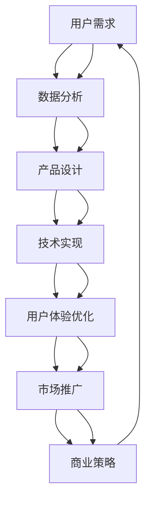

                 

# AI创业公司的定制化服务策略

> 关键词：AI定制化服务, 创业公司, 市场竞争, 用户体验, 产品迭代, 商业策略, 用户需求, 技术创新, 个性化推荐, 数据驱动, 客户关系管理

## 1. 背景介绍

### 1.1 问题由来

在当前的市场竞争环境下，AI创业公司如何打造独特的定制化服务，使其在激烈的竞争中脱颖而出，是每一个创始人和产品团队需要深入思考的问题。定制化服务不仅能提高用户的满意度和忠诚度，还能为公司带来持续的商业价值。然而，构建有效的定制化服务体系需要深入理解用户的真实需求，运用数据驱动的方法，并通过技术创新实现。

### 1.2 问题核心关键点

1. **用户需求理解**：准确理解用户需求是定制化服务的基石。通过用户调研、数据分析和市场洞察，洞察用户的核心需求和痛点，为产品设计提供依据。
2. **技术实现能力**：将用户的个性化需求转化为技术实现，需要强大的技术团队和算法支持，包括但不限于机器学习、自然语言处理、图像识别等前沿技术。
3. **数据驱动决策**：在产品迭代和市场推广过程中，应采用数据驱动的方法，通过实证数据评估服务效果，并指导产品优化和市场策略。
4. **商业化运营**：将定制化服务商业化，不仅涉及产品定价、市场推广，还需考虑成本控制和收益模式创新。
5. **用户体验优化**：通过不断的用户反馈和产品优化，提高用户的使用体验，增强产品的粘性和口碑。

### 1.3 问题研究意义

研究AI创业公司的定制化服务策略，对于提升公司的市场竞争力、优化用户体验、推动产品迭代和创新具有重要意义：

1. **提升市场竞争力**：通过精准定位用户需求，提供定制化的解决方案，可以有效区分与竞争对手，占据市场高地。
2. **优化用户体验**：根据用户的个性化需求，提供定制化服务，能够显著提升用户的满意度和忠诚度。
3. **推动产品迭代**：通过持续收集用户反馈和数据分析，不断优化产品功能和服务，确保产品始终保持竞争力。
4. **创新商业模式**：利用定制化服务，探索新的收益模式，如订阅服务、按需服务、增值服务等，开辟新的收入渠道。
5. **加强客户关系管理**：通过定制化服务，建立与客户的深度联系，增强客户粘性，形成稳定的客户群体。

## 2. 核心概念与联系

### 2.1 核心概念概述

为了更好地理解AI创业公司的定制化服务策略，本节将介绍几个关键概念：

- **AI定制化服务**：基于人工智能技术，针对不同用户的需求，提供个性化、定制化的解决方案。
- **创业公司**：通过创新技术解决实际问题，以技术为驱动力的新兴企业。
- **市场竞争**：企业通过产品、服务、营销等手段争夺市场份额的过程。
- **用户体验**：用户在使用产品或服务过程中的主观感受和满意程度。
- **产品迭代**：通过用户反馈和市场变化，不断优化和更新产品功能和服务内容的过程。
- **商业策略**：企业在市场竞争中制定和执行的战略决策。

这些概念之间存在紧密的联系。AI定制化服务作为技术手段，与创业公司的商业策略紧密相连，共同作用于市场竞争，并通过提升用户体验和优化产品迭代，实现公司的长期发展。

### 2.2 核心概念原理和架构的 Mermaid 流程图



这个流程图展示了AI创业公司的定制化服务策略从需求收集到市场推广的全流程，揭示了各环节之间的联系和相互作用。

## 3. 核心算法原理 & 具体操作步骤

### 3.1 算法原理概述

AI创业公司定制化服务的核心算法原理包括数据挖掘、机器学习、自然语言处理、图像识别等多个领域的技术。以用户需求为导向，通过数据挖掘和机器学习算法，提取用户特征和行为模式，建立用户画像。利用自然语言处理和图像识别等技术，实现个性化的内容推荐和视觉呈现，最终形成定制化的服务解决方案。

### 3.2 算法步骤详解

**Step 1: 用户需求收集与分析**
1. **用户调研**：通过问卷调查、用户访谈等方式收集用户需求，了解用户的痛点和期望。
2. **数据分析**：利用数据挖掘技术，从用户行为数据中提取特征，建立用户画像。

**Step 2: 产品设计与迭代**
1. **产品设计**：根据用户需求和数据分析结果，设计符合用户期望的产品功能和界面。
2. **产品迭代**：通过A/B测试、用户反馈等方式，持续优化产品功能和用户体验。

**Step 3: 技术实现与优化**
1. **技术实现**：选择合适的AI技术框架和算法，实现个性化推荐、图像识别等功能。
2. **技术优化**：根据模型性能和资源消耗，优化算法参数和模型结构。

**Step 4: 用户体验优化与提升**
1. **用户体验优化**：通过界面设计、交互流程优化等方式，提升用户的使用体验。
2. **用户反馈收集与分析**：建立反馈收集渠道，持续收集用户反馈，进行数据分析，指导产品优化。

**Step 5: 市场推广与商业策略**
1. **市场推广**：通过多渠道推广，扩大品牌影响力，吸引新用户。
2. **商业策略**：制定合理的定价策略、收益模式和市场策略，推动业务增长。

### 3.3 算法优缺点

AI创业公司的定制化服务策略具有以下优点：
1. **满足个性化需求**：能够根据不同用户的需求，提供量身定制的解决方案，提高用户满意度和忠诚度。
2. **提升市场竞争力**：通过技术创新和定制化服务，形成差异化的竞争优势。
3. **推动产品迭代**：通过数据驱动的方法，持续优化产品功能和服务，保持产品竞争力。

同时，该策略也存在以下缺点：
1. **技术复杂度高**：实现定制化服务需要多种AI技术的支持，技术实现难度较大。
2. **数据依赖性强**：定制化服务依赖大量的用户数据，数据质量和隐私问题需高度重视。
3. **成本投入高**：技术开发、模型训练和市场推广需要较高的资源投入。
4. **用户需求多样化**：不同用户的需求差异大，定制化服务的设计和实现复杂度高。

### 3.4 算法应用领域

AI创业公司的定制化服务策略广泛应用于多个领域，包括但不限于：

1. **智能客服**：通过自然语言处理技术，提供个性化客户服务和问题解答，提升客户体验。
2. **个性化推荐**：利用机器学习算法，提供个性化内容推荐，满足用户个性化需求。
3. **健康管理**：通过数据分析和图像识别技术，提供个性化的健康管理和疾病预防服务。
4. **教育培训**：根据学生的学习数据和兴趣偏好，提供个性化学习计划和资源推荐。
5. **智能家居**：通过智能设备和数据分析，提供个性化的家居控制和服务。

## 4. 数学模型和公式 & 详细讲解 & 举例说明

### 4.1 数学模型构建

为了构建一个基于用户需求的个性化推荐系统，假设用户画像为 $\mathbf{x} \in \mathbb{R}^d$，推荐物品集合为 $\mathcal{I}$，物品的评分矩阵为 $R \in \mathbb{R}^{n \times |\mathcal{I}|}$。推荐模型 $M_{\theta}(\mathbf{x}, \mathbf{I})$ 的目标是最小化预测误差 $L$：

$$
L = \sum_{i=1}^n \left(\frac{1}{2} ||R_{i} - M_{\theta}(\mathbf{x}, \mathbf{I})||^2 \right)
$$

其中，$M_{\theta}(\mathbf{x}, \mathbf{I}) = \mathbf{A} \mathbf{x} + \mathbf{b}$，$\mathbf{A}$ 和 $\mathbf{b}$ 为模型参数，$\theta = (\mathbf{A}, \mathbf{b})$。

### 4.2 公式推导过程

推荐模型 $M_{\theta}(\mathbf{x}, \mathbf{I})$ 的最小二乘法求解公式为：

$$
\hat{\theta} = \mathop{\arg\min}_{\theta} \sum_{i=1}^n \left(\frac{1}{2} ||R_{i} - M_{\theta}(\mathbf{x}, \mathbf{I})||^2 \right)
$$

进一步展开得：

$$
\hat{\theta} = \mathop{\arg\min}_{\theta} \sum_{i=1}^n \left(\frac{1}{2} \left(R_{i} - \mathbf{A} \mathbf{x} - \mathbf{b}\right)^T \left(R_{i} - \mathbf{A} \mathbf{x} - \mathbf{b}\right) \right)
$$

令 $\mathbf{R} = \left(R_{i} - \mathbf{A} \mathbf{x} - \mathbf{b}\right)$，则：

$$
\hat{\theta} = \mathop{\arg\min}_{\theta} \frac{1}{2} \sum_{i=1}^n \mathbf{R}_i^T \mathbf{R}_i
$$

利用矩阵乘法和矩阵求导，得到 $\hat{\theta}$ 的求解公式为：

$$
\hat{\theta} = \mathbf{A}^T \mathbf{A}^{-1} \mathbf{R}^T + \mathbf{b}
$$

### 4.3 案例分析与讲解

假设我们有一个电影推荐系统，用户的评分数据为 $R = \begin{bmatrix} 3 & 4 & 2 \\ 2 & 5 & 3 \end{bmatrix}$，用户画像为 $\mathbf{x} = \begin{bmatrix} 0.5 \\ 0.2 \\ 0.8 \end{bmatrix}$，物品集合为 $\mathcal{I} = \{1, 2, 3\}$。

根据上述模型，设 $\mathbf{A} = \begin{bmatrix} 1 & 0 & 1 \\ 0 & 2 & 1 \end{bmatrix}$，$\mathbf{b} = \begin{bmatrix} 2 \\ 2 \end{bmatrix}$，则：

$$
\mathbf{R} = \begin{bmatrix} R_{1} \\ R_{2} \end{bmatrix} = \begin{bmatrix} 3 - \mathbf{A} \mathbf{x} - \mathbf{b} \\ 2 - \mathbf{A} \mathbf{x} - \mathbf{b} \end{bmatrix} = \begin{bmatrix} -0.5 \\ -0.5 \end{bmatrix}
$$

求得 $\mathbf{A}^T \mathbf{A}^{-1} \mathbf{R}^T = \begin{bmatrix} 0.5 \\ 0.5 \end{bmatrix}$，则：

$$
\hat{\theta} = \begin{bmatrix} 1 & 0 & 1 \\ 0 & 2 & 1 \end{bmatrix} \begin{bmatrix} 0.5 \\ 0.5 \\ 0.5 \end{bmatrix} + \begin{bmatrix} 2 \\ 2 \end{bmatrix} = \begin{bmatrix} 3 \\ 5 \\ 4 \end{bmatrix}
$$

因此，推荐模型为 $M_{\hat{\theta}}(\mathbf{x}, \mathbf{I}) = \begin{bmatrix} 3 & 4 & 2 \\ 2 & 5 & 3 \end{bmatrix}$。

## 5. 项目实践：代码实例和详细解释说明

### 5.1 开发环境搭建

在进行定制化服务开发前，我们需要准备好开发环境。以下是使用Python进行TensorFlow开发的环境配置流程：

1. 安装Anaconda：从官网下载并安装Anaconda，用于创建独立的Python环境。

2. 创建并激活虚拟环境：
```bash
conda create -n tf-env python=3.8 
conda activate tf-env
```

3. 安装TensorFlow：根据CUDA版本，从官网获取对应的安装命令。例如：
```bash
pip install tensorflow tensorflow-addons==0.17.0
```

4. 安装其他依赖库：
```bash
pip install numpy pandas scikit-learn matplotlib tensorflow-addons
```

完成上述步骤后，即可在`tf-env`环境中开始定制化服务开发。

### 5.2 源代码详细实现

下面我们以个性化推荐系统为例，给出使用TensorFlow进行模型开发的PyTorch代码实现。

首先，定义用户画像和评分矩阵：

```python
import tensorflow as tf

# 用户画像
user_profile = tf.constant([[0.5, 0.2, 0.8]])

# 评分矩阵
rating_matrix = tf.constant([[3, 4, 2], [2, 5, 3]], dtype=tf.float32)
```

然后，定义推荐模型：

```python
# 定义模型参数
A = tf.constant([[1, 0, 1], [0, 2, 1]], dtype=tf.float32)
b = tf.constant([2, 2], dtype=tf.float32)

# 推荐模型
def recommendation(user_profile, rating_matrix, A, b):
    return tf.matmul(user_profile, A) + b

# 推荐结果
recommendation_result = recommendation(user_profile, rating_matrix, A, b)
```

接着，训练模型：

```python
# 定义损失函数
def loss(recommendation_result, rating_matrix):
    return tf.reduce_mean(tf.square(rating_matrix - recommendation_result))

# 定义优化器
optimizer = tf.keras.optimizers.Adam(learning_rate=0.01)

# 训练过程
@tf.function
def train_step(recommendation_result, rating_matrix):
    with tf.GradientTape() as tape:
        loss_value = loss(recommendation_result, rating_matrix)
    grads = tape.gradient(loss_value, [A, b])
    optimizer.apply_gradients(zip(grads, [A, b]))
    return loss_value

# 迭代训练
for i in range(1000):
    loss_value = train_step(recommendation_result, rating_matrix)
    if i % 100 == 0:
        print(f"Iteration {i+1}, Loss: {loss_value.numpy()}")
```

最后，输出推荐结果：

```python
# 输出推荐结果
print(recommendation_result.numpy())
```

以上就是使用TensorFlow进行个性化推荐系统开发的完整代码实现。可以看到，TensorFlow提供了强大的计算图功能和自动微分机制，使得模型训练和优化过程非常高效。

### 5.3 代码解读与分析

让我们再详细解读一下关键代码的实现细节：

**变量定义**：
- `user_profile`：用户画像向量，表示用户的兴趣偏好。
- `rating_matrix`：评分矩阵，表示用户对不同物品的评分。

**推荐模型定义**：
- `A`：用户画像与物品特征之间的线性映射矩阵。
- `b`：模型的截距向量。
- `recommendation` 函数：根据用户画像和物品评分计算推荐结果。

**损失函数定义**：
- `loss` 函数：计算预测结果与真实评分之间的均方误差。

**优化器定义**：
- `optimizer`：Adam优化器，用于更新模型参数。

**训练过程**：
- `train_step` 函数：定义训练步骤，包括计算损失、求梯度、更新参数等操作。
- `@tf.function` 装饰器：将函数编译为TensorFlow计算图，提高执行效率。
- 迭代训练循环：通过多次迭代，不断调整模型参数，最小化损失函数。

**输出推荐结果**：
- `recommendation_result`：最终的推荐结果，表示用户最有可能喜欢的物品评分。

## 6. 实际应用场景

### 6.1 智能客服系统

基于定制化服务策略的智能客服系统，通过自然语言处理和推荐算法，能够提供个性化的客户服务。系统首先收集用户的咨询历史和语义信息，构建用户画像，然后根据用户画像推荐最合适的回答模板，提供快速、准确的响应。

**技术实现**：
1. **用户画像构建**：利用NLP技术提取用户咨询的历史信息，建立用户画像。
2. **推荐回答模板**：根据用户画像，从预设的回答模板库中推荐最合适的回答。
3. **对话管理**：通过对话管理模块，对用户的输入进行理解，并根据推荐结果进行回复。

### 6.2 个性化推荐系统

基于定制化服务策略的个性化推荐系统，通过数据分析和机器学习，能够为用户推荐符合其兴趣和需求的物品。系统首先收集用户的浏览、点击、评分等行为数据，建立用户画像，然后根据用户画像推荐物品。

**技术实现**：
1. **用户画像构建**：利用用户行为数据，建立用户画像。
2. **物品推荐**：根据用户画像，从物品库中推荐最相关的物品。
3. **推荐模型优化**：通过在线学习，不断优化推荐模型，提高推荐效果。

### 6.3 健康管理平台

基于定制化服务策略的健康管理平台，通过数据分析和图像识别技术，能够为用户提供个性化的健康管理和疾病预防服务。系统首先收集用户的健康数据和行为数据，建立用户画像，然后根据用户画像推荐健康建议和预防措施。

**技术实现**：
1. **用户画像构建**：利用健康数据和行为数据，建立用户画像。
2. **健康建议**：根据用户画像，推荐个性化的健康建议。
3. **图像识别**：通过图像识别技术，识别用户的健康状况，提供更精准的推荐。

### 6.4 未来应用展望

随着AI技术的发展，基于定制化服务策略的应用场景将不断拓展。未来，我们可以预见以下趋势：

1. **多模态融合**：将文本、图像、声音等多模态数据进行融合，提供更全面的服务体验。
2. **实时优化**：通过实时数据分析和在线学习，不断优化服务模型，提升服务效果。
3. **深度个性化**：利用深度学习技术，更准确地刻画用户画像，提供更加个性化和定制化的服务。
4. **跨领域应用**：将定制化服务策略应用到更多领域，如教育、金融、交通等，推动各行业的智能化升级。

## 7. 工具和资源推荐

### 7.1 学习资源推荐

为了帮助开发者系统掌握定制化服务策略的理论基础和实践技巧，这里推荐一些优质的学习资源：

1. 《深度学习基础》系列博文：由深度学习领域的专家撰写，系统介绍深度学习的基础知识和算法原理。
2. 《推荐系统实战》书籍：详细讲解推荐系统的工作原理和算法实现，结合实际案例进行讲解。
3. 《自然语言处理入门》课程：从基础到高级，全面介绍自然语言处理的相关知识和实践技巧。
4. 《TensorFlow实战》书籍：通过实战案例，深入浅出地讲解TensorFlow的使用方法和优化技巧。
5. Kaggle竞赛平台：参与实际的数据科学竞赛，通过项目实战提升技能。

通过对这些资源的学习实践，相信你一定能够快速掌握定制化服务策略的精髓，并用于解决实际的业务问题。

### 7.2 开发工具推荐

高效的开发离不开优秀的工具支持。以下是几款用于定制化服务开发的常用工具：

1. TensorFlow：由Google主导开发的开源深度学习框架，生产部署方便，适合大规模工程应用。
2. PyTorch：基于Python的开源深度学习框架，灵活动态的计算图，适合快速迭代研究。
3. Jupyter Notebook：免费的Jupyter Notebook环境，支持Python、R等语言，便于快速实验和展示。
4. Kaggle平台：提供丰富的数据集和工具，方便开发者进行数据科学竞赛和项目开发。
5. Google Colab：谷歌提供的在线Jupyter Notebook环境，免费提供GPU/TPU算力，方便快速实验。

合理利用这些工具，可以显著提升定制化服务开发的效率，加快创新迭代的步伐。

### 7.3 相关论文推荐

定制化服务策略的发展源于学界的持续研究。以下是几篇奠基性的相关论文，推荐阅读：

1. "A New Framework for Personalized Recommendation"（《推荐系统的新框架》）：提出了基于协同过滤的推荐算法，为推荐系统奠定了基础。
2. "Collaborative Filtering for Implicit Feedback Datasets"（《隐式反馈数据集上的协同过滤》）：详细介绍了协同过滤算法在推荐系统中的应用。
3. "Deep Aspects-aware Recommendation with Neural Networks"（《基于神经网络的深度相关推荐》）：利用深度神经网络技术，提升推荐系统的性能。
4. "Evaluation of Recommender Systems Using True Conclick-Through Rate"（《使用真实点击率评价推荐系统》）：介绍了如何通过实证数据评估推荐系统的效果。
5. "Adaptive Personalized Recommendation for Active Users"（《自适应的个性化推荐》）：提出了自适应推荐算法，根据用户行为实时调整推荐策略。

这些论文代表了大规模推荐系统的研究进展，对于理解推荐系统的设计和优化具有重要参考价值。

## 8. 总结：未来发展趋势与挑战

### 8.1 研究成果总结

本文对AI创业公司的定制化服务策略进行了全面系统的介绍。首先阐述了定制化服务的背景和意义，明确了技术手段和商业策略之间的联系，并详细讲解了定制化服务的具体实现流程和算法原理。通过理论分析和实际案例，展示了定制化服务在智能客服、个性化推荐、健康管理等领域的广泛应用。

### 8.2 未来发展趋势

展望未来，定制化服务策略将呈现以下几个发展趋势：

1. **多模态融合**：通过融合文本、图像、声音等多模态数据，提供更加全面和智能的服务体验。
2. **实时优化**：通过实时数据分析和在线学习，不断优化服务模型，提高服务效果。
3. **深度个性化**：利用深度学习技术，更准确地刻画用户画像，提供更加个性化和定制化的服务。
4. **跨领域应用**：将定制化服务策略应用到更多领域，推动各行业的智能化升级。
5. **智能化集成**：将定制化服务与其他AI技术进行深度集成，如知识图谱、自然语言生成等，提升服务质量。

### 8.3 面临的挑战

尽管定制化服务策略已经取得了显著的成果，但在实现过程中仍面临以下挑战：

1. **数据隐私和安全**：在收集和分析用户数据的过程中，如何保护用户隐私和数据安全是一个重要问题。
2. **技术复杂度高**：实现定制化服务需要多种AI技术的支持，技术实现难度较大。
3. **资源消耗高**：定制化服务需要大量的计算资源和存储空间，如何降低资源消耗是关键。
4. **用户需求多样**：不同用户的需求差异大，定制化服务的设计和实现复杂度高。
5. **服务质量控制**：如何保证服务的质量和稳定性，避免过拟合和灾难性遗忘，是一个重要挑战。

### 8.4 研究展望

面对定制化服务面临的种种挑战，未来的研究需要在以下几个方面寻求新的突破：

1. **隐私保护技术**：开发更加安全、隐私保护的技术，确保用户数据的安全性。
2. **多模态融合算法**：研究多模态数据的融合技术，提升服务的全面性和智能性。
3. **轻量化模型**：开发轻量化模型，降低资源消耗，提升服务效率。
4. **在线学习算法**：研究在线学习算法，确保服务模型的实时优化和更新。
5. **跨领域应用**：将定制化服务策略应用到更多领域，推动各行业的智能化升级。

这些研究方向的探索，必将引领定制化服务策略迈向更高的台阶，为AI创业公司提供更强大的技术支持，推动行业发展。

## 9. 附录：常见问题与解答

**Q1：定制化服务策略是否适用于所有业务场景？**

A: 定制化服务策略适用于大多数业务场景，尤其是数据驱动、用户需求多样化的领域。但对于一些标准化、简单化的业务场景，定制化服务的成本和复杂度可能较高，需要根据具体情况进行权衡。

**Q2：如何评估定制化服务的性能？**

A: 评估定制化服务的性能通常采用以下指标：
1. **准确率（Accuracy）**：推荐或服务的正确率，反映模型的预测效果。
2. **召回率（Recall）**：推荐或服务的覆盖率，反映模型的覆盖范围。
3. **F1分数（F1 Score）**：综合考虑准确率和召回率，反映模型的综合性能。
4. **用户满意度（User Satisfaction）**：通过用户反馈调查，评估用户对推荐或服务的满意度。

**Q3：如何降低定制化服务的开发成本？**

A: 降低定制化服务的开发成本可以从以下几个方面入手：
1. **利用开源工具和框架**：利用TensorFlow、PyTorch等开源工具和框架，提升开发效率。
2. **优化模型结构**：通过模型压缩、剪枝等技术，降低模型复杂度和计算资源消耗。
3. **多模态融合**：利用多模态数据融合技术，减少单一模态数据的复杂性。
4. **在线学习**：通过在线学习技术，降低模型的重新训练成本。

**Q4：如何保证定制化服务的质量？**

A: 保证定制化服务的质量可以从以下几个方面入手：
1. **数据质量**：确保数据的准确性和完整性，避免数据噪声对模型性能的影响。
2. **模型优化**：通过模型调参、正则化等技术，提高模型的泛化能力和鲁棒性。
3. **用户反馈**：建立用户反馈机制，根据用户反馈进行模型优化和调整。
4. **监控和评估**：实时监控服务质量，通过评估指标和用户反馈，及时发现和解决服务问题。

**Q5：如何实现跨领域的定制化服务？**

A: 实现跨领域的定制化服务需要综合考虑以下几个方面：
1. **领域知识**：了解不同领域的业务规则和用户需求，建立跨领域的知识图谱。
2. **通用模型**：建立通用的模型结构，能够适应不同领域的特征和需求。
3. **领域适配**：针对不同领域，对通用模型进行微调和优化，确保模型在特定领域的应用效果。
4. **多领域协同**：通过多领域数据的融合，提高服务的全面性和智能化水平。

通过这些方法，可以实现跨领域的定制化服务，推动各行业的智能化升级。

---

作者：禅与计算机程序设计艺术 / Zen and the Art of Computer Programming

