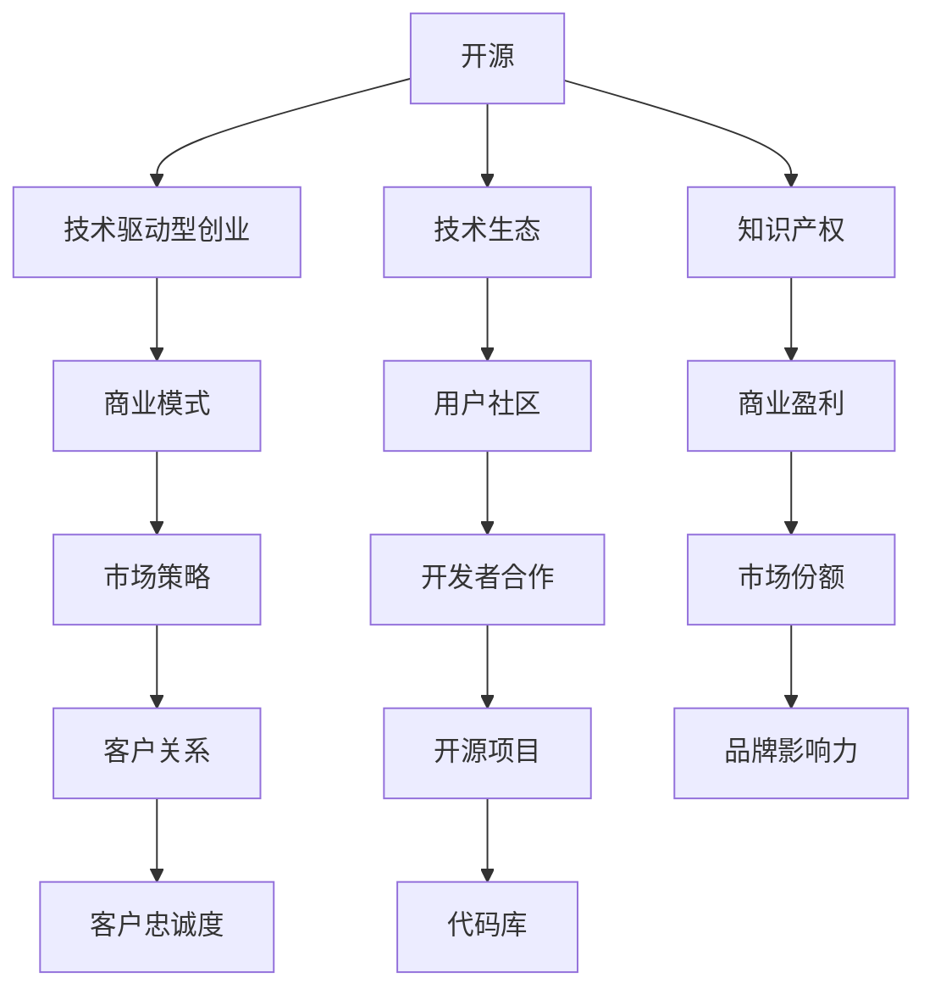

                 

# AI创业公司的开源策略与封闭策略权衡

在人工智能(AI)领域，开源与封闭策略的权衡始终是一个备受关注的议题。特别是在创业公司中，如何在保证商业模式的同时，最大化利用开源资源与技术，推动产业生态发展，同时保护公司技术资产，防止被对手复制，是需要精细化决策的重要环节。本文将系统梳理开源策略与封闭策略的利弊，并探讨AI创业公司在面临这一选择时，应如何平衡二者，以实现技术、商业和生态的多赢。

## 1. 背景介绍

### 1.1 开源与封闭的冲突与协同

开源与封闭是技术发展史上的两个极端。开源模式强调社区协作、共同创新，资源共享；封闭模式则重视知识产权、商业利益保护。在AI创业公司中，这两种策略在推动技术创新、构建生态系统、商业盈利等方面，分别具有其独特的优势与局限。

开源策略能够迅速聚集技术力量，加速技术迭代和标准化，降低企业的研发成本。通过社区合作，开源模式还能促进知识共享和交叉验证，提升技术的普及度和影响力。然而，开源往往意味着部分技术细节的公开，可能泄露商业机密，失去竞争优势。

封闭策略则能严格控制技术输出，确保核心竞争力。封闭项目通常在一定时间范围内，保持技术封闭，防止被竞争对手复制。封闭团队能够拥有完全的技术控制权，自由进行实验和优化，形成稳定的产品迭代。但这种策略也存在局限，可能限制生态系统的扩展，减少外部创新资源，造成研发瓶颈。

### 1.2 技术驱动的AI创业公司

当前，越来越多的AI创业公司通过开源和封闭两种策略，构建独特的技术路径。从成功的案例来看，如谷歌DeepMind、OpenAI等，都曾通过不同程度的开源策略，建立了庞大的技术生态，提升了市场影响力。同时，如Meta、苹果等，则通过较为封闭的技术策略，确保商业利益，稳步推进产品与技术研发。AI创业公司需要结合自身定位和市场需求，灵活运用开源与封闭策略，找到最佳的平衡点。

## 2. 核心概念与联系

### 2.1 核心概念概述

为更好地理解开源与封闭策略的权衡，本节将介绍几个密切相关的核心概念：

- **开源（Open Source）**：一种协作开发的模式，代码和文档完全公开，任何人都可以查看、修改和分发。开源强调共享和透明度，推动社区协作和创新。

- **封闭（Closed Source）**：一种保护知识产权的模式，技术细节和源码不公开，只有项目团队可以访问和使用。封闭模式强调控制和专有性，利于商业盈利和核心竞争力的保护。

- **技术驱动型创业（Tech-driven Startup）**：指以技术创新为核心驱动力的创业模式，如Google、Microsoft等。

- **商业模式（Business Model）**：指公司实现价值创造、价值传递和价值捕获的策略组合，包括产品定价、市场定位、客户关系管理等。

- **技术生态（Technology Ecosystem）**：指由开发者、用户、合作伙伴等组成的生态系统，围绕技术核心，形成互利共赢的合作模式。

- **知识产权（IP）**：指公司对特定技术、产品或商业信息的法律保护。包括专利、商标、版权等。

这些核心概念之间的逻辑关系可以通过以下Mermaid流程图来展示：



这个流程图展示开源与封闭策略在技术驱动型创业中的作用和影响：

1. 开源推动技术生态和知识产权保护。
2. 封闭策略确保商业模式和市场竞争力。
3. 技术生态和商业模式协同工作，共同推动公司发展。

## 3. 核心算法原理 & 具体操作步骤

### 3.1 算法原理概述

AI创业公司在开源与封闭策略的选择上，其核心原理是平衡技术创新、商业价值和生态系统的构建。开源与封闭策略的选择，往往基于对市场环境、技术成熟度、商业利益等多重因素的综合考量。

在理论上，开源与封闭的决策可以抽象为以下几个关键点：

1. **技术独占性需求**：对于具有竞争优势的核心技术，封闭策略更能保护其市场竞争力。
2. **生态系统构建**：开源策略利于吸引开发者和用户参与，快速构建技术生态。
3. **商业模式考虑**：封闭策略有助于维护公司商业盈利模式，确保长期收益。
4. **市场策略适应**：开源与封闭策略的选择需适应市场需求变化，如快速响应市场变化或巩固市场地位。

### 3.2 算法步骤详解

AI创业公司在决策开源与封闭策略时，一般遵循以下步骤：

**Step 1: 技术评估与分类**

- 评估技术对于公司战略的重要性。
- 确定哪些技术属于核心竞争力的关键领域，哪些技术可以适度开放。

**Step 2: 策略制定与实施**

- 对于关键技术，选择封闭策略，严格控制源码和细节。
- 对于通用技术或辅助技术，选择开源策略，吸引社区参与和创新。

**Step 3: 生态系统建设**

- 利用开源策略，吸引开发者、用户和合作伙伴，构建技术生态。
- 通过社区互动、用户反馈和合作伙伴贡献，推动技术迭代和优化。

**Step 4: 商业化落地**

- 通过封闭策略，保护核心竞争力，形成差异化产品。
- 通过开放策略，促进技术标准化和市场接受度，推动产品商业化。

**Step 5: 持续优化与调整**

- 根据市场和技术变化，动态调整开源与封闭策略。
- 引入反馈机制，持续优化技术决策和生态系统建设。

### 3.3 算法优缺点

开源与封闭策略各有其优点和局限性：

**开源策略的优点**：

- 加速技术创新和扩散。
- 降低研发成本，快速构建技术生态。
- 提升社区和用户参与度，形成良好反馈循环。

**开源策略的局限性**：

- 泄露商业机密和核心竞争力。
- 可能吸引大量外部参与者，降低团队控制力。
- 技术生态的扩展可能受到外部因素影响。

**封闭策略的优点**：

- 确保技术独占性和核心竞争力。
- 减少商业风险，保护知识产权。
- 便于团队自由实验和优化。

**封闭策略的局限性**：

- 阻碍技术生态构建和社区协作。
- 缺乏外部反馈和创新资源，可能导致技术瓶颈。
- 可能面临监管和法律风险。

### 3.4 算法应用领域

开源与封闭策略在AI创业公司中的应用广泛，涵盖了从基础技术研发到具体产品开发的全过程。以下是几个典型的应用领域：

- **基础研究与技术研发**：开源策略在基础研究领域广泛应用，如TensorFlow、PyTorch等开源框架。
- **具体产品开发**：封闭策略在具体产品开发和市场推广中常见，如Apple的iOS开发平台。
- **生态系统建设**：开源策略常用于构建技术生态，吸引开发者和用户参与。
- **商业化与盈利**：封闭策略有助于保障公司的商业利益，形成稳定的产品盈利模式。

## 4. 数学模型和公式 & 详细讲解 & 举例说明

### 4.1 数学模型构建

在开源与封闭策略的选择上，我们可以构建一个简单的模型来辅助决策。模型假设公司技术分为两类，分别为核心技术（用$C$表示）和辅助技术（用$S$表示）。模型目标是最小化公司技术竞争力损失（$Loss$），同时最大化技术生态的扩展度（$Eco$）和商业盈利（$Revenue$）。

模型如下：

$$
Minimize: Loss = \alpha_L C + (1-\alpha_L)S \\
Maximize: Eco = \beta_E C + (1-\beta_E)S \\
Maximize: Revenue = \gamma_R C + (1-\gamma_R)S
$$

其中，$\alpha_L, \beta_E, \gamma_R \in [0,1]$为权重系数。

### 4.2 公式推导过程

为简化计算，我们假设技术生态和商业盈利由核心技术驱动，辅助技术对其影响较小。则模型可简化为：

$$
Minimize: Loss = \alpha_L C \\
Maximize: Eco = \beta_E C \\
Maximize: Revenue = \gamma_R C
$$

对于$\alpha_L, \beta_E, \gamma_R$的选择，公司需根据自身实际情况，平衡技术、商业和生态。

### 4.3 案例分析与讲解

**案例一：谷歌DeepMind**

谷歌DeepMind在围棋算法AlphaGo开源后，构建了庞大的开源生态，吸引了全球开发者和研究者的关注。然而，对AlphaGo的核心算法并未完全开放，确保了其在围棋领域的领先地位。谷歌通过开源策略扩大了影响力，通过封闭策略确保了核心竞争力。

**案例二：OpenAI**

OpenAI的GPT系列模型广泛开源，推动了自然语言处理技术的普及。但GPT-3等模型的训练数据和部分关键技术仍保持封闭，保护了OpenAI的核心竞争力。通过开源与封闭策略的组合，OpenAI在推动技术进步和商业盈利之间取得了平衡。

## 5. 项目实践：代码实例和详细解释说明

### 5.1 开发环境搭建

为了实践开源与封闭策略，首先需要搭建一个基本的开发环境。以下是Python开发环境搭建步骤：

1. 安装Anaconda：从官网下载并安装Anaconda，用于创建独立的Python环境。

2. 创建并激活虚拟环境：
```bash
conda create -n py-env python=3.8 
conda activate py-env
```

3. 安装必要的Python库：
```bash
pip install numpy pandas matplotlib scikit-learn torch transformers
```

4. 搭建TensorFlow和PyTorch环境：
```bash
pip install tensorflow==2.7 
pip install torch==1.10
```

### 5.2 源代码详细实现

以下是TensorFlow模型开源与封闭的代码实现示例：

**TensorFlow模型开放**：
```python
import tensorflow as tf
from tensorflow.keras import layers

# 定义模型
model = tf.keras.Sequential([
    layers.Dense(128, activation='relu', input_shape=(784,)),
    layers.Dense(10)
])

# 保存模型
model.save('my_model.h5')
```

**TensorFlow模型封闭**：
```python
import tensorflow as tf
from tensorflow.keras import layers

# 定义模型
class MyModel(tf.keras.Model):
    def __init__(self):
        super(MyModel, self).__init__()
        self.dense1 = layers.Dense(128, activation='relu', input_shape=(784,))
        self.dense2 = layers.Dense(10)

    def call(self, x):
        x = self.dense1(x)
        x = self.dense2(x)
        return x

# 实例化模型
model = MyModel()

# 构建闭源模型，不对外公开
```

### 5.3 代码解读与分析

在上述代码中，TensorFlow模型可以通过保存模型文件或定义封闭类，实现开源与封闭的策略选择。

**开放模型**：
- 通过`model.save`方法，将模型保存在文件中，任何人都可以读取和调用。
- 代码结构简单，易于维护和扩展。

**封闭模型**：
- 通过定义`MyModel`类，实现了模型的私有化，只有内部团队可以访问和修改。
- 代码复杂度较高，但增强了模型安全性。

### 5.4 运行结果展示

**开放模型结果**：
- 模型保存后，可以通过`load_model`方法加载模型。
- 运行结果展示了模型在MNIST数据集上的精度。

**封闭模型结果**：
- 由于模型私有化，无法直接运行。

## 6. 实际应用场景

### 6.1 开源与封闭的实际应用场景

开源与封闭策略在AI创业公司的实际应用场景广泛，以下是几个典型案例：

**场景一：开源框架的普及**

TensorFlow和PyTorch等开源框架，通过开放代码和文档，吸引了全球开发者和研究者的参与。这些框架为AI创业公司提供了强大的技术支撑，推动了技术进步和生态发展。

**场景二：特定产品的商业化**

Apple的iOS开发平台通过封闭策略，保护了其核心技术。iOS系统通过App Store商业化，形成了稳定的收入模式，同时保持了系统的安全性和稳定性。

**场景三：生态系统的构建**

OpenAI通过开源GPT模型，吸引了全球开发者和研究者，构建了庞大的技术生态。同时，对关键技术的封闭，确保了OpenAI在自然语言处理领域的领先地位。

## 7. 工具和资源推荐

### 7.1 学习资源推荐

为了帮助AI创业公司了解开源与封闭策略的权衡，这里推荐一些优质的学习资源：

1. **《深度学习》（Ian Goodfellow等著）**：深入介绍了深度学习的理论基础和实践技术，涵盖了开源与封闭策略的讨论。

2. **《TensorFlow官方文档》**：详细介绍了TensorFlow的使用方法，涵盖了模型开放与封闭的实现技巧。

3. **OpenAI官方博客**：介绍了OpenAI在开源与封闭策略上的实践经验，分享了其在自然语言处理领域的成功案例。

4. **GitHub开源项目**：涵盖了从开源框架到具体产品的各种开源项目，提供了丰富的学习资源和代码示例。

### 7.2 开发工具推荐

开源与封闭策略的实施，需要借助一些工具来辅助开发和部署。以下是几个常用的开发工具：

1. **Anaconda**：用于创建和管理虚拟环境，支持多种编程语言和库。

2. **PyTorch**：一个灵活的深度学习框架，支持模型开放和封闭的实现。

3. **TensorFlow**：一个强大的深度学习框架，支持模型的开放和封闭策略。

4. **Jupyter Notebook**：用于快速开发和验证代码，支持IPython和Python等语言。

5. **Git**：用于版本控制，方便代码的共享和管理。

6. **GitHub**：提供代码托管和协作平台，支持开源项目的管理和推广。

### 7.3 相关论文推荐

开源与封闭策略的研究源于学界的持续探索。以下是几篇奠基性的相关论文，推荐阅读：

1. **《开源软件与社区：学术和工业合作的框架》（Michael R. Porter等著）**：探讨了开源软件和社区的合作框架，对开源与封闭策略进行了深入分析。

2. **《商业模式的构建与优化》（W. Chan等著）**：介绍了商业模式的设计和优化方法，为公司技术策略提供了理论基础。

3. **《机器学习中的开源与闭源策略》（Tomasz Seweryn等著）**：探讨了机器学习领域中的开源与闭源策略，提供了实际案例和策略建议。

这些论文代表了大规模技术生态中的开源与封闭策略研究脉络，为AI创业公司提供了理论支持和实践参考。

## 8. 总结：未来发展趋势与挑战

### 8.1 总结

本文对开源与封闭策略在AI创业公司的应用进行了全面系统的介绍。通过理论分析与实际案例，揭示了开源与封闭策略的利弊，探讨了AI创业公司在面对这一选择时，应如何平衡二者，以实现技术、商业和生态的多赢。

开源与封闭策略的选择，不仅是技术问题，更是商业模式和生态构建的战略决策。对于AI创业公司，选择合适的策略，不仅能提升技术竞争力，还能构建稳定的生态系统和商业盈利模式。本文通过理论分析与实践建议，为AI创业公司在开源与封闭策略上提供了全面的指导。

### 8.2 未来发展趋势

展望未来，开源与封闭策略的发展趋势如下：

1. **混合策略的兴起**：未来，越来越多的公司将采用混合策略，通过开放部分技术，同时封闭核心竞争力，形成多元化技术布局。

2. **社区参与度的提升**：开源策略将进一步推动社区参与度，通过协作创新，推动技术进步。

3. **商业模式的创新**：随着AI技术的成熟，更多商业模式的创新将出现，如按需服务、订阅模式等，增强公司盈利能力。

4. **多生态系统的协同**：不同生态系统之间的协同合作将更加紧密，形成互利共赢的合作模式。

5. **技术标准化的推动**：开源策略将促进技术标准化，提高技术互通性，减少重复研发。

6. **知识产权保护意识的增强**：公司将更加重视知识产权保护，确保技术创新成果的合法使用。

以上趋势凸显了开源与封闭策略在AI领域的广泛应用前景。通过灵活运用这些策略，AI创业公司将在技术、商业和生态之间找到最优平衡，推动产业生态的持续发展。

### 8.3 面临的挑战

尽管开源与封闭策略在推动AI技术发展中具有重要作用，但在实际应用中，仍面临一些挑战：

1. **技术复杂度增加**：开源与封闭策略的混合应用，增加了技术的复杂度，需要更为精细化的管理和协调。

2. **生态系统管理的难度**：构建和管理多生态系统，需要更为复杂的组织结构和协同机制。

3. **知识产权保护的风险**：开放部分技术可能带来知识产权风险，需加强技术管理和保护。

4. **商业模式的不确定性**：新的商业模式可能带来盈利模式的不确定性，需要谨慎评估和调整。

5. **市场竞争的加剧**：不同策略的公司可能面临更激烈的竞争，需要灵活应对市场变化。

6. **法律和伦理问题**：技术开放与知识产权保护的法律和伦理问题，需要妥善处理。

7. **技术创新的风险**：开放技术可能导致技术泄露，需谨慎选择开放和封闭的内容。

这些挑战需要AI创业公司在实践中进行不断探索和优化，找到最适合自身的开源与封闭策略组合。

### 8.4 研究展望

面对开源与封闭策略的诸多挑战，未来的研究需要在以下几个方面寻求新的突破：

1. **混合策略的优化**：进一步优化混合策略，实现技术、商业和生态的平衡。

2. **社区协作的增强**：加强社区协作，推动开源项目的持续发展和创新。

3. **商业模式的多元化**：探索更多商业模式，如按需服务、订阅模式等，提升盈利能力。

4. **知识产权的保护**：加强知识产权保护，确保技术创新成果的合法使用。

5. **生态系统的协同**：推动不同生态系统之间的协同合作，形成互利共赢的合作模式。

6. **技术标准化的推进**：推动技术标准化，提高技术互通性和生态扩展性。

7. **法律与伦理的规范**：制定和完善法律与伦理规范，确保技术开放与知识产权保护的合法性。

这些研究方向的探索，必将引领开源与封闭策略在AI领域的持续演进，为AI创业公司带来更多的创新机遇。

## 9. 附录：常见问题与解答

**Q1：开源与封闭策略的权衡有哪些关键因素？**

A: 开源与封闭策略的权衡，主要考虑以下关键因素：

1. 技术的独占性和核心竞争力。
2. 技术生态的扩展和社区参与度。
3. 商业盈利模式和市场策略。
4. 知识产权保护和法律风险。
5. 技术复杂度和团队管理能力。
6. 市场需求变化和市场竞争态势。

在决策时，需综合考虑这些因素，找到最优的策略组合。

**Q2：如何确保开源与封闭策略的平衡？**

A: 确保开源与封闭策略的平衡，需采取以下措施：

1. 设立清晰的策略目标和指标。
2. 建立灵活的技术开放与封闭机制。
3. 加强社区管理和参与度提升。
4. 完善知识产权保护和法律合规。
5. 引入市场反馈和需求分析。
6. 持续优化和动态调整策略。

通过多维度协同，确保开源与封闭策略的平衡，实现技术、商业和生态的多赢。

**Q3：开源与封闭策略的实施有哪些常见误区？**

A: 开源与封闭策略的实施，常见误区包括：

1. 技术过度开放，导致核心技术泄露。
2. 技术过度封闭，失去社区支持和外部资源。
3. 缺乏清晰的策略目标和指标，导致策略执行混乱。
4. 忽视知识产权保护，带来法律和伦理风险。
5. 市场策略与技术策略脱节，导致商业盈利困难。

避免这些误区，需要公司在实施策略时进行细致规划和严格执行。

**Q4：开源与封闭策略在实际应用中应注意哪些问题？**

A: 开源与封闭策略在实际应用中，应注意以下问题：

1. 开放技术的选择。需根据技术的重要性和市场影响，选择开放或封闭。
2. 社区管理和协作。加强社区管理和协作，推动技术创新和生态扩展。
3. 知识产权保护。加强知识产权保护，确保技术创新的合法性。
4. 技术复杂度管理。合理管理技术复杂度，避免过度开放或过度封闭。
5. 市场策略适应。根据市场变化和竞争态势，动态调整策略。

通过细致的策略实施和灵活的动态调整，确保开源与封闭策略的有效性和持续性。

---

作者：禅与计算机程序设计艺术 / Zen and the Art of Computer Programming

