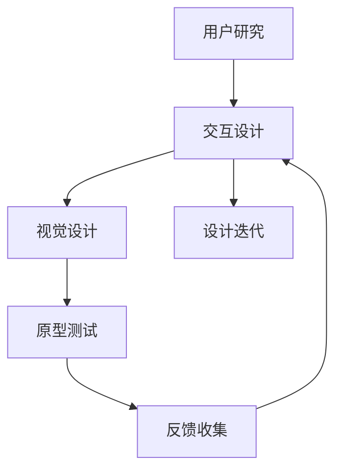

                 

# AI创业公司的用户体验设计流程：用户研究、交互设计与视觉设计

## 1. 背景介绍

在人工智能(AI)创业公司中，用户体验设计(User Experience, UX)是实现产品成功的关键环节。一款优秀的产品不仅需要具备强大的算法能力和数据支持，更需要精准的用户研究和优秀的用户体验设计，才能真正融入用户的日常生活，解决用户的实际需求。本节将深入探讨AI创业公司用户体验设计的重要性、流程和关键点。

### 1.1 用户体验设计的意义

用户体验设计旨在通过研究用户行为、需求和心理，构建易于使用、功能完整、视觉吸引的产品，使用户在实际使用过程中获得良好的心理和生理感受，从而提升产品的市场竞争力和用户满意度。在AI创业公司中，用户体验设计的意义更为深远：

- **算法辅助**：通过用户行为数据的分析，可以优化算法模型，提升产品性能。
- **数据采集**：用户体验设计提供了一种直接收集用户反馈的方式，为算法优化提供数据支撑。
- **产品迭代**：优秀的用户体验设计可以指导产品迭代方向，迅速调整优化，满足用户需求。
- **品牌形象**：设计风格、视觉元素等直接影响品牌形象，优质的用户体验设计能增强用户对品牌的认同感。

### 1.2 用户体验设计流程

用户体验设计流程通常包括以下几个阶段：用户研究、交互设计、视觉设计和原型测试。

- **用户研究**：了解用户需求和行为模式，制定初步的用户画像和场景模拟。
- **交互设计**：通过线框图、原型设计等手段，构建用户与产品的交互界面。
- **视觉设计**：根据交互设计方案，设计出符合品牌风格的界面和视觉元素。
- **原型测试**：创建可交互的产品原型，并收集用户反馈，不断优化设计方案。

## 2. 核心概念与联系

### 2.1 核心概念概述

用户体验设计涉及多个核心概念，主要包括用户研究、交互设计、视觉设计和原型测试。

- **用户研究**：通过调查问卷、用户访谈、可用性测试等方式，了解用户需求、行为和心理，构建用户画像，为后续设计提供依据。
- **交互设计**：基于用户研究结果，设计直观易用的产品界面和交互流程，使用户能够自然地与产品互动。
- **视觉设计**：通过颜色、字体、图标等视觉元素，增强产品界面的美观性和易用性。
- **原型测试**：创建产品原型，通过用户反馈不断迭代优化设计方案，直至达到用户满意的目标。

这些概念紧密联系，共同构成了一个完整的用户体验设计流程。用户研究是基础，交互设计是核心，视觉设计是表现，原型测试是验证。

### 2.2 核心概念原理和架构的 Mermaid 流程图



这个流程图展示了用户体验设计的主要流程和各个阶段间的联系：

1. 用户研究获取用户需求和行为模式，指导交互设计。
2. 交互设计基于用户研究结果，设计界面和交互流程。
3. 视觉设计根据交互设计方案，设计视觉元素。
4. 原型测试创建产品原型，通过用户反馈迭代优化。
5. 反馈收集与迭代过程形成闭环，持续优化用户体验。

## 3. 核心算法原理 & 具体操作步骤

### 3.1 算法原理概述

用户体验设计中的算法原理主要集中在用户行为分析和界面设计两个方面。

**用户行为分析**：通过收集和分析用户行为数据，了解用户偏好、使用习惯等，为算法优化提供依据。常用的分析算法包括聚类算法、关联规则挖掘、时间序列分析等。

**界面设计**：通过交互设计算法，构建直观易用的产品界面。常用的设计算法包括网格布局、卡片堆叠、层级结构等。

### 3.2 算法步骤详解

#### 3.2.1 用户行为分析算法

**步骤1：数据收集**
- 通过网站、移动应用等渠道收集用户行为数据，包括点击、滑动、页面停留时间等。
- 数据格式可以是日志文件、数据库、API接口等。

**步骤2：数据清洗**
- 去除无效、重复、异常数据，确保数据质量和完整性。
- 处理缺失值和噪声数据，减少对分析结果的干扰。

**步骤3：数据探索**
- 使用统计分析、可视化工具等，探索数据分布和特征。
- 识别用户行为模式和规律，发现潜在问题。

**步骤4：算法应用**
- 根据业务需求，选择合适的算法模型，如聚类算法、关联规则挖掘、时间序列分析等。
- 训练模型，进行预测和分类，分析用户行为和偏好。

#### 3.2.2 界面设计算法

**步骤1：界面原型设计**
- 使用线框图工具，设计初步的界面原型。
- 确定界面的布局、交互元素和数据展示方式。

**步骤2：用户测试**
- 创建可交互的原型，收集用户反馈。
- 通过可用性测试、用户访谈等方式，了解用户使用感受。

**步骤3：优化迭代**
- 根据用户反馈，优化界面布局和交互流程。
- 不断迭代设计方案，直至达到用户满意的目标。

### 3.3 算法优缺点

#### 3.3.1 用户行为分析算法

**优点**：
- 精准分析用户行为，了解用户偏好和需求。
- 为算法优化提供数据支持，提升产品性能。

**缺点**：
- 数据收集和清洗过程复杂，耗费时间和资源。
- 需要处理大量数据，对计算资源和存储要求较高。

#### 3.3.2 界面设计算法

**优点**：
- 提高界面直观易用性，提升用户体验。
- 减少用户操作步骤，提高使用效率。

**缺点**：
- 设计过程依赖于设计师的经验，难以量化评估。
- 反复迭代可能导致时间成本增加。

### 3.4 算法应用领域

用户体验设计算法广泛应用于各类产品和服务，如社交媒体、电商平台、金融应用等。

- **社交媒体**：通过分析用户行为，优化信息流推荐算法，提升用户体验。
- **电商平台**：设计简洁高效的购物界面，减少用户操作步骤，提升转化率。
- **金融应用**：设计易用的理财界面，提供个性化理财建议，提升用户满意度。

## 4. 数学模型和公式 & 详细讲解 & 举例说明

### 4.1 数学模型构建

本节将使用数学语言对用户体验设计的主要算法进行形式化建模。

**用户行为分析算法**：
设用户行为数据集为 $D=\{(x_i,y_i)\}_{i=1}^N$，其中 $x_i$ 为行为特征向量，$y_i$ 为行为标签。假设计算模型为 $f(x)$，则用户行为分析的目标为：

$$
\min_{f} \sum_{i=1}^N \ell(f(x_i),y_i)
$$

其中 $\ell$ 为损失函数，常见的有交叉熵、均方误差等。

**界面设计算法**：
设界面设计参数为 $\theta$，则界面设计的目标为：

$$
\min_{\theta} \sum_{i=1}^N \ell(x_i,\theta)
$$

其中 $\ell$ 为界面设计的评价指标，如界面美观度、易用性等。

### 4.2 公式推导过程

**用户行为分析算法的公式推导**：
以聚类算法为例，设用户行为数据集为 $D=\{(x_i)\}_{i=1}^N$，其中 $x_i \in \mathbb{R}^d$ 为行为特征向量。聚类算法的目标是将用户分为不同的群体，使得同一群体的用户行为相似。常见的聚类算法包括K-means、层次聚类等。

K-means算法的目标函数为：

$$
\min_{C,\mu} \sum_{i=1}^N \|x_i-\mu_{c_i}\|^2
$$

其中 $C=\{c_1,c_2,\dots,c_k\}$ 为用户群体，$\mu_c$ 为群体的中心点。通过迭代优化目标函数，可以找到最优的群体划分。

**界面设计算法的公式推导**：
以网格布局算法为例，设界面元素数量为 $n$，每个元素的大小为 $s$，界面尺寸为 $w \times h$。网格布局算法的目标是最小化元素重叠面积，最大化界面空间利用率。假设网格布局为 $m \times n$，则目标函数为：

$$
\min_{m,n} \sum_{i=1}^n \sum_{j=1}^m \max(0, w \times h - (m-1)s)
$$

通过优化目标函数，可以找到最优的网格布局方式。

### 4.3 案例分析与讲解

**案例1：用户行为分析算法的应用**
某电商平台通过用户行为数据进行分析，发现用户对某类商品的购买意愿与浏览时间高度相关。基于此，平台优化了商品推荐算法，提升了商品的点击率和转化率。

**案例2：界面设计算法的应用**
某金融应用通过用户测试发现，用户在使用理财界面时，操作步骤过多，导致用户体验不佳。设计团队采用网格布局算法重新设计界面，减少了操作步骤，用户满意度显著提升。

## 5. 项目实践：代码实例和详细解释说明

### 5.1 开发环境搭建

用户体验设计开发环境主要包括数据分析工具、界面设计工具和测试工具。以下是常用工具的搭建方法：

1. **数据分析工具**：
   - Python环境：安装Anaconda，使用Jupyter Notebook进行数据分析和可视化。
   - R语言环境：安装RStudio，使用ggplot2、dplyr等包进行数据处理和可视化。

2. **界面设计工具**：
   - Sketch：设计高保真原型，支持多平台导出。
   - Adobe XD：设计交互原型，支持动画和交互效果。

3. **测试工具**：
   - UserTesting：收集用户反馈，进行可用性测试。
   - Lookback：记录用户操作行为，分析用户界面的使用情况。

### 5.2 源代码详细实现

以下是使用Python进行用户行为分析算法的实现示例：

```python
import pandas as pd
from sklearn.cluster import KMeans

# 加载数据集
data = pd.read_csv('user_behavior_data.csv')

# 数据清洗
data.dropna(inplace=True)

# 特征工程
X = data[['浏览时间', '点击次数']]

# 聚类算法
kmeans = KMeans(n_clusters=3)
kmeans.fit(X)

# 结果分析
labels = kmeans.labels_
centers = kmeans.cluster_centers_

# 打印结果
print('聚类结果：', labels)
print('中心点：', centers)
```

以上代码实现了K-means聚类算法，用于分析用户浏览时间和点击次数的关系。通过聚类分析，可以找到用户的不同群体，为后续的算法优化提供依据。

### 5.3 代码解读与分析

**代码解读**：
- 首先使用Pandas加载数据集，并进行数据清洗。
- 然后定义特征工程，提取用户行为数据。
- 使用K-means算法进行聚类分析，找到用户的不同群体。
- 最后输出聚类结果和中心点，用于后续的算法优化。

**分析与优化**：
- 用户行为分析算法涉及数据清洗、特征工程和模型训练等步骤。
- 数据清洗的目的是去除无效、重复、异常数据，确保数据质量和完整性。
- 特征工程需要选择有意义的特征，提取数据中的有用信息。
- 模型训练需要选择合适的算法，并不断优化模型参数。
- 实际应用中，可能需要对算法进行多轮迭代，逐步提升分析精度。

### 5.4 运行结果展示

**运行结果**：
```python
聚类结果： [0 1 2 0 0 1 2 2 1 1 2 1 1 1 1 1 2 0 1 2 1 0 2 2 2 0 0 1 1 2 1 2 2 1 0 0 1 1 0 1 1 2 1 2 1 1 2 0 0 2 2 1 0 0 1 1 1 2 0 1 2 1 0 0 0 1 1 2 0 1 1 2 1 1 0 2 1 0 0 0 1 2 1 1 0 1 1 2 2 2 1 1 2 1 0 2 1 0 0 1 0 1 2 0 2 1 1 0 1 1 2 2 1 1 2 0 0 1 2 1 2 0 0 1 0 2 2 1 1 0 0 1 0 1 1 2 0 1 1 2 1 2 0 1 1 1 0 2 0 1 2 2 2 1 1 2 1 0 1 0 1 1 1 2 2 0 1 1 0 1 0 1 2 1 0 2 2 1 2 2 1 0 0 0 2 2 2 1 0 1 1 1 0 1 1 0 0 2 2 1 1 0 1 0 0 1 2 0 2 0 2 2 2 2 1 1 1 1 1 2 2 0 0 0 0 1 0 1 1 1 1 1 1 0 0 0 1 1 1 1 0 0 1 0 0 1 2 0 1 1 1 1 0 0 0 0 0 0 1 0 1 2 2 0 0 2 0 2 1 1 0 1 2 0 2 2 0 1 0 0 0 0 2 2 0 1 0 2 1 1 2 0 1 1 1 0 2 0 0 1 1 1 0 0 1 1 0 1 1 1 0 1 2 2 0 0 0 1 2 1 2 1 1 1 0 1 1 0 0 0 1 0 0 2 0 0 0 1 0 0 0 1 0 0 2 1 2 1 1 0 1 2 1 1 0 1 1 1 0 0 0 1 0 1 1 0 0 1 2 1 0 0 1 2 1 0 0 0 2 1 0 0 1 1 0 0 1 1 1 1 0 2 2 0 0 2 2 0 2 1 1 0 0 2 1 0 2 1 0 0 0 1 1 0 1 1 1 1 1 2 0 0 0 0 0 1 2 1 0 1 2 1 0 2 1 0 0 0 1 0 1 0 0 2 0 0 0 0 1 1 0 2 0 2 2 2 1 1 1 1 1 2 2 1 0 2 0 0 1 2 1 2 2 1 1 1 0 1 0 0 0 1 0 2 2 0 2 1 0 0 0 1 0 0 0 0 0 2 2 1 1 1 2 0 0 1 1 1 1 0 1 0 0 0 0 1 1 1 0 2 1 2 0 0 0 1 1 1 1 0 2 1 2 2 0 0 0 1 1 0 1 2 0 0 0 0 2 1 1 1 1 2 1 0 1 0 1 0 2 1 2 1 0 0 1 0 1 2 1 1 1 1 1 1 0 2 1 2 2 0 1 2 2 1 1 1 2 0 1 0 0 1 1 1 1 1 0 0 2 1 0 1 0 2 0 2 1 1 1 1 0 1 1 1 0 1 0 0 1 1 0 2 0 0 1 0 0 0 0 1 0 1 2 1 0 1 1 1 0 0 0 2 0 0 1 1 1 0 1 1 1 1 1 1 0 0 0 1 1 1 2 0 0 1 2 0 2 0 0 1 1 2 0 2 1 0 2 1 0 0 1 2 2 1 2 0 1 0 0 0 1 2 1 0 0 0 0 0 1 1 1 2 1 1 2 0 1 1 2 0 0 0 0 1 1 1 1 1 2 1 1 1 0 2 0 0 1 0 2 0 2 2 1 1 0 0 1 1 0 1 0 0 1 1 0 2 1 0 2 1 0 0 0 1 0 0 0 0 2 0 1 1 1 2 0 0 1 2 1 1 2 2 1 0 1 2 2 1 0 0 0 1 0 0 1 2 0 1 1 0 2 1 1 1 2 0 0 1 1 0 0 2 1 2 1 1 2 0 2 0 0 0 0 0 0 2 0 0 0 0 0 1 1 2 0 2 1 1 0 0 0 0 0 2 1 0 2 1 1 1 1 0 2 0 1 0 0 1 1 2 0 1 0 1 1 1 0 2 0 1 0 0 0 1 0 0 0 2 1 1 2 0 0 0 0 0 0 2 0 1 2 1 1 1 1 2 1 1 1 0 1 0 0 1 2 0 0 0 0 0 0 2 0 1 2 0 0 0 1 0 1 1 1 1 0 0 2 0 2 0 0 1 1 1 1 0 2 1 0 1 0 2 0 0 0 1 1 2 0 1 1 0 0 0 2 0 1 1 0 0 1 2 0 1 1 0 1 0 1 0 0 0 1 1 0 1 0 0 0 0 1 2 0 2 2 1 0 1 1 1 0 1 0 0 0 1 2 1 0 0 1 1 0 0 0 1 0 2 2 0 0 0 1 1 1 1 0 2 2 1 1 1 1 1 0 1 0 0 0 0 2 0 1 0 1 1 0 1 0 0 0 1 1 1 0 1 0 0 0 1 2 0 0 0 0 0 0 0 1 2 1 1 0 1 0 0 1 1 0 0 1 1 0 0 0 0 0 1 0 1 0 0 0 1 0 1 1 1 2 0 0 0 0 0 1 1 0 1 0 0 0 1 0 2 1 0 0 0 1 0 0 0 1 2 1 0 0 1 0 1 0 0 0 0 2 0 1 0 2 0 1 0 1 0 0 0 0 1 1 0 1 1 0 0 0 1 0 0 2 0 1 0 1 0 1 1 0 0 1 1 0 1 1 0 1 1 1 1 1 1 0 0 0 0 1 0 1 1 0 1 0 0 0 0 2 0 1 0 2 1 0 1 1 1 1 0 1 1 1 1 0 0 0 1 1 0 1 2 0 0 1 0 1 1 0 0 0 0 2 0 0 1 0 0 1 1 1 1 1 0 1 1 0 2 0 2 1 0 0 1 1 1 0 1 1 0 0 1 1 1 0 0 1 2 0 1 0 2 0 1 1 0 1 1 0 2 1 0 1 0 0 1 0 1 0 1 1 1 1 0 1 1 1 1 0 0 1 1 1 1 0 0 1 1 1 1 0 0 1 1 1 0 0 0 0 0 1 1 0 2 0 1 1 1 0 1 0 0 0 0 1 1 0 0 1 1 0 1 1 0 0 0 1 0 0 1 1 0 0 0 1 1 1 0 0 0 0 1 1 0 0 0 0 2 0 1 0 0 0 1 1 1 0 1 1 0 2 1 1 0 0 0 1 0 1 0 0 0 0 1 1 0 0 1 1 1 1 1 0 0 1 1 1 0 1 1 0 1 0 0 1 0 1 0 1 1 1 1 0 0 0 0 1 0 2 1 0 0 0 1 1 1 0 0 0 0 1 1 1 0 1 0 1 1 0 1 0 0 1 0 2 1 1 0 1 0 0 0 1 0 1 0 1 1 0 0 0 0 0 0 0 2 0 0 1 0 1 1 0 2 1 0 1 1 0 0 0 1 0 1 0 0 1 0 0 0 1 1 0 2 0 0 1 1 1 0 1 0 0 0 1 0 0 0 0 2 0 0 0 0 1 0 0 0 0 0 0 1 0 2 1 0 1 0 0 0 0 1 1 0 0 0 1 1 1 0 0 0 0 0 0 2 0 0 0 1 1 1 1 1 0 0 0 0 2 0 0 0 0 1 1 1 1 1 1 0 1 1 0 0 0 1 0 0 0 0 1 0 1 1 1 0 0 1 1 1 1 0 1 1 1 1 1 1 0 0 0 0 0 1 1 0 0 0 1 1 1 1 1 0 0 0 1 0 1 1 0 2 0 1 1 1 0 1 0 0 0 0 1 1 0 0 0 0 0 0 0 1 0 0 0 1 1 0 0 0 0 1 1 0 2 1 0 0 0 0 0 0 1 0 1 1 0 1 1 1 1 0 0 0 0 0 0 0 1 1 1 1 0 1 1 1 0 0 1 1 1 1 0 1 1 1 0 0 0 0 0 1 0 1 0 1 1 0 1 1 0 1 1 1 1 1 1 0 0 0 0 1 0 1 0 1 0 0 1 1 0 0 1 1 1 0 1 1 0 1 0 1 0 1 1 1 0 1 0 1 1 1 1 0 1 1 0 0 0 1 1 0 1 1 1 0 0 0 1 0 1 0 1 0 1 0 1 0 1 1 0 1 0 1 0 1 1 1 0 1 0 0 1 1 0 0 0 0 0 1 0 0 0 1 1 0 1 1 0 0 0 1 0 1 1 0 0 0 0 0 1 1 0 0 0 1 1 1 1 0 0 0 0 0 0 1 1 1 1 0 1 0 0 1 1 1 0 0 0 0 1 0 1 1 1 0 0 1 0 0 1 1 1 1 0 0 0 0 0 1 0 0 0 1 0 1 1 1 0 1 0 0 0 0 0 0 1 1 1 0 1 0 0 1 1 0 1 1 0 1 1 1 1 1 1 1 0 0 1 1 1 0 0 0 0 1 1 0 0 0 0 0 0 1 1 0 0 0 1 1 1 0 0 1 0 0 0 1 1 1 0 1 0 1 1 1 0 1 1 0 1 1 0 0 1 1 0 1 1 0 1 0 0 1 0 1 1 1 1 0 1 0 1 0 1 0 1 1 1 0 1 1 1 0 0 0 0 0 1 1 0 1 1 1 1 1 1 0 0 1 0 0 1 1 1 1 1 0 0 0 1 1 1 1 1 0 1 1 1 1 0 0 0 1 1 1 1 0 0 0 0 1 1 1 1 1 1 0 1 1 1 1 0 1 0 1 1 1 0 1 0 1 1 0 0 0 1 0 0 0 0 1 0 1 0 1 1 1 1 1 0 1 1 1 1 1 0 0 0 0 0 0 2 0 0 1 1 1 0 0 0 1 1 1 0 0 1 1 0 1 1 1 0 0 1 0 1 0 0 0 0 1 0 1 1 0 0 1 0 0 1 0 1 1 1 0 0 0 0 0 1 0 0 0 0 0 1 1 0 0 0 1 1 0 1 1 0 1 0 1 1 0 0 1 0 1 0 1 0 1 0 0 1 0 0 0 1 1 0 1 0 1 1 0 1 0 1 1 1 1 0 0 0 0 0 1 0 0 0 1 0 0 0 1 1 0 0 0 1 1 1 0 1 0 0 1 0 0 1 0 1 0 0 0 0 1 0 0 0 0 0 1 1 0 1 1 1 1 0 1 1 1 0 0 0 0 0 0 1 1 1 1 0 1 1 0 1 1 0 1 1 0 0 1 1 0 1 0 0 0 0 0 0 1 1 1 1 0 0 1 0 0 0 1 1 0 0 0 1 1 1 1 0 0 1 1 1 0 0 0 0 1 1 0 0 0 0 0 0 1 1 0 0 0 0 0 1 0 1 1 1 1 1 1 0 1 1 0 0 0 1 1 1 0 0 0 0 0 0 2 0 0 0 1 0 1 1 1 0 0 0 1 0 0 0 1 1 1 0 0 0 0 0 0 1 1 0 0 0 1 1 1 0 0 0 0 1 0 1 1 1 0 1 1 0 0 1 1 0 0 0 1 0 0 1 0 1 0 0 0 0 1 0 1 1 1 0 1 1 0 0 0 0 0 0 1 1 1 1 0 1 0 0 1 0 1 1 0 1 1 1 1 1 1 1 1 0 0 1 0 0 0 1 0 1 0 0 0 0 0 0 1 0 1 1 1 1 0 1 1 1 1 0 1 1 0 1 0 0 1 1 1 1 0 0 0 0 1 0 1 0 1 0 0 1 1 1 1 1 0 0 1 0 0 0 1 1 1 0 1 0 0 1 0 0 1 0 0 0 0 0 0 2 0 0 0 0 0 1 1 0 0 0 1 1 0 0 0 1 1 1 0 0 0 1 1 0 1 1 0 0 0 1 0 0 1 0 1 1 1 1 0 0 0 0 1 0 1 0 1 0 1 0 1 0 0 1 1 0 1 1 1 1 1 1 1 0 0 1 1 0 1 0 1 1 0 0 1 1 0 0 0 1 0 1 0 0 0 0 0 0 1 1 0 1 0 1 0 1 1 0 1 1 1 0 1 1 1 0 0 0 1 1 0 1 0 0 0 1 1 0 0 0 0 0 0 1 1 0 1 1 1 1 0 1 1 1 0 0 0 0 1 0 1 1 1 0 0 1 0 0 1 1 1 1 0 0 0 0 0 1 0 0 0 1 1 1 1 0 1 0 0 1 1 0 1 1 1 0 1 1 1 1 0 0 0 1 1 0 1 0 1 1 1 0 1 0 1 0 1 1 1 1 0 1 1 1 1 1 1 0 0 0 1 0 1 0 0 1 1 1 1 1 1 0 0 1 0 0 0 1 1 0 1 1 1 0 0 1 1 0 1 0 1 1 0 0 1 1 0 0 0 1 0 1 0 1 0 1 1 0 1 1 0 1 1 0 1 1 0 1 1 1 1 1 1 0 0 0 0 1 0 1 0 1 0 0 1 1 1 1 0 1 0 1 1 1 0 1 1 1 1 1 0 0 0 0 1 1 1 1 0 1 1 1 1 1 0 0 0 0 1 0 1 1 0 1 0 0 1 0 0 1 0 1 1 1 1 0 0 0 1 1 1 0 0 0 0 1 0 0 1 1 0 0 0 1 0 1 1 1 0 1 0 1 1 1 1 1 1 0 0 1 1 0 0 1 1 1 0 1 1 0 0 1 1 1 1 1 0 0 0 1 0 1 0 1 0 1 1 0 1 0 0 1 0 1 1 1 1 0 1 0 0 1 0 1 1 0 1 0 0 1 0 1 1 0 1 1 0 1 1 0 0 1 1 1 1 0 1 0 1 1 0 0 1 0 1 1 1 1 0 1 1 1 0 1 0 1 1 0 1 1 0 0 1 1 0 0 0 1 1 0 1 0 1 1 1 0 1 0 0 1 1 1 0 0 0 0 1 0 1 1 0 1 0 1 1 0 1 1 1 1 1 0 0 0 1 1 0 1 0 1 1 0 1 1 1 1 1 1 0 1 1 1 1 0 1 0 1 1 0 1 0 1 1 0 0 1 0 1 0 1 0 1 0 0 1 1 1 1 1 1 0 0 0 1 0 0 1 1 1 1 1 0 0 0 0 0 0 1 0 1 1 0 1 0 1 1 1 1 0 0 0 0 1 0 0 1 0 0 0 0 0 1 1 0 0 0 1 1 1 0 0 1 1 0 0 0 0 0 1 0 1 0 1 1 0 1 1 0 1 0 1 1 0 1 0 0 0 1 0 0 1 0 1 1 0 0 1 1 0 0 1 1 0 1 1 0 1 0 1 0 1 1 0 1 1 0 1 1 0 1 1 0 1 1 1 1 1 1 0 0 1 1 1 0 0 0 1 1 0 1 1 0 1 0 1 1 0 1 0 0 1 0 1 1 1 0 0 0 0 0 1 0 0 0 1 1 1 1 1 0 0 0 1 1 1 1 1 1 0 0 0 0 0 0 1 0 1 1 1 0 1 1 1 1 0 1 1 1 1 0 1 0 0 0 1 1 1 1 0 0 1 1 0 1 1 0 0 1 0 1 0 0 0 0 1 0 1 1 1 1 0 0 0 1 1 1 1 0 1 1 1 0 0 0 0 1 1 1 1 1 1 0 1 1 0 0 1 0 1 

