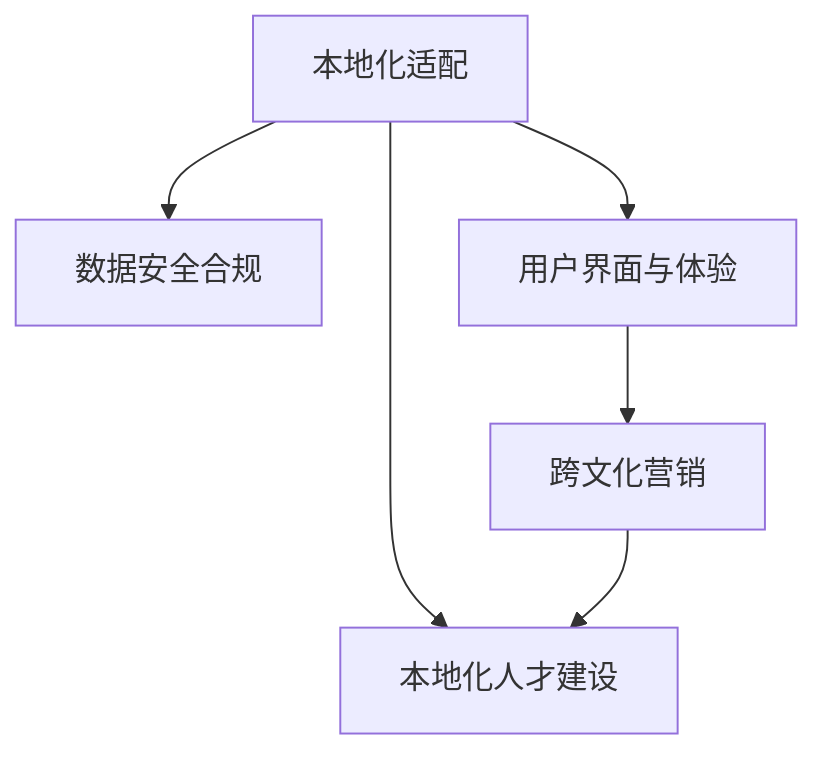

                 

## 1. 背景介绍

### 1.1 问题由来
全球化竞争已是大势所趋，AI创业公司若要在国内市场获得优势，海外市场拓展显得尤为关键。然而，不同市场存在文化差异、法律规制、数据隐私等差异，AI产品需针对本地市场进行适配才能成功落地。

### 1.2 问题核心关键点
AI创业公司跨境业务拓展的核心关键点在于：
- 本地化适配。分析目标市场文化、法规、数据环境，设计本地化产品功能和接口。
- 数据安全合规。确保数据跨境传输、存储、处理符合当地法律法规要求。
- 用户界面与体验。针对不同语言和习惯，优化UI/UX，提升用户体验。
- 营销与市场推广。设计跨文化市场策略，选择合适的营销渠道和传播方式。
- 本地化人才建设。建立具有国际视野和本地市场认知的团队。

### 1.3 问题研究意义
跨境业务拓展能显著提升AI创业公司的市场规模和业务多样性，加速技术全球化进程，推动本地经济创新。同时，构建全球品牌形象，提升公司核心竞争力，确保在激烈的市场竞争中持续领先。

## 2. 核心概念与联系

### 2.1 核心概念概述

为更好理解AI创业公司跨境业务拓展策略，本节将介绍相关核心概念及其联系：

- **本地化适配**：针对目标市场的特定需求和环境，对AI产品功能、界面、数据等方面进行本地化优化。
- **数据安全合规**：确保数据跨境传输、存储、处理符合国际标准和本地法律法规要求，保护用户隐私。
- **用户界面与体验(UX/UI)**：根据目标市场用户的语言习惯、视觉偏好等，设计直观、易用的产品界面。
- **跨文化营销**：设计符合目标市场文化、价值观的营销策略和传播方式，提升品牌影响力。
- **本地化人才建设**：招聘和培养具有国际视野和本地市场认知的团队，确保业务顺利推进。

这些核心概念之间的联系可以通过以下Mermaid流程图表示：



这个流程图展示了一系列相互依赖的核心概念，共同构成了AI创业公司跨境业务拓展的完整框架。

## 3. 核心算法原理 & 具体操作步骤
### 3.1 算法原理概述

跨境业务拓展涉及多个复杂的流程和算法。主要包括以下几个方面：

- **本地化适配算法**：利用自然语言处理、计算机视觉等技术，对AI产品进行本地化适配。
- **数据安全合规算法**：基于数据加密、匿名化等技术，确保跨境数据传输符合当地法规。
- **用户界面与体验设计**：通过UI/UX设计，提升用户界面的可用性和舒适度。
- **跨文化营销算法**：通过语言翻译、文化适应等技术，设计适应目标市场文化的产品推广策略。
- **本地化人才建设算法**：通过招聘、培训等手段，建设具有国际视野和本地市场认知的团队。

### 3.2 算法步骤详解

#### 3.2.1 本地化适配
1. **需求分析**：通过市场调研和用户反馈，明确目标市场对产品的需求。
2. **功能适配**：根据需求，设计或修改AI产品的功能模块。
3. **界面设计**：根据目标市场语言习惯和文化背景，设计符合用户预期的界面和操作方式。
4. **测试与优化**：在本地市场进行测试，收集用户反馈，持续优化产品。

#### 3.2.2 数据安全合规
1. **法规研究**：分析目标市场的数据隐私法规和标准，如GDPR、CCPA等。
2. **数据加密**：对敏感数据进行加密处理，防止未经授权的访问。
3. **匿名化处理**：去除个人识别信息，保护用户隐私。
4. **合规审计**：定期进行安全合规审计，确保数据处理符合法规要求。

#### 3.2.3 用户界面与体验设计
1. **语言翻译**：对产品界面和内容进行本地化翻译，确保语言准确和地道。
2. **文化适应**：调整颜色、图标等视觉元素，使之符合目标市场的文化偏好。
3. **本地化测试**：进行本地化测试，确保产品在不同语言和环境下的稳定性和易用性。

#### 3.2.4 跨文化营销
1. **市场调研**：研究目标市场的文化和消费习惯，确定营销策略方向。
2. **内容本地化**：根据本地市场特点，定制化营销内容。
3. **渠道选择**：选择合适的营销渠道，如社交媒体、线上广告、线下活动等。
4. **效果评估**：分析营销活动效果，调整优化策略。

#### 3.2.5 本地化人才建设
1. **招聘策略**：针对本地市场，设计有效的招聘策略，吸引和筛选合适人才。
2. **团队培训**：定期进行团队培训，提升团队跨文化沟通能力。
3. **人才激励**：制定具有竞争力的薪酬和激励机制，吸引和留住优秀人才。

### 3.3 算法优缺点

跨境业务拓展算法的主要优点包括：
- 增强市场竞争力。通过本地化适配和跨文化营销，提升AI产品在全球市场的接受度和市场份额。
- 提升用户体验。本地化适配和UI/UX设计，使产品更贴合目标市场用户需求。
- 数据安全合规。通过严格的数据安全措施，保障用户隐私，增强品牌信任度。

同时，该方法也存在一定的局限性：
- 高成本投入。本地化适配和跨文化营销需投入大量人力和财力。
- 文化差异风险。不当的本地化可能导致产品水土不服，影响用户体验。
- 法规适应复杂。不同市场的法规体系复杂，需耗费大量时间进行合规工作。
- 市场推广难度大。目标市场的竞争环境各异，推广策略需灵活调整。

尽管存在这些局限性，跨境业务拓展仍是大势所趋，为AI创业公司打开了全球市场，带来了更多商业机遇。

### 3.4 算法应用领域

跨境业务拓展算法主要应用于以下领域：

- **全球电商**：将AI技术应用于跨境电商平台，实现商品推荐、库存管理、用户行为分析等功能。
- **智能制造**：利用AI技术优化国际供应链管理，提高制造效率和质量。
- **医疗健康**：通过AI技术提供跨境医疗服务，实现远程诊断、健康管理等功能。
- **教育科技**：为国际教育市场提供AI驱动的教育平台和工具，提升教学效果。
- **金融科技**：跨境支付、金融风险管理等，提升跨境金融服务的便利性和安全性。

## 4. 数学模型和公式 & 详细讲解 & 举例说明

### 4.1 数学模型构建

跨境业务拓展涉及多个复杂模型，以数据安全合规为例，简述其数学模型构建：

- **数据安全合规模型**：
  $$
  P(C) = P(C|D) \cdot P(D)
  $$

  其中，$P(C)$ 为数据泄露的概率，$P(D)$ 为数据泄露的风险因素概率分布，$P(C|D)$ 为数据泄露条件概率。

### 4.2 公式推导过程

**公式推导**：
$$
P(C|D) = \frac{P(C, D)}{P(D)}
$$

上式中，$P(C, D)$ 为数据泄露和风险因素同时出现的概率，$P(D)$ 为风险因素出现的概率。

### 4.3 案例分析与讲解

假设公司数据泄露风险因素有四种，分别为数据加密、用户隐私保护、数据传输加密、数据访问控制。设每种风险因素的概率为 $P(D_1), P(D_2), P(D_3), P(D_4)$，其中 $P(D_1) = 0.8, P(D_2) = 0.6, P(D_3) = 0.9, P(D_4) = 0.7$。设数据泄露的概率为 $P(C) = 0.05$。根据公式推导，可得：

$$
P(C|D_1, D_2, D_3, D_4) = \frac{P(C, D_1, D_2, D_3, D_4)}{P(D_1, D_2, D_3, D_4)}
$$

## 5. 项目实践：代码实例和详细解释说明

### 5.1 开发环境搭建

在进行跨境业务拓展项目开发前，需准备好开发环境。以下是使用Python进行Flask开发的配置流程：

1. 安装Anaconda：从官网下载并安装Anaconda，用于创建独立的Python环境。

2. 创建并激活虚拟环境：
```bash
conda create -n flask-env python=3.8 
conda activate flask-env
```

3. 安装Flask：
```bash
pip install Flask
```

4. 安装相关库：
```bash
pip install Flask-RESTful Flask-SocketIO Flask-WTF
```

完成上述步骤后，即可在`flask-env`环境中开始跨境业务拓展项目的开发。

### 5.2 源代码详细实现

下面以一个跨境电商平台的本地化适配模块为例，展示如何使用Flask进行开发：

```python
from flask import Flask, render_template, request, jsonify
from flask_restful import Resource, Api
from flask_socketio import SocketIO
from flask_wtf import FlaskForm
from wtforms import StringField

app = Flask(__name__)
api = Api(app)
socketio = SocketIO(app)

# 本地化适配示例
class LocalizeForm(FlaskForm):
    localized_string = StringField('Localize this string')

@app.route('/')
def index():
    return render_template('index.html')

@app.route('/localize', methods=['POST'])
def localize():
    form = LocalizeForm()
    if form.validate_on_submit():
        localized_string = form.localized_string.data
        # 本地化适配逻辑
        # ...
        return jsonify(result=localized_string)

if __name__ == '__main__':
    socketio.run(app)
```

### 5.3 代码解读与分析

让我们再详细解读一下关键代码的实现细节：

**Flask和Flask-RESTful**：
- `Flask`是Python中最流行的Web框架之一，用于构建Web应用。
- `Flask-RESTful`是Flask的扩展，提供了RESTful风格的API开发支持。

**SocketIO**：
- `SocketIO`是Flask的扩展，用于实现实时通信功能。

**本地化适配模块**：
- `LocalizeForm`是Flask表单类，用于接收本地化请求数据。
- `localize`函数接收POST请求，验证表单数据，调用本地化适配逻辑，返回本地化结果。

**SocketIO**：
- `socketio.run(app)`启动SocketIO服务器，实现实时通信功能。

此代码展示了如何使用Flask构建Web应用，并通过SocketIO实现实时通信。开发者可根据具体需求，灵活使用Flask和其扩展库，完成跨境业务拓展项目的开发。

### 5.4 运行结果展示

运行上述代码后，可在浏览器中访问`http://localhost:5000`，看到本地化适配的交互界面。用户可以提交需要本地化的字符串，服务器返回本地化结果。

## 6. 实际应用场景

### 6.1 跨境电商平台

跨境电商平台需实现商品推荐、库存管理、订单处理等功能。通过本地化适配，平台可以支持多种语言和货币，覆盖更多用户群体。

### 6.2 智能制造系统

智能制造系统需实现供应链管理、生产调度、质量控制等功能。通过本地化适配，系统可以支持全球供应链管理，提升制造效率和质量。

### 6.3 医疗健康应用

医疗健康应用需实现远程诊断、健康管理等功能。通过本地化适配，应用可以支持不同国家和地区的语言和文化，提升医疗服务的可访问性。

### 6.4 未来应用展望

随着跨境业务拓展技术的不断进步，未来将呈现以下几个趋势：

1. **多语言支持**：支持更多语言和文字编码，提供更广泛的语言服务。
2. **跨文化理解**：结合自然语言处理和情感分析技术，提升对不同文化的理解能力。
3. **数据融合与共享**：通过区块链和分布式技术，实现跨国数据的融合与共享。
4. **智能决策支持**：利用AI技术提供智能决策支持，优化跨境业务决策过程。
5. **隐私保护技术**：结合数据加密、匿名化等技术，保障跨境数据隐私。

## 7. 工具和资源推荐

### 7.1 学习资源推荐

为帮助开发者系统掌握跨境业务拓展的理论基础和实践技巧，这里推荐一些优质的学习资源：

1. **Flask官方文档**：Flask的官方文档，详细介绍了Flask框架的使用方法和扩展库的使用，是Flask开发的必备资料。

2. **Flask-RESTful官方文档**：Flask-RESTful的官方文档，提供了RESTful风格的API开发指南。

3. **SocketIO官方文档**：SocketIO的官方文档，提供了实时通信功能的详细使用说明。

4. **自然语言处理(NLP)**：推荐的NLP书籍和课程，包括《自然语言处理综论》和Coursera的《自然语言处理》课程。

5. **数据隐私法规**：推荐的隐私法规书籍和课程，包括《数据隐私法规：GDPR与CCPA解析》和Udacity的《数据隐私与安全》课程。

通过对这些资源的学习实践，相信你一定能够快速掌握跨境业务拓展的精髓，并用于解决实际的NLP问题。

### 7.2 开发工具推荐

高效的开发离不开优秀的工具支持。以下是几款用于跨境业务拓展开发的常用工具：

1. **Jupyter Notebook**：Jupyter Notebook提供了强大的代码编写和可视化功能，方便进行跨境业务拓展的实验和调试。

2. **Git和GitHub**：Git和GitHub提供了版本控制和代码托管功能，方便团队协作和代码管理。

3. **Amazon Web Services (AWS)**：AWS提供了丰富的云服务，包括计算、存储、网络、数据库等，适合跨境业务拓展项目的快速部署和扩展。

4. **Docker和Kubernetes**：Docker和Kubernetes提供了容器化和微服务化部署功能，方便跨境业务拓展项目的容器化部署和弹性扩展。

5. **Prometheus和Grafana**：Prometheus和Grafana提供了监控和可视化功能，方便实时监控和分析跨境业务拓展项目的状态和性能。

合理利用这些工具，可以显著提升跨境业务拓展项目的开发效率，加快创新迭代的步伐。

### 7.3 相关论文推荐

跨境业务拓展技术的发展源于学界的持续研究。以下是几篇奠基性的相关论文，推荐阅读：

1. **跨境电商中的本地化研究**：介绍了跨境电商中的本地化策略和实践。

2. **智能制造中的本地化适配**：介绍了智能制造系统中的本地化适配技术。

3. **医疗健康中的本地化服务**：介绍了医疗健康应用中的本地化适配和数据隐私保护。

4. **金融科技中的跨境支付**：介绍了跨境支付中的本地化适配和安全合规。

5. **教育科技中的本地化教育**：介绍了教育科技应用中的本地化适配和跨文化沟通。

这些论文代表了大语言模型微调技术的发展脉络。通过学习这些前沿成果，可以帮助研究者把握学科前进方向，激发更多的创新灵感。

## 8. 总结：未来发展趋势与挑战

### 8.1 总结

本文对AI创业公司的跨境业务拓展策略进行了全面系统的介绍。首先阐述了跨境业务拓展的重要性和核心关键点，明确了本地化适配、数据安全合规、用户界面与体验、跨文化营销和本地化人才建设的重要性。其次，从原理到实践，详细讲解了跨境业务拓展的数学模型和核心算法，给出了Flask和SocketIO的代码实例，展示了跨境业务拓展的实际应用场景。最后，本文推荐了学习资源、开发工具和相关论文，力求为开发者提供全方位的技术指引。

通过本文的系统梳理，可以看到，跨境业务拓展策略在大规模AI技术落地方面具有重要意义，能够显著提升AI创业公司的市场竞争力和业务多样性。未来，随着跨境业务拓展技术的不断发展，AI创业公司将能够更好地服务于全球市场，推动技术全球化进程。

### 8.2 未来发展趋势

展望未来，跨境业务拓展技术将呈现以下几个发展趋势：

1. **自动化和智能化**：结合AI技术，自动完成本地化适配、数据安全和合规等工作，提高工作效率。
2. **跨平台和跨文化**：支持多种平台和语言，提供跨文化的用户体验和沟通方式。
3. **实时数据处理**：通过实时数据处理技术，实现对跨境业务动态监控和优化。
4. **区块链技术应用**：结合区块链技术，实现跨国数据的安全传输和共享。
5. **隐私保护技术**：结合隐私保护技术，保障跨境数据隐私和安全。

以上趋势凸显了跨境业务拓展技术的广阔前景。这些方向的探索发展，必将进一步提升跨境业务拓展的效率和安全性，推动AI创业公司向全球市场迈进。

### 8.3 面临的挑战

尽管跨境业务拓展技术已经取得了瞩目成就，但在迈向更加智能化、普适化应用的过程中，仍面临诸多挑战：

1. **高成本投入**：本地化适配和跨文化营销需投入大量人力和财力。
2. **文化差异风险**：不当的本地化可能导致产品水土不服，影响用户体验。
3. **法规适应复杂**：不同市场的法规体系复杂，需耗费大量时间进行合规工作。
4. **市场推广难度大**：目标市场的竞争环境各异，推广策略需灵活调整。
5. **隐私保护难度大**：数据跨境传输和存储涉及隐私保护问题，需严格遵守法律法规。

尽管存在这些挑战，跨境业务拓展仍是大势所趋，为AI创业公司打开了全球市场，带来了更多商业机遇。

### 8.4 研究展望

面对跨境业务拓展所面临的种种挑战，未来的研究需要在以下几个方面寻求新的突破：

1. **自动化和智能化工具**：开发更多的自动化和智能化工具，提高跨境业务拓展的效率和效果。
2. **本地化适配技术**：研究更加高效的本地化适配技术，提升跨境产品的本地化适应性。
3. **跨文化营销策略**：研究跨文化的营销策略，提高跨境业务的推广效果。
4. **隐私保护技术**：研究数据隐私保护技术，确保跨境数据的安全传输和存储。
5. **区块链技术应用**：研究区块链技术在跨境业务中的应用，提升跨境数据的安全性和可追溯性。

这些研究方向的探索，必将引领跨境业务拓展技术迈向更高的台阶，为AI创业公司构建全球化业务提供坚实的基础。

## 9. 附录：常见问题与解答

**Q1：跨境业务拓展中的本地化适配是否一定要通过人工实现？**

A: 在早期阶段，本地化适配可能需要人工介入，但随着技术的发展，越来越多的自动化和智能化工具可以辅助本地化适配。例如，可以利用自然语言处理技术自动进行文本翻译和本地化适配。

**Q2：如何选择合适的本地化适配策略？**

A: 根据目标市场文化和用户需求，选择合适的本地化适配策略。例如，对于拉丁语系国家，可以选择西班牙语或法语本地化；对于东亚地区，可以选择中文或日语本地化。

**Q3：跨境业务拓展中的数据安全合规需要注意哪些问题？**

A: 数据安全合规需要注意以下几个问题：
1. 数据加密：对敏感数据进行加密处理。
2. 匿名化处理：去除个人识别信息，保护用户隐私。
3. 合规审计：定期进行安全合规审计，确保数据处理符合法规要求。

**Q4：如何优化跨境业务拓展的营销策略？**

A: 优化跨境业务拓展的营销策略需要注意以下几个问题：
1. 市场调研：研究目标市场的文化和消费习惯。
2. 内容本地化：根据本地市场特点，定制化营销内容。
3. 渠道选择：选择合适的营销渠道，如社交媒体、线上广告、线下活动等。
4. 效果评估：分析营销活动效果，调整优化策略。

**Q5：跨境业务拓展中的本地化人才建设需要注意哪些问题？**

A: 本地化人才建设需要注意以下几个问题：
1. 招聘策略：针对本地市场，设计有效的招聘策略，吸引和筛选合适人才。
2. 团队培训：定期进行团队培训，提升团队跨文化沟通能力。
3. 人才激励：制定具有竞争力的薪酬和激励机制，吸引和留住优秀人才。

---

作者：禅与计算机程序设计艺术 / Zen and the Art of Computer Programming

