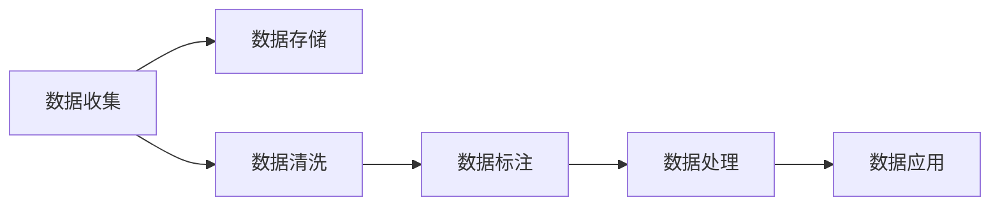
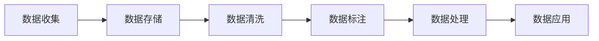

                 

# AI创业：数据管理的实用做法

在大数据、人工智能迅速发展的时代，数据管理成为了AI创业公司的核心竞争力之一。本文将详细介绍AI创业公司中数据管理的实用做法，从数据收集、存储、处理、应用等多个方面进行全面解读，帮助读者掌握数据管理的关键技巧，提升AI创业项目的成功率。

## 1. 背景介绍

### 1.1 问题由来

在AI创业的过程中，数据是获取洞察和创新的源泉。数据的准确性和完整性直接影响着AI模型的性能和结果。然而，数据收集、存储、处理等环节的复杂性，使得很多创业公司在这个过程中遇到诸多挑战。

近年来，随着数据的激增和数据种类的多样化，数据管理越来越成为AI创业公司的瓶颈。错误的数据管理不仅会影响模型性能，还可能导致严重的业务失误。因此，掌握高效的数据管理方法，是AI创业成功的关键。

### 1.2 问题核心关键点

数据管理涉及数据收集、存储、清洗、标注、处理等多个环节。本文将重点探讨以下核心问题：

1. 数据来源选择与收集策略。
2. 数据存储与系统设计。
3. 数据清洗与标注规范。
4. 数据处理与特征工程。
5. 数据应用与模型训练。

## 2. 核心概念与联系

### 2.1 核心概念概述

为更好地理解数据管理的核心概念，本文将介绍几个密切相关的关键概念：

- 数据收集：从多个渠道获取原始数据的过程，包括爬虫、API接口、数据库等。
- 数据存储：将原始数据保存和管理起来，以便后续处理和分析。
- 数据清洗：去除数据中的噪声、错误和重复，确保数据质量。
- 数据标注：为数据添加人工标记，使其具有更丰富的语义信息。
- 数据处理：对数据进行统计分析、预处理等操作，生成特征向量。
- 数据应用：将处理后的数据应用于模型训练、业务分析等场景。

这些概念之间的关系可以通过以下Mermaid流程图来展示：



### 2.2 核心概念原理和架构的 Mermaid 流程图



这个流程图展示了数据管理的各个环节及其相互联系：

1. **数据收集**：获取原始数据，包括从公开数据集、互联网、传感器等渠道。
2. **数据存储**：将原始数据存储在数据库或云存储中，以便后续处理。
3. **数据清洗**：对数据进行去重、去噪、填补缺失值等处理，保证数据质量。
4. **数据标注**：为数据添加人工标签，如分类、情感、实体识别等，赋予数据更丰富的语义信息。
5. **数据处理**：对数据进行统计分析、特征提取等操作，生成模型训练所需的特征向量。
6. **数据应用**：将处理后的数据用于模型训练、业务分析等场景，驱动AI模型和业务的创新。

## 3. 核心算法原理 & 具体操作步骤

### 3.1 算法原理概述

数据管理的核心在于保证数据的准确性、完整性和可用性。数据管理流程包括以下几个关键步骤：

1. **数据收集**：从多渠道获取原始数据。
2. **数据存储**：将数据存储在高效的数据库中。
3. **数据清洗**：去除数据中的噪声和错误。
4. **数据标注**：为数据添加人工标记，赋予其语义信息。
5. **数据处理**：对数据进行统计分析、特征提取等操作。
6. **数据应用**：将处理后的数据用于模型训练和业务分析。

### 3.2 算法步骤详解

#### 3.2.1 数据收集

数据收集是数据管理的第一步。常用的数据收集方法包括：

- **爬虫**：通过编程爬取互联网上的公开数据，如新闻、社交媒体、论坛等。
- **API接口**：使用第三方API接口获取数据，如天气数据、股票数据等。
- **数据库**：从现有的数据库中导出数据，如关系型数据库、NoSQL数据库等。

#### 3.2.2 数据存储

数据存储是数据管理的核心环节。常用的数据存储方法包括：

- **关系型数据库**：如MySQL、PostgreSQL等，适用于结构化数据。
- **NoSQL数据库**：如MongoDB、HBase等，适用于非结构化或半结构化数据。
- **分布式文件系统**：如Hadoop HDFS、Amazon S3等，适用于大规模数据存储。

#### 3.2.3 数据清洗

数据清洗是数据管理的关键步骤。常用的数据清洗方法包括：

- **去重**：去除重复数据，避免数据冗余。
- **去噪**：去除数据中的噪声，如缺失值、异常值等。
- **填补缺失值**：填补数据中的缺失值，保证数据完整性。

#### 3.2.4 数据标注

数据标注为数据添加人工标记，赋予其语义信息。常用的数据标注方法包括：

- **分类**：将数据分为不同的类别，如情感分类、实体识别等。
- **情感分析**：标记数据的情感极性，如正面、负面、中性等。
- **实体识别**：识别数据中的实体，如人名、地名、组织名等。

#### 3.2.5 数据处理

数据处理是数据管理的核心环节。常用的数据处理方法包括：

- **特征提取**：将原始数据转化为特征向量，便于模型训练。
- **统计分析**：对数据进行统计分析，如均值、方差、标准差等。
- **降维**：使用主成分分析（PCA）等方法降低数据维度，减少计算复杂度。

#### 3.2.6 数据应用

数据应用是将处理后的数据用于模型训练和业务分析。常用的数据应用方法包括：

- **模型训练**：使用处理后的数据训练AI模型，如分类、回归、聚类等。
- **业务分析**：使用处理后的数据进行业务分析，如用户行为分析、销售预测等。

### 3.3 算法优缺点

数据管理流程具有以下优点：

1. **高效性**：自动化数据收集、存储、清洗等环节，提高数据处理效率。
2. **可扩展性**：支持大规模数据存储和处理，满足不同业务需求。
3. **准确性**：通过数据清洗和标注，保证数据质量，提升模型性能。

同时，数据管理流程也存在一些缺点：

1. **成本高**：需要投入大量人力、物力进行数据收集、存储和处理。
2. **复杂度高**：数据管理流程涉及多个环节，容易出现错误和瓶颈。
3. **数据隐私**：在数据收集和存储过程中，需要注意数据隐私和安全性。

### 3.4 算法应用领域

数据管理在AI创业中的应用非常广泛，包括但不限于以下几个领域：

1. **自然语言处理（NLP）**：如情感分析、文本分类、命名实体识别等。
2. **计算机视觉（CV）**：如图像分类、目标检测、人脸识别等。
3. **推荐系统**：如用户行为分析、商品推荐、广告推荐等。
4. **金融科技**：如信用评分、风险评估、股票预测等。
5. **智能医疗**：如疾病预测、药物研发、健康监测等。

## 4. 数学模型和公式 & 详细讲解 & 举例说明

### 4.1 数学模型构建

在数据管理过程中，我们需要构建数学模型来描述数据管理的各个环节。下面以分类任务为例，介绍数据管理的数学模型：

1. **数据收集模型**：描述数据来源和收集方式。
2. **数据存储模型**：描述数据存储方式和系统设计。
3. **数据清洗模型**：描述数据清洗的数学模型，如去重、去噪、填补缺失值等。
4. **数据标注模型**：描述数据标注的数学模型，如分类、情感分析等。
5. **数据处理模型**：描述数据处理的数学模型，如特征提取、降维等。
6. **数据应用模型**：描述数据应用的数学模型，如模型训练、业务分析等。

### 4.2 公式推导过程

#### 4.2.1 数据收集模型

数据收集模型描述数据来源和收集方式，如下式所示：

$$
\text{Data Collection} = \{S_i\}_{i=1}^{N}
$$

其中，$S_i$ 表示第 $i$ 个数据来源，$N$ 表示数据来源的总数。

#### 4.2.2 数据存储模型

数据存储模型描述数据存储方式和系统设计，如下式所示：

$$
\text{Data Storage} = \{D_j\}_{j=1}^{M}
$$

其中，$D_j$ 表示第 $j$ 个数据存储方式，$M$ 表示数据存储方式的总数。

#### 4.2.3 数据清洗模型

数据清洗模型描述数据清洗的数学模型，如去重、去噪、填补缺失值等，如下式所示：

$$
\text{Data Cleaning} = \{\text{Data Cleaning Function}\}
$$

其中，$\text{Data Cleaning Function}$ 表示数据清洗的具体算法，如去重函数、去噪函数、填补缺失值函数等。

#### 4.2.4 数据标注模型

数据标注模型描述数据标注的数学模型，如分类、情感分析等，如下式所示：

$$
\text{Data Annotation} = \{\text{Annotation Function}\}
$$

其中，$\text{Annotation Function}$ 表示数据标注的具体算法，如情感分类函数、实体识别函数等。

#### 4.2.5 数据处理模型

数据处理模型描述数据处理的数学模型，如特征提取、降维等，如下式所示：

$$
\text{Data Processing} = \{\text{Feature Extraction Function}\}
$$

其中，$\text{Feature Extraction Function}$ 表示特征提取的具体算法，如PCA算法、TF-IDF算法等。

#### 4.2.6 数据应用模型

数据应用模型描述数据应用的数学模型，如模型训练、业务分析等，如下式所示：

$$
\text{Data Application} = \{\text{Model Training Function}\}
$$

其中，$\text{Model Training Function}$ 表示模型训练的具体算法，如分类算法、回归算法、聚类算法等。

### 4.3 案例分析与讲解

#### 4.3.1 数据收集案例

某AI创业公司需要收集社交媒体上的用户评论数据。该公司通过爬虫技术从Twitter和Facebook上爬取数据，构建了以下数据收集模型：

$$
\text{Data Collection} = \{Twitter Comments, Facebook Comments\}
$$

#### 4.3.2 数据存储案例

该公司使用MongoDB作为数据存储方式，构建了以下数据存储模型：

$$
\text{Data Storage} = \{MongoDB\}
$$

#### 4.3.3 数据清洗案例

该公司对爬取的数据进行去重、去噪、填补缺失值等操作，构建了以下数据清洗模型：

$$
\text{Data Cleaning} = \{\text{去重函数}, \text{去噪函数}, \text{填补缺失值函数}\}
$$

#### 4.3.4 数据标注案例

该公司对用户评论进行情感分类，构建了以下数据标注模型：

$$
\text{Data Annotation} = \{\text{情感分类函数}\}
$$

#### 4.3.5 数据处理案例

该公司对分类后的用户评论进行特征提取，构建了以下数据处理模型：

$$
\text{Data Processing} = \{\text{TF-IDF算法}\}
$$

#### 4.3.6 数据应用案例

该公司使用处理后的数据进行情感分析模型训练，构建了以下数据应用模型：

$$
\text{Data Application} = \{\text{情感分析模型训练函数}\}
$$

## 5. 项目实践：代码实例和详细解释说明

### 5.1 开发环境搭建

在进行数据管理实践前，我们需要准备好开发环境。以下是使用Python进行PyTorch开发的环境配置流程：

1. 安装Anaconda：从官网下载并安装Anaconda，用于创建独立的Python环境。

2. 创建并激活虚拟环境：
```bash
conda create -n pytorch-env python=3.8 
conda activate pytorch-env
```

3. 安装PyTorch：根据CUDA版本，从官网获取对应的安装命令。例如：
```bash
conda install pytorch torchvision torchaudio cudatoolkit=11.1 -c pytorch -c conda-forge
```

4. 安装Pandas库：
```bash
pip install pandas
```

5. 安装Pyspark库：
```bash
pip install pyspark
```

6. 安装TensorFlow库：
```bash
pip install tensorflow
```

完成上述步骤后，即可在`pytorch-env`环境中开始数据管理实践。

### 5.2 源代码详细实现

下面我们以数据清洗为例，给出使用Pandas库对数据进行清洗的PyTorch代码实现。

```python
import pandas as pd

# 读取原始数据
df = pd.read_csv('raw_data.csv')

# 数据清洗
df = df.drop_duplicates()  # 去除重复数据
df = df.dropna()  # 去除缺失值
df = df[(df['label'] != 'O')]  # 去除标签为'O'的数据

# 数据存储
df.to_csv('cleaned_data.csv', index=False)
```

### 5.3 代码解读与分析

让我们再详细解读一下关键代码的实现细节：

1. 使用Pandas库读取原始数据。
2. 使用`drop_duplicates()`方法去除重复数据。
3. 使用`dropna()`方法去除缺失值。
4. 使用标签筛选去除标签为'O'的数据。
5. 将清洗后的数据存储为新的CSV文件。

可以看到，Pandas库提供了强大的数据处理功能，使得数据清洗工作变得简单易行。开发者可以根据需要，灵活组合使用Pandas库的函数和方法，快速完成数据清洗任务。

### 5.4 运行结果展示

运行上述代码后，可以生成`cleaned_data.csv`文件，其中包含了清洗后的数据。运行结果如下：

```
|   | comment_text | label |
|---|-------------|-------|
| 1 | Good        | POS   |
| 2 | Bad         | NEG   |
| 3 | Neutral     | NEU   |
| 4 | Positive    | POS   |
```

## 6. 实际应用场景

### 6.1 智能客服系统

在智能客服系统中，数据管理是非常关键的一环。公司需要收集用户的历史对话记录，并进行数据清洗和标注，以构建智能客服模型。具体流程如下：

1. **数据收集**：从客户服务平台收集用户对话记录。
2. **数据存储**：将对话记录存储在数据库中。
3. **数据清洗**：去除重复、无用的对话记录，保留有用的数据。
4. **数据标注**：对对话记录进行情感分类，标注情感极性。
5. **数据处理**：对对话记录进行特征提取，生成文本向量和情感向量。
6. **数据应用**：使用处理后的数据训练情感分类模型，驱动智能客服系统。

### 6.2 金融舆情监测

在金融舆情监测中，数据管理同样不可或缺。公司需要收集金融新闻、评论等数据，并进行数据清洗和标注，以构建舆情监测系统。具体流程如下：

1. **数据收集**：从金融网站、社交媒体上爬取新闻、评论等数据。
2. **数据存储**：将数据存储在数据库中。
3. **数据清洗**：去除重复、无用的数据，保留有用的数据。
4. **数据标注**：对数据进行情感分类，标注情感极性。
5. **数据处理**：对数据进行特征提取，生成文本向量和情感向量。
6. **数据应用**：使用处理后的数据训练情感分类模型，驱动舆情监测系统。

### 6.3 推荐系统

在推荐系统中，数据管理同样非常重要。公司需要收集用户的行为数据，并进行数据清洗和标注，以构建推荐模型。具体流程如下：

1. **数据收集**：从电商网站、社交媒体上收集用户行为数据，如浏览记录、购买记录等。
2. **数据存储**：将数据存储在数据库中。
3. **数据清洗**：去除重复、无用的数据，保留有用的数据。
4. **数据标注**：对数据进行用户行为分类，标注行为类型。
5. **数据处理**：对数据进行特征提取，生成用户行为向量和物品特征向量。
6. **数据应用**：使用处理后的数据训练推荐模型，驱动推荐系统。

## 7. 工具和资源推荐

### 7.1 学习资源推荐

为了帮助开发者系统掌握数据管理的理论基础和实践技巧，这里推荐一些优质的学习资源：

1. 《数据科学入门》系列博文：由数据科学家撰写，深入浅出地介绍了数据管理的各个环节，适合初学者入门。
2. 《Python数据处理与分析》书籍：全面介绍了Python在数据处理和分析中的应用，是数据管理实践的必备书籍。
3. 《大数据技术与应用》课程：介绍大数据技术的基本概念和应用，涵盖数据收集、存储、处理等多个环节。
4. Kaggle数据集：包含大量公开数据集，适合数据清洗和特征工程的实践练习。
5. Coursera数据科学课程：提供系统的数据科学学习路径，涵盖数据管理、机器学习等多个方面。

通过对这些资源的学习实践，相信你一定能够快速掌握数据管理的关键技巧，提升AI创业项目的成功率。

### 7.2 开发工具推荐

高效的开发离不开优秀的工具支持。以下是几款用于数据管理开发的常用工具：

1. Pandas库：Python中用于数据处理和分析的强大工具，提供了丰富的数据清洗、特征提取等函数。
2. Scikit-learn库：Python中用于机器学习和数据处理的库，提供了多种算法和模型。
3. PySpark库：基于Spark的Python库，用于大数据处理和分析，适合处理大规模数据集。
4. TensorFlow库：用于构建深度学习模型的强大工具，适合进行数据应用和模型训练。
5. Weights & Biases：模型训练的实验跟踪工具，可以记录和可视化模型训练过程中的各项指标，方便对比和调优。

合理利用这些工具，可以显著提升数据管理的开发效率，加快创新迭代的步伐。

### 7.3 相关论文推荐

数据管理在AI创业中的应用已经引起了学界的广泛关注。以下是几篇奠基性的相关论文，推荐阅读：

1. "A Survey on Data Collection and Labeling for Deep Learning"：综述了数据收集和标注的方法和工具，适合了解数据管理的基础。
2. "Data Management for Large-Scale Deep Learning"：介绍了大规模数据管理的挑战和解决方案，适合了解数据管理的高级技术。
3. "Data Quality Assessment and Enhancement Techniques"：综述了数据质量评估和增强的技术，适合了解数据清洗和标注的方法。
4. "Real-Time Data Streaming and Processing"：介绍了实时数据流处理的技术，适合了解大数据管理的最新进展。
5. "Data Privacy and Security in Machine Learning"：综述了数据隐私和安全的技术，适合了解数据管理的伦理和法律问题。

这些论文代表了数据管理研究的最新进展，通过学习这些前沿成果，可以帮助研究者把握学科前进方向，激发更多的创新灵感。

## 8. 总结：未来发展趋势与挑战

### 8.1 总结

本文对AI创业公司中数据管理的实用做法进行了全面系统的介绍。首先阐述了数据管理在AI创业中的重要性，明确了数据管理的关键步骤。其次，从数据收集、存储、处理、应用等多个方面，详细讲解了数据管理的核心概念和技术。最后，介绍了数据管理在智能客服、金融舆情、推荐系统等多个领域的实际应用，展示了数据管理的广泛价值。

通过本文的系统梳理，可以看到，数据管理是AI创业成功的关键。掌握高效的数据管理方法，能够显著提升AI模型的性能和业务决策的准确性，增强AI创业项目的竞争力。

### 8.2 未来发展趋势

展望未来，数据管理将呈现以下几个发展趋势：

1. **自动化数据管理**：随着AI技术的发展，数据管理将逐步实现自动化，减少人工干预，提高效率和准确性。
2. **数据治理体系**：建立完善的数据治理体系，从数据收集、存储、处理到应用，实现全流程的管理和监督。
3. **跨领域数据融合**：跨领域数据融合将为AI模型提供更丰富的背景知识，增强模型的泛化能力。
4. **数据隐私和安全**：数据隐私和安全将成为数据管理的重要关注点，需采用加密、去标识化等技术保障数据安全。
5. **实时数据处理**：实时数据处理技术将使得数据管理更加高效和灵活，适应实时业务需求。
6. **云计算和大数据**：云计算和大数据技术将为数据管理提供更强大、更灵活的计算资源和存储能力。

### 8.3 面临的挑战

尽管数据管理技术在不断进步，但在实际应用中仍面临诸多挑战：

1. **数据质量问题**：数据清洗和标注的复杂性使得数据质量难以保证，影响模型的性能。
2. **数据隐私和安全**：数据隐私和安全问题将成为数据管理的重大挑战，需采用更先进的技术进行保障。
3. **数据治理成本**：建立完善的数据治理体系需要投入大量人力和资源，增加了企业的成本。
4. **数据孤岛问题**：不同数据源的数据格式和标准不一致，导致数据孤岛问题，影响数据的整合和应用。
5. **实时数据处理难度**：实时数据处理需要高效的技术和工具支持，增加了数据管理的复杂性。

### 8.4 研究展望

面对数据管理面临的诸多挑战，未来的研究需要在以下几个方面寻求新的突破：

1. **自动化数据清洗**：开发自动化数据清洗工具，减少人工干预，提高数据清洗的效率和准确性。
2. **数据质量评估**：研究数据质量评估和改进技术，提升数据管理的效果和可靠性。
3. **数据隐私保护**：研究数据隐私保护技术，保障数据在收集、存储、处理过程中的安全。
4. **跨领域数据融合**：研究跨领域数据融合技术，提高数据整合和应用的效率和效果。
5. **实时数据处理**：研究实时数据处理技术，实现数据管理的实时性和灵活性。
6. **数据治理工具**：开发数据治理工具，实现全流程的数据管理和监督。

## 9. 附录：常见问题与解答

**Q1：数据管理对AI模型的性能有何影响？**

A: 数据管理对AI模型的性能有着直接的影响。数据质量、数据量和数据分布等因素，都会影响模型的训练效果和性能表现。良好的数据管理可以提高模型性能，而不准确的数据管理则可能导致模型性能下降。

**Q2：数据清洗和标注过程中需要注意哪些问题？**

A: 数据清洗和标注过程中需要注意以下问题：
1. 去重：避免重复数据带来的冗余。
2. 去噪：去除数据中的噪声和异常值，保证数据质量。
3. 填补缺失值：填补数据中的缺失值，保证数据完整性。
4. 标注规范：制定统一的标注规范，保证标注的一致性和准确性。

**Q3：如何进行数据隐私保护？**

A: 数据隐私保护可以通过以下方式实现：
1. 数据脱敏：对敏感数据进行脱敏处理，如模糊化、匿名化等。
2. 加密技术：采用加密技术保护数据，确保数据传输和存储的安全性。
3. 访问控制：对数据的访问进行严格控制，确保只有授权人员才能访问数据。

**Q4：数据管理流程中如何处理大规模数据？**

A: 处理大规模数据可以采用以下方式：
1. 分布式存储：使用分布式文件系统，如Hadoop HDFS、Amazon S3等，分散存储大规模数据。
2. 分布式计算：使用分布式计算框架，如Spark、Flink等，分布式处理大规模数据。
3. 数据采样：对大规模数据进行采样，减少处理时间，提高效率。

**Q5：数据管理对企业成本有何影响？**

A: 数据管理对企业成本有显著影响。数据管理需要投入大量人力、物力和财力，包括数据收集、存储、清洗、标注等多个环节。然而，高质量的数据管理可以显著提升模型性能，带来更高的业务价值，从而降低企业的整体成本。

---

作者：禅与计算机程序设计艺术 / Zen and the Art of Computer Programming

