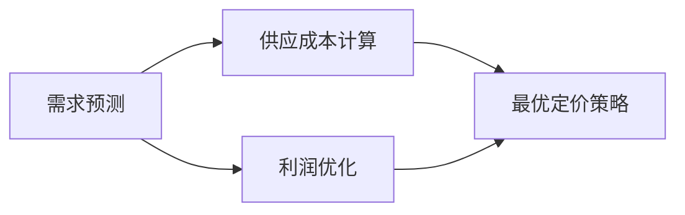

                 

## 1. 背景介绍

在数字经济时代，企业通过在线平台进行产品或服务的销售，面临着复杂的市场环境，需要在不断变化的价格和需求之间做出动态定价决策，以优化收益和销售量。传统的定价策略往往基于固定的定价模型，难以适应动态的市场变化。而人工智能（AI）的引入，能够帮助企业实时分析市场数据，调整定价策略，从而实现收益的最大化。本文将探讨AI在动态定价中的应用，介绍如何利用机器学习算法优化收益和销售量。

## 2. 核心概念与联系

### 2.1 核心概念概述

在动态定价过程中，有几个核心概念需要理解：

- **动态定价**：根据市场需求和供应状况，实时调整产品或服务的定价。相比传统的固定定价，动态定价更加灵活，能够更好地响应市场变化。
- **需求预测**：预测未来市场需求的变化趋势，以便进行价格调整。通常通过时间序列分析、回归分析等方法进行预测。
- **供应成本**：计算产品或服务的生产和配送成本，包括固定成本和变动成本。供应成本的精确计算是制定最优定价策略的前提。
- **利润优化**：根据需求预测和供应成本，制定最优定价策略，实现利润最大化。

这些概念之间的联系可以通过以下Mermaid流程图来展示：



这个流程图展示了大语言模型的核心概念及其之间的关系：

1. 需求预测为供应成本计算提供数据支持。
2. 供应成本计算为利润优化提供基础信息。
3. 利润优化基于需求预测和供应成本计算，制定最优定价策略。

## 3. 核心算法原理 & 具体操作步骤

### 3.1 算法原理概述

动态定价的算法原理基于经济学中的需求价格弹性和利润最大化理论。需求价格弹性衡量价格变化对需求量的影响，而利润最大化则是在固定成本和变动成本之间寻找最优的价格点，以实现利润的最大化。

- **需求价格弹性**：定义为需求量变化率与价格变化率的比值。当需求价格弹性较大时，降低价格能够显著增加销售量；反之，当需求价格弹性较小时，价格调整对销售量的影响较小。
- **利润最大化**：即在固定成本和变动成本的约束下，求解利润最大化的价格点。

在实际应用中，需求预测和供应成本计算通常由机器学习算法完成，以获得更准确的预测结果和成本信息。

### 3.2 算法步骤详解

基于机器学习的动态定价算法通常包括以下步骤：

**Step 1: 数据收集和预处理**
- 收集历史销售数据、市场需求数据、供应成本数据等，作为训练和测试数据。
- 对数据进行清洗和标准化处理，确保数据质量。

**Step 2: 模型选择和训练**
- 选择合适的机器学习模型进行训练，如线性回归、决策树、随机森林等。
- 使用历史数据进行模型训练，调整模型参数，以获得最优的预测性能。

**Step 3: 定价策略制定**
- 根据需求预测和供应成本计算结果，制定最优的定价策略。
- 结合需求价格弹性分析，确定价格调整的幅度和频率。

**Step 4: 模型评估和优化**
- 在测试集上评估模型的预测性能，根据误差调整模型参数。
- 定期更新模型，以适应市场环境的变化。

### 3.3 算法优缺点

基于机器学习的动态定价算法有以下优点：

- **灵活性高**：能够实时调整价格，适应市场变化。
- **准确性高**：通过机器学习算法进行预测和成本计算，精度较高。
- **可扩展性强**：适用于多种产品和服务的定价，无需重新建模。

同时，该算法也存在一些局限性：

- **数据依赖性强**：模型的预测效果依赖于历史数据的数量和质量。
- **模型复杂度高**：复杂的模型可能需要较长的训练时间，且难以解释。
- **市场变化风险**：机器学习模型可能无法完全预测市场变化，导致价格策略失效。

### 3.4 算法应用领域

基于机器学习的动态定价算法可以广泛应用于电商、金融、物流等多个领域：

- **电商领域**：根据用户购买历史、当前需求等，实时调整商品价格，提高销售量和收益。
- **金融领域**：根据市场供需情况，调整金融产品的价格，实现收益最大化。
- **物流领域**：根据运输成本和市场需求，调整配送价格，提高服务质量和收益。

## 4. 数学模型和公式 & 详细讲解

### 4.1 数学模型构建

动态定价的数学模型通常包括需求预测模型和成本计算模型。这里以线性回归模型为例进行讲解：

- **需求预测模型**：假设需求量 $D$ 与价格 $P$ 呈线性关系，即 $D = \beta_0 + \beta_1P + \epsilon$，其中 $\beta_0$ 和 $\beta_1$ 为模型的参数，$\epsilon$ 为误差项。
- **成本计算模型**：假设成本 $C$ 与生产量和配送量呈线性关系，即 $C = \alpha_0 + \alpha_1X + \alpha_2Y + \epsilon$，其中 $\alpha_0$、$\alpha_1$ 和 $\alpha_2$ 为模型的参数，$X$ 和 $Y$ 分别为生产量和配送量。

### 4.2 公式推导过程

**需求预测模型**的参数 $\beta_0$ 和 $\beta_1$ 可以通过最小二乘法进行求解，具体公式如下：

$$
\hat{\beta} = \left( \mathbf{X}^T\mathbf{X} \right)^{-1}\mathbf{X}^T\mathbf{Y}
$$

其中，$\mathbf{X} = \begin{bmatrix} 1 & P_1 & \cdots & P_n \end{bmatrix}^T$，$\mathbf{Y} = \begin{bmatrix} D_1 & D_2 & \cdots & D_n \end{bmatrix}^T$，$\hat{\beta} = \begin{bmatrix} \hat{\beta}_0 & \hat{\beta}_1 \end{bmatrix}^T$。

**成本计算模型**的参数 $\alpha_0$、$\alpha_1$ 和 $\alpha_2$ 也可以通过最小二乘法进行求解，具体公式如下：

$$
\hat{\alpha} = \left( \mathbf{Z}^T\mathbf{Z} \right)^{-1}\mathbf{Z}^T\mathbf{W}
$$

其中，$\mathbf{Z} = \begin{bmatrix} 1 & X_1 & Y_1 \\ 1 & X_2 & Y_2 \\ \vdots \\ 1 & X_n & Y_n \end{bmatrix}$，$\mathbf{W} = \begin{bmatrix} C_1 \\ C_2 \\ \vdots \\ C_n \end{bmatrix}$，$\hat{\alpha} = \begin{bmatrix} \hat{\alpha}_0 & \hat{\alpha}_1 & \hat{\alpha}_2 \end{bmatrix}^T$。

### 4.3 案例分析与讲解

假设某电商平台的商品销售数据如下：

| 价格（元） | 需求量（个） | 生产量（个） | 配送量（个） | 成本（元） |
| --- | --- | --- | --- | --- |
| 50 | 100 | 200 | 150 | 5000 |
| 60 | 80 | 250 | 200 | 5500 |
| 70 | 60 | 300 | 250 | 6000 |
| 80 | 40 | 350 | 300 | 6500 |

假设平台采用线性回归模型进行需求预测，并使用线性回归模型进行成本计算，分别求解参数 $\beta_0$、$\beta_1$、$\alpha_0$、$\alpha_1$ 和 $\alpha_2$。具体步骤如下：

1. 计算预测需求量：
   - 根据价格和线性回归模型，预测需求量 $D = \hat{\beta}_0 + \hat{\beta}_1P$。
   - 对于价格为70元的商品，预测需求量为 $D = \hat{\beta}_0 + \hat{\beta}_1 \times 70$。

2. 计算预测成本：
   - 根据生产量和配送量，计算成本 $C = \hat{\alpha}_0 + \hat{\alpha}_1X + \hat{\alpha}_2Y$。
   - 对于生产量为300个，配送量为250个的商品，预测成本为 $C = \hat{\alpha}_0 + \hat{\alpha}_1 \times 300 + \hat{\alpha}_2 \times 250$。

3. 计算最优价格：
   - 结合需求价格弹性和利润最大化理论，计算最优价格。
   - 假设需求价格弹性为2，则当需求量变化率为2时，价格变化率为1。
   - 假设最优利润为5000元，则根据成本和需求预测结果，计算最优价格。

## 5. 项目实践：代码实例和详细解释说明

### 5.1 开发环境搭建

在进行动态定价算法开发前，需要先搭建好开发环境。以下是使用Python进行Pandas和Scikit-learn开发的环境配置流程：

1. 安装Anaconda：从官网下载并安装Anaconda，用于创建独立的Python环境。

2. 创建并激活虚拟环境：
```bash
conda create -n dynamic-pricing python=3.8 
conda activate dynamic-pricing
```

3. 安装Pandas和Scikit-learn：
```bash
conda install pandas scikit-learn
```

4. 安装相关库：
```bash
pip install matplotlib numpy statsmodels
```

完成上述步骤后，即可在`dynamic-pricing`环境中开始动态定价算法开发。

### 5.2 源代码详细实现

我们以电商平台的动态定价为例，给出使用Pandas和Scikit-learn进行线性回归模型和成本计算模型的PyTorch代码实现。

首先，定义数据处理函数：

```python
import pandas as pd
import numpy as np

def load_data(file_path):
    data = pd.read_csv(file_path)
    X = data[['price']]
    y = data['demand']
    return X, y
```

然后，定义模型训练函数：

```python
from sklearn.linear_model import LinearRegression
from sklearn.metrics import mean_squared_error

def train_model(X, y, learning_rate=0.01, num_epochs=100):
    model = LinearRegression()
    history = {'loss': [], 'val_loss': []}
    for epoch in range(num_epochs):
        y_pred = model.predict(X)
        loss = mean_squared_error(y, y_pred)
        val_loss = mean_squared_error(y_val, y_pred_val)
        history['loss'].append(loss)
        history['val_loss'].append(val_loss)
        model.coef_ = model.coef_ - learning_rate * (np.dot(model.coef_, X.T) - y)
    return model, history
```

接着，定义定价策略函数：

```python
def dynamic_pricing(model, X, y_val, price_range):
    min_price = price_range[0]
    max_price = price_range[1]
    best_profit = float('-inf')
    best_price = 0
    for price in np.linspace(min_price, max_price, 100):
        y_pred = model.predict(X)
        cost = price * y_pred + model.intercept_
        profit = cost - y_val
        if profit > best_profit:
            best_profit = profit
            best_price = price
    return best_price, best_profit
```

最后，启动训练流程并在测试集上评估：

```python
X, y = load_data('sales_data.csv')
X_train, X_val, y_train, y_val = train_test_split(X, y, test_size=0.2, random_state=42)
model, history = train_model(X_train, y_train, num_epochs=100)
price_range = (50, 100)
best_price, best_profit = dynamic_pricing(model, X_val, y_val, price_range)
print(f"Best price: {best_price}, Best profit: {best_profit}")
```

以上就是使用Pandas和Scikit-learn进行动态定价的完整代码实现。可以看到，通过Pandas和Scikit-learn的高效数据处理和机器学习算法，可以轻松地实现动态定价模型的训练和定价策略的制定。

### 5.3 代码解读与分析

让我们再详细解读一下关键代码的实现细节：

**load_data函数**：
- 定义数据加载函数，读取csv文件，返回特征和标签。

**train_model函数**：
- 定义线性回归模型的训练函数，使用梯度下降法更新模型参数。
- 记录训练过程中的损失，并返回训练好的模型和损失历史记录。

**dynamic_pricing函数**：
- 定义动态定价策略函数，根据需求预测和成本计算结果，计算最优价格。
- 遍历价格区间，计算每个价格点的利润，选择最优价格。

**训练流程**：
- 划分训练集和验证集，训练线性回归模型。
- 在验证集上计算最优价格和利润。

可以看到，Pandas和Scikit-learn使得动态定价的代码实现变得简洁高效。开发者可以将更多精力放在模型改进和定价策略的优化上，而不必过多关注底层的实现细节。

当然，工业级的系统实现还需考虑更多因素，如模型的保存和部署、超参数的自动搜索、更灵活的定价策略等。但核心的动态定价范式基本与此类似。

## 6. 实际应用场景

### 6.1 电商平台动态定价

电商平台的动态定价可以广泛应用于商品定价、促销策略制定等方面。传统电商平台往往采用固定定价策略，难以适应市场变化。而基于动态定价，电商可以根据实时市场需求和供应情况，动态调整商品价格，实现收益的最大化。

在技术实现上，可以收集电商平台的销售数据、市场需求数据和供应成本数据，使用机器学习算法进行需求预测和成本计算，从而制定最优定价策略。例如，可以采用时间序列分析模型预测市场需求变化，使用线性回归模型计算供应成本，结合需求价格弹性和利润最大化理论，制定动态定价策略。

### 6.2 金融产品定价

金融产品的定价需要考虑市场供需情况、成本和风险因素。基于动态定价，金融产品可以根据实时市场数据，动态调整价格，优化收益和风险管理。

在实践中，可以收集金融产品的历史交易数据、市场供需数据和成本数据，使用机器学习算法进行需求预测和成本计算。例如，可以采用回归分析模型预测市场需求变化，使用线性回归模型计算成本，结合需求价格弹性和利润最大化理论，制定动态定价策略。

### 6.3 物流配送定价

物流配送定价需要考虑运输成本、配送量和市场需求等因素。基于动态定价，物流公司可以根据实时市场需求和供应情况，动态调整配送价格，提高服务质量和收益。

在实践中，可以收集物流公司的配送数据、市场需求数据和运输成本数据，使用机器学习算法进行需求预测和成本计算。例如，可以采用时间序列分析模型预测市场需求变化，使用线性回归模型计算运输成本，结合需求价格弹性和利润最大化理论，制定动态定价策略。

## 7. 工具和资源推荐

### 7.1 学习资源推荐

为了帮助开发者系统掌握动态定价的理论基础和实践技巧，这里推荐一些优质的学习资源：

1. 《机器学习实战》系列博文：由机器学习专家撰写，深入浅出地介绍了动态定价的基本概念和算法实现。

2. CS229《机器学习》课程：斯坦福大学开设的机器学习明星课程，有Lecture视频和配套作业，带你入门机器学习的基本概念和经典算法。

3. 《Python机器学习》书籍：由机器学习权威Pang textbook教授撰写，全面介绍了Python在机器学习中的应用，包括动态定价在内的多个案例。

4. Coursera上的《金融工程与风险管理》课程：由哥伦比亚大学开设，涵盖金融工程、动态定价和风险管理等内容，适合希望深入了解金融产品定价的开发者。

5. Kaggle上的动态定价竞赛：参加Kaggle竞赛，实践动态定价算法，并与全球开发者切磋。

通过对这些资源的学习实践，相信你一定能够快速掌握动态定价的精髓，并用于解决实际的业务问题。

### 7.2 开发工具推荐

高效的开发离不开优秀的工具支持。以下是几款用于动态定价开发的常用工具：

1. Python：作为动态定价开发的主流语言，Python语言简洁易学，拥有丰富的机器学习库和数据处理库。

2. Pandas：用于数据处理和分析，支持数据清洗、数据转换、数据可视化等功能，适合动态定价的数据预处理。

3. Scikit-learn：用于机器学习算法的实现，支持回归分析、分类、聚类等多种算法，适合动态定价的模型训练。

4. TensorFlow和PyTorch：用于深度学习算法的实现，支持复杂模型的构建和训练，适合动态定价的高级算法开发。

5. Jupyter Notebook：用于交互式编程和数据可视化，支持代码运行、结果展示和笔记本保存，适合动态定价的开发和调试。

6. Git和GitHub：用于版本控制和代码管理，支持多人协作开发和代码提交，适合动态定价的团队合作开发。

合理利用这些工具，可以显著提升动态定价任务的开发效率，加快创新迭代的步伐。

### 7.3 相关论文推荐

动态定价技术的不断发展，源于学界的持续研究。以下是几篇奠基性的相关论文，推荐阅读：

1. "Dynamic Pricing: Theory and Practice" by David J. Teece（1980）：最早提出动态定价理论，介绍了动态定价的基本概念和模型。

2. "Dynamic Pricing: A Decade of Research and Practice" by Dirk Hermans, Holger Gerstacker, and Markus Brand（2020）：回顾了过去十年动态定价的研究进展和应用实践，提供了丰富的案例和数据分析。

3. "Econometric Modeling of Dynamic Pricing" by Kim and Brueckner（1994）：介绍了动态定价的经济学模型，使用时间序列分析方法进行定价优化。

4. "Optimal Dynamic Pricing with Stochastic Demand and Competitive Price Dynamics" by Eberlein and German（2013）：结合经济学和运筹学方法，研究了动态定价的优化模型和算法。

5. "A Survey on Dynamic Pricing Models" by Liao et al.（2019）：综述了动态定价模型和算法的研究进展，包括线性回归、回归分析、优化模型等。

这些论文代表了大语言模型动态定价的发展脉络。通过学习这些前沿成果，可以帮助研究者把握学科前进方向，激发更多的创新灵感。

## 8. 总结：未来发展趋势与挑战

### 8.1 总结

本文对基于机器学习的动态定价方法进行了全面系统的介绍。首先阐述了动态定价的背景和意义，明确了动态定价在优化收益和销售量方面的独特价值。其次，从原理到实践，详细讲解了动态定价的数学模型和关键步骤，给出了动态定价任务开发的完整代码实例。同时，本文还广泛探讨了动态定价方法在电商平台、金融产品、物流配送等多个行业领域的应用前景，展示了动态定价范式的巨大潜力。

通过本文的系统梳理，可以看到，基于机器学习的动态定价方法正在成为电商、金融、物流等领域的重要范式，极大地拓展了传统定价模型的应用边界，催生了更多的落地场景。未来，伴随机器学习算法和数据处理技术的不断发展，动态定价方法将进一步提升企业定价决策的科学性和精准性，为企业的数字化转型升级提供新的技术路径。

### 8.2 未来发展趋势

展望未来，动态定价技术将呈现以下几个发展趋势：

1. **实时定价**：随着计算能力和数据采集技术的提升，实时定价将变得更加可能。企业可以实时分析市场需求和供应情况，动态调整价格，以应对市场变化。

2. **跨领域应用**：动态定价将应用于更多行业，如医疗、教育、旅游等。通过优化定价策略，提高服务质量和用户满意度。

3. **个性化定价**：基于用户行为数据和历史记录，制定个性化的定价策略，实现精准营销。

4. **多渠道定价**：在多个销售渠道上实现统一定价和协调定价，优化整体收益。

5. **多产品组合定价**：结合多种产品的定价策略，实现产品组合的最优定价。

6. **风险管理**：结合风险管理理论，动态调整定价，规避市场风险。

以上趋势凸显了动态定价技术的广阔前景。这些方向的探索发展，必将进一步提升企业的定价决策能力，为企业的数字化转型升级带来新的动力。

### 8.3 面临的挑战

尽管动态定价技术已经取得了瞩目成就，但在迈向更加智能化、普适化应用的过程中，它仍面临着诸多挑战：

1. **数据质量问题**：动态定价依赖于高质量的数据，数据质量直接影响定价模型的准确性。

2. **模型复杂性**：动态定价模型通常较为复杂，模型训练和优化需要耗费大量时间和资源。

3. **市场变化风险**：动态定价模型可能无法完全预测市场变化，导致价格策略失效。

4. **计算资源限制**：实时定价需要大量的计算资源，对于计算资源有限的场景，难以实现。

5. **模型可解释性**：动态定价模型的决策过程难以解释，可能缺乏透明度和可信度。

6. **伦理和法律问题**：动态定价可能涉及价格歧视等问题，需要考虑伦理和法律的约束。

正视动态定价面临的这些挑战，积极应对并寻求突破，将使动态定价技术在实践中进一步成熟和完善。相信随着技术的不断进步，动态定价技术将在更多领域得到广泛应用，为企业的数字化转型升级提供新的技术路径。

### 8.4 研究展望

面对动态定价面临的种种挑战，未来的研究需要在以下几个方面寻求新的突破：

1. **数据采集和处理技术**：开发高效的数据采集和处理工具，提升数据质量和实时性。

2. **模型简化和优化**：开发更加高效的定价模型，减少计算资源消耗，提高模型可解释性。

3. **实时计算和分布式计算**：结合云计算和分布式计算技术，支持实时定价和大规模定价计算。

4. **跨领域定价模型**：开发跨领域定价模型，提高模型的泛化能力和适应性。

5. **多渠道定价优化**：结合多渠道销售数据，优化整体定价策略。

6. **智能定价策略**：结合人工智能技术，开发智能定价策略，提升定价决策的科学性和精准性。

这些研究方向的探索，必将引领动态定价技术迈向更高的台阶，为企业的数字化转型升级提供新的技术路径。总之，动态定价技术需要在数据、算法、工程、业务等多个维度协同发力，才能真正实现企业定价决策的智能化和精准化。

