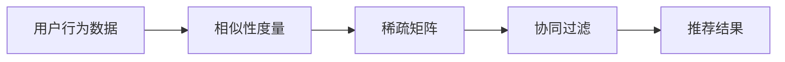

                 

# AI协同过滤算法在电商中的应用

## 1. 背景介绍

随着电商行业的迅猛发展，电商平台需要处理海量用户数据和交易数据，并从中挖掘用户行为模式和商品特征，以便个性化推荐商品，提升用户体验和销售额。传统的电商推荐系统主要依赖基于内容的过滤算法，如基于模型的协同过滤、基于知识图的推荐、基于深度学习的推荐等。但这些方法普遍存在数据稀疏性高、计算复杂度高、推荐效果不稳定等问题。

为了提升推荐系统的效果和效率，基于用户行为数据的协同过滤算法应运而生。协同过滤算法通过分析用户之间的相似性和商品之间的相似性，为用户推荐与之兴趣相似的商品，从而大幅提升推荐的准确性和多样性。协同过滤算法在电商中得到广泛应用，如淘宝、亚马逊、京东等电商平台均采用了协同过滤推荐技术。

## 2. 核心概念与联系

### 2.1 核心概念概述

为了更好地理解AI协同过滤算法在电商中的应用，我们首先介绍几个关键概念：

- **协同过滤算法(Collaborative Filtering, CF)**：一种基于用户行为数据的推荐算法，通过分析用户历史行为，找到兴趣相似的用户或商品，为当前用户推荐相似的商品。协同过滤算法主要包括基于用户的协同过滤和基于物品的协同过滤两种类型。
- **用户行为数据(User Behavior Data)**：用户在电商平台上的行为记录，如浏览历史、点击记录、购买记录、评分等，是协同过滤算法的训练数据来源。
- **相似性度量(Similarity Metric)**：用于衡量用户或商品之间的相似性，是协同过滤算法的核心指标。常见的相似性度量方法包括余弦相似度、皮尔逊相关系数、Jaccard系数等。
- **稀疏矩阵(Sparse Matrix)**：由于用户行为数据通常高度稀疏，协同过滤算法需要将其转化为矩阵形式进行计算。
- **增量更新(Online Learning)**：为实时处理新数据并保持推荐系统性能稳定，协同过滤算法需要具备在线学习的能力，支持动态更新用户兴趣和商品特征。

这些核心概念之间存在密切联系，共同构成了协同过滤算法在电商中应用的理论基础。

### 2.2 核心概念原理和架构的 Mermaid 流程图



这个流程图展示了协同过滤算法的基本流程：首先对用户行为数据进行预处理，将用户-商品交互矩阵转化为稀疏矩阵。然后利用相似性度量方法计算用户和商品的相似性，并进行协同过滤计算。最终得到推荐结果，供用户浏览和选择。

## 3. 核心算法原理 & 具体操作步骤

### 3.1 算法原理概述

协同过滤算法的核心思想是通过分析用户历史行为数据，为用户推荐相似的商品。基于用户行为数据的协同过滤算法通常包括两个步骤：

1. **相似性计算**：通过用户或商品的相似性度量，找到与当前用户兴趣相似的用户或商品。
2. **推荐计算**：利用相似性结果，为用户推荐与兴趣相似的商品。

协同过滤算法的主要优点包括：
- 利用用户行为数据进行推荐，自然、高效。
- 通过用户之间的协同过滤，发掘用户潜在的兴趣。
- 不需要对商品进行详细特征抽取，适用范围广泛。

但协同过滤算法也存在一些缺点：
- 数据稀疏性高，可能导致推荐效果不稳定。
- 不具备跨用户和跨商品的特征建模能力。
- 计算复杂度较高，大规模数据集上的处理效率较低。

### 3.2 算法步骤详解

以下我们将以基于用户的协同过滤算法为例，详细介绍其具体步骤：

**Step 1: 数据预处理**

- 收集用户行为数据，如用户的浏览历史、点击记录、购买记录、评分等。
- 构建用户-商品交互矩阵 $U \in \mathbb{R}^{N \times M}$，其中 $N$ 为用户数，$M$ 为商品数，$U_{ij} = 1$ 表示用户 $i$ 对商品 $j$ 的交互行为。

**Step 2: 构建相似性矩阵**

- 计算用户之间的相似性矩阵 $S \in \mathbb{R}^{N \times N}$，采用余弦相似度、皮尔逊相关系数等方法。
- 将用户-商品交互矩阵与相似性矩阵进行矩阵乘法，得到用户-商品推荐矩阵 $R \in \mathbb{R}^{N \times M}$。

**Step 3: 推荐计算**

- 对推荐矩阵 $R$ 进行归一化处理，使得每行向量的范数为1。
- 计算当前用户 $i$ 的兴趣向量 $u_i \in \mathbb{R}^M$。
- 利用归一化推荐矩阵 $R$ 和用户兴趣向量 $u_i$，计算当前用户对每个商品的推荐分数 $r_{ij}$。
- 根据推荐分数排序，选择高分商品推荐给用户。

### 3.3 算法优缺点

协同过滤算法具有以下优点：
- 利用用户行为数据进行推荐，自然、高效。
- 通过用户之间的协同过滤，发掘用户潜在的兴趣。
- 不需要对商品进行详细特征抽取，适用范围广泛。

但协同过滤算法也存在一些缺点：
- 数据稀疏性高，可能导致推荐效果不稳定。
- 不具备跨用户和跨商品的特征建模能力。
- 计算复杂度较高，大规模数据集上的处理效率较低。

### 3.4 算法应用领域

协同过滤算法在电商中得到广泛应用，具体如下：

- **商品推荐**：根据用户的历史行为数据，推荐用户可能感兴趣的商品。
- **活动推荐**：为用户推荐最新的促销活动，提升用户购买欲望。
- **个性化推荐系统**：结合其他推荐算法，提升推荐系统的综合效果。
- **搜索排序**：优化搜索结果排序，提升用户搜索体验。
- **广告投放**：根据用户兴趣，定向投放广告，提高广告转化率。

## 4. 数学模型和公式 & 详细讲解 & 举例说明

### 4.1 数学模型构建

基于用户的协同过滤算法可以表示为如下数学模型：

- 用户行为矩阵 $U \in \mathbb{R}^{N \times M}$，其中 $U_{ij} = 1$ 表示用户 $i$ 对商品 $j$ 的交互行为。
- 用户之间的相似性矩阵 $S \in \mathbb{R}^{N \times N}$，采用余弦相似度、皮尔逊相关系数等方法。
- 用户-商品推荐矩阵 $R \in \mathbb{R}^{N \times M}$，定义为 $R = U \times S$。
- 用户兴趣向量 $u_i \in \mathbb{R}^M$，定义为 $u_i = \frac{R_i}{||R_i||_2}$。
- 当前用户对每个商品的推荐分数 $r_{ij}$，定义为 $r_{ij} = u_i \times R_j$。

### 4.2 公式推导过程

下面详细推导基于用户的协同过滤算法公式。

假设用户行为矩阵 $U = [U_{i,j}]$，用户-商品推荐矩阵 $R = [R_{i,j}]$，用户兴趣向量 $u_i = [u_{i,1}, u_{i,2}, ..., u_{i,M}]$。则推荐分数 $r_{ij}$ 的计算公式为：

$$
r_{ij} = \sum_{k=1}^{M} u_{i,k} \times R_{k,j}
$$

其中 $u_{i,k}$ 表示用户 $i$ 对第 $k$ 个商品的兴趣度，$R_{k,j}$ 表示商品 $j$ 在第 $k$ 个商品上的评分。

### 4.3 案例分析与讲解

假设有一个用户 $i$，他曾经浏览了商品 $j_1, j_2, j_3, ..., j_n$。根据用户行为矩阵 $U$ 和相似性矩阵 $S$，我们可以计算出用户 $i$ 的推荐矩阵 $R$，并得到用户 $i$ 对每个商品的兴趣向量 $u_i$ 和推荐分数 $r_{ij}$。

例如，用户 $i$ 的推荐矩阵 $R$ 可能如下：

```
|         | j1 | j2 | j3 | ... | jn |
|---------|----|----|----|-----|----|
| U_{i,1} | 1  | 0  | 0  | ... | 0  |
| U_{i,2} | 0  | 1  | 0  | ... | 0  |
| U_{i,3} | 0  | 0  | 1  | ... | 0  |
| ...     | ...| ...| ...| ... | ...|
| U_{i,n} | 0  | 0  | 0  | ... | 1  |
```

如果用户 $i$ 与用户 $i'$ 的相似性矩阵 $S$ 为：

```
|        | i1 | i2 | i3 | ... | in |
|--------|----|----|----|-----|----|
| i'     | s1 | s2 | s3 | ... | sn |
```

则用户 $i$ 对商品 $j_1$ 的推荐分数为：

$$
r_{i1} = \frac{1 \times s1 + 0 \times s2 + 0 \times s3 + ... + 0 \times sn}{\sqrt{1^2 + 0^2 + 0^2 + ... + 0^2 + \sqrt{1^2 + 0^2 + 0^2 + ... + 0^2 + sn^2}}
$$

这里假设用户 $i$ 与用户 $i'$ 的相似性为 $s1 = 1$，其他用户均与 $i$ 不相似，即 $s2, s3, ..., sn = 0$。

## 5. 项目实践：代码实例和详细解释说明

### 5.1 开发环境搭建

在进行协同过滤算法在电商中的应用实践前，我们需要准备好开发环境。以下是使用Python进行Pandas、Numpy和Scikit-learn开发的环境配置流程：

1. 安装Anaconda：从官网下载并安装Anaconda，用于创建独立的Python环境。

2. 创建并激活虚拟环境：
```bash
conda create -n recsys-env python=3.8 
conda activate recsys-env
```

3. 安装相关库：
```bash
conda install pandas numpy scikit-learn matplotlib
```

完成上述步骤后，即可在`recsys-env`环境中开始协同过滤算法的应用实践。

### 5.2 源代码详细实现

这里我们以基于用户的协同过滤算法为例，给出使用Pandas和Scikit-learn进行用户行为数据处理和推荐系统开发的代码实现。

```python
import pandas as pd
import numpy as np
from sklearn.metrics.pairwise import cosine_similarity

# 读取用户行为数据
user_data = pd.read_csv('user_behavior.csv')

# 构建用户-商品交互矩阵
U = user_data[['user_id', 'item_id']].pivot_table(values=1, index='user_id', columns='item_id', aggfunc='sum').fillna(0).astype(int)

# 计算用户之间的相似性矩阵
S = cosine_similarity(U)

# 计算用户-商品推荐矩阵
R = U @ S

# 计算当前用户对每个商品的推荐分数
user_id = 1
user_data['r_score'] = R[user_id] * S[user_id]

# 计算用户兴趣向量
user_data['u_score'] = R[user_id] / np.linalg.norm(R[user_id])

# 根据推荐分数排序，选择高分商品推荐给用户
recommended_items = user_data.sort_values(by='r_score', ascending=False).head(10)['item_id'].tolist()

print(recommended_items)
```

### 5.3 代码解读与分析

让我们再详细解读一下关键代码的实现细节：

**读取用户行为数据**：
- 使用Pandas库读取用户行为数据，包含用户ID和商品ID。

**构建用户-商品交互矩阵**：
- 使用Pandas的pivot_table函数，将用户ID和商品ID进行交叉表汇总，构建用户-商品交互矩阵 $U$。
- 使用fillna和astype函数，将缺失值替换为0，并将数据类型转换为整数。

**计算用户之间的相似性矩阵**：
- 使用Scikit-learn的cosine_similarity函数，计算用户之间的余弦相似度矩阵 $S$。

**计算用户-商品推荐矩阵**：
- 使用矩阵乘法计算用户-商品推荐矩阵 $R$，得到用户对每个商品的推荐分数。

**计算当前用户对每个商品的推荐分数**：
- 根据用户行为数据和相似性矩阵，计算当前用户对每个商品的推荐分数。

**计算用户兴趣向量**：
- 计算用户兴趣向量 $u_i$，将推荐矩阵 $R$ 标准化，计算用户兴趣向量。

**根据推荐分数排序，选择高分商品推荐给用户**：
- 对推荐分数进行排序，选择高分商品推荐给用户。

可以看到，利用Pandas和Scikit-learn，可以很方便地实现基于用户的协同过滤算法，完成用户行为数据处理和推荐系统开发。

## 6. 实际应用场景

### 6.1 智能推荐系统

基于协同过滤算法的智能推荐系统，可以广泛应用于电商平台，为用户推荐感兴趣的商品。例如，淘宝的“每日必买推荐”、亚马逊的“推荐商品”等功能，都是基于协同过滤算法的推荐系统。

在技术实现上，可以收集用户的历史行为数据，如浏览历史、点击记录、购买记录、评分等。将这些数据构建成用户-商品交互矩阵 $U$，并利用余弦相似度等方法计算用户之间的相似性矩阵 $S$。在此基础上计算用户-商品推荐矩阵 $R$，并根据用户兴趣向量 $u_i$ 和推荐分数 $r_{ij}$，为用户推荐高分商品。

### 6.2 个性化广告投放

个性化广告投放也是协同过滤算法的重要应用场景。通过分析用户的历史行为数据，可以精准定位用户兴趣，进行定向广告投放。例如，淘宝可以基于用户的购物记录，向用户推荐相关商品的同时，投放相应的广告。

在技术实现上，可以构建用户-商品交互矩阵 $U$，并利用协同过滤算法计算用户之间的相似性矩阵 $S$。在此基础上，结合广告数据，计算用户对每个广告的推荐分数 $r_{ij}$。最后，根据推荐分数排序，选择高分广告投放给用户。

### 6.3 用户画像构建

用户画像构建是电商平台的常见需求。通过协同过滤算法，可以获取用户的历史行为数据，并根据用户对不同商品的行为数据，构建用户画像。例如，可以根据用户的购物记录，构建用户的兴趣偏好、消费能力等信息。

在技术实现上，可以构建用户-商品交互矩阵 $U$，并利用协同过滤算法计算用户之间的相似性矩阵 $S$。在此基础上，计算用户对每个商品的推荐分数 $r_{ij}$，并将推荐分数进行聚合，得到用户画像。

### 6.4 未来应用展望

随着协同过滤算法的发展，未来其在电商领域的应用前景广阔。以下列举几个未来可能的应用场景：

- **多维度推荐**：结合基于内容的过滤算法和其他推荐算法，提升推荐系统的综合效果。
- **实时推荐**：结合增量学习技术，实现实时动态推荐，满足用户实时需求。
- **跨平台推荐**：结合用户在不同平台上的行为数据，构建统一的推荐模型，提升推荐效果。
- **推荐算法融合**：结合混合推荐算法，如基于知识的推荐、基于深度学习的推荐等，提升推荐系统的综合效果。
- **个性化用户画像**：结合用户画像构建算法，构建更加全面、精细的用户画像，提升用户满意度。

## 7. 工具和资源推荐

### 7.1 学习资源推荐

为了帮助开发者系统掌握协同过滤算法在电商中的应用，这里推荐一些优质的学习资源：

1. 《推荐系统实战》书籍：介绍了推荐系统的发展历史、算法原理、应用场景等内容，适合初学者入门。
2. KDD Cup 2020推荐系统竞赛：包含推荐系统竞赛的代码和论文，可以帮助开发者了解前沿算法和实现细节。
3. Coursera《Recommender Systems》课程：斯坦福大学开设的推荐系统课程，详细讲解了推荐系统的前沿理论和算法实现。
4. Arxiv上的相关论文：如《Collaborative Filtering for Implicit Feedback Datasets》、《A Scalable and Accurate Recommendation System》等，可以了解最新算法进展。
5. 书籍《Python推荐系统实践》：介绍了推荐系统开发的Python实现方法和工具，适合开发者实践。

通过对这些资源的学习实践，相信你一定能够快速掌握协同过滤算法在电商中的应用，并用于解决实际的推荐问题。

### 7.2 开发工具推荐

高效的开发离不开优秀的工具支持。以下是几款用于协同过滤算法在电商中的应用开发的常用工具：

1. Pandas：基于Python的数据分析库，支持高效的数据处理和分析。
2. Numpy：基于Python的科学计算库，支持高效的数值计算。
3. Scikit-learn：基于Python的机器学习库，支持常见的推荐算法实现。
4. TensorBoard：TensorFlow配套的可视化工具，可实时监测模型训练状态，并提供丰富的图表呈现方式。
5. Weights & Biases：模型训练的实验跟踪工具，可以记录和可视化模型训练过程中的各项指标。

合理利用这些工具，可以显著提升协同过滤算法在电商中的应用开发效率，加快创新迭代的步伐。

### 7.3 相关论文推荐

协同过滤算法的发展源于学界的持续研究。以下是几篇奠基性的相关论文，推荐阅读：

1. Singular Value Decomposition for Collaborative Filtering（矩阵分解算法）：提出了基于SVD的协同过滤算法，是协同过滤算法的经典方法之一。
2. Matrix Factorization Techniques for Recommender Systems（矩阵分解技术）：详细介绍了矩阵分解算法在推荐系统中的应用。
3. Using the Alternating Least Squares Algorithm for Collaborative Filtering（交替最小二乘算法）：介绍了交替最小二乘算法在协同过滤中的应用。
4. Factorization Machines for Recommender Systems（因子化机器算法）：提出了因子化机器算法，进一步提升了协同过滤算法的性能。
5. Deep Collaborative Filtering with Neural Network Models（深度协同过滤算法）：介绍了深度学习在协同过滤中的应用，如基于CNN、RNN等模型的推荐系统。

这些论文代表了大协同过滤算法的发展脉络。通过学习这些前沿成果，可以帮助研究者把握学科前进方向，激发更多的创新灵感。

## 8. 总结：未来发展趋势与挑战

### 8.1 总结

本文对基于协同过滤算法在电商中的应用进行了全面系统的介绍。首先阐述了协同过滤算法的背景和意义，明确了协同过滤算法在电商推荐系统中的应用价值。其次，从原理到实践，详细讲解了协同过滤算法的数学模型和关键步骤，给出了协同过滤算法在电商中的完整代码实现。同时，本文还广泛探讨了协同过滤算法在智能推荐、个性化广告、用户画像构建等多个领域的应用前景，展示了协同过滤算法的广泛潜力。此外，本文精选了协同过滤算法的各类学习资源，力求为读者提供全方位的技术指引。

通过本文的系统梳理，可以看到，基于协同过滤算法的推荐技术在电商中得到了广泛应用，极大地提升了用户购物体验和电商平台销售额。协同过滤算法以其高效、自然、灵活的特点，成为电商推荐系统中的重要手段。未来，伴随协同过滤算法和推荐系统的不断发展，相信电商推荐技术将更上一层楼，为电商行业带来更深刻的变革。

### 8.2 未来发展趋势

展望未来，协同过滤算法在电商中可能呈现以下几个发展趋势：

1. **多维度推荐**：结合基于内容的过滤算法和其他推荐算法，提升推荐系统的综合效果。
2. **实时推荐**：结合增量学习技术，实现实时动态推荐，满足用户实时需求。
3. **跨平台推荐**：结合用户在不同平台上的行为数据，构建统一的推荐模型，提升推荐效果。
4. **推荐算法融合**：结合混合推荐算法，如基于知识的推荐、基于深度学习的推荐等，提升推荐系统的综合效果。
5. **个性化用户画像**：结合用户画像构建算法，构建更加全面、精细的用户画像，提升用户满意度。

### 8.3 面临的挑战

尽管协同过滤算法在电商中取得了不俗的效果，但在迈向更加智能化、普适化应用的过程中，它仍面临着诸多挑战：

1. **数据稀疏性问题**：协同过滤算法在处理高稀疏数据时，可能出现推荐效果不稳定的情况。如何解决数据稀疏性问题，提升推荐效果，是亟待解决的问题。
2. **计算复杂度问题**：协同过滤算法的计算复杂度较高，在大规模数据集上的处理效率较低。如何优化算法计算复杂度，提高推荐系统性能，是未来需要突破的方向。
3. **用户隐私问题**：协同过滤算法需要收集用户行为数据，涉及用户隐私保护问题。如何在保障用户隐私的前提下，利用用户行为数据进行推荐，是协同过滤算法面临的重要挑战。
4. **模型可解释性问题**：协同过滤算法的黑盒性质使得推荐系统缺乏可解释性，用户难以理解和信任推荐结果。如何提升推荐模型的可解释性，是未来需要解决的问题。
5. **推荐公平性问题**：协同过滤算法可能存在推荐公平性问题，如长尾商品推荐不足、新商品推荐难等问题。如何提升推荐系统的公平性，是未来需要解决的问题。

### 8.4 研究展望

面对协同过滤算法面临的种种挑战，未来的研究需要在以下几个方面寻求新的突破：

1. **混合推荐算法**：结合基于内容的过滤算法、基于深度学习的推荐算法等，提升推荐系统的综合效果。
2. **增量学习算法**：结合增量学习技术，实现实时动态推荐，满足用户实时需求。
3. **跨平台推荐算法**：结合用户在不同平台上的行为数据，构建统一的推荐模型，提升推荐效果。
4. **推荐算法优化**：优化协同过滤算法的计算复杂度，提升推荐系统性能。
5. **用户画像构建算法**：结合用户画像构建算法，构建更加全面、精细的用户画像，提升用户满意度。

这些研究方向的探索，必将引领协同过滤算法在电商中的应用走向更高的台阶，为电商行业带来更深刻的变革。相信随着学界和产业界的共同努力，协同过滤算法必将在电商推荐系统中发挥更大的作用。

## 9. 附录：常见问题与解答

**Q1：协同过滤算法是否适用于所有电商场景？**

A: 协同过滤算法在电商中得到广泛应用，但并不适用于所有场景。例如，对于高度个性化的推荐任务，如高端商品推荐，可能需要结合基于内容的过滤算法，提升推荐效果。对于需要跨平台推荐的场景，如社交电商推荐，协同过滤算法需要进行跨平台数据融合。

**Q2：协同过滤算法的推荐效果是否稳定？**

A: 协同过滤算法在处理高稀疏数据时，可能出现推荐效果不稳定的情况。解决方法包括矩阵分解、低秩矩阵分解、奇异值分解等。

**Q3：如何提升协同过滤算法的计算效率？**

A: 可以使用增量学习算法，如在线协同过滤算法，实现实时动态推荐。同时，可以优化算法计算复杂度，采用并行计算等技术，提升推荐系统性能。

**Q4：协同过滤算法是否具备跨平台推荐能力？**

A: 协同过滤算法可以结合用户在不同平台上的行为数据，构建统一的推荐模型。但跨平台数据融合可能需要处理不同平台的数据格式和语义差异，需要根据具体场景进行优化。

**Q5：如何保障用户隐私？**

A: 在协同过滤算法中，需要采用匿名化、数据脱敏等技术，保护用户隐私。同时，需要对用户行为数据进行加权处理，提升推荐系统的公平性和可靠性。

这些常见问题及其解答，可以帮助开发者更好地理解协同过滤算法在电商中的应用，解决实际问题。

---

作者：禅与计算机程序设计艺术 / Zen and the Art of Computer Programming

