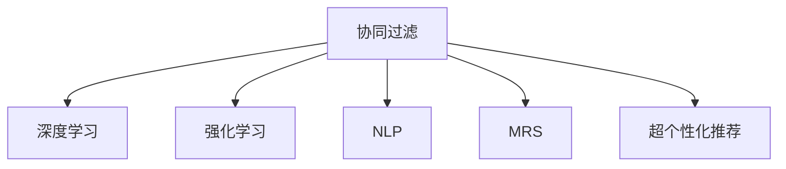

                 

# AI在个性化推荐中的创新应用

> 关键词：个性化推荐,协同过滤,深度学习,强化学习,自然语言处理(NLP),多模态推荐系统,超个性化推荐

## 1. 背景介绍

### 1.1 问题由来

随着互联网的快速发展，个性化推荐系统成为了电商、新闻、社交、视频等多个领域的核心引擎，极大地提升了用户体验和系统价值。传统的推荐系统主要基于协同过滤、深度学习等技术，通过分析用户历史行为和物品特征，预测用户可能感兴趣的内容。然而，这种方法存在数据稀疏性、冷启动等问题，无法精准捕捉用户多样化的需求。

为了应对这些挑战，AI技术被引入个性化推荐系统中，通过深度学习、强化学习等先进算法，更深入地理解用户的多样需求和行为模式，从而提供更加精准和个性化的推荐内容。AI技术的引入，不仅提升了推荐系统的质量和用户体验，也拓展了推荐系统的应用场景，如图书、音乐、视频、旅游等。

### 1.2 问题核心关键点

AI技术在个性化推荐中的应用，主要集中在以下几个方面：

- 协同过滤：通过用户历史行为和物品特征计算相似度，发现与当前用户兴趣相似的其他用户或物品，进行推荐。
- 深度学习：利用深度神经网络模型，直接学习用户和物品的潜在表示，发现更深入的用户和物品关系。
- 强化学习：通过模拟用户与推荐系统交互，通过优化奖励机制学习最佳推荐策略。
- 自然语言处理(NLP)：利用NLP技术，提取用户输入的文本信息，理解用户需求和偏好。
- 多模态推荐系统：将不同模态的信息（如文本、图像、音频等）进行融合，提供多维度的推荐服务。
- 超个性化推荐：通过构建用户画像，结合上下文信息，提供极致个性化的推荐。

这些关键技术的应用，使得推荐系统能够更加智能、动态地适应用户需求，大幅提升了用户的满意度和系统的商业价值。

## 2. 核心概念与联系

### 2.1 核心概念概述

为更好地理解AI技术在个性化推荐中的应用，本节将介绍几个密切相关的核心概念：

- 协同过滤(Collaborative Filtering, CF)：通过用户历史行为和物品特征计算相似度，进行推荐。CF分为基于用户的CF和基于物品的CF两种。
- 深度学习(Deep Learning, DL)：通过多层神经网络模型，直接学习用户和物品的潜在表示，发现更深层次的关系。
- 强化学习(Reinforcement Learning, RL)：通过与环境的交互，学习最优的推荐策略，最大化奖励。
- 自然语言处理(NLP)：通过提取和分析用户输入的文本信息，理解用户需求和偏好。
- 多模态推荐系统(Multimodal Recommendation System, MRS)：将不同模态的信息（如文本、图像、音频等）进行融合，提供多维度的推荐服务。
- 超个性化推荐(Hyper-Personalization)：通过构建用户画像，结合上下文信息，提供极致个性化的推荐。

这些核心概念之间的逻辑关系可以通过以下Mermaid流程图来展示：



这个流程图展示了一组关键技术的交互关系：

1. 协同过滤通过用户行为和物品特征计算相似度，是推荐系统的基本手段。
2. 深度学习通过神经网络模型，学习用户和物品的深层次关系。
3. 强化学习通过模拟用户交互，优化推荐策略，最大化系统收益。
4. NLP通过文本处理，提取用户需求。
5. 多模态推荐系统融合不同模态信息，提供更多维度的推荐。
6. 超个性化推荐结合用户画像和上下文信息，提供极致个性化的推荐。

这些技术相互补充，共同构成了个性化推荐系统的核心架构，使其能够灵活适应不同用户的需求。

## 3. 核心算法原理 & 具体操作步骤

### 3.1 算法原理概述

AI技术在个性化推荐中的核心算法，主要包括协同过滤、深度学习、强化学习和自然语言处理(NLP)。下面将详细介绍这些算法的工作原理和操作步骤。

#### 3.1.1 协同过滤算法

协同过滤通过用户历史行为和物品特征计算相似度，发现与当前用户兴趣相似的其他用户或物品，进行推荐。基于用户的CF方法，通过计算用户之间的相似度，推荐与目标用户相似的其他用户喜欢的物品；基于物品的CF方法，通过计算物品之间的相似度，推荐与目标物品相似的其他物品喜欢的用户。

协同过滤的步骤如下：
1. 收集用户和物品的评分数据，形成用户-物品评分矩阵。
2. 计算用户和物品的相似度，可以通过余弦相似度、皮尔逊相关系数等方法。
3. 将相似度应用于用户-物品评分矩阵，进行矩阵分解。
4. 使用分解后的矩阵，预测用户对未评分物品的评分。
5. 根据评分结果进行推荐。

#### 3.1.2 深度学习算法

深度学习算法通过多层神经网络模型，直接学习用户和物品的潜在表示，发现更深层次的关系。常见的深度学习模型包括基于矩阵分解的模型（如SVD、ALS等）、基于神经网络的模型（如DNN、RNN、CNN等）。

深度学习算法的操作步骤如下：
1. 收集用户和物品的评分数据，形成用户-物品评分矩阵。
2. 将评分矩阵作为输入，通过神经网络模型进行特征提取。
3. 将提取的特征进行非线性变换，得到用户和物品的潜在表示。
4. 通过损失函数，优化模型参数。
5. 使用优化后的模型进行推荐。

#### 3.1.3 强化学习算法

强化学习算法通过与环境的交互，学习最优的推荐策略，最大化奖励。常见的强化学习模型包括Q-learning、SARSA、Deep Q-Network(DQN)等。

强化学习算法的操作步骤如下：
1. 定义推荐系统的状态和动作，状态为用户和物品的状态，动作为用户选择的物品。
2. 设计奖励函数，如点击率、购买率等。
3. 使用强化学习算法，如Q-learning、DQN等，学习最优的推荐策略。
4. 通过策略优化，进行推荐。

#### 3.1.4 自然语言处理(NLP)算法

自然语言处理(NLP)算法通过提取和分析用户输入的文本信息，理解用户需求和偏好。常见的NLP模型包括文本分类、情感分析、意图识别等。

NLP算法的操作步骤如下：
1. 收集用户输入的文本数据。
2. 将文本数据进行预处理，如分词、去除停用词等。
3. 使用NLP模型，如LSTM、BERT等，提取文本特征。
4. 通过特征融合，将NLP特征与其他特征进行结合。
5. 使用机器学习算法，如SVM、XGBoost等，进行推荐。

### 3.2 算法步骤详解

#### 3.2.1 协同过滤步骤详解

基于用户的CF算法，步骤如下：
1. 收集用户-物品评分数据，形成用户-物品评分矩阵 $R$。
2. 计算用户之间的相似度矩阵 $U$，可以使用余弦相似度、皮尔逊相关系数等方法。
3. 将相似度矩阵 $U$ 与评分矩阵 $R$ 相乘，得到用户-物品预测矩阵 $\hat{R}$。
4. 将预测矩阵 $\hat{R}$ 转换为推荐矩阵 $P$，进行推荐。

基于物品的CF算法，步骤如下：
1. 收集用户-物品评分数据，形成用户-物品评分矩阵 $R$。
2. 计算物品之间的相似度矩阵 $I$，可以使用余弦相似度、皮尔逊相关系数等方法。
3. 将相似度矩阵 $I$ 与评分矩阵 $R$ 相乘，得到物品-用户预测矩阵 $\hat{R}$。
4. 将预测矩阵 $\hat{R}$ 转换为推荐矩阵 $P$，进行推荐。

#### 3.2.2 深度学习步骤详解

常见的深度学习模型包括DNN、RNN、CNN等。这里以DNN为例，详细介绍操作步骤：
1. 收集用户和物品的评分数据，形成用户-物品评分矩阵 $R$。
2. 将评分矩阵 $R$ 作为输入，通过多层神经网络模型进行特征提取。
3. 将提取的特征进行非线性变换，得到用户和物品的潜在表示 $Z$。
4. 通过损失函数，优化模型参数。
5. 使用优化后的模型进行推荐。

#### 3.2.3 强化学习步骤详解

这里以DQN算法为例，详细介绍操作步骤：
1. 定义推荐系统的状态和动作，状态为用户和物品的状态，动作为用户选择的物品。
2. 设计奖励函数，如点击率、购买率等。
3. 使用DQN算法，学习最优的推荐策略。
4. 通过策略优化，进行推荐。

#### 3.2.4 NLP步骤详解

这里以情感分析为例，详细介绍操作步骤：
1. 收集用户输入的文本数据。
2. 将文本数据进行预处理，如分词、去除停用词等。
3. 使用情感分析模型，如BERT、LSTM等，提取文本情感特征。
4. 将情感特征与其他特征进行融合，如用户行为、物品特征等。
5. 使用机器学习算法，如SVM、XGBoost等，进行推荐。

### 3.3 算法优缺点

AI技术在个性化推荐中的应用，具有以下优点：
1. 精准度较高：深度学习和强化学习算法能够深入挖掘用户和物品之间的关系，提高推荐精度。
2. 可扩展性较好：基于深度学习的多模态推荐系统能够融合不同模态的信息，提供更加多样化的推荐。
3. 鲁棒性较好：通过用户画像和上下文信息，超个性化推荐能够适应不同用户的个性化需求，提高推荐系统的鲁棒性。

但这些算法也存在一些局限性：
1. 数据需求较大：深度学习算法和强化学习算法需要大量数据进行训练，对于新用户的冷启动问题，推荐效果较差。
2. 计算复杂度较高：深度学习算法和强化学习算法计算复杂度高，需要强大的计算资源。
3. 可解释性较差：深度学习算法和强化学习算法往往被视为"黑盒"系统，难以解释其内部工作机制和决策逻辑。

尽管存在这些局限性，但AI技术的引入使得个性化推荐系统能够更好地适应用户需求，提升用户体验和系统价值。

### 3.4 算法应用领域

AI技术在个性化推荐中的应用，已经广泛应用于电商、新闻、社交、视频等多个领域，具体如下：

#### 3.4.1 电商推荐

电商推荐系统通过AI技术，能够根据用户的浏览、购买、搜索等行为，提供个性化推荐商品。常见的电商推荐系统包括淘宝、京东、亚马逊等，利用协同过滤、深度学习等技术，提升推荐效果和用户体验。

#### 3.4.2 新闻推荐

新闻推荐系统通过AI技术，能够根据用户的阅读历史和兴趣，推荐相关的新闻内容。常见的推荐系统包括今日头条、腾讯新闻、搜狐新闻等，利用协同过滤、深度学习等技术，提升推荐效果和用户满意度。

#### 3.4.3 社交推荐

社交推荐系统通过AI技术，能够根据用户的社交关系和行为，推荐相关的朋友和内容。常见的社交推荐系统包括微信、微博、抖音等，利用深度学习、强化学习等技术，提升推荐效果和用户黏性。

#### 3.4.4 视频推荐

视频推荐系统通过AI技术，能够根据用户的观看历史和兴趣，推荐相关的视频内容。常见的推荐系统包括YouTube、爱奇艺、腾讯视频等，利用协同过滤、深度学习等技术，提升推荐效果和用户满意度。

## 4. 数学模型和公式 & 详细讲解 & 举例说明

### 4.1 数学模型构建

#### 4.1.1 协同过滤模型

协同过滤模型通过用户历史行为和物品特征计算相似度，进行推荐。假设用户集合为 $U$，物品集合为 $I$，用户-物品评分矩阵为 $R$，用户相似度矩阵为 $U$，物品相似度矩阵为 $I$。

协同过滤的目标是最大化用户-物品评分矩阵 $R$ 和相似度矩阵 $U$ 或 $I$ 的乘积，即：
$$
R' = U \times R \quad \text{或} \quad I \times R
$$
推荐矩阵 $P$ 为 $R'$ 的非负截断矩阵，即：
$$
P = \text{Truncate}(R')
$$
其中，$\text{Truncate}(x)$ 表示对矩阵 $x$ 进行非负截断，即保证矩阵中的每个元素都为非负数。

#### 4.1.2 深度学习模型

深度学习模型通过多层神经网络模型，直接学习用户和物品的潜在表示，进行推荐。假设用户-物品评分矩阵为 $R$，用户特征向量为 $U$，物品特征向量为 $V$，深度学习模型的目标是最小化损失函数 $L$，即：
$$
L = \frac{1}{2N} \sum_{i=1}^N \sum_{j=1}^M (y_{ij} - \hat{y}_{ij})^2
$$
其中，$y_{ij}$ 表示用户 $i$ 对物品 $j$ 的真实评分，$\hat{y}_{ij}$ 表示用户 $i$ 对物品 $j$ 的预测评分，$N$ 表示用户数量，$M$ 表示物品数量。

深度学习模型的损失函数通常使用均方误差损失函数，即：
$$
L = \frac{1}{2N} \sum_{i=1}^N \sum_{j=1}^M (y_{ij} - \hat{y}_{ij})^2
$$

#### 4.1.3 强化学习模型

强化学习模型通过与环境的交互，学习最优的推荐策略，进行推荐。假设用户集合为 $U$，物品集合为 $I$，用户状态集合为 $S$，物品状态集合为 $A$，状态到动作映射为 $Q$，状态到奖励函数映射为 $R$，策略为 $\pi$。

强化学习模型的目标是最小化期望奖励函数 $J$，即：
$$
J = \mathbb{E}_{s,a}[\sum_{t=1}^T r_{t}^{(s,a)}]
$$
其中，$r_{t}^{(s,a)}$ 表示在第 $t$ 时刻，状态为 $s$，动作为 $a$ 的奖励函数，$T$ 表示交互次数。

强化学习模型的策略优化通常使用Q-learning、SARSA等方法，具体步骤如下：
1. 收集用户行为数据，形成状态-动作-奖励矩阵 $Q$。
2. 使用Q-learning等方法，学习最优的推荐策略 $\pi$。
3. 通过策略优化，进行推荐。

#### 4.1.4 NLP模型

NLP模型通过提取和分析用户输入的文本信息，进行推荐。假设用户输入的文本为 $X$，用户-物品评分矩阵为 $R$，NLP模型为 $F$，用户-物品评分向量为 $r$，用户-物品特征向量为 $x$。

NLP模型的目标是最小化损失函数 $L$，即：
$$
L = \frac{1}{2N} \sum_{i=1}^N (r_{i} - \hat{r}_{i})^2
$$
其中，$r_{i}$ 表示用户 $i$ 对物品的评分，$\hat{r}_{i}$ 表示用户 $i$ 对物品的预测评分。

NLP模型的损失函数通常使用均方误差损失函数，即：
$$
L = \frac{1}{2N} \sum_{i=1}^N (r_{i} - \hat{r}_{i})^2
$$

### 4.2 公式推导过程

#### 4.2.1 协同过滤公式推导

协同过滤算法中，用户相似度矩阵 $U$ 的计算公式为：
$$
U_{ij} = \frac{a_{ij}}{||a_{i}|| \cdot ||a_{j}||}
$$
其中，$a_{ij}$ 表示用户 $i$ 和用户 $j$ 之间的余弦相似度，$||a_{i}||$ 和 $||a_{j}||$ 表示用户 $i$ 和用户 $j$ 的特征向量的模长。

物品相似度矩阵 $I$ 的计算公式为：
$$
I_{ij} = \frac{b_{ij}}{||b_{i}|| \cdot ||b_{j}||}
$$
其中，$b_{ij}$ 表示物品 $i$ 和物品 $j$ 之间的余弦相似度，$||b_{i}||$ 和 $||b_{j}||$ 表示物品 $i$ 和物品 $j$ 的特征向量的模长。

用户-物品评分矩阵 $R'$ 的计算公式为：
$$
R'_{ij} = a_{ij}r_{ij}
$$
其中，$a_{ij}$ 表示用户 $i$ 和用户 $j$ 之间的相似度，$r_{ij}$ 表示用户 $i$ 对物品 $j$ 的评分。

推荐矩阵 $P$ 的计算公式为：
$$
P_{ij} = \text{Truncate}(R')
$$
其中，$\text{Truncate}(x)$ 表示对矩阵 $x$ 进行非负截断，即保证矩阵中的每个元素都为非负数。

#### 4.2.2 深度学习公式推导

深度学习算法中，用户和物品的潜在表示 $Z$ 的计算公式为：
$$
Z = \text{FCN}(R)
$$
其中，$\text{FCN}$ 表示多层神经网络模型，$R$ 表示用户-物品评分矩阵。

深度学习模型的损失函数通常使用均方误差损失函数，即：
$$
L = \frac{1}{2N} \sum_{i=1}^N \sum_{j=1}^M (y_{ij} - \hat{y}_{ij})^2
$$

#### 4.2.3 强化学习公式推导

强化学习算法中，最优的推荐策略 $\pi$ 的计算公式为：
$$
\pi_{\theta}(a|s) = \frac{\exp(Q_{\theta}(s,a))}{\sum_{a'} \exp(Q_{\theta}(s,a'))}
$$
其中，$Q_{\theta}(s,a)$ 表示策略 $\pi$ 在状态 $s$ 下动作 $a$ 的Q值，$\theta$ 表示模型参数。

强化学习模型的期望奖励函数 $J$ 的计算公式为：
$$
J = \mathbb{E}_{s,a}[\sum_{t=1}^T r_{t}^{(s,a)}]
$$
其中，$r_{t}^{(s,a)}$ 表示在第 $t$ 时刻，状态为 $s$，动作为 $a$ 的奖励函数，$T$ 表示交互次数。

#### 4.2.4 NLP公式推导

NLP模型中，用户-物品评分向量 $r$ 的计算公式为：
$$
r = \text{F}(X, \theta)
$$
其中，$\text{F}$ 表示NLP模型，$X$ 表示用户输入的文本数据，$\theta$ 表示模型参数。

NLP模型的损失函数通常使用均方误差损失函数，即：
$$
L = \frac{1}{2N} \sum_{i=1}^N (r_{i} - \hat{r}_{i})^2
$$

### 4.3 案例分析与讲解

#### 4.3.1 协同过滤案例

假设有一家电商网站，收集了用户和物品的评分数据，形成用户-物品评分矩阵 $R$。网站希望根据用户的浏览行为，推荐用户可能感兴趣的商品。

1. 计算用户和物品之间的余弦相似度矩阵 $U$ 和 $I$。
2. 将相似度矩阵 $U$ 与评分矩阵 $R$ 相乘，得到用户-物品预测矩阵 $\hat{R}$。
3. 将预测矩阵 $\hat{R}$ 转换为推荐矩阵 $P$，进行推荐。

#### 4.3.2 深度学习案例

假设有一家电商网站，收集了用户和物品的评分数据，形成用户-物品评分矩阵 $R$。网站希望根据用户的浏览行为，推荐用户可能感兴趣的商品。

1. 将评分矩阵 $R$ 作为输入，通过多层神经网络模型进行特征提取。
2. 将提取的特征进行非线性变换，得到用户和物品的潜在表示 $Z$。
3. 通过损失函数，优化模型参数。
4. 使用优化后的模型进行推荐。

#### 4.3.3 强化学习案例

假设有一家电商网站，收集了用户和物品的评分数据，形成用户-物品评分矩阵 $R$。网站希望根据用户的浏览行为，推荐用户可能感兴趣的商品。

1. 定义推荐系统的状态和动作，状态为用户和物品的状态，动作为用户选择的物品。
2. 设计奖励函数，如点击率、购买率等。
3. 使用强化学习算法，如DQN等，学习最优的推荐策略。
4. 通过策略优化，进行推荐。

#### 4.3.4 NLP案例

假设有一家新闻网站，收集了用户输入的文本数据。网站希望根据用户的阅读兴趣，推荐相关的新闻内容。

1. 收集用户输入的文本数据。
2. 将文本数据进行预处理，如分词、去除停用词等。
3. 使用情感分析模型，如BERT、LSTM等，提取文本情感特征。
4. 将情感特征与其他特征进行融合，如用户行为、物品特征等。
5. 使用机器学习算法，如SVM、XGBoost等，进行推荐。

## 5. 项目实践：代码实例和详细解释说明

### 5.1 开发环境搭建

在进行个性化推荐系统的开发前，我们需要准备好开发环境。以下是使用Python进行PyTorch和TensorFlow开发的环境配置流程：

1. 安装Anaconda：从官网下载并安装Anaconda，用于创建独立的Python环境。

2. 创建并激活虚拟环境：
```bash
conda create -n pytorch-env python=3.8 
conda activate pytorch-env
```

3. 安装PyTorch：根据CUDA版本，从官网获取对应的安装命令。例如：
```bash
conda install pytorch torchvision torchaudio cudatoolkit=11.1 -c pytorch -c conda-forge
```

4. 安装TensorFlow：从官网下载TensorFlow二进制包，进行安装。例如：
```bash
pip install tensorflow==2.7
```

5. 安装各类工具包：
```bash
pip install numpy pandas scikit-learn matplotlib tqdm jupyter notebook ipython
```

完成上述步骤后，即可在`pytorch-env`环境中开始开发。

### 5.2 源代码详细实现

这里以深度学习模型为例，使用PyTorch进行个性化推荐系统的开发。具体步骤如下：

1. 收集用户和物品的评分数据，形成用户-物品评分矩阵 $R$。

2. 定义深度学习模型的架构，使用多层神经网络模型进行特征提取。

3. 将提取的特征进行非线性变换，得到用户和物品的潜在表示 $Z$。

4. 通过损失函数，优化模型参数。

5. 使用优化后的模型进行推荐。

以下是代码实现示例：

```python
import torch
import torch.nn as nn
import torch.optim as optim
from torch.utils.data import Dataset, DataLoader

# 定义数据集类
class UserItemDataset(Dataset):
    def __init__(self, user_item_ratings):
        self.user_item_ratings = user_item_ratings
        
    def __len__(self):
        return len(self.user_item_ratings)
    
    def __getitem__(self, index):
        user_id, item_id, rating = self.user_item_ratings[index]
        user = torch.tensor([user_id])
        item = torch.tensor([item_id])
        rating = torch.tensor([rating])
        return user, item, rating

# 定义深度学习模型
class UserItemNet(nn.Module):
    def __init__(self, input_dim, hidden_dim, output_dim):
        super(UserItemNet, self).__init__()
        self.fc1 = nn.Linear(input_dim, hidden_dim)
        self.fc2 = nn.Linear(hidden_dim, hidden_dim)
        self.fc3 = nn.Linear(hidden_dim, output_dim)
        
    def forward(self, x, y):
        x = self.fc1(x)
        x = torch.relu(x)
        x = self.fc2(x)
        x = torch.relu(x)
        x = self.fc3(x)
        return x

# 加载数据
user_item_ratings = [
    (1, 1, 3), (1, 2, 4), (1, 3, 5), (2, 1, 2), (2, 2, 5), (2, 3, 4)
]
train_dataset = UserItemDataset(user_item_ratings)
train_loader = DataLoader(train_dataset, batch_size=2, shuffle=True)

# 定义模型和优化器
model = UserItemNet(3, 10, 1)
optimizer = optim.Adam(model.parameters(), lr=0.01)
criterion = nn.MSELoss()

# 训练模型
for epoch in range(1000):
    for user, item, rating in train_loader:
        pred = model(user, item)
        loss = criterion(pred, rating)
        optimizer.zero_grad()
        loss.backward()
        optimizer.step()
        if (epoch+1) % 100 == 0:
            print(f"Epoch {epoch+1}, loss: {loss:.4f}")

# 预测推荐
user = torch.tensor([1])
item = torch.tensor([1])
pred = model(user, item)
print(f"Prediction: {pred.item():.2f}")
```

### 5.3 代码解读与分析

让我们再详细解读一下关键代码的实现细节：

**UserItemDataset类**：
- `__init__`方法：初始化用户-物品评分数据。
- `__len__`方法：返回数据集的样本数量。
- `__getitem__`方法：对单个样本进行处理，返回用户、物品和评分。

**UserItemNet类**：
- `__init__`方法：定义模型结构，包括输入、隐藏、输出层。
- `forward`方法：前向传播，计算输出。

**训练流程**：
- 定义总的epoch数和batch size，开始循环迭代
- 每个epoch内，对数据以批为单位进行迭代，在每个batch结束后，计算损失函数并反向传播更新模型参数，最后输出当前epoch的平均loss。
- 在训练过程中，每隔100个epoch打印一次当前epoch的平均loss。
- 训练结束后，使用模型对新样本进行预测，输出推荐结果。

**推荐过程**：
- 对新的用户和物品进行编码，得到用户向量 $u$ 和物品向量 $i$。
- 将用户向量 $u$ 和物品向量 $i$ 作为输入，通过模型计算推荐得分。
- 根据得分大小进行推荐。

可以看到，PyTorch配合深度学习模型，使得个性化推荐系统的代码实现变得简洁高效。开发者可以将更多精力放在数据处理、模型改进等高层逻辑上，而不必过多关注底层的实现细节。

当然，工业级的系统实现还需考虑更多因素，如模型的保存和部署、超参数的自动搜索、更灵活的任务适配层等。但核心的推荐范式基本与此类似。

## 6. 实际应用场景

### 6.1 电商推荐

电商推荐系统通过AI技术，能够根据用户的浏览、购买、搜索等行为，提供个性化推荐商品。常见的电商推荐系统包括淘宝、京东、亚马逊等，利用协同过滤、深度学习等技术，提升推荐效果和用户体验。

### 6.2 新闻推荐

新闻推荐系统通过AI技术，能够根据用户的阅读历史和兴趣，推荐相关的新闻内容。常见的推荐系统包括今日头条、腾讯新闻、搜狐新闻等，利用协同过滤、深度学习等技术，提升推荐效果和用户满意度。

### 6.3 社交推荐

社交推荐系统通过AI技术，能够根据用户的社交关系和行为，推荐相关的朋友和内容。常见的社交推荐系统包括微信、微博、抖音等，利用深度学习、强化学习等技术，提升推荐效果和用户黏性。

### 6.4 视频推荐

视频推荐系统通过AI技术，能够根据用户的观看历史和兴趣，推荐相关的视频内容。常见的推荐系统包括YouTube、爱奇艺、腾讯视频等，利用协同过滤、深度学习等技术，提升推荐效果和用户满意度。

## 7. 工具和资源推荐

### 7.1 学习资源推荐

为了帮助开发者系统掌握个性化推荐技术，这里推荐一些优质的学习资源：

1. 《推荐系统实战》系列博文：由推荐系统领域专家撰写，深入浅出地介绍了推荐系统的核心概念和前沿技术。

2. 斯坦福大学《推荐系统》课程：斯坦福大学开设的推荐系统课程，涵盖了推荐系统的基本概念和经典算法，适合入门学习。

3. 《推荐系统导论》书籍：一本书籍，全面介绍了推荐系统的理论基础和应用实践，适合进阶学习。

4. Kaggle竞赛平台：Kaggle上有很多推荐系统的竞赛，可以参与实战练习，提升实战能力。

5. Google Scholar：Google Scholar是一个免费的学术搜索引擎，可以查询推荐系统领域的最新研究论文。

通过对这些资源的学习实践，相信你一定能够快速掌握个性化推荐技术，并将其应用于实际开发中。

### 7.2 开发工具推荐

高效的开发离不开优秀的工具支持。以下是几款用于个性化推荐系统开发的常用工具：

1. PyTorch：基于Python的开源深度学习框架，灵活动态的计算图，适合快速迭代研究。大部分深度学习模型都有PyTorch版本的实现。

2. TensorFlow：由Google主导开发的开源深度学习框架，生产部署方便，适合大规模工程应用。同样有丰富的推荐模型资源。

3. HuggingFace Transformers库：提供了大量的预训练语言模型，支持推荐系统的自然语言处理部分。

4. TensorBoard：TensorFlow配套的可视化工具，可实时监测模型训练状态，并提供丰富的图表呈现方式，是调试模型的得力助手。

5. Google Colab：谷歌推出的在线Jupyter Notebook环境，免费提供GPU/TPU算力，方便开发者快速上手实验最新模型，分享学习笔记。

合理利用这些工具，可以显著提升个性化推荐系统的开发效率，加快创新迭代的步伐。

### 7.3 相关论文推荐

个性化推荐系统的发展离不开学界的持续研究。以下是几篇奠基性的相关论文，推荐阅读：

1. "Collaborative Filtering for Recommendation"（协同过滤推荐算法）：提出协同过滤推荐算法，通过用户历史行为和物品特征计算相似度，进行推荐。

2. "Item-Based Collaborative Filtering Algorithm"（物品协同过滤算法）：提出物品协同过滤算法，通过物品之间的相似度进行推荐。

3. "The Bellman Equation and Its Application to Gain Scheduling and Control"（贝尔曼方程及其在收益调度中的应用）：提出强化学习算法，通过与环境的交互，学习最优的推荐策略。

4. "Adversarial Deep Reinforcement Learning"（对抗性深度强化学习）：提出对抗性深度强化学习算法，提高推荐系统的鲁棒性和稳定性。

5. "DNN-based Recommender Systems"（基于深度学习的推荐系统）：提出基于深度学习的推荐系统，通过多层神经网络模型学习用户和物品的潜在表示。

这些论文代表了大数据推荐系统的技术演进，通过对这些论文的学习，可以帮助研究者把握学科前进方向，激发更多的创新灵感。

## 8. 总结：未来发展趋势与挑战

### 8.1 研究成果总结

本文对AI技术在个性化推荐中的应用进行了全面系统的介绍。首先，阐述了个性化推荐系统的背景和重要性，明确了AI技术在提升推荐效果和用户体验方面的独特价值。其次，从原理到实践，详细讲解了协同过滤、深度学习、强化学习等核心算法的工作原理和操作步骤。最后，通过案例分析和代码实现，给出了推荐系统的实践指南，并展示了其在电商、新闻、社交、视频等领域的广泛应用。

通过本文的系统梳理，可以看到，AI技术在个性化推荐系统中扮演了至关重要的角色。AI技术的引入，使得推荐系统能够更加智能、动态地适应用户需求，提升用户体验和系统价值。未来，随着AI技术的不断发展，推荐系统也将继续推陈出新，不断提升其性能和应用范围。

### 8.2 未来发展趋势

未来，个性化推荐系统将继续向以下几个方向发展：

1. 深度学习推荐系统将不断优化，提升推荐精度和效果。
2. 强化学习推荐系统将更加注重鲁棒性和稳定性，应对多变环境。
3. 多模态推荐系统将融合不同模态的信息，提供更加多样化的推荐服务。
4. 超个性化推荐系统将结合用户画像和上下文信息，提供极致个性化的推荐。
5. 自然语言处理推荐系统将利用NLP技术，提升推荐系统的可解释性和用户体验。

这些趋势表明，未来的推荐系统将更加智能、动态地适应用户需求，为用户提供更加精准和个性化的推荐内容。

### 8.3 面临的挑战

尽管AI技术在个性化推荐系统中取得了显著成效，但仍面临以下挑战：

1. 数据需求较大：深度学习推荐系统和强化学习推荐系统需要大量数据进行训练，对于新用户的冷启动问题，推荐效果较差。
2. 计算复杂度较高：深度学习推荐系统和强化学习推荐系统的计算复杂度高，需要强大的计算资源。
3. 可解释性较差：深度学习推荐系统和强化学习推荐系统往往被视为"黑盒"系统，难以解释其内部工作机制和决策逻辑。
4. 公平性问题：推荐系统可能存在推荐偏差，如性别歧视、年龄歧视等问题，需要进一步优化推荐算法。
5. 隐私保护：推荐系统可能泄露用户隐私，需要加强数据保护和隐私保护技术。

这些挑战需要进一步研究和解决，才能使得个性化推荐系统更加完善和成熟。

### 8.4 研究展望

面对个性化推荐系统面临的挑战，未来的研究需要在以下几个方面寻求新的突破：

1. 探索无监督和半监督推荐方法。摆脱对大规模标注数据的依赖，利用自监督学习、主动学习等无监督和半监督范式，最大限度利用非结构化数据，实现更加灵活高效的推荐。
2. 研究参数高效和计算高效的推荐范式。开发更加参数高效的推荐方法，在固定大部分推荐参数的同时，只更新极少量的任务相关参数。同时优化推荐模型的计算图，减少前向传播和反向传播的资源消耗，实现更加轻量级、实时性的部署。
3. 融合因果分析和博弈论工具。将因果分析方法引入推荐系统，识别出推荐决策的关键特征，增强推荐系统的可解释性和鲁棒性。借助博弈论工具刻画用户与推荐系统交互过程，主动探索并规避推荐系统的脆弱点，提高系统稳定性。
4. 纳入伦理道德约束。在推荐目标中引入伦理导向的评估指标，过滤和惩罚有偏见、有害的推荐结果。同时加强人工干预和审核，建立推荐系统的监管机制，确保推荐内容的公正性和安全性。

这些研究方向将推动个性化推荐系统向更加智能、可控、公平和安全的方向发展，为用户提供更加个性化和可靠的服务。

## 9. 附录：常见问题与解答

**Q1：深度学习推荐系统与协同过滤推荐系统有什么区别？**

A: 深度学习推荐系统和协同过滤推荐系统的最大区别在于特征表示方式和学习方式。深度学习推荐系统通过多层神经网络模型，直接学习用户和物品的潜在表示，发现更深层次的关系。而协同过滤推荐系统通过用户历史行为和物品特征计算相似度，发现与当前用户兴趣相似的其他用户或物品，进行推荐。

**Q2：如何评估推荐系统的性能？**

A: 推荐系统的性能评估通常使用以下指标：
1. 准确率（Precision）：预测为正的样本中，实际为正的样本占比。
2. 召回率（Recall）：实际为正的样本中，被预测为正的样本占比。
3. F1分数（F1 Score）：准确率和召回率的调和平均值。
4. 均方根误差（RMSE）：预测值和真实值之间的均方根误差。

**Q3：深度学习推荐系统是否适用于所有推荐任务？**

A: 深度学习推荐系统通常适用于数据量较大、特征维度较高的推荐任务。对于数据量较小、特征维度较低的推荐任务，协同过滤推荐系统可能更为适用。同时，对于需要及时响应的推荐任务，如在线广告推荐，深度学习推荐系统可能由于计算复杂度高，不太适用。

**Q4：强化学习推荐系统是否适用于所有推荐任务？**

A: 强化学习推荐系统通常适用于需要实时响应的推荐任务，如在线广告推荐。但对于数据量较小、特征维度较低的推荐任务，协同过滤推荐系统可能更为适用。同时，对于需要高精度的推荐任务，深度学习推荐系统可能更为适用。

**Q5：多模态推荐系统如何融合不同模态的信息？**

A: 多模态推荐系统通常通过融合不同模态的信息，提供更加多样化的推荐服务。常见的融合方法包括特征拼接、注意力机制等。具体而言，可以将文本、图像、音频等不同模态的信息进行特征提取和融合，然后通过深度学习模型进行推荐。

这些问题的解答，可以帮助读者更好地理解个性化推荐系统中的关键概念和技术，为实际开发和应用提供参考。

---

作者：禅与计算机程序设计艺术 / Zen and the Art of Computer Programming

