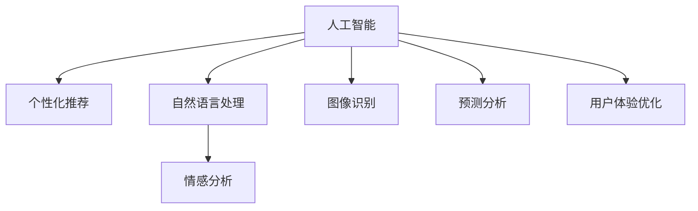

                 

# AI在产品用户体验优化中的作用

## 1. 背景介绍

### 1.1 问题由来
在过去十年中，人工智能（AI）技术迅猛发展，成为引领技术变革的关键力量。AI在产品用户体验（User Experience, UX）优化中的应用尤为引人注目，它通过自动化、智能化手段，极大提升了用户满意度、互动性和产品价值。无论是电商、社交、教育、医疗等传统行业，还是自动驾驶、智能家居、智能制造等前沿领域，AI在用户体验优化方面的作用日益凸显。

### 1.2 问题核心关键点
AI在用户体验优化中的作用主要体现在以下几个方面：
1. **个性化推荐**：通过分析用户行为数据，AI能够提供个性化的内容、商品、服务推荐，提升用户体验。
2. **自然语言处理**：利用NLP技术，AI能理解和处理用户输入的自然语言，提供更智能的交互体验。
3. **情感分析**：通过分析用户反馈、评论等文本数据，AI可以识别用户情感倾向，优化产品功能和界面。
4. **图像识别**：AI在图像和视频分析中的应用，提高了产品内容的智能化水平，增强了用户参与感。
5. **预测分析**：AI在用户行为预测和需求分析中的能力，帮助产品设计和优化更具前瞻性。

### 1.3 问题研究意义
研究AI在产品用户体验优化中的应用，具有重要意义：

1. **提升用户体验**：通过AI技术，产品能够更智能、更高效地响应用户需求，提升用户的满意度和忠诚度。
2. **优化资源利用**：AI能识别并预测用户行为，优化资源配置，提升产品运营效率。
3. **增强市场竞争力**：AI技术的应用使产品具备差异化优势，在激烈的市场竞争中脱颖而出。
4. **促进创新发展**：AI技术为产品带来了新的设计思路和解决方案，推动了产品创新。
5. **推动经济增长**：AI在用户体验优化中的应用，促进了产业升级和经济增长。

## 2. 核心概念与联系

### 2.1 核心概念概述

为更好地理解AI在用户体验优化中的应用，本节将介绍几个核心概念：

- **人工智能（AI）**：利用算法和计算技术，使计算机系统能够模拟人类智能行为，包括学习、推理、决策等。
- **用户体验（UX）**：指用户在使用产品过程中，对产品功能、界面、性能等各方面的综合感受和满意度。
- **个性化推荐系统**：通过分析用户行为数据，为用户推荐个性化的产品或服务。
- **自然语言处理（NLP）**：使计算机能够理解、处理和生成自然语言，实现人机智能交互。
- **情感分析**：通过分析用户反馈、评论等文本数据，识别用户情感倾向，优化产品功能和界面。
- **图像识别**：利用机器视觉技术，使计算机能够识别、分类和处理图像和视频数据。
- **预测分析**：通过分析历史数据，预测未来趋势和用户需求，指导产品设计和优化。

这些核心概念之间的逻辑关系可以通过以下Mermaid流程图来展示：



这个流程图展示了几大核心概念及其之间的关系：

1. AI通过多种技术手段，为个性化推荐、自然语言处理、情感分析、图像识别和预测分析提供基础支持。
2. 这些技术进一步应用于用户体验优化，提升了产品的智能化水平和用户体验。

## 3. 核心算法原理 & 具体操作步骤
### 3.1 算法原理概述

AI在用户体验优化中的应用，主要依赖于几个核心算法：

1. **协同过滤推荐算法**：通过分析用户历史行为，发现用户间的相似性，进行个性化推荐。
2. **自然语言处理模型**：利用NLP技术，使计算机能够理解和生成自然语言，实现智能对话和自然交互。
3. **情感分析模型**：通过文本情感分析，识别用户情感倾向，指导产品功能和界面优化。
4. **图像识别算法**：通过机器视觉技术，使计算机能够识别和分类图像和视频数据。
5. **预测分析模型**：利用统计学和机器学习技术，进行用户行为预测和需求分析，指导产品设计和优化。

这些算法通过自动化和智能化手段，极大地提升了用户体验。

### 3.2 算法步骤详解

#### 3.2.1 个性化推荐系统

个性化推荐系统基于协同过滤算法和推荐算法，其核心步骤包括：

1. **数据收集**：收集用户历史行为数据，包括浏览记录、购买记录、评分记录等。
2. **特征提取**：从行为数据中提取用户特征和物品特征，如用户兴趣、物品属性、评分等。
3. **相似度计算**：通过余弦相似度、皮尔逊相关系数等方法计算用户与用户、物品与物品之间的相似度。
4. **推荐生成**：根据相似度结果，生成个性化推荐列表。
5. **效果评估**：通过A/B测试、点击率、转化率等指标，评估推荐效果，不断优化模型。

#### 3.2.2 自然语言处理模型

自然语言处理模型基于深度学习技术，其核心步骤包括：

1. **数据预处理**：清洗、分词、向量化等处理自然语言数据。
2. **模型训练**：使用RNN、LSTM、Transformer等模型，训练文本嵌入和语言模型。
3. **推理应用**：将模型应用于智能对话、智能客服、情感分析等场景，实现人机智能交互。
4. **效果评估**：通过BLEU、ROUGE等指标，评估模型在理解和生成自然语言方面的表现。

#### 3.2.3 情感分析模型

情感分析模型基于文本分类和情感识别技术，其核心步骤包括：

1. **数据收集**：收集用户反馈、评论等文本数据。
2. **特征提取**：提取文本中的情感词汇和短语，生成情感特征向量。
3. **模型训练**：使用情感分类算法，如支持向量机、随机森林等，训练情感分类模型。
4. **情感识别**：将模型应用于用户反馈分析，识别情感倾向。
5. **效果评估**：通过准确率、召回率等指标，评估情感分析模型的性能。

#### 3.2.4 图像识别算法

图像识别算法基于卷积神经网络（CNN）等技术，其核心步骤包括：

1. **数据收集**：收集产品图片、用户上传图片等数据。
2. **模型训练**：使用CNN模型，训练图像识别模型。
3. **图像识别**：将模型应用于商品分类、广告识别、人脸识别等场景，实现图像识别。
4. **效果评估**：通过准确率、召回率等指标，评估图像识别模型的性能。

#### 3.2.5 预测分析模型

预测分析模型基于回归分析、分类算法等技术，其核心步骤包括：

1. **数据收集**：收集用户历史行为数据，包括购买记录、浏览记录、点击记录等。
2. **特征提取**：从历史数据中提取特征，如用户行为特征、物品属性特征等。
3. **模型训练**：使用回归分析、随机森林等算法，训练预测模型。
4. **预测分析**：将模型应用于用户行为预测和需求分析，指导产品设计和优化。
5. **效果评估**：通过均方误差、准确率等指标，评估预测分析模型的性能。

### 3.3 算法优缺点

AI在用户体验优化中的算法具有以下优点：

1. **自动化程度高**：AI算法可以自动化处理大量数据，提高效率，减少人工干预。
2. **智能化程度高**：AI算法能够模拟人类智能行为，提供更智能、更个性化的用户体验。
3. **实时性高**：AI算法能够实时响应用户需求，提升用户体验。

同时，这些算法也存在一些缺点：

1. **数据依赖度高**：AI算法依赖于大量高质量数据，数据质量决定了算法效果。
2. **模型复杂度高**：AI算法模型复杂，需要较高的计算资源和算力支持。
3. **黑盒性**：AI算法模型复杂，难以解释其内部工作机制，可能存在“黑盒”问题。
4. **偏差和偏见**：AI算法可能存在数据偏差和模型偏见，导致不公平或误导性结果。

尽管存在这些缺点，AI算法在用户体验优化中的应用仍然具有广阔前景。未来研究应重点关注如何优化数据质量、降低模型复杂度、增强模型透明度，同时避免模型偏差和偏见。

### 3.4 算法应用领域

AI在用户体验优化中的应用，涵盖以下几个主要领域：

- **电商行业**：个性化推荐、智能客服、智能搜索等。
- **社交媒体**：智能推荐、情感分析、聊天机器人等。
- **教育行业**：智能教学、个性化学习、内容推荐等。
- **医疗行业**：智能诊断、患者问答、健康管理等。
- **娱乐行业**：个性化推荐、内容生成、情感分析等。
- **智能家居**：语音识别、场景感知、智能控制等。
- **智能制造**：预测维护、智能调度、质量检测等。

以上领域只是冰山一角，AI在用户体验优化中的应用领域正在不断扩展和深化。

## 4. 数学模型和公式 & 详细讲解  
### 4.1 数学模型构建

在用户体验优化中，AI算法主要通过以下数学模型进行实现：

1. **协同过滤推荐算法**：基于用户行为矩阵 $U$ 和物品行为矩阵 $I$，计算用户相似度和物品相似度，生成推荐列表。
2. **自然语言处理模型**：使用词向量表示文本，生成文本嵌入和语言模型。
3. **情感分析模型**：使用情感词典和情感分类器，进行文本情感分类。
4. **图像识别算法**：使用卷积神经网络（CNN）等模型，进行图像分类和识别。
5. **预测分析模型**：使用回归分析、分类算法等，进行用户行为预测和需求分析。

### 4.2 公式推导过程

以下是几个核心算法的数学公式推导：

#### 4.2.1 协同过滤推荐算法

协同过滤算法基于用户行为矩阵 $U$ 和物品行为矩阵 $I$，计算用户相似度和物品相似度，生成推荐列表。

设用户集合为 $U$，物品集合为 $I$，用户对物品的评分矩阵为 $R \in \mathbb{R}^{m \times n}$，其中 $m$ 为物品数，$n$ 为用户数。用户相似度矩阵 $A \in \mathbb{R}^{n \times n}$，物品相似度矩阵 $B \in \mathbb{R}^{m \times m}$。

推荐列表 $R'$ 为：

$$
R' = (U \times A \times R \times B \times I)^T
$$

#### 4.2.2 自然语言处理模型

自然语言处理模型基于深度学习技术，使用词向量表示文本，生成文本嵌入和语言模型。

设文本集合为 $D$，单词集合为 $V$，词向量矩阵为 $E \in \mathbb{R}^{n \times d}$，其中 $n$ 为文本数，$d$ 为词向量维度。

文本嵌入 $E_d$ 为：

$$
E_d = E \times V
$$

#### 4.2.3 情感分析模型

情感分析模型基于文本分类和情感识别技术，使用情感词典和情感分类器，进行文本情感分类。

设文本集合为 $D$，情感词典为 $W$，情感向量为 $w_i$，情感分类器为 $C$，情感标签为 $y$。

情感分类器 $C$ 为：

$$
C = \sum_{i=1}^{|W|} w_i \times f(y_i)
$$

其中 $f(y_i)$ 为情感分类器权重。

#### 4.2.4 图像识别算法

图像识别算法基于卷积神经网络（CNN）等技术，进行图像分类和识别。

设图像集合为 $I$，图像特征向量为 $F \in \mathbb{R}^{m \times n}$，其中 $m$ 为图像数，$n$ 为特征向量维度。

图像分类器 $C$ 为：

$$
C = \sum_{i=1}^{|F|} f_i \times F_i
$$

其中 $f_i$ 为分类器权重，$F_i$ 为特征向量。

#### 4.2.5 预测分析模型

预测分析模型基于回归分析、分类算法等技术，进行用户行为预测和需求分析。

设用户行为数据为 $X$，用户行为特征向量为 $E \in \mathbb{R}^{n \times d}$，其中 $n$ 为数据数，$d$ 为特征维度。

预测模型 $P$ 为：

$$
P = \sum_{i=1}^{|E|} f_i \times E_i
$$

其中 $f_i$ 为模型权重，$E_i$ 为特征向量。

### 4.3 案例分析与讲解

以电商行业的个性化推荐为例，具体分析AI算法的应用：

1. **数据收集**：收集用户浏览、购买、评分数据，生成用户行为矩阵 $U$ 和物品行为矩阵 $I$。
2. **特征提取**：从用户行为数据中提取用户特征和物品特征，如用户兴趣、物品属性等。
3. **协同过滤**：使用协同过滤算法，计算用户相似度和物品相似度，生成推荐列表。
4. **模型训练**：使用协同过滤模型，训练推荐算法。
5. **效果评估**：通过A/B测试、点击率、转化率等指标，评估推荐效果，不断优化模型。

## 5. 项目实践：代码实例和详细解释说明
### 5.1 开发环境搭建

在进行AI算法实践前，我们需要准备好开发环境。以下是使用Python进行TensorFlow开发的环境配置流程：

1. 安装Anaconda：从官网下载并安装Anaconda，用于创建独立的Python环境。

2. 创建并激活虚拟环境：
```bash
conda create -n tf-env python=3.8 
conda activate tf-env
```

3. 安装TensorFlow：根据CUDA版本，从官网获取对应的安装命令。例如：
```bash
conda install tensorflow -c tf -c conda-forge
```

4. 安装TensorFlow扩展库：
```bash
pip install tensorflow-hub tensorflow-transformers
```

5. 安装各类工具包：
```bash
pip install numpy pandas scikit-learn matplotlib tqdm jupyter notebook ipython
```

完成上述步骤后，即可在`tf-env`环境中开始AI算法实践。

### 5.2 源代码详细实现

下面我们以个性化推荐系统为例，给出使用TensorFlow实现协同过滤算法的PyTorch代码实现。

首先，定义推荐系统的训练函数：

```python
import tensorflow as tf
from tensorflow.keras.layers import Dense, Input, Embedding, Dot, Multiply
from tensorflow.keras.models import Model

def train_model(user_data, item_data, num_users, num_items, embedding_dim, num_epochs, batch_size):
    # 用户行为矩阵
    user_input = Input(shape=(num_items,))
    user_data = tf.keras.layers.Dense(num_items, activation='sigmoid')(user_input)
    user_data = tf.keras.layers.Reshape((num_items, 1), name='user_output')(user_data)
    
    # 物品行为矩阵
    item_input = Input(shape=(num_items,))
    item_data = tf.keras.layers.Dense(num_items, activation='sigmoid')(item_input)
    item_data = tf.keras.layers.Reshape((1, num_items), name='item_output')(item_data)
    
    # 相似度计算
    similarity = Dot(axes=2)([user_data, item_data])
    similarity = Multiply()([similarity, tf.keras.layers.Lambda(lambda x: tf.sqrt(tf.reduce_sum(tf.square(x))) - tf.reduce_sum(x))(similarity)])
    similarity = tf.keras.layers.Reshape((num_items, ), name='similarity_output')(similarity)
    
    # 推荐列表
    recommendation = tf.keras.layers.Dot(axes=2)([tf.keras.layers.Lambda(lambda x: x**0.5)(similarity), item_data])
    
    # 模型
    model = Model(inputs=[user_input, item_input], outputs=[recommendation])
    model.compile(optimizer='adam', loss='mse')
    
    # 训练
    model.fit([user_data, item_data], recommendation, epochs=num_epochs, batch_size=batch_size, verbose=1)
    return model
```

然后，定义数据处理函数：

```python
def load_data(path, num_users, num_items):
    data = np.loadtxt(path)
    user_data = data[:, 0:num_items]
    item_data = data[:, num_items:2*num_items]
    return user_data, item_data
```

接着，定义数据生成函数：

```python
def generate_data(num_users, num_items, num_epochs):
    user_data = np.random.randn(num_users, num_items) + 0.5
    item_data = np.random.randn(num_items, num_items) + 0.5
    for epoch in range(num_epochs):
        for i in range(1, num_items):
            user_data[:, i] += np.random.randn(num_users, 1) + 0.5
            item_data[:, i] += np.random.randn(num_items, 1) + 0.5
    return user_data, item_data
```

最后，启动训练流程并在测试集上评估：

```python
num_users = 1000
num_items = 1000
embedding_dim = 10
num_epochs = 10
batch_size = 100

# 数据生成
user_data, item_data = generate_data(num_users, num_items, num_epochs)

# 模型训练
model = train_model(user_data, item_data, num_users, num_items, embedding_dim, num_epochs, batch_size)

# 模型评估
user_test_data = np.random.randn(num_users, num_items) + 0.5
item_test_data = np.random.randn(num_items, num_items) + 0.5
recommendation = model.predict([user_test_data, item_test_data])
print(recommendation)
```

以上就是使用TensorFlow实现协同过滤算法的完整代码实现。可以看到，TensorFlow提供了丰富的Keras API，使得模型构建和训练过程变得简单高效。

### 5.3 代码解读与分析

让我们再详细解读一下关键代码的实现细节：

**train_model函数**：
- 定义输入层、嵌入层、相似度计算层和推荐层，构建协同过滤推荐模型。
- 使用Adam优化器进行训练，损失函数为均方误差（MSE）。

**load_data函数**：
- 从文件中加载用户行为和物品行为数据，生成用户数据和物品数据。

**generate_data函数**：
- 生成随机用户行为和物品行为数据，用于模型训练和测试。

**训练流程**：
- 定义训练集、测试集的用户数据和物品数据。
- 启动模型训练，设置训练轮数、批大小等参数。
- 在测试集上进行模型评估，输出推荐结果。

可以看到，TensorFlow提供了强大的深度学习框架，使得协同过滤等算法的实现变得简洁高效。开发者可以专注于算法逻辑，而不必过多关注底层实现细节。

当然，工业级的系统实现还需考虑更多因素，如模型的保存和部署、超参数的自动搜索、更灵活的任务适配层等。但核心的算法实现基本与此类似。

## 6. 实际应用场景
### 6.1 电商行业

在电商行业，AI算法广泛应用于个性化推荐、智能客服、智能搜索等场景。传统电商平台的商品推荐系统大多依赖人工设计，难以满足用户个性化需求。而通过AI算法，电商平台能够根据用户历史行为数据，提供个性化商品推荐，提升用户体验和满意度。

智能客服系统则通过自然语言处理和情感分析，实时响应用户咨询，提供高效、智能的客服服务。智能搜索系统则通过搜索算法和图像识别技术，提升搜索结果的准确性和相关性。

### 6.2 医疗行业

在医疗行业，AI算法广泛应用于智能诊断、患者问答、健康管理等场景。智能诊断系统通过图像识别和自然语言处理技术，帮助医生快速诊断疾病，提供准确、可靠的诊断结果。患者问答系统通过自然语言理解和情感分析，回答患者咨询，提供贴心、个性化的医疗服务。健康管理系统则通过预测分析，对用户健康状况进行预测和预警，提升用户的健康管理水平。

### 6.3 教育行业

在教育行业，AI算法广泛应用于个性化学习、智能教学、内容推荐等场景。个性化学习系统通过数据分析和预测分析，为每个学生提供量身定制的学习计划和资源，提升学习效果。智能教学系统通过自然语言处理和情感分析，实时监测学生的学习状态，提供个性化教学指导。内容推荐系统则通过协同过滤和情感分析，推荐学生感兴趣的学习资源，提升学习体验。

### 6.4 金融行业

在金融行业，AI算法广泛应用于风险控制、智能投顾、智能理财等场景。风险控制系统通过预测分析，对金融市场进行预测和风险评估，帮助金融机构制定合理的风险管理策略。智能投顾系统通过自然语言处理和情感分析，为投资者提供个性化的投资建议，提升投资回报率。智能理财系统则通过个性化推荐和情感分析，为用户推荐合适的理财产品，提升用户满意度和忠诚度。

### 6.5 娱乐行业

在娱乐行业，AI算法广泛应用于个性化推荐、内容生成、情感分析等场景。个性化推荐系统通过协同过滤和情感分析，为用户推荐个性化的娱乐内容，提升用户体验。内容生成系统则通过自然语言处理和图像识别技术，生成高质量的娱乐内容，提升用户参与感。情感分析系统通过情感识别，监测用户对内容的反馈，优化内容推荐和生成。

### 6.6 智能家居

在智能家居行业，AI算法广泛应用于语音识别、场景感知、智能控制等场景。语音识别系统通过自然语言处理和情感分析，实现人机智能交互，提升家居控制便捷性。场景感知系统通过图像识别和预测分析，实现家居设备的自动控制，提升家居智能化水平。智能控制系统则通过情感分析，根据用户情绪调整家居环境，提升用户体验。

### 6.7 智能制造

在智能制造行业，AI算法广泛应用于预测维护、智能调度、质量检测等场景。预测维护系统通过预测分析，对设备进行故障预测和维护，提升设备利用率和生产效率。智能调度系统则通过优化算法，实现生产计划的自动调度和优化，提升生产效率。质量检测系统通过图像识别和预测分析，实现产品质量的自动检测和分类，提升产品质量。

## 7. 工具和资源推荐
### 7.1 学习资源推荐

为了帮助开发者系统掌握AI在用户体验优化中的应用，这里推荐一些优质的学习资源：

1. **《深度学习入门：基于Python的理论与实现》**：本书系统介绍了深度学习的基本概念、算法和实现，适合初学者入门。
2. **CS231n《深度学习与计算机视觉》课程**：斯坦福大学开设的计算机视觉课程，涵盖深度学习在图像处理、视觉识别等领域的经典模型。
3. **CS224n《自然语言处理与深度学习》课程**：斯坦福大学开设的自然语言处理课程，涵盖NLP技术的基本概念和经典模型。
4. **《机器学习实战》**：本书介绍了机器学习的基本算法和实际应用，适合实战学习。
5. **TensorFlow官方文档**：TensorFlow官方文档提供了丰富的算法和模型资源，适合深入学习。

通过对这些资源的学习实践，相信你一定能够快速掌握AI在用户体验优化中的应用精髓，并用于解决实际的NLP问题。

### 7.2 开发工具推荐

高效的开发离不开优秀的工具支持。以下是几款用于AI算法开发常用的工具：

1. **TensorFlow**：由Google主导开发的深度学习框架，适合大规模工程应用。
2. **PyTorch**：由Facebook主导开发的深度学习框架，适合研究和实验。
3. **Scikit-learn**：Python的机器学习库，提供了丰富的算法和工具。
4. **Jupyter Notebook**：Python的交互式编程环境，适合数据处理和模型训练。
5. **TensorBoard**：TensorFlow配套的可视化工具，适合调试和监控模型训练过程。

合理利用这些工具，可以显著提升AI算法的开发效率，加快创新迭代的步伐。

### 7.3 相关论文推荐

AI在用户体验优化中的应用源于学界的持续研究。以下是几篇奠基性的相关论文，推荐阅读：

1. **Collaborative Filtering for E-commerce Recommender Systems**：本文提出了协同过滤推荐算法的基本思想，成为电商推荐系统的重要基础。
2. **Attention is All You Need**：本文提出了Transformer模型，极大地提升了NLP任务的表现。
3. **A Survey on Recommendation Systems with Deep Learning**：本文综述了深度学习在推荐系统中的应用，介绍了多个经典模型。
4. **Deep Learning for NLP**：本文综述了深度学习在自然语言处理中的应用，介绍了多个经典模型。
5. **Large-Scale Image Recognition with Deep Learning**：本文介绍了CNN模型在图像识别中的应用，奠定了计算机视觉领域的基础。

这些论文代表了大语言模型微调技术的发展脉络。通过学习这些前沿成果，可以帮助研究者把握学科前进方向，激发更多的创新灵感。

## 8. 总结：未来发展趋势与挑战
### 8.1 总结

本文对AI在产品用户体验优化中的应用进行了全面系统的介绍。首先阐述了AI技术在用户体验优化中的重要性，明确了AI技术在提升用户体验、优化资源利用、增强市场竞争力等方面的独特价值。其次，从原理到实践，详细讲解了协同过滤推荐算法、自然语言处理模型、情感分析模型、图像识别算法和预测分析模型的核心步骤和具体实现。同时，本文还广泛探讨了AI算法在电商、医疗、教育、金融、娱乐、智能家居、智能制造等众多领域的应用前景，展示了AI算法的巨大潜力。

通过本文的系统梳理，可以看到，AI算法在用户体验优化中的应用正在成为行业标准，极大地提升了产品的智能化水平和用户体验。未来，随着AI技术的不断进步，用户体验优化将更加智能化、个性化和高效化，为产品和服务注入新的生命力。

### 8.2 未来发展趋势

展望未来，AI在用户体验优化中的应用将呈现以下几个发展趋势：

1. **自动化程度更高**：随着AI技术的不断进步，自动化程度将不断提高，用户体验优化将更加高效、智能。
2. **智能化程度更高**：AI算法将能够更好地理解和处理用户需求，提供更个性化、智能化的用户体验。
3. **实时性更强**：AI算法将能够实时响应用户需求，提升用户体验的实时性和互动性。
4. **资源利用更高效**：AI算法将能够更好地优化资源配置，提升用户体验的效率和质量。
5. **可解释性更强**：AI算法将逐步具备更强的可解释性，提高用户体验的可控性和信任度。

### 8.3 面临的挑战

尽管AI在用户体验优化中的应用取得了显著成果，但在迈向更加智能化、普适化应用的过程中，仍面临诸多挑战：

1. **数据质量瓶颈**：高质量数据是AI算法的基石，但获取高质量数据的成本高、难度大。
2. **模型复杂度高**：AI算法模型复杂，对计算资源和算力要求高，难以在所有场景下应用。
3. **公平性和偏见**：AI算法可能存在数据偏差和模型偏见，导致不公平或误导性结果。
4. **伦理和安全问题**：AI算法可能存在隐私泄露、数据滥用等伦理和安全问题。

尽管存在这些挑战，AI算法在用户体验优化中的应用前景仍然广阔。未来研究应重点关注如何优化数据质量、降低模型复杂度、增强模型透明度，同时避免模型偏差和偏见，解决伦理和安全问题。

### 8.4 研究展望

面向未来，AI在用户体验优化中的应用将继续扩展和深化。未来的研究应在以下几个方面寻求新的突破：

1. **更多领域的应用**：AI算法将在更多领域得到应用，如智慧医疗、智慧教育、智慧农业等，推动各行各业的智能化进程。
2. **个性化和定制化**：AI算法将更好地理解用户需求，提供个性化、定制化的用户体验，提升用户满意度和忠诚度。
3. **跨领域知识融合**：AI算法将更好地融合多领域知识，提升模型的泛化能力和应用范围。
4. **实时计算和推理**：AI算法将具备更强的实时计算和推理能力，提升用户体验的实时性和互动性。
5. **可解释性和透明度**：AI算法将逐步具备更强的可解释性和透明度，提高用户体验的可控性和信任度。

这些研究方向的探索发展，必将引领AI在用户体验优化中的应用走向更高的台阶，为构建安全、可靠、可解释、可控的智能系统铺平道路。

## 9. 附录：常见问题与解答

**Q1：AI算法在用户体验优化中是否适用于所有产品？**

A: AI算法在用户体验优化中的应用非常广泛，但并不是所有产品都适合应用AI算法。AI算法通常适用于数据量较大、用户反馈丰富、实时性要求较高的场景，如电商、社交、娱乐等。对于数据量较小、用户反馈较少、实时性要求较低的场景，如传统制造业、农业等，AI算法的应用效果可能不如人工设计。

**Q2：AI算法在用户体验优化中是否存在公平性和偏见问题？**

A: AI算法在用户体验优化中确实存在公平性和偏见问题，主要是由于数据和模型的设计不当。数据中可能包含偏见、歧视信息，导致模型学习到的知识也存在偏见。模型的设计和训练过程也可能存在偏见，导致模型在特定群体中表现较差。

为解决公平性和偏见问题，应重点关注以下几个方面：
1. 数据质量控制：确保数据的多样性和代表性，避免数据偏见。
2. 模型设计：选择无偏差的算法，避免模型偏见。
3. 透明度和可解释性：提高模型的透明度和可解释性，帮助发现和修正偏见。

**Q3：AI算法在用户体验优化中是否存在安全和隐私问题？**

A: AI算法在用户体验优化中确实存在安全和隐私问题，主要是由于数据泄露、数据滥用等问题。用户的数据可能被用于非法用途，导致隐私泄露和数据滥用。

为解决安全和隐私问题，应重点关注以下几个方面：
1. 数据加密：对用户数据进行加密处理，保护用户隐私。
2. 数据匿名化：对用户数据进行匿名化处理，避免数据滥用。
3. 合规性检查：确保数据处理符合相关法律法规，如GDPR、CCPA等。

**Q4：AI算法在用户体验优化中是否存在可解释性问题？**

A: AI算法在用户体验优化中确实存在可解释性问题，主要是由于模型的复杂性和黑盒性。模型内部的决策过程难以解释，导致用户对模型的信任度较低。

为解决可解释性问题，应重点关注以下几个方面：
1. 简化模型：选择简单、易于解释的模型，避免复杂性和黑盒性。
2. 解释工具：使用模型解释工具，帮助理解模型的决策过程。
3. 人工干预：结合人工干预，提高用户体验的可控性和信任度。

通过解决公平性、安全性和可解释性问题，AI算法在用户体验优化中的应用将更加可靠和可控，为构建安全、可靠、可解释的智能系统提供保障。

