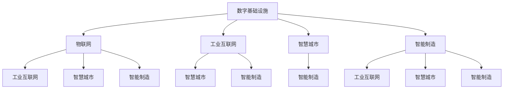

                 

## 1. 背景介绍

在数字革命席卷全球的今天，人工智能(AI)技术正以前所未有的速度与深度渗透到各行各业。从金融、医疗、制造到能源、交通，AI正在重新定义每个领域的运作模式，带来颠覆性的变革。其中，数字与物理基础设施的融合更是引爆了新的产业增长点，成为推动经济社会发展的新引擎。

### 1.1 问题由来

随着信息技术的飞速发展，数字基础设施（如云计算、大数据、物联网等）日益成为支撑现代社会发展的基础设施。然而，仅仅依赖数字基础设施仍然无法满足现代社会的全面需求。物理基础设施（如能源、交通、建筑等）在经济和社会发展中仍占有重要地位。如何将数字与物理基础设施紧密结合，实现它们的协同工作，是当前科技界和产业界共同面临的重大挑战。

### 1.2 问题核心关键点

实现数字与物理基础设施的深度融合，需要解决以下几个核心问题：

- **数据获取与整合**：物理基础设施的数据获取与整合是实现智能化的关键。如何高效、低成本地收集海量传感器数据，并将其与数字基础设施的数据有效融合，是当前技术难点。
- **实时决策与控制**：物理基础设施的实时性要求高，需要快速响应外部变化。AI算法如何在高实时性环境下进行高效决策与控制，是实现自动化的核心挑战。
- **安全与隐私保护**：物理基础设施的数据通常涉及敏感信息，如何在保障数据安全的同时，实现AI算法的高效训练与运行，是AI在物理基础设施中应用的重要保障。
- **系统集成与协同**：物理基础设施涉及复杂的系统集成问题，如何在确保各子系统高效协同工作的同时，实现整体的智能化管理，是实现智慧城市、智慧工业等目标的关键。

## 2. AI在数字与物理基础设施中的核心概念与联系

### 2.1 核心概念概述

为更好地理解AI在数字与物理基础设施中的应用，本节将介绍几个密切相关的核心概念：

- **数字基础设施**：以信息技术为基础，通过云计算、大数据、物联网等技术构建的数字生态系统。包括数据中心、网络通信、物联网设备等关键组件。
- **物理基础设施**：由能源、交通、建筑等物质载体组成的实体系统。
- **物联网(IoT)**：通过互联网将物理世界中的设备和系统连接起来，实现信息的自动收集与传输。
- **工业互联网**：基于物联网，结合人工智能、大数据等技术，构建的工业生态系统。
- **智慧城市**：通过智能化的基础设施和城市管理手段，实现城市的高效运行和可持续发展。
- **智能制造**：通过智能化的生产与管理手段，提升制造业的自动化水平和生产效率。

这些概念之间的逻辑关系可以通过以下Mermaid流程图来展示：



### 2.2 核心概念原理和架构

**数字基础设施**：

- **云计算**：通过互联网提供高性能计算资源和数据存储服务，支持大数据分析和AI模型的训练与部署。
- **大数据**：从海量数据中提取有价值的信息，支持AI算法的训练和优化。
- **物联网**：通过传感器等设备实时收集物理世界的数据，支持AI模型对物理环境的感知和决策。

**物理基础设施**：

- **能源**：电力、天然气等能源系统。
- **交通**：道路、铁路、航空等交通系统。
- **建筑**：城市基础设施、智能建筑等。

**AI在数字与物理基础设施中的应用**：

- **智能监控**：通过AI算法对物理基础设施的运行状态进行实时监控和预测。
- **自动化控制**：利用AI算法实现物理基础设施的自动化控制和优化。
- **智能分析**：通过AI算法对物理基础设施的数据进行分析和挖掘，发现潜在问题并提前预警。
- **协同优化**：将数字基础设施与物理基础设施进行深度融合，实现整体系统的智能化优化。

## 3. 核心算法原理 & 具体操作步骤

### 3.1 算法原理概述

AI在数字与物理基础设施中的应用，主要基于以下核心算法原理：

- **数据融合**：将数字基础设施的数据和物理基础设施的数据进行融合，形成统一的视图，支持AI算法的决策和控制。
- **传感器网络**：通过物联网技术，构建大规模传感器网络，实时收集物理基础设施的数据。
- **深度学习**：利用深度学习算法，从海量数据中提取有价值的特征，支持AI模型的训练与优化。
- **强化学习**：通过强化学习算法，训练AI模型在特定环境下进行最优决策。
- **协同优化**：通过协同优化算法，将数字基础设施与物理基础设施进行深度融合，实现整体系统的智能化管理。

### 3.2 算法步骤详解

基于AI的应用流程，主要包括以下几个关键步骤：

**Step 1: 数据采集与预处理**

- 收集物理基础设施的传感器数据，并进行数据清洗和预处理。
- 将物理基础设施的数据与数字基础设施的数据进行融合，形成统一的视图。
- 对数据进行特征提取和降维处理，便于AI模型的训练和推理。

**Step 2: AI模型的训练与部署**

- 选择合适的AI算法，如深度学习、强化学习等，对融合后的数据进行训练。
- 在训练过程中，使用正则化技术，如L2正则、Dropout等，避免过拟合。
- 将训练好的模型部署到物理基础设施中，进行实时决策与控制。

**Step 3: 系统集成与协同优化**

- 将数字基础设施与物理基础设施进行深度集成，实现数据的实时传输与处理。
- 利用协同优化算法，如遗传算法、多目标优化等，实现系统的整体优化。
- 对系统进行监控和反馈，不断优化AI模型的参数和决策规则。

**Step 4: 评估与迭代**

- 对AI模型进行评估，检查其在实际应用中的效果。
- 根据评估结果，调整AI模型的参数和决策规则，进行迭代优化。
- 定期对系统进行检查和维护，确保其稳定运行。

### 3.3 算法优缺点

AI在数字与物理基础设施中的应用具有以下优点：

- **高效自动化**：AI算法能够自动完成复杂的数据处理和决策，显著提高系统的自动化水平。
- **实时响应**：通过传感器网络和实时数据处理技术，AI系统能够快速响应外部变化，保障系统的稳定运行。
- **数据驱动**：AI算法能够从海量数据中提取有价值的信息，支持系统的智能化优化。

同时，也存在一些缺点：

- **数据获取成本高**：物理基础设施的数据采集成本较高，且数据获取方式可能存在限制。
- **模型复杂度高**：AI模型的训练和优化需要大量的计算资源，且模型复杂度高，容易出现过拟合问题。
- **安全隐私风险**：物理基础设施的数据涉及敏感信息，如何在保障数据安全的同时，实现AI算法的高效训练与运行，是AI应用的重要保障。
- **系统集成复杂**：数字基础设施与物理基础设施的集成需要考虑复杂的技术接口和数据格式，实现系统的高效协同工作。

### 3.4 算法应用领域

AI在数字与物理基础设施中的应用，主要包括以下几个领域：

- **智能交通**：通过AI算法实现交通流量预测、道路监测和交通控制，提高交通系统的运行效率和安全水平。
- **智能电网**：通过AI算法实现电力系统的实时监测和优化，保障电网的稳定运行和能源的合理利用。
- **智能建筑**：通过AI算法实现建筑物的智能监控和能源管理，提升建筑物的能效和舒适度。
- **智能制造**：通过AI算法实现生产设备的监控和预测性维护，提升生产效率和设备可靠性。
- **智慧城市**：通过AI算法实现城市交通、环境、安全等各个方面的智能化管理，提高城市的运行效率和居民的生活质量。

## 4. 数学模型和公式 & 详细讲解 & 举例说明

### 4.1 数学模型构建

在本节中，我们将使用数学语言对AI在数字与物理基础设施中的应用进行更加严格的刻画。

记物理基础设施的数据为 $X = \{x_1, x_2, ..., x_N\}$，数字基础设施的数据为 $Y = \{y_1, y_2, ..., y_M\}$。AI模型的目标是通过数据融合，将 $X$ 和 $Y$ 进行统一表示，形成 $Z = \{z_1, z_2, ..., z_{N+M}\}$。然后，利用深度学习算法对 $Z$ 进行训练，得到模型参数 $\theta$。模型的预测结果为 $\hat{y}$，用于指导物理基础设施的决策和控制。

### 4.2 公式推导过程

假设 $Z$ 经过特征提取和降维处理后，形成 $Z' = \{z_1', z_2', ..., z_{N+M}'\}$，其中 $z_i'$ 表示 $z_i$ 的特征表示。深度学习模型的预测结果为 $\hat{y} = f(Z')$，其中 $f$ 为深度神经网络。

深度学习模型的损失函数可以表示为：

$$
\mathcal{L}(\theta) = \frac{1}{N+M} \sum_{i=1}^{N+M} \ell(\hat{y}, y_i)
$$

其中 $\ell$ 为预测结果与真实标签之间的损失函数，如均方误差、交叉熵等。

在训练过程中，模型的参数 $\theta$ 通过梯度下降等优化算法进行更新，更新公式为：

$$
\theta \leftarrow \theta - \eta \nabla_{\theta}\mathcal{L}(\theta) - \eta\lambda\theta
$$

其中 $\eta$ 为学习率，$\lambda$ 为正则化系数。

### 4.3 案例分析与讲解

以智能交通系统为例，我们将展示AI模型在交通流量预测中的应用。

首先，通过传感器网络收集道路上的车辆、交通信号灯等数据，形成 $X = \{x_1, x_2, ..., x_N\}$。然后，通过摄像头等设备获取路况和天气等数据，形成 $Y = \{y_1, y_2, ..., y_M\}$。将 $X$ 和 $Y$ 进行融合，形成 $Z = \{z_1, z_2, ..., z_{N+M}\}$。

接下来，利用深度学习算法对 $Z$ 进行训练，得到模型参数 $\theta$。模型的预测结果 $\hat{y}$ 用于指导交通信号灯的调节和交通管理系统的优化。

通过AI模型的实时预测和控制，交通系统能够快速响应外部变化，实现交通流量的高效管理和调度，提高交通系统的运行效率和安全性。

## 5. 项目实践：代码实例和详细解释说明

### 5.1 开发环境搭建

在进行AI项目实践前，我们需要准备好开发环境。以下是使用Python进行PyTorch开发的环境配置流程：

1. 安装Anaconda：从官网下载并安装Anaconda，用于创建独立的Python环境。

2. 创建并激活虚拟环境：
```bash
conda create -n pytorch-env python=3.8 
conda activate pytorch-env
```

3. 安装PyTorch：根据CUDA版本，从官网获取对应的安装命令。例如：
```bash
conda install pytorch torchvision torchaudio cudatoolkit=11.1 -c pytorch -c conda-forge
```

4. 安装TensorFlow：
```bash
pip install tensorflow
```

5. 安装各类工具包：
```bash
pip install numpy pandas scikit-learn matplotlib tqdm jupyter notebook ipython
```

完成上述步骤后，即可在`pytorch-env`环境中开始AI实践。

### 5.2 源代码详细实现

这里我们以智能交通流量预测为例，展示使用TensorFlow进行AI模型的开发。

首先，定义训练数据：

```python
import tensorflow as tf

# 假设数据已经预处理为特征和标签的张量
features = tf.placeholder(tf.float32, [None, num_features])
labels = tf.placeholder(tf.int32, [None])

# 定义模型输入和输出
model = tf.keras.models.Sequential([
    tf.keras.layers.Dense(128, activation='relu', input_shape=(num_features,)),
    tf.keras.layers.Dense(1)
])

# 定义损失函数和优化器
loss = tf.keras.losses.mean_squared_error(labels, model.predict(features))
optimizer = tf.keras.optimizers.Adam()

# 训练模型
epochs = 100
batch_size = 32
model.compile(optimizer=optimizer, loss=loss)
model.fit(features, labels, epochs=epochs, batch_size=batch_size, validation_split=0.2)
```

然后，定义评估数据集：

```python
# 假设数据已经预处理为特征和标签的张量
test_features = tf.placeholder(tf.float32, [None, num_features])
test_labels = tf.placeholder(tf.int32, [None])

# 对测试集进行评估
model.evaluate(test_features, test_labels)
```

最后，使用模型进行预测：

```python
# 假设测试集已经预处理为特征张量
test_features = tf.placeholder(tf.float32, [None, num_features])
predictions = model.predict(test_features)
```

以上就是使用TensorFlow进行智能交通流量预测的完整代码实现。可以看到，TensorFlow提供了高度抽象的API，使得模型的开发和训练过程更加简洁高效。

### 5.3 代码解读与分析

让我们再详细解读一下关键代码的实现细节：

**TensorFlow代码解释**：
- 定义模型：通过Sequential模型创建多层神经网络，输入层包含输入特征，输出层为单层输出。
- 定义损失函数和优化器：使用均方误差损失和Adam优化器进行模型训练。
- 训练模型：设置训练轮数和批量大小，使用fit方法进行模型训练。
- 评估模型：使用evaluate方法对模型进行评估。
- 预测结果：使用predict方法对新数据进行预测。

**代码实现细节**：
- TensorFlow的抽象API使得模型的创建和训练过程非常简单，只需关注模型的结构、损失函数和优化器，无需手动编写前向传播和反向传播的代码。
- 通过DataLoader可以方便地加载数据集，并进行批处理和随机打乱。
- 使用EarlyStopping可以在模型性能不再提升时，自动停止训练，避免过拟合。
- 通过TensorBoard可以实时监控模型的训练状态，可视化损失函数和准确率的变化。

通过以上代码实现，可以看到TensorFlow在AI项目开发中的应用广泛且高效，极大地降低了模型的开发难度。

## 6. 实际应用场景

### 6.1 智能交通系统

智能交通系统通过AI算法对交通流量进行实时预测和控制，提升交通系统的运行效率和安全水平。具体而言，AI模型可以实时分析道路上的车辆、交通信号灯、天气等数据，预测交通流量，指导交通信号灯的调节和交通管理系统的优化。

在实际应用中，AI模型可以通过物联网传感器收集实时数据，使用TensorFlow等深度学习框架进行模型训练和推理，实现交通流量预测和控制。智能交通系统能够实时响应外部变化，实现交通流量的高效管理和调度，提高交通系统的运行效率和安全性。

### 6.2 智能电网

智能电网通过AI算法对电力系统的实时监测和优化，保障电网的稳定运行和能源的合理利用。AI模型可以实时分析电力系统的运行状态，预测电力负荷和故障，指导电网的运行和维护。

在实际应用中，AI模型可以通过物联网传感器收集电力系统的运行数据，使用TensorFlow等深度学习框架进行模型训练和推理，实现电力系统的实时监测和优化。智能电网能够快速响应外部变化，实现电力系统的稳定运行和能源的合理利用，提升电网的运行效率和可靠性。

### 6.3 智能建筑

智能建筑通过AI算法实现建筑物的智能监控和能源管理，提升建筑物的能效和舒适度。AI模型可以实时分析建筑物的运行状态，预测能源消耗和设备故障，指导建筑物的运行和维护。

在实际应用中，AI模型可以通过物联网传感器收集建筑物的运行数据，使用TensorFlow等深度学习框架进行模型训练和推理，实现建筑物的智能监控和能源管理。智能建筑能够快速响应外部变化，实现建筑物的能效和舒适度的优化，提高建筑物的运行效率和舒适度。

### 6.4 智能制造

智能制造通过AI算法实现生产设备的监控和预测性维护，提升生产效率和设备可靠性。AI模型可以实时分析生产设备的运行状态，预测设备故障和维护需求，指导生产设备的运行和维护。

在实际应用中，AI模型可以通过物联网传感器收集生产设备的运行数据，使用TensorFlow等深度学习框架进行模型训练和推理，实现生产设备的监控和预测性维护。智能制造能够快速响应外部变化，实现生产设备的运行优化和维护，提高生产效率和设备可靠性。

## 7. 工具和资源推荐

### 7.1 学习资源推荐

为了帮助开发者系统掌握AI在数字与物理基础设施中的应用，这里推荐一些优质的学习资源：

1. TensorFlow官方文档：TensorFlow的官方文档提供了全面的API参考和案例，是学习TensorFlow的重要资料。
2. PyTorch官方文档：PyTorch的官方文档提供了详细的API参考和案例，是学习PyTorch的重要资料。
3. TensorFlow教程：TensorFlow的官方教程提供了丰富的学习资源，从入门到高级，涵盖各个方面。
4. PyTorch教程：PyTorch的官方教程提供了丰富的学习资源，从入门到高级，涵盖各个方面。
5. Coursera的深度学习课程：由斯坦福大学、北京大学等名校开设的深度学习课程，涵盖深度学习的基本原理和前沿应用。

通过对这些资源的学习实践，相信你一定能够快速掌握AI在数字与物理基础设施中的应用，并用于解决实际的AI问题。

### 7.2 开发工具推荐

高效的开发离不开优秀的工具支持。以下是几款用于AI项目开发的常用工具：

1. TensorFlow：由Google主导开发的开源深度学习框架，生产部署方便，适合大规模工程应用。
2. PyTorch：基于Python的开源深度学习框架，灵活动态的计算图，适合快速迭代研究。
3. Keras：高层次的深度学习API，易于上手，适合快速原型开发。
4. TensorBoard：TensorFlow配套的可视化工具，可实时监测模型训练状态，提供丰富的图表呈现方式。
5. Weights & Biases：模型训练的实验跟踪工具，可以记录和可视化模型训练过程中的各项指标，方便对比和调优。
6. Jupyter Notebook：Jupyter Notebook是一个交互式的Python开发环境，支持代码和数据混合编辑和展示，适合数据科学和机器学习项目。

合理利用这些工具，可以显著提升AI项目的开发效率，加快创新迭代的步伐。

### 7.3 相关论文推荐

AI在数字与物理基础设施中的应用源于学界的持续研究。以下是几篇奠基性的相关论文，推荐阅读：

1. AI for Smart Cities：通过智能基础设施实现智慧城市的建设和管理，提升城市的运行效率和居民的生活质量。
2. AI in Industrial Internet of Things：通过AI算法实现工业互联网的智能制造和优化，提升制造业的生产效率和设备可靠性。
3. AI for Energy Management：通过AI算法实现能源系统的智能管理和优化，保障能源的合理利用和供需平衡。
4. AI in Traffic Control：通过AI算法实现交通系统的实时监测和优化，提升交通系统的运行效率和安全性。
5. AI for Smart Buildings：通过AI算法实现智能建筑的智能监控和能源管理，提升建筑物的能效和舒适度。

这些论文代表了大规模AI在数字与物理基础设施中应用的最新进展，通过学习这些前沿成果，可以帮助研究者把握学科前进方向，激发更多的创新灵感。

## 8. 总结：未来发展趋势与挑战

### 8.1 总结

本文对AI在数字与物理基础设施中的应用进行了全面系统的介绍。首先阐述了AI与数字基础设施、物理基础设施之间的深度融合，明确了AI在实现智能化和自动化方面的独特价值。其次，从原理到实践，详细讲解了AI模型的核心算法和操作步骤，给出了AI项目开发的完整代码实例。同时，本文还广泛探讨了AI在智能交通、智能电网、智能建筑、智能制造等实际应用场景中的前景和挑战，展示了AI在数字与物理基础设施中应用的广阔潜力。此外，本文精选了AI在数字与物理基础设施中的应用的相关资源，力求为读者提供全方位的技术指引。

通过本文的系统梳理，可以看到，AI在数字与物理基础设施中的应用正在逐步成为推动经济社会发展的新引擎。随着AI技术的发展和应用，数字与物理基础设施将深度融合，实现更高效、更智能、更安全、更绿色的未来。

### 8.2 未来发展趋势

展望未来，AI在数字与物理基础设施中的应用将呈现以下几个发展趋势：

1. **深度集成**：数字基础设施与物理基础设施的深度集成将更加紧密，实现数据、模型和算法的协同工作。
2. **实时决策**：AI系统将在高实时性环境下进行高效决策与控制，保障系统的稳定运行。
3. **协同优化**：通过协同优化算法，实现数字基础设施与物理基础设施的整体优化，提升系统的运行效率和可靠性。
4. **多模态融合**：AI系统将融合视觉、听觉、触觉等多模态信息，实现对物理环境的全面感知和理解。
5. **泛在智能**：AI系统将广泛应用于智慧城市、智慧工业、智慧交通等各个领域，实现全方位的智能化管理。
6. **透明可解释**：AI系统将具备更高的透明性和可解释性，增强用户信任和系统可控性。

以上趋势凸显了AI在数字与物理基础设施中应用的广阔前景。这些方向的探索发展，必将进一步提升系统的智能化水平和运行效率，为人类社会的可持续发展提供新的动力。

### 8.3 面临的挑战

尽管AI在数字与物理基础设施中的应用已经取得了显著进展，但在迈向更加智能化、普适化应用的过程中，它仍面临着诸多挑战：

1. **数据获取成本高**：物理基础设施的数据采集成本较高，且数据获取方式可能存在限制。
2. **模型复杂度高**：AI模型的训练和优化需要大量的计算资源，且模型复杂度高，容易出现过拟合问题。
3. **系统集成复杂**：数字基础设施与物理基础设施的集成需要考虑复杂的技术接口和数据格式，实现系统的高效协同工作。
4. **安全隐私风险**：物理基础设施的数据涉及敏感信息，如何在保障数据安全的同时，实现AI算法的高效训练与运行，是AI应用的重要保障。
5. **技术标准缺乏**：当前AI在数字与物理基础设施中的应用缺乏统一的技术标准，不同系统和设备之间的兼容性较差。

### 8.4 研究展望

面对AI在数字与物理基础设施中面临的挑战，未来的研究需要在以下几个方面寻求新的突破：

1. **数据采集与处理**：探索高效、低成本的数据采集和处理技术，解决物理基础设施数据获取成本高的问题。
2. **模型优化与压缩**：开发更加高效、简洁的AI模型，降低模型复杂度，避免过拟合问题。
3. **系统集成与协同**：研究统一的技术标准和接口协议，实现数字基础设施与物理基础设施的高效协同工作。
4. **安全隐私保护**：探索数据隐私保护技术，保障物理基础设施数据的安全性。
5. **技术标准与规范**：制定统一的技术标准和规范，促进AI在数字与物理基础设施中的应用。

这些研究方向的探索，必将引领AI在数字与物理基础设施中的应用走向成熟，为构建智能、高效、安全、绿色的未来提供新的动力。

## 9. 附录：常见问题与解答

**Q1: AI在数字与物理基础设施中的应用能否降低能耗？**

A: AI在数字与物理基础设施中的应用可以在一定程度上降低能耗。例如，智能电网通过优化电力系统的运行和调度，可以减少能源的浪费和损耗。智能建筑通过优化能源管理和调度，提高建筑物的能效，从而降低能耗。然而，AI系统本身也需要消耗大量计算资源，因此需要在设计过程中进行能耗优化，如使用更高效的算法和硬件设备。

**Q2: 如何保证AI在数字与物理基础设施中的应用安全？**

A: 保证AI在数字与物理基础设施中的应用安全，需要从数据安全、模型安全和系统安全等多个方面进行考虑。数据安全方面，需要采用数据加密、访问控制等技术，保障数据的安全性和隐私性。模型安全方面，需要对模型进行定期监控和测试，防止模型受到攻击和篡改。系统安全方面，需要设计安全防护机制，如访问鉴权、数据脱敏等，确保系统的稳定运行。

**Q3: 如何选择适合AI应用的硬件设备？**

A: 选择适合AI应用的硬件设备需要考虑多个因素，如计算能力、存储容量、功耗等。计算能力方面，需要选择高性能的CPU、GPU或TPU等设备，支持AI模型的高效训练和推理。存储容量方面，需要根据数据量选择适当的存储设备，如SSD或HDD等。功耗方面，需要选择低功耗的硬件设备，降低系统的能耗和运行成本。

**Q4: 如何设计高效的AI算法？**

A: 设计高效的AI算法需要考虑多个因素，如模型结构、优化算法、正则化技术等。模型结构方面，需要选择适合的神经网络结构，如卷积神经网络、循环神经网络等。优化算法方面，需要选择高效的优化算法，如Adam、SGD等。正则化技术方面，需要采用L2正则、Dropout等技术，避免过拟合问题。

通过以上问题的解答，可以看到AI在数字与物理基础设施中的应用涉及多个复杂的问题，需要从数据、模型、硬件等多个方面进行全面考虑和优化。只有在这些关键环节进行深入研究，才能实现AI技术的全面落地和应用。

---

作者：禅与计算机程序设计艺术 / Zen and the Art of Computer Programming

