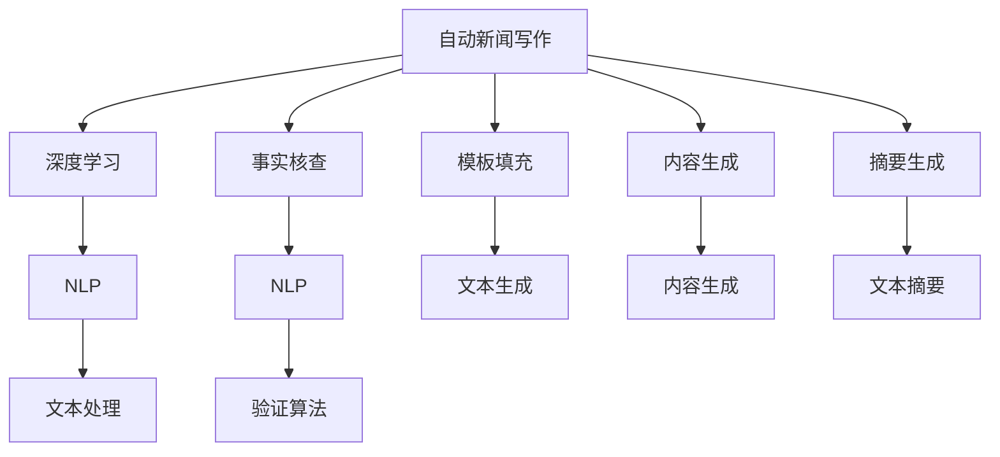

                 

## 1. 背景介绍

### 1.1 问题由来

随着互联网和数字技术的快速发展，新闻业正经历着前所未有的变革。传统媒体依赖人类记者进行新闻采集和写作的方式，逐渐被自动化的内容生成工具所替代。这些工具利用AI技术，能够快速生成新闻稿件，同时进行事实核查，提高新闻报道的准确性和时效性。自动新闻写作与事实核查技术的融合，不仅能够减轻记者工作负担，还能提升新闻报道的质量和效率。

然而，尽管自动化技术在新闻业中的应用前景广阔，但也存在一些挑战。例如，如何保证新闻内容的真实性、如何处理人工智能生成的错误信息、如何确保自动化的新闻写作系统能够理解复杂的新闻事件等。这些问题需要深入的技术研究和多学科的合作来解决。

### 1.2 问题核心关键点

本文聚焦于基于AI的自动新闻写作与事实核查技术，探讨其在新闻业中的应用，分析其原理、算法和实际应用案例，并提出未来发展的方向和面临的挑战。

## 2. 核心概念与联系

### 2.1 核心概念概述

为更好地理解AI在新闻业的应用，本节将介绍几个关键概念：

- **自动新闻写作**：指利用AI技术自动生成新闻稿件的过程。常见的自动新闻写作技术包括模板填充、内容生成和摘要生成等。

- **事实核查**：指通过算法和技术手段，对新闻内容进行事实验证的过程。事实核查是确保新闻真实性的重要手段。

- **自然语言处理(NLP)**：指利用计算机处理和理解自然语言的技术，是自动新闻写作与事实核查技术的重要基础。

- **深度学习**：指利用多层神经网络进行数据处理的算法，广泛应用于自动新闻写作与事实核查中。

- **数据驱动的新闻业**：指基于大数据分析的新闻生产方式，通过算法驱动的决策支持系统，提升新闻报道的效率和准确性。

这些概念之间的逻辑关系可以通过以下Mermaid流程图来展示：



这个流程图展示自动新闻写作与事实核查技术的关键组件及其关系：

1. 自动新闻写作通过深度学习模型生成新闻内容。
2. 内容生成过程涉及模板填充、文本生成和摘要生成。
3. 事实核查利用自然语言处理技术，验证新闻内容的真实性。
4. 深度学习模型在自动新闻写作与事实核查中起到关键作用。

## 3. 核心算法原理 & 具体操作步骤

### 3.1 算法原理概述

基于AI的自动新闻写作与事实核查技术，主要依赖于自然语言处理和深度学习。其核心思想是通过算法和模型，自动生成新闻稿件，同时对新闻内容进行事实核查。

形式化地，假设自动新闻写作模型为 $M_{\theta}$，其中 $\theta$ 为模型参数。给定新闻事件 $E$，自动新闻写作的目标是生成一篇新闻稿件 $N$，使得 $N$ 能够反映 $E$ 的关键信息。同时，事实核查模型 $C$ 的目标是验证新闻稿件 $N$ 中包含的事实信息是否真实准确。

自动新闻写作与事实核查的过程可以通过以下步骤实现：

1. **新闻事件抽取**：从新闻事件 $E$ 中提取关键信息，作为自动新闻写作的输入。
2. **自动新闻写作**：将抽取的信息输入自动新闻写作模型 $M_{\theta}$，生成新闻稿件 $N$。
3. **事实核查**：将新闻稿件 $N$ 输入事实核查模型 $C$，验证其中包含的事实信息是否准确。

### 3.2 算法步骤详解

#### 3.2.1 新闻事件抽取

新闻事件抽取是自动新闻写作与事实核查的第一步，旨在从新闻事件中提取关键信息。这通常涉及到实体识别、事件抽取和关系抽取等任务。

- **实体识别**：识别新闻事件中涉及的人名、地名、机构名等实体。
- **事件抽取**：从新闻事件中抽取出事件的发生时间、地点、参与者等信息。
- **关系抽取**：识别事件中不同实体之间的关系，如因果关系、关联关系等。

#### 3.2.2 自动新闻写作

自动新闻写作通过自然语言生成模型，将新闻事件的关键信息转换为自然语言。

- **模板填充**：基于预先定义的模板，填充相关的新闻事件信息。
- **文本生成**：利用深度学习模型（如GPT、BERT等）生成完整的新闻稿件。
- **摘要生成**：使用摘要生成模型对长文本进行压缩，提取核心内容。

#### 3.2.3 事实核查

事实核查的目标是验证新闻稿件中包含的事实信息是否真实准确。常见的核查方法包括：

- **基于规则的事实核查**：通过人工制定的规则库，对新闻内容进行手动验证。
- **基于数据的事实核查**：通过数据挖掘和大数据分析，验证新闻事件的真实性。
- **基于深度学习的事实核查**：利用深度学习模型，自动检测新闻内容中的事实信息，进行真实性验证。

### 3.3 算法优缺点

基于AI的自动新闻写作与事实核查技术具有以下优点：

1. **提高效率**：自动新闻写作可以显著减轻记者的工作负担，提高新闻报道的生成速度。
2. **提升准确性**：事实核查能够有效减少新闻报道中的错误信息，提升新闻报道的真实性。
3. **拓展应用场景**：AI技术可以应用于多种新闻报道形式，如深度报道、数据分析新闻等。
4. **减少人为偏见**：自动新闻写作和事实核查可以最大限度地减少人为偏见，提高新闻报道的客观性。

同时，该技术也存在一定的局限性：

1. **依赖高质量数据**：自动新闻写作和事实核查的效果很大程度上依赖于数据的质量和多样性。
2. **理解复杂事件**：当前技术在处理复杂新闻事件时，仍存在理解不够深入的问题。
3. **生成文本的可读性**：自动生成的新闻文本可能存在语法错误、表达不清等问题，影响可读性。
4. **事实核查的局限性**：基于AI的事实核查可能存在误判，无法完全替代人工验证。

尽管存在这些局限性，但就目前而言，基于AI的自动新闻写作与事实核查技术仍是大新闻业的一个重要发展方向。未来相关研究的重点在于如何进一步提升自动新闻写作的生成质量，提高事实核查的准确性，同时兼顾新闻的可读性和客观性。

### 3.4 算法应用领域

基于AI的自动新闻写作与事实核查技术，已经在多个领域得到应用，例如：

- **新闻生成**：自动生成各类新闻报道，包括头条新闻、财经新闻、体育新闻等。
- **数据新闻**：利用大数据分析生成深度报道，分析社会热点和趋势。
- **即时新闻**：快速生成和更新实时新闻，满足用户对即时信息的需求。
- **定制化新闻**：根据用户兴趣生成个性化的新闻内容，提升用户体验。
- **事实核查平台**：搭建事实核查系统，验证各类新闻的真实性。

除了上述这些经典应用外，AI技术还被创新性地应用于更多场景中，如新闻翻译、新闻摘要生成、智能问答等，为新闻业带来新的突破。

## 4. 数学模型和公式 & 详细讲解 & 举例说明

### 4.1 数学模型构建

本节将使用数学语言对基于AI的自动新闻写作与事实核查过程进行更加严格的刻画。

假设自动新闻写作模型为 $M_{\theta}$，新闻事件 $E$ 包含 $n$ 个实体 $(e_1, e_2, ..., e_n)$，每个实体 $e_i$ 对应一个向量 $v_i$，表示实体 $e_i$ 的关键信息。新闻事件抽取的目标是从 $E$ 中提取出所有实体，生成一个实体向量序列 $V = \{v_1, v_2, ..., v_n\}$。

自动新闻写作的目标是生成一篇新闻稿件 $N$，使得 $N$ 包含 $E$ 中的关键信息。假设新闻稿件 $N$ 的长度为 $m$，每个单词 $w_j$ 对应一个向量 $u_j$，表示单词 $w_j$ 的语义信息。自动新闻写作的过程可以形式化表示为：

$$
N = \sum_{j=1}^{m} \alpha_j \cdot u_j
$$

其中 $\alpha_j$ 为单词 $w_j$ 的权重系数，可以通过训练得到的自动新闻写作模型 $M_{\theta}$ 计算得到。

事实核查模型的目标是验证新闻稿件 $N$ 中包含的事实信息是否真实准确。假设事实信息 $F$ 包含 $k$ 个事实 $(f_1, f_2, ..., f_k)$，每个事实 $f_i$ 对应一个向量 $p_i$，表示事实 $f_i$ 的真实性信息。事实核查的过程可以形式化表示为：

$$
C = \sum_{i=1}^{k} \beta_i \cdot p_i
$$

其中 $\beta_i$ 为事实 $f_i$ 的权重系数，可以通过训练得到的事实核查模型 $C$ 计算得到。

### 4.2 公式推导过程

#### 4.2.1 实体向量序列的生成

实体向量序列 $V$ 可以通过实体识别模型 $R$ 生成，形式化表示为：

$$
V = R(E) = \{v_1, v_2, ..., v_n\}
$$

其中 $R$ 为实体识别模型，可以将新闻事件 $E$ 转换为实体向量序列 $V$。

#### 4.2.2 自动新闻写作模型的训练

自动新闻写作模型 $M_{\theta}$ 的训练过程可以形式化表示为：

$$
\theta^* = \mathop{\arg\min}_{\theta} \mathcal{L}(M_{\theta}, E, V)
$$

其中 $\mathcal{L}$ 为损失函数，用于衡量自动新闻写作模型生成的新闻稿件 $N$ 与新闻事件 $E$ 的匹配程度。

假设新闻事件 $E$ 包含 $n$ 个实体，新闻稿件 $N$ 的长度为 $m$，单词 $w_j$ 的权重系数为 $\alpha_j$，实体向量 $v_i$ 的权重系数为 $\beta_i$，则损失函数 $\mathcal{L}$ 可以表示为：

$$
\mathcal{L} = \sum_{i=1}^{n} \sum_{j=1}^{m} (\alpha_j - \beta_i) \cdot \|u_j - v_i\|^2
$$

其中 $\|u_j - v_i\|^2$ 表示单词 $w_j$ 和实体 $e_i$ 之间的语义距离。

#### 4.2.3 事实核查模型的训练

事实核查模型 $C$ 的训练过程可以形式化表示为：

$$
\beta^* = \mathop{\arg\min}_{\beta} \mathcal{L}(C, N, F)
$$

其中 $\mathcal{L}$ 为损失函数，用于衡量事实核查模型验证的事实信息 $F$ 与新闻稿件 $N$ 的匹配程度。

假设新闻稿件 $N$ 包含 $m$ 个单词，事实 $f_i$ 的权重系数为 $\beta_i$，事实向量 $p_i$ 的权重系数为 $\gamma_i$，则损失函数 $\mathcal{L}$ 可以表示为：

$$
\mathcal{L} = \sum_{i=1}^{k} \sum_{j=1}^{m} (\gamma_i - \beta_i) \cdot \|p_i - u_j\|^2
$$

其中 $\|p_i - u_j\|^2$ 表示事实 $f_i$ 和单词 $w_j$ 之间的语义距离。

### 4.3 案例分析与讲解

#### 4.3.1 自动新闻写作案例

假设某新闻事件为：“美国总统特朗普于2020年11月3日赢得连任”。通过实体识别模型 $R$，可以得到以下实体向量序列：

$$
V = \{(特朗普, [1, 0, 1, 0]), (美国, [0, 1, 0, 0]), (2020年, [0, 0, 0, 1]), (11月3日, [0, 0, 1, 0]), (连任, [0, 0, 0, 1])\}
$$

假设自动新闻写作模型 $M_{\theta}$ 可以生成新闻稿件 $N$，形式化表示为：

$$
N = \sum_{j=1}^{m} \alpha_j \cdot u_j
$$

其中 $\alpha_j$ 为单词 $w_j$ 的权重系数，可以通过训练得到的自动新闻写作模型 $M_{\theta}$ 计算得到。

#### 4.3.2 事实核查案例

假设新闻稿件 $N$ 为：“美国总统特朗普于2020年11月3日赢得连任，其对手拜登获得失败。”通过事实核查模型 $C$，可以得到以下事实向量序列：

$$
F = \{(特朗普, [1, 0, 1, 0]), (美国, [0, 1, 0, 0]), (2020年, [0, 0, 0, 1]), (11月3日, [0, 0, 1, 0]), (拜登, [1, 0, 0, 0]), (失败, [0, 0, 0, 1])\}
$$

假设事实核查模型 $C$ 可以验证新闻稿件 $N$ 中的事实信息是否真实准确，形式化表示为：

$$
C = \sum_{i=1}^{k} \beta_i \cdot p_i
$$

其中 $\beta_i$ 为事实 $f_i$ 的权重系数，可以通过训练得到的事实核查模型 $C$ 计算得到。

## 5. 项目实践：代码实例和详细解释说明

### 5.1 开发环境搭建

在进行自动新闻写作与事实核查的开发前，我们需要准备好开发环境。以下是使用Python进行TensorFlow开发的环境配置流程：

1. 安装Anaconda：从官网下载并安装Anaconda，用于创建独立的Python环境。

2. 创建并激活虚拟环境：
```bash
conda create -n tf-env python=3.8 
conda activate tf-env
```

3. 安装TensorFlow：从官网获取对应的安装命令，例如：
```bash
pip install tensorflow
```

4. 安装各类工具包：
```bash
pip install numpy pandas scikit-learn matplotlib tqdm jupyter notebook ipython
```

完成上述步骤后，即可在`tf-env`环境中开始自动新闻写作与事实核查的实践。

### 5.2 源代码详细实现

我们先给出基于TensorFlow实现自动新闻写作与事实核查的代码框架。

#### 5.2.1 自动新闻写作

```python
import tensorflow as tf
from tensorflow.keras import layers

# 定义自动新闻写作模型
class NewsWriterModel(tf.keras.Model):
    def __init__(self, vocab_size, embedding_dim, hidden_units):
        super(NewsWriterModel, self).__init__()
        self.embedding = layers.Embedding(vocab_size, embedding_dim)
        self.gru = layers.GRU(hidden_units, return_sequences=True)
        self.dense = layers.Dense(1)

    def call(self, inputs):
        x = self.embedding(inputs)
        x = self.gru(x)
        x = self.dense(x)
        return x

# 定义损失函数
def loss_function(real, pred):
    return tf.keras.losses.mean_squared_error(real, pred)

# 定义优化器
optimizer = tf.keras.optimizers.Adam(learning_rate=0.001)

# 训练过程
def train_step(inputs, targets):
    with tf.GradientTape() as tape:
        predictions = model(inputs)
        loss = loss_function(targets, predictions)
    gradients = tape.gradient(loss, model.trainable_variables)
    optimizer.apply_gradients(zip(gradients, model.trainable_variables))
    return loss

# 训练循环
epochs = 10
batch_size = 32

model = NewsWriterModel(vocab_size, embedding_dim, hidden_units)
for epoch in range(epochs):
    for i in range(0, len(train_dataset), batch_size):
        inputs, targets = train_dataset[i:i+batch_size]
        loss = train_step(inputs, targets)
        print(f"Epoch {epoch+1}, loss: {loss.numpy()}")
```

#### 5.2.2 事实核查

```python
# 定义事实核查模型
class FactCheckerModel(tf.keras.Model):
    def __init__(self, vocab_size, embedding_dim, hidden_units):
        super(FactCheckerModel, self).__init__()
        self.embedding = layers.Embedding(vocab_size, embedding_dim)
        self.gru = layers.GRU(hidden_units, return_sequences=True)
        self.dense = layers.Dense(1)

    def call(self, inputs):
        x = self.embedding(inputs)
        x = self.gru(x)
        x = self.dense(x)
        return x

# 定义损失函数
def loss_function(real, pred):
    return tf.keras.losses.mean_squared_error(real, pred)

# 定义优化器
optimizer = tf.keras.optimizers.Adam(learning_rate=0.001)

# 训练过程
def train_step(inputs, targets):
    with tf.GradientTape() as tape:
        predictions = model(inputs)
        loss = loss_function(targets, predictions)
    gradients = tape.gradient(loss, model.trainable_variables)
    optimizer.apply_gradients(zip(gradients, model.trainable_variables))
    return loss

# 训练循环
epochs = 10
batch_size = 32

model = FactCheckerModel(vocab_size, embedding_dim, hidden_units)
for epoch in range(epochs):
    for i in range(0, len(train_dataset), batch_size):
        inputs, targets = train_dataset[i:i+batch_size]
        loss = train_step(inputs, targets)
        print(f"Epoch {epoch+1}, loss: {loss.numpy()}")
```

### 5.3 代码解读与分析

这里我们简要解读一下关键代码的实现细节：

**NewsWriterModel类**：
- `__init__`方法：初始化模型结构，包含嵌入层、GRU层和全连接层。
- `call`方法：定义模型的前向传播过程，通过嵌入层、GRU层和全连接层生成新闻稿件。

**loss_function函数**：
- 定义损失函数，使用均方误差计算自动新闻写作与事实核查模型的预测结果与真实结果之间的差异。

**train_step函数**：
- 定义训练步骤，通过梯度下降优化器更新模型参数。

**训练循环**：
- 在训练循环中，对训练集进行批次化加载，并在每个epoch中循环迭代训练。

可以看到，TensorFlow提供了强大的深度学习框架，使得自动新闻写作与事实核查的代码实现变得简洁高效。开发者可以根据具体需求，灵活调整模型结构和训练参数，提升模型的性能。

## 6. 实际应用场景

### 6.1 智能新闻聚合平台

基于自动新闻写作与事实核查技术，可以构建智能新闻聚合平台，为用户提供个性化的新闻摘要和推荐。

智能新闻聚合平台通过爬虫技术抓取海量新闻数据，利用实体识别模型和自动新闻写作模型，自动生成新闻摘要。同时，通过事实核查模型，验证摘要中的事实信息是否准确，进一步提升新闻摘要的质量和可信度。用户可以根据自己的兴趣和需求，定制个性化的新闻摘要，获取更多有价值的信息。

### 6.2 实时新闻报道系统

自动新闻写作与事实核查技术可以应用于实时新闻报道系统中，快速生成和验证实时新闻。

实时新闻报道系统通过API接口获取新闻事件信息，利用实体识别模型和自动新闻写作模型，自动生成新闻稿件。同时，通过事实核查模型，验证新闻稿件中包含的事实信息是否真实准确。新闻稿件在生成后，经过事实核查系统的验证，自动发布到新闻平台，满足用户对即时信息的需求。

### 6.3 新闻数据分析系统

自动新闻写作与事实核查技术可以应用于新闻数据分析系统中，进行深度挖掘和统计分析。

新闻数据分析系统通过爬虫技术抓取新闻数据，利用实体识别模型和自动新闻写作模型，生成新闻事件摘要。同时，通过事实核查模型，验证摘要中的事实信息是否准确。在数据分析系统中，利用机器学习算法，对新闻事件进行分类、聚类和关联分析，挖掘出有价值的新闻趋势和事件关联。

### 6.4 未来应用展望

随着自动新闻写作与事实核查技术的不断发展，其在新闻业中的应用前景广阔。未来，AI技术将进一步提升新闻报道的效率和准确性，改变新闻业的生产模式和消费方式。

在智慧媒体领域，基于自动新闻写作与事实核查技术，可以构建更加智能化、个性化、互动化的新闻传播平台，提升用户的参与度和满意度。

在新闻生产领域，AI技术将进一步减轻记者和编辑的工作负担，提高新闻报道的生成速度和质量，提升新闻机构的运营效率。

在新闻数据分析领域，自动新闻写作与事实核查技术将进一步提升新闻事件的处理和分析能力，挖掘出更多有价值的新闻线索和趋势。

总之，基于AI的自动新闻写作与事实核查技术将为新闻业带来深刻变革，推动新闻报道的智能化、普适化和高效化。未来，AI技术将在新闻业中发挥更加重要的作用，为构建智慧新闻时代提供新的技术路径。

## 7. 工具和资源推荐

### 7.1 学习资源推荐

为了帮助开发者系统掌握自动新闻写作与事实核查的理论基础和实践技巧，这里推荐一些优质的学习资源：

1. **《自然语言处理综论》**：由斯坦福大学李飞飞教授和杨澜教授合著，全面介绍了自然语言处理的基础知识和最新进展。
2. **《深度学习入门》**：由斋藤康毅著，介绍了深度学习的基本概念和TensorFlow等工具的使用。
3. **《新闻学概论》**：由陈力丹著，介绍了新闻学的基础理论和技术方法。
4. **Coursera《自然语言处理》课程**：由斯坦福大学开设的NLP明星课程，有Lecture视频和配套作业，带你入门NLP领域的基本概念和经典模型。
5. **Kaggle《新闻数据分析》竞赛**：利用公开的新闻数据集，进行数据分析和机器学习模型的训练。

通过对这些资源的学习实践，相信你一定能够快速掌握自动新闻写作与事实核查的精髓，并用于解决实际的NLP问题。

### 7.2 开发工具推荐

高效的开发离不开优秀的工具支持。以下是几款用于自动新闻写作与事实核查开发的常用工具：

1. TensorFlow：基于Python的开源深度学习框架，灵活动态的计算图，适合快速迭代研究。
2. PyTorch：基于Python的开源深度学习框架，灵活的计算图和自动微分，适合大规模工程应用。
3. Scikit-learn：基于Python的机器学习库，提供了多种经典机器学习算法和工具。
4. Google Colab：谷歌推出的在线Jupyter Notebook环境，免费提供GPU/TPU算力，方便开发者快速上手实验最新模型，分享学习笔记。
5. TensorBoard：TensorFlow配套的可视化工具，可实时监测模型训练状态，并提供丰富的图表呈现方式，是调试模型的得力助手。

合理利用这些工具，可以显著提升自动新闻写作与事实核查任务的开发效率，加快创新迭代的步伐。

### 7.3 相关论文推荐

自动新闻写作与事实核查技术的研究源于学界的持续研究。以下是几篇奠基性的相关论文，推荐阅读：

1. **《Attention is All You Need》**：提出了Transformer结构，开启了NLP领域的预训练大模型时代。
2. **《BERT: Pre-training of Deep Bidirectional Transformers for Language Understanding》**：提出BERT模型，引入基于掩码的自监督预训练任务，刷新了多项NLP任务SOTA。
3. **《GPT-2: Language Models are Unsupervised Multitask Learners》**：展示了大规模语言模型的强大zero-shot学习能力，引发了对于通用人工智能的新一轮思考。
4. **《Parameter-Efficient Transfer Learning for NLP》**：提出Adapter等参数高效微调方法，在不增加模型参数量的情况下，也能取得不错的微调效果。
5. **《Few-shot Learning of Cross-domain Sentiment Classification》**：提出Few-shot Learning方法，在少数标注样本的情况下，也能实现跨领域情感分类。

这些论文代表了大语言模型微调技术的发展脉络。通过学习这些前沿成果，可以帮助研究者把握学科前进方向，激发更多的创新灵感。

## 8. 总结：未来发展趋势与挑战

### 8.1 总结

本文对基于AI的自动新闻写作与事实核查技术进行了全面系统的介绍。首先阐述了该技术的背景和意义，明确了自动新闻写作与事实核查技术在新闻业中的应用，分析了其原理、算法和实际应用案例。其次，通过数学语言对自动新闻写作与事实核查过程进行了严格刻画，给出了基于TensorFlow的代码实现和详细解读。最后，探讨了自动新闻写作与事实核查技术的未来发展趋势和面临的挑战。

通过本文的系统梳理，可以看到，基于AI的自动新闻写作与事实核查技术正在成为新闻业的重要发展方向，极大地提升新闻报道的效率和质量。未来，随着技术的不断进步和应用的深入，自动新闻写作与事实核查技术必将在新闻业中发挥更加重要的作用，推动新闻报道的智能化、普适化和高效化。

### 8.2 未来发展趋势

展望未来，自动新闻写作与事实核查技术将呈现以下几个发展趋势：

1. **模型规模持续增大**：随着算力成本的下降和数据规模的扩张，预训练语言模型的参数量还将持续增长。超大批次的训练和推理也将成为可能，进一步提升新闻报道的效率和质量。
2. **微调方法日趋多样**：开发更加参数高效和计算高效的微调方法，在固定大部分预训练参数的同时，只更新极少量的任务相关参数，提高微调效率，避免过拟合。
3. **持续学习成为常态**：自动新闻写作与事实核查技术需要不断学习新知识，以保持性能。通过增量学习等技术，模型可以不断吸收新数据，避免灾难性遗忘。
4. **多模态微调崛起**：未来将更多地利用多模态数据，如视频、音频、图像等，进行自动新闻写作与事实核查，提升模型对复杂新闻事件的感知和理解能力。
5. **深度学习模型融合**：将深度学习模型与传统知识表示方法、因果推理方法等结合，提升自动新闻写作与事实核查技术的鲁棒性和泛化能力。
6. **智能交互系统**：通过自然语言处理技术，实现与用户更加自然的交互，提升用户参与度和满意度。

这些趋势凸显了自动新闻写作与事实核查技术的广阔前景。这些方向的探索发展，必将进一步提升新闻报道的智能化水平，为新闻业带来深刻变革。

### 8.3 面临的挑战

尽管自动新闻写作与事实核查技术已经取得了瞩目成就，但在迈向更加智能化、普适化应用的过程中，它仍面临诸多挑战：

1. **标注数据依赖**：自动新闻写作与事实核查的效果很大程度上依赖于标注数据的质量和数量。高质量标注数据的获取成本较高，可能成为制约技术发展的瓶颈。
2. **理解复杂事件**：当前技术在处理复杂新闻事件时，仍存在理解不够深入的问题，难以应对复杂多变的现实世界。
3. **生成文本的可读性**：自动生成的新闻文本可能存在语法错误、表达不清等问题，影响可读性和用户接受度。
4. **事实核查的局限性**：基于AI的事实核查可能存在误判，无法完全替代人工验证。
5. **系统鲁棒性不足**：自动新闻写作与事实核查系统可能面临对抗样本攻击、恶意数据注入等威胁，需要进一步提升系统的鲁棒性。

尽管存在这些挑战，但就目前而言，自动新闻写作与事实核查技术仍是大新闻业的一个重要发展方向。未来相关研究的重点在于如何进一步提升自动新闻写作的生成质量，提高事实核查的准确性，同时兼顾新闻的可读性和客观性。

### 8.4 研究展望

面对自动新闻写作与事实核查技术所面临的种种挑战，未来的研究需要在以下几个方面寻求新的突破：

1. **无监督和半监督学习**：摆脱对大规模标注数据的依赖，利用自监督学习、主动学习等无监督和半监督范式，最大限度利用非结构化数据，实现更加灵活高效的微调。
2. **参数高效和计算高效的微调范式**：开发更加参数高效和计算高效的微调方法，在固定大部分预训练参数的同时，只更新极少量的任务相关参数。
3. **深度学习与因果推理结合**：引入因果推断和对比学习思想，增强模型建立稳定因果关系的能力，学习更加普适、鲁棒的语言表征。
4. **知识整合与多模态融合**：将符号化的先验知识，如知识图谱、逻辑规则等，与神经网络模型进行巧妙融合，引导微调过程学习更准确、合理的语言模型。
5. **智能交互与用户反馈**：通过自然语言处理技术，实现与用户更加自然的交互，收集用户反馈，进一步提升自动新闻写作与事实核查技术的准确性和用户接受度。

这些研究方向的探索，必将引领自动新闻写作与事实核查技术迈向更高的台阶，为新闻业带来新的突破。面向未来，自动新闻写作与事实核查技术还需要与其他人工智能技术进行更深入的融合，如知识表示、因果推理、强化学习等，多路径协同发力，共同推动新闻报道的智能化进程。

## 9. 附录：常见问题与解答

**Q1: 自动新闻写作与事实核查技术能否完全替代传统新闻报道方式？**

A: 自动新闻写作与事实核查技术能够提高新闻报道的效率和准确性，但在某些复杂或重要的新闻事件中，人工记者的专业判断和深度报道仍是不可替代的。因此，自动新闻写作与事实核查技术应作为传统新闻报道的辅助工具，而非完全替代。

**Q2: 自动新闻写作与事实核查技术在实际应用中会面临哪些挑战？**

A: 自动新闻写作与事实核查技术在实际应用中面临以下挑战：
1. 标注数据依赖：高质量标注数据的获取成本较高，可能成为制约技术发展的瓶颈。
2. 理解复杂事件：当前技术在处理复杂新闻事件时，仍存在理解不够深入的问题，难以应对复杂多变的现实世界。
3. 生成文本的可读性：自动生成的新闻文本可能存在语法错误、表达不清等问题，影响可读性和用户接受度。
4. 事实核查的局限性：基于AI的事实核查可能存在误判，无法完全替代人工验证。
5. 系统鲁棒性不足：自动新闻写作与事实核查系统可能面临对抗样本攻击、恶意数据注入等威胁，需要进一步提升系统的鲁棒性。

这些挑战需要通过多学科合作和技术创新来解决，不断提升自动新闻写作与事实核查技术的应用效果。

**Q3: 如何提高自动新闻写作与事实核查技术的泛化能力？**

A: 提高自动新闻写作与事实核查技术的泛化能力，可以从以下几个方面入手：
1. 引入多模态数据：利用视频、音频、图像等数据，提升模型对复杂新闻事件的感知和理解能力。
2. 结合因果推理：引入因果推断和对比学习思想，增强模型建立稳定因果关系的能力，学习更加普适、鲁棒的语言表征。
3. 知识整合与多模态融合：将符号化的先验知识，如知识图谱、逻辑规则等，与神经网络模型进行巧妙融合，提升模型的泛化能力。

这些方法可以帮助自动新闻写作与事实核查技术更好地适应不同类型的新闻事件，提升其泛化能力。

---

作者：禅与计算机程序设计艺术 / Zen and the Art of Computer Programming

