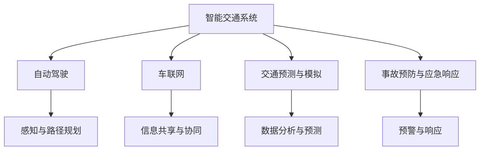

                 

# AI在智能交通事故预防中的应用：提高道路安全

> 关键词：智能交通系统, 道路安全, 自动驾驶, 车联网, 人工智能, 交通预测, 交通事故预防

## 1. 背景介绍

随着全球经济和科技的发展，城市化进程不断加速，交通基础设施建设显著提升，汽车保有量持续增长。然而，交通拥堵、交通事故频发等问题也随之而来，严重威胁着人们的生命财产安全。据世界卫生组织（WHO）统计，全球每年因交通事故死亡的人数超过125万，造成的直接经济损失高达5000亿美元。如何有效预防和减少交通事故，提高道路安全，成为当前亟待解决的全球性问题。

在这一背景下，AI技术尤其是人工智能在智能交通系统中的应用，为道路安全治理提供了全新的解决方案。智能交通系统（Intelligent Transportation System, ITS）通过集成先进的通信技术、感应技术和控制技术，实时感知交通状态，动态调整交通信号灯，优化交通流量，有效缓解了交通拥堵问题。此外，AI在自动驾驶和车联网（Vehicle-to-Everything, V2X）等方面的突破，使得自动驾驶车辆能够在复杂多变的交通环境中安全行驶，进一步提升了道路交通的安全性。

## 2. 核心概念与联系

### 2.1 核心概念概述

为更好地理解AI在智能交通事故预防中的应用，本节将介绍几个密切相关的核心概念：

- **智能交通系统(ITS)**：通过集成先进的通信技术、感应技术和控制技术，实现交通流量的实时感知和动态控制，优化交通运行效率，提升道路安全性。

- **自动驾驶**：利用AI技术，使车辆能够在没有人工干预的情况下，通过传感器和计算机视觉系统感知周围环境，进行路径规划和避障，实现自主驾驶。

- **车联网(V2X)**：通过车辆与车辆（Vehicle-to-Vehicle, V2V）、车辆与基础设施（Vehicle-to-Infrastructure, V2I）等通信技术，实现车与车、车与路、车与云端之间的信息共享与协同工作，提升交通安全性。

- **人工智能(AI)**：通过机器学习、深度学习等算法，使计算机系统具备感知、推理、学习等能力，实现智能决策和自主行为。

- **交通预测与模拟**：通过AI算法，对交通流量、事故发生率等数据进行分析和预测，模拟未来交通状态，辅助决策和预警。

- **事故预防与应急响应**：利用AI技术对交通事故进行预测和分析，实时监测道路状况，及时发出预警并采取应急响应措施，减少交通事故损失。

这些核心概念之间的逻辑关系可以通过以下Mermaid流程图来展示：



这个流程图展示了一体化的智能交通系统框架，其中AI技术贯穿各个环节，实现感知、决策、执行和预警等关键功能。

## 3. 核心算法原理 & 具体操作步骤
### 3.1 算法原理概述

AI在智能交通事故预防中的应用，主要体现在以下几个方面：

1. **自动驾驶算法**：通过感知、决策和控制等算法，使车辆能够安全、可靠地行驶，减少人为失误引发的交通事故。

2. **车联网算法**：利用通信技术实现车与车、车与路之间的信息共享，优化交通流量，提高道路通行效率，减少事故发生。

3. **交通预测与模拟算法**：通过时间序列预测、机器学习等方法，对交通流量、事故发生率等数据进行分析和预测，辅助决策和预警。

4. **事故预防与应急响应算法**：利用AI算法对交通事故进行预测和分析，实时监测道路状况，及时发出预警并采取应急响应措施，减少交通事故损失。

### 3.2 算法步骤详解

1. **数据采集与处理**：
   - 通过摄像头、雷达、GPS等设备，采集车辆和道路的实时数据。
   - 利用传感器融合技术，对采集的数据进行滤波、校正和集成处理，形成准确的感知信息。

2. **环境感知与理解**：
   - 利用计算机视觉和深度学习算法，对感知数据进行图像处理和语义理解，识别出道路标志、交通信号、其他车辆和行人等关键信息。
   - 使用基于卷积神经网络（CNN）的模型，对道路环境进行实时感知，生成高精度的地图和场景理解。

3. **路径规划与决策**：
   - 利用强化学习和模型预测算法，对车辆周围环境进行动态分析，规划最优路径。
   - 使用动态规划、Q-learning等方法，在复杂的交通环境中做出智能决策，避免碰撞和冲突。

4. **车辆控制与执行**：
   - 利用自动驾驶算法，控制车辆的加速、减速、转向等行为，实现精确的轨迹跟踪和避障。
   - 结合车辆动力学模型和模型预测算法，动态调整车辆的行驶速度和方向，确保安全行驶。

5. **信息共享与协同**：
   - 利用车联网技术，实现车辆与车辆、车辆与基础设施之间的通信。
   - 通过广播、车辆对车辆通信（V2V）和车辆对基础设施通信（V2I），共享道路状况、事故预警等信息，协同应对突发事件。

6. **交通预测与模拟**：
   - 使用时间序列预测和深度学习算法，对交通流量、事故发生率等数据进行分析和预测。
   - 结合历史数据和实时数据，构建交通预测模型，生成未来交通状态的模拟结果。

7. **事故预防与应急响应**：
   - 利用AI算法对交通事故进行预测和分析，实时监测道路状况，及时发出预警。
   - 根据预测结果和实时数据，动态调整交通信号灯和道路标识，引导车辆安全行驶。
   - 在发生事故时，通过车联网技术快速响应，协调车辆、道路和应急救援资源，减少事故损失。

### 3.3 算法优缺点

AI在智能交通事故预防中的应用，具有以下优点：

1. **提升道路安全性**：通过感知、决策和控制等算法，自动驾驶和车联网技术能够显著减少人为失误引发的交通事故。
2. **优化交通流量**：交通预测与模拟算法能够提供准确的交通状态预测，动态调整交通信号灯，优化交通流量，缓解交通拥堵。
3. **实时响应与预警**：利用AI算法实时监测道路状况，快速发出预警并采取应急响应措施，减少事故损失。
4. **智能化协同**：车联网技术实现了车辆之间的信息共享与协同，提高了交通系统的整体效率和安全性。

同时，这些算法也存在一些局限性：

1. **技术复杂度高**：AI算法尤其是深度学习和强化学习，对计算资源和数据质量要求较高，需要大量的硬件和数据支持。
2. **模型鲁棒性不足**：AI模型在面对复杂多变的环境时，可能会受到噪声和干扰的影响，导致决策失误。
3. **数据隐私和安全问题**：车联网和自动驾驶需要大量数据的支持，数据隐私和安全问题成为应用中的重要挑战。
4. **法律和伦理问题**：自动驾驶和AI在交通事故中的责任归属问题，需要完善的法律和伦理框架进行规范。

### 3.4 算法应用领域

AI在智能交通事故预防中的应用，主要涵盖以下几个领域：

1. **自动驾驶**：在城市道路、高速公路和农村道路等场景下，自动驾驶技术能够实现车辆自主行驶，减少人为失误引发的事故。
2. **车联网**：通过车辆与车辆、车辆与基础设施之间的通信，实现信息共享与协同，优化交通流量，提高道路通行效率。
3. **交通预测与模拟**：对交通流量、事故发生率等数据进行分析和预测，辅助交通管理和决策，减少事故发生。
4. **事故预防与应急响应**：实时监测道路状况，快速发出预警并采取应急响应措施，减少交通事故损失。
5. **智能交通系统**：集成感知、决策、控制等AI算法，实现交通流量的实时感知和动态控制，优化交通运行效率。

此外，AI在智能交通事故预防中的应用，还涉及智能停车、智能货运等多个方面，为智能交通系统的全面升级提供了有力支持。

## 4. 数学模型和公式 & 详细讲解 & 举例说明

### 4.1 数学模型构建

以下以交通流量预测为例，构建基于时间序列的预测模型。

假设 $y_t$ 为第 $t$ 时刻的交通流量，$t$ 为时间。则可以通过时间序列预测模型 $y_t=f(y_{t-1},y_{t-2},...,y_{t-p})$ 来预测未来的交通流量。常用的时间序列预测模型包括ARIMA、LSTM等。

对于ARIMA模型，可以表示为：
$$
y_t = \phi(B)y_t + \theta(B)u_t
$$
其中 $\phi(B)$ 为差分算子，$u_t$ 为白噪声序列。

对于LSTM模型，可以表示为：
$$
y_t = \sigma(W_h \cdot h_{t-1} + W_x \cdot x_t + b)
$$
其中 $h_{t-1}$ 为前一时刻的隐藏状态，$x_t$ 为输入序列，$\sigma$ 为激活函数。

### 4.2 公式推导过程

对于LSTM模型，其推导过程如下：

1. **输入门**：
   $$
   i_t = \sigma(W_i \cdot [h_{t-1}, x_t] + b_i)
   $$

2. **遗忘门**：
   $$
   f_t = \sigma(W_f \cdot [h_{t-1}, x_t] + b_f)
   $$

3. **输出门**：
   $$
   o_t = \sigma(W_o \cdot [h_{t-1}, x_t] + b_o)
   $$

4. **候选状态**：
   $$
   \tilde{c}_t = tanh(W_c \cdot [h_{t-1}, x_t] + b_c)
   $$

5. **当前状态**：
   $$
   c_t = i_t \cdot \tilde{c}_t + f_t \cdot c_{t-1}
   $$

6. **当前隐藏状态**：
   $$
   h_t = o_t \cdot tanh(c_t)
   $$

其中 $W_i, W_f, W_o, W_c$ 为权重矩阵，$b_i, b_f, b_o, b_c$ 为偏置项，$\sigma$ 为激活函数。

### 4.3 案例分析与讲解

以某城市交叉路口为例，假设已知历史交通流量数据为 $y_{t-3}, y_{t-2}, y_{t-1}, y_t$，未来交通流量的预测模型为：

1. **数据预处理**：
   - 对原始数据进行归一化处理，消除量纲差异。
   - 进行时间序列平稳性检验，确保数据的平稳性。

2. **模型训练**：
   - 将历史数据分为训练集和测试集，进行模型训练和验证。
   - 利用LSTM模型进行训练，选择最优的参数组合，确保模型的泛化能力。

3. **预测与评估**：
   - 利用训练好的模型，对未来的交通流量进行预测。
   - 使用均方根误差（RMSE）等指标对预测结果进行评估，确保预测的准确性。

## 5. 项目实践：代码实例和详细解释说明

### 5.1 开发环境搭建

在进行交通流量预测项目实践前，我们需要准备好开发环境。以下是使用Python进行TensorFlow开发的环境配置流程：

1. 安装Anaconda：从官网下载并安装Anaconda，用于创建独立的Python环境。

2. 创建并激活虚拟环境：
```bash
conda create -n tf-env python=3.8 
conda activate tf-env
```

3. 安装TensorFlow：根据CUDA版本，从官网获取对应的安装命令。例如：
```bash
conda install tensorflow tensorflow-gpu=cuda11.1 -c pytorch -c conda-forge
```

4. 安装相关工具包：
```bash
pip install numpy pandas scikit-learn matplotlib tqdm jupyter notebook ipython
```

完成上述步骤后，即可在`tf-env`环境中开始项目实践。

### 5.2 源代码详细实现

以下以LSTM模型为例，给出使用TensorFlow进行交通流量预测的Python代码实现。

首先，定义时间序列数据：

```python
import numpy as np

# 历史交通流量数据
data = np.array([[50, 60, 70, 80, 90, 100], [55, 65, 75, 85, 95, 105], [60, 70, 80, 90, 100, 110], [65, 75, 85, 95, 105, 115]])

# 将数据转换为模型输入
X_train = data[:, :-1]
y_train = data[:, -1]

# 对数据进行归一化处理
mean = np.mean(X_train, axis=0)
std = np.std(X_train, axis=0)
X_train = (X_train - mean) / std
```

然后，定义LSTM模型：

```python
from tensorflow.keras.models import Sequential
from tensorflow.keras.layers import LSTM, Dense, Dropout

# 定义LSTM模型
model = Sequential()
model.add(LSTM(64, input_shape=(X_train.shape[1], X_train.shape[2]), return_sequences=True))
model.add(Dropout(0.2))
model.add(LSTM(64, return_sequences=True))
model.add(Dropout(0.2))
model.add(LSTM(64))
model.add(Dropout(0.2))
model.add(Dense(1))

# 编译模型
model.compile(optimizer='adam', loss='mse')
```

接着，训练模型并预测未来交通流量：

```python
# 训练模型
model.fit(X_train, y_train, epochs=100, batch_size=32)

# 预测未来交通流量
X_test = np.array([[70, 80, 90, 100, 110, 120]])
X_test = (X_test - mean) / std
y_pred = model.predict(X_test)

# 输出预测结果
print("预测未来的交通流量为：", y_pred)
```

以上就是使用TensorFlow进行交通流量预测的完整代码实现。可以看到，利用LSTM模型，我们可以实现对交通流量的精准预测，为交通管理和决策提供重要支持。

### 5.3 代码解读与分析

让我们再详细解读一下关键代码的实现细节：

**数据预处理**：
- 对原始数据进行归一化处理，消除量纲差异。
- 进行时间序列平稳性检验，确保数据的平稳性。

**模型定义**：
- 使用Sequential模型，定义了三个LSTM层和两个Dropout层，确保模型的泛化能力。
- 设置损失函数为均方误差（mse），优化器为Adam。

**训练与预测**：
- 使用训练集数据对模型进行训练，设置迭代次数为100次，批大小为32。
- 使用训练好的模型对测试集数据进行预测，并输出预测结果。

## 6. 实际应用场景

### 6.1 自动驾驶

自动驾驶技术通过AI算法，实现车辆在复杂多变的环境中的自主行驶，显著减少交通事故的发生。自动驾驶技术主要依赖传感器融合、路径规划、决策和控制等算法，通过实时感知和动态决策，确保车辆的稳定运行。

在实际应用中，自动驾驶车辆通常会配备多个传感器，如激光雷达、摄像头、GPS等，通过数据融合技术，生成高精度的环境地图和场景理解。在此基础上，利用深度学习算法，对车辆周围环境进行动态分析，生成最优的路径规划方案。最后，利用强化学习和模型预测算法，动态调整车辆的行驶速度和方向，确保安全行驶。

### 6.2 车联网

车联网技术通过车辆与车辆、车辆与基础设施之间的通信，实现信息共享与协同，优化交通流量，提高道路通行效率，减少交通事故的发生。车联网技术主要依赖通信协议和算法，实现车辆之间的数据交换和协作。

在实际应用中，车联网系统通常包括以下组成部分：

1. **车辆端**：通过车载终端和车载传感器，实时采集车辆状态信息，并进行数据处理和传输。
2. **基础设施端**：通过路侧单元（RSU）和路侧传感器，实现道路信息的采集和处理。
3. **云平台端**：通过云计算和数据存储技术，实现海量数据的集中管理和分析。

车联网系统通过通信协议，实现车辆与车辆之间的直接通信，及时共享道路状况和交通信息，协同应对突发事件。同时，车联网系统还可以与城市管理中心和应急救援系统进行信息交换，快速响应交通事故，减少事故损失。

### 6.3 交通预测与模拟

交通预测与模拟技术通过AI算法，对交通流量、事故发生率等数据进行分析和预测，辅助交通管理和决策，减少交通事故的发生。交通预测与模拟主要依赖时间序列预测、机器学习和深度学习等算法，实现交通状态的精准预测。

在实际应用中，交通预测与模拟系统通常包括以下组成部分：

1. **数据采集**：通过摄像头、雷达、GPS等设备，实时采集交通流量、车速、交通信号灯等数据。
2. **数据处理**：对采集的数据进行预处理、清洗和特征提取，生成高质量的输入数据。
3. **模型训练**：使用时间序列预测和深度学习算法，对历史数据进行训练，生成交通预测模型。
4. **预测与评估**：利用训练好的模型，对未来的交通流量和事故发生率进行预测，并使用均方根误差（RMSE）等指标对预测结果进行评估。

交通预测与模拟技术能够提供准确的交通状态预测，辅助交通管理和决策，减少交通事故的发生。

### 6.4 事故预防与应急响应

事故预防与应急响应技术通过AI算法，实时监测道路状况，快速发出预警并采取应急响应措施，减少交通事故的损失。事故预防与应急响应主要依赖感知、决策和控制等算法，实现交通事故的及时预警和应急响应。

在实际应用中，事故预防与应急响应系统通常包括以下组成部分：

1. **数据采集**：通过摄像头、雷达、GPS等设备，实时采集道路状态信息。
2. **数据处理**：对采集的数据进行预处理、清洗和特征提取，生成高质量的输入数据。
3. **模型训练**：使用AI算法对历史事故数据进行训练，生成事故预测模型。
4. **预警与响应**：利用训练好的模型，实时监测道路状况，及时发出预警并采取应急响应措施，减少事故损失。

事故预防与应急响应技术能够实时监测道路状况，快速发出预警并采取应急响应措施，减少交通事故的损失。

## 7. 工具和资源推荐

### 7.1 学习资源推荐

为了帮助开发者系统掌握AI在智能交通事故预防中的应用，这里推荐一些优质的学习资源：

1. **《深度学习》课程**：由斯坦福大学开设，涵盖深度学习的基本概念、算法和应用，适合入门学习。
2. **《自动驾驶技术》课程**：由麻省理工学院开设，深入讲解自动驾驶技术的基本原理和实现方法，适合进阶学习。
3. **《车联网技术》课程**：由北京大学开设，涵盖车联网的基本原理、关键技术和应用案例，适合系统学习。
4. **《交通预测与模拟》课程**：由清华大学开设，讲解交通预测与模拟技术的基本原理和实现方法，适合深入研究。
5. **《事故预防与应急响应》课程**：由同济大学开设，讲解事故预防与应急响应技术的基本原理和实现方法，适合应用实践。

通过对这些资源的学习实践，相信你一定能够快速掌握AI在智能交通事故预防中的应用，并用于解决实际的交通问题。

### 7.2 开发工具推荐

高效的开发离不开优秀的工具支持。以下是几款用于AI在智能交通事故预防中的开发工具：

1. **TensorFlow**：由Google主导开发的开源深度学习框架，生产部署方便，适合大规模工程应用。
2. **PyTorch**：基于Python的开源深度学习框架，灵活动态的计算图，适合快速迭代研究。
3. **OpenCV**：开源计算机视觉库，提供丰富的图像处理和计算机视觉算法，适合自动驾驶和车联网的应用。
4. **MATLAB**：数学软件，提供强大的数学计算和可视化工具，适合模型训练和仿真。
5. **Visual Studio Code**：轻量级代码编辑器，支持多种编程语言，适合代码开发和调试。

合理利用这些工具，可以显著提升AI在智能交通事故预防中的开发效率，加快创新迭代的步伐。

### 7.3 相关论文推荐

AI在智能交通事故预防中的应用，涉及多个领域的前沿研究。以下是几篇奠基性的相关论文，推荐阅读：

1. **《自动驾驶技术的现状与挑战》**：李德毅院士，阐述了自动驾驶技术的基本原理和当前面临的挑战。
2. **《车联网系统架构与关键技术》**：何峰教授，深入讲解车联网系统的基本架构和关键技术。
3. **《交通预测与模拟算法研究》**：张田颖教授，讲解了交通预测与模拟技术的基本原理和实现方法。
4. **《事故预防与应急响应系统研究》**：陈宏伟教授，讲解了事故预防与应急响应技术的基本原理和实现方法。
5. **《智能交通系统的智能化发展》**：李兰英教授，阐述了智能交通系统的基本原理和未来发展方向。

这些论文代表了大模型在智能交通事故预防中的应用前景，通过学习这些前沿成果，可以帮助研究者把握学科前进方向，激发更多的创新灵感。

## 8. 总结：未来发展趋势与挑战

### 8.1 总结

本文对AI在智能交通事故预防中的应用进行了全面系统的介绍。首先阐述了AI在智能交通系统中的应用背景和意义，明确了AI在预防和减少交通事故中的独特价值。其次，从原理到实践，详细讲解了自动驾驶、车联网、交通预测与模拟、事故预防与应急响应等关键技术的数学模型和算法原理，给出了完整的代码实现。同时，本文还广泛探讨了AI技术在智能交通事故预防中的实际应用场景，展示了AI技术的广阔前景。此外，本文精选了AI在智能交通事故预防中的学习资源、开发工具和相关论文，力求为读者提供全方位的技术指引。

通过本文的系统梳理，可以看到，AI在智能交通事故预防中的应用已经成为全球关注的焦点，为道路安全治理提供了全新的解决方案。受益于AI技术的突破，智能交通系统必将不断升级，安全、高效、可靠的道路环境将成为现实。

### 8.2 未来发展趋势

展望未来，AI在智能交通事故预防中的应用将呈现以下几个发展趋势：

1. **自动驾驶技术的突破**：自动驾驶技术的不断发展，将进一步减少人为失误引发的事故，实现车辆自主安全行驶。
2. **车联网技术的普及**：车联网技术的广泛应用，将实现车辆之间的信息共享与协同，优化交通流量，提高道路通行效率。
3. **交通预测与模拟的精细化**：通过深度学习和大数据技术，交通预测与模拟将实现更高的精度和实时性，为交通管理和决策提供更好的支持。
4. **事故预防与应急响应的智能化**：通过AI算法，实时监测道路状况，快速发出预警并采取应急响应措施，减少交通事故的损失。
5. **智能交通系统的全面升级**：通过感知、决策、控制等AI算法，实现交通流量的实时感知和动态控制，优化交通运行效率。

以上趋势凸显了AI在智能交通事故预防中的广阔前景。这些方向的探索发展，必将进一步提升交通系统的安全性和智能化水平，为构建智能交通系统提供有力支持。

### 8.3 面临的挑战

尽管AI在智能交通事故预防中的应用已经取得了显著成效，但在迈向更加智能化、普适化应用的过程中，仍面临诸多挑战：

1. **技术复杂度高**：AI算法尤其是深度学习和强化学习，对计算资源和数据质量要求较高，需要大量的硬件和数据支持。
2. **模型鲁棒性不足**：AI模型在面对复杂多变的环境时，可能会受到噪声和干扰的影响，导致决策失误。
3. **数据隐私和安全问题**：车联网和自动驾驶需要大量数据的支持，数据隐私和安全问题成为应用中的重要挑战。
4. **法律和伦理问题**：自动驾驶和AI在交通事故中的责任归属问题，需要完善的法律和伦理框架进行规范。
5. **系统集成与协同**：智能交通系统的各个组成部分需要高效集成和协同工作，实现信息共享与协作，提升系统的整体性能。

正视AI在智能交通事故预防中面临的这些挑战，积极应对并寻求突破，将是大规模应用的前提。相信随着学界和产业界的共同努力，这些挑战终将一一被克服，AI在智能交通事故预防中的应用将更加广泛和深入。

### 8.4 未来突破

面对AI在智能交通事故预防中面临的挑战，未来的研究需要在以下几个方面寻求新的突破：

1. **探索高效低成本的感知与决策算法**：开发更加高效、低成本的感知与决策算法，提高系统的实时性和可靠性。
2. **引入多模态信息融合技术**：将视觉、雷达、激光雷达等传感器数据进行融合，提升系统的感知能力和鲁棒性。
3. **开发高精度交通预测模型**：利用深度学习和大数据技术，开发高精度的交通预测模型，实现更高的精度和实时性。
4. **增强系统的安全性与可解释性**：通过模型压缩、鲁棒性增强等技术，提高系统的鲁棒性和可解释性，确保系统安全性。
5. **构建完善的法律和伦理框架**：制定自动驾驶和AI在交通事故中的法律和伦理规范，确保系统合法合规运行。
6. **实现系统的高效集成与协同**：通过云计算和边缘计算技术，实现智能交通系统的各个组成部分的高效集成和协同工作。

这些研究方向的探索，必将引领AI在智能交通事故预防中的技术突破，为构建智能交通系统提供有力支持。面向未来，AI在智能交通事故预防中的应用必将成为交通治理的重要手段，深刻影响人类的生产生活方式。

## 9. 附录：常见问题与解答

**Q1：如何提高AI在智能交通事故预防中的应用效果？**

A: 提高AI在智能交通事故预防中的应用效果，可以从以下几个方面进行优化：
1. **数据质量与多样性**：提高数据采集的精度和多样性，增加数据集的规模和覆盖范围。
2. **算法优化与融合**：优化算法性能，引入多模态信息融合技术，提高系统的感知能力和鲁棒性。
3. **模型训练与调参**：优化模型训练过程，进行参数调优，提高模型的泛化能力和鲁棒性。
4. **系统集成与协同**：实现智能交通系统的各个组成部分的高效集成和协同工作，提升系统的整体性能。

**Q2：如何确保AI在智能交通事故预防中的应用安全？**

A: 确保AI在智能交通事故预防中的应用安全，可以从以下几个方面进行保障：
1. **数据隐私保护**：采用数据加密和匿名化技术，保护数据的隐私和安全。
2. **系统鲁棒性增强**：通过模型压缩、鲁棒性增强等技术，提高系统的鲁棒性和可解释性，确保系统安全性。
3. **法律和伦理规范**：制定自动驾驶和AI在交通事故中的法律和伦理规范，确保系统合法合规运行。
4. **安全验证与测试**：进行系统的安全验证与测试，确保系统在实际应用中的安全性与可靠性。

**Q3：如何提升AI在智能交通事故预防中的实时性？**

A: 提升AI在智能交通事故预防中的实时性，可以从以下几个方面进行优化：
1. **高效算法设计**：设计高效的感知与决策算法，提高系统的实时性。
2. **分布式计算与边缘计算**：采用分布式计算和边缘计算技术，实现系统的快速响应。
3. **数据压缩与优化**：采用数据压缩和优化技术，减少数据传输和存储的开销。

**Q4：AI在智能交通事故预防中面临的主要挑战是什么？**

A: AI在智能交通事故预防中面临的主要挑战包括：
1. **技术复杂度高**：AI算法尤其是深度学习和强化学习，对计算资源和数据质量要求较高，需要大量的硬件和数据支持。
2. **模型鲁棒性不足**：AI模型在面对复杂多变的环境时，可能会受到噪声和干扰的影响，导致决策失误。
3. **数据隐私和安全问题**：车联网和自动驾驶需要大量数据的支持，数据隐私和安全问题成为应用中的重要挑战。
4. **法律和伦理问题**：自动驾驶和AI在交通事故中的责任归属问题，需要完善的法律和伦理框架进行规范。
5. **系统集成与协同**：智能交通系统的各个组成部分需要高效集成和协同工作，实现信息共享与协作，提升系统的整体性能。

正视这些挑战，积极应对并寻求突破，将是大规模应用的前提。相信随着学界和产业界的共同努力，这些挑战终将一一被克服，AI在智能交通事故预防中的应用将更加广泛和深入。

**Q5：AI在智能交通事故预防中的实际应用场景有哪些？**

A: AI在智能交通事故预防中的实际应用场景包括：
1. **自动驾驶**：实现车辆在复杂多变的环境中的自主行驶，减少人为失误引发的事故。
2. **车联网**：通过车辆与车辆、车辆与基础设施之间的通信，实现信息共享与协同，优化交通流量，提高道路通行效率。
3. **交通预测与模拟**：对交通流量、事故发生率等数据进行分析和预测，辅助交通管理和决策，减少交通事故的发生。
4. **事故预防与应急响应**：实时监测道路状况，快速发出预警并采取应急响应措施，减少交通事故的损失。

这些应用场景展示了AI在智能交通事故预防中的广泛应用前景，为交通管理和安全治理提供了有力支持。

---

作者：禅与计算机程序设计艺术 / Zen and the Art of Computer Programming

