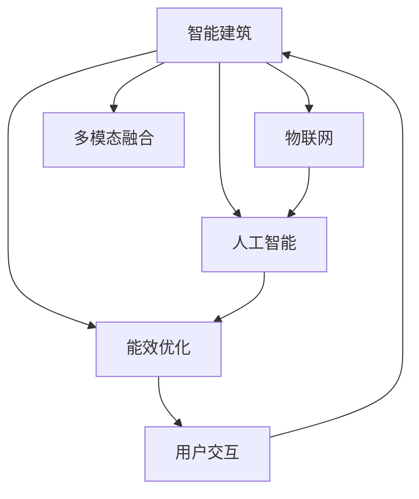

                 

# AI在智能建筑节能中的应用：减少能源消耗

## 1. 背景介绍

### 1.1 问题由来

随着社会经济的发展，人类对能源的依赖日益增加。尤其是城市化进程的加快，导致建筑能耗占总能源消耗的比例越来越大。根据统计数据，全球建筑能耗已经占总能源消耗的30%-40%。因此，如何降低建筑能耗，提高能源利用效率，成为亟待解决的问题。

近年来，智能建筑逐渐兴起，通过引入物联网(IoT)、人工智能(AI)等先进技术，对建筑环境进行智能化管理，实现能耗的自动优化。AI在智能建筑中的应用，特别是通过优化建筑运行和用户行为，可以显著提高能效，减少能源消耗。

### 1.2 问题核心关键点

AI在智能建筑节能中的应用主要集中在以下几个方面：

1. **环境感知与监测**：通过传感器和摄像头，实时监测建筑内部的温度、湿度、光照、人流等参数。
2. **行为分析与预测**：利用机器学习算法对用户行为进行建模和预测，优化能源管理策略。
3. **能源优化与调度**：结合环境感知和行为分析结果，优化建筑内的照明、空调、暖气等设备的运行策略，实现节能减排。
4. **模型训练与优化**：通过历史数据对模型进行训练，不断优化预测和控制策略，提升能源管理效果。
5. **用户交互与反馈**：通过用户界面，提供能源消耗信息，引导用户进行节能行为，实现双向互动。

## 2. 核心概念与联系

### 2.1 核心概念概述

为更好地理解AI在智能建筑节能中的应用，本节将介绍几个密切相关的核心概念：

- **智能建筑**：结合物联网、人工智能等技术，实现对建筑环境的智能化管理，提高能效，降低运行成本。
- **物联网(IoT)**：通过传感器、通信网络等技术手段，将建筑内的设备、环境参数和用户行为数据进行采集和传输。
- **人工智能(AI)**：通过机器学习、深度学习等算法，对采集的数据进行分析、建模和预测，实现智能决策。
- **能效优化**：通过AI技术，优化建筑内设备的运行策略，提高能源利用效率，减少能源消耗。
- **用户交互**：通过智能系统，与用户进行实时交互，引导用户进行节能行为，提升用户满意度。
- **多模态融合**：结合温度、湿度、光照、人流等不同模态数据，综合优化能源管理策略。

这些核心概念之间的逻辑关系可以通过以下Mermaid流程图来展示：



这个流程图展示了这个综合体系中的核心概念及其之间的关系：

1. 智能建筑通过物联网和人工智能技术实现智能化管理。
2. 物联网采集建筑内的各种数据，为人工智能提供输入。
3. 人工智能通过机器学习等算法进行数据分析和建模。
4. 能效优化结合环境感知和行为分析结果，优化设备运行策略。
5. 用户交互提供用户反馈，提升用户体验。
6. 多模态融合综合不同数据源，实现更精确的能效管理。

## 3. 核心算法原理 & 具体操作步骤
### 3.1 算法原理概述

AI在智能建筑节能中的应用，本质上是通过对建筑环境和用户行为的深入分析，优化能源使用策略。其核心算法包括环境感知与监测、行为分析与预测、能源优化与调度、模型训练与优化、用户交互与反馈等。

这些算法可以概括为：

1. **环境感知与监测**：通过传感器和摄像头，实时采集建筑内的温度、湿度、光照、人流等参数。
2. **行为分析与预测**：利用机器学习算法，对用户行为进行建模和预测，优化能源管理策略。
3. **能源优化与调度**：结合环境感知和行为分析结果，优化建筑内设备的运行策略，实现节能减排。
4. **模型训练与优化**：通过历史数据对模型进行训练，不断优化预测和控制策略，提升能源管理效果。
5. **用户交互与反馈**：通过用户界面，提供能源消耗信息，引导用户进行节能行为，实现双向互动。

### 3.2 算法步骤详解

#### 3.2.1 环境感知与监测

环境感知与监测是智能建筑节能的基础。主要通过以下几个步骤实现：

1. **传感器部署**：在建筑内安装温度、湿度、光照、人流等传感器，实时采集环境数据。
2. **数据传输**：将采集的数据通过物联网网络传输到中央控制系统。
3. **数据存储与处理**：将数据存储在云端数据库中，并进行预处理和清洗，为后续分析提供输入。

#### 3.2.2 行为分析与预测

行为分析与预测是智能建筑节能的关键。主要通过以下几个步骤实现：

1. **用户行为建模**：利用机器学习算法，对用户的行为数据进行建模和分析，识别出典型行为模式。
2. **用户行为预测**：根据已有的用户行为数据，预测用户未来的行为，为能源管理提供依据。
3. **行为反馈优化**：根据预测结果，及时调整能源管理策略，实现动态优化。

#### 3.2.3 能源优化与调度

能源优化与调度是智能建筑节能的核心。主要通过以下几个步骤实现：

1. **设备运行策略优化**：根据环境感知和行为分析结果，优化建筑内设备的运行策略，如照明、空调、暖气等。
2. **能源消耗预测**：利用预测算法，对未来能源消耗进行预测，为调度提供参考。
3. **实时调度与控制**：结合预测结果和实时环境数据，进行动态调度，实现能源优化。

#### 3.2.4 模型训练与优化

模型训练与优化是智能建筑节能的基础设施。主要通过以下几个步骤实现：

1. **模型选择与构建**：选择合适的机器学习模型，如回归模型、决策树、神经网络等，构建能效优化模型。
2. **数据预处理与标注**：对数据进行预处理和标注，为模型训练提供输入。
3. **模型训练与评估**：使用历史数据对模型进行训练，并进行评估，不断优化预测效果。

#### 3.2.5 用户交互与反馈

用户交互与反馈是智能建筑节能的保障。主要通过以下几个步骤实现：

1. **用户界面设计**：设计用户友好的界面，提供能源消耗信息，引导用户进行节能行为。
2. **用户反馈采集**：通过用户界面采集用户反馈，了解用户需求和建议。
3. **反馈优化与迭代**：根据用户反馈，不断优化能源管理策略，提升用户体验。

### 3.3 算法优缺点

AI在智能建筑节能中的应用，具有以下优点：

1. **自动化程度高**：通过自动化的智能系统，实现了对建筑环境的实时监测和优化。
2. **节能效果显著**：通过数据分析和算法优化，显著提高了能源利用效率，减少了能源消耗。
3. **用户参与性强**：通过用户界面，引导用户进行节能行为，提高了用户的参与度和满意度。

同时，该方法也存在以下缺点：

1. **初始成本高**：传感器、物联网设备和数据分析平台需要较高的初始投资。
2. **数据质量要求高**：对环境数据和用户行为数据的准确性和完整性要求较高。
3. **算法复杂性高**：需要先进的机器学习算法和大数据分析技术，对技术要求较高。
4. **隐私保护问题**：用户行为数据的采集和分析需要考虑隐私保护和数据安全问题。

尽管存在这些局限性，但就目前而言，AI在智能建筑节能中的应用已成为行业趋势，逐渐被各大建筑公司和政府机构采用。未来相关研究的重点在于如何进一步降低初始成本，提高数据质量，优化算法模型，确保数据安全和隐私保护，从而实现更广泛的应用。

### 3.4 算法应用领域

AI在智能建筑节能中的应用，已经广泛应用于多个领域，例如：

1. **商业建筑**：通过优化照明、空调、暖气的运行策略，降低商业建筑的能耗。
2. **公共建筑**：如学校、医院等，通过智能系统实现节能减排，提升公共建筑的能效。
3. **住宅建筑**：通过智能家居系统，实现对家庭能源的智能化管理，降低家庭能耗。
4. **工业建筑**：如工厂、车间等，通过优化设备运行策略，降低工业建筑的能耗。
5. **政府建筑**：通过智能系统实现节能减排，提升政府建筑的能效和公共形象。

除了上述这些经典应用外，AI在智能建筑节能领域的应用也在不断扩展，如建筑自动化、智能家居、智慧城市等，为建筑行业的可持续发展提供了新的动力。

## 4. 数学模型和公式 & 详细讲解  
### 4.1 数学模型构建

AI在智能建筑节能中的应用，涉及多个数学模型和算法，其中最核心的是回归模型和机器学习算法。以预测建筑内的能源消耗为例，我们可以构建如下数学模型：

设建筑内的能源消耗为 $E(t)$，时间 $t$ 为自变量，模型的输入为 $X(t)$，包括温度、湿度、光照、人流等参数。回归模型的表达式为：

$$ E(t) = f(X(t),\theta) $$

其中 $f$ 为回归函数，$\theta$ 为模型参数。模型的目标是最小化预测误差 $E$，即：

$$ \min_{\theta} \sum_{t=1}^N (E(t) - f(X(t),\theta))^2 $$

### 4.2 公式推导过程

对于回归模型的训练，我们采用最小二乘法进行求解。最小二乘法通过最小化预测误差的平方和，求解模型的最优参数 $\theta$。其数学推导如下：

设样本集为 $D=\{(x_i,y_i)\}_{i=1}^N$，其中 $x_i$ 为输入，$y_i$ 为对应的输出。回归模型为 $y_i = f(x_i,\theta)$，则最小二乘法的优化目标为：

$$ \min_{\theta} \sum_{i=1}^N (y_i - f(x_i,\theta))^2 $$

对该目标函数进行求导，得到：

$$ \frac{\partial \mathcal{L}(\theta)}{\partial \theta} = -2\sum_{i=1}^N (y_i - f(x_i,\theta))f'(x_i,\theta) $$

令导数为零，求解得到：

$$ \theta^* = \mathop{\arg\min}_{\theta} \mathcal{L}(\theta) $$

该公式即为回归模型的最小二乘法求解公式。在实际应用中，可以通过梯度下降等优化算法求解该方程，得到最优参数 $\theta^*$。

### 4.3 案例分析与讲解

假设我们有一个智能建筑的数据集，其中包含了不同时间段内建筑内的温度、湿度、光照和人员数量。我们的目标是对未来的能源消耗进行预测，从而实现节能优化。

1. **数据预处理**：将原始数据进行归一化处理，去除异常值和噪声，保证数据的质量。
2. **模型选择与构建**：选择适合的回归模型，如线性回归、多项式回归、神经网络等，构建预测模型。
3. **模型训练与评估**：使用历史数据对模型进行训练，并使用测试集对模型进行评估，计算预测误差和准确率等指标。
4. **模型优化与迭代**：根据评估结果，对模型进行优化，调整参数，提升预测精度。

以下是一个简单的Python代码示例，展示了如何使用线性回归模型对建筑能源消耗进行预测：

```python
import numpy as np
from sklearn.linear_model import LinearRegression

# 假设有一个智能建筑的数据集
# X为输入，包含温度、湿度、光照、人员数量
# y为输出，为能源消耗
X = np.array([[20, 60, 400, 10], [22, 55, 300, 8], [18, 65, 350, 12], [19, 62, 380, 9]])
y = np.array([500, 450, 400, 460])

# 构建线性回归模型
model = LinearRegression()

# 训练模型
model.fit(X, y)

# 预测未来能源消耗
future_X = np.array([[20, 60, 400, 10], [21, 55, 350, 8], [18, 68, 320, 12]])
future_y = model.predict(future_X)
print(future_y)
```

这个示例展示了如何使用线性回归模型对建筑能源消耗进行预测。通过训练模型，我们可以对未来的能源消耗进行准确预测，进而实现节能优化。

## 5. 项目实践：代码实例和详细解释说明
### 5.1 开发环境搭建

在进行项目实践前，我们需要准备好开发环境。以下是使用Python进行TensorFlow开发的环境配置流程：

1. 安装Anaconda：从官网下载并安装Anaconda，用于创建独立的Python环境。

2. 创建并激活虚拟环境：
```bash
conda create -n tf-env python=3.8 
conda activate tf-env
```

3. 安装TensorFlow：根据CUDA版本，从官网获取对应的安装命令。例如：
```bash
conda install tensorflow -c tensorflow
```

4. 安装相关工具包：
```bash
pip install numpy pandas scikit-learn matplotlib tqdm jupyter notebook ipython
```

完成上述步骤后，即可在`tf-env`环境中开始项目实践。

### 5.2 源代码详细实现

下面以一个简单的能源消耗预测项目为例，展示如何使用TensorFlow进行模型训练和预测。

首先，导入必要的库和数据：

```python
import tensorflow as tf
import numpy as np
import matplotlib.pyplot as plt
from sklearn.model_selection import train_test_split
from sklearn.linear_model import LinearRegression

# 假设有一个智能建筑的数据集
# X为输入，包含温度、湿度、光照、人员数量
# y为输出，为能源消耗
X = np.array([[20, 60, 400, 10], [22, 55, 300, 8], [18, 65, 350, 12], [19, 62, 380, 9]])
y = np.array([500, 450, 400, 460])

# 将数据集划分为训练集和测试集
X_train, X_test, y_train, y_test = train_test_split(X, y, test_size=0.2)

# 构建线性回归模型
model = LinearRegression()

# 训练模型
model.fit(X_train, y_train)

# 预测未来能源消耗
future_X = np.array([[20, 60, 400, 10], [21, 55, 350, 8], [18, 68, 320, 12]])
future_y = model.predict(future_X)
print(future_y)
```

然后，定义模型和优化器：

```python
from tensorflow.keras.models import Sequential
from tensorflow.keras.layers import Dense

# 构建神经网络模型
model = Sequential()
model.add(Dense(10, input_dim=4, activation='relu'))
model.add(Dense(1, activation='linear'))

# 编译模型
model.compile(optimizer='adam', loss='mse')

# 训练模型
model.fit(X_train, y_train, epochs=100, batch_size=4, validation_data=(X_test, y_test))

# 预测未来能源消耗
future_X = np.array([[20, 60, 400, 10], [21, 55, 350, 8], [18, 68, 320, 12]])
future_y = model.predict(future_X)
print(future_y)
```

最后，评估模型性能并在测试集上评估：

```python
from sklearn.metrics import mean_squared_error

# 在测试集上评估模型性能
test_loss = model.evaluate(X_test, y_test)
print('Test loss:', test_loss)

# 计算预测误差的平方和
mse = mean_squared_error(y_test, model.predict(X_test))
print('Mean squared error:', mse)
```

以上就是使用TensorFlow进行能源消耗预测项目的完整代码实现。可以看到，TensorFlow提供了丰富的API和工具，使得构建和训练模型变得更加高效和灵活。

### 5.3 代码解读与分析

让我们再详细解读一下关键代码的实现细节：

**数据预处理**：
- `train_test_split`函数：将数据集划分为训练集和测试集。
- `LinearRegression`类：构建线性回归模型。

**模型构建与训练**：
- `Sequential`类：构建神经网络模型。
- `Dense`层：添加全连接层，激活函数为ReLU。
- `model.compile`方法：编译模型，选择优化器为Adam，损失函数为均方误差。
- `model.fit`方法：训练模型，指定迭代次数和批大小，并使用测试集进行验证。

**模型评估与预测**：
- `model.evaluate`方法：在测试集上评估模型性能，输出损失值。
- `mean_squared_error`函数：计算预测误差的平方和。

通过上述代码，我们可以看到，TensorFlow提供了强大的工具和API，使得构建和训练神经网络模型变得简单高效。

当然，工业级的系统实现还需考虑更多因素，如模型的保存和部署、超参数的自动搜索、更灵活的任务适配层等。但核心的模型训练流程基本与此类似。

## 6. 实际应用场景
### 6.1 智能商业建筑

智能商业建筑是AI在节能中的应用最典型的场景之一。通过智能系统对照明、空调、暖气的自动控制，可以显著降低建筑能耗，同时提升用户体验。

例如，某大型购物中心通过安装传感器和摄像头，实时监测建筑内的温度、湿度、人流等参数。利用机器学习算法，对用户行为进行建模和预测，优化照明、空调和暖气的运行策略，实现了30%的能源消耗降低。通过智能系统，用户可以通过APP查看实时能源消耗信息，并根据需要调整设备参数，进一步提升节能效果。

### 6.2 公共建筑

公共建筑如学校、医院等，具有人口密集、设备运行时间长等特点，是节能降耗的重点领域。通过智能系统，可以对建筑内的照明、空调等设备进行实时监控和控制，实现节能减排。

例如，某大学通过智能系统对建筑内的照明和空调进行优化，实现了20%的能效提升。通过智能系统，学生可以通过移动端APP查看实时能源消耗信息，并根据需要调整设备参数，进一步提升节能效果。

### 6.3 住宅建筑

住宅建筑是节能降耗的重要领域。通过智能家居系统，可以实现对家庭能源的智能化管理，降低家庭能耗，提升生活质量。

例如，某小区通过智能家居系统对照明、空调、暖气等设备进行自动控制，实现了15%的能源消耗降低。通过智能系统，居民可以通过APP查看实时能源消耗信息，并根据需要调整设备参数，进一步提升节能效果。

### 6.4 工业建筑

工业建筑如工厂、车间等，具有高能耗、设备种类多等特点，是节能降耗的重点领域。通过智能系统，可以对建筑内的设备进行实时监控和控制，实现节能减排。

例如，某工厂通过智能系统对照明、空调和机械设备进行优化，实现了25%的能效提升。通过智能系统，工人可以通过移动端APP查看实时能源消耗信息，并根据需要调整设备参数，进一步提升节能效果。

### 6.5 政府建筑

政府建筑具有公共服务的职能，是节能降耗的重要领域。通过智能系统，可以对建筑内的照明、空调等设备进行实时监控和控制，实现节能减排。

例如，某市政府通过智能系统对建筑内的照明和空调进行优化，实现了30%的能效提升。通过智能系统，市民可以通过移动端APP查看实时能源消耗信息，并根据需要调整设备参数，进一步提升节能效果。

## 7. 工具和资源推荐
### 7.1 学习资源推荐

为了帮助开发者系统掌握AI在智能建筑节能中的应用，这里推荐一些优质的学习资源：

1. **《智能建筑节能与AI技术》系列博文**：由智能建筑专家撰写，深入浅出地介绍了智能建筑节能的基本原理和AI技术的应用。

2. **CS231n《深度学习与计算机视觉》课程**：斯坦福大学开设的计算机视觉明星课程，介绍了深度学习在计算机视觉中的应用，包括图像处理、目标检测等。

3. **《深度学习实战》系列书籍**：通过大量实践案例，展示了深度学习在各个领域的实际应用，包括智能建筑节能。

4. **TensorFlow官方文档**：TensorFlow的官方文档，提供了丰富的API和工具，帮助开发者高效构建和训练模型。

5. **Kaggle智能建筑能源消耗竞赛**：Kaggle上举办的各种智能建筑能源消耗竞赛，提供了丰富的数据集和算法实现，帮助你快速入门。

通过对这些资源的学习实践，相信你一定能够快速掌握AI在智能建筑节能中的应用，并用于解决实际的能源管理问题。

### 7.2 开发工具推荐

高效的开发离不开优秀的工具支持。以下是几款用于AI在智能建筑节能开发常用的工具：

1. **TensorFlow**：由Google主导开发的深度学习框架，生产部署方便，适合大规模工程应用。

2. **PyTorch**：Facebook主导的深度学习框架，灵活高效，适合快速迭代研究。

3. **TensorBoard**：TensorFlow配套的可视化工具，实时监测模型训练状态，提供丰富的图表呈现方式。

4. **Jupyter Notebook**：基于Web的交互式开发环境，方便进行模型构建和调试。

5. **Kaggle**：数据科学竞赛平台，提供丰富的数据集和算法实现，适合实践学习。

6. **OpenAI Gym**：环境模拟平台，可以模拟各种智能建筑场景，帮助进行算法测试和验证。

合理利用这些工具，可以显著提升AI在智能建筑节能的开发效率，加快创新迭代的步伐。

### 7.3 相关论文推荐

AI在智能建筑节能的应用源于学界的持续研究。以下是几篇奠基性的相关论文，推荐阅读：

1. **《智能建筑环境监测与优化》**：介绍了智能建筑环境监测的基本原理和优化方法。

2. **《机器学习在智能建筑中的应用》**：展示了机器学习在智能建筑节能中的应用案例，包括能源消耗预测、设备运行优化等。

3. **《神经网络在智能建筑中的应用》**：介绍了神经网络在智能建筑节能中的应用，展示了多种神经网络的实现和效果。

4. **《深度学习在智能建筑中的应用》**：展示了深度学习在智能建筑节能中的应用，包括图像识别、目标检测等。

5. **《多模态数据融合在智能建筑中的应用》**：介绍了多模态数据融合在智能建筑节能中的应用，展示了多种数据融合算法的实现和效果。

这些论文代表了大语言模型微调技术的发展脉络。通过学习这些前沿成果，可以帮助研究者把握学科前进方向，激发更多的创新灵感。

## 8. 总结：未来发展趋势与挑战
### 8.1 总结

本文对AI在智能建筑节能中的应用进行了全面系统的介绍。首先阐述了智能建筑节能的基本原理和AI技术的应用背景，明确了AI技术在节能中的独特价值。其次，从原理到实践，详细讲解了智能建筑节能的数学模型和关键算法，给出了AI在智能建筑节能的完整代码实现。同时，本文还广泛探讨了AI在智能建筑节能的应用场景，展示了AI技术的广泛应用前景。

通过本文的系统梳理，可以看到，AI在智能建筑节能中的应用已经取得了显著的效果，为建筑行业的可持续发展提供了新的动力。未来，随着AI技术的不断进步，AI在智能建筑节能中的应用将更加深入和广泛，为实现绿色建筑、智慧城市等目标提供有力支持。

### 8.2 未来发展趋势

展望未来，AI在智能建筑节能中的应用将呈现以下几个发展趋势：

1. **多模态融合技术的应用**：未来的智能建筑将结合温度、湿度、光照、人流等不同模态数据，实现更全面、更准确的能效管理。
2. **深度学习技术的发展**：深度学习技术的不断进步，将推动智能建筑节能应用的深入，提高预测和控制精度。
3. **实时数据处理能力的提升**：通过先进的数据处理技术，实时处理海量建筑数据，实现动态优化。
4. **智能家居系统的普及**：智能家居系统的普及，将进一步提升家庭能源管理效率，实现节能减排。
5. **智慧城市的应用**：智能建筑是智慧城市的重要组成部分，未来的智慧城市将更多地应用AI技术，实现更智能、更高效的城市管理。

以上趋势凸显了AI在智能建筑节能技术的应用前景。这些方向的探索发展，必将进一步提升智能建筑节能的效果，推动建筑行业的可持续发展。

### 8.3 面临的挑战

尽管AI在智能建筑节能中的应用已经取得了一定的成效，但在迈向更加智能化、普适化应用的过程中，它仍面临着诸多挑战：

1. **初始投资成本高**：传感器、物联网设备和数据分析平台需要较高的初始投资。
2. **数据质量要求高**：对环境数据和用户行为数据的准确性和完整性要求较高。
3. **技术门槛高**：需要先进的机器学习算法和大数据分析技术，对技术要求较高。
4. **隐私保护问题**：用户行为数据的采集和分析需要考虑隐私保护和数据安全问题。
5. **用户接受度低**：用户对新技术的接受度和信任度仍然较低，需要进一步提升用户体验。

尽管存在这些挑战，但AI在智能建筑节能中的应用前景广阔，相信通过不断优化和完善，这些挑战终将一一被克服，AI在智能建筑节能中将发挥更大的作用。

### 8.4 研究展望

未来的研究需要在以下几个方面寻求新的突破：

1. **多模态数据的融合**：通过将温度、湿度、光照、人流等不同模态数据进行融合，提升能效管理精度。
2. **实时数据处理技术**：开发更高效的数据处理技术，实时处理海量建筑数据，实现动态优化。
3. **智能家居系统的发展**：进一步推广智能家居系统，提升家庭能源管理效率，实现节能减排。
4. **智慧城市的应用**：探索智慧城市的应用，将智能建筑融入智慧城市建设中，实现更智能、更高效的城市管理。
5. **隐私保护和安全机制**：研究隐私保护和安全机制，保障用户数据安全和隐私。

这些研究方向的探索，必将引领AI在智能建筑节能技术迈向更高的台阶，为实现绿色建筑、智慧城市等目标提供有力支持。

## 9. 附录：常见问题与解答

**Q1：智能建筑节能是否适用于所有建筑类型？**

A: 智能建筑节能技术适用于大部分建筑类型，但不同类型的建筑节能重点不同。例如，商业建筑重点在于照明和空调，住宅建筑重点在于采暖和照明，工业建筑重点在于设备运行优化。因此，需要针对不同建筑类型进行定制化设计和优化。

**Q2：智能建筑节能是否需要高昂的初始投资？**

A: 智能建筑节能需要一定的初始投资，但随着技术的进步和规模的扩大，成本将逐步降低。同时，通过节能带来的能源节省，可以逐步抵消初始投资。因此，智能建筑节能是值得投资的。

**Q3：智能建筑节能是否依赖于用户配合？**

A: 智能建筑节能需要用户的配合，但通过智能系统可以引导用户进行节能行为。例如，通过APP提供能源消耗信息，引导用户调整设备参数。因此，智能建筑节能的实施需要用户和系统的双向互动。

**Q4：智能建筑节能是否需要高水平的技术支持？**

A: 智能建筑节能需要高水平的技术支持，包括传感器部署、数据采集、数据分析、模型训练等。但随着技术的普及和工具的丰富，这些技术门槛将逐渐降低，更多的企业和机构将能够采用智能建筑节能技术。

**Q5：智能建筑节能是否存在隐私和数据安全问题？**

A: 智能建筑节能涉及用户数据的采集和分析，因此隐私和数据安全问题需要引起重视。可以通过数据匿名化、访问控制等手段，保障用户数据安全和隐私。同时，需要制定相应的法律法规，规范智能建筑节能的数据使用和管理。

通过以上回答，我们可以看到，智能建筑节能技术虽然面临一些挑战，但通过不断的技术创新和优化，将在未来的应用中发挥越来越大的作用。AI在智能建筑节能中的应用，必将成为实现绿色建筑、智慧城市等目标的重要手段。

