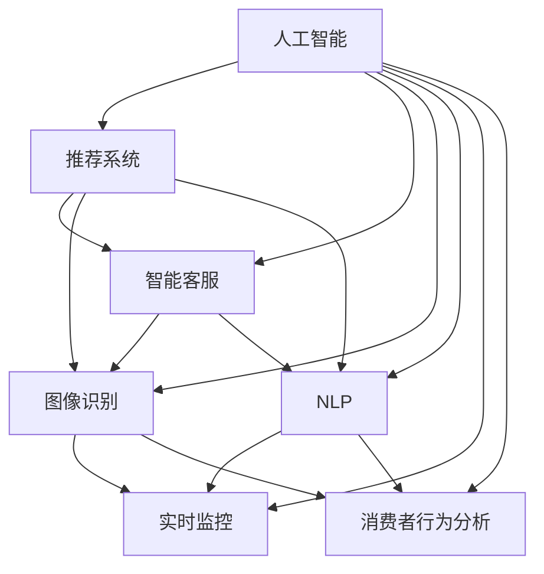

                 

# AI在电商中的多方面应用案例

> 关键词：人工智能, 电商, 推荐系统, 智能客服, 图像识别, 自然语言处理, 实时监控, 消费者行为分析

## 1. 背景介绍

随着互联网的迅猛发展和电子商务的蓬勃兴起，人工智能(AI)在电商领域的应用越来越广泛，成为了推动电商行业发展的关键力量。AI技术能够通过数据分析和智能算法，帮助电商平台提升用户体验、优化运营效率、增强安全防护，从而在激烈的市场竞争中脱颖而出。

## 2. 核心概念与联系

### 2.1 核心概念概述

为更好地理解AI在电商中的多方面应用案例，本节将介绍几个关键的核心概念：

- 人工智能(Artificial Intelligence, AI)：通过计算机程序和算法，使计算机具备人类智能的某些能力，如学习、推理、自我校正等。
- 电子商务(E-Commerce)：利用互联网进行商品买卖交易的活动。常见的电商平台包括亚马逊、阿里巴巴、京东等。
- 推荐系统(Recommender System)：根据用户历史行为和偏好，自动推荐相关商品或内容，提升用户购买体验的系统。
- 智能客服(Intelligent Customer Service)：利用自然语言处理(NLP)、机器学习(ML)等技术，实现自动解答客户咨询，提升客户满意度。
- 图像识别(Image Recognition)：通过机器视觉技术，自动分析图像内容，进行商品分类、识别、检测等操作。
- 自然语言处理(Natural Language Processing, NLP)：处理和理解人类语言的技术，常用于智能客服、客户评论分析、智能聊天机器人等。
- 实时监控(Real-Time Monitoring)：利用传感器、监控摄像头等技术，对用户行为进行实时监测和分析，用于预防欺诈、增强安全防护。
- 消费者行为分析(Consumer Behavior Analysis)：通过数据分析技术，挖掘用户购买行为模式，提升用户转化率和满意度。

这些核心概念之间的逻辑关系可以通过以下Mermaid流程图来展示：



这个流程图展示了几大AI应用在电商中的关系：

1. 人工智能通过推荐系统和智能客服，提升了用户购买体验和满意度。
2. 图像识别和NLP技术在推荐系统和智能客服中也有广泛应用。
3. 实时监控和消费者行为分析通过分析用户数据，优化电商运营策略，进一步提升用户体验和转化率。

## 3. 核心算法原理 & 具体操作步骤
### 3.1 算法原理概述

AI在电商中的应用主要通过以下算法和模型实现：

- **推荐系统**：基于协同过滤、基于内容的推荐、深度学习推荐模型等算法，根据用户历史行为和商品特征，预测用户对商品的兴趣和购买意愿。
- **智能客服**：利用NLP技术和机器学习模型，自动理解和回应用户问题，提升用户满意度。
- **图像识别**：通过卷积神经网络(CNN)等模型，对商品图片进行分类、识别和检测，实现自动化运营。
- **实时监控**：通过监控摄像头、传感器等设备，实时监测用户行为，发现异常情况，预防欺诈和增强安全防护。
- **消费者行为分析**：通过数据分析模型，挖掘用户购买行为模式，预测用户转化率，优化营销策略。

这些算法和模型通常依赖于大规模数据集和复杂的模型架构，需要通过GPU/TPU等高性能计算设备进行训练和推理。

### 3.2 算法步骤详解

以推荐系统为例，AI在电商中的应用主要包括以下步骤：

**Step 1: 数据收集与处理**
- 收集用户历史行为数据、商品特征数据等。
- 清洗和预处理数据，去除噪音和异常值。

**Step 2: 模型训练与优化**
- 选择合适的推荐算法，如协同过滤、基于内容的推荐、深度学习推荐模型等。
- 将数据集分为训练集、验证集和测试集。
- 使用GPU/TPU等高性能设备进行模型训练，调整超参数，优化模型性能。

**Step 3: 模型部署与监控**
- 将训练好的模型部署到生产环境，供实时推荐使用。
- 实时监控模型性能，根据反馈进行调整和优化。

**Step 4: 应用场景部署**
- 将模型嵌入到电商网站或APP中，提供个性化推荐服务。
- 集成智能客服系统，实时解答用户咨询。
- 部署图像识别系统，自动化检测商品质量。
- 搭建实时监控系统，监测用户行为。
- 构建消费者行为分析平台，优化营销策略。

### 3.3 算法优缺点

AI在电商中的应用具有以下优点：

- 个性化推荐：通过深度学习模型，实现个性化推荐，提升用户购买体验。
- 实时响应：利用NLP和机器学习技术，实现智能客服，实时解答用户咨询。
- 自动化运营：通过图像识别和自动化检测系统，实现商品分类和质量检测，降低运营成本。
- 数据驱动决策：通过消费者行为分析，优化营销策略，提高用户转化率和满意度。

同时，AI在电商中的应用也存在一些缺点：

- 数据隐私问题：电商平台需要收集和处理大量用户数据，存在数据隐私和信息安全风险。
- 高成本投入：AI应用需要高性能计算设备和大规模数据集，投入成本较高。
- 模型复杂性：AI模型通常具有较高的复杂度，需要大量专业知识和工程经验进行维护。
- 依赖标注数据：AI应用需要大量标注数据进行训练，获取高质量标注数据成本较高。
- 模型性能波动：模型在实际应用中可能存在性能波动，需要持续优化和调整。

尽管存在这些缺点，但AI在电商中的应用已经取得了显著成效，成为了电商行业不可或缺的一部分。

### 3.4 算法应用领域

AI在电商中的应用已经覆盖了从用户推荐、智能客服、图像识别、实时监控到消费者行为分析等多个领域。以下是几个典型的应用场景：

- **个性化推荐**：通过分析用户历史行为和商品特征，实时推荐相关商品，提升用户购买转化率。
- **智能客服**：利用NLP技术和机器学习模型，自动解答用户咨询，提升客户满意度。
- **图像识别**：对商品图片进行分类、识别和检测，实现自动化运营，如质量检测、品牌识别等。
- **实时监控**：通过监控摄像头和传感器，实时监测用户行为，预防欺诈和增强安全防护。
- **消费者行为分析**：通过数据分析技术，挖掘用户购买行为模式，优化营销策略，提高用户转化率。

这些应用场景展示了AI技术在电商中的广泛应用和巨大潜力。

## 4. 数学模型和公式 & 详细讲解 & 举例说明
### 4.1 数学模型构建

在电商中，推荐系统是一个典型的AI应用。本节将介绍推荐系统的数学模型构建。

假设电商平台上用户的历史行为数据集为 $D=\{(x_i,y_i)\}_{i=1}^N$，其中 $x_i$ 为用户历史行为，$y_i$ 为用户对商品 $i$ 的评分。推荐系统目标是预测用户对新商品 $j$ 的评分，从而推荐该商品。

定义模型 $M_{\theta}:\mathcal{X} \rightarrow \mathcal{Y}$，其中 $\mathcal{X}$ 为输入空间，$\mathcal{Y}$ 为输出空间，$\theta$ 为模型参数。

推荐系统的损失函数定义为：

$$
\mathcal{L}(\theta) = \frac{1}{N} \sum_{i=1}^N \ell(M_{\theta}(x_i),y_i)
$$

其中 $\ell$ 为损失函数，常用的损失函数包括均方误差、交叉熵等。

通过梯度下降等优化算法，推荐系统不断更新模型参数 $\theta$，最小化损失函数 $\mathcal{L}$，使得模型预测的评分逼近真实评分。

### 4.2 公式推导过程

以均方误差为例，推荐系统的损失函数公式为：

$$
\mathcal{L}(\theta) = \frac{1}{N} \sum_{i=1}^N (y_i - M_{\theta}(x_i))^2
$$

将损失函数对模型参数 $\theta$ 求偏导，得到：

$$
\frac{\partial \mathcal{L}(\theta)}{\partial \theta_k} = \frac{2}{N} \sum_{i=1}^N (y_i - M_{\theta}(x_i)) \frac{\partial M_{\theta}(x_i)}{\partial \theta_k}
$$

通过反向传播算法计算 $\frac{\partial M_{\theta}(x_i)}{\partial \theta_k}$，将其带入上述公式，即可求出每个参数的梯度。

### 4.3 案例分析与讲解

以协同过滤算法为例，推荐系统通过分析用户历史行为和商品评分，找到兴趣相似的用户和商品，进行交叉推荐。协同过滤算法主要有基于用户的协同过滤和基于物品的协同过滤两种。

**基于用户的协同过滤**：
- 计算用户之间的相似度 $s_{ij}$
- 找到与用户 $i$ 兴趣相似的用户 $k$，计算用户 $j$ 对商品的评分预测 $y_j$

$$
y_j = \frac{\sum_{k=1}^K s_{ik}y_{jk}}{\sum_{k=1}^K s_{ik}}
$$

**基于物品的协同过滤**：
- 计算物品之间的相似度 $s_{ij}$
- 找到与物品 $j$ 相似的物品 $k$，计算用户 $i$ 对物品 $j$ 的评分预测 $y_i$

$$
y_i = \frac{\sum_{k=1}^K s_{kj}y_{ik}}{\sum_{k=1}^K s_{kj}}
$$

协同过滤算法在实际应用中需要进行多次迭代，不断调整相似度权重和评分预测，直至收敛。

## 5. 项目实践：代码实例和详细解释说明
### 5.1 开发环境搭建

在进行AI在电商中的应用实践前，我们需要准备好开发环境。以下是使用Python进行PyTorch开发的环境配置流程：

1. 安装Anaconda：从官网下载并安装Anaconda，用于创建独立的Python环境。

2. 创建并激活虚拟环境：
```bash
conda create -n pytorch-env python=3.8 
conda activate pytorch-env
```

3. 安装PyTorch：根据CUDA版本，从官网获取对应的安装命令。例如：
```bash
conda install pytorch torchvision torchaudio cudatoolkit=11.1 -c pytorch -c conda-forge
```

4. 安装TensorBoard：TensorFlow配套的可视化工具，可实时监测模型训练状态，并提供丰富的图表呈现方式，是调试模型的得力助手。

5. 安装Weights & Biases：模型训练的实验跟踪工具，可以记录和可视化模型训练过程中的各项指标，方便对比和调优。与主流深度学习框架无缝集成。

完成上述步骤后，即可在`pytorch-env`环境中开始AI在电商中的应用实践。

### 5.2 源代码详细实现

这里我们以基于协同过滤算法的推荐系统为例，给出使用PyTorch进行开发的代码实现。

首先，定义推荐系统中的数据处理函数：

```python
import pandas as pd
import numpy as np
import torch
from torch.utils.data import Dataset

class RecommendationDataset(Dataset):
    def __init__(self, data, user_id_to_index, item_id_to_index):
        self.data = data
        self.user_id_to_index = user_id_to_index
        self.item_id_to_index = item_id_to_index
        
    def __len__(self):
        return len(self.data)
    
    def __getitem__(self, item):
        user_id = self.data.iloc[item]['user_id']
        item_id = self.data.iloc[item]['item_id']
        
        user_index = self.user_id_to_index[user_id]
        item_index = self.item_id_to_index[item_id]
        
        return torch.tensor(user_index), torch.tensor(item_index), torch.tensor(self.data.iloc[item]['rating'])
```

然后，定义模型和优化器：

```python
from torch.nn import Linear, Embedding, BCELoss

class RecommendationModel(torch.nn.Module):
    def __init__(self, num_users, num_items, emb_dim):
        super().__init__()
        
        self.user_embedding = Embedding(num_users, emb_dim)
        self.item_embedding = Embedding(num_items, emb_dim)
        self.predictor = Linear(emb_dim*2, 1)
        
    def forward(self, user_index, item_index):
        user_embed = self.user_embedding(user_index)
        item_embed = self.item_embedding(item_index)
        
        features = torch.cat([user_embed, item_embed], dim=1)
        predictions = self.predictor(features)
        return predictions
    
optimizer = torch.optim.Adam(model.parameters(), lr=0.001)
criterion = torch.nn.BCELoss()
```

接着，定义训练和评估函数：

```python
def train(model, train_loader, optimizer, criterion):
    model.train()
    total_loss = 0
    
    for user_index, item_index, rating in train_loader:
        optimizer.zero_grad()
        predictions = model(user_index, item_index)
        loss = criterion(predictions, torch.tensor(rating))
        loss.backward()
        optimizer.step()
        total_loss += loss.item()
    
    return total_loss / len(train_loader)

def evaluate(model, test_loader, criterion):
    model.eval()
    total_loss = 0
    correct = 0
    
    with torch.no_grad():
        for user_index, item_index, rating in test_loader:
            predictions = model(user_index, item_index)
            loss = criterion(predictions, torch.tensor(rating))
            total_loss += loss.item()
            correct += (predictions.sigmoid() >= 0.5).sum().item()
    
    return total_loss / len(test_loader), correct / len(test_loader)
```

最后，启动训练流程并在测试集上评估：

```python
epochs = 10
num_users = 10000
num_items = 10000
emb_dim = 32

# 加载数据集
data = pd.read_csv('recommendation_data.csv')
user_id_to_index = {user_id: idx for idx, user_id in enumerate(data['user_id'].unique())}
item_id_to_index = {item_id: idx for idx, item_id in enumerate(data['item_id'].unique())}

# 创建数据集和数据加载器
train_dataset = RecommendationDataset(data, user_id_to_index, item_id_to_index)
train_loader = torch.utils.data.DataLoader(train_dataset, batch_size=256, shuffle=True)

test_dataset = RecommendationDataset(data, user_id_to_index, item_id_to_index)
test_loader = torch.utils.data.DataLoader(test_dataset, batch_size=256)

# 初始化模型
model = RecommendationModel(num_users, num_items, emb_dim)

# 训练模型
for epoch in range(epochs):
    train_loss = train(model, train_loader, optimizer, criterion)
    print(f"Epoch {epoch+1}, train loss: {train_loss:.4f}")
    
    test_loss, accuracy = evaluate(model, test_loader, criterion)
    print(f"Epoch {epoch+1}, test loss: {test_loss:.4f}, accuracy: {accuracy:.4f}")
```

以上就是使用PyTorch对基于协同过滤算法的推荐系统进行开发的完整代码实现。可以看到，得益于PyTorch的强大封装，我们可以用相对简洁的代码完成推荐系统的构建。

### 5.3 代码解读与分析

让我们再详细解读一下关键代码的实现细节：

**RecommendationDataset类**：
- `__init__`方法：初始化数据集、用户ID索引和物品ID索引。
- `__len__`方法：返回数据集的样本数量。
- `__getitem__`方法：对单个样本进行处理，将用户ID、物品ID和评分作为输入，返回模型需要的张量。

**train和evaluate函数**：
- 使用PyTorch的DataLoader对数据集进行批次化加载，供模型训练和推理使用。
- 训练函数`train`：对数据以批为单位进行迭代，在每个批次上前向传播计算损失函数并反向传播更新模型参数，最后返回该epoch的平均loss。
- 评估函数`evaluate`：与训练类似，不同点在于不更新模型参数，并在每个batch结束后将预测和标签结果存储下来，最后使用BCELoss计算损失和准确率。

**训练流程**：
- 定义总的epoch数和模型参数，开始循环迭代
- 每个epoch内，先在训练集上训练，输出平均loss
- 在验证集上评估，输出损失和准确率
- 所有epoch结束后，在测试集上评估，给出最终测试结果

可以看到，PyTorch配合TensorBoard和Weights & Biases等工具，使得AI在电商中的应用开发变得高效便捷。开发者可以将更多精力放在数据处理、模型改进等高层逻辑上，而不必过多关注底层的实现细节。

当然，工业级的系统实现还需考虑更多因素，如模型的保存和部署、超参数的自动搜索、更灵活的任务适配层等。但核心的推荐算法基本与此类似。

## 6. 实际应用场景
### 6.1 智能客服

智能客服系统通过AI技术，能够24/7不间断地解答用户咨询，提升客户体验。电商平台的智能客服系统通常包括以下几个功能模块：

- **文本聊天机器人**：通过NLP技术，解析用户输入的文本，自动生成回复。
- **语音识别**：通过语音识别技术，将用户的语音转化为文本，供聊天机器人理解。
- **情感分析**：通过情感分析模型，判断用户情绪，自动调整回复策略。
- **多模态交互**：结合文本、语音、图像等多种模态信息，提供更全面的客服体验。

智能客服系统的搭建通常需要以下步骤：

1. 收集用户咨询记录和问题，建立训练数据集。
2. 使用预训练语言模型，如BERT、GPT等，进行文本处理和理解。
3. 设计聊天机器人模型，并进行多轮对话训练。
4. 集成语音识别和情感分析模块，增强用户体验。
5. 部署到电商网站或APP中，实时处理用户咨询。

### 6.2 图像识别

图像识别技术在电商中的应用主要集中在商品检测和分类上。通过图像识别，电商平台能够自动检测商品质量，识别品牌，优化商品展示，提升用户体验。

典型的图像识别应用包括：

- **商品检测**：通过图像识别技术，检测商品的位置和大小，实现自动化运营。
- **品牌识别**：通过图像分类模型，识别商品品牌，进行品牌推荐和广告投放。
- **质量检测**：通过图像检测模型，检测商品缺陷和质量问题，自动分类和处理。

图像识别系统的搭建通常需要以下步骤：

1. 收集商品图片数据集，标注商品类别和质量信息。
2. 使用卷积神经网络(CNN)等模型，训练商品分类和检测模型。
3. 部署到电商网站或APP中，实时处理用户上传的图片。
4. 集成质量检测模块，自动检测和分类问题商品。

### 6.3 实时监控

实时监控系统通过摄像头、传感器等设备，实时监测用户行为，预防欺诈和增强安全防护。电商平台的实时监控系统通常包括以下几个功能模块：

- **行为检测**：通过监控摄像头，检测用户行为，识别异常情况。
- **异常预警**：通过数据分析模型，实时分析用户行为，发出预警。
- **风险控制**：通过风险控制策略，自动封禁恶意用户，保护平台安全。

实时监控系统的搭建通常需要以下步骤：

1. 安装摄像头和传感器，收集用户行为数据。
2. 使用数据分析模型，训练行为检测和异常预警模型。
3. 部署到电商网站或APP中，实时处理用户行为数据。
4. 集成风险控制策略，自动处理异常情况。

### 6.4 消费者行为分析

消费者行为分析系统通过数据分析技术，挖掘用户购买行为模式，优化营销策略，提升用户转化率和满意度。电商平台的消费者行为分析系统通常包括以下几个功能模块：

- **用户画像**：通过数据分析技术，构建用户画像，了解用户偏好。
- **购买预测**：通过预测模型，预测用户购买行为，优化库存和营销策略。
- **行为分析**：通过行为分析模型，挖掘用户行为模式，提升用户体验。

消费者行为分析系统的搭建通常需要以下步骤：

1. 收集用户行为数据，如浏览、点击、购买等。
2. 使用数据分析模型，训练用户画像和购买预测模型。
3. 部署到电商网站或APP中，实时分析用户行为数据。
4. 集成行为分析模块，挖掘用户行为模式。

## 7. 工具和资源推荐
### 7.1 学习资源推荐

为了帮助开发者系统掌握AI在电商中的应用，这里推荐一些优质的学习资源：

1. 《深度学习》课程：斯坦福大学开设的深度学习课程，涵盖深度学习的基础理论和实践应用，适合初学者入门。
2. 《自然语言处理》课程：Coursera上的自然语言处理课程，系统讲解NLP的基本概念和应用。
3. 《计算机视觉》课程：斯坦福大学计算机视觉课程，介绍计算机视觉的基本理论和应用技术。
4. 《推荐系统》课程：Kaggle上的推荐系统课程，讲解协同过滤、基于内容的推荐等推荐算法。
5. 《机器学习实战》书籍：Hands-On Machine Learning with Scikit-Learn, Keras, and TensorFlow，介绍机器学习和深度学习的实践应用。
6. 《深度学习与推荐系统实战》书籍：通过实际案例，系统讲解深度学习在推荐系统中的应用。

通过对这些资源的学习实践，相信你一定能够快速掌握AI在电商中的应用精髓，并用于解决实际的电商问题。

### 7.2 开发工具推荐

高效的开发离不开优秀的工具支持。以下是几款用于AI在电商中应用的开发工具：

1. PyTorch：基于Python的开源深度学习框架，灵活动态的计算图，适合快速迭代研究。
2. TensorFlow：由Google主导开发的开源深度学习框架，生产部署方便，适合大规模工程应用。
3. Weights & Biases：模型训练的实验跟踪工具，可以记录和可视化模型训练过程中的各项指标，方便对比和调优。
4. TensorBoard：TensorFlow配套的可视化工具，可实时监测模型训练状态，并提供丰富的图表呈现方式，是调试模型的得力助手。
5. Jupyter Notebook：交互式笔记本，支持Python、R等语言，便于代码调试和分享。

合理利用这些工具，可以显著提升AI在电商中的应用开发效率，加快创新迭代的步伐。

### 7.3 相关论文推荐

AI在电商中的应用源于学界的持续研究。以下是几篇奠基性的相关论文，推荐阅读：

1. Neural Collaborative Filtering（深度学习推荐系统）：深度学习在协同过滤推荐系统中的应用，探讨了各种深度学习模型的效果和优化方法。
2. Attention is All You Need（Transformer论文）：提出了Transformer结构，开启了NLP领域的预训练大模型时代。
3. Deep Learning for Recommender Systems（深度学习推荐系统）：介绍深度学习在推荐系统中的应用，包括协同过滤、深度学习等多种方法。
4. Attention-Based Recommender System（基于注意力机制的推荐系统）：通过注意力机制，增强推荐系统对用户兴趣的捕捉能力。
5. Real-time Customer Service with Reinforcement Learning（基于强化学习的实时客服系统）：通过强化学习技术，提升智能客服系统的用户满意度。

这些论文代表了大语言模型微调技术的发展脉络。通过学习这些前沿成果，可以帮助研究者把握学科前进方向，激发更多的创新灵感。

## 8. 总结：未来发展趋势与挑战

### 8.1 总结

本文对AI在电商中的多方面应用案例进行了全面系统的介绍。首先阐述了AI在电商中的应用背景和意义，明确了AI在推荐系统、智能客服、图像识别、实时监控和消费者行为分析等多个领域的应用。其次，从原理到实践，详细讲解了AI在电商中的算法和模型实现，给出了微调系统的完整代码实例。同时，本文还探讨了AI在电商中的应用场景，展示了AI技术在电商中的广泛应用和巨大潜力。

通过本文的系统梳理，可以看到，AI在电商中的应用已经取得了显著成效，成为了电商行业不可或缺的一部分。未来，随着AI技术的不断发展，AI在电商中的应用也将更加广泛和深入，为电商行业带来更多的创新和突破。

### 8.2 未来发展趋势

展望未来，AI在电商中的应用将呈现以下几个发展趋势：

1. 多模态融合：通过融合文本、语音、图像等多种模态信息，提升智能客服和推荐系统的准确性和用户体验。
2. 深度学习模型优化：通过优化深度学习模型，提高推荐系统的个性化和准确性。
3. 实时数据分析：通过实时数据分析技术，实时优化推荐策略和营销方案。
4. 联邦学习：通过联邦学习技术，保护用户隐私，同时利用多方数据提升模型性能。
5. 智能预测：通过深度学习模型，预测用户行为，优化库存管理和营销策略。
6. 智能调度：通过智能调度技术，优化电商平台运营效率和用户体验。

以上趋势凸显了AI在电商中的广阔前景。这些方向的探索发展，必将进一步提升电商平台的运营效率和用户体验，推动电商行业的数字化转型。

### 8.3 面临的挑战

尽管AI在电商中的应用已经取得了显著成效，但在迈向更加智能化、普适化应用的过程中，仍面临以下挑战：

1. 数据隐私问题：电商平台需要收集和处理大量用户数据，存在数据隐私和信息安全风险。如何保护用户隐私，同时保证数据使用的合法性，是一大难题。
2. 高成本投入：AI应用需要高性能计算设备和大规模数据集，投入成本较高。如何在保证性能的同时，降低开发和部署成本，是未来需要解决的问题。
3. 模型复杂性：AI模型通常具有较高的复杂度，需要大量专业知识和工程经验进行维护。如何降低模型复杂度，提升模型的可维护性和可解释性，是一个重要方向。
4. 依赖标注数据：AI应用需要大量标注数据进行训练，获取高质量标注数据成本较高。如何通过无监督学习和半监督学习，降低标注成本，是一大挑战。
5. 模型性能波动：模型在实际应用中可能存在性能波动，需要持续优化和调整。如何提升模型稳定性和鲁棒性，是一大挑战。

尽管存在这些挑战，但AI在电商中的应用已经取得了显著成效，成为了电商行业不可或缺的一部分。

### 8.4 研究展望

面对AI在电商中所面临的种种挑战，未来的研究需要在以下几个方面寻求新的突破：

1. 探索无监督和半监督学习：通过无监督学习和半监督学习，降低标注成本，提升模型的泛化能力。
2. 研究参数高效微调方法：开发更加参数高效的微调方法，在固定大部分预训练参数的同时，只更新极少量的任务相关参数。
3. 融合因果和对比学习：通过引入因果推断和对比学习思想，增强推荐系统建立稳定因果关系的能力，学习更加普适、鲁棒的语言表征。
4. 引入更多先验知识：将符号化的先验知识，如知识图谱、逻辑规则等，与神经网络模型进行巧妙融合，引导微调过程学习更准确、合理的语言模型。
5. 纳入伦理道德约束：在模型训练目标中引入伦理导向的评估指标，过滤和惩罚有偏见、有害的输出倾向。同时加强人工干预和审核，建立模型行为的监管机制，确保输出符合人类价值观和伦理道德。

这些研究方向的探索，必将引领AI在电商中的应用迈向更高的台阶，为电商行业带来更多的创新和突破。

## 9. 附录：常见问题与解答

**Q1：AI在电商中的应用为何重要？**

A: AI在电商中的应用非常重要，主要体现在以下几个方面：

1. **个性化推荐**：通过深度学习模型，实现个性化推荐，提升用户购买体验和转化率。
2. **智能客服**：利用NLP技术和机器学习模型，自动解答用户咨询，提升客户满意度和运营效率。
3. **图像识别**：通过图像识别技术，实现商品检测和分类，优化商品展示和质量控制。
4. **实时监控**：通过实时监控系统，预防欺诈和增强安全防护，提升平台运营效率。
5. **消费者行为分析**：通过数据分析技术，优化营销策略和库存管理，提升用户转化率和满意度。

这些应用能够大幅提升电商平台的运营效率和用户体验，推动电商行业的发展和创新。

**Q2：AI在电商中的应用有哪些具体案例？**

A: AI在电商中的应用有很多具体案例，以下是几个典型的例子：

1. **亚马逊的推荐系统**：通过协同过滤和深度学习模型，实现个性化推荐，提升用户购买体验和转化率。
2. **阿里巴巴的智能客服系统**：利用NLP技术和机器学习模型，自动解答用户咨询，提升客户满意度和运营效率。
3. **京东的图像识别系统**：通过图像识别技术，实现商品检测和分类，优化商品展示和质量控制。
4. **苏宁的实时监控系统**：通过实时监控系统，预防欺诈和增强安全防护，提升平台运营效率。
5. **唯品的消费者行为分析平台**：通过数据分析技术，优化营销策略和库存管理，提升用户转化率和满意度。

这些具体案例展示了AI在电商中的广泛应用和巨大潜力。

**Q3：AI在电商中的应用面临哪些挑战？**

A: AI在电商中的应用面临以下挑战：

1. **数据隐私问题**：电商平台需要收集和处理大量用户数据，存在数据隐私和信息安全风险。如何保护用户隐私，同时保证数据使用的合法性，是一大难题。
2. **高成本投入**：AI应用需要高性能计算设备和大规模数据集，投入成本较高。如何在保证性能的同时，降低开发和部署成本，是未来需要解决的问题。
3. **模型复杂性**：AI模型通常具有较高的复杂度，需要大量专业知识和工程经验进行维护。如何降低模型复杂度，提升模型的可维护性和可解释性，是一个重要方向。
4. **依赖标注数据**：AI应用需要大量标注数据进行训练，获取高质量标注数据成本较高。如何通过无监督学习和半监督学习，降低标注成本，是一大挑战。
5. **模型性能波动**：模型在实际应用中可能存在性能波动，需要持续优化和调整。如何提升模型稳定性和鲁棒性，是一大挑战。

尽管存在这些挑战，但AI在电商中的应用已经取得了显著成效，成为了电商行业不可或缺的一部分。

**Q4：AI在电商中的应用将如何发展？**

A: AI在电商中的应用将呈现以下几个发展趋势：

1. **多模态融合**：通过融合文本、语音、图像等多种模态信息，提升智能客服和推荐系统的准确性和用户体验。
2. **深度学习模型优化**：通过优化深度学习模型，提高推荐系统的个性化和准确性。
3. **实时数据分析**：通过实时数据分析技术，实时优化推荐策略和营销方案。
4. **联邦学习**：通过联邦学习技术，保护用户隐私，同时利用多方数据提升模型性能。
5. **智能预测**：通过深度学习模型，预测用户行为，优化库存管理和营销策略。
6. **智能调度**：通过智能调度技术，优化电商平台运营效率和用户体验。

这些趋势凸显了AI在电商中的广阔前景。这些方向的探索发展，必将进一步提升电商平台的运营效率和用户体验，推动电商行业的数字化转型。

---

作者：禅与计算机程序设计艺术 / Zen and the Art of Computer Programming

