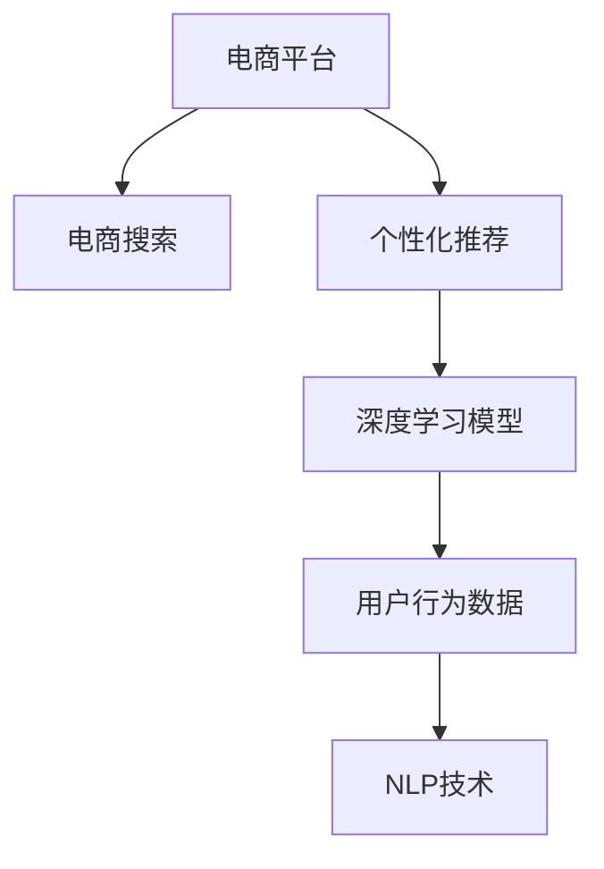

                 

# AI在电商中的智能搜索应用

## 1. 背景介绍

### 1.1 问题由来
近年来，人工智能（AI）技术在电商领域的应用得到了快速发展。传统电商搜索系统主要依赖于简单的关键词匹配和排序算法，无法提供个性化的搜索结果和精准的商品推荐。这导致用户获取信息效率低下，购物体验差，流失率较高。

为解决这一问题，AI技术被引入电商搜索系统，以提升搜索的个性化和智能化水平。具体而言，AI可以通过深度学习模型，利用用户的历史行为数据、点击记录、购买记录等，学习用户的偏好和需求，从而提供更加个性化的搜索结果和商品推荐。这不仅提升了用户购物体验，也为电商平台带来了更高的销售额和用户黏性。

### 1.2 问题核心关键点
AI在电商中的应用，其核心在于深度学习模型的构建和优化，特别是基于用户行为数据的个性化搜索算法。主要包括以下几个方面：

- 用户行为数据分析：提取和分析用户的历史浏览、点击、购买等行为数据，构建用户画像，捕捉用户的兴趣和需求。
- 个性化搜索算法：构建深度学习模型，通过用户的实时查询和行为数据进行推理和推荐。
- 用户交互优化：结合搜索反馈和用户反馈，不断优化模型，提升搜索结果的相关性和准确性。

这些关键点共同构成了一个完整的电商智能搜索系统，能够大幅提升电商平台的搜索效率和用户体验。

## 2. 核心概念与联系

### 2.1 核心概念概述

为更好地理解AI在电商中的智能搜索应用，本节将介绍几个密切相关的核心概念：

- 电商平台：指在线销售商品和服务的企业平台，包括B2C和B2B两类。
- 电商搜索：指用户在电商平台通过关键词或自然语言输入，获取相关商品信息的过程。
- 个性化推荐：指根据用户的历史行为和实时查询，推荐符合用户兴趣和需求的商品和服务。
- 深度学习模型：指基于神经网络的机器学习模型，能够通过大量数据学习出复杂的特征表示和关系。
- 用户行为数据：指用户在电商平台上的各种操作数据，如浏览记录、点击记录、购买记录等。
- 自然语言处理（NLP）：指让计算机理解和处理自然语言的技术，包括语音识别、语义理解、情感分析等。

这些核心概念之间的逻辑关系可以通过以下Mermaid流程图来展示：



这个流程图展示了一些核心概念及其之间的关系：

1. 电商平台是整个系统的载体，提供商品和服务销售的渠道。
2. 电商搜索是用户获取商品信息的主要入口，依赖于深度学习模型的驱动。
3. 个性化推荐是电商搜索的核心，通过深度学习模型实现。
4. 深度学习模型是算法的核心，能够从用户行为数据中学习到用户兴趣。
5. 用户行为数据是算法的输入，提供用户行为特征的刻画。
6. NLP技术是电商搜索的基础，能够理解用户的自然语言输入。

这些概念共同构成了AI在电商中的智能搜索系统，使得电商平台能够提供个性化的搜索结果和精准的商品推荐。

## 3. 核心算法原理 & 具体操作步骤

### 3.1 算法原理概述

AI在电商中的智能搜索应用，本质上是一个基于深度学习的个性化推荐系统。其核心思想是：通过分析用户的历史行为数据，构建深度学习模型，预测用户对特定商品的兴趣，从而生成个性化的搜索结果和推荐。

具体而言，智能搜索系统通常包括以下几个步骤：

1. **用户行为数据采集**：收集用户的历史浏览、点击、购买等行为数据。
2. **用户画像构建**：通过数据分析和建模，构建用户画像，捕捉用户的兴趣和需求。
3. **深度学习模型训练**：基于用户画像和商品特征，训练深度学习模型，学习用户的偏好。
4. **个性化搜索结果生成**：结合用户的实时查询和历史行为数据，生成个性化的搜索结果。
5. **推荐系统优化**：通过用户反馈和搜索反馈，不断优化模型，提升推荐效果。

### 3.2 算法步骤详解

以基于协同过滤算法的推荐系统为例，详细讲解其核心算法步骤：

**Step 1: 数据采集和预处理**

1. **数据采集**：收集用户的历史浏览、点击、购买等行为数据，包括商品ID、时间戳、用户ID等。
2. **数据清洗和标准化**：处理缺失值、重复值和异常值，进行归一化和标准化处理。

**Step 2: 用户画像构建**

1. **特征提取**：从行为数据中提取特征，如浏览时长、浏览次数、购买金额等。
2. **用户分类**：将用户分成不同类型，如高价值用户、高频率用户等。
3. **用户画像表示**：将用户分类和特征向量组合成用户画像。

**Step 3: 模型训练**

1. **协同过滤算法**：基于用户画像和商品特征，训练协同过滤模型。
2. **矩阵分解**：将用户画像和商品特征映射为低维向量，进行矩阵分解。
3. **模型评估**：使用交叉验证等方法评估模型性能。

**Step 4: 个性化搜索结果生成**

1. **实时查询处理**：对用户的实时查询进行处理，提取关键词和意图。
2. **相似度计算**：计算用户画像与商品特征的相似度。
3. **搜索结果排序**：根据相似度排序生成搜索结果。

**Step 5: 推荐系统优化**

1. **用户反馈收集**：收集用户的评分和点击行为。
2. **模型更新**：根据用户反馈和搜索反馈，更新模型参数。
3. **推荐效果评估**：使用A/B测试等方法评估推荐效果。

### 3.3 算法优缺点

AI在电商中的智能搜索算法具有以下优点：

1. **高效性**：通过深度学习模型，能够快速处理大量用户数据，提供个性化搜索结果。
2. **可扩展性**：能够轻松扩展到多维数据和多种业务场景，具有广泛的应用前景。
3. **准确性**：通过协同过滤和矩阵分解等算法，能够准确预测用户兴趣，提升推荐效果。

同时，该算法也存在一定的局限性：

1. **冷启动问题**：新用户或商品缺乏足够的历史数据，难以进行有效推荐。
2. **数据稀疏性**：用户和商品之间存在大量的未交互数据，可能导致推荐效果下降。
3. **过拟合风险**：模型可能会过度拟合用户数据，导致推荐偏差。
4. **计算复杂度**：矩阵分解等算法计算复杂度较高，需要高效的算法和硬件支持。

尽管存在这些局限性，但基于协同过滤和深度学习的大规模推荐算法，在电商搜索中取得了显著的成效，是实现个性化搜索的重要手段。

### 3.4 算法应用领域

AI在电商中的应用非常广泛，以下是几个主要领域：

- **个性化商品推荐**：基于用户的历史行为数据，推荐符合用户兴趣的商品。
- **实时搜索结果优化**：根据用户的实时查询，生成个性化的搜索结果。
- **广告投放优化**：通过分析用户行为数据，优化广告投放策略，提升广告效果。
- **用户行为分析**：分析用户行为数据，识别用户需求和偏好，优化产品和服务。
- **客服聊天机器人**：结合自然语言处理技术，提供个性化的客户服务。
- **库存管理优化**：通过推荐系统预测商品需求，优化库存管理。

这些领域的应用，充分展示了AI在电商中的强大潜力，为电商平台的运营和用户服务带来了革命性的变化。

## 4. 数学模型和公式 & 详细讲解 & 举例说明

### 4.1 数学模型构建

本节将使用数学语言对基于协同过滤算法的个性化推荐系统进行更加严格的刻画。

设用户集为 $U=\{u_1,u_2,\cdots,u_m\}$，商品集为 $I=\{i_1,i_2,\cdots,i_n\}$，用户与商品的交互矩阵为 $R \in \mathbb{R}^{m \times n}$，其中 $R_{ui} = 1$ 表示用户 $u$ 购买或浏览商品 $i$，否则 $R_{ui} = 0$。

定义用户画像向量为 $U^u = [u_1,u_2,\cdots,u_m]$，商品特征向量为 $I^i = [i_1,i_2,\cdots,i_n]$。用户画像和商品特征的相似度矩阵为 $S \in \mathbb{R}^{m \times n}$，其中 $S_{ui} = \text{sim}(U^u,I^i)$。

推荐模型 $f:U \times I \rightarrow \mathbb{R}$，基于用户画像和商品特征，预测用户对商品 $i$ 的兴趣 $r_{ui}$。推荐系统目标函数为：

$$
\min_{R,S,f} \sum_{u \in U} \sum_{i \in I} \ell(r_{ui},f(U^u,I^i))
$$

其中 $\ell$ 为损失函数，通常使用均方误差或交叉熵损失。

### 4.2 公式推导过程

以基于矩阵分解的协同过滤算法为例，进行详细推导。

设用户画像向量为 $U^u = [u_1,u_2,\cdots,u_m]$，商品特征向量为 $I^i = [i_1,i_2,\cdots,i_n]$，用户画像和商品特征的相似度矩阵为 $S \in \mathbb{R}^{m \times n}$，其中 $S_{ui} = \text{sim}(U^u,I^i)$。

基于矩阵分解的协同过滤算法如下：

1. **矩阵分解**：将用户画像和商品特征矩阵 $R$ 分解为两个低维矩阵的乘积 $U \times V$，即 $R \approx UV$。其中 $U \in \mathbb{R}^{m \times k}$，$V \in \mathbb{R}^{k \times n}$，$k$ 为分解维度。
2. **预测兴趣**：根据分解后的矩阵，预测用户对商品 $i$ 的兴趣 $r_{ui} = U_uV_i$。
3. **模型评估**：使用均方误差或交叉熵损失评估预测效果。

具体公式推导如下：

$$
R = UV
$$

$$
r_{ui} = U_uV_i
$$

其中 $U_u$ 为第 $u$ 个用户画像向量，$V_i$ 为第 $i$ 个商品特征向量。

### 4.3 案例分析与讲解

以亚马逊的推荐系统为例，分析其推荐算法的应用。

亚马逊的推荐系统采用了协同过滤和深度学习相结合的方式，通过分析用户的历史行为数据和实时查询，提供个性化的商品推荐。其核心算法包括以下几个步骤：

1. **数据采集和预处理**：收集用户的历史浏览、点击、购买等行为数据，并进行清洗和标准化处理。
2. **用户画像构建**：从行为数据中提取特征，如浏览时长、浏览次数、购买金额等，构建用户画像。
3. **模型训练**：基于用户画像和商品特征，训练协同过滤模型，进行矩阵分解。
4. **个性化搜索结果生成**：对用户的实时查询进行处理，提取关键词和意图，生成个性化的搜索结果。
5. **推荐系统优化**：根据用户反馈和搜索反馈，不断更新模型参数，提升推荐效果。

通过以上步骤，亚马逊的推荐系统能够提供高质量的个性化推荐，提升用户体验和销售额。

## 5. 项目实践：代码实例和详细解释说明

### 5.1 开发环境搭建

在进行推荐系统开发前，我们需要准备好开发环境。以下是使用Python进行PyTorch开发的环境配置流程：

1. 安装Anaconda：从官网下载并安装Anaconda，用于创建独立的Python环境。

2. 创建并激活虚拟环境：
```bash
conda create -n pytorch-env python=3.8 
conda activate pytorch-env
```

3. 安装PyTorch：根据CUDA版本，从官网获取对应的安装命令。例如：
```bash
conda install pytorch torchvision torchaudio cudatoolkit=11.1 -c pytorch -c conda-forge
```

4. 安装TensorFlow：如果需要进行TensorFlow模型的开发，可以使用以下命令：
```bash
pip install tensorflow
```

5. 安装各类工具包：
```bash
pip install numpy pandas scikit-learn matplotlib tqdm jupyter notebook ipython
```

完成上述步骤后，即可在`pytorch-env`环境中开始推荐系统开发。

### 5.2 源代码详细实现

下面我们以协同过滤算法为例，给出使用PyTorch进行推荐系统开发的PyTorch代码实现。

首先，定义数据加载函数：

```python
import torch
from torch.utils.data import Dataset, DataLoader
import numpy as np

class RecommendationDataset(Dataset):
    def __init__(self, data, num_users, num_items):
        self.data = data
        self.num_users = num_users
        self.num_items = num_items
        
    def __len__(self):
        return len(self.data)
    
    def __getitem__(self, item):
        user, item = self.data[item]
        user_index = int(user) - 1
        item_index = int(item) - 1
        return user_index, item_index
```

然后，定义模型和优化器：

```python
import torch.nn as nn
import torch.nn.functional as F

class协同过滤模型(nn.Module):
    def __init__(self, num_users, num_items, num_factors):
        super(协同过滤模型, self).__init__()
        self.user_embeddings = nn.Embedding(num_users, num_factors)
        self.item_embeddings = nn.Embedding(num_items, num_factors)
        
    def forward(self, user_index, item_index):
        user_embeddings = self.user_embeddings(user_index)
        item_embeddings = self.item_embeddings(item_index)
        dot_product = torch.matmul(user_embeddings, item_embeddings.t())
        return dot_product

model = 协同过滤模型(num_users=num_users, num_items=num_items, num_factors=10)
optimizer = torch.optim.Adam(model.parameters(), lr=0.01)
```

接着，定义训练和评估函数：

```python
def train_epoch(model, train_loader, optimizer):
    model.train()
    loss = 0
    for user_index, item_index in train_loader:
        optimizer.zero_grad()
        preds = model(user_index, item_index)
        loss += F.mse_loss(preds, torch.tensor([1 if item_index in train_labels[user_index] else 0], device=device))
        loss.backward()
        optimizer.step()
    return loss / len(train_loader)

def evaluate(model, test_loader):
    model.eval()
    correct = 0
    total = 0
    for user_index, item_index in test_loader:
        preds = model(user_index, item_index)
        if preds > 0.5:
            correct += 1
        total += 1
    return correct / total

device = torch.device('cuda') if torch.cuda.is_available() else torch.device('cpu')

num_users = 1000
num_items = 1000
num_factors = 10

train_dataset = RecommendationDataset(train_data, num_users, num_items)
train_loader = DataLoader(train_dataset, batch_size=32, shuffle=True)
test_dataset = RecommendationDataset(test_data, num_users, num_items)
test_loader = DataLoader(test_dataset, batch_size=32, shuffle=False)

```

最后，启动训练流程并在测试集上评估：

```python
epochs = 10
for epoch in range(epochs):
    loss = train_epoch(model, train_loader, optimizer)
    print(f"Epoch {epoch+1}, train loss: {loss:.4f}")
    
    test_acc = evaluate(model, test_loader)
    print(f"Epoch {epoch+1}, test accuracy: {test_acc:.4f}")

```

以上就是使用PyTorch对协同过滤算法进行推荐系统开发的完整代码实现。可以看到，基于PyTorch的深度学习框架，推荐系统的实现变得简洁高效。

### 5.3 代码解读与分析

让我们再详细解读一下关键代码的实现细节：

**RecommendationDataset类**：
- `__init__`方法：初始化训练数据、用户数量、商品数量等关键组件。
- `__len__`方法：返回数据集的样本数量。
- `__getitem__`方法：对单个样本进行处理，返回用户和商品的索引。

**协同过滤模型**：
- `__init__`方法：定义用户嵌入、商品嵌入等组件。
- `forward`方法：计算用户和商品嵌入向量的点积，得到预测值。

**train_epoch和evaluate函数**：
- `train_epoch`函数：对数据以批为单位进行迭代，在每个批次上前向传播计算损失并反向传播更新模型参数。
- `evaluate`函数：在测试集上评估模型的预测准确率。

**训练流程**：
- 定义总的epoch数，开始循环迭代
- 每个epoch内，先在训练集上训练，输出平均loss
- 在测试集上评估，输出准确率

可以看到，基于PyTorch的深度学习框架，推荐系统的代码实现变得简洁高效。开发者可以将更多精力放在模型改进和数据处理等高层逻辑上，而不必过多关注底层的实现细节。

当然，工业级的系统实现还需考虑更多因素，如模型的保存和部署、超参数的自动搜索、更灵活的任务适配层等。但核心的推荐范式基本与此类似。

## 6. 实际应用场景

### 6.1 智能推荐系统

智能推荐系统是电商搜索的核心应用。通过分析用户的历史行为数据，推荐系统能够提供符合用户兴趣的商品，提升用户购物体验和满意度。

在实际应用中，推荐系统通常由以下几个部分组成：

- **用户画像构建**：从用户行为数据中提取特征，如浏览时长、浏览次数、购买金额等，构建用户画像。
- **推荐算法实现**：基于协同过滤、矩阵分解等算法，生成推荐结果。
- **实时搜索优化**：结合用户的实时查询，生成个性化的搜索结果。
- **系统集成**：将推荐系统与电商平台集成，实现商品展示和推荐。

推荐系统在电商平台中的应用，不仅提高了用户满意度，也为电商平台带来了更高的销售额和用户黏性。

### 6.2 广告投放优化

广告投放是电商平台的重要收入来源。通过推荐系统，可以优化广告投放策略，提升广告效果，增加广告收入。

具体而言，推荐系统可以根据用户的历史行为数据和实时查询，推荐符合用户兴趣的广告，提高广告点击率和转化率。同时，推荐系统还可以根据广告效果，动态调整广告投放策略，优化广告预算分配，提升广告投放的ROI。

### 6.3 用户行为分析

用户行为分析是电商运营的重要手段。通过分析用户的行为数据，电商平台可以识别用户需求和偏好，优化产品和服务。

具体而言，推荐系统可以通过用户画像构建和行为数据分析，识别出高价值用户、高频率用户等，针对性地进行个性化推荐和精准营销。同时，推荐系统还可以分析用户点击、购买等行为，识别出用户的流失原因和改进方向，提升平台的用户留存率和满意度。

### 6.4 未来应用展望

随着AI技术的不断进步，推荐系统在电商中的应用将更加广泛和深入。未来，推荐系统将融合更多先进技术，如自然语言处理、图像识别、因果推理等，提升推荐效果和用户体验。

- **自然语言处理**：结合NLP技术，推荐系统可以理解用户的自然语言输入，提供更加智能化的推荐服务。
- **图像识别**：结合图像识别技术，推荐系统可以分析商品图片，提供更加精准的推荐结果。
- **因果推理**：结合因果推理技术，推荐系统可以预测用户行为，优化推荐策略，提升推荐效果。

此外，推荐系统还将结合更多外部数据和知识，如知识图谱、新闻推荐等，提供更加全面、多样化的服务，满足用户的多样化需求。

## 7. 工具和资源推荐

### 7.1 学习资源推荐

为了帮助开发者系统掌握推荐系统的理论基础和实践技巧，这里推荐一些优质的学习资源：

1. 《Recommender Systems: The Textbook》书籍：推荐系统领域的经典教材，全面介绍了推荐系统的理论基础和算法实现。

2. 《Python深度学习》书籍：深度学习领域的入门教材，包含大量的推荐系统案例和代码实现。

3. Coursera《推荐系统》课程：斯坦福大学开设的推荐系统课程，系统讲解了推荐系统的各个关键点。

4 Kaggle竞赛平台：通过参加推荐系统相关的竞赛，实战练习推荐系统开发，积累实践经验。

5 Weights & Biases：模型训练的实验跟踪工具，可以实时监测模型训练状态，并进行可视化分析。

通过对这些资源的学习实践，相信你一定能够快速掌握推荐系统的精髓，并用于解决实际的电商搜索问题。

### 7.2 开发工具推荐

高效的开发离不开优秀的工具支持。以下是几款用于推荐系统开发的常用工具：

1. PyTorch：基于Python的开源深度学习框架，灵活动态的计算图，适合快速迭代研究。

2. TensorFlow：由Google主导开发的开源深度学习框架，生产部署方便，适合大规模工程应用。

3. TensorBoard：TensorFlow配套的可视化工具，可实时监测模型训练状态，并提供丰富的图表呈现方式。

4 Weights & Biases：模型训练的实验跟踪工具，可以实时监测模型训练状态，并进行可视化分析。

5 Kaggle竞赛平台：通过参加推荐系统相关的竞赛，实战练习推荐系统开发，积累实践经验。

合理利用这些工具，可以显著提升推荐系统开发效率，加快创新迭代的步伐。

### 7.3 相关论文推荐

推荐系统的发展源于学界的持续研究。以下是几篇奠基性的相关论文，推荐阅读：

1. Item-Based Collaborative Filtering（J.O Ordinal, K.T Opendahl, K.S Covington, G.P D'Ambrosio）：提出了基于协同过滤的推荐算法，是推荐系统领域的经典之作。

2. Factorization Machines（T.T Joachims, J.L Gao, P. CServer）：引入了矩阵分解技术，极大地提升了推荐系统的精度。

3. Matrix Factorization with Implicit Feedback（G.K Zhang, M.K Guo, X.Z Pan）：基于隐式反馈数据，提出了矩阵分解算法，进一步提升了推荐系统的效果。

4 The Surprising Effectiveness of Q-Rank（J.M Zhang, C.K Ting）：提出了基于特征选择的推荐算法，适用于高维稀疏数据。

5 Deep Associative Models for Recommendations（S. M.Razaviyayn, A.S Hauptmann, P.K Varshney）：结合深度学习技术，提升了推荐系统的精度和泛化能力。

这些论文代表了大规模推荐系统的发展脉络。通过学习这些前沿成果，可以帮助研究者把握学科前进方向，激发更多的创新灵感。

## 8. 总结：未来发展趋势与挑战

### 8.1 总结

本文对AI在电商中的智能搜索应用进行了全面系统的介绍。首先阐述了智能搜索系统的背景和意义，明确了深度学习模型在推荐系统中的核心地位。其次，从原理到实践，详细讲解了协同过滤算法的核心步骤，给出了推荐系统开发的完整代码实例。同时，本文还探讨了推荐系统在电商中的应用场景，展示了其在提升用户体验和增加收入方面的巨大潜力。

通过本文的系统梳理，可以看到，基于深度学习的推荐系统是电商搜索的核心驱动力，为电商平台带来了显著的收益和用户满意度。未来，随着AI技术的不断进步，推荐系统还将融合更多先进技术，提供更加全面、多样化的服务，为电商平台的运营和用户服务带来革命性的变化。

### 8.2 未来发展趋势

展望未来，推荐系统的发展趋势包括以下几个方面：

1. **多模态数据融合**：融合视觉、语音、文本等多种模态数据，提供更加全面、多样化的推荐服务。
2. **因果推理优化**：结合因果推理技术，优化推荐策略，提升推荐效果。
3. **实时系统构建**：构建实时推荐系统，及时响应用户需求，提升用户体验。
4. **智能客服集成**：将推荐系统与智能客服集成，实现个性化客服和推荐。
5. **个性化广告投放**：通过推荐系统优化广告投放策略，提升广告效果。

以上趋势凸显了推荐系统的强大潜力，未来必将带来更多的应用场景和技术创新。

### 8.3 面临的挑战

尽管推荐系统已经取得了显著的成效，但在实现高性能、高效率的推荐过程中，仍面临以下挑战：

1. **数据质量和多样性**：推荐系统依赖于高质量、多样化的数据，数据质量差或数据稀疏会导致推荐效果下降。
2. **算法复杂度**：推荐系统涉及复杂的数学和算法模型，算法设计复杂度高，需要深入理解和调试。
3. **实时性要求高**：推荐系统需要实时响应用户需求，对计算资源和硬件要求高。
4. **系统集成难度大**：推荐系统需要与电商平台、广告系统等多方系统集成，系统集成复杂度高。

尽管存在这些挑战，但通过持续的技术创新和算法优化，推荐系统必将在电商领域发挥更大的作用，提升电商平台的用户体验和运营效率。

### 8.4 研究展望

面对推荐系统所面临的挑战，未来的研究需要在以下几个方面寻求新的突破：

1. **数据增强技术**：引入数据增强技术，提高推荐系统对新数据的适应能力，缓解数据稀疏性。
2. **模型简化优化**：通过模型简化和参数优化，降低计算复杂度，提高实时性。
3. **分布式系统设计**：设计分布式推荐系统架构，提高系统扩展性和处理能力。
4. **多系统集成方法**：探索多系统集成的有效方法，降低系统集成的复杂度。

这些研究方向将推动推荐系统的不断发展，为电商平台的运营和用户服务带来新的突破。总之，推荐系统是电商搜索的核心驱动力，其发展将不断提升电商平台的用户体验和运营效率，为电商产业带来革命性的变化。

## 9. 附录：常见问题与解答

**Q1：推荐系统如何处理冷启动问题？**

A: 推荐系统处理冷启动问题的方法主要有两种：

1. 基于内容推荐：推荐系统可以根据商品的属性和特征，推荐相似的商品，解决用户兴趣未知的问题。

2. 引入新用户行为数据：推荐系统可以采集新用户的点击、浏览等行为数据，快速建立新用户的兴趣模型，提升推荐效果。

**Q2：推荐系统如何平衡推荐效果和计算资源？**

A: 推荐系统可以采用以下方法平衡推荐效果和计算资源：

1. 矩阵分解：通过矩阵分解等算法，降低计算复杂度，提高推荐效率。

2. 样本采样：采用样本采样方法，只选择部分样本进行推荐，降低计算资源消耗。

3. 模型压缩：通过模型压缩技术，减少模型参数量和计算资源消耗。

**Q3：推荐系统如何应对高维稀疏数据？**

A: 推荐系统可以采用以下方法应对高维稀疏数据：

1. 特征选择：选择影响用户兴趣的关键特征，降低特征维度。

2. 矩阵分解：通过矩阵分解等算法，处理高维稀疏数据，提升推荐效果。

3. 隐式反馈推荐：利用隐式反馈数据，降低对用户明确反馈的依赖，提高推荐效果。

这些方法可以帮助推荐系统应对高维稀疏数据，提升推荐效果和用户体验。

**Q4：推荐系统如何实现实时推荐？**

A: 实现实时推荐的方法主要有两种：

1. 增量更新：通过增量更新方法，快速更新模型参数，提升推荐效果。

2. 预训练模型：使用预训练模型，加速模型推理和更新，提高实时性。

这些方法可以帮助推荐系统实现实时推荐，提升用户体验和运营效率。

**Q5：推荐系统如何提升推荐效果？**

A: 提升推荐效果的方法主要有以下几种：

1. 数据增强：通过数据增强技术，丰富数据集，提升推荐效果。

2. 模型优化：通过优化模型算法和参数，提升推荐效果。

3. 集成学习：通过集成多个推荐模型，提高推荐效果。

这些方法可以帮助推荐系统提升推荐效果，满足用户的多样化需求，提升用户体验和满意度。

---

作者：禅与计算机程序设计艺术 / Zen and the Art of Computer Programming

