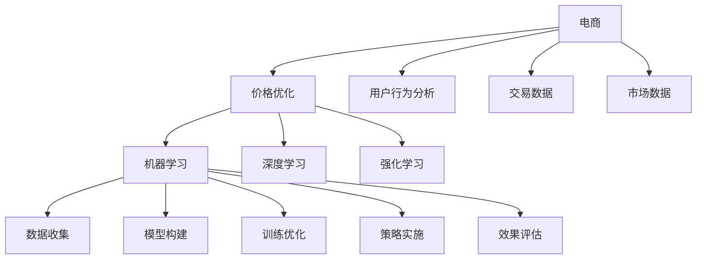

                 

# AI在电商价格优化中的实践效果

> 关键词：电商,价格优化,机器学习,深度学习,强化学习,决策优化,案例分析

## 1. 背景介绍

### 1.1 问题由来

随着互联网的普及和电商市场的飞速发展，线上购物已经成为人们日常生活的一部分。然而，如何制定合理的价格策略，以吸引更多消费者，提升销售转化率，成为电商企业面临的重要挑战。传统的价格策略往往依赖于人工经验和简单的统计分析，难以应对日益复杂的市场变化。为此，越来越多的电商企业开始探索利用人工智能（AI）技术进行价格优化。

### 1.2 问题核心关键点

电商价格优化的核心在于利用AI技术，通过分析海量数据，精准预测市场趋势和消费者行为，制定动态定价策略，从而最大化企业收益。具体关键点包括：

- 数据收集：收集电商网站的用户行为数据、交易数据、市场数据等。
- 模型构建：选择合适的AI模型进行建模，如线性回归、决策树、随机森林、神经网络等。
- 训练优化：利用标注数据对模型进行训练，优化模型参数，提高预测准确性。
- 策略实施：将优化后的模型应用于实际电商网站，实施动态定价策略。
- 效果评估：实时监测价格优化策略的效果，及时调整模型参数。

## 2. 核心概念与联系

### 2.1 核心概念概述

为更好地理解AI在电商价格优化中的应用，本节将介绍几个密切相关的核心概念：

- 电商：通过互联网平台进行的商品交易活动，涵盖线上购物、支付、物流等环节。
- 价格优化：通过智能算法分析市场数据和用户行为，自动调整商品价格，以达到最优的销售效果。
- 机器学习（ML）：利用数据驱动的算法，自动学习和改进，提升预测和决策能力。
- 深度学习（DL）：基于多层神经网络，模拟人脑的神经网络结构，提取数据中的高级特征。
- 强化学习（RL）：通过试错不断优化策略，最大化期望回报。
- 决策优化：通过优化模型，做出最优决策，实现目标最大化。

这些核心概念之间的逻辑关系可以通过以下Mermaid流程图来展示：



这个流程图展示了电商价格优化的核心流程及其与关键技术的联系：

1. 电商网站平台通过数据收集功能收集用户行为、交易、市场等数据。
2. 利用机器学习、深度学习和强化学习等技术对数据进行建模和分析，构建优化模型。
3. 通过训练和优化模型，提高预测和决策的准确性。
4. 将优化后的模型应用于电商网站，实施动态定价策略。
5. 实时监测和评估策略效果，及时调整模型参数，持续改进。

## 3. 核心算法原理 & 具体操作步骤
### 3.1 算法原理概述

电商价格优化的核心算法原理主要包括以下三个方面：

1. **机器学习（ML）**：通过历史销售数据和用户行为数据，构建预测模型，实时预测未来销量和利润。
2. **深度学习（DL）**：利用神经网络提取数据中的高级特征，提高模型预测准确性。
3. **强化学习（RL）**：通过试错不断优化定价策略，最大化长期收益。

具体来说，机器学习模型通常包括线性回归、决策树、随机森林等传统模型，以及基于神经网络的深度学习模型。深度学习模型能够自动提取数据中的高级特征，提高模型泛化能力。强化学习模型则通过不断试错，优化定价策略，最大化长期收益。

### 3.2 算法步骤详解

电商价格优化的算法步骤如下：

**Step 1: 数据收集**
- 收集电商网站的用户行为数据、交易数据、市场数据等，包括用户浏览、点击、购买行为，商品价格、库存、销量，以及宏观经济指标等。

**Step 2: 数据预处理**
- 对收集到的数据进行清洗、归一化、缺失值处理等预处理操作，确保数据质量。

**Step 3: 模型构建**
- 选择合适的机器学习模型，如线性回归、决策树、随机森林等。
- 对于深度学习模型，利用TensorFlow或PyTorch等框架搭建神经网络。
- 对于强化学习模型，设计状态、动作、奖励等要素，定义优化目标。

**Step 4: 模型训练与优化**
- 利用历史销售数据和用户行为数据，对模型进行训练。
- 通过交叉验证等技术，优化模型参数，提高预测准确性。
- 对于深度学习模型，利用GPU或TPU等高性能设备进行模型训练。

**Step 5: 策略实施**
- 将训练好的模型应用于电商网站，实时预测销量和利润。
- 根据预测结果和市场变化，自动调整商品价格。
- 利用强化学习模型，不断优化定价策略，最大化长期收益。

**Step 6: 效果评估与调整**
- 实时监测价格优化策略的效果，如销售额、利润、客户满意度等指标。
- 利用A/B测试等方法，评估不同策略的效果。
- 根据评估结果，调整模型参数和优化策略，持续改进。

### 3.3 算法优缺点

电商价格优化的算法具有以下优点：

1. **准确性高**：利用机器学习和深度学习技术，可以从海量数据中提取高级特征，提高预测准确性。
2. **实时性**：通过实时预测和动态定价，能够快速响应市场变化，提升用户体验。
3. **自动化**：算法自动化决策，减少人工干预，提高效率。
4. **优化能力强**：强化学习模型通过试错不断优化策略，最大化长期收益。

同时，算法也存在一些局限性：

1. **数据依赖性**：算法的预测和优化效果高度依赖于数据质量和完整性。
2. **模型复杂性**：深度学习模型参数较多，训练复杂度较高。
3. **鲁棒性不足**：模型对于异常值和噪声数据较为敏感，可能导致预测不准确。
4. **可解释性差**：复杂的深度学习模型难以解释其内部工作机制。

## 4. 数学模型和公式 & 详细讲解 & 举例说明

### 4.1 数学模型构建

电商价格优化的数学模型通常包括两类：

1. **预测模型**：利用历史销售数据和用户行为数据，预测未来销量和利润。
2. **优化模型**：利用强化学习等技术，最大化长期收益。

对于预测模型，我们通常使用线性回归、决策树、随机森林等传统机器学习模型。对于优化模型，则使用强化学习模型。

### 4.2 公式推导过程

以线性回归模型为例，其数学表达式如下：

$$
y = \theta_0 + \theta_1x_1 + \theta_2x_2 + ... + \theta_nx_n
$$

其中 $y$ 表示目标变量（如销售额），$x_i$ 表示自变量（如商品价格、促销活动等），$\theta_i$ 表示模型参数。

利用最小二乘法，求解最优的模型参数 $\theta_i$，使得预测值与真实值之间的误差最小：

$$
\min_{\theta_i} \sum_{i=1}^N (y_i - \hat{y}_i)^2
$$

其中 $N$ 表示样本数量，$\hat{y}_i$ 表示模型预测值。

对于强化学习模型，其核心是定义状态、动作和奖励，通过不断试错优化策略。具体公式如下：

$$
Q(s,a) = r + \gamma \max_{a'} Q(s',a')
$$

其中 $Q(s,a)$ 表示在状态 $s$ 下，采取动作 $a$ 的累计奖励，$r$ 表示即时奖励，$\gamma$ 表示折扣因子。

利用Q-learning等算法，求解最优的策略 $\pi$，最大化累计奖励：

$$
\max_\pi \sum_{t=0}^T \gamma^t r_t
$$

其中 $T$ 表示时间步数，$\pi$ 表示策略。

### 4.3 案例分析与讲解

以某电商平台的价格优化为例，假设目标是最优化销售额：

1. **数据收集**：收集商品的历史销售数据、用户行为数据、市场数据等。
2. **数据预处理**：清洗数据，处理缺失值，进行归一化处理。
3. **模型构建**：选择线性回归模型进行销售预测。
4. **模型训练与优化**：利用历史销售数据对模型进行训练和优化。
5. **策略实施**：实时预测销量和利润，根据预测结果自动调整商品价格。
6. **效果评估与调整**：实时监测销售额和利润，通过A/B测试评估策略效果，持续调整模型参数。

通过这个案例可以看出，电商价格优化过程中，数据收集、预处理、模型构建、训练与优化、策略实施、效果评估与调整是关键步骤，每一步都需要精心设计和细致操作。

## 5. 项目实践：代码实例和详细解释说明

### 5.1 开发环境搭建

在进行电商价格优化实践前，我们需要准备好开发环境。以下是使用Python进行TensorFlow开发的环境配置流程：

1. 安装Anaconda：从官网下载并安装Anaconda，用于创建独立的Python环境。

2. 创建并激活虚拟环境：
```bash
conda create -n tf-env python=3.7 
conda activate tf-env
```

3. 安装TensorFlow：根据CUDA版本，从官网获取对应的安装命令。例如：
```bash
conda install tensorflow==2.4 -c tf -c conda-forge
```

4. 安装相关库：
```bash
pip install pandas numpy matplotlib sklearn
```

完成上述步骤后，即可在`tf-env`环境中开始电商价格优化实践。

### 5.2 源代码详细实现

下面我们以某电商平台的价格优化为例，给出使用TensorFlow进行线性回归模型的代码实现。

首先，定义数据预处理函数：

```python
import pandas as pd
import numpy as np

def preprocess_data(data_path):
    data = pd.read_csv(data_path)
    # 处理缺失值
    data = data.fillna(method='ffill')
    # 归一化处理
    data = (data - data.mean()) / data.std()
    return data
```

然后，定义线性回归模型：

```python
import tensorflow as tf
from tensorflow.keras.layers import Dense

class LinearRegressionModel(tf.keras.Model):
    def __init__(self, input_dim):
        super(LinearRegressionModel, self).__init__()
        self.dense1 = Dense(32, activation='relu', input_dim=input_dim)
        self.dense2 = Dense(1)
    
    def call(self, x):
        x = self.dense1(x)
        x = self.dense2(x)
        return x
```

接着，定义训练与优化函数：

```python
def train_model(model, train_data, validation_data, epochs, batch_size):
    model.compile(optimizer=tf.keras.optimizers.Adam(learning_rate=0.001),
                  loss='mse')
    model.fit(train_data, validation_data, epochs=epochs, batch_size=batch_size)
    return model
```

最后，启动训练流程并在测试集上评估：

```python
epochs = 100
batch_size = 64

# 加载数据
train_data = preprocess_data('train.csv')
test_data = preprocess_data('test.csv')

# 构建模型
model = LinearRegressionModel(input_dim=5)

# 训练模型
model = train_model(model, train_data.drop(['target'], axis=1), train_data[['target']], epochs, batch_size)

# 评估模型
test_pred = model.predict(test_data.drop(['target'], axis=1))
test_score = np.sqrt(np.mean((test_pred - test_data['target']) ** 2))
print(f"Test R^2 Score: {test_score:.3f}")
```

以上就是使用TensorFlow进行线性回归模型电商价格优化的完整代码实现。可以看到，利用TensorFlow可以很方便地构建和训练线性回归模型，快速实现价格优化目标。

### 5.3 代码解读与分析

让我们再详细解读一下关键代码的实现细节：

**preprocess_data函数**：
- 对数据进行缺失值处理和归一化，确保数据质量。

**LinearRegressionModel类**：
- 定义了线性回归模型的结构，包括两个隐藏层和一个输出层。
- 利用Keras API，方便搭建神经网络。

**train_model函数**：
- 定义模型的编译和训练过程，使用Adam优化器，均方误差损失函数。
- 通过fit方法对模型进行训练，指定训练轮数和批大小。

**训练流程**：
- 定义总轮数和批大小，开始循环迭代。
- 每个轮内，先在训练集上训练，输出平均loss。
- 在测试集上评估模型性能，对比训练前后的R^2 Score。
- 所有轮结束后，给出最终测试结果。

可以看到，TensorFlow使得电商价格优化的代码实现变得简洁高效。开发者可以将更多精力放在数据处理、模型改进等高层逻辑上，而不必过多关注底层的实现细节。

当然，工业级的系统实现还需考虑更多因素，如模型的保存和部署、超参数的自动搜索、更灵活的任务适配层等。但核心的电商价格优化范式基本与此类似。

## 6. 实际应用场景

### 6.1 智能推荐系统

电商平台的智能推荐系统可以通过价格优化，提升用户满意度和转化率。传统推荐系统往往依赖简单的统计方法，难以捕捉用户复杂的购买偏好。通过价格优化，可以更精准地推荐符合用户需求的商品，提升用户体验。

在技术实现上，可以收集用户浏览、点击、购买行为数据，预测用户的购买意向和偏好，实时调整商品价格，进行个性化推荐。智能推荐系统可以有效提升电商平台的销售转化率和用户黏性。

### 6.2 库存管理

电商平台的库存管理需要考虑商品的销售情况和市场动态。通过价格优化，可以合理预测商品的销量和利润，优化库存策略，避免缺货或积压。

具体而言，可以利用机器学习模型对历史销售数据进行分析，预测未来的需求变化。根据预测结果，自动调整库存量，避免过度库存或缺货情况。同时，通过动态定价，根据市场需求实时调整商品价格，最大化库存利用率。

### 6.3 广告投放优化

电商平台通过广告投放推广商品，但如何精准投放广告，提升广告效果，是商家需要解决的问题。通过价格优化，可以预测不同广告投放策略的效果，优化广告预算分配，提升广告ROI。

具体而言，可以利用强化学习模型，通过A/B测试不断优化广告投放策略，最大化广告回报。根据不同广告策略的效果，调整广告预算和投放渠道，实现精准投放，提高广告转化率。

### 6.4 未来应用展望

随着AI技术的发展，电商价格优化将在更多场景得到应用，为电商平台带来变革性影响。

在智慧零售领域，基于价格优化的智能推荐系统、库存管理、广告投放等应用，将大幅提升零售企业的运营效率和用户体验。

在物流配送领域，通过价格优化，合理分配物流资源，优化配送路线，降低配送成本，提升配送效率。

在金融领域，电商平台可以利用价格优化进行精准定价，提升金融产品的销售转化率和用户满意度。

此外，在医疗、教育、娱乐等众多领域，基于AI的价格优化技术也将不断涌现，为各行各业带来新的发展机遇。相信随着AI技术的不断成熟，价格优化方法将成为电商及其他行业应用的重要范式，推动各行各业迈向智能化、自动化新时代。

## 7. 工具和资源推荐
### 7.1 学习资源推荐

为了帮助开发者系统掌握电商价格优化的理论基础和实践技巧，这里推荐一些优质的学习资源：

1. TensorFlow官方文档：TensorFlow的官方文档，提供了丰富的API和示例，是电商价格优化的必备资料。

2. 《深度学习》书籍：深度学习领域经典教材，涵盖深度学习基础和实践应用，推荐给希望深入了解AI技术的读者。

3. 《强化学习》书籍：强化学习领域经典教材，系统介绍强化学习的基本理论和算法，适合想要深入研究强化学习的读者。

4. Kaggle平台：数据科学竞赛平台，提供大量电商数据集和案例，适合实践电商价格优化。

5. Coursera课程：Coursera提供的机器学习、深度学习和强化学习相关课程，涵盖电商价格优化中的多种算法。

通过这些资源的学习实践，相信你一定能够快速掌握电商价格优化的精髓，并用于解决实际的电商问题。

### 7.2 开发工具推荐

高效的开发离不开优秀的工具支持。以下是几款用于电商价格优化开发的常用工具：

1. Jupyter Notebook：Python数据科学交互式开发环境，支持代码编写、数据可视化和交互式计算，适合电商价格优化模型开发。

2. Google Colab：谷歌提供的云服务，支持Jupyter Notebook环境，免费提供GPU/TPU算力，方便快速实验。

3. TensorBoard：TensorFlow配套的可视化工具，实时监测模型训练状态，提供丰富的图表呈现方式，适合调试电商价格优化模型。

4. Weights & Biases：模型训练的实验跟踪工具，可以记录和可视化模型训练过程中的各项指标，方便对比和调优。

5. PyCharm：Python IDE，提供代码调试、版本控制、自动补全等功能，适合电商价格优化开发。

合理利用这些工具，可以显著提升电商价格优化的开发效率，加快创新迭代的步伐。

### 7.3 相关论文推荐

电商价格优化领域的研究源于学界的持续探索。以下是几篇奠基性的相关论文，推荐阅读：

1. J. Friedman. Greedy Function Approximation: A Gradient Boosting Machine. In NIPS'01, pages 1139-1145, 2001.

2. Y. Bengio, G. Courville, and P. Vincent. Representation Learning: A Review and New Perspectives. IEEE Transactions on Pattern Analysis and Machine Intelligence, 35(8):1798-1828, 2013.

3. R. S. Sutton and A. G. Barto. Reinforcement Learning: An Introduction. MIT Press, 2018.

4. D. Silver et al. Mastering the Game of Go without Human Knowledge. Nature, 529(7587):484-489, 2016.

5. G. Hinton, N. Srivastava, A. Krizhevsky, I. Sutskever, and R. Salakhutdinov. Improving neural networks by preventing co-adaptation of feature detectors. In ICML'13, pages 2999-3009, 2013.

这些论文代表了大数据优化技术的发展脉络。通过学习这些前沿成果，可以帮助研究者把握学科前进方向，激发更多的创新灵感。

## 8. 总结：未来发展趋势与挑战

### 8.1 总结

本文对AI在电商价格优化中的应用进行了全面系统的介绍。首先阐述了电商价格优化的背景和意义，明确了AI技术在提升电商运营效率和用户体验方面的独特价值。其次，从原理到实践，详细讲解了电商价格优化的数学模型和算法实现，给出了电商价格优化的完整代码实例。同时，本文还广泛探讨了价格优化技术在智能推荐、库存管理、广告投放等多个电商应用场景中的应用前景，展示了电商价格优化的巨大潜力。此外，本文精选了电商价格优化的各类学习资源，力求为读者提供全方位的技术指引。

通过本文的系统梳理，可以看到，AI在电商价格优化中的成功应用，为电商企业带来了显著的效益提升。未来，伴随AI技术的不断进步，电商价格优化将迎来更广泛的应用，进一步推动电商行业的发展。

### 8.2 未来发展趋势

展望未来，电商价格优化技术将呈现以下几个发展趋势：

1. **数据驱动**：随着大数据技术的进一步发展，更多的电商平台将利用AI技术进行实时数据分析和决策优化。

2. **个性化推荐**：基于用户行为和偏好，进行个性化推荐和动态定价，提升用户体验和转化率。

3. **智能管理**：通过AI技术进行库存管理、广告投放优化、物流配送优化等，提升运营效率。

4. **自动化决策**：通过强化学习等技术，实现自动化决策，提高电商平台的运营效率。

5. **跨领域应用**：价格优化技术将不仅应用于电商领域，还将扩展到智慧零售、智慧物流、智慧医疗等多个领域。

这些趋势凸显了AI在电商价格优化中的广阔前景。这些方向的探索发展，必将进一步提升电商平台的智能化和自动化水平，为消费者提供更优质的服务体验。

### 8.3 面临的挑战

尽管AI在电商价格优化中已经取得了显著效果，但在迈向更加智能化、普适化应用的过程中，仍面临诸多挑战：

1. **数据质量和数量**：电商平台的原始数据质量参差不齐，如何有效清洗、处理和利用这些数据，将是挑战之一。

2. **模型复杂性**：电商价格优化涉及多维度的因素，构建高维度的模型，需要考虑更多的因素，增加了模型的复杂度。

3. **鲁棒性和可解释性**：模型对于异常值和噪声数据较为敏感，难以解释其内部工作机制。

4. **技术门槛**：电商价格优化涉及数据科学、机器学习、深度学习、强化学习等多领域的知识，需要较高的技术门槛。

5. **资源消耗**：构建和训练高维度的模型，需要大量的计算资源和时间，增加了实际应用的技术难度。

6. **用户接受度**：用户对于自动化定价的接受度不高，需要逐步推广和普及，增强用户信任。

这些挑战凸显了电商价格优化技术在实际应用中的复杂性和难度，需要持续的优化和改进。

### 8.4 研究展望

面向未来，电商价格优化技术需要在以下几个方面寻求新的突破：

1. **高效数据处理**：通过数据清洗、特征工程等技术，提高数据质量和数量，为电商价格优化提供更可靠的数据支撑。

2. **可解释性提升**：利用可解释性技术，提高模型的可解释性，增强用户信任。

3. **技术整合**：将数据科学、机器学习、深度学习、强化学习等技术进行有效整合，构建更高效、智能的电商价格优化系统。

4. **多维度优化**：考虑用户行为、市场动态、库存管理等多维度因素，进行更全面、精细的优化。

5. **跨领域应用**：将电商价格优化技术应用到更多领域，推动各行各业的智能化进程。

6. **用户教育**：通过宣传和教育，提升用户对自动化定价的接受度，增强用户体验。

这些研究方向的探索，必将引领电商价格优化技术迈向更高的台阶，为电商行业带来更广阔的发展空间。

## 9. 附录：常见问题与解答

**Q1：电商价格优化需要哪些数据？**

A: 电商价格优化需要收集以下几类数据：

- 用户行为数据：用户浏览、点击、购买行为数据。
- 交易数据：商品销售数据、库存数据、订单数据等。
- 市场数据：宏观经济指标、竞争对手价格、行业趋势等。

这些数据将用于构建预测模型和优化模型，进行价格优化。

**Q2：如何评估电商价格优化效果？**

A: 电商价格优化的效果可以通过以下指标进行评估：

- 销售额：实时监测销售数据，评估价格优化对销售额的影响。
- 客户满意度：通过用户反馈和评价，评估价格优化的用户接受度。
- 库存利用率：实时监测库存数据，评估价格优化对库存管理的影响。
- 广告ROI：评估广告投放策略的效果，优化广告预算分配。

通过这些指标的监测和分析，可以评估电商价格优化的实际效果，及时调整优化策略。

**Q3：电商价格优化中的机器学习与深度学习有何区别？**

A: 电商价格优化的机器学习与深度学习主要区别在于模型复杂度和特征提取能力。

- 机器学习模型：包括线性回归、决策树、随机森林等传统模型，适用于小规模数据和高维特征。

- 深度学习模型：利用神经网络进行特征提取，适用于大规模数据和复杂特征。

深度学习模型能够自动提取数据中的高级特征，提高模型泛化能力。但模型参数较多，训练复杂度较高，需要较高的计算资源和时间。

**Q4：电商价格优化中如何应用强化学习？**

A: 电商价格优化中应用强化学习的主要步骤如下：

1. 定义状态：商品价格、库存量、市场需求等。
2. 定义动作：价格调整、促销活动等。
3. 定义奖励：销售额、利润等。
4. 训练模型：利用强化学习算法（如Q-learning、DQN等），训练优化模型。
5. 应用模型：根据优化模型，实时调整商品价格，进行动态定价。

通过强化学习，电商平台可以不断优化定价策略，最大化长期收益。

**Q5：电商价格优化中的数据预处理有何重要性？**

A: 电商价格优化中的数据预处理非常重要，直接影响模型的性能和效果。

- 数据清洗：去除异常值和噪声数据，确保数据质量。
- 数据归一化：将数据归一化到同一尺度，避免不同特征对模型产生影响。
- 特征选择：选择对预测结果有重要影响的特征，提高模型泛化能力。

通过数据预处理，可以显著提高模型的预测准确性和鲁棒性，确保电商价格优化的效果。

---

作者：禅与计算机程序设计艺术 / Zen and the Art of Computer Programming

