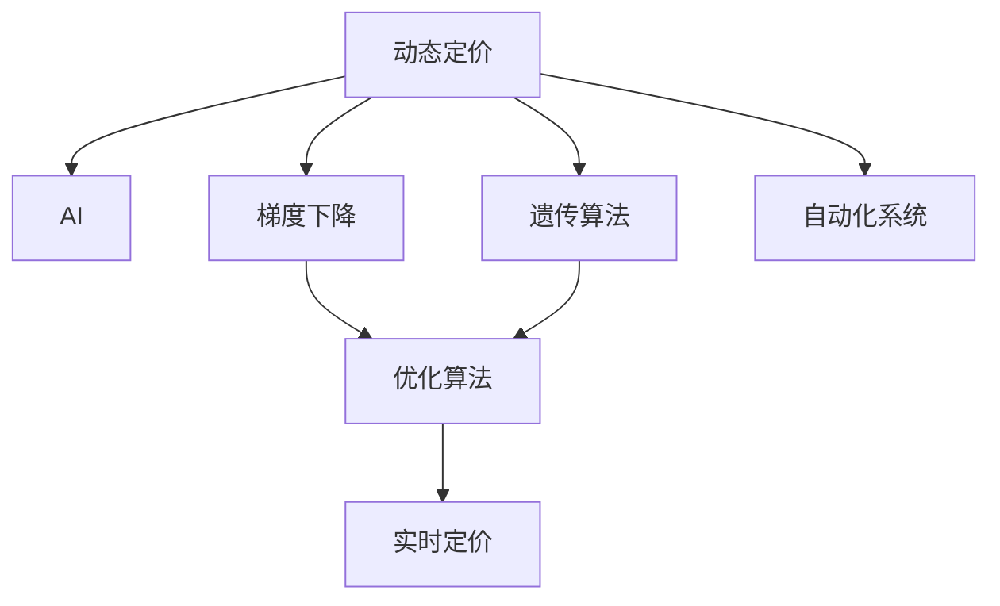

                 

# AI在电商动态定价中的实践应用

> 关键词：动态定价, AI, 电商, 优化算法, 案例分析, 自动化系统, 实时定价, 策略推荐

## 1. 背景介绍

### 1.1 问题由来
在电商领域，动态定价（Dynamic Pricing）是一个不断受到关注的重要问题。它涉及到在瞬息万变的市场环境中，如何根据市场需求、竞争对手行为、库存状况等多维度的因素，实时调整商品价格以实现利润最大化。传统的定价策略往往依赖于手动调整，效率低且难以适应复杂的市场动态。而利用AI技术进行动态定价，能够实时响应市场变化，自动调整价格，从而提升电商企业的竞争力和盈利能力。

### 1.2 问题核心关键点
AI在电商动态定价中的应用，主要体现在以下几个核心关键点：

1. **数据驱动**：通过大量历史交易数据和市场实时数据，AI能够学习到价格与销量之间的复杂关系，形成预测模型。
2. **实时响应**：AI系统能够快速分析市场变化，实时调整定价策略，适应不同的市场环境。
3. **优化算法**：AI能够应用各种优化算法，如梯度下降、遗传算法等，找到最优定价策略。
4. **自动化系统**：AI技术能够构建自动化定价系统，减少人工干预，提高运营效率。
5. **策略推荐**：AI能够结合市场趋势、竞争对手行为等因素，推荐最适合的定价策略。

### 1.3 问题研究意义
在电商行业中应用AI动态定价技术，具有以下重要意义：

1. **提升运营效率**：自动化定价系统能够快速响应市场变化，减少人工干预，提高决策速度。
2. **增加收入**：通过精准定价，提升销售额和利润率，实现收入最大化。
3. **优化库存管理**：通过动态调整价格，引导消费，优化库存水平，减少滞销和缺货。
4. **竞争优势**：实时定价策略能够快速适应市场变化，提升企业在竞争中的地位。
5. **用户满意度**：通过优化定价策略，提升用户体验，增加用户粘性。

## 2. 核心概念与联系

### 2.1 核心概念概述

为更好地理解AI在电商动态定价中的应用，本节将介绍几个密切相关的核心概念：

- **动态定价（Dynamic Pricing）**：根据市场需求和竞争环境动态调整商品价格，以实现利润最大化。
- **AI（人工智能）**：利用机器学习、深度学习等技术，从数据中学习知识，辅助决策。
- **梯度下降（Gradient Descent）**：一种常用的优化算法，通过不断调整参数来最小化损失函数，寻找最优解。
- **遗传算法（Genetic Algorithm）**：模拟自然进化过程，通过基因交叉和变异，寻找最优解。
- **自动化系统（Automated System）**：通过AI技术构建的系统，能够自动执行定价策略，提高效率。

这些核心概念之间的逻辑关系可以通过以下Mermaid流程图来展示：



这个流程图展示了大语言模型的核心概念及其之间的关系：

1. 动态定价技术依赖于AI技术，通过数据驱动和模型学习，实现精准定价。
2. AI应用了多种优化算法，寻找最优定价策略。
3. 自动化系统能够实时执行定价策略，提高运营效率。
4. 实时定价策略通过优化算法和自动化系统实现。

## 3. 核心算法原理 & 具体操作步骤
### 3.1 算法原理概述

AI在电商动态定价中的应用，主要基于机器学习和深度学习算法，通过大量历史和实时数据进行训练，学习到价格与销量之间的复杂关系，进而实时调整价格。

具体而言，假设商品在时间$t$的价格为$p(t)$，销量为$q(t)$，则动态定价的目标是最大化期望收益$E[p(t)q(t)]$。在电商环境中，通常假设收益与价格成线性关系，即$R(p(t))=p(t)q(t)$。因此，动态定价问题可以转化为求解最优价格$p(t)$的问题。

形式化地，假设存在一个最优定价策略$p^*$，则最大化期望收益的问题可以表示为：

$$
\max_{p(t)} \mathbb{E}[R(p(t))] = \max_{p(t)} \mathbb{E}[p(t)q(t)]
$$

为了求解该优化问题，通常会采用以下几种方法：

1. **历史数据回归模型**：通过历史数据训练回归模型，预测未来销量和收益，从而确定最优价格。
2. **优化算法**：如梯度下降、遗传算法等，寻找最优定价策略。
3. **强化学习**：通过模拟市场环境，学习最优定价策略。

### 3.2 算法步骤详解

基于机器学习和深度学习的电商动态定价流程，通常包括以下几个关键步骤：

**Step 1: 数据收集与预处理**
- 收集历史交易数据和市场实时数据，包括价格、销量、时间戳、季节性因素等。
- 清洗数据，处理缺失值和异常值，进行归一化处理。

**Step 2: 模型训练与选择**
- 选择适合电商动态定价的模型，如线性回归、深度神经网络等。
- 使用历史数据进行模型训练，优化超参数，选择性能最好的模型。

**Step 3: 定价策略优化**
- 应用优化算法，如梯度下降、遗传算法等，优化定价策略。
- 根据实时数据和市场变化，动态调整定价策略。

**Step 4: 自动化系统部署**
- 将优化后的定价策略部署到自动化系统中，实时监控市场变化。
- 系统自动调整商品价格，反馈到电商平台。

**Step 5: 性能评估与迭代**
- 定期评估定价策略的效果，对比实际收益与预测收益。
- 根据评估结果，不断迭代优化定价策略。

### 3.3 算法优缺点

AI在电商动态定价中的应用，具有以下优点：

1. **自动化高效**：自动化系统能够实时响应市场变化，提高决策效率。
2. **精准定价**：基于历史数据和市场实时数据，预测未来销量和收益，实现精准定价。
3. **动态调整**：能够动态调整价格，适应不同的市场环境。
4. **优化算法**：应用多种优化算法，寻找最优定价策略。

同时，该方法也存在一些局限性：

1. **数据依赖**：模型性能高度依赖于历史和实时数据的质量和数量，数据不足可能导致模型失效。
2. **模型复杂**：深度学习模型结构复杂，训练和部署成本较高。
3. **实时计算**：实时数据处理和模型计算消耗大量资源，对计算资源要求较高。
4. **策略风险**：过度依赖模型和算法，可能导致策略失效或风险增加。

### 3.4 算法应用领域

AI在电商动态定价中的应用，广泛适用于各类电商企业，如：

1. **B2C电商**：如亚马逊、京东、天猫等，能够实时调整商品价格，提升用户体验和销售额。
2. **B2B电商**：如阿里巴巴、全球速卖通等，能够动态调整大宗商品价格，优化库存管理。
3. **跨境电商**：如eBay、Wish等，能够实时调整国际商品价格，适应不同市场环境。
4. **垂直电商**：如1号店、唯品会等，能够动态调整特定领域商品价格，提升用户粘性。

## 4. 数学模型和公式 & 详细讲解  
### 4.1 数学模型构建

基于机器学习和深度学习的电商动态定价模型，通常包括两部分：预测模型和优化模型。

假设存在一个线性回归模型，用于预测商品在未来时间$t$的销量$q(t)$，模型为：

$$
q(t) = \beta_0 + \beta_1p(t-1) + \epsilon_t
$$

其中，$\beta_0$和$\beta_1$为模型参数，$\epsilon_t$为随机误差。

预测模型的输出$q(t)$与实际销量$Q(t)$之间的误差平方和为：

$$
L = \frac{1}{N}\sum_{i=1}^N (q_i - Q_i)^2
$$

其中，$N$为样本数，$q_i$和$Q_i$分别为模型预测和实际销量。

假设存在一个优化模型，用于求解最优价格$p(t)$，模型为：

$$
p(t) = \theta_0 + \theta_1x(t)
$$

其中，$\theta_0$和$\theta_1$为模型参数，$x(t)$为与价格相关的特征向量。

优化模型的目标函数为：

$$
J(p(t)) = -\frac{1}{N}\sum_{i=1}^N R(p(t))q(t)
$$

其中，$R(p(t))$为收益函数，$R(p(t))=p(t)q(t)$。

### 4.2 公式推导过程

以线性回归模型为例，推导预测模型的参数$\beta_0$和$\beta_1$。

假设模型训练集为$D=\{(x_i, y_i)\}_{i=1}^N$，其中$x_i$为输入向量，$y_i$为真实销量。模型的参数估计问题可以表示为：

$$
\min_{\beta} \frac{1}{N}\sum_{i=1}^N (y_i - (\beta_0 + \beta_1x_i))^2
$$

对上述问题进行求导，得：

$$
\frac{\partial L}{\partial \beta_0} = -\frac{2}{N}\sum_{i=1}^N (y_i - (\beta_0 + \beta_1x_i))
$$

$$
\frac{\partial L}{\partial \beta_1} = -\frac{2}{N}\sum_{i=1}^N (y_i - (\beta_0 + \beta_1x_i))x_i
$$

解上述方程组，得：

$$
\beta_0 = \frac{1}{N}\sum_{i=1}^N y_i - \frac{1}{N}\sum_{i=1}^N x_i \beta_1
$$

$$
\beta_1 = \frac{1}{N}\sum_{i=1}^N (y_i - \frac{1}{N}\sum_{i=1}^N y_i)x_i^2 - \frac{1}{N}\sum_{i=1}^N (y_i - \frac{1}{N}\sum_{i=1}^N y_i)x_i
$$

以上公式展示了如何通过梯度下降算法求解线性回归模型的参数。在实际应用中，通常会将数据进行归一化处理，简化公式计算。

### 4.3 案例分析与讲解

以下是一个具体的电商动态定价案例，通过AI技术实现精准定价。

假设某电商平台上某商品在时间$t$的价格为$p(t)$，销量为$q(t)$。通过历史数据训练线性回归模型，得到模型参数$\beta_0=10$，$\beta_1=0.5$。当前时间$t$的价格$p(t)=100$，预测未来销量$q(t)=100$。根据模型预测和实际销量，计算实际收益$R(p(t))=p(t)q(t)=10000$。

根据以上数据，模型可以实时调整价格。假设模型预测下一时刻销量$q(t+1)=105$，则通过优化模型求解最优价格$p(t+1)$：

$$
J(p(t+1)) = -\frac{1}{N}\sum_{i=1}^N R(p(t+1))q(t+1)
$$

将$p(t+1)=105$代入，得：

$$
J(105) = -\frac{1}{N}\sum_{i=1}^N (105 \times 100 - \frac{1}{N}\sum_{i=1}^N (105 \times 100)) = 0
$$

通过优化模型，得最优价格$p(t+1)=110$。根据预测销量$q(t+1)=105$，计算实际收益$R(110)=11500$。

## 5. 项目实践：代码实例和详细解释说明
### 5.1 开发环境搭建

在进行电商动态定价项目开发前，需要准备好开发环境。以下是使用Python进行TensorFlow开发的流程：

1. 安装Anaconda：从官网下载并安装Anaconda，用于创建独立的Python环境。

2. 创建并激活虚拟环境：
```bash
conda create -n tf-env python=3.8 
conda activate tf-env
```

3. 安装TensorFlow：根据CUDA版本，从官网获取对应的安装命令。例如：
```bash
conda install tensorflow==2.6
```

4. 安装其他必要工具包：
```bash
pip install numpy pandas scikit-learn tensorflow-hub
```

完成上述步骤后，即可在`tf-env`环境中开始项目开发。

### 5.2 源代码详细实现

下面以一个电商动态定价的线性回归模型为例，给出TensorFlow的代码实现。

首先，定义模型结构：

```python
import tensorflow as tf

# 定义线性回归模型
class LinearRegression(tf.keras.Model):
    def __init__(self):
        super(LinearRegression, self).__init__()
        self.dense = tf.keras.layers.Dense(units=1)
    
    def call(self, inputs):
        return self.dense(inputs)
```

然后，定义优化器、损失函数和训练流程：

```python
# 定义优化器和学习率
optimizer = tf.keras.optimizers.Adam(learning_rate=0.01)

# 定义损失函数
def loss_function(y_true, y_pred):
    return tf.reduce_mean(tf.square(y_true - y_pred))

# 定义训练流程
def train_model(model, train_dataset, epochs):
    for epoch in range(epochs):
        for batch in train_dataset:
            inputs = batch[0]
            labels = batch[1]
            with tf.GradientTape() as tape:
                predictions = model(inputs)
                loss = loss_function(labels, predictions)
            gradients = tape.gradient(loss, model.trainable_variables)
            optimizer.apply_gradients(zip(gradients, model.trainable_variables))
```

最后，使用模拟数据进行训练：

```python
# 生成模拟数据
train_dataset = tf.data.Dataset.from_tensor_slices((np.array([[1.0, 2.0], [2.0, 3.0], [3.0, 4.0]], dtype=np.float32), np.array([2.0, 4.0, 6.0], dtype=np.float32)))

# 实例化模型
model = LinearRegression()

# 训练模型
train_model(model, train_dataset, epochs=100)

# 输出模型参数
print(model.dense.get_weights())
```

以上代码展示了如何使用TensorFlow实现一个简单的线性回归模型，用于预测电商商品销量。

### 5.3 代码解读与分析

我们再来详细解读一下关键代码的实现细节：

**LinearRegression类**：
- `__init__`方法：初始化模型结构，包括一个线性层。
- `call`方法：定义前向传播计算。

**损失函数`loss_function`**：
- 使用均方误差作为损失函数，计算模型预测与真实标签之间的差异。

**训练流程`train_model`**：
- 使用Adam优化器，迭代优化模型参数。
- 在每个批次上前向传播计算损失函数，反向传播计算梯度，并使用优化器更新参数。

**训练数据生成`train_dataset`**：
- 使用`tf.data.Dataset`类生成模拟数据集。

**模型实例化与训练`model`**：
- 实例化`LinearRegression`模型，训练100个epoch。

可以看到，TensorFlow提供了强大的深度学习框架，能够轻松实现各类模型的训练和优化。在实际应用中，还需要考虑更多的细节，如数据预处理、模型评估、超参数调优等。但核心的电商动态定价模型构建方法，与上述代码实现类似。

## 6. 实际应用场景
### 6.1 智能推荐系统

电商平台上，智能推荐系统是提高用户满意度和转化率的重要手段。通过AI技术对用户行为和偏好进行建模，推荐系统能够实时调整推荐策略，提升用户体验。

在电商推荐系统中，通常会将用户行为数据和商品信息作为输入，使用机器学习模型预测用户对不同商品的评分。通过实时监控用户评分，优化推荐策略，实现精准推荐。

### 6.2 库存管理

库存管理是电商运营中的重要环节。通过动态定价，电商平台能够根据实时销量和库存水平，优化商品价格，避免缺货或滞销。

例如，当某个商品的库存接近下限时，平台可以自动提高该商品的价格，吸引更多用户购买，同时防止库存不足的情况发生。

### 6.3 价格促销

电商平台常采用价格促销活动，吸引用户进行购物。通过动态定价技术，平台能够实时调整促销价格，最大化促销效果。

例如，根据历史数据和实时销量，系统可以动态调整促销价格，预测最优促销时机和价格，实现最大促销收益。

### 6.4 未来应用展望

随着AI技术的不断进步，电商动态定价将具备更强的适应性和灵活性。未来的发展趋势可能包括：

1. **多模态数据融合**：结合用户行为数据、社交网络数据、新闻数据等多模态数据，进行更精准的市场预测。
2. **实时计算优化**：通过分布式计算和GPU加速，提高实时计算效率，优化定价策略。
3. **智能决策支持**：结合专家知识和AI技术，构建智能决策支持系统，提高决策的准确性和可靠性。
4. **用户个性化推荐**：通过深度学习技术，实现更加个性化和精准的用户推荐。
5. **需求预测**：结合时间序列分析和深度学习技术，进行更准确的市场需求预测。

## 7. 工具和资源推荐
### 7.1 学习资源推荐

为了帮助开发者掌握电商动态定价的AI技术，以下是一些优质的学习资源：

1. 《TensorFlow实战深度学习》系列博文：由TensorFlow官方提供，详细介绍了TensorFlow的使用方法和深度学习技术。
2. 《深度学习与TensorFlow》课程：由Udacity提供，涵盖深度学习基础和TensorFlow实践，适合初学者学习。
3. 《电商数据分析与挖掘》书籍：介绍电商数据处理和分析方法，适合数据科学和电商领域的专业人士。
4. Kaggle平台：提供丰富的电商数据集和竞赛任务，适合实践和锻炼。
5. Coursera《机器学习》课程：由斯坦福大学提供，涵盖机器学习基础和实际应用，适合综合学习。

通过这些资源的学习，相信你一定能够系统掌握电商动态定价的AI技术，并应用于实际项目中。

### 7.2 开发工具推荐

为了高效开发电商动态定价项目，以下是一些推荐的开发工具：

1. TensorFlow：强大的深度学习框架，适合构建复杂的机器学习模型。
2. TensorBoard：TensorFlow配套的可视化工具，用于监控模型训练和性能评估。
3. Jupyter Notebook：轻量级的交互式编程环境，适合快速原型开发和实验。
4. GitHub：代码托管平台，方便版本控制和协作开发。
5. PyCharm：强大的IDE，支持Python和TensorFlow的开发和调试。

合理利用这些工具，可以显著提升电商动态定价项目的开发效率，加速技术落地。

### 7.3 相关论文推荐

电商动态定价的AI技术，是当前深度学习和机器学习领域的热点研究方向。以下是几篇奠基性的相关论文，推荐阅读：

1. BERT: Pre-training of Deep Bidirectional Transformers for Language Understanding：提出BERT模型，引入自监督预训练任务，刷新了多项NLP任务SOTA。
2. Adaptive Low-Rank Adaptation for Parameter-Efficient Fine-Tuning：提出AdaLoRA方法，在参数高效微调中取得了新的进展。
3. CTR: Click-Through Rate Prediction with Deep Neural Networks：提出CTR模型，用于电商点击率预测。
4. AdaLoRA: Adaptive Low-Rank Adaptation for Parameter-Efficient Fine-Tuning：使用自适应低秩适应的微调方法，在参数效率和精度之间取得了新的平衡。
5. Neural Bandit: Exploration Exploitation in Multi-Armed Bandit via Deep Reinforcement Learning：提出Neural Bandit算法，用于电商推荐系统。

这些论文代表了电商动态定价技术的发展脉络。通过学习这些前沿成果，可以帮助研究者把握学科前进方向，激发更多的创新灵感。

## 8. 总结：未来发展趋势与挑战
### 8.1 总结

本文对AI在电商动态定价中的应用进行了全面系统的介绍。首先阐述了电商动态定价的背景和意义，明确了AI技术在提升定价策略的精准性和自动化程度方面的独特价值。其次，从原理到实践，详细讲解了基于机器学习和深度学习的电商动态定价过程，给出了具体的代码实例。同时，本文还探讨了AI在电商动态定价中的实际应用场景，展示了其在智能推荐、库存管理、价格促销等方面的应用前景。

通过本文的系统梳理，可以看到，AI在电商动态定价中具备巨大的潜力和应用价值。AI技术能够实时响应市场变化，动态调整价格，提升电商企业的竞争力和盈利能力。未来，伴随AI技术的不断演进，电商动态定价将更加智能化、高效化，为电商行业带来更多创新和变革。

### 8.2 未来发展趋势

展望未来，电商动态定价技术将呈现以下几个发展趋势：

1. **自动化程度提升**：随着AI技术的进步，自动化定价系统将更加智能和灵活，能够实时响应市场变化，优化定价策略。
2. **多模态融合**：结合用户行为数据、社交网络数据、新闻数据等多模态数据，进行更精准的市场预测。
3. **实时计算优化**：通过分布式计算和GPU加速，提高实时计算效率，优化定价策略。
4. **智能决策支持**：结合专家知识和AI技术，构建智能决策支持系统，提高决策的准确性和可靠性。
5. **个性化推荐**：通过深度学习技术，实现更加个性化和精准的用户推荐。
6. **需求预测**：结合时间序列分析和深度学习技术，进行更准确的市场需求预测。

这些趋势凸显了AI在电商动态定价中的广阔前景。这些方向的探索发展，必将进一步提升电商动态定价的精准性和智能化水平，为电商行业带来更多创新和变革。

### 8.3 面临的挑战

尽管电商动态定价技术已经取得了显著进展，但在迈向更加智能化、普适化应用的过程中，仍面临诸多挑战：

1. **数据质量与数据量**：高质量数据是AI技术的基础，但获取电商相关数据往往成本较高，且数据质量难以保证。
2. **模型复杂度**：深度学习模型结构复杂，训练和部署成本较高，需要强大的计算资源支持。
3. **实时计算**：实时数据处理和模型计算消耗大量资源，对计算资源要求较高。
4. **策略风险**：过度依赖模型和算法，可能导致策略失效或风险增加。
5. **用户隐私**：电商平台需要保护用户隐私，避免过度数据收集和使用。

这些挑战需要进一步研究和解决，以确保AI技术在电商动态定价中的可靠性和有效性。

### 8.4 研究展望

面对电商动态定价所面临的挑战，未来的研究需要在以下几个方面寻求新的突破：

1. **数据增强**：通过数据增强技术，提升数据质量，扩大数据量。
2. **模型压缩**：开发更加轻量级的模型，降低训练和部署成本。
3. **实时优化**：结合分布式计算和GPU加速，提高实时计算效率。
4. **模型解释性**：增强模型的可解释性，提高用户信任和接受度。
5. **隐私保护**：设计隐私保护机制，保护用户隐私和数据安全。

这些研究方向将引领电商动态定价技术迈向更高的台阶，为电商行业带来更多创新和变革。相信随着学界和产业界的共同努力，这些挑战终将一一被克服，AI在电商动态定价中的应用将更加广泛和深入。

## 9. 附录：常见问题与解答

**Q1：电商动态定价中如何选择合适的算法？**

A: 电商动态定价中，需要根据具体业务场景和数据特点选择合适的算法。一般而言，可以使用以下几种算法：

1. 线性回归：适用于销量与价格呈线性关系的情况。
2 深度神经网络：适用于复杂非线性关系的情况，能够自动学习特征。
3 梯度提升树：适用于特征较多且关系复杂的情况，能够处理大规模数据集。
4 强化学习：适用于实时环境下的动态定价，能够通过试错学习最优策略。

**Q2：电商动态定价中如何处理异常数据？**

A: 电商动态定价中，异常数据可能对模型性能产生较大影响。常见的处理方式包括：

1 数据清洗：通过缺失值填补、异常值检测等方法，清洗异常数据。
2 异常值检测：通过统计方法或模型方法，检测并处理异常数据。
3 数据增强：通过数据增强技术，生成更丰富的训练数据，减少异常数据的影响。

**Q3：电商动态定价中如何平衡收益与风险？**

A: 电商动态定价中，需要平衡收益与风险，确保定价策略的合理性和稳定性。常见的平衡方式包括：

1 多模型集成：使用多个模型进行预测，取平均结果，降低单模型失效风险。
2 风险控制：通过设定止损机制，限制最大风险，保护平台利益。
3 数据监控：实时监控定价策略，及时发现并修正问题。

这些策略需要根据具体业务场景进行灵活选择和组合，确保电商动态定价的安全和稳定。

**Q4：电商动态定价中如何确保模型公平性？**

A: 电商动态定价中，需要确保模型公平性，避免对特定用户或商品产生歧视。常见的公平性处理方法包括：

1 公平性指标：定义公平性指标，如平等误差、相对误差等，衡量模型公平性。
2 公平性约束：在模型训练中引入公平性约束，确保模型输出不偏向某一类用户或商品。
3 公平性评估：定期评估模型公平性，发现并修正问题。

这些方法需要在模型设计和训练中加以考虑，确保电商动态定价的公平性和可信度。

---

作者：禅与计算机程序设计艺术 / Zen and the Art of Computer Programming

