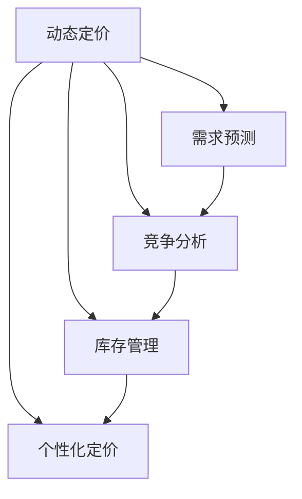

                 

# AI在电商动态定价中的实践效果

## 1. 背景介绍

### 1.1 问题由来
随着电子商务的蓬勃发展，各大电商平台面临激烈的市场竞争。如何通过高效合理的定价策略，提升销售额和市场份额，是所有电商平台关注的焦点。传统的静态定价方式，难以灵活应对市场变化和用户需求，因此动态定价成为电商行业的创新方向。

### 1.2 问题核心关键点
动态定价是指根据市场需求、竞争对手价格、库存状态等多种因素，实时调整商品价格，以优化销售效果和利润率。AI技术的应用，使得电商动态定价策略更加智能、精准、高效。AI在电商动态定价中的应用，主要体现在以下几个方面：

- **需求预测**：利用机器学习算法，预测未来销售趋势和用户需求，指导动态定价策略。
- **竞争分析**：分析竞争对手的价格策略，动态调整自身价格以保持竞争力。
- **库存管理**：通过需求预测和价格调整，优化库存水平，减少缺货和积压。
- **个性化定价**：根据用户行为和偏好，实施个性化定价，提升用户体验和满意度。

### 1.3 问题研究意义
AI在电商动态定价中的应用，能够大幅提升定价策略的灵活性和精准性，为电商平台带来显著的商业价值。具体而言，AI动态定价技术可以：

1. **提升销售额**：通过精准定价策略，引导用户购买决策，提升销售转化率。
2. **优化库存管理**：实时调整库存水平，降低库存成本，提高资金周转率。
3. **增强竞争力**：动态响应市场变化和竞争对手策略，保持价格优势。
4. **提升用户体验**：通过个性化定价，满足用户差异化需求，提升用户满意度。
5. **降低运营成本**：减少人工干预和错误，优化运营流程，降低人力和时间成本。

## 2. 核心概念与联系

### 2.1 核心概念概述

为更好地理解AI在电商动态定价中的应用，本节将介绍几个关键概念及其相互联系：

- **动态定价**：根据市场动态变化，实时调整商品价格的过程。
- **需求预测**：利用机器学习算法，预测未来用户需求的变化趋势。
- **竞争分析**：分析竞争对手的价格策略，动态调整自身价格以保持竞争优势。
- **库存管理**：实时监测库存状态，优化库存水平，避免缺货或积压。
- **个性化定价**：根据用户行为和偏好，实施差异化的定价策略。
- **AI算法**：利用机器学习和深度学习算法，实现需求预测、竞争分析、库存管理等任务。

这些概念之间的逻辑关系可以通过以下Mermaid流程图来展示：



这个流程图展示了大语言模型的核心概念及其之间的关系：

1. 动态定价是整个系统的核心目标，其策略调整依赖于需求预测、竞争分析、库存管理和个性化定价等多方面的输入。
2. 需求预测和竞争分析，为动态定价提供市场导向，帮助电商平台把握价格调整的时机和幅度。
3. 库存管理，确保商品供应与需求匹配，避免价格策略执行过程中的缺货或积压问题。
4. 个性化定价，增强用户粘性，提升用户满意度和转化率。

这些概念共同构成了电商动态定价的核心框架，AI算法在其中扮演了关键角色。通过合理利用AI技术，电商平台可以构建更加智能、高效的动态定价系统。

## 3. 核心算法原理 & 具体操作步骤
### 3.1 算法原理概述

AI在电商动态定价中主要采用了以下算法原理：

1. **需求预测算法**：利用历史销售数据和市场趋势，预测未来销售量和价格变化，为动态定价提供依据。
2. **竞争分析算法**：分析竞争对手的价格策略和市场表现，动态调整自身价格以保持竞争优势。
3. **库存管理算法**：实时监测库存状态，优化库存水平，确保价格策略执行过程中的商品供应。
4. **个性化定价算法**：根据用户行为和偏好，实施差异化的定价策略，提升用户体验和满意度。

这些算法共同构成了一个动态定价系统，帮助电商平台实时调整商品价格，以实现销售最大化和利润优化。

### 3.2 算法步骤详解

基于上述算法原理，电商动态定价系统的主要操作步骤如下：

**Step 1: 数据准备**
- 收集历史销售数据、市场趋势、竞争对手价格、库存数据等，作为算法训练和预测的输入。
- 对数据进行清洗和预处理，确保数据质量。

**Step 2: 模型训练**
- 利用机器学习和深度学习算法，训练需求预测模型、竞争分析模型、库存管理模型和个性化定价模型。
- 需求预测模型：利用时间序列分析等技术，预测未来销售量和价格变化。
- 竞争分析模型：利用聚类、回归等算法，分析竞争对手价格和市场表现。
- 库存管理模型：利用优化算法，实时监测库存水平，优化库存配置。
- 个性化定价模型：利用协同过滤、推荐系统等算法，根据用户行为和偏好，实施差异化定价。

**Step 3: 参数调整**
- 根据模型预测结果，调整动态定价策略。
- 需求预测结果用于指导价格调整的时机和幅度。
- 竞争分析结果用于调整价格水平以保持竞争优势。
- 库存管理结果用于优化库存水平，避免价格策略执行过程中的缺货或积压。
- 个性化定价结果用于满足用户差异化需求，提升用户满意度和转化率。

**Step 4: 实时监控与优化**
- 实时监测市场动态和用户反馈，不断调整和优化动态定价策略。
- 使用A/B测试等方法，评估价格策略的效果，不断迭代优化。

### 3.3 算法优缺点

AI在电商动态定价中的应用，具有以下优点：

1. **精准性高**：通过机器学习和大数据分析，精准预测需求变化和竞争动态，为价格调整提供依据。
2. **响应速度快**：实时监测市场动态，快速调整价格策略，提升销售效率。
3. **个性化程度高**：利用用户行为和偏好数据，实施差异化定价，提升用户体验和满意度。
4. **成本低**：减少人工干预和错误，优化运营流程，降低人力和时间成本。

同时，该方法也存在一些局限性：

1. **数据依赖度高**：模型预测效果依赖于历史数据的质量和数量，数据不足或数据质量差会影响模型性能。
2. **复杂度较高**：模型训练和优化过程复杂，需要具备一定的技术储备。
3. **解释性不足**：AI模型往往作为“黑箱”存在，难以解释其内部工作机制。
4. **安全风险**：数据隐私和模型安全可能面临威胁，需要加强数据保护和模型安全措施。

尽管存在这些局限性，但AI动态定价在电商行业中已经展现出强大的潜力，并得到了广泛应用。未来相关研究的方向，在于进一步提升算法的透明性和解释性，降低对数据依赖，提高模型的鲁棒性和安全性。

### 3.4 算法应用领域

AI在电商动态定价中的应用，不仅限于商品价格调整，还涉及到更多领域，如：

- **商品推荐系统**：利用个性化定价和需求预测，推荐用户感兴趣的商品，提升购买转化率。
- **广告投放优化**：根据用户行为和市场趋势，优化广告投放策略，提升广告效果和ROI。
- **库存管理优化**：通过实时监测库存水平，优化库存配置，减少缺货和积压，提升资金周转率。
- **用户行为分析**：利用AI算法分析用户行为数据，洞察用户需求，提升市场洞察力。

此外，AI动态定价技术还被广泛应用于供应链管理、物流优化、客户服务等诸多领域，为电商行业的运营效率和服务质量带来显著提升。

## 4. 数学模型和公式 & 详细讲解  
### 4.1 数学模型构建

本节将使用数学语言对电商动态定价中的AI算法进行更加严格的刻画。

记市场需求为 $D_t$，价格为 $P_t$，竞争对手价格为 $P_{comp}$，库存水平为 $I_t$，用户行为为 $B_t$，其他因素为 $X_t$。则电商动态定价的目标为：

$$
\min_{P_t, D_t, P_{comp}, I_t, B_t, X_t} \sum_{t=1}^{T} (R_{t-1} - C_t)
$$

其中 $R_{t-1}$ 为前一时刻的利润，$C_t$ 为第 $t$ 时刻的成本。目标是通过调整价格、市场需求、竞争对手价格、库存水平、用户行为和其他因素，最大化利润。

### 4.2 公式推导过程

以需求预测模型为例，假设市场需求 $D_t$ 与前一时刻的需求 $D_{t-1}$ 和当前价格 $P_t$ 存在线性关系，即 $D_t = a_1 + a_2 D_{t-1} + a_3 P_t$。则通过最小二乘法，可以求解需求预测模型参数：

$$
\hat{a_1}, \hat{a_2}, \hat{a_3} = \arg\min_{a_1, a_2, a_3} \sum_{t=1}^{T} (D_t - a_1 - a_2 D_{t-1} - a_3 P_t)^2
$$

在求解过程中，可以使用梯度下降算法来迭代更新参数。对于梯度 $\nabla L(a_1, a_2, a_3)$，其更新公式为：

$$
a_i \leftarrow a_i - \eta \nabla_{a_i}L(a_1, a_2, a_3)
$$

其中 $\eta$ 为学习率。

### 4.3 案例分析与讲解

以某电商平台在电商节日期间的动态定价为例：

假设市场需求 $D_t$ 与价格 $P_t$ 和竞争对手价格 $P_{comp}$ 存在线性关系，即 $D_t = 100 - 2P_t + 0.5P_{comp}$。

**Step 1: 数据准备**
- 收集历史销售数据，包括价格、市场需求、竞争对手价格等。
- 对数据进行清洗和预处理，确保数据质量。

**Step 2: 模型训练**
- 利用历史数据训练需求预测模型，求解参数 $a_1 = 100$, $a_2 = -2$, $a_3 = 0.5$。
- 在电商节日期间，实时监测市场需求和竞争对手价格，预测未来市场需求 $D_t$。

**Step 3: 参数调整**
- 根据需求预测结果，调整价格策略。例如，当市场需求高时，适当提高价格；当竞争对手价格下降时，相应降低价格。
- 实时监测库存水平和用户行为，优化库存配置，确保价格策略执行过程中的商品供应。

**Step 4: 实时监控与优化**
- 实时监测市场动态和用户反馈，不断调整和优化动态定价策略。
- 使用A/B测试等方法，评估价格策略的效果，不断迭代优化。

通过以上步骤，电商平台可以在电商节日期间，实现高效灵活的动态定价，提升销售额和利润率。

## 5. 项目实践：代码实例和详细解释说明
### 5.1 开发环境搭建

在进行电商动态定价实践前，我们需要准备好开发环境。以下是使用Python进行PyTorch开发的环境配置流程：

1. 安装Anaconda：从官网下载并安装Anaconda，用于创建独立的Python环境。

2. 创建并激活虚拟环境：
```bash
conda create -n pytorch-env python=3.8 
conda activate pytorch-env
```

3. 安装PyTorch：根据CUDA版本，从官网获取对应的安装命令。例如：
```bash
conda install pytorch torchvision torchaudio cudatoolkit=11.1 -c pytorch -c conda-forge
```

4. 安装TensorFlow：由Google主导开发的开源深度学习框架，生产部署方便，适合大规模工程应用。同样有丰富的预训练语言模型资源。

5. 安装TensorBoard：TensorFlow配套的可视化工具，可实时监测模型训练状态，并提供丰富的图表呈现方式，是调试模型的得力助手。

完成上述步骤后，即可在`pytorch-env`环境中开始电商动态定价实践。

### 5.2 源代码详细实现

下面我以电商平台在电商节日期间的需求预测为例，给出使用PyTorch进行动态定价的PyTorch代码实现。

首先，定义需求预测函数：

```python
import torch
import torch.nn as nn
import torch.optim as optim

class DemandPredictor(nn.Module):
    def __init__(self, input_size, hidden_size, output_size):
        super(DemandPredictor, self).__init__()
        self.hidden = nn.Linear(input_size, hidden_size)
        self.output = nn.Linear(hidden_size, output_size)
        
    def forward(self, x):
        x = torch.relu(self.hidden(x))
        x = self.output(x)
        return x
```

然后，定义训练函数和优化器：

```python
from sklearn.preprocessing import MinMaxScaler
from sklearn.metrics import mean_squared_error
import pandas as pd

def train_demand_predictor(train_data, test_data, input_size, hidden_size, output_size, epochs, learning_rate):
    # 数据标准化
    scaler = MinMaxScaler(feature_range=(0, 1))
    train_scaled = scaler.fit_transform(train_data.values)
    test_scaled = scaler.transform(test_data.values)
    
    # 构建模型
    model = DemandPredictor(input_size, hidden_size, output_size)
    optimizer = optim.Adam(model.parameters(), lr=learning_rate)
    
    # 训练模型
    for epoch in range(epochs):
        inputs = train_scaled[:, :-1]
        targets = train_scaled[:, -1]
        optimizer.zero_grad()
        outputs = model(inputs)
        loss = nn.MSELoss()(outputs, targets)
        loss.backward()
        optimizer.step()
        if epoch % 10 == 0:
            print(f"Epoch {epoch+1}, loss: {loss.item()}")
    
    # 评估模型
    inputs = test_scaled[:, :-1]
    targets = test_scaled[:, -1]
    outputs = model(inputs)
    mse = mean_squared_error(targets, outputs)
    return mse

# 加载数据
train_data = pd.read_csv('train_data.csv')
test_data = pd.read_csv('test_data.csv')
```

最后，启动训练流程：

```python
# 设置参数
input_size = 3
hidden_size = 128
output_size = 1
epochs = 100
learning_rate = 0.001

# 训练模型
mse = train_demand_predictor(train_data, test_data, input_size, hidden_size, output_size, epochs, learning_rate)

# 输出评估结果
print(f"Mean Squared Error: {mse}")
```

以上就是使用PyTorch进行需求预测的完整代码实现。可以看到，通过简单的线性回归模型，便可以实现对市场需求的时间序列预测，为动态定价提供依据。

### 5.3 代码解读与分析

让我们再详细解读一下关键代码的实现细节：

**DemandPredictor类**：
- `__init__`方法：定义模型结构，包括输入层、隐藏层和输出层。
- `forward`方法：定义模型前向传播过程，将输入数据通过隐藏层和输出层，输出预测结果。

**train_demand_predictor函数**：
- 对输入数据进行标准化，确保数据一致性。
- 构建模型和优化器，设置训练参数。
- 在每个epoch上，前向传播计算预测结果和损失函数，反向传播更新模型参数，并输出每10个epoch的损失。
- 训练结束后，在测试集上评估模型性能，返回均方误差。

**加载数据**：
- 使用Pandas库加载训练集和测试集数据。
- 通过MinMaxScaler标准化处理，将数据缩放到0到1之间，方便模型训练。

完成以上步骤后，即可在电商节日期间，利用训练好的需求预测模型，实时调整商品价格，实现高效的动态定价。

## 6. 实际应用场景
### 6.1 智能推荐系统

智能推荐系统是电商动态定价的重要应用场景之一。通过分析用户行为和偏好，推荐系统能够精准预测用户需求，实时调整商品价格，提升用户满意度和购买转化率。

在技术实现上，可以构建基于协同过滤、内容推荐、混合推荐等算法的推荐系统，结合用户历史行为数据和商品属性信息，生成个性化的商品推荐。在推荐过程中，利用需求预测算法和动态定价模型，实时调整推荐结果和商品价格，确保推荐系统能够及时响应市场变化。

### 6.2 库存管理优化

库存管理是电商运营中的重要环节，过高的库存会增加资金占用和存储成本，过低的库存又会导致缺货。通过AI算法，电商平台可以实现更加精准的库存预测和优化管理。

具体而言，可以利用需求预测模型和库存管理模型，实时监测市场需求和库存水平，预测未来库存需求和变化趋势。根据预测结果，动态调整商品价格和库存配置，避免缺货和积压，提升资金周转率。

### 6.3 竞争情报分析

电商平台需要实时监测竞争对手的价格策略和市场表现，以便动态调整自身价格以保持竞争优势。通过竞争分析算法，电商平台可以获取竞争对手的定价信息、促销活动、市场表现等数据，并利用这些数据指导自身价格策略的调整。

在技术实现上，可以利用文本分析、情感分析等技术，从竞争对手的网页、广告、社交媒体等渠道提取相关信息，构建竞争对手情报数据库。通过情感分析算法，判断竞争对手的市场表现和用户反馈，实时调整自身价格策略。

### 6.4 未来应用展望

随着AI技术的不断进步，电商动态定价将进一步扩展应用场景，实现更全面、更高效的价格策略优化。

在智能推荐系统方面，未来将融合更多数据源，如用户评论、社交网络数据等，提升推荐精度和个性化程度。在库存管理优化方面，将引入实时物流数据和供应链管理算法，实现更精准的库存预测和优化。在竞争情报分析方面，将利用自然语言处理和知识图谱技术，提取和分析竞争对手的市场信息，提升竞争情报的准确性和时效性。

此外，未来AI动态定价技术还将广泛应用于医疗、旅游、金融等更多领域，帮助各行各业提升运营效率和服务质量。相信随着技术的不断发展，AI动态定价必将在更多场景中发挥重要作用，为各行各业带来新的商业机遇。

## 7. 工具和资源推荐
### 7.1 学习资源推荐

为了帮助开发者系统掌握电商动态定价的理论基础和实践技巧，这里推荐一些优质的学习资源：

1. 《机器学习实战》：讲解了机器学习基础算法和实际应用案例，适合电商从业者快速入门。
2. 《深度学习》：斯坦福大学的深度学习课程，讲解了深度学习原理和实践技巧。
3. 《TensorFlow实战》：TensorFlow官方文档和实战教程，适合初学者系统学习TensorFlow框架。
4. 《自然语言处理综论》：讲解了自然语言处理基础和前沿技术，适合AI从业者深入学习。
5. 《机器学习入门：Python实现》：讲解了机器学习算法的Python实现方法，适合电商从业者快速上手。

通过对这些资源的学习实践，相信你一定能够快速掌握电商动态定价的精髓，并用于解决实际的商业问题。
###  7.2 开发工具推荐

高效的开发离不开优秀的工具支持。以下是几款用于电商动态定价开发的常用工具：

1. PyTorch：基于Python的开源深度学习框架，灵活动态的计算图，适合快速迭代研究。大部分预训练语言模型都有PyTorch版本的实现。
2. TensorFlow：由Google主导开发的开源深度学习框架，生产部署方便，适合大规模工程应用。同样有丰富的预训练语言模型资源。
3. Transformers库：HuggingFace开发的NLP工具库，集成了众多SOTA语言模型，支持PyTorch和TensorFlow，是进行动态定价任务开发的利器。
4. Weights & Biases：模型训练的实验跟踪工具，可以记录和可视化模型训练过程中的各项指标，方便对比和调优。与主流深度学习框架无缝集成。
5. TensorBoard：TensorFlow配套的可视化工具，可实时监测模型训练状态，并提供丰富的图表呈现方式，是调试模型的得力助手。

合理利用这些工具，可以显著提升电商动态定价任务的开发效率，加快创新迭代的步伐。

### 7.3 相关论文推荐

电商动态定价技术的发展源于学界的持续研究。以下是几篇奠基性的相关论文，推荐阅读：

1. "Adaptive Dynamic Pricing in E-commerce"：介绍了一种基于市场动态的适应性动态定价算法，提升电商平台的定价效率。
2. "Dynamic Pricing in Online Travel Industry: A Survey"：综述了在线旅游行业的动态定价研究，为电商动态定价提供了理论基础。
3. "Customer Value and Online Pricing Strategies"：分析了顾客价值对在线定价策略的影响，为电商动态定价提供了重要参考。
4. "Collaborative Filtering for Recommendation"：讲解了协同过滤算法在推荐系统中的应用，为电商推荐系统提供了基础。
5. "Inventory Management and Pricing Strategies"：分析了库存管理与定价策略的关系，为电商库存管理提供了理论指导。

这些论文代表了大语言模型微调技术的发展脉络。通过学习这些前沿成果，可以帮助研究者把握学科前进方向，激发更多的创新灵感。

## 8. 总结：未来发展趋势与挑战

### 8.1 总结

本文对基于AI的电商动态定价方法进行了全面系统的介绍。首先阐述了电商动态定价的研究背景和意义，明确了AI技术在电商定价中的重要价值。其次，从原理到实践，详细讲解了需求预测、竞争分析、库存管理和个性化定价等核心算法的具体实现。最后，探讨了AI在电商动态定价中的实际应用场景，给出了未来发展的趋势和挑战。

通过本文的系统梳理，可以看到，基于AI的电商动态定价技术正在成为电商行业的重要范式，为电商平台带来显著的商业价值。AI动态定价的应用，能够大幅提升定价策略的灵活性和精准性，为电商平台实现销售最大化和利润优化提供了强大支持。未来，伴随AI技术的不断进步，电商动态定价必将走向更加智能化、高效化的方向。

### 8.2 未来发展趋势

展望未来，电商动态定价技术将呈现以下几个发展趋势：

1. **智能化程度提升**：通过更先进的AI算法和更丰富的数据源，实现更高精度的需求预测和竞争分析，提升定价策略的智能水平。
2. **个性化程度增强**：利用更精细的用户行为数据和个性化推荐算法，实现更加个性化的定价策略，提升用户满意度和转化率。
3. **实时性提升**：通过更高效的计算框架和更快速的算法实现，实现更短的时延和更快的响应速度。
4. **多渠道融合**：将不同渠道的数据和算法融合，实现更全面、更深入的市场分析，提升定价策略的全面性和精准性。
5. **模型透明化**：提升模型的透明性和可解释性，便于电商平台进行决策支持和业务优化。

这些趋势将进一步推动电商动态定价技术的发展，帮助电商平台实现更高效的运营和更优质的用户体验。

### 8.3 面临的挑战

尽管电商动态定价技术已经取得了显著成就，但在向更深层次应用的过程中，仍面临诸多挑战：

1. **数据质量问题**：电商数据来源多样，数据质量参差不齐，数据清洗和处理难度较大。如何提升数据质量，减少数据偏差，是一个重要课题。
2. **模型复杂性**：电商动态定价涉及多个维度（如需求预测、竞争分析、库存管理等），模型复杂性高，需要高效、可扩展的算法和架构。
3. **市场变化应对**：电商市场变化迅速，动态定价模型需要及时调整以适应市场变化，如何提高模型的灵活性和适应性，是一个长期挑战。
4. **用户隐私保护**：电商平台需要保护用户隐私，确保用户数据的安全和合法使用，同时提升用户体验。
5. **技术落地成本**：电商动态定价技术需要投入大量资源进行研发和部署，如何降低技术落地成本，提高技术实施效率，是电商平台需要考虑的问题。

### 8.4 研究展望

面对电商动态定价所面临的挑战，未来的研究需要在以下几个方面寻求新的突破：

1. **多模态数据融合**：将电商数据与其他类型的数据（如社交媒体数据、物流数据等）进行融合，提升定价策略的全面性和精准性。
2. **模型可解释性**：提升AI模型的透明性和可解释性，便于电商平台进行决策支持和业务优化。
3. **实时计算框架**：开发高效、可扩展的计算框架，支持实时计算和处理海量数据，提升动态定价的实时性和灵活性。
4. **用户隐私保护**：引入隐私保护技术，如差分隐私、联邦学习等，确保用户数据的安全和合法使用。
5. **边缘计算应用**：利用边缘计算技术，将动态定价任务在边缘设备上进行处理，提升系统响应速度和数据处理效率。

这些研究方向的探索，必将引领电商动态定价技术迈向更高的台阶，为电商平台提供更高效、更智能、更安全的定价策略支持。面向未来，电商动态定价技术还需要与其他AI技术进行更深入的融合，如知识表示、因果推理、强化学习等，多路径协同发力，共同推动电商行业的数字化转型。总之，电商动态定价技术需要在算法、数据、系统等多个维度进行全面优化，才能真正实现其商业价值和社会价值。

## 9. 附录：常见问题与解答

**Q1：电商动态定价是否适用于所有商品类别？**

A: 电商动态定价技术适用于大多数商品类别，但不同商品的需求预测和竞争分析模型可能需要不同的方法和策略。例如，对于快消品，需求预测模型可以采用季节性分析和时间序列预测；对于奢侈品，竞争分析模型需要考虑品牌效应和市场认知度等因素。

**Q2：如何选择合适的动态定价模型？**

A: 选择动态定价模型时，需要考虑商品特性、市场环境、用户需求等因素。对于高频交易的商品，可以选择基于时间序列分析的需求预测模型；对于高价值商品，可以选择基于竞争分析和市场认知度的定价模型。同时，需要根据具体业务场景和需求，进行模型优化和调参，以获得最佳效果。

**Q3：如何确保动态定价系统的实时性？**

A: 确保动态定价系统的实时性，需要优化数据采集和处理流程，减少数据延迟和处理开销。同时，采用高效的计算框架和算法，如分布式计算、模型压缩等技术，提升系统处理能力。合理利用缓存和预处理技术，提升系统响应速度。

**Q4：如何平衡定价策略和用户体验？**

A: 平衡定价策略和用户体验，需要综合考虑市场需求、用户反馈和竞争情况。采用个性化定价算法，根据用户行为和偏好进行差异化定价，提升用户体验和满意度。同时，需要监控定价策略对用户满意度的影响，及时调整和优化，确保定价策略的合理性和有效性。

**Q5：如何保护用户隐私数据？**

A: 保护用户隐私数据，需要采取严格的隐私保护措施，如数据加密、匿名化处理、差分隐私等技术。建立隐私保护机制，确保用户数据的安全和合法使用。同时，需要加强对用户的透明度和信任度，确保用户知情并同意数据使用。

通过以上问题的解答，可以帮助电商从业者更好地理解和使用动态定价技术，提升电商平台的运营效率和用户满意度。总之，电商动态定价技术需要结合具体业务场景进行优化和实践，方能实现其商业价值和社会价值。

---

作者：禅与计算机程序设计艺术 / Zen and the Art of Computer Programming

