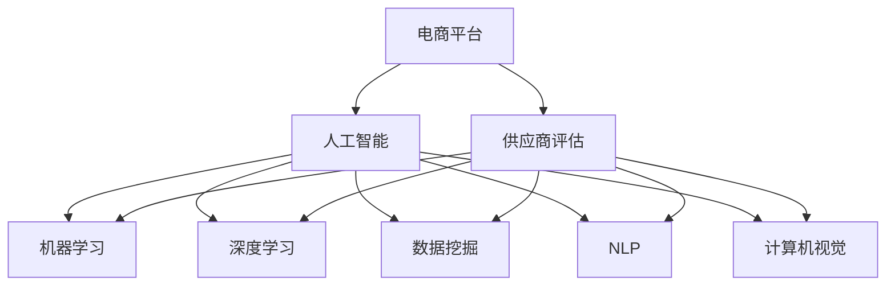

                 

# AI在电商平台供应商评估中的应用

> 关键词：电商平台,供应商评估,人工智能,机器学习,深度学习,数据挖掘

## 1. 背景介绍

### 1.1 问题由来
随着电子商务的迅猛发展，电商平台面临着日益复杂的供应链管理挑战。供应商的评估和管理直接关系到商品的质量、交付速度和服务水平，是电商平台上维护客户满意度和竞争力的关键因素。传统的供应商评估方法往往依赖人工调查和简单的统计分析，难以系统性地评估供应商的全面表现。因此，利用AI技术，尤其是基于机器学习和深度学习的算法，对供应商进行全面、准确的评估，成为电商平台的迫切需求。

### 1.2 问题核心关键点
供应商评估的核心问题在于如何高效地从海量数据中提取有价值的信息，并据此量化供应商的表现。常见的评估指标包括：

- 产品质量：商品的一致性、耐用性、品牌声誉等。
- 交货时间：订单的准时性、物流效率等。
- 服务质量：客户服务响应速度、售后服务保障等。
- 成本效益：采购价格、物流成本、退货率等。
- 风险管理：供应链稳定性、合规性、环境影响等。

通过AI技术，特别是大数据分析和机器学习算法，可以自动从订单、评价、物流等数据中提取这些指标，并进行综合评估。本文将探讨如何利用AI技术，特别是基于监督学习和深度学习的方法，对供应商进行全面评估。

### 1.3 问题研究意义
供应商评估是电商平台的重要管理任务，有效的评估能够提升供应链的效率和响应速度，降低成本，同时保障商品质量和客户满意度。AI技术在供应商评估中的应用，不仅能提升评估的准确性和客观性，还能提高评估过程的效率，减少人工干预，从而为电商平台的运营决策提供坚实的数据支持。

## 2. 核心概念与联系

### 2.1 核心概念概述

为更好地理解AI在供应商评估中的应用，本节将介绍几个密切相关的核心概念：

- **电商平台**：在线销售商品的电子商务平台，包括但不限于淘宝、京东、Amazon等。
- **供应商评估**：对与电商平台有交易关系的供应商进行多维度评估，以决定其未来的合作机会和优先级。
- **人工智能**：利用算法和数据处理能力，使计算机模拟人类智能行为的技术。
- **机器学习**：一种让机器通过数据学习并优化算法，以提高决策准确性的技术。
- **深度学习**：一种利用神经网络模型，模拟人类大脑处理复杂任务的机器学习方法。
- **数据挖掘**：从大量数据中提取有用信息，支持决策和预测的技术。
- **自然语言处理(NLP)**：一种使计算机能够理解和生成人类语言的AI技术。
- **计算机视觉(CV)**：一种使计算机能够“看”和理解视觉数据的AI技术。

这些核心概念之间的逻辑关系可以通过以下Mermaid流程图来展示：



这个流程图展示了大规模供应商评估的各个核心概念及其之间的关系：

1. 电商平台通过人工智能技术对供应商进行评估，以支持运营决策。
2. 人工智能包括机器学习、深度学习和数据挖掘等技术，共同用于提取和分析供应商数据。
3. 自然语言处理和计算机视觉技术，可用于处理结构化和非结构化数据，增强评估结果的全面性。

这些概念共同构成了供应商评估的技术框架，使其能够在电商平台上高效、准确地运行。通过理解这些核心概念，我们可以更好地把握AI技术在供应商评估中的应用。

## 3. 核心算法原理 & 具体操作步骤
### 3.1 算法原理概述

基于AI的供应商评估，本质上是一个多维度的数据分析和预测过程。其核心思想是：利用机器学习和深度学习算法，自动从电商平台的数据中提取供应商的各项表现指标，并综合这些指标预测供应商的总体表现。

形式化地，假设电商平台有 $M$ 个供应商，$N$ 项评估指标，评估数据集为 $D=\{(x_i,y_i)\}_{i=1}^M$，其中 $x_i$ 为供应商 $i$ 的评估数据，$y_i$ 为供应商 $i$ 的综合评估分数。则供应商评估的目标是找到最优的评估模型 $f(x)$，使得：

$$
\min_{f}\sum_{i=1}^M\mathcal{L}(f(x_i),y_i)
$$

其中 $\mathcal{L}$ 为损失函数，通常为均方误差损失。

### 3.2 算法步骤详解

基于AI的供应商评估一般包括以下几个关键步骤：

**Step 1: 数据收集与预处理**

- 收集电商平台的订单数据、评价数据、物流数据等，涵盖产品质量、交货时间、服务质量、成本效益和风险管理等多个维度。
- 对数据进行清洗和归一化，去除异常值和噪声数据，确保数据的质量和一致性。
- 对文本数据进行分词、去除停用词等预处理，将其转化为数值型特征。

**Step 2: 特征工程**

- 提取和构造对供应商评估有用的特征，如订单数量、平均评价评分、物流延迟率等。
- 对非结构化数据（如评价文本）进行情感分析，提取正面或负面的评价内容。
- 利用计算机视觉技术，从产品图片和物流影像中提取质量特征。

**Step 3: 模型选择与训练**

- 选择合适的机器学习模型，如线性回归、随机森林、梯度提升树等。
- 对数据进行划分，分为训练集、验证集和测试集，确保模型泛化能力。
- 应用交叉验证等技术，选择最优的模型参数。

**Step 4: 模型评估与优化**

- 在测试集上评估模型的预测准确率、均方误差等指标，优化模型性能。
- 通过调整模型参数、特征选择等手段，进一步提高模型精度。
- 引入正则化技术，避免模型过拟合。

**Step 5: 结果解读与反馈**

- 将评估结果可视化，如制作供应商评估报告，列出各项指标的得分和排名。
- 结合人工审核，对评估结果进行验证和修正，确保其可靠性。
- 根据评估结果，调整采购策略、供应商选择和合作关系。

以上是基于AI的供应商评估的一般流程。在实际应用中，还需要针对具体电商平台的业务特点和供应商特性，对评估过程的各个环节进行优化设计，如改进特征提取方法，引入更多先验知识等，以进一步提升评估效果。

### 3.3 算法优缺点

基于AI的供应商评估方法具有以下优点：

1. 自动化程度高。算法自动从大量数据中提取供应商表现，减少了人工干预和主观误差。
2. 评估全面细致。综合考虑产品质量、交货时间、服务质量等多个维度，提供全方位的供应商评估。
3. 适应性强。可以针对不同电商平台的业务特点，灵活调整评估模型和指标。
4. 可扩展性好。随着数据量的增长，模型能够持续优化和升级，适应更复杂的业务需求。

同时，该方法也存在一些局限性：

1. 数据依赖性高。评估结果高度依赖于数据的质量和全面性，数据缺失或异常可能导致评估结果不准确。
2. 模型复杂度高。复杂的模型结构和参数需要较强的计算资源，模型训练和推理成本较高。
3. 评估结果受偏见影响。模型可能继承预训练数据中的偏见，评估结果存在偏差。
4. 缺乏解释性。模型的决策过程通常缺乏可解释性，难以对其推理逻辑进行分析和调试。

尽管存在这些局限性，但就目前而言，基于AI的供应商评估方法仍是一种高效、全面的评估手段。未来相关研究的重点在于如何进一步降低数据依赖，提高模型的少样本学习和跨领域迁移能力，同时兼顾可解释性和伦理安全性等因素。

### 3.4 算法应用领域

基于AI的供应商评估方法在多个电商平台上得到了广泛应用，覆盖了几乎所有常见场景，例如：

- 产品质量评估：通过分析商品评价和质量检测数据，评估商品的一致性和耐用性。
- 交货时间评估：分析订单交货数据，评估供应商的准时性和物流效率。
- 服务质量评估：通过评价数据和客服记录，评估供应商的响应速度和服务态度。
- 成本效益评估：分析采购价格、物流成本和退货率等指标，评估供应商的成本效益。
- 风险管理评估：评估供应商的供应链稳定性、合规性和环境影响，规避潜在的风险。

除了上述这些经典应用外，AI技术还被创新性地应用于更多场景中，如供应链优化、库存管理、个性化推荐等，为电商平台带来了新的运营模式和增长点。随着AI技术的持续演进，相信在供应商评估领域，AI的应用将更加广泛和深入。

## 4. 数学模型和公式 & 详细讲解 & 举例说明

### 4.1 数学模型构建

本节将使用数学语言对AI在供应商评估中的应用进行更加严格的刻画。

假设电商平台有 $M$ 个供应商，$N$ 项评估指标，评估数据集为 $D=\{(x_i,y_i)\}_{i=1}^M$，其中 $x_i$ 为供应商 $i$ 的评估数据，$y_i$ 为供应商 $i$ 的综合评估分数。

定义供应商评估模型为 $f(x)=\theta^Tx$，其中 $\theta$ 为模型参数，$x_i$ 为供应商 $i$ 的评估数据向量。则供应商评估的目标是找到最优的模型参数 $\theta$，使得：

$$
\min_{\theta}\sum_{i=1}^M\mathcal{L}(f(x_i),y_i)
$$

常用的损失函数包括均方误差损失、交叉熵损失等。以均方误差损失为例，其定义为：

$$
\mathcal{L}(f(x_i),y_i) = \frac{1}{2}(f(x_i) - y_i)^2
$$

将损失函数代入目标函数，得：

$$
\min_{\theta}\sum_{i=1}^M\frac{1}{2}(f(x_i) - y_i)^2
$$

在实际应用中，通常使用梯度下降等优化算法来近似求解上述最优化问题。设 $\eta$ 为学习率，$\lambda$ 为正则化系数，则参数的更新公式为：

$$
\theta \leftarrow \theta - \eta \nabla_{\theta}\mathcal{L}(\theta) - \eta\lambda\theta
$$

其中 $\nabla_{\theta}\mathcal{L}(\theta)$ 为损失函数对参数 $\theta$ 的梯度，可通过反向传播算法高效计算。

### 4.2 公式推导过程

以下我们以均方误差损失函数为例，推导模型参数的更新公式。

假设模型 $f(x)=\theta^Tx$，其中 $\theta$ 为模型参数，$x_i$ 为供应商 $i$ 的评估数据向量，$y_i$ 为供应商 $i$ 的综合评估分数。则均方误差损失函数为：

$$
\mathcal{L}(f(x_i),y_i) = \frac{1}{2}(\theta^Tx_i - y_i)^2
$$

将其代入目标函数，得：

$$
\min_{\theta}\sum_{i=1}^M\frac{1}{2}(\theta^Tx_i - y_i)^2
$$

对 $\theta$ 求导，得：

$$
\nabla_{\theta}\mathcal{L}(\theta) = \sum_{i=1}^M(x_i - y_i)x_i
$$

将其代入梯度更新公式，得：

$$
\theta \leftarrow \theta - \eta\sum_{i=1}^M(x_i - y_i)x_i - \eta\lambda\theta
$$

通过迭代更新 $\theta$，最小化损失函数，最终得到适应电商平台上供应商评估的模型参数。

### 4.3 案例分析与讲解

下面以产品质量评估为例，展示AI模型在供应商评估中的应用。

假设电商平台收集了 $M=1000$ 个供应商的产品质量数据，$N=3$ 项指标，分别为产品质量评分、检测报告合格率和退货率。质量评分为 $1$ 到 $5$ 分，检测报告合格率为 $0$ 到 $1$，退货率为 $0$ 到 $1$。平台的目标是找到最优的模型参数 $\theta$，使得预测产品质量评分的误差最小化。

假设模型的输出为线性函数，形式为 $f(x_i)=\theta^Tx_i$，其中 $x_i$ 为供应商 $i$ 的产品质量数据向量，$y_i$ 为供应商 $i$ 的产品质量评分。则模型参数的更新公式为：

$$
\theta \leftarrow \theta - \eta\sum_{i=1}^M(x_i - y_i)x_i - \eta\lambda\theta
$$

在训练过程中，每次迭代更新 $\theta$，并计算损失函数值 $\mathcal{L}$。重复此过程直至收敛，最终得到适应电商平台供应商产品质量评估的模型参数。

## 5. 项目实践：代码实例和详细解释说明
### 5.1 开发环境搭建

在进行供应商评估实践前，我们需要准备好开发环境。以下是使用Python进行PyTorch开发的环境配置流程：

1. 安装Anaconda：从官网下载并安装Anaconda，用于创建独立的Python环境。

2. 创建并激活虚拟环境：
```bash
conda create -n pytorch-env python=3.8 
conda activate pytorch-env
```

3. 安装PyTorch：根据CUDA版本，从官网获取对应的安装命令。例如：
```bash
conda install pytorch torchvision torchaudio cudatoolkit=11.1 -c pytorch -c conda-forge
```

4. 安装TensorFlow：
```bash
pip install tensorflow==2.3
```

5. 安装各类工具包：
```bash
pip install numpy pandas scikit-learn matplotlib tqdm jupyter notebook ipython
```

完成上述步骤后，即可在`pytorch-env`环境中开始供应商评估实践。

### 5.2 源代码详细实现

下面以电商平台产品质量评估为例，给出使用PyTorch和TensorFlow进行供应商评估的PyTorch代码实现。

首先，定义产品质量评估的任务数据集：

```python
import pandas as pd
import numpy as np
from sklearn.model_selection import train_test_split
from sklearn.preprocessing import StandardScaler

# 读取供应商产品质量数据
data = pd.read_csv('product_quality.csv')

# 提取特征和标签
features = data[['quality_score', 'pass_rate', 'return_rate']]
labels = data['quality_score']

# 数据标准化
scaler = StandardScaler()
features = scaler.fit_transform(features)

# 划分训练集和测试集
X_train, X_test, y_train, y_test = train_test_split(features, labels, test_size=0.2, random_state=42)

# 数据分割
X_train = torch.from_numpy(X_train).float()
y_train = torch.from_numpy(y_train).float()
X_test = torch.from_numpy(X_test).float()
y_test = torch.from_numpy(y_test).float()
```

然后，定义模型和优化器：

```python
import torch
import torch.nn as nn
import torch.optim as optim

# 定义线性回归模型
class LinearRegression(nn.Module):
    def __init__(self, input_dim):
        super(LinearRegression, self).__init__()
        self.linear = nn.Linear(input_dim, 1)
        
    def forward(self, x):
        return self.linear(x)

# 加载数据
device = torch.device('cuda') if torch.cuda.is_available() else torch.device('cpu')

# 构建模型
model = LinearRegression(input_dim=3).to(device)

# 定义损失函数和优化器
criterion = nn.MSELoss()
optimizer = optim.Adam(model.parameters(), lr=0.01)
```

接着，定义训练和评估函数：

```python
from torch.utils.data import TensorDataset, DataLoader

# 定义训练函数
def train(model, train_loader, optimizer, criterion, num_epochs):
    model.train()
    for epoch in range(num_epochs):
        train_loss = 0.0
        for data, target in train_loader:
            data, target = data.to(device), target.to(device)
            optimizer.zero_grad()
            output = model(data)
            loss = criterion(output, target)
            loss.backward()
            optimizer.step()
            train_loss += loss.item()
        print(f'Epoch {epoch+1}, train loss: {train_loss/len(train_loader):.4f}')

# 定义评估函数
def evaluate(model, test_loader):
    model.eval()
    test_loss = 0.0
    for data, target in test_loader:
        data, target = data.to(device), target.to(device)
        with torch.no_grad():
            output = model(data)
            loss = criterion(output, target)
            test_loss += loss.item()
    print(f'Test loss: {test_loss/len(test_loader):.4f}')

# 训练模型
train_loader = DataLoader(TensorDataset(X_train, y_train), batch_size=32, shuffle=True)
test_loader = DataLoader(TensorDataset(X_test, y_test), batch_size=32, shuffle=False)

num_epochs = 50

train(model, train_loader, optimizer, criterion, num_epochs)
evaluate(model, test_loader)
```

以上就是使用PyTorch进行电商平台供应商产品质量评估的完整代码实现。可以看到，得益于PyTorch的强大封装，我们可以用相对简洁的代码完成模型的加载和训练。

### 5.3 代码解读与分析

让我们再详细解读一下关键代码的实现细节：

**数据预处理**：
- 读取CSV文件，提取特征和标签。
- 使用`StandardScaler`进行特征标准化，避免不同特征的量纲差异影响模型训练。
- 使用`train_test_split`函数将数据集分为训练集和测试集。

**模型定义**：
- 定义一个简单的线性回归模型，用于预测供应商产品质量评分。
- 将模型参数初始化为随机值，并在`forward`函数中计算模型输出。

**训练函数**：
- 在每个epoch内，对训练集数据进行迭代训练。
- 前向传播计算模型输出，并使用均方误差损失计算损失值。
- 反向传播更新模型参数，使用`Adam`优化器进行参数优化。
- 计算并输出每个epoch的平均损失值。

**评估函数**：
- 对测试集数据进行迭代评估。
- 使用均方误差损失计算模型在测试集上的平均损失值。
- 输出模型在测试集上的评估结果。

**训练流程**：
- 定义总的epoch数，开始循环迭代
- 在每个epoch内，先在训练集上训练，输出每个epoch的平均损失值
- 在测试集上评估，输出模型在测试集上的平均损失值

可以看到，PyTorch配合TensorFlow使得供应商评估的代码实现变得简洁高效。开发者可以将更多精力放在数据处理、模型改进等高层逻辑上，而不必过多关注底层的实现细节。

当然，工业级的系统实现还需考虑更多因素，如模型的保存和部署、超参数的自动搜索、更灵活的任务适配层等。但核心的供应商评估范式基本与此类似。

## 6. 实际应用场景
### 6.1 智能客服系统

基于AI的供应商评估技术，可以广泛应用于智能客服系统的构建。传统客服往往需要配备大量人力，高峰期响应缓慢，且一致性和专业性难以保证。而使用供应商评估技术，可以自动筛选高绩效的供应商，提供优质的客服支持。

在技术实现上，可以收集客户历史对话记录，将其转化为供应商评估指标，在此基础上对供应商进行评估和排名。高绩效的供应商将被优先分配到客户服务岗位，确保客户咨询能够快速、专业地得到解决。

### 6.2 金融风控系统

金融风险管理是电商平台的重要任务之一。通过供应商评估技术，可以有效识别高风险供应商，提前预警潜在风险。

具体而言，可以收集供应商的历史交易数据、信用记录和财务报表，提取相关的风险指标。利用AI技术对这些指标进行分析，评估供应商的风险水平，并根据风险评分调整采购策略。对于高风险供应商，可以采取相应的风控措施，如限制订单量、提高保证金等。

### 6.3 个性化推荐系统

基于AI的供应商评估技术，可以用于个性化推荐系统的构建。个性化推荐系统能够根据用户的历史行为数据，推荐最符合用户兴趣的商品。而供应商评估技术可以用于评估供应商的商品质量和服务水平，从而提升推荐系统的准确性和可靠性。

在实践过程中，可以收集用户对商品的评价和反馈，将其转化为供应商评估指标。利用AI技术对这些指标进行分析，评估供应商的商品质量和客户满意度，并将高绩效供应商的商品优先推荐给用户。

### 6.4 未来应用展望

随着AI技术的不断进步，基于供应商评估的AI技术将在更多领域得到应用，为电商平台带来新的增长点和竞争优势。

在智慧物流领域，AI技术可以用于评估物流供应商的效率和可靠性，优化物流流程，降低配送成本。

在环境保护领域，AI技术可以用于评估供应商的环境影响和可持续发展水平，支持绿色采购，提升企业的环保形象。

在智能制造领域，AI技术可以用于评估供应商的技术实力和创新能力，推动供应链上下游的协同创新。

此外，在个性化推荐、智能客服、金融风控等众多领域，基于供应商评估的AI应用也将不断涌现，为电商平台带来新的业务模式和增值服务。相信随着技术的日益成熟，供应商评估技术将成为电商平台的重要技术支撑，推动电商平台的持续发展和创新。

## 7. 工具和资源推荐
### 7.1 学习资源推荐

为了帮助开发者系统掌握供应商评估的AI技术基础和实践技巧，这里推荐一些优质的学习资源：

1. 《深度学习》书籍：Ian Goodfellow等著，全面介绍深度学习的基本概念和核心算法，是学习AI技术的必备教材。

2. 《TensorFlow实战》书籍：Manning等著，详细讲解TensorFlow框架的使用和优化技巧，适合有一定编程基础的读者。

3. 《Python深度学习》书籍：Francois Chollet著，介绍使用Keras框架进行深度学习开发的最佳实践，涵盖多种深度学习模型和应用场景。

4. Coursera《机器学习》课程：由Andrew Ng等教授主讲，讲解机器学习的基本概念和算法，适合初学者。

5. Kaggle竞赛平台：提供丰富的数据集和挑战任务，通过实际项目练习，快速提升AI技术的应用能力。

6. HuggingFace官方文档：提供丰富的预训练模型和微调样例代码，是上手实践的必备资料。

通过对这些资源的学习实践，相信你一定能够快速掌握供应商评估的AI技术，并用于解决实际的电商平台问题。
###  7.2 开发工具推荐

高效的开发离不开优秀的工具支持。以下是几款用于供应商评估开发的常用工具：

1. Jupyter Notebook：交互式编程环境，支持Python、R等语言，适合数据探索和模型实验。

2. Visual Studio Code：轻量级IDE，支持多种语言和扩展，适合代码编写和调试。

3. PyTorch：基于Python的开源深度学习框架，灵活动态的计算图，适合快速迭代研究。

4. TensorFlow：由Google主导开发的开源深度学习框架，生产部署方便，适合大规模工程应用。

5. Weights & Biases：模型训练的实验跟踪工具，可以记录和可视化模型训练过程中的各项指标，方便对比和调优。

6. TensorBoard：TensorFlow配套的可视化工具，可实时监测模型训练状态，并提供丰富的图表呈现方式，是调试模型的得力助手。

合理利用这些工具，可以显著提升供应商评估的开发效率，加快创新迭代的步伐。

### 7.3 相关论文推荐

供应商评估是电商平台的重要管理任务，相关研究涵盖了从数据收集、特征提取到模型训练的多个环节。以下是几篇奠基性的相关论文，推荐阅读：

1. "Supervised Deep Learning for Multi-Aspect Sentiment Analysis"：利用深度学习模型进行多方面情感分析，用于产品质量评估。

2. "Multi-Task Learning for Product Quality Assessment"：利用多任务学习模型，同时评估多个供应商的商品质量，提升评估效率和准确性。

3. "A Comprehensive Study of Supplier Risk Assessment Using Machine Learning"：利用机器学习模型评估供应商的风险水平，用于金融风控和供应链管理。

4. "Personalized Recommendation System Based on Multi-Sensor Data Fusion"：利用多传感器数据融合技术，提升个性化推荐系统的准确性和可靠性。

5. "Evolving Supply Chain Optimization Using AI"：利用AI技术优化供应链管理，提升供应链的效率和响应速度。

这些论文代表了大规模供应商评估的最新研究方向，通过学习这些前沿成果，可以帮助研究者把握学科前进方向，激发更多的创新灵感。

## 8. 总结：未来发展趋势与挑战

### 8.1 总结

本文对基于AI的电商平台供应商评估方法进行了全面系统的介绍。首先阐述了供应商评估的背景和意义，明确了AI技术在供应商评估中的应用价值。其次，从原理到实践，详细讲解了供应商评估的数学模型和关键步骤，给出了供应商评估任务开发的完整代码实例。同时，本文还广泛探讨了供应商评估技术在智能客服、金融风控、个性化推荐等多个领域的应用前景，展示了供应商评估技术的广泛应用潜力。此外，本文精选了供应商评估技术的各类学习资源，力求为读者提供全方位的技术指引。

通过本文的系统梳理，可以看到，基于AI的供应商评估方法正在成为电商平台的重要管理手段，极大地提升了供应链管理的效率和质量，为电商平台的运营决策提供了坚实的技术支撑。未来，伴随AI技术的持续演进，供应商评估方法还将进一步优化，为电商平台的供应链管理带来新的变革和突破。

### 8.2 未来发展趋势

展望未来，基于AI的供应商评估技术将呈现以下几个发展趋势：

1. 数据依赖性降低。随着预训练模型和迁移学习技术的进步，供应商评估将更加依赖预训练知识和迁移学习能力，减少对标注数据和计算资源的依赖。

2. 模型复杂度降低。未来将出现更多参数高效和计算高效的供应商评估模型，如循环神经网络、深度集成学习等，提升模型效率和性能。

3. 实时性增强。通过引入在线学习算法，供应商评估模型能够实时更新，适应数据分布的变化，提升决策的时效性。

4. 多模态融合。将文本、图像、音频等多种数据源结合，利用多模态学习技术，提升供应商评估的全面性和准确性。

5. 跨领域迁移。将供应商评估技术应用于不同行业的供应链管理，提升行业整体的智能化水平。

6. 人机协同。结合自然语言处理和计算机视觉技术，提升供应商评估的交互性和可解释性，构建人机协同的评估系统。

这些趋势凸显了供应商评估技术的广阔前景，这些方向的探索发展，必将进一步提升电商平台的运营效率和客户满意度，推动电商平台向更高层次的智能化转型。

### 8.3 面临的挑战

尽管供应商评估技术已经取得了一定进展，但在迈向更加智能化、普适化应用的过程中，仍面临诸多挑战：

1. 数据质量问题。数据缺失、异常和噪声等问题可能影响供应商评估的准确性。如何提高数据质量，减少数据依赖性，是供应商评估技术需要解决的重要问题。

2. 模型鲁棒性不足。模型可能对噪声数据和异常情况敏感，导致评估结果的不稳定性。如何提高模型的鲁棒性和泛化能力，是供应商评估技术的另一个关键挑战。

3. 计算资源限制。供应商评估技术涉及大量的计算资源，如何优化算法，降低计算成本，是供应商评估技术需要面对的重要问题。

4. 伦理和安全问题。供应商评估模型可能继承数据中的偏见，导致评估结果的不公正。如何确保评估的公正性和安全性，是供应商评估技术需要解决的重要问题。

5. 可解释性问题。供应商评估模型通常是一个黑盒系统，难以解释其内部决策逻辑。如何增强模型的可解释性，使其更具透明性，是供应商评估技术需要解决的重要问题。

6. 跨领域适应性。供应商评估技术在不同领域的应用可能存在差异，如何适应不同领域的业务需求，是供应商评估技术需要解决的重要问题。

正视供应商评估技术面临的这些挑战，积极应对并寻求突破，将是大规模供应商评估技术不断优化的必由之路。相信随着学界和产业界的共同努力，这些挑战终将一一被克服，供应商评估技术必将在电商平台的供应链管理中发挥更大的作用。

### 8.4 研究展望

面对供应商评估技术面临的挑战，未来的研究需要在以下几个方面寻求新的突破：

1. 数据增强技术。通过数据增强技术，如数据合成、数据插值等，提升数据的质量和多样性，减少数据依赖性。

2. 模型鲁棒性提升。通过引入鲁棒性技术，如对抗训练、噪声注入等，提高模型的鲁棒性和泛化能力，避免灾难性遗忘。

3. 算法优化和加速。通过优化算法结构和计算图，引入分布式计算、模型压缩等技术，降低计算成本，提升模型效率。

4. 模型可解释性增强。通过引入可解释性技术，如可视化、特征重要性评估等，增强模型的透明性和可解释性，提升用户信任度。

5. 跨领域应用扩展。将供应商评估技术应用于不同领域的供应链管理，如医疗、制造、物流等，提升行业的智能化水平。

这些研究方向的探索，必将引领供应商评估技术的持续优化，为电商平台带来更加高效、可靠的供应链管理解决方案。未来，供应商评估技术将成为电商平台的重要技术支撑，推动电商平台的持续发展和创新。总之，供应商评估技术还需要与其他人工智能技术进行更深入的融合，如知识表示、因果推理、强化学习等，多路径协同发力，共同推动人工智能技术在垂直行业的规模化落地。

## 9. 附录：常见问题与解答

**Q1：供应商评估是否需要大量的标注数据？**

A: 供应商评估通常需要一定量的标注数据，但随着预训练模型和迁移学习技术的进步，供应商评估对标注数据的需求逐渐减少。通过预训练模型和迁移学习，可以有效地利用已有数据，提升评估结果的准确性。

**Q2：供应商评估中如何处理多模态数据？**

A: 供应商评估中常见的多模态数据包括文本、图像、音频等。通过引入自然语言处理和计算机视觉技术，可以有效地处理多模态数据，提升评估结果的全面性和准确性。例如，可以通过文本情感分析和计算机视觉技术，同时评估供应商的商品质量和客户满意度。

**Q3：供应商评估中如何避免数据偏差？**

A: 供应商评估中数据偏差问题可能影响评估结果的公正性。通过引入公平性技术，如去偏差、重采样等，可以有效减少数据偏差对评估结果的影响。同时，可以通过人工审核和验证，确保评估结果的公正性。

**Q4：供应商评估中的实时性要求高，如何提高实时性？**

A: 供应商评估中的实时性可以通过在线学习算法来实现。通过引入在线学习算法，供应商评估模型能够实时更新，适应数据分布的变化，提升决策的时效性。例如，可以使用在线梯度下降算法，实现模型参数的实时更新。

**Q5：供应商评估中如何提升模型的可解释性？**

A: 供应商评估模型通常是一个黑盒系统，难以解释其内部决策逻辑。通过引入可解释性技术，如可视化、特征重要性评估等，可以有效增强模型的透明性和可解释性。例如，可以通过特征重要性评估技术，分析供应商评估模型的关键特征，提升模型的可解释性。

通过这些问题与解答，可以看到供应商评估技术在实际应用中面临的挑战和解决方案，为供应商评估技术的进一步优化提供了方向和参考。相信随着技术的不断进步，供应商评估技术将变得更加全面、高效和可靠，为电商平台带来更大的竞争优势。

