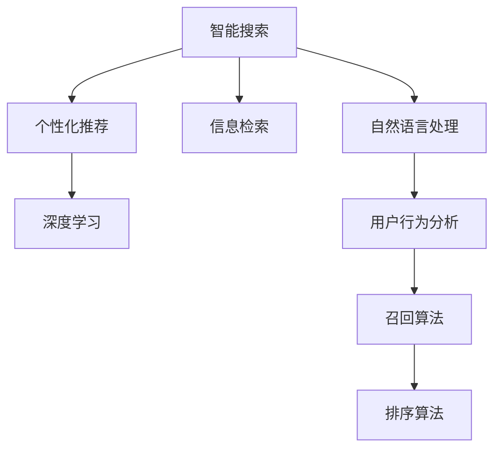

                 

# AI在电商搜索导购中的应用：从智能搜索到个性化推荐

> 关键词：电商搜索, 智能推荐, 深度学习, 信息检索, 自然语言处理, 用户行为分析, 召回算法, 排序算法

## 1. 背景介绍

### 1.1 问题由来
电子商务的兴起和互联网技术的快速发展，使得在线购物成为人们日常生活的一部分。随着商品种类的日益丰富和用户需求的日益个性化，传统的搜索和推荐系统已经难以满足用户的多样化需求。在这样的背景下，AI技术尤其是深度学习和自然语言处理(NLP)技术的引入，为电商搜索和推荐系统的升级提供了新的可能性。

从智能搜索到个性化推荐，AI技术在电商领域的应用不断深入，逐步构建起一套以用户为中心、以数据为基础的智能导购系统。本文将系统性地介绍AI在电商搜索和推荐中的应用，从智能搜索到个性化推荐，展现AI技术如何重塑电商购物体验。

### 1.2 问题核心关键点
AI在电商搜索和推荐中的应用，主要包括以下几个关键点：

1. **智能搜索**：通过NLP技术对用户查询意图进行解析，并提供最相关的商品或信息。
2. **个性化推荐**：基于用户的历史行为和偏好，动态生成个性化推荐列表。
3. **深度学习**：利用深度神经网络模型对用户行为进行建模，提升推荐准确性。
4. **信息检索**：通过索引和检索技术，快速找到匹配用户查询的商品。
5. **用户行为分析**：分析用户浏览、购买、评论等行为数据，优化推荐策略。
6. **召回算法**：确保搜索结果中包含足够多的相关商品。
7. **排序算法**：根据不同维度对商品进行排序，提高推荐的价值和用户体验。

本文将从智能搜索和个性化推荐两方面，全面阐述AI技术在电商领域的应用，并探讨其未来发展趋势和面临的挑战。

## 2. 核心概念与联系

### 2.1 核心概念概述

为了更好地理解AI在电商搜索和推荐中的应用，本节将介绍几个密切相关的核心概念：

1. **智能搜索**：利用自然语言处理和信息检索技术，对用户查询进行理解，并提供相关的搜索结果。
2. **个性化推荐**：根据用户的历史行为和偏好，动态生成个性化的商品推荐列表。
3. **深度学习**：使用深度神经网络模型对用户行为进行建模，提升推荐系统的准确性和用户满意度。
4. **信息检索**：通过索引和检索技术，快速找到匹配用户查询的商品。
5. **用户行为分析**：通过分析用户的行为数据，优化推荐策略，提升用户体验。
6. **召回算法**：确保搜索结果中包含足够多的相关商品，避免漏选。
7. **排序算法**：根据不同维度对商品进行排序，提高推荐的价值和用户体验。

这些概念之间的逻辑关系可以通过以下Mermaid流程图来展示：



这个流程图展示了智能搜索、个性化推荐、深度学习、信息检索、用户行为分析、召回算法和排序算法之间的联系：

1. 智能搜索：通过自然语言处理和信息检索技术，对用户查询进行解析，快速找到匹配的商品。
2. 个性化推荐：基于用户行为分析，使用深度学习模型生成个性化推荐列表。
3. 深度学习：通过建模用户行为，提升推荐系统的准确性和鲁棒性。
4. 信息检索：利用索引和检索技术，确保搜索结果的相关性。
5. 用户行为分析：分析用户的历史行为数据，优化推荐策略。
6. 召回算法：确保搜索结果中包含足够多的相关商品。
7. 排序算法：根据不同维度对商品进行排序，提高推荐的价值和用户体验。

这些概念共同构成了AI在电商搜索和推荐中的核心框架，使得电商系统能够更好地满足用户需求，提升购物体验。

## 3. 核心算法原理 & 具体操作步骤

### 3.1 算法原理概述

AI在电商搜索和推荐中的应用，本质上是利用AI技术对用户的行为和需求进行建模，通过智能搜索和个性化推荐，提供更好的购物体验。核心算法原理主要包括以下几个方面：

1. **自然语言处理(NLP)**：对用户查询进行理解和解析，确保搜索结果的相关性和准确性。
2. **信息检索**：通过索引和检索技术，快速找到匹配用户查询的商品。
3. **深度学习模型**：使用神经网络对用户行为进行建模，提升推荐的准确性和个性化程度。
4. **召回算法**：确保搜索结果中包含足够多的相关商品，避免漏选。
5. **排序算法**：根据不同维度对商品进行排序，提高推荐的价值和用户体验。

### 3.2 算法步骤详解

**步骤1: 数据准备**

- 收集用户的行为数据，包括浏览历史、购买记录、评论等。
- 将数据进行清洗和预处理，去除噪声和不相关数据。
- 将数据分为训练集和测试集，用于模型训练和效果评估。

**步骤2: 模型训练**

- 使用深度学习模型（如CNN、RNN、Transformer等）对用户行为进行建模。
- 训练模型以最小化预测误差，优化推荐效果。
- 使用交叉验证等技术，避免模型过拟合。

**步骤3: 智能搜索**

- 对用户查询进行自然语言处理，提取关键词和查询意图。
- 利用信息检索技术，快速找到匹配用户查询的商品。
- 结合用户的行为数据和商品属性，动态生成搜索结果。

**步骤4: 个性化推荐**

- 根据用户的历史行为和偏好，使用深度学习模型生成个性化推荐列表。
- 结合召回算法和排序算法，优化推荐列表的展示顺序。
- 对推荐结果进行A/B测试，评估效果并不断优化。

**步骤5: 部署与监控**

- 将训练好的模型部署到生产环境中，进行实时推荐。
- 实时监控推荐系统的性能，收集用户反馈，不断改进算法。
- 定期更新模型和数据，确保系统的长期稳定性和适应性。

### 3.3 算法优缺点

AI在电商搜索和推荐中的应用，具有以下优点：

1. **提升用户体验**：通过个性化推荐，提升用户购物体验，增加用户满意度和忠诚度。
2. **提高效率**：智能搜索和推荐系统可以大幅提高电商平台的运营效率，减少人力成本。
3. **数据驱动**：基于用户行为数据的分析和建模，可以更准确地预测用户需求，提升推荐效果。
4. **动态更新**：智能推荐系统可以实时更新推荐列表，适应用户需求的变化。

同时，该方法也存在一些局限性：

1. **数据隐私问题**：收集和分析用户行为数据，可能涉及隐私问题，需要严格遵守相关法律法规。
2. **模型复杂性**：深度学习模型的训练和维护成本较高，需要专业的技术团队支持。
3. **过度拟合风险**：模型在训练过程中，可能出现过度拟合问题，需要谨慎选择模型和调整参数。
4. **计算资源需求**：深度学习模型对计算资源的要求较高，需要高性能的服务器和存储设备。

尽管存在这些局限性，但AI在电商搜索和推荐中的应用，已经在众多电商平台上取得了显著的效果，成为电商技术发展的重要方向。

### 3.4 算法应用领域

AI在电商搜索和推荐中的应用，不仅限于电商领域，还可以拓展到其他相关领域，如：

- **零售业**：基于用户行为数据，提供个性化购物建议，提升用户体验。
- **旅游业**：根据用户的旅行偏好，推荐合适的旅游目的地和行程安排。
- **金融服务**：根据用户的行为数据，提供个性化的理财和投资建议。
- **教育**：根据学生的学习行为，推荐合适的学习资源和课程，提升学习效果。

AI技术的不断进步，使得其在电商搜索和推荐中的应用场景越来越广泛，未来将有更多行业受益于AI技术带来的变革。

## 4. 数学模型和公式 & 详细讲解 & 举例说明

### 4.1 数学模型构建

本节将使用数学语言对AI在电商搜索和推荐中的应用进行更加严格的刻画。

记用户行为数据为 $D=\{(x_i,y_i)\}_{i=1}^N$，其中 $x_i$ 为行为数据， $y_i$ 为标签。假设要构建一个线性回归模型 $f(x)=w^Tx+b$，其中 $w$ 为权重， $b$ 为偏置。模型的损失函数为均方误差损失：

$$
L(f)=\frac{1}{N}\sum_{i=1}^N (y_i-f(x_i))^2
$$

通过最小化损失函数，求得最优权重和偏置：

$$
\min_{w,b} L(f)=\min_{w,b} \frac{1}{N}\sum_{i=1}^N (y_i-w^Tx_i-b)^2
$$

### 4.2 公式推导过程

假设已经收集到用户的历史行为数据 $D=\{(x_i,y_i)\}_{i=1}^N$，其中 $x_i$ 为行为数据， $y_i$ 为标签。使用梯度下降算法，求得最优权重 $w$ 和偏置 $b$：

$$
\begin{aligned}
w &\leftarrow w - \alpha \frac{\partial L(f)}{\partial w} \\
b &\leftarrow b - \alpha \frac{\partial L(f)}{\partial b}
\end{aligned}
$$

其中 $\alpha$ 为学习率，$\frac{\partial L(f)}{\partial w}$ 和 $\frac{\partial L(f)}{\partial b}$ 分别为损失函数对权重和偏置的梯度。

通过上述公式，可以迭代更新模型参数，最小化损失函数，得到最优的线性回归模型。在实际应用中，还可以引入正则化项，避免过拟合，如：

$$
L(f)=\frac{1}{N}\sum_{i=1}^N (y_i-w^Tx_i-b)^2 + \lambda\|w\|^2
$$

其中 $\lambda$ 为正则化系数，$\|w\|^2$ 为权重向量 $w$ 的L2范数。

### 4.3 案例分析与讲解

假设要构建一个基于用户行为数据的推荐模型，数据集包含用户的浏览历史 $x$ 和购买记录 $y$。首先，对数据进行预处理和特征工程，得到特征 $x_i=[x_{i1},x_{i2},...,x_{in}]$。然后，使用线性回归模型 $f(x)=w^Tx+b$ 进行建模：

$$
f(x)=w_0x_0+w_1x_1+...+w_nx_n+b
$$

其中 $w_0, w_1,...,w_n$ 为模型权重， $b$ 为偏置。假设已经训练得到模型 $f(x)=2x_0+1x_1+3x_2-5x_3+4$。现在要推荐一个新用户的浏览商品 $x'=[x'_{1},x'_{2},x'_{3},x'_{4}]$，通过模型计算得到推荐值：

$$
f(x')=2x'_0+1x'_1+3x'_2-5x'_3+4
$$

即 $f(x')=2*3+1*4+3*2-5*1+4=10$。根据推荐值的大小，可以决定是否向用户推荐该商品，以及推荐顺序。

## 5. 项目实践：代码实例和详细解释说明

### 5.1 开发环境搭建

在进行AI在电商搜索和推荐的应用实践前，我们需要准备好开发环境。以下是使用Python进行TensorFlow开发的环境配置流程：

1. 安装Anaconda：从官网下载并安装Anaconda，用于创建独立的Python环境。

2. 创建并激活虚拟环境：
```bash
conda create -n tf-env python=3.8 
conda activate tf-env
```

3. 安装TensorFlow：根据CUDA版本，从官网获取对应的安装命令。例如：
```bash
conda install tensorflow -c conda-forge
```

4. 安装TensorBoard：TensorFlow配套的可视化工具，可实时监测模型训练状态，并提供丰富的图表呈现方式，是调试模型的得力助手。

5. 安装Keras：用于构建深度学习模型，提供简洁的API接口。

6. 安装Flask：用于构建Web应用，展示推荐系统的推荐结果。

7. 安装Numpy、Pandas等科学计算库。

完成上述步骤后，即可在`tf-env`环境中开始AI在电商搜索和推荐的应用实践。

### 5.2 源代码详细实现

我们以推荐系统的实现为例，给出使用TensorFlow和Keras构建推荐模型的完整代码实现。

首先，定义推荐系统的数据处理函数：

```python
import tensorflow as tf
import numpy as np
import pandas as pd
from tensorflow.keras.models import Sequential
from tensorflow.keras.layers import Dense, Dropout
from tensorflow.keras.preprocessing import sequence

def load_data(filename):
    data = pd.read_csv(filename)
    X = data.drop(['user_id'], axis=1).values
    Y = data['user_id'].values
    return X, Y
```

然后，定义模型：

```python
def build_model(input_dim):
    model = Sequential()
    model.add(Dense(256, input_dim=input_dim, activation='relu'))
    model.add(Dropout(0.5))
    model.add(Dense(128, activation='relu'))
    model.add(Dropout(0.5))
    model.add(Dense(1, activation='sigmoid'))
    model.compile(loss='binary_crossentropy', optimizer='adam', metrics=['accuracy'])
    return model
```

接着，定义训练和评估函数：

```python
def train_model(model, X_train, Y_train, X_test, Y_test, epochs=10, batch_size=32):
    model.fit(X_train, Y_train, epochs=epochs, batch_size=batch_size, validation_data=(X_test, Y_test))

def evaluate_model(model, X_test, Y_test):
    loss, acc = model.evaluate(X_test, Y_test)
    print(f'Test Loss: {loss:.4f}')
    print(f'Test Accuracy: {acc:.4f}')
```

最后，启动训练流程并在测试集上评估：

```python
X_train, Y_train = load_data('train.csv')
X_test, Y_test = load_data('test.csv')

input_dim = X_train.shape[1]
model = build_model(input_dim)

train_model(model, X_train, Y_train, X_test, Y_test)

evaluate_model(model, X_test, Y_test)
```

以上就是使用TensorFlow和Keras构建推荐系统的完整代码实现。可以看到，利用Keras的高层API，构建推荐模型变得非常简单。

### 5.3 代码解读与分析

让我们再详细解读一下关键代码的实现细节：

**load_data函数**：
- 从CSV文件中读取数据，将用户行为数据和标签分离，分别存入X和Y数组。
- 使用Pandas库进行数据处理和清洗，去除噪声和不相关数据。
- 使用Numpy库对数据进行转换，方便TensorFlow模型的处理。

**build_model函数**：
- 定义一个简单的神经网络模型，包含两个隐藏层和一个输出层。
- 隐藏层使用ReLU激活函数，输出层使用Sigmoid激活函数，适合二分类任务。
- 添加Dropout层，防止过拟合。
- 使用Keras的API进行模型编译，指定损失函数和优化器。

**train_model函数**：
- 使用训练集数据进行模型训练，指定训练轮数和批大小。
- 使用验证集数据进行模型验证，确保模型没有过拟合。
- 使用TensorBoard可视化工具，实时监测训练过程中的指标。

**evaluate_model函数**：
- 使用测试集数据评估模型效果，输出损失和准确率。
- 如果模型效果不理想，可以重新调整模型参数，继续训练。

**主程序**：
- 加载训练集和测试集数据。
- 根据数据维度，构建推荐模型。
- 调用训练函数进行模型训练。
- 调用评估函数在测试集上评估模型效果。

通过上述代码，可以看到TensorFlow和Keras构建推荐系统的高效性和便捷性。开发者可以在此基础上，进一步优化模型结构，提高推荐准确性。

## 6. 实际应用场景

### 6.1 智能搜索

智能搜索是AI在电商应用中的重要部分。通过NLP技术和信息检索算法，电商平台能够快速响应用户查询，提供相关搜索结果。以下是一个智能搜索的示例：

假设用户输入查询“iPhone 12”，通过NLP技术解析，得到关键词为“iPhone 12”，查询意图为“购买”。根据用户的历史浏览和购买记录，找到相关商品列表。首先，对商品进行分词处理，得到商品名称和描述的关键词列表。然后，利用信息检索技术，匹配用户查询的关键词，找到相关商品。最后，将商品列表展示给用户，供其选择。

### 6.2 个性化推荐

个性化推荐是AI在电商应用中的核心功能，通过分析用户行为，生成个性化的推荐列表。以下是一个个性化推荐的示例：

假设用户浏览了一条化妆品广告，但没有购买。通过分析用户的历史行为数据，发现其对化妆品类别有较高兴趣。根据用户的浏览记录，找到相似的商品，生成推荐列表。同时，结合用户对商品的价格、品牌、评价等维度的偏好，动态调整推荐列表的顺序，提高推荐的相关性和用户体验。最后，将推荐列表展示给用户，供其选择。

## 7. 工具和资源推荐

### 7.1 学习资源推荐

为了帮助开发者系统掌握AI在电商搜索和推荐中的应用，这里推荐一些优质的学习资源：

1. 《深度学习入门》系列书籍：由李沐等人编写，详细介绍了深度学习的基本概念和应用场景。
2. 《TensorFlow实战》系列书籍：由黄海广等人编写，介绍了TensorFlow的基本用法和应用案例。
3. 《Keras实战》系列书籍：由张俊豪等人编写，介绍了Keras的基本用法和应用案例。
4. Coursera《深度学习专项课程》：由Andrew Ng教授授课，系统介绍深度学习的理论和实践。
5. Udacity《深度学习与NLP专项课程》：由Sebastian Ruder等教授授课，深入介绍NLP技术在电商搜索中的应用。

通过对这些资源的学习实践，相信你一定能够快速掌握AI在电商搜索和推荐中的关键技术，并用于解决实际的电商问题。

### 7.2 开发工具推荐

高效的开发离不开优秀的工具支持。以下是几款用于AI在电商搜索和推荐开发的工具：

1. TensorFlow：基于Python的开源深度学习框架，灵活动态的计算图，适合快速迭代研究。
2. Keras：高层API封装，使得模型构建和训练更加便捷。
3. TensorBoard：模型训练的实验跟踪工具，可以记录和可视化模型训练过程中的各项指标，方便对比和调优。
4. Flask：用于构建Web应用，展示推荐系统的推荐结果。
5. Numpy、Pandas：用于科学计算和数据分析，提高数据处理的效率。

合理利用这些工具，可以显著提升AI在电商搜索和推荐开发的效率，加快创新迭代的步伐。

### 7.3 相关论文推荐

AI在电商搜索和推荐技术的发展源于学界的持续研究。以下是几篇奠基性的相关论文，推荐阅读：

1. "Bert: Pre-training of Deep Bidirectional Transformers for Language Understanding"：BERT模型的提出，改变了预训练语言模型的研究方向。
2. "Attention is All You Need"：Transformer模型的提出，为深度学习中的自注意力机制奠定了基础。
3. "A Survey on Deep Learning for Recommendation Systems"：全面综述了深度学习在推荐系统中的应用，包括推荐模型、用户行为建模、推荐评估等。
4. "Deep Interest Network for Recommendation"：提出了基于兴趣网络的多层次推荐模型，提升了推荐系统的性能。
5. "A Survey on Neural Network-based Recommender Systems"：总结了深度神经网络在推荐系统中的应用，包括基于序列模型的推荐、基于协同过滤的推荐等。

这些论文代表了大模型在电商搜索和推荐技术的发展脉络。通过学习这些前沿成果，可以帮助研究者把握学科前进方向，激发更多的创新灵感。

## 8. 总结：未来发展趋势与挑战

### 8.1 总结

本文对AI在电商搜索和推荐中的应用进行了全面系统的介绍。首先阐述了AI在电商搜索和推荐中的重要性，明确了智能搜索和个性化推荐在提升用户体验、提高效率方面的独特价值。其次，从原理到实践，详细讲解了深度学习模型在电商搜索和推荐中的应用，给出了推荐系统的完整代码实现。同时，本文还广泛探讨了AI在电商搜索和推荐中的应用场景，展示了其广阔的前景。

通过本文的系统梳理，可以看到，AI在电商搜索和推荐中的应用已经取得了显著的效果，成为电商技术发展的重要方向。未来，伴随深度学习模型的不断进步和算法优化，相信AI技术将在电商领域发挥更大的作用，提升电商购物体验，驱动电商行业变革。

### 8.2 未来发展趋势

展望未来，AI在电商搜索和推荐中的应用将呈现以下几个发展趋势：

1. **更智能的搜索算法**：利用深度学习和大规模语料库，提升自然语言处理能力，实现更智能的搜索功能。
2. **更个性化的推荐系统**：通过更复杂的行为建模和推荐算法，提升个性化推荐的准确性和多样性。
3. **多模态融合**：结合图像、视频、语音等多模态信息，提升推荐系统的表现力。
4. **实时推荐**：利用实时数据流处理技术，实现实时推荐，提高用户体验。
5. **联邦学习**：在保护用户隐私的前提下，利用联邦学习技术，从用户端获取更多数据，提升推荐系统的泛化能力。

以上趋势凸显了AI在电商搜索和推荐技术的应用前景，未来将有更多技术和方法涌现，推动电商搜索和推荐系统的不断进步。

### 8.3 面临的挑战

尽管AI在电商搜索和推荐中的应用已经取得了一定的进展，但在迈向更加智能化、普适化应用的过程中，它仍面临诸多挑战：

1. **数据隐私问题**：收集和分析用户行为数据，可能涉及隐私问题，需要严格遵守相关法律法规。
2. **模型复杂性**：深度学习模型的训练和维护成本较高，需要专业的技术团队支持。
3. **计算资源需求**：深度学习模型对计算资源的要求较高，需要高性能的服务器和存储设备。
4. **模型鲁棒性**：在面对异常数据和噪声时，模型的鲁棒性有待提升。
5. **用户接受度**：过于复杂或侵入性的推荐系统，可能会降低用户的接受度和满意度。

尽管存在这些挑战，但AI在电商搜索和推荐中的应用前景广阔，相信随着技术的不断进步和优化的深入，这些挑战终将一一克服，AI技术将在电商领域发挥更大的作用。

### 8.4 研究展望

面对AI在电商搜索和推荐中面临的挑战，未来的研究需要在以下几个方面寻求新的突破：

1. **隐私保护技术**：发展新的隐私保护技术，如差分隐私、联邦学习等，确保用户数据的安全性和隐私性。
2. **高效推荐算法**：研究高效的推荐算法，如基于图的推荐、矩阵分解等，提升推荐系统的效率和准确性。
3. **鲁棒推荐模型**：开发鲁棒性更强的推荐模型，如基于对抗训练的推荐、鲁棒性神经网络等，提升推荐系统的鲁棒性。
4. **用户交互界面**：优化用户交互界面，提高推荐系统的易用性和可接受性。
5. **多模态融合技术**：研究多模态融合技术，如视觉-文本融合、语音-文本融合等，提升推荐系统的表现力。

这些研究方向将引领AI在电商搜索和推荐技术的发展，推动电商行业迈向更加智能化、普适化应用的新阶段。相信随着技术的不断进步和优化的深入，AI技术将在电商领域发挥更大的作用，提升电商购物体验，驱动电商行业变革。

## 9. 附录：常见问题与解答

**Q1：AI在电商搜索和推荐中，如何提升推荐系统的准确性和个性化程度？**

A: AI在电商搜索和推荐中，提升推荐系统的准确性和个性化程度，主要依赖以下几个方面：

1. **深度学习模型**：使用深度神经网络模型对用户行为进行建模，提升推荐的准确性。
2. **用户行为分析**：通过分析用户的历史行为数据，生成个性化的推荐列表。
3. **召回算法**：确保搜索结果中包含足够多的相关商品，避免漏选。
4. **排序算法**：根据不同维度对商品进行排序，提高推荐的价值和用户体验。
5. **实时推荐**：利用实时数据流处理技术，实现实时推荐，提高用户体验。

**Q2：AI在电商搜索和推荐中，如何保护用户隐私？**

A: 保护用户隐私是AI在电商搜索和推荐中面临的重要挑战之一。以下是一些常见的隐私保护措施：

1. **差分隐私**：在数据处理过程中，添加噪声，保护用户隐私。
2. **联邦学习**：在用户端进行数据处理，保护用户数据不泄露。
3. **数据匿名化**：对用户数据进行匿名化处理，保护用户隐私。
4. **最小化数据使用**：只收集必要的数据，减少数据泄露的风险。
5. **用户同意机制**：在数据收集和处理过程中，获取用户的同意，保护用户隐私。

通过这些措施，可以在保护用户隐私的前提下，实现AI在电商搜索和推荐中的应用。

**Q3：AI在电商搜索和推荐中，如何处理异常数据和噪声？**

A: 处理异常数据和噪声是提升推荐系统鲁棒性的关键。以下是一些常见的处理方法：

1. **数据清洗**：对数据进行清洗，去除噪声和不相关数据。
2. **异常检测**：使用异常检测算法，识别和过滤异常数据。
3. **鲁棒性模型**：开发鲁棒性更强的推荐模型，如基于对抗训练的推荐、鲁棒性神经网络等。
4. **混合推荐**：结合传统推荐算法和AI推荐算法，提高推荐系统的鲁棒性。
5. **多模态融合**：结合图像、视频、语音等多模态信息，提升推荐系统的表现力。

通过这些方法，可以处理异常数据和噪声，提升推荐系统的鲁棒性，确保系统的稳定性和可靠性。

**Q4：AI在电商搜索和推荐中，如何优化用户交互界面？**

A: 优化用户交互界面是提升用户体验的重要手段。以下是一些常见的优化方法：

1. **简洁直观的界面**：设计简洁直观的界面，使用户容易理解和操作。
2. **智能搜索**：利用自然语言处理技术，提升搜索的准确性和智能化程度。
3. **个性化推荐**：根据用户的历史行为和偏好，生成个性化的推荐列表。
4. **实时反馈**：利用实时数据处理技术，快速响应用户需求。
5. **用户评价**：收集用户评价和反馈，不断优化界面和推荐算法。

通过这些方法，可以提升用户交互界面的易用性和可接受性，提高用户的满意度和忠诚度。

**Q5：AI在电商搜索和推荐中，如何提升实时推荐系统的性能？**

A: 提升实时推荐系统的性能，主要依赖以下几个方面：

1. **高效数据处理**：使用高效的数据处理技术，如流式处理、分布式计算等，确保实时数据的处理效率。
2. **实时数据流处理**：利用实时数据流处理技术，实现实时推荐。
3. **缓存机制**：建立缓存机制，减少实时数据的处理时间。
4. **优化算法**：优化推荐算法，确保算法的高效性和准确性。
5. **硬件支持**：使用高性能的硬件设备，如GPU、TPU等，提高实时推荐的性能。

通过这些方法，可以实现实时推荐，提升用户体验，确保推荐系统的性能和可靠性。

---

作者：禅与计算机程序设计艺术 / Zen and the Art of Computer Programming

