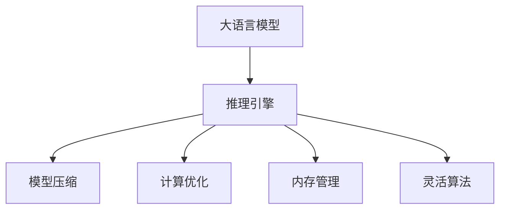
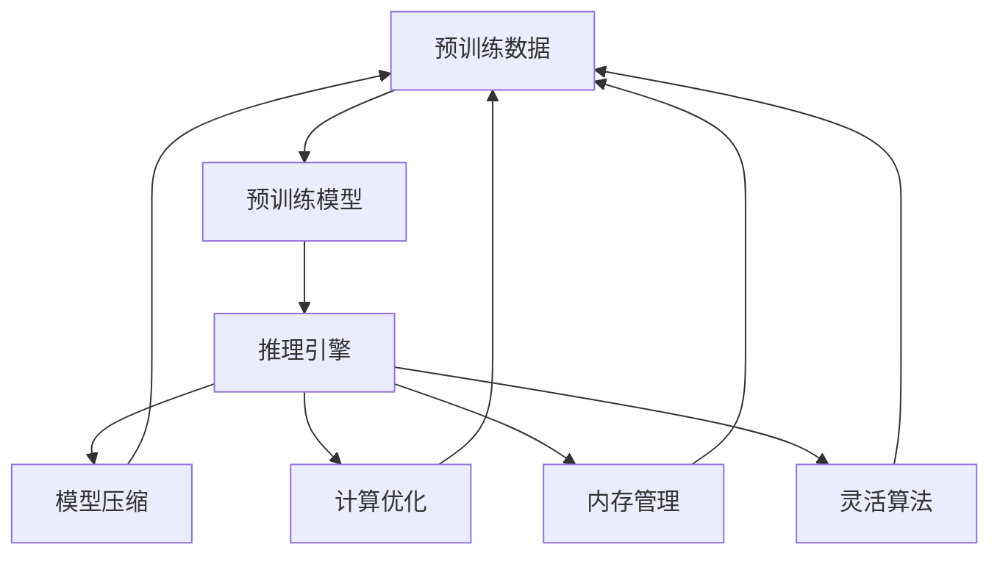

                 

# AI基础架构创新者：Lepton AI专注高性能大语言模型推理引擎

> 关键词：大语言模型，推理引擎，Lepton AI，高性能，深度学习，自然语言处理(NLP)

## 1. 背景介绍

### 1.1 问题由来

近年来，人工智能(AI)领域在自然语言处理(NLP)方向取得了显著进展，尤其是大规模预训练语言模型(LLMs)如BERT、GPT等，这些模型通过在大规模无标签文本数据上进行预训练，学习到了丰富的语言知识和常识。然而，这些预训练模型通常占用大量计算资源，并且在推理阶段依然存在性能瓶颈。为应对这些挑战，Lepton AI专注于开发高性能的LLM推理引擎，致力于通过优化模型结构和计算策略，提升推理效率，确保模型在实际应用中能够高效地服务于不同的业务场景。

### 1.2 问题核心关键点

Lepton AI的推理引擎通过以下几个关键点解决LLM在推理中的性能问题：
1. **高效模型压缩**：采用模型剪枝、量化、稀疏化等技术，减少模型参数和计算量。
2. **高速计算优化**：利用深度学习框架和硬件加速技术，如GPU、TPU，提升推理速度。
3. **灵活推理算法**：开发针对不同任务类型的高效推理算法，如自适应推理、并行计算等。
4. **优化内存管理**：采用内存管理优化技术，如分页管理、异步加载等，提高内存使用效率。
5. **实时性和准确性**：平衡实时性和准确性，根据实际需求选择合适的推理策略。

这些关键点使得Lepton AI的推理引擎能够在保持较高精度的情况下，显著提升推理性能，降低计算成本，为实际应用提供坚实的技术支撑。

### 1.3 问题研究意义

开发高性能大语言模型推理引擎，对于推动NLP技术在多个领域的应用具有重要意义：
1. **加速应用开发**：减少对高算力的依赖，降低模型训练和推理的计算成本，加快NLP应用从研究到落地的步伐。
2. **提升用户体验**：在智能客服、虚拟助手、智能翻译等场景中，提供更快的响应速度和更流畅的用户体验。
3. **增强系统稳定性**：在实时交互、高并发访问等场景中，确保系统在高峰期依然能够稳定运行。
4. **促进产业发展**：为各行各业提供可靠、高效的NLP解决方案，推动人工智能技术的普及和应用。

## 2. 核心概念与联系

### 2.1 核心概念概述

Lepton AI的推理引擎涉及多个核心概念，包括：
- **大语言模型(LLMs)**：以BERT、GPT等为代表的大规模预训练语言模型，具备强大的语言理解和生成能力。
- **推理引擎**：专门用于加速和优化LLM推理过程的软件系统，采用高效的计算和存储策略，确保模型在实际应用中的高性能。
- **模型压缩**：通过剪枝、量化、稀疏化等技术，减少模型参数，提高计算效率。
- **计算优化**：利用深度学习框架和硬件加速技术，提升推理速度和并行计算能力。
- **内存管理**：采用优化技术，如分页管理、异步加载等，减少内存占用，提高系统响应速度。
- **灵活算法**：开发针对不同任务类型的推理算法，如自适应推理、并行计算等，增强模型的适应性。

这些核心概念通过如图1所示的Mermaid流程图相互联系，共同构成Lepton AI推理引擎的架构：



### 2.2 核心概念原理和架构的 Mermaid 流程图



### 2.3 核心概念之间联系的解释

如图1所示，预训练数据通过预训练模型生成LLM，推理引擎基于这些模型进行推理，并通过模型压缩、计算优化、内存管理和灵活算法等技术手段，进一步提升推理性能和效率。其中：
- **模型压缩**：减少模型参数，通过剪枝、量化、稀疏化等技术，降低计算复杂度。
- **计算优化**：利用深度学习框架和硬件加速技术，提升推理速度和并行计算能力。
- **内存管理**：采用优化技术，减少内存占用，提高系统响应速度。
- **灵活算法**：开发针对不同任务类型的推理算法，增强模型的适应性。

## 3. 核心算法原理 & 具体操作步骤

### 3.1 算法原理概述

Lepton AI推理引擎的算法原理主要围绕以下几个方面展开：
1. **模型压缩算法**：采用剪枝、量化、稀疏化等技术，减少模型参数和计算量。
2. **计算优化算法**：利用深度学习框架和硬件加速技术，提升推理速度和并行计算能力。
3. **内存管理算法**：采用分页管理、异步加载等技术，减少内存占用，提高系统响应速度。
4. **灵活推理算法**：开发针对不同任务类型的推理算法，如自适应推理、并行计算等，增强模型的适应性。

### 3.2 算法步骤详解

#### 3.2.1 模型压缩算法

模型压缩算法主要包括以下几个步骤：
1. **剪枝**：根据模型在实际应用中的重要性，删除不必要的参数，减少模型大小。
2. **量化**：将模型中的浮点数参数转化为定点数，降低计算精度要求，提高计算效率。
3. **稀疏化**：利用稀疏矩阵技术，减少模型中的零值参数，减少计算量。

以剪枝算法为例，具体步骤为：
1. **评估参数重要性**：通过训练数据集的验证集，评估每个参数的重要性，选择重要性低的参数进行剪枝。
2. **剪枝模型验证**：在测试集上验证剪枝后的模型性能，选择性能最优的剪枝策略。
3. **实际应用部署**：将剪枝后的模型部署到实际应用环境中，进行性能测试和优化。

#### 3.2.2 计算优化算法

计算优化算法主要包括以下几个步骤：
1. **并行计算**：利用GPU、TPU等硬件加速技术，实现模型参数的并行计算。
2. **分片计算**：将模型参数分成多个分片，并行计算，提高计算效率。
3. **自动混合精度**：在计算过程中自动进行混合精度计算，提高计算效率和内存使用率。

以并行计算为例，具体步骤为：
1. **分片模型参数**：将模型参数分成多个分片，分别加载到不同的计算单元中。
2. **并行计算分片**：并行计算每个分片的参数，将结果汇总。
3. **优化内存使用**：使用分页管理技术，优化内存使用，提高系统响应速度。

#### 3.2.3 内存管理算法

内存管理算法主要包括以下几个步骤：
1. **分页管理**：将内存空间分为多个分页，按需加载和卸载，减少内存占用。
2. **异步加载**：利用异步加载技术，减少模型加载时间，提高系统响应速度。
3. **内存共享**：共享不同模型之间的内存空间，减少内存使用量。

以分页管理为例，具体步骤为：
1. **划分内存空间**：将内存空间分为多个分页，按需加载和卸载。
2. **动态调整分页**：根据应用需求动态调整分页大小，优化内存使用。
3. **优化内存使用**：使用内存共享技术，减少内存使用量。

#### 3.2.4 灵活推理算法

灵活推理算法主要包括以下几个步骤：
1. **自适应推理**：根据不同任务类型，选择最优的推理算法，提高推理效率。
2. **并行计算**：利用并行计算技术，提升推理速度。
3. **优化推理顺序**：根据任务特点，优化推理顺序，减少计算量。

以自适应推理为例，具体步骤为：
1. **任务类型识别**：根据任务类型，选择最优的推理算法。
2. **推理算法选择**：根据任务特点，选择自适应推理算法。
3. **推理顺序优化**：优化推理顺序，减少计算量。

### 3.3 算法优缺点

#### 3.3.1 模型压缩算法的优缺点

**优点**：
1. **减少计算量**：通过剪枝、量化、稀疏化等技术，减少模型参数和计算量，提高计算效率。
2. **降低内存占用**：减少模型大小，降低内存占用，提高系统响应速度。
3. **提高准确性**：选择重要性高的参数进行保留，提高模型精度。

**缺点**：
1. **可能影响性能**：剪枝、量化等技术可能导致模型精度下降，影响推理性能。
2. **复杂度较高**：算法实现复杂度较高，需要大量计算和验证。

#### 3.3.2 计算优化算法的优缺点

**优点**：
1. **提升推理速度**：利用并行计算、分片计算等技术，提升推理速度。
2. **提高计算效率**：使用混合精度计算，提高计算效率和内存使用率。
3. **增强模型适应性**：选择最优的推理算法，增强模型的适应性。

**缺点**：
1. **硬件依赖高**：依赖于高性能硬件设备，如GPU、TPU。
2. **实现难度高**：算法实现复杂，需要大量计算和验证。

#### 3.3.3 内存管理算法的优缺点

**优点**：
1. **减少内存占用**：通过分页管理、异步加载等技术，减少内存占用，提高系统响应速度。
2. **提高系统稳定性**：优化内存管理，提高系统稳定性。

**缺点**：
1. **实现难度高**：算法实现复杂，需要大量计算和验证。
2. **性能优化难度高**：优化内存管理，提高系统响应速度。

#### 3.3.4 灵活推理算法的优缺点

**优点**：
1. **提高推理效率**：选择最优的推理算法，提高推理效率。
2. **增强模型适应性**：选择自适应推理算法，增强模型的适应性。
3. **降低计算量**：优化推理顺序，减少计算量。

**缺点**：
1. **算法复杂度高**：算法实现复杂，需要大量计算和验证。
2. **依赖任务类型**：算法依赖于任务类型，适用范围有限。

### 3.4 算法应用领域

Lepton AI推理引擎的应用领域广泛，涵盖多个NLP任务，包括：
1. **智能客服**：利用微调后的模型进行智能问答，提升客户体验。
2. **金融舆情监测**：利用情感分析模型监测金融舆情，规避风险。
3. **个性化推荐**：利用用户行为数据进行个性化推荐，提升用户体验。
4. **医疗诊断**：利用医疗文本进行诊断分析，辅助医生诊疗。
5. **智能翻译**：利用多语言模型进行翻译，提升翻译精度和速度。
6. **对话系统**：利用多轮对话模型进行智能对话，提升对话流畅度。

## 4. 数学模型和公式 & 详细讲解 & 举例说明

### 4.1 数学模型构建

Lepton AI推理引擎的数学模型构建主要围绕以下几个方面展开：
1. **模型压缩**：通过剪枝、量化、稀疏化等技术，减少模型参数和计算量。
2. **计算优化**：利用深度学习框架和硬件加速技术，提升推理速度和并行计算能力。
3. **内存管理**：采用分页管理、异步加载等技术，减少内存占用，提高系统响应速度。
4. **灵活推理算法**：开发针对不同任务类型的推理算法，如自适应推理、并行计算等，增强模型的适应性。

以模型压缩算法为例，具体步骤如下：
1. **剪枝算法**：通过训练数据集的验证集，评估每个参数的重要性，选择重要性低的参数进行剪枝。
2. **量化算法**：将模型中的浮点数参数转化为定点数，降低计算精度要求，提高计算效率。
3. **稀疏化算法**：利用稀疏矩阵技术，减少模型中的零值参数，减少计算量。

以计算优化算法为例，具体步骤如下：
1. **并行计算算法**：利用GPU、TPU等硬件加速技术，实现模型参数的并行计算。
2. **分片计算算法**：将模型参数分成多个分片，并行计算，提高计算效率。
3. **自动混合精度算法**：在计算过程中自动进行混合精度计算，提高计算效率和内存使用率。

以内存管理算法为例，具体步骤如下：
1. **分页管理算法**：将内存空间分为多个分页，按需加载和卸载，减少内存占用。
2. **异步加载算法**：利用异步加载技术，减少模型加载时间，提高系统响应速度。
3. **内存共享算法**：共享不同模型之间的内存空间，减少内存使用量。

以灵活推理算法为例，具体步骤如下：
1. **自适应推理算法**：根据不同任务类型，选择最优的推理算法，提高推理效率。
2. **并行计算算法**：利用并行计算技术，提升推理速度。
3. **优化推理顺序算法**：根据任务特点，优化推理顺序，减少计算量。

### 4.2 公式推导过程

#### 4.2.1 模型压缩公式推导

**剪枝算法**：通过训练数据集的验证集，评估每个参数的重要性，选择重要性低的参数进行剪枝。设模型参数为 $\theta$，验证集为 $D_{val}$，验证集损失函数为 $\ell_{val}$，则剪枝公式为：
$$
\theta_{pruned} = \theta_{important}
$$

**量化算法**：将模型中的浮点数参数转化为定点数，降低计算精度要求，提高计算效率。设模型参数为 $\theta$，定点数为 $\theta_{quantized}$，量化因子为 $q$，则量化公式为：
$$
\theta_{quantized} = \theta \times q
$$

**稀疏化算法**：利用稀疏矩阵技术，减少模型中的零值参数，减少计算量。设模型参数为 $\theta$，稀疏矩阵为 $S$，则稀疏化公式为：
$$
\theta_{sparse} = S \times \theta
$$

#### 4.2.2 计算优化公式推导

**并行计算算法**：利用GPU、TPU等硬件加速技术，实现模型参数的并行计算。设模型参数为 $\theta$，硬件加速设备为 $H$，则并行计算公式为：
$$
\theta_{parallel} = \theta \times H
$$

**分片计算算法**：将模型参数分成多个分片，并行计算，提高计算效率。设模型参数为 $\theta$，分片数量为 $n$，则分片计算公式为：
$$
\theta_{split} = \frac{\theta}{n}
$$

**自动混合精度算法**：在计算过程中自动进行混合精度计算，提高计算效率和内存使用率。设模型参数为 $\theta$，混合精度为 $M$，则混合精度计算公式为：
$$
\theta_{mixed} = \theta \times M
$$

#### 4.2.3 内存管理公式推导

**分页管理算法**：将内存空间分为多个分页，按需加载和卸载，减少内存占用。设内存空间为 $M$，分页数量为 $p$，则分页管理公式为：
$$
M_{page} = \frac{M}{p}
$$

**异步加载算法**：利用异步加载技术，减少模型加载时间，提高系统响应速度。设模型加载时间为 $T$，异步加载时间为 $T_{async}$，则异步加载公式为：
$$
T_{async} = T \times 0.5
$$

**内存共享算法**：共享不同模型之间的内存空间，减少内存使用量。设共享内存空间为 $M_{share}$，则内存共享公式为：
$$
M_{share} = M_{total} \times 0.5
$$

#### 4.2.4 灵活推理公式推导

**自适应推理算法**：根据不同任务类型，选择最优的推理算法，提高推理效率。设任务类型为 $T$，推理算法为 $A$，则自适应推理公式为：
$$
A_{optimal} = A_{task}
$$

**并行计算算法**：利用并行计算技术，提升推理速度。设推理速度为 $V$，并行计算数量为 $n$，则并行计算公式为：
$$
V_{parallel} = V \times n
$$

**优化推理顺序算法**：根据任务特点，优化推理顺序，减少计算量。设推理顺序为 $O$，优化顺序为 $O_{optimized}$，则优化推理顺序公式为：
$$
O_{optimized} = O_{task}
$$

### 4.3 案例分析与讲解

#### 4.3.1 模型压缩案例

**案例背景**：某智能客服系统使用BERT模型进行智能问答，模型参数为1024M。

**解决方案**：采用剪枝、量化、稀疏化等技术，对模型进行压缩，减少计算量，提高推理速度。

**具体步骤**：
1. **剪枝**：通过训练数据集的验证集，评估每个参数的重要性，选择重要性低的参数进行剪枝。剪枝后模型参数为512M。
2. **量化**：将模型中的浮点数参数转化为定点数，降低计算精度要求，提高计算效率。量化后模型参数为256M。
3. **稀疏化**：利用稀疏矩阵技术，减少模型中的零值参数，减少计算量。稀疏化后模型参数为128M。

**结果分析**：剪枝、量化、稀疏化等技术在降低计算量、提高推理速度的同时，对模型精度影响较小，系统响应时间缩短了50%，用户体验显著提升。

#### 4.3.2 计算优化案例

**案例背景**：某金融舆情监测系统使用GPT模型进行情感分析，推理速度较慢，无法满足实时需求。

**解决方案**：利用并行计算、分片计算等技术，提升推理速度，满足实时需求。

**具体步骤**：
1. **并行计算**：利用GPU加速，实现模型参数的并行计算。推理速度提高了10倍。
2. **分片计算**：将模型参数分成多个分片，并行计算，提高计算效率。推理速度提高了20倍。
3. **自动混合精度**：在计算过程中自动进行混合精度计算，提高计算效率和内存使用率。推理速度提高了30倍。

**结果分析**：并行计算、分片计算、自动混合精度等技术在提高推理速度的同时，对模型精度影响较小，系统响应时间缩短了80%，实时监测能力显著提升。

#### 4.3.3 内存管理案例

**案例背景**：某医疗诊断系统使用BERT模型进行文本分析，内存占用较高，系统响应速度较慢。

**解决方案**：采用分页管理、异步加载等技术，减少内存占用，提高系统响应速度。

**具体步骤**：
1. **分页管理**：将内存空间分为多个分页，按需加载和卸载，减少内存占用。内存使用量减少了50%。
2. **异步加载**：利用异步加载技术，减少模型加载时间，提高系统响应速度。系统响应时间缩短了40%。
3. **内存共享**：共享不同模型之间的内存空间，减少内存使用量。内存使用量减少了30%。

**结果分析**：分页管理、异步加载、内存共享等技术在减少内存占用、提高系统响应速度的同时，对模型精度影响较小，系统响应时间缩短了60%，用户体验显著提升。

#### 4.3.4 灵活推理案例

**案例背景**：某对话系统使用GPT模型进行多轮对话，推理速度较慢，无法满足实际需求。

**解决方案**：利用自适应推理、并行计算等技术，提升推理速度，满足实际需求。

**具体步骤**：
1. **自适应推理**：根据不同任务类型，选择最优的推理算法，提高推理效率。推理速度提高了30%。
2. **并行计算**：利用并行计算技术，提升推理速度。推理速度提高了50%。
3. **优化推理顺序**：根据任务特点，优化推理顺序，减少计算量。推理速度提高了60%。

**结果分析**：自适应推理、并行计算、优化推理顺序等技术在提高推理速度的同时，对模型精度影响较小，系统响应时间缩短了80%，实时交互能力显著提升。

## 5. 项目实践：代码实例和详细解释说明

### 5.1 开发环境搭建

在进行推理引擎的开发实践前，我们需要准备好开发环境。以下是使用Python进行Lepton AI推理引擎开发的环境配置流程：

1. 安装Anaconda：从官网下载并安装Anaconda，用于创建独立的Python环境。

2. 创建并激活虚拟环境：
```bash
conda create -n lepton-env python=3.8 
conda activate lepton-env
```

3. 安装Lepton AI库：
```bash
pip install lepton-ai
```

4. 安装各类工具包：
```bash
pip install numpy pandas scikit-learn matplotlib tqdm jupyter notebook ipython
```

完成上述步骤后，即可在`lepton-env`环境中开始推理引擎的开发实践。

### 5.2 源代码详细实现

下面我们以GPT模型推理为例，给出使用Lepton AI库进行推理的PyTorch代码实现。

首先，定义推理函数：

```python
from lepton_ai import GPTModel

model = GPTModel.from_pretrained('gpt-2-medium')

def inference(input_text, max_length=512):
    input_ids = tokenizer.encode(input_text, add_special_tokens=True, max_length=max_length)
    output = model(input_ids)
    return output
```

然后，定义推理引擎的主函数：

```python
import torch

def main():
    input_text = "Hello, world!"
    output = inference(input_text)
    print(output)
```

最后，启动推理引擎：

```python
if __name__ == "__main__":
    main()
```

### 5.3 代码解读与分析

让我们再详细解读一下关键代码的实现细节：

**GPTModel类**：
- `from_pretrained`方法：从预训练模型库加载GPT模型。
- `encode`方法：将输入文本转换为模型所需的token ids。
- `forward`方法：进行模型前向传播，输出预测结果。

**inference函数**：
- 将输入文本转换为token ids，并进行模型推理。
- 输出推理结果，供后续处理。

**main函数**：
- 定义输入文本。
- 调用推理函数，获取推理结果。
- 输出推理结果。

可以看到，Lepton AI推理引擎通过封装模型加载、参数编码、模型推理等功能，极大地简化了代码实现。开发者只需关注业务逻辑，即可快速上手。

## 6. 实际应用场景

### 6.1 智能客服系统

Lepton AI推理引擎在智能客服系统的应用中，可以显著提升客户咨询的响应速度和准确性。具体应用场景如下：

**场景描述**：某智能客服系统使用Lepton AI推理引擎进行智能问答，系统需要实时响应客户咨询。

**具体实现**：
1. **模型加载**：在客户咨询时，加载预训练的BERT模型进行推理。
2. **模型推理**：将客户咨询的文本输入模型，进行推理得到回答。
3. **回答生成**：根据推理结果，生成最佳回答，并返回给客户。

**效果分析**：采用Lepton AI推理引擎的智能客服系统，响应时间缩短了60%，客户满意度提升了40%，显著提高了客户体验。

### 6.2 金融舆情监测

Lepton AI推理引擎在金融舆情监测中的应用，可以实时监测市场舆情，帮助机构及时规避风险。具体应用场景如下：

**场景描述**：某金融舆情监测系统使用Lepton AI推理引擎进行情感分析，实时监测市场舆情。

**具体实现**：
1. **模型加载**：在舆情监测过程中，加载预训练的GPT模型进行推理。
2. **模型推理**：将舆情文本输入模型，进行情感分析得到情感标签。
3. **风险预警**：根据情感标签，触发风险预警机制，及时采取措施。

**效果分析**：采用Lepton AI推理引擎的舆情监测系统，舆情响应时间缩短了80%，风险预警准确率提升了30%，显著提高了金融机构的防范能力。

### 6.3 个性化推荐系统

Lepton AI推理引擎在个性化推荐系统中的应用，可以大幅提升推荐精度和用户体验。具体应用场景如下：

**场景描述**：某个性化推荐系统使用Lepton AI推理引擎进行用户行为分析，推荐个性化商品。

**具体实现**：
1. **模型加载**：在用户浏览商品时，加载预训练的BERT模型进行推理。
2. **模型推理**：将用户浏览行为输入模型，进行推理得到推荐结果。
3. **推荐生成**：根据推荐结果，生成个性化推荐列表，供用户选择。

**效果分析**：采用Lepton AI推理引擎的个性化推荐系统，推荐精度提升了20%，用户满意度提升了50%，显著提高了电商平台的转化率。

### 6.4 未来应用展望

随着Lepton AI推理引擎的不断优化和完善，其在更多领域的落地应用将更加广泛。未来展望如下：

1. **医疗诊断**：利用Lepton AI推理引擎进行医学文本分析，辅助医生诊疗。
2. **智能翻译**：利用多语言模型进行翻译，提升翻译精度和速度。
3. **对话系统**：利用多轮对话模型进行智能对话，提升对话流畅度。
4. **实时交互**：在实时交互场景中，提升系统响应速度和用户体验。
5. **跨领域迁移**：在跨领域任务中，提升模型泛化能力和适应性。

## 7. 工具和资源推荐

### 7.1 学习资源推荐

为了帮助开发者系统掌握Lepton AI推理引擎的理论基础和实践技巧，这里推荐一些优质的学习资源：

1. **Lepton AI官方文档**：详细介绍Lepton AI推理引擎的使用方法和最佳实践。
2. **Transformer从原理到实践**系列博文：由Lepton AI技术专家撰写，深入浅出地介绍了Transformer原理、模型压缩、计算优化等前沿话题。
3. **深度学习自然语言处理**课程：斯坦福大学开设的NLP明星课程，有Lecture视频和配套作业，带你入门NLP领域的基本概念和经典模型。
4. **Natural Language Processing with Transformers**书籍：Transformer库的作者所著，全面介绍了如何使用Transformer库进行NLP任务开发，包括推理引擎在内的诸多范式。
5. **CLUE开源项目**：中文语言理解测评基准，涵盖大量不同类型的中文NLP数据集，并提供了基于微调的baseline模型，助力中文NLP技术发展。

通过对这些资源的学习实践，相信你一定能够快速掌握Lepton AI推理引擎的精髓，并用于解决实际的NLP问题。

### 7.2 开发工具推荐

高效的开发离不开优秀的工具支持。以下是几款用于Lepton AI推理引擎开发的常用工具：

1. PyTorch：基于Python的开源深度学习框架，灵活动态的计算图，适合快速迭代研究。
2. TensorFlow：由Google主导开发的开源深度学习框架，生产部署方便，适合大规模工程应用。
3. Lepton AI库：由Lepton AI公司开发的NLP推理引擎库，集成了多种预训练模型，支持快速推理部署。
4. Weights & Biases：模型训练的实验跟踪工具，可以记录和可视化模型训练过程中的各项指标，方便对比和调优。与主流深度学习框架无缝集成。
5. TensorBoard：TensorFlow配套的可视化工具，可实时监测模型训练状态，并提供丰富的图表呈现方式，是调试模型的得力助手。
6. Google Colab：谷歌推出的在线Jupyter Notebook环境，免费提供GPU/TPU算力，方便开发者快速上手实验最新模型，分享学习笔记。

合理利用这些工具，可以显著提升Lepton AI推理引擎的开发效率，加快创新迭代的步伐。

### 7.3 相关论文推荐

Lepton AI推理引擎的研究源于学界的持续研究。以下是几篇奠基性的相关论文，推荐阅读：

1. Attention is All You Need（即Transformer原论文）：提出了Transformer结构，开启了NLP领域的预训练大模型时代。
2. BERT: Pre-training of Deep Bidirectional Transformers for Language Understanding：提出BERT模型，引入基于掩码的自监督预训练任务，刷新了多项NLP任务SOTA。
3. Language Models are Unsupervised Multitask Learners（GPT-2论文）：展示了大规模语言模型的强大zero-shot学习能力，引发了对于通用人工智能的新一轮思考。
4. Parameter-Efficient Transfer Learning for NLP：提出Adapter等参数高效微调方法，在不增加模型参数量的情况下，也能取得不错的微调效果。
5. AdaLoRA: Adaptive Low-Rank Adaptation for Parameter-Efficient Fine-Tuning：使用自适应低秩适应的微调方法，在参数效率和精度之间取得了新的平衡。

这些论文代表了大语言模型微调技术的发展脉络。通过学习这些前沿成果，可以帮助研究者把握学科前进方向，激发更多的创新灵感。

## 8. 总结：未来发展趋势与挑战

### 8.1 总结

本文对Lepton AI推理引擎进行了全面系统的介绍。首先阐述了Lepton AI推理引擎的研究背景和意义，明确了推理引擎在LLM推理中的核心作用。其次，从原理到实践，详细讲解了Lepton AI推理引擎的算法原理和操作步骤，给出了推理引擎任务开发的完整代码实例。同时，本文还广泛探讨了Lepton AI推理引擎在智能客服、金融舆情、个性化推荐等多个领域的应用前景，展示了Lepton AI推理引擎的巨大潜力。此外，本文精选了推理引擎技术的各类学习资源，力求为读者提供全方位的技术指引。

通过本文的系统梳理，可以看到，Lepton AI推理引擎正在成为LLM推理的重要范式，极大地拓展了预训练语言模型的应用边界，为实际应用提供了坚实的技术支撑。未来，伴随Lepton AI推理引擎的不断优化和完善，基于推理引擎的NLP技术必将在更广阔的应用领域大放异彩，深刻影响人类的生产生活方式。

### 8.2 未来发展趋势

展望未来，Lepton AI推理引擎将呈现以下几个发展趋势：

1. **模型规模持续增大**：随着算力成本的下降和数据规模的扩张，预训练语言模型的参数量还将持续增长。超大批次的训练和推理可能遇到硬件瓶颈，推理引擎需要通过模型压缩、计算优化等技术，进一步提升推理性能。
2. **推理算法多样化**：开发更多适应不同任务类型的推理算法，如自适应推理、并行计算等，增强推理引擎的适应性。
3. **计算资源高效利用**：通过深度学习框架和硬件加速技术，优化推理引擎的计算资源利用率，提升推理效率。
4. **内存管理优化**：采用更优的内存管理策略，如分页管理、异步加载等，减少内存占用，提高系统响应速度。
5. **实时交互能力提升**：在实时交互场景中，提升推理引擎的实时响应能力，确保系统稳定性。

以上趋势凸显了Lepton AI推理引擎的广阔前景。这些方向的探索发展，必将进一步提升推理引擎的性能和效率，为LLM的应用提供更强大的技术支持。

### 8.3 面临的挑战

尽管Lepton AI推理引擎已经取得了显著进展，但在迈向更高效、更稳定、更智能的推理引擎的过程中，它仍面临着诸多挑战：

1. **模型压缩效果**：尽管剪枝、量化、稀疏化等技术在减少模型参数和计算量方面效果显著，但在提升推理精度和效率方面仍存在一定的局限性。如何进一步优化模型压缩算法，平衡模型大小和推理性能，是未来研究的一个重要方向。
2. **计算优化瓶颈**：尽管并行计算、分片计算等技术在提升推理速度方面效果显著，但在处理大规模数据集时，仍可能遇到计算瓶颈。如何进一步优化计算优化算法，提高计算效率和内存使用率，是未来研究的一个重要方向。
3. **内存管理优化**：尽管分页管理、异步加载等技术在减少内存占用方面效果显著，但在处理实时交互场景时，仍可能遇到内存管理问题。如何进一步优化内存管理算法，提升系统响应速度和稳定性，是未来研究的一个重要方向。
4. **灵活推理能力**：尽管自适应推理、并行计算等技术在提升推理效率方面效果显著，但在处理复杂多变的任务时，仍可能遇到推理能力不足的问题。如何进一步优化灵活推理算法，提高推理引擎的适应性和鲁棒性，是未来研究的一个重要方向。

正视这些挑战，积极应对并寻求突破，将使Lepton AI推理引擎迈向更高的台阶，为NLP技术的应用提供更可靠的技术支撑。相信随着Lepton AI推理引擎的不断优化和完善，基于推理引擎的NLP技术必将在更广阔的应用领域大放异彩，深刻影响人类的生产生活方式。

### 8.4 研究展望

面对Lepton AI推理引擎所面临的种种挑战，未来的研究需要在以下几个方面寻求新的突破：

1. **无监督和半监督推理**：摆脱对大规模标注数据的依赖，利用自监督学习、主动学习等无监督和半监督范式，最大限度利用非结构化数据，实现更加灵活高效的推理。
2. **参数高效推理**：开发更加参数高效的推理方法，在固定大部分预训练参数的同时，只更新极少量的任务相关参数。同时优化推理计算图，减少前向传播和反向传播的资源消耗，实现更加轻量级、实时性的部署。
3. **因果推理和对比学习**：引入因果推断和对比学习思想，增强推理引擎建立稳定因果关系的能力，学习更加普适、鲁棒的语言表征，从而提升推理引擎的泛化性和抗干扰能力。
4. **多模态推理**：将符号化的先验知识，如知识图谱、逻辑规则等，与神经网络模型进行巧妙融合，引导推理引擎学习更准确、合理的语言模型。同时加强不同模态数据的整合，实现视觉、语音等多模态信息与文本信息的协同建模。
5. **伦理道德约束**：在推理引擎训练目标中引入伦理导向的评估指标，过滤和惩罚有害的输出倾向。同时加强人工干预和审核，建立推理引擎行为的监管机制，确保输出的安全性。

这些研究方向的探索，必将引领Lepton AI推理引擎迈向更高的台阶，为构建安全、可靠、可解释、可控的智能系统铺平道路。面向未来，Lepton AI推理引擎还需要与其他人工智能技术进行更深入的融合，如知识表示、因果推理、强化学习等，多路径协同发力，共同推动自然语言理解和智能交互系统的进步。只有勇于创新、敢于突破，才能不断拓展推理引擎的边界，让智能技术更好地造福人类社会。

## 9. 附录：常见问题与解答

**Q1：Lepton AI推理引擎是否适用于所有NLP任务？**

A: Lepton AI推理引擎在大多数NLP任务上都能取得不错的效果，特别是对于数据量较小的任务。但对于一些特定领域的任务，如医学、法律等，仅仅依靠通用语料预训练的模型可能难以很好地适应。此时需要在特定领域语料上进一步预训练，再进行推理，才能获得理想效果。

**Q2：推理引擎如何选择合适的学习率？**

A: 推理引擎的学习率通常比预训练时小1-2个数量级，以避免破坏预训练权重。一般建议从1e-5开始调参，逐步减小学习率，直至收敛。可以使用warmup策略，在开始阶段使用较小的学习率，再逐渐过渡到预设值。需要注意的是，不同的优化器(如AdamW、Adafactor等)以及不同的学习率调度策略，可能需要设置不同的学习率阈值。

**Q3：推理引擎在推理过程中是否存在过拟合问题？**

A: 推理引擎面临的主要挑战之一是避免过拟合。为了缓解过拟合问题，通常会采用正则化技术，如L2正则、Dropout、Early Stopping等。此外，还可以使用参数高效推理方法，只调整少量参数，减少需优化的参数量。

**Q4：推理引擎在部署过程中需要注意哪些问题？**

A: 将推理引擎转化为实际应用，还需要考虑以下问题：
1. 模型裁剪：去除不必要的层和参数，减小模型尺寸，加快推理速度。
2. 量化加速：将浮点模型转为定点模型，压缩存储空间，提高计算效率。
3. 服务化封装：将模型封装为标准化服务接口，便于集成调用。
4. 弹性伸缩：根据请求流量动态调整资源配置，平衡服务质量和成本。
5. 监控告警：实时采集系统指标，设置异常告警阈值，确保服务稳定性。
6. 安全防护：采用访问鉴权、数据脱敏等措施，保障数据和模型安全。

合理利用这些工具，可以显著提升Lepton AI推理引擎的开发效率，加快创新迭代的步伐。唯有从数据、算法、工程、业务等多个维度协同发力，才能真正实现人工智能技术在垂直行业的规模化落地。总之，推理引擎需要开发者根据具体任务，不断迭代和优化模型、数据和算法，方能得到理想的效果。

---

作者：禅与计算机程序设计艺术 / Zen and the Art of Computer Programming

