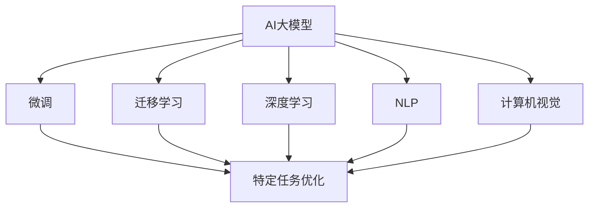

                 

## 1. 背景介绍

### 1.1 问题由来
近年来，随着深度学习技术的飞速发展，AI大模型在各行各业的应用逐渐火热。AI大模型不仅拥有强大的自我学习能力，还能通过微调（fine-tuning）和迁移学习（transfer learning）等方式，针对特定任务进行优化，进一步提升其性能和应用范围。在政策推动、技术突破和资本加持等多重因素的推动下，越来越多的企业开始布局AI大模型业务，意图通过AI大模型获得新的商业增长点。

然而，AI大模型创业并非一帆风顺。从市场调研到技术研发，再到商业化落地，每一步都充满了挑战。如何在激烈的竞争中突围，找到正确的商业模式和技术路径，成为当前AI大模型创业团队亟需解决的问题。

### 1.2 问题核心关键点
AI大模型创业的关键点在于以下几个方面：
- **市场定位**：确定产品或服务的目标市场，明确客户需求，制定市场策略。
- **技术研发**：构建核心技术团队，选择恰当的技术栈和算法模型，实现高质量的AI大模型。
- **商业模式**：选择合适的商业模式，实现AI大模型业务的可持续化发展。
- **商业化策略**：制定切实可行的商业化方案，提升AI大模型的市场渗透率。
- **风险应对**：识别潜在风险，制定应对策略，确保AI大模型业务的稳定性。

本文将从这些关键点出发，系统地介绍AI大模型创业的策略和实施路径，帮助创业团队有效应对市场挑战。

## 2. 核心概念与联系

### 2.1 核心概念概述

AI大模型创业涉及的核心概念包括：
- **AI大模型**：基于深度学习技术，采用大规模训练数据和复杂模型结构训练得到的通用或特定领域的知识表示模型。
- **微调（Fine-Tuning）**：在大模型基础上，针对特定任务进行调整，优化模型在该任务上的表现。
- **迁移学习**：将已在大规模数据上预训练的模型迁移到特定任务上，避免从头训练的消耗。
- **深度学习**：以神经网络为代表的机器学习技术，通过数据驱动的方式实现复杂的智能任务。
- **自然语言处理（NLP）**：AI大模型在处理和理解人类语言方面的应用。
- **计算机视觉（CV）**：AI大模型在图像和视频处理方面的应用。

这些概念相互关联，共同构成了AI大模型创业的技术基础。通过合理选择和组合这些技术手段，可以实现AI大模型在实际业务场景中的应用和推广。

### 2.2 核心概念原理和架构的 Mermaid 流程图



这个流程图展示了AI大模型与微调、迁移学习、深度学习、自然语言处理和计算机视觉之间的关系。其中，AI大模型作为核心，通过微调、迁移学习等技术手段，结合深度学习、NLP和CV等具体应用，完成对特定任务的优化和推广。

## 3. 核心算法原理 & 具体操作步骤

### 3.1 算法原理概述

AI大模型创业的核心算法原理基于深度学习和迁移学习。其核心思想是通过在大规模数据上进行预训练，获得通用知识表示，然后在特定任务上进行调整（微调），获得特定任务的高性能模型。

### 3.2 算法步骤详解

AI大模型创业的算法步骤主要包括：
1. **数据获取和预处理**：收集和清洗用于预训练和微调的数据集。
2. **模型选择与构建**：选择合适的模型架构和参数配置，构建预训练模型。
3. **预训练**：在大型数据集上对模型进行预训练，学习通用知识表示。
4. **微调**：在特定任务上对预训练模型进行微调，获得特定任务的高性能模型。
5. **商业化部署**：将训练好的模型部署到实际应用中，实现商业化落地。

### 3.3 算法优缺点

AI大模型创业的算法优点：
- **高效**：预训练和微调过程大大减少了从头训练模型的时间和计算资源消耗。
- **灵活性**：通过微调和迁移学习，模型可以适应不同的任务和领域。
- **准确性**：在大规模数据上进行预训练，模型可以获得较高的准确性和泛化能力。

缺点：
- **资源需求高**：预训练和微调过程需要大量的计算资源和存储资源。
- **过拟合风险**：模型在大规模数据上进行预训练后，可能存在过拟合问题，需要采取相应的正则化措施。
- **数据质量要求高**：预训练和微调效果受数据质量和多样性的影响较大。

### 3.4 算法应用领域

AI大模型创业的算法广泛应用于以下领域：
- **自然语言处理（NLP）**：如文本分类、情感分析、机器翻译、问答系统等。
- **计算机视觉（CV）**：如图像识别、物体检测、图像生成等。
- **语音处理**：如语音识别、语音合成、说话人识别等。
- **推荐系统**：如个性化推荐、广告推荐等。
- **医疗健康**：如医学影像分析、患者行为预测等。
- **金融服务**：如信用评估、风险管理等。

## 4. 数学模型和公式 & 详细讲解 & 举例说明

### 4.1 数学模型构建

AI大模型创业的数学模型构建主要基于神经网络和深度学习。以文本分类任务为例，数学模型可以表示为：

$$
y = \text{softmax}(W \cdot x + b)
$$

其中，$x$ 为输入文本的词向量表示，$W$ 为权重矩阵，$b$ 为偏置向量，$y$ 为输出概率分布。

### 4.2 公式推导过程

对于文本分类任务，可以使用交叉熵损失函数来训练模型：

$$
L = -\frac{1}{N} \sum_{i=1}^N \sum_{j=1}^K y_{ij} \log y_{ij}
$$

其中，$N$ 为样本数，$K$ 为类别数，$y_{ij}$ 为第 $i$ 个样本属于第 $j$ 个类别的真实概率，$y_{ij}$ 为模型预测的概率。

### 4.3 案例分析与讲解

以BERT模型为例，BERT模型在大规模无标签数据上进行预训练，学习了语言的上下文信息。在特定任务上进行微调时，只需要在其顶层添加任务相关的全连接层和激活函数，即可完成微调。例如，在情感分析任务上，可以添加一个sigmoid激活函数，输出0-1之间的概率值，表示文本的情感极性。

## 5. 项目实践：代码实例和详细解释说明

### 5.1 开发环境搭建

- **Python**：选择Python作为开发语言，使用pip安装所需的第三方库。
- **PyTorch**：选择PyTorch作为深度学习框架，使用conda安装所需的PyTorch版本和依赖。
- **GPU**：确保开发机器具备GPU计算能力，可以使用Google Colab等云平台进行远程开发。

### 5.2 源代码详细实现

以下是一个基于BERT模型的情感分析任务代码实现：

```python
import torch
import torch.nn as nn
from transformers import BertForSequenceClassification, BertTokenizer

class EmotionModel(nn.Module):
    def __init__(self, num_labels):
        super(EmotionModel, self).__init__()
        self.bert = BertForSequenceClassification.from_pretrained('bert-base-uncased', num_labels=num_labels)
        
    def forward(self, input_ids, attention_mask, token_type_ids=None):
        outputs = self.bert(input_ids, attention_mask=attention_mask, token_type_ids=token_type_ids)
        logits = outputs.logits
        return logits

# 数据准备
tokenizer = BertTokenizer.from_pretrained('bert-base-uncased')
inputs = tokenizer("I am happy today!", return_tensors="pt")
input_ids = inputs.input_ids
attention_mask = inputs.attention_mask

# 模型构建
model = EmotionModel(num_labels=2)
model.to('cuda')
criterion = nn.BCEWithLogitsLoss()
optimizer = torch.optim.Adam(model.parameters(), lr=2e-5)

# 模型训练
for epoch in range(10):
    model.train()
    optimizer.zero_grad()
    logits = model(input_ids, attention_mask)
    loss = criterion(logits, torch.tensor([1.0]))
    loss.backward()
    optimizer.step()
```

### 5.3 代码解读与分析

代码中，我们首先定义了一个继承自nn.Module的模型类EmotionModel，其中包含了BertForSequenceClassification模型。在模型中，我们定义了forward方法，用于计算模型的前向传播。在模型训练过程中，我们使用了BCEWithLogitsLoss作为损失函数，Adam作为优化器，确保模型在情感分析任务上的训练效果。

## 6. 实际应用场景

### 6.1 智能客服系统

智能客服系统可以通过AI大模型进行优化，提升客户体验和响应效率。具体实现时，可以使用微调后的模型对客户输入的文本进行情感分析，根据情感极性进行相应的回复。例如，对于负面情绪的客户咨询，系统可以自动跳转到人工客服，确保问题的及时解决。

### 6.2 金融风险管理

金融行业可以通过AI大模型进行风险评估和预警。例如，在贷款申请审批流程中，可以使用微调后的模型对申请人的信用记录、收入情况、社交媒体等数据进行综合分析，评估其信用风险，并提供风险预警。

### 6.3 医疗健康诊断

AI大模型在医疗健康领域也有广泛应用。例如，可以使用微调后的模型对医学影像进行自动分析，快速识别出病变区域，辅助医生进行诊断和治疗决策。

### 6.4 未来应用展望

随着AI大模型的不断发展，其在更多领域的应用将会得到拓展。例如，在教育、娱乐、交通等领域，AI大模型将发挥重要作用，提升整体行业的智能化水平。

## 7. 工具和资源推荐

### 7.1 学习资源推荐

- **《深度学习》**：Ian Goodfellow等著，详细介绍了深度学习的基础理论和技术。
- **《TensorFlow实战》**：Manning出版社，介绍了TensorFlow的搭建、训练和部署流程。
- **《PyTorch实战》**：O'Reilly出版社，介绍了PyTorch的使用方法和最佳实践。
- **《自然语言处理综述》**：由斯坦福大学CS224N课程提供，涵盖了NLP领域的经典理论和模型。

### 7.2 开发工具推荐

- **Google Colab**：提供了免费的GPU资源，方便进行远程开发和实验。
- **Jupyter Notebook**：支持Python和其他编程语言的开发，提供了便捷的交互式编程环境。
- **TensorBoard**：提供了可视化工具，方便监控和调试模型训练过程。

### 7.3 相关论文推荐

- **Attention is All You Need**：提出了Transformer模型，是AI大模型的重要基石。
- **BERT: Pre-training of Deep Bidirectional Transformers for Language Understanding**：介绍了BERT模型的预训练和微调方法。
- **Language Models are Unsupervised Multitask Learners**：展示了深度学习模型在无监督学习任务上的潜力。

## 8. 总结：未来发展趋势与挑战

### 8.1 研究成果总结

AI大模型创业技术在近年来取得了显著进展，已经在多个领域实现了商业化应用。未来，随着技术的不断进步和市场的不断扩大，AI大模型创业将面临更多的机遇和挑战。

### 8.2 未来发展趋势

未来，AI大模型创业将呈现以下发展趋势：
- **多模态融合**：AI大模型将实现跨模态数据的整合，提升模型的综合能力。
- **个性化定制**：AI大模型将根据用户需求进行定制化训练，提升用户体验。
- **实时化处理**：AI大模型将实现实时处理，提升响应速度和效率。

### 8.3 面临的挑战

AI大模型创业在发展过程中仍面临以下挑战：
- **数据隐私**：如何保护用户数据隐私，防止数据滥用。
- **算法公平性**：如何确保算法的公平性，防止算法偏见。
- **市场竞争**：如何在激烈的市场竞争中保持领先地位。
- **成本控制**：如何平衡成本和效益，确保企业的可持续发展。

### 8.4 研究展望

未来的AI大模型创业研究需要关注以下几个方面：
- **数据治理**：加强数据隐私保护和数据治理，确保数据安全。
- **算法透明**：提高算法的透明性和可解释性，增强用户信任。
- **伦理标准**：制定AI大模型伦理标准，确保其应用符合伦理道德。
- **跨领域应用**：推动AI大模型在更多领域的应用，提升产业智能化水平。

## 9. 附录：常见问题与解答

**Q1: AI大模型创业的商业化策略有哪些？**

A: AI大模型创业的商业化策略包括：
- **订阅制模式**：用户按月或按年订阅AI大模型的服务，支付固定费用。
- **按需付费模式**：用户根据使用量或调用次数支付费用，实现按需支付。
- **合作模式**：与行业客户进行合作，提供定制化解决方案，收取项目费用。

**Q2: AI大模型创业如何平衡成本和效益？**

A: AI大模型创业在平衡成本和效益时，可以从以下几个方面入手：
- **数据成本控制**：合理规划数据获取和存储成本，避免过度投资。
- **技术优化**：优化模型结构和算法，提升模型效率，减少计算资源消耗。
- **服务化部署**：将AI大模型部署到云平台上，实现资源共享和弹性伸缩。

**Q3: 如何应对AI大模型创业中的数据隐私问题？**

A: 应对AI大模型创业中的数据隐私问题，可以采取以下措施：
- **数据匿名化**：对用户数据进行匿名化处理，保护用户隐私。
- **加密传输**：使用加密技术对数据传输进行保护，防止数据泄露。
- **隐私保护技术**：引入隐私保护技术，如差分隐私、联邦学习等，确保数据安全。

**Q4: AI大模型创业的伦理问题如何解决？**

A: 解决AI大模型创业的伦理问题，可以采取以下措施：
- **伦理标准制定**：制定AI大模型的伦理标准，确保其应用符合伦理道德。
- **透明化机制**：提高算法的透明性和可解释性，增强用户信任。
- **社会责任**：明确企业的社会责任，确保AI大模型的应用不会对社会造成负面影响。

---

作者：禅与计算机程序设计艺术 / Zen and the Art of Computer Programming

